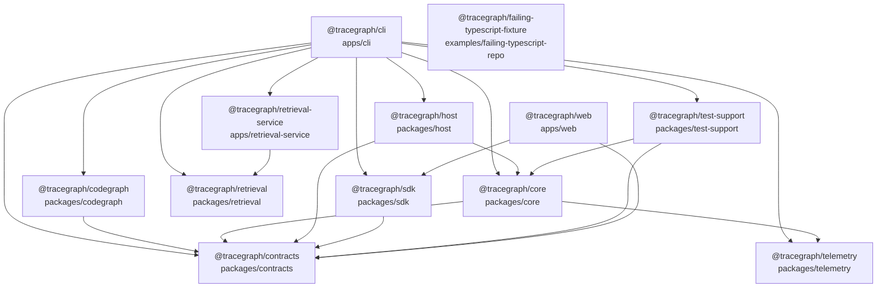

<!-- Generated by `pnpm graph:modules`; edit source or generator instead. -->
# Package and module graph

Generated from 12 workspace packages, 248 source modules, and 787 resolved module import edges.
External imports and imports that do not resolve to a workspace source file are omitted.

## Workspace package graph



## Source module graph

```mermaid
graph LR
  m_apps_cli_src_composition_test_ts["apps/cli/src/composition.test.ts"]
  m_apps_cli_src_composition_ts["apps/cli/src/composition.ts"]
  m_apps_cli_src_e2e_test_ts["apps/cli/src/e2e.test.ts"]
  m_apps_cli_src_extension_command_test_ts["apps/cli/src/extension-command.test.ts"]
  m_apps_cli_src_extension_command_ts["apps/cli/src/extension-command.ts"]
  m_apps_cli_src_extension_config_test_ts["apps/cli/src/extension-config.test.ts"]
  m_apps_cli_src_extension_config_ts["apps/cli/src/extension-config.ts"]
  m_apps_cli_src_index_ts["apps/cli/src/index.ts"]
  m_apps_cli_src_mcp_command_test_ts["apps/cli/src/mcp-command.test.ts"]
  m_apps_cli_src_mcp_command_ts["apps/cli/src/mcp-command.ts"]
  m_apps_cli_src_model_config_test_ts["apps/cli/src/model-config.test.ts"]
  m_apps_cli_src_model_config_ts["apps/cli/src/model-config.ts"]
  m_apps_cli_src_permission_config_test_ts["apps/cli/src/permission-config.test.ts"]
  m_apps_cli_src_permission_config_ts["apps/cli/src/permission-config.ts"]
  m_apps_cli_src_project_registry_test_ts["apps/cli/src/project-registry.test.ts"]
  m_apps_cli_src_project_registry_ts["apps/cli/src/project-registry.ts"]
  m_apps_cli_src_retrieval_config_test_ts["apps/cli/src/retrieval-config.test.ts"]
  m_apps_cli_src_retrieval_config_ts["apps/cli/src/retrieval-config.ts"]
  m_apps_cli_src_sandbox_config_test_ts["apps/cli/src/sandbox-config.test.ts"]
  m_apps_cli_src_sandbox_config_ts["apps/cli/src/sandbox-config.ts"]
  m_apps_cli_src_skill_command_test_ts["apps/cli/src/skill-command.test.ts"]
  m_apps_cli_src_skill_command_ts["apps/cli/src/skill-command.ts"]
  m_apps_cli_src_subagent_config_test_ts["apps/cli/src/subagent-config.test.ts"]
  m_apps_cli_src_subagent_config_ts["apps/cli/src/subagent-config.ts"]
  m_apps_cli_src_team_command_test_ts["apps/cli/src/team-command.test.ts"]
  m_apps_cli_src_team_command_ts["apps/cli/src/team-command.ts"]
  m_apps_cli_src_telemetry_config_test_ts["apps/cli/src/telemetry-config.test.ts"]
  m_apps_cli_src_telemetry_config_ts["apps/cli/src/telemetry-config.ts"]
  m_apps_retrieval_service_src_client_ts["apps/retrieval-service/src/client.ts"]
  m_apps_retrieval_service_src_contracts_ts["apps/retrieval-service/src/contracts.ts"]
  m_apps_retrieval_service_src_dev_ts["apps/retrieval-service/src/dev.ts"]
  m_apps_retrieval_service_src_index_ts["apps/retrieval-service/src/index.ts"]
  m_apps_retrieval_service_src_server_ts["apps/retrieval-service/src/server.ts"]
  m_apps_web_src_App_test_tsx["apps/web/src/App.test.tsx"]
  m_apps_web_src_App_tsx["apps/web/src/App.tsx"]
  m_apps_web_src_client_ts["apps/web/src/client.ts"]
  m_apps_web_src_components_ApprovalStrip_test_tsx["apps/web/src/components/ApprovalStrip.test.tsx"]
  m_apps_web_src_components_ApprovalStrip_tsx["apps/web/src/components/ApprovalStrip.tsx"]
  m_apps_web_src_components_AttachmentComposer_test_tsx["apps/web/src/components/AttachmentComposer.test.tsx"]
  m_apps_web_src_components_AttachmentComposer_tsx["apps/web/src/components/AttachmentComposer.tsx"]
  m_apps_web_src_components_ChangesView_test_tsx["apps/web/src/components/ChangesView.test.tsx"]
  m_apps_web_src_components_ChangesView_tsx["apps/web/src/components/ChangesView.tsx"]
  m_apps_web_src_components_ContextBudget_test_tsx["apps/web/src/components/ContextBudget.test.tsx"]
  m_apps_web_src_components_ContextBudget_tsx["apps/web/src/components/ContextBudget.tsx"]
  m_apps_web_src_components_Icon_tsx["apps/web/src/components/Icon.tsx"]
  m_apps_web_src_components_Inspector_tsx["apps/web/src/components/Inspector.tsx"]
  m_apps_web_src_components_MarkdownContent_test_tsx["apps/web/src/components/MarkdownContent.test.tsx"]
  m_apps_web_src_components_MarkdownContent_tsx["apps/web/src/components/MarkdownContent.tsx"]
  m_apps_web_src_components_PlanApprovalBanner_tsx["apps/web/src/components/PlanApprovalBanner.tsx"]
  m_apps_web_src_components_Primitives_tsx["apps/web/src/components/Primitives.tsx"]
  m_apps_web_src_components_ReasoningEffortPicker_tsx["apps/web/src/components/ReasoningEffortPicker.tsx"]
  m_apps_web_src_components_ReplayBanner_tsx["apps/web/src/components/ReplayBanner.tsx"]
  m_apps_web_src_components_SandboxBadge_test_tsx["apps/web/src/components/SandboxBadge.test.tsx"]
  m_apps_web_src_components_SandboxBadge_tsx["apps/web/src/components/SandboxBadge.tsx"]
  m_apps_web_src_components_SessionNavigation_test_tsx["apps/web/src/components/SessionNavigation.test.tsx"]
  m_apps_web_src_components_SettingsPanel_test_tsx["apps/web/src/components/SettingsPanel.test.tsx"]
  m_apps_web_src_components_SettingsPanel_tsx["apps/web/src/components/SettingsPanel.tsx"]
  m_apps_web_src_components_Sidebar_tsx["apps/web/src/components/Sidebar.tsx"]
  m_apps_web_src_components_SteeringComposer_test_tsx["apps/web/src/components/SteeringComposer.test.tsx"]
  m_apps_web_src_components_SteeringComposer_tsx["apps/web/src/components/SteeringComposer.tsx"]
  m_apps_web_src_components_TeamPanel_test_tsx["apps/web/src/components/TeamPanel.test.tsx"]
  m_apps_web_src_components_TeamPanel_tsx["apps/web/src/components/TeamPanel.tsx"]
  m_apps_web_src_components_TodoPanel_test_tsx["apps/web/src/components/TodoPanel.test.tsx"]
  m_apps_web_src_components_TodoPanel_tsx["apps/web/src/components/TodoPanel.tsx"]
  m_apps_web_src_components_Trajectory_test_tsx["apps/web/src/components/Trajectory.test.tsx"]
  m_apps_web_src_components_Trajectory_tsx["apps/web/src/components/Trajectory.tsx"]
  m_apps_web_src_components_WorkbenchStates_test_tsx["apps/web/src/components/WorkbenchStates.test.tsx"]
  m_apps_web_src_components_WorkbenchStates_tsx["apps/web/src/components/WorkbenchStates.tsx"]
  m_apps_web_src_demo_ts["apps/web/src/demo.ts"]
  m_apps_web_src_i18n_tsx["apps/web/src/i18n.tsx"]
  m_apps_web_src_live_client_test_ts["apps/web/src/live-client.test.ts"]
  m_apps_web_src_live_client_ts["apps/web/src/live-client.ts"]
  m_apps_web_src_main_tsx["apps/web/src/main.tsx"]
  m_apps_web_src_model_test_ts["apps/web/src/model.test.ts"]
  m_apps_web_src_model_ts["apps/web/src/model.ts"]
  m_examples_failing_typescript_repo_src_add_ts["examples/failing-typescript-repo/src/add.ts"]
  m_examples_failing_typescript_repo_src_index_ts["examples/failing-typescript-repo/src/index.ts"]
  m_packages_codegraph_src_analyze_ts["packages/codegraph/src/analyze.ts"]
  m_packages_codegraph_src_diff_ts["packages/codegraph/src/diff.ts"]
  m_packages_codegraph_src_hash_ts["packages/codegraph/src/hash.ts"]
  m_packages_codegraph_src_impact_ts["packages/codegraph/src/impact.ts"]
  m_packages_codegraph_src_index_ts["packages/codegraph/src/index.ts"]
  m_packages_codegraph_src_path_ts["packages/codegraph/src/path.ts"]
  m_packages_codegraph_src_types_ts["packages/codegraph/src/types.ts"]
  m_packages_contracts_src_action_wal_test_ts["packages/contracts/src/action-wal.test.ts"]
  m_packages_contracts_src_action_wal_ts["packages/contracts/src/action-wal.ts"]
  m_packages_contracts_src_action_ts["packages/contracts/src/action.ts"]
  m_packages_contracts_src_attachment_g18_test_ts["packages/contracts/src/attachment-g18.test.ts"]
  m_packages_contracts_src_attachment_ts["packages/contracts/src/attachment.ts"]
  m_packages_contracts_src_code_intel_g20_test_ts["packages/contracts/src/code-intel-g20.test.ts"]
  m_packages_contracts_src_code_intel_ts["packages/contracts/src/code-intel.ts"]
  m_packages_contracts_src_commands_ts["packages/contracts/src/commands.ts"]
  m_packages_contracts_src_common_ts["packages/contracts/src/common.ts"]
  m_packages_contracts_src_context_g02_test_ts["packages/contracts/src/context-g02.test.ts"]
  m_packages_contracts_src_context_ts["packages/contracts/src/context.ts"]
  m_packages_contracts_src_contracts_test_ts["packages/contracts/src/contracts.test.ts"]
  m_packages_contracts_src_coverage_g22_test_ts["packages/contracts/src/coverage-g22.test.ts"]
  m_packages_contracts_src_credentials_ts["packages/contracts/src/credentials.ts"]
  m_packages_contracts_src_event_ts["packages/contracts/src/event.ts"]
  m_packages_contracts_src_extension_g17_test_ts["packages/contracts/src/extension-g17.test.ts"]
  m_packages_contracts_src_extension_ts["packages/contracts/src/extension.ts"]
  m_packages_contracts_src_graph_ts["packages/contracts/src/graph.ts"]
  m_packages_contracts_src_index_ts["packages/contracts/src/index.ts"]
  m_packages_contracts_src_live_event_ts["packages/contracts/src/live-event.ts"]
  m_packages_contracts_src_lsp_g12_test_ts["packages/contracts/src/lsp-g12.test.ts"]
  m_packages_contracts_src_lsp_ts["packages/contracts/src/lsp.ts"]
  m_packages_contracts_src_mcp_g11_test_ts["packages/contracts/src/mcp-g11.test.ts"]
  m_packages_contracts_src_mcp_ts["packages/contracts/src/mcp.ts"]
  m_packages_contracts_src_memory_g21_test_ts["packages/contracts/src/memory-g21.test.ts"]
  m_packages_contracts_src_memory_ts["packages/contracts/src/memory.ts"]
  m_packages_contracts_src_model_stream_ts["packages/contracts/src/model-stream.ts"]
  m_packages_contracts_src_permission_g06_test_ts["packages/contracts/src/permission-g06.test.ts"]
  m_packages_contracts_src_permission_ts["packages/contracts/src/permission.ts"]
  m_packages_contracts_src_projection_ts["packages/contracts/src/projection.ts"]
  m_packages_contracts_src_replay_g23_test_ts["packages/contracts/src/replay-g23.test.ts"]
  m_packages_contracts_src_replay_ts["packages/contracts/src/replay.ts"]
  m_packages_contracts_src_sandbox_g13_test_ts["packages/contracts/src/sandbox-g13.test.ts"]
  m_packages_contracts_src_sandbox_ts["packages/contracts/src/sandbox.ts"]
  m_packages_contracts_src_session_ts["packages/contracts/src/session.ts"]
  m_packages_contracts_src_skill_g10_test_ts["packages/contracts/src/skill-g10.test.ts"]
  m_packages_contracts_src_skill_ts["packages/contracts/src/skill.ts"]
  m_packages_contracts_src_steering_g14_test_ts["packages/contracts/src/steering-g14.test.ts"]
  m_packages_contracts_src_steering_ts["packages/contracts/src/steering.ts"]
  m_packages_contracts_src_subagent_g07_test_ts["packages/contracts/src/subagent-g07.test.ts"]
  m_packages_contracts_src_subagent_ts["packages/contracts/src/subagent.ts"]
  m_packages_contracts_src_team_g08_test_ts["packages/contracts/src/team-g08.test.ts"]
  m_packages_contracts_src_team_ts["packages/contracts/src/team.ts"]
  m_packages_contracts_src_telemetry_g15_test_ts["packages/contracts/src/telemetry-g15.test.ts"]
  m_packages_contracts_src_telemetry_ts["packages/contracts/src/telemetry.ts"]
  m_packages_contracts_src_todo_g09_test_ts["packages/contracts/src/todo-g09.test.ts"]
  m_packages_contracts_src_todo_ts["packages/contracts/src/todo.ts"]
  m_packages_contracts_src_token_ts["packages/contracts/src/token.ts"]
  m_packages_contracts_src_tool_g05_test_ts["packages/contracts/src/tool-g05.test.ts"]
  m_packages_contracts_src_tool_ts["packages/contracts/src/tool.ts"]
  m_packages_contracts_src_usage_ts["packages/contracts/src/usage.ts"]
  m_packages_contracts_src_workspace_ts["packages/contracts/src/workspace.ts"]
  m_packages_core_src_action_wal_test_ts["packages/core/src/action-wal.test.ts"]
  m_packages_core_src_action_wal_ts["packages/core/src/action-wal.ts"]
  m_packages_core_src_approval_token_store_test_ts["packages/core/src/approval-token-store.test.ts"]
  m_packages_core_src_approval_token_store_ts["packages/core/src/approval-token-store.ts"]
  m_packages_core_src_artifact_store_ts["packages/core/src/artifact-store.ts"]
  m_packages_core_src_attachment_test_ts["packages/core/src/attachment.test.ts"]
  m_packages_core_src_attachment_ts["packages/core/src/attachment.ts"]
  m_packages_core_src_context_compaction_test_ts["packages/core/src/context-compaction.test.ts"]
  m_packages_core_src_context_compaction_ts["packages/core/src/context-compaction.ts"]
  m_packages_core_src_context_test_ts["packages/core/src/context.test.ts"]
  m_packages_core_src_context_ts["packages/core/src/context.ts"]
  m_packages_core_src_credentials_test_ts["packages/core/src/credentials.test.ts"]
  m_packages_core_src_credentials_ts["packages/core/src/credentials.ts"]
  m_packages_core_src_crypto_test_ts["packages/core/src/crypto.test.ts"]
  m_packages_core_src_crypto_ts["packages/core/src/crypto.ts"]
  m_packages_core_src_event_ledger_ts["packages/core/src/event-ledger.ts"]
  m_packages_core_src_extension_test_ts["packages/core/src/extension.test.ts"]
  m_packages_core_src_extension_ts["packages/core/src/extension.ts"]
  m_packages_core_src_fake_model_ts["packages/core/src/fake-model.ts"]
  m_packages_core_src_index_ts["packages/core/src/index.ts"]
  m_packages_core_src_lsp_test_ts["packages/core/src/lsp.test.ts"]
  m_packages_core_src_lsp_client_ts["packages/core/src/lsp/client.ts"]
  m_packages_core_src_lsp_index_ts["packages/core/src/lsp/index.ts"]
  m_packages_core_src_lsp_manager_ts["packages/core/src/lsp/manager.ts"]
  m_packages_core_src_mcp_test_ts["packages/core/src/mcp.test.ts"]
  m_packages_core_src_mcp_client_ts["packages/core/src/mcp/client.ts"]
  m_packages_core_src_mcp_index_ts["packages/core/src/mcp/index.ts"]
  m_packages_core_src_mcp_manager_ts["packages/core/src/mcp/manager.ts"]
  m_packages_core_src_memory_g21_test_ts["packages/core/src/memory-g21.test.ts"]
  m_packages_core_src_memory_test_ts["packages/core/src/memory.test.ts"]
  m_packages_core_src_memory_ts["packages/core/src/memory.ts"]
  m_packages_core_src_model_provider_test_ts["packages/core/src/model-provider.test.ts"]
  m_packages_core_src_model_provider_ts["packages/core/src/model-provider.ts"]
  m_packages_core_src_policy_engine_test_ts["packages/core/src/policy-engine.test.ts"]
  m_packages_core_src_policy_engine_ts["packages/core/src/policy-engine.ts"]
  m_packages_core_src_process_test_ts["packages/core/src/process.test.ts"]
  m_packages_core_src_projection_g07_test_ts["packages/core/src/projection-g07.test.ts"]
  m_packages_core_src_projection_g18_test_ts["packages/core/src/projection-g18.test.ts"]
  m_packages_core_src_projection_test_ts["packages/core/src/projection.test.ts"]
  m_packages_core_src_projection_ts["packages/core/src/projection.ts"]
  m_packages_core_src_replay_test_ts["packages/core/src/replay.test.ts"]
  m_packages_core_src_replay_ts["packages/core/src/replay.ts"]
  m_packages_core_src_runtime_telemetry_ts["packages/core/src/runtime-telemetry.ts"]
  m_packages_core_src_runtime_attachment_test_ts["packages/core/src/runtime.attachment.test.ts"]
  m_packages_core_src_runtime_code_intel_test_ts["packages/core/src/runtime.code-intel.test.ts"]
  m_packages_core_src_runtime_extension_test_ts["packages/core/src/runtime.extension.test.ts"]
  m_packages_core_src_runtime_permission_test_ts["packages/core/src/runtime.permission.test.ts"]
  m_packages_core_src_runtime_plan_mode_test_ts["packages/core/src/runtime.plan-mode.test.ts"]
  m_packages_core_src_runtime_recovery_test_ts["packages/core/src/runtime.recovery.test.ts"]
  m_packages_core_src_runtime_steering_test_ts["packages/core/src/runtime.steering.test.ts"]
  m_packages_core_src_runtime_subagent_test_ts["packages/core/src/runtime.subagent.test.ts"]
  m_packages_core_src_runtime_team_test_ts["packages/core/src/runtime.team.test.ts"]
  m_packages_core_src_runtime_telemetry_test_ts["packages/core/src/runtime.telemetry.test.ts"]
  m_packages_core_src_runtime_ts["packages/core/src/runtime.ts"]
  m_packages_core_src_runtime_usage_test_ts["packages/core/src/runtime.usage.test.ts"]
  m_packages_core_src_sandbox_fixture_runner_ts["packages/core/src/sandbox/fixture-runner.ts"]
  m_packages_core_src_sandbox_index_ts["packages/core/src/sandbox/index.ts"]
  m_packages_core_src_sandbox_platform_ts["packages/core/src/sandbox/platform.ts"]
  m_packages_core_src_sandbox_process_runner_ts["packages/core/src/sandbox/process-runner.ts"]
  m_packages_core_src_sandbox_runner_ts["packages/core/src/sandbox/runner.ts"]
  m_packages_core_src_sandbox_sandbox_test_ts["packages/core/src/sandbox/sandbox.test.ts"]
  m_packages_core_src_sandbox_seatbelt_ts["packages/core/src/sandbox/seatbelt.ts"]
  m_packages_core_src_session_controller_ts["packages/core/src/session-controller.ts"]
  m_packages_core_src_session_runtime_test_ts["packages/core/src/session-runtime.test.ts"]
  m_packages_core_src_session_store_test_ts["packages/core/src/session-store.test.ts"]
  m_packages_core_src_session_store_ts["packages/core/src/session-store.ts"]
  m_packages_core_src_skill_test_ts["packages/core/src/skill.test.ts"]
  m_packages_core_src_skill_ts["packages/core/src/skill.ts"]
  m_packages_core_src_storage_test_ts["packages/core/src/storage.test.ts"]
  m_packages_core_src_subagent_ts["packages/core/src/subagent.ts"]
  m_packages_core_src_team_test_ts["packages/core/src/team.test.ts"]
  m_packages_core_src_team_ts["packages/core/src/team.ts"]
  m_packages_core_src_todo_test_ts["packages/core/src/todo.test.ts"]
  m_packages_core_src_todo_ts["packages/core/src/todo.ts"]
  m_packages_core_src_token_meter_test_ts["packages/core/src/token-meter.test.ts"]
  m_packages_core_src_token_meter_ts["packages/core/src/token-meter.ts"]
  m_packages_core_src_tool_output_limits_ts["packages/core/src/tool-output-limits.ts"]
  m_packages_core_src_tool_registry_test_ts["packages/core/src/tool-registry.test.ts"]
  m_packages_core_src_tool_registry_ts["packages/core/src/tool-registry.ts"]
  m_packages_core_src_types_ts["packages/core/src/types.ts"]
  m_packages_core_src_workspace_test_ts["packages/core/src/workspace.test.ts"]
  m_packages_core_src_workspace_ts["packages/core/src/workspace.ts"]
  m_packages_host_src_dev_ts["packages/host/src/dev.ts"]
  m_packages_host_src_index_test_ts["packages/host/src/index.test.ts"]
  m_packages_host_src_index_ts["packages/host/src/index.ts"]
  m_packages_retrieval_src_chunker_ts["packages/retrieval/src/chunker.ts"]
  m_packages_retrieval_src_errors_ts["packages/retrieval/src/errors.ts"]
  m_packages_retrieval_src_hash_ts["packages/retrieval/src/hash.ts"]
  m_packages_retrieval_src_index_store_ts["packages/retrieval/src/index-store.ts"]
  m_packages_retrieval_src_index_ts["packages/retrieval/src/index.ts"]
  m_packages_retrieval_src_local_retrieval_ts["packages/retrieval/src/local-retrieval.ts"]
  m_packages_retrieval_src_retriever_ts["packages/retrieval/src/retriever.ts"]
  m_packages_retrieval_src_types_ts["packages/retrieval/src/types.ts"]
  m_packages_retrieval_src_validation_ts["packages/retrieval/src/validation.ts"]
  m_packages_sdk_src_index_test_ts["packages/sdk/src/index.test.ts"]
  m_packages_sdk_src_index_ts["packages/sdk/src/index.ts"]
  m_packages_telemetry_src_config_ts["packages/telemetry/src/config.ts"]
  m_packages_telemetry_src_errors_ts["packages/telemetry/src/errors.ts"]
  m_packages_telemetry_src_index_ts["packages/telemetry/src/index.ts"]
  m_packages_telemetry_src_safe_ts["packages/telemetry/src/safe.ts"]
  m_packages_telemetry_src_sink_ts["packages/telemetry/src/sink.ts"]
  m_packages_telemetry_src_sinks_memory_ts["packages/telemetry/src/sinks/memory.ts"]
  m_packages_telemetry_src_sinks_noop_ts["packages/telemetry/src/sinks/noop.ts"]
  m_packages_telemetry_src_sinks_otlp_ts["packages/telemetry/src/sinks/otlp.ts"]
  m_packages_telemetry_src_testing_conformance_ts["packages/telemetry/src/testing/conformance.ts"]
  m_packages_telemetry_src_types_ts["packages/telemetry/src/types.ts"]
  m_packages_telemetry_src_validation_ts["packages/telemetry/src/validation.ts"]
  m_packages_test_support_src_index_ts["packages/test-support/src/index.ts"]
  m_packages_test_support_src_mock_provider_test_ts["packages/test-support/src/mock-provider.test.ts"]
  m_packages_test_support_src_mock_provider_ts["packages/test-support/src/mock-provider.ts"]
  m_packages_test_support_src_runtime_integration_test_ts["packages/test-support/src/runtime.integration.test.ts"]
  m_packages_test_support_src_sandbox_integration_test_ts["packages/test-support/src/sandbox.integration.test.ts"]
  m_apps_cli_src_composition_test_ts --> m_apps_cli_src_composition_ts
  m_apps_cli_src_composition_test_ts --> m_packages_core_src_index_ts
  m_apps_cli_src_composition_ts --> m_packages_codegraph_src_index_ts
  m_apps_cli_src_composition_ts --> m_packages_contracts_src_index_ts
  m_apps_cli_src_composition_ts --> m_packages_core_src_index_ts
  m_apps_cli_src_e2e_test_ts --> m_apps_cli_src_composition_ts
  m_apps_cli_src_e2e_test_ts --> m_apps_cli_src_telemetry_config_ts
  m_apps_cli_src_e2e_test_ts --> m_packages_core_src_index_ts
  m_apps_cli_src_e2e_test_ts --> m_packages_host_src_index_ts
  m_apps_cli_src_e2e_test_ts --> m_packages_sdk_src_index_ts
  m_apps_cli_src_e2e_test_ts --> m_packages_test_support_src_index_ts
  m_apps_cli_src_extension_command_test_ts --> m_apps_cli_src_extension_command_ts
  m_apps_cli_src_extension_command_ts --> m_packages_sdk_src_index_ts
  m_apps_cli_src_extension_config_test_ts --> m_apps_cli_src_extension_config_ts
  m_apps_cli_src_extension_config_test_ts --> m_packages_contracts_src_index_ts
  m_apps_cli_src_extension_config_test_ts --> m_packages_core_src_index_ts
  m_apps_cli_src_extension_config_ts --> m_packages_contracts_src_index_ts
  m_apps_cli_src_extension_config_ts --> m_packages_core_src_index_ts
  m_apps_cli_src_index_ts --> m_apps_cli_src_composition_ts
  m_apps_cli_src_index_ts --> m_apps_cli_src_extension_command_ts
  m_apps_cli_src_index_ts --> m_apps_cli_src_extension_config_ts
  m_apps_cli_src_index_ts --> m_apps_cli_src_mcp_command_ts
  m_apps_cli_src_index_ts --> m_apps_cli_src_model_config_ts
  m_apps_cli_src_index_ts --> m_apps_cli_src_permission_config_ts
  m_apps_cli_src_index_ts --> m_apps_cli_src_project_registry_ts
  m_apps_cli_src_index_ts --> m_apps_cli_src_retrieval_config_ts
  m_apps_cli_src_index_ts --> m_apps_cli_src_skill_command_ts
  m_apps_cli_src_index_ts --> m_apps_cli_src_subagent_config_ts
  m_apps_cli_src_index_ts --> m_apps_cli_src_team_command_ts
  m_apps_cli_src_index_ts --> m_apps_cli_src_telemetry_config_ts
  m_apps_cli_src_index_ts --> m_packages_contracts_src_index_ts
  m_apps_cli_src_index_ts --> m_packages_core_src_index_ts
  m_apps_cli_src_index_ts --> m_packages_host_src_index_ts
  m_apps_cli_src_mcp_command_test_ts --> m_apps_cli_src_mcp_command_ts
  m_apps_cli_src_mcp_command_ts --> m_packages_sdk_src_index_ts
  m_apps_cli_src_model_config_test_ts --> m_apps_cli_src_model_config_ts
  m_apps_cli_src_model_config_test_ts --> m_packages_core_src_index_ts
  m_apps_cli_src_model_config_ts --> m_packages_contracts_src_index_ts
  m_apps_cli_src_model_config_ts --> m_packages_core_src_index_ts
  m_apps_cli_src_permission_config_test_ts --> m_apps_cli_src_permission_config_ts
  m_apps_cli_src_permission_config_test_ts --> m_packages_core_src_index_ts
  m_apps_cli_src_permission_config_ts --> m_packages_contracts_src_index_ts
  m_apps_cli_src_permission_config_ts --> m_packages_core_src_index_ts
  m_apps_cli_src_project_registry_test_ts --> m_apps_cli_src_project_registry_ts
  m_apps_cli_src_project_registry_ts --> m_packages_core_src_index_ts
  m_apps_cli_src_project_registry_ts --> m_packages_host_src_index_ts
  m_apps_cli_src_retrieval_config_test_ts --> m_apps_cli_src_retrieval_config_ts
  m_apps_cli_src_retrieval_config_test_ts --> m_packages_retrieval_src_index_ts
  m_apps_cli_src_retrieval_config_ts --> m_apps_retrieval_service_src_index_ts
  m_apps_cli_src_retrieval_config_ts --> m_packages_core_src_index_ts
  m_apps_cli_src_retrieval_config_ts --> m_packages_retrieval_src_index_ts
  m_apps_cli_src_sandbox_config_test_ts --> m_apps_cli_src_sandbox_config_ts
  m_apps_cli_src_sandbox_config_ts --> m_packages_contracts_src_index_ts
  m_apps_cli_src_skill_command_test_ts --> m_apps_cli_src_skill_command_ts
  m_apps_cli_src_skill_command_ts --> m_packages_core_src_index_ts
  m_apps_cli_src_subagent_config_test_ts --> m_apps_cli_src_subagent_config_ts
  m_apps_cli_src_subagent_config_test_ts --> m_packages_contracts_src_index_ts
  m_apps_cli_src_subagent_config_ts --> m_packages_contracts_src_index_ts
  m_apps_cli_src_subagent_config_ts --> m_packages_core_src_index_ts
  m_apps_cli_src_team_command_test_ts --> m_apps_cli_src_team_command_ts
  m_apps_cli_src_team_command_ts --> m_packages_sdk_src_index_ts
  m_apps_cli_src_telemetry_config_test_ts --> m_apps_cli_src_telemetry_config_ts
  m_apps_cli_src_telemetry_config_test_ts --> m_packages_core_src_index_ts
  m_apps_cli_src_telemetry_config_test_ts --> m_packages_telemetry_src_index_ts
  m_apps_cli_src_telemetry_config_ts --> m_packages_core_src_index_ts
  m_apps_cli_src_telemetry_config_ts --> m_packages_telemetry_src_index_ts
  m_apps_retrieval_service_src_client_ts --> m_apps_retrieval_service_src_contracts_ts
  m_apps_retrieval_service_src_dev_ts --> m_apps_retrieval_service_src_server_ts
  m_apps_retrieval_service_src_index_ts --> m_apps_retrieval_service_src_client_ts
  m_apps_retrieval_service_src_index_ts --> m_apps_retrieval_service_src_contracts_ts
  m_apps_retrieval_service_src_index_ts --> m_apps_retrieval_service_src_server_ts
  m_apps_retrieval_service_src_server_ts --> m_apps_retrieval_service_src_contracts_ts
  m_apps_retrieval_service_src_server_ts --> m_packages_retrieval_src_index_ts
  m_apps_web_src_App_test_tsx --> m_apps_web_src_App_tsx
  m_apps_web_src_App_test_tsx --> m_apps_web_src_client_ts
  m_apps_web_src_App_test_tsx --> m_apps_web_src_demo_ts
  m_apps_web_src_App_test_tsx --> m_apps_web_src_model_ts
  m_apps_web_src_App_tsx --> m_apps_web_src_client_ts
  m_apps_web_src_App_tsx --> m_apps_web_src_components_ApprovalStrip_tsx
  m_apps_web_src_App_tsx --> m_apps_web_src_components_ChangesView_tsx
  m_apps_web_src_App_tsx --> m_apps_web_src_components_Icon_tsx
  m_apps_web_src_App_tsx --> m_apps_web_src_components_Inspector_tsx
  m_apps_web_src_App_tsx --> m_apps_web_src_components_PlanApprovalBanner_tsx
  m_apps_web_src_App_tsx --> m_apps_web_src_components_Primitives_tsx
  m_apps_web_src_App_tsx --> m_apps_web_src_components_ReasoningEffortPicker_tsx
  m_apps_web_src_App_tsx --> m_apps_web_src_components_ReplayBanner_tsx
  m_apps_web_src_App_tsx --> m_apps_web_src_components_SandboxBadge_tsx
  m_apps_web_src_App_tsx --> m_apps_web_src_components_SettingsPanel_tsx
  m_apps_web_src_App_tsx --> m_apps_web_src_components_Sidebar_tsx
  m_apps_web_src_App_tsx --> m_apps_web_src_components_SteeringComposer_tsx
  m_apps_web_src_App_tsx --> m_apps_web_src_components_Trajectory_tsx
  m_apps_web_src_App_tsx --> m_apps_web_src_components_WorkbenchStates_tsx
  m_apps_web_src_App_tsx --> m_apps_web_src_i18n_tsx
  m_apps_web_src_App_tsx --> m_apps_web_src_live_client_ts
  m_apps_web_src_App_tsx --> m_apps_web_src_model_ts
  m_apps_web_src_App_tsx --> m_packages_contracts_src_index_ts
  m_apps_web_src_client_ts --> m_apps_web_src_demo_ts
  m_apps_web_src_client_ts --> m_apps_web_src_model_ts
  m_apps_web_src_client_ts --> m_packages_contracts_src_index_ts
  m_apps_web_src_components_ApprovalStrip_test_tsx --> m_apps_web_src_components_ApprovalStrip_tsx
  m_apps_web_src_components_ApprovalStrip_test_tsx --> m_apps_web_src_demo_ts
  m_apps_web_src_components_ApprovalStrip_tsx --> m_apps_web_src_components_Icon_tsx
  m_apps_web_src_components_ApprovalStrip_tsx --> m_apps_web_src_i18n_tsx
  m_apps_web_src_components_ApprovalStrip_tsx --> m_apps_web_src_model_ts
  m_apps_web_src_components_AttachmentComposer_test_tsx --> m_apps_web_src_components_AttachmentComposer_tsx
  m_apps_web_src_components_AttachmentComposer_test_tsx --> m_apps_web_src_i18n_tsx
  m_apps_web_src_components_AttachmentComposer_test_tsx --> m_apps_web_src_model_ts
  m_apps_web_src_components_AttachmentComposer_test_tsx --> m_packages_contracts_src_index_ts
  m_apps_web_src_components_AttachmentComposer_tsx --> m_apps_web_src_components_Icon_tsx
  m_apps_web_src_components_AttachmentComposer_tsx --> m_apps_web_src_i18n_tsx
  m_apps_web_src_components_AttachmentComposer_tsx --> m_apps_web_src_model_ts
  m_apps_web_src_components_AttachmentComposer_tsx --> m_packages_contracts_src_index_ts
  m_apps_web_src_components_ChangesView_test_tsx --> m_apps_web_src_components_ChangesView_tsx
  m_apps_web_src_components_ChangesView_test_tsx --> m_apps_web_src_model_ts
  m_apps_web_src_components_ChangesView_tsx --> m_apps_web_src_components_Icon_tsx
  m_apps_web_src_components_ChangesView_tsx --> m_apps_web_src_i18n_tsx
  m_apps_web_src_components_ChangesView_tsx --> m_apps_web_src_model_ts
  m_apps_web_src_components_ContextBudget_test_tsx --> m_apps_web_src_components_ContextBudget_tsx
  m_apps_web_src_components_ContextBudget_test_tsx --> m_apps_web_src_i18n_tsx
  m_apps_web_src_components_ContextBudget_test_tsx --> m_apps_web_src_model_ts
  m_apps_web_src_components_ContextBudget_tsx --> m_apps_web_src_i18n_tsx
  m_apps_web_src_components_ContextBudget_tsx --> m_apps_web_src_model_ts
  m_apps_web_src_components_Inspector_tsx --> m_apps_web_src_components_ContextBudget_tsx
  m_apps_web_src_components_Inspector_tsx --> m_apps_web_src_components_Icon_tsx
  m_apps_web_src_components_Inspector_tsx --> m_apps_web_src_components_MarkdownContent_tsx
  m_apps_web_src_components_Inspector_tsx --> m_apps_web_src_components_Primitives_tsx
  m_apps_web_src_components_Inspector_tsx --> m_apps_web_src_i18n_tsx
  m_apps_web_src_components_Inspector_tsx --> m_apps_web_src_model_ts
  m_apps_web_src_components_MarkdownContent_test_tsx --> m_apps_web_src_components_MarkdownContent_tsx
  m_apps_web_src_components_PlanApprovalBanner_tsx --> m_apps_web_src_components_Icon_tsx
  m_apps_web_src_components_PlanApprovalBanner_tsx --> m_apps_web_src_i18n_tsx
  m_apps_web_src_components_PlanApprovalBanner_tsx --> m_packages_contracts_src_index_ts
  m_apps_web_src_components_Primitives_tsx --> m_apps_web_src_components_Icon_tsx
  m_apps_web_src_components_Primitives_tsx --> m_apps_web_src_i18n_tsx
  m_apps_web_src_components_Primitives_tsx --> m_apps_web_src_model_ts
  m_apps_web_src_components_ReasoningEffortPicker_tsx --> m_apps_web_src_components_Icon_tsx
  m_apps_web_src_components_ReasoningEffortPicker_tsx --> m_apps_web_src_i18n_tsx
  m_apps_web_src_components_ReasoningEffortPicker_tsx --> m_apps_web_src_model_ts
  m_apps_web_src_components_ReplayBanner_tsx --> m_apps_web_src_components_Icon_tsx
  m_apps_web_src_components_ReplayBanner_tsx --> m_apps_web_src_i18n_tsx
  m_apps_web_src_components_ReplayBanner_tsx --> m_apps_web_src_model_ts
  m_apps_web_src_components_SandboxBadge_test_tsx --> m_apps_web_src_components_SandboxBadge_tsx
  m_apps_web_src_components_SandboxBadge_test_tsx --> m_apps_web_src_components_Trajectory_tsx
  m_apps_web_src_components_SandboxBadge_test_tsx --> m_apps_web_src_i18n_tsx
  m_apps_web_src_components_SandboxBadge_test_tsx --> m_apps_web_src_model_ts
  m_apps_web_src_components_SandboxBadge_tsx --> m_apps_web_src_components_Icon_tsx
  m_apps_web_src_components_SandboxBadge_tsx --> m_apps_web_src_i18n_tsx
  m_apps_web_src_components_SandboxBadge_tsx --> m_packages_contracts_src_index_ts
  m_apps_web_src_components_SessionNavigation_test_tsx --> m_apps_web_src_App_tsx
  m_apps_web_src_components_SessionNavigation_test_tsx --> m_apps_web_src_components_Sidebar_tsx
  m_apps_web_src_components_SessionNavigation_test_tsx --> m_apps_web_src_demo_ts
  m_apps_web_src_components_SessionNavigation_test_tsx --> m_apps_web_src_i18n_tsx
  m_apps_web_src_components_SettingsPanel_test_tsx --> m_apps_web_src_client_ts
  m_apps_web_src_components_SettingsPanel_test_tsx --> m_apps_web_src_components_SettingsPanel_tsx
  m_apps_web_src_components_SettingsPanel_tsx --> m_apps_web_src_client_ts
  m_apps_web_src_components_SettingsPanel_tsx --> m_apps_web_src_components_Icon_tsx
  m_apps_web_src_components_SettingsPanel_tsx --> m_apps_web_src_components_Primitives_tsx
  m_apps_web_src_components_SettingsPanel_tsx --> m_apps_web_src_i18n_tsx
  m_apps_web_src_components_Sidebar_tsx --> m_apps_web_src_components_Icon_tsx
  m_apps_web_src_components_Sidebar_tsx --> m_apps_web_src_components_Primitives_tsx
  m_apps_web_src_components_Sidebar_tsx --> m_apps_web_src_i18n_tsx
  m_apps_web_src_components_Sidebar_tsx --> m_apps_web_src_model_ts
  m_apps_web_src_components_SteeringComposer_test_tsx --> m_apps_web_src_components_SteeringComposer_tsx
  m_apps_web_src_components_SteeringComposer_test_tsx --> m_apps_web_src_i18n_tsx
  m_apps_web_src_components_SteeringComposer_tsx --> m_apps_web_src_components_Icon_tsx
  m_apps_web_src_components_SteeringComposer_tsx --> m_apps_web_src_i18n_tsx
  m_apps_web_src_components_SteeringComposer_tsx --> m_packages_contracts_src_index_ts
  m_apps_web_src_components_TeamPanel_test_tsx --> m_apps_web_src_components_TeamPanel_tsx
  m_apps_web_src_components_TeamPanel_test_tsx --> m_apps_web_src_i18n_tsx
  m_apps_web_src_components_TeamPanel_test_tsx --> m_packages_contracts_src_index_ts
  m_apps_web_src_components_TeamPanel_tsx --> m_apps_web_src_components_Icon_tsx
  m_apps_web_src_components_TeamPanel_tsx --> m_apps_web_src_i18n_tsx
  m_apps_web_src_components_TeamPanel_tsx --> m_packages_contracts_src_index_ts
  m_apps_web_src_components_TodoPanel_test_tsx --> m_apps_web_src_components_PlanApprovalBanner_tsx
  m_apps_web_src_components_TodoPanel_test_tsx --> m_apps_web_src_components_TodoPanel_tsx
  m_apps_web_src_components_TodoPanel_test_tsx --> m_apps_web_src_i18n_tsx
  m_apps_web_src_components_TodoPanel_tsx --> m_apps_web_src_components_Icon_tsx
  m_apps_web_src_components_TodoPanel_tsx --> m_apps_web_src_i18n_tsx
  m_apps_web_src_components_TodoPanel_tsx --> m_packages_contracts_src_index_ts
  m_apps_web_src_components_Trajectory_test_tsx --> m_apps_web_src_components_Trajectory_tsx
  m_apps_web_src_components_Trajectory_test_tsx --> m_apps_web_src_i18n_tsx
  m_apps_web_src_components_Trajectory_tsx --> m_apps_web_src_components_Icon_tsx
  m_apps_web_src_components_Trajectory_tsx --> m_apps_web_src_components_SandboxBadge_tsx
  m_apps_web_src_components_Trajectory_tsx --> m_apps_web_src_components_TeamPanel_tsx
  m_apps_web_src_components_Trajectory_tsx --> m_apps_web_src_components_TodoPanel_tsx
  m_apps_web_src_components_Trajectory_tsx --> m_apps_web_src_i18n_tsx
  m_apps_web_src_components_Trajectory_tsx --> m_apps_web_src_model_ts
  m_apps_web_src_components_Trajectory_tsx --> m_packages_contracts_src_index_ts
  m_apps_web_src_components_WorkbenchStates_test_tsx --> m_apps_web_src_components_ReasoningEffortPicker_tsx
  m_apps_web_src_components_WorkbenchStates_test_tsx --> m_apps_web_src_components_WorkbenchStates_tsx
  m_apps_web_src_components_WorkbenchStates_test_tsx --> m_apps_web_src_i18n_tsx
  m_apps_web_src_components_WorkbenchStates_test_tsx --> m_apps_web_src_model_ts
  m_apps_web_src_components_WorkbenchStates_tsx --> m_apps_web_src_components_Icon_tsx
  m_apps_web_src_components_WorkbenchStates_tsx --> m_apps_web_src_components_MarkdownContent_tsx
  m_apps_web_src_components_WorkbenchStates_tsx --> m_apps_web_src_components_ReasoningEffortPicker_tsx
  m_apps_web_src_components_WorkbenchStates_tsx --> m_apps_web_src_i18n_tsx
  m_apps_web_src_components_WorkbenchStates_tsx --> m_apps_web_src_model_ts
  m_apps_web_src_demo_ts --> m_apps_web_src_model_ts
  m_apps_web_src_demo_ts --> m_packages_contracts_src_index_ts
  m_apps_web_src_live_client_test_ts --> m_apps_web_src_live_client_ts
  m_apps_web_src_live_client_test_ts --> m_packages_contracts_src_index_ts
  m_apps_web_src_live_client_ts --> m_apps_web_src_client_ts
  m_apps_web_src_live_client_ts --> m_apps_web_src_model_ts
  m_apps_web_src_live_client_ts --> m_packages_contracts_src_index_ts
  m_apps_web_src_live_client_ts --> m_packages_sdk_src_index_ts
  m_apps_web_src_main_tsx --> m_apps_web_src_App_tsx
  m_apps_web_src_model_test_ts --> m_apps_web_src_demo_ts
  m_apps_web_src_model_test_ts --> m_apps_web_src_model_ts
  m_apps_web_src_model_ts --> m_packages_contracts_src_index_ts
  m_examples_failing_typescript_repo_src_index_ts --> m_examples_failing_typescript_repo_src_add_ts
  m_packages_codegraph_src_analyze_ts --> m_packages_codegraph_src_hash_ts
  m_packages_codegraph_src_analyze_ts --> m_packages_codegraph_src_path_ts
  m_packages_codegraph_src_analyze_ts --> m_packages_codegraph_src_types_ts
  m_packages_codegraph_src_analyze_ts --> m_packages_contracts_src_index_ts
  m_packages_codegraph_src_diff_ts --> m_packages_codegraph_src_hash_ts
  m_packages_codegraph_src_diff_ts --> m_packages_codegraph_src_types_ts
  m_packages_codegraph_src_diff_ts --> m_packages_contracts_src_index_ts
  m_packages_codegraph_src_impact_ts --> m_packages_codegraph_src_types_ts
  m_packages_codegraph_src_index_ts --> m_packages_codegraph_src_analyze_ts
  m_packages_codegraph_src_index_ts --> m_packages_codegraph_src_diff_ts
  m_packages_codegraph_src_index_ts --> m_packages_codegraph_src_impact_ts
  m_packages_codegraph_src_index_ts --> m_packages_codegraph_src_types_ts
  m_packages_codegraph_src_path_ts --> m_packages_codegraph_src_hash_ts
  m_packages_codegraph_src_types_ts --> m_packages_contracts_src_index_ts
  m_packages_contracts_src_action_wal_test_ts --> m_packages_contracts_src_action_wal_ts
  m_packages_contracts_src_action_wal_ts --> m_packages_contracts_src_common_ts
  m_packages_contracts_src_action_wal_ts --> m_packages_contracts_src_workspace_ts
  m_packages_contracts_src_action_ts --> m_packages_contracts_src_common_ts
  m_packages_contracts_src_attachment_g18_test_ts --> m_packages_contracts_src_index_ts
  m_packages_contracts_src_attachment_ts --> m_packages_contracts_src_common_ts
  m_packages_contracts_src_code_intel_g20_test_ts --> m_packages_contracts_src_index_ts
  m_packages_contracts_src_code_intel_ts --> m_packages_contracts_src_common_ts
  m_packages_contracts_src_code_intel_ts --> m_packages_contracts_src_lsp_ts
  m_packages_contracts_src_commands_ts --> m_packages_contracts_src_attachment_ts
  m_packages_contracts_src_commands_ts --> m_packages_contracts_src_common_ts
  m_packages_contracts_src_commands_ts --> m_packages_contracts_src_steering_ts
  m_packages_contracts_src_commands_ts --> m_packages_contracts_src_workspace_ts
  m_packages_contracts_src_context_g02_test_ts --> m_packages_contracts_src_index_ts
  m_packages_contracts_src_context_ts --> m_packages_contracts_src_common_ts
  m_packages_contracts_src_context_ts --> m_packages_contracts_src_memory_ts
  m_packages_contracts_src_context_ts --> m_packages_contracts_src_token_ts
  m_packages_contracts_src_contracts_test_ts --> m_packages_contracts_src_index_ts
  m_packages_contracts_src_coverage_g22_test_ts --> m_packages_contracts_src_action_wal_ts
  m_packages_contracts_src_coverage_g22_test_ts --> m_packages_contracts_src_graph_ts
  m_packages_contracts_src_coverage_g22_test_ts --> m_packages_contracts_src_tool_ts
  m_packages_contracts_src_credentials_ts --> m_packages_contracts_src_common_ts
  m_packages_contracts_src_event_ts --> m_packages_contracts_src_common_ts
  m_packages_contracts_src_extension_g17_test_ts --> m_packages_contracts_src_index_ts
  m_packages_contracts_src_extension_ts --> m_packages_contracts_src_common_ts
  m_packages_contracts_src_extension_ts --> m_packages_contracts_src_event_ts
  m_packages_contracts_src_graph_ts --> m_packages_contracts_src_common_ts
  m_packages_contracts_src_index_ts --> m_packages_contracts_src_action_wal_ts
  m_packages_contracts_src_index_ts --> m_packages_contracts_src_action_ts
  m_packages_contracts_src_index_ts --> m_packages_contracts_src_attachment_ts
  m_packages_contracts_src_index_ts --> m_packages_contracts_src_code_intel_ts
  m_packages_contracts_src_index_ts --> m_packages_contracts_src_commands_ts
  m_packages_contracts_src_index_ts --> m_packages_contracts_src_common_ts
  m_packages_contracts_src_index_ts --> m_packages_contracts_src_context_ts
  m_packages_contracts_src_index_ts --> m_packages_contracts_src_credentials_ts
  m_packages_contracts_src_index_ts --> m_packages_contracts_src_event_ts
  m_packages_contracts_src_index_ts --> m_packages_contracts_src_extension_ts
  m_packages_contracts_src_index_ts --> m_packages_contracts_src_graph_ts
  m_packages_contracts_src_index_ts --> m_packages_contracts_src_live_event_ts
  m_packages_contracts_src_index_ts --> m_packages_contracts_src_lsp_ts
  m_packages_contracts_src_index_ts --> m_packages_contracts_src_mcp_ts
  m_packages_contracts_src_index_ts --> m_packages_contracts_src_memory_ts
  m_packages_contracts_src_index_ts --> m_packages_contracts_src_model_stream_ts
  m_packages_contracts_src_index_ts --> m_packages_contracts_src_permission_ts
  m_packages_contracts_src_index_ts --> m_packages_contracts_src_projection_ts
  m_packages_contracts_src_index_ts --> m_packages_contracts_src_replay_ts
  m_packages_contracts_src_index_ts --> m_packages_contracts_src_sandbox_ts
  m_packages_contracts_src_index_ts --> m_packages_contracts_src_session_ts
  m_packages_contracts_src_index_ts --> m_packages_contracts_src_skill_ts
  m_packages_contracts_src_index_ts --> m_packages_contracts_src_steering_ts
  m_packages_contracts_src_index_ts --> m_packages_contracts_src_subagent_ts
  m_packages_contracts_src_index_ts --> m_packages_contracts_src_team_ts
  m_packages_contracts_src_index_ts --> m_packages_contracts_src_telemetry_ts
  m_packages_contracts_src_index_ts --> m_packages_contracts_src_todo_ts
  m_packages_contracts_src_index_ts --> m_packages_contracts_src_token_ts
  m_packages_contracts_src_index_ts --> m_packages_contracts_src_tool_ts
  m_packages_contracts_src_index_ts --> m_packages_contracts_src_usage_ts
  m_packages_contracts_src_index_ts --> m_packages_contracts_src_workspace_ts
  m_packages_contracts_src_live_event_ts --> m_packages_contracts_src_common_ts
  m_packages_contracts_src_lsp_g12_test_ts --> m_packages_contracts_src_index_ts
  m_packages_contracts_src_lsp_ts --> m_packages_contracts_src_common_ts
  m_packages_contracts_src_mcp_g11_test_ts --> m_packages_contracts_src_index_ts
  m_packages_contracts_src_mcp_ts --> m_packages_contracts_src_common_ts
  m_packages_contracts_src_mcp_ts --> m_packages_contracts_src_credentials_ts
  m_packages_contracts_src_mcp_ts --> m_packages_contracts_src_tool_ts
  m_packages_contracts_src_memory_g21_test_ts --> m_packages_contracts_src_index_ts
  m_packages_contracts_src_memory_ts --> m_packages_contracts_src_common_ts
  m_packages_contracts_src_model_stream_ts --> m_packages_contracts_src_common_ts
  m_packages_contracts_src_permission_g06_test_ts --> m_packages_contracts_src_index_ts
  m_packages_contracts_src_permission_ts --> m_packages_contracts_src_action_ts
  m_packages_contracts_src_permission_ts --> m_packages_contracts_src_common_ts
  m_packages_contracts_src_permission_ts --> m_packages_contracts_src_sandbox_ts
  m_packages_contracts_src_permission_ts --> m_packages_contracts_src_tool_ts
  m_packages_contracts_src_projection_ts --> m_packages_contracts_src_action_ts
  m_packages_contracts_src_projection_ts --> m_packages_contracts_src_attachment_ts
  m_packages_contracts_src_projection_ts --> m_packages_contracts_src_code_intel_ts
  m_packages_contracts_src_projection_ts --> m_packages_contracts_src_commands_ts
  m_packages_contracts_src_projection_ts --> m_packages_contracts_src_common_ts
  m_packages_contracts_src_projection_ts --> m_packages_contracts_src_event_ts
  m_packages_contracts_src_projection_ts --> m_packages_contracts_src_lsp_ts
  m_packages_contracts_src_projection_ts --> m_packages_contracts_src_permission_ts
  m_packages_contracts_src_projection_ts --> m_packages_contracts_src_sandbox_ts
  m_packages_contracts_src_projection_ts --> m_packages_contracts_src_steering_ts
  m_packages_contracts_src_projection_ts --> m_packages_contracts_src_subagent_ts
  m_packages_contracts_src_projection_ts --> m_packages_contracts_src_team_ts
  m_packages_contracts_src_projection_ts --> m_packages_contracts_src_todo_ts
  m_packages_contracts_src_projection_ts --> m_packages_contracts_src_workspace_ts
  m_packages_contracts_src_replay_g23_test_ts --> m_packages_contracts_src_index_ts
  m_packages_contracts_src_replay_ts --> m_packages_contracts_src_commands_ts
  m_packages_contracts_src_replay_ts --> m_packages_contracts_src_common_ts
  m_packages_contracts_src_replay_ts --> m_packages_contracts_src_event_ts
  m_packages_contracts_src_replay_ts --> m_packages_contracts_src_projection_ts
  m_packages_contracts_src_replay_ts --> m_packages_contracts_src_todo_ts
  m_packages_contracts_src_sandbox_g13_test_ts --> m_packages_contracts_src_index_ts
  m_packages_contracts_src_sandbox_ts --> m_packages_contracts_src_common_ts
  m_packages_contracts_src_session_ts --> m_packages_contracts_src_action_ts
  m_packages_contracts_src_session_ts --> m_packages_contracts_src_commands_ts
  m_packages_contracts_src_session_ts --> m_packages_contracts_src_common_ts
  m_packages_contracts_src_session_ts --> m_packages_contracts_src_extension_ts
  m_packages_contracts_src_session_ts --> m_packages_contracts_src_permission_ts
  m_packages_contracts_src_session_ts --> m_packages_contracts_src_projection_ts
  m_packages_contracts_src_session_ts --> m_packages_contracts_src_skill_ts
  m_packages_contracts_src_session_ts --> m_packages_contracts_src_subagent_ts
  m_packages_contracts_src_skill_g10_test_ts --> m_packages_contracts_src_index_ts
  m_packages_contracts_src_skill_ts --> m_packages_contracts_src_common_ts
  m_packages_contracts_src_steering_g14_test_ts --> m_packages_contracts_src_index_ts
  m_packages_contracts_src_steering_ts --> m_packages_contracts_src_common_ts
  m_packages_contracts_src_subagent_g07_test_ts --> m_packages_contracts_src_index_ts
  m_packages_contracts_src_subagent_ts --> m_packages_contracts_src_common_ts
  m_packages_contracts_src_subagent_ts --> m_packages_contracts_src_permission_ts
  m_packages_contracts_src_subagent_ts --> m_packages_contracts_src_token_ts
  m_packages_contracts_src_team_g08_test_ts --> m_packages_contracts_src_index_ts
  m_packages_contracts_src_team_ts --> m_packages_contracts_src_common_ts
  m_packages_contracts_src_team_ts --> m_packages_contracts_src_subagent_ts
  m_packages_contracts_src_telemetry_g15_test_ts --> m_packages_contracts_src_telemetry_ts
  m_packages_contracts_src_telemetry_ts --> m_packages_contracts_src_common_ts
  m_packages_contracts_src_todo_g09_test_ts --> m_packages_contracts_src_index_ts
  m_packages_contracts_src_todo_ts --> m_packages_contracts_src_common_ts
  m_packages_contracts_src_token_ts --> m_packages_contracts_src_common_ts
  m_packages_contracts_src_tool_g05_test_ts --> m_packages_contracts_src_index_ts
  m_packages_contracts_src_tool_ts --> m_packages_contracts_src_action_ts
  m_packages_contracts_src_tool_ts --> m_packages_contracts_src_common_ts
  m_packages_contracts_src_usage_ts --> m_packages_contracts_src_common_ts
  m_packages_contracts_src_workspace_ts --> m_packages_contracts_src_common_ts
  m_packages_core_src_action_wal_test_ts --> m_packages_core_src_action_wal_ts
  m_packages_core_src_action_wal_test_ts --> m_packages_core_src_crypto_ts
  m_packages_core_src_action_wal_test_ts --> m_packages_core_src_workspace_ts
  m_packages_core_src_action_wal_ts --> m_packages_contracts_src_index_ts
  m_packages_core_src_action_wal_ts --> m_packages_core_src_crypto_ts
  m_packages_core_src_approval_token_store_test_ts --> m_packages_contracts_src_index_ts
  m_packages_core_src_approval_token_store_test_ts --> m_packages_core_src_approval_token_store_ts
  m_packages_core_src_approval_token_store_ts --> m_packages_contracts_src_index_ts
  m_packages_core_src_approval_token_store_ts --> m_packages_core_src_crypto_ts
  m_packages_core_src_artifact_store_ts --> m_packages_contracts_src_index_ts
  m_packages_core_src_artifact_store_ts --> m_packages_core_src_crypto_ts
  m_packages_core_src_attachment_test_ts --> m_packages_contracts_src_index_ts
  m_packages_core_src_attachment_test_ts --> m_packages_core_src_artifact_store_ts
  m_packages_core_src_attachment_test_ts --> m_packages_core_src_attachment_ts
  m_packages_core_src_attachment_ts --> m_packages_contracts_src_index_ts
  m_packages_core_src_attachment_ts --> m_packages_core_src_artifact_store_ts
  m_packages_core_src_attachment_ts --> m_packages_core_src_crypto_ts
  m_packages_core_src_context_compaction_test_ts --> m_packages_contracts_src_index_ts
  m_packages_core_src_context_compaction_test_ts --> m_packages_core_src_artifact_store_ts
  m_packages_core_src_context_compaction_test_ts --> m_packages_core_src_context_ts
  m_packages_core_src_context_compaction_test_ts --> m_packages_core_src_crypto_ts
  m_packages_core_src_context_compaction_test_ts --> m_packages_core_src_token_meter_ts
  m_packages_core_src_context_compaction_ts --> m_packages_contracts_src_index_ts
  m_packages_core_src_context_compaction_ts --> m_packages_core_src_crypto_ts
  m_packages_core_src_context_compaction_ts --> m_packages_core_src_tool_output_limits_ts
  m_packages_core_src_context_compaction_ts --> m_packages_core_src_types_ts
  m_packages_core_src_context_test_ts --> m_packages_contracts_src_index_ts
  m_packages_core_src_context_test_ts --> m_packages_core_src_context_ts
  m_packages_core_src_context_test_ts --> m_packages_core_src_token_meter_ts
  m_packages_core_src_context_ts --> m_packages_contracts_src_index_ts
  m_packages_core_src_context_ts --> m_packages_core_src_context_compaction_ts
  m_packages_core_src_context_ts --> m_packages_core_src_crypto_ts
  m_packages_core_src_context_ts --> m_packages_core_src_token_meter_ts
  m_packages_core_src_context_ts --> m_packages_core_src_types_ts
  m_packages_core_src_credentials_test_ts --> m_packages_core_src_credentials_ts
  m_packages_core_src_credentials_test_ts --> m_packages_core_src_event_ledger_ts
  m_packages_core_src_credentials_test_ts --> m_packages_core_src_projection_ts
  m_packages_core_src_credentials_test_ts --> m_packages_core_src_workspace_ts
  m_packages_core_src_credentials_ts --> m_packages_contracts_src_index_ts
  m_packages_core_src_credentials_ts --> m_packages_core_src_crypto_ts
  m_packages_core_src_credentials_ts --> m_packages_core_src_event_ledger_ts
  m_packages_core_src_crypto_test_ts --> m_packages_core_src_crypto_ts
  m_packages_core_src_event_ledger_ts --> m_packages_contracts_src_index_ts
  m_packages_core_src_event_ledger_ts --> m_packages_core_src_crypto_ts
  m_packages_core_src_extension_test_ts --> m_packages_contracts_src_index_ts
  m_packages_core_src_extension_test_ts --> m_packages_core_src_extension_ts
  m_packages_core_src_extension_test_ts --> m_packages_core_src_tool_registry_ts
  m_packages_core_src_extension_test_ts --> m_packages_core_src_types_ts
  m_packages_core_src_extension_test_ts --> m_packages_telemetry_src_index_ts
  m_packages_core_src_extension_ts --> m_packages_contracts_src_index_ts
  m_packages_core_src_extension_ts --> m_packages_core_src_crypto_ts
  m_packages_core_src_extension_ts --> m_packages_core_src_tool_registry_ts
  m_packages_core_src_extension_ts --> m_packages_core_src_types_ts
  m_packages_core_src_extension_ts --> m_packages_telemetry_src_index_ts
  m_packages_core_src_fake_model_ts --> m_packages_contracts_src_index_ts
  m_packages_core_src_fake_model_ts --> m_packages_core_src_crypto_ts
  m_packages_core_src_fake_model_ts --> m_packages_core_src_types_ts
  m_packages_core_src_index_ts --> m_packages_core_src_action_wal_ts
  m_packages_core_src_index_ts --> m_packages_core_src_approval_token_store_ts
  m_packages_core_src_index_ts --> m_packages_core_src_artifact_store_ts
  m_packages_core_src_index_ts --> m_packages_core_src_attachment_ts
  m_packages_core_src_index_ts --> m_packages_core_src_context_ts
  m_packages_core_src_index_ts --> m_packages_core_src_credentials_ts
  m_packages_core_src_index_ts --> m_packages_core_src_crypto_ts
  m_packages_core_src_index_ts --> m_packages_core_src_event_ledger_ts
  m_packages_core_src_index_ts --> m_packages_core_src_extension_ts
  m_packages_core_src_index_ts --> m_packages_core_src_fake_model_ts
  m_packages_core_src_index_ts --> m_packages_core_src_lsp_index_ts
  m_packages_core_src_index_ts --> m_packages_core_src_mcp_index_ts
  m_packages_core_src_index_ts --> m_packages_core_src_memory_ts
  m_packages_core_src_index_ts --> m_packages_core_src_model_provider_ts
  m_packages_core_src_index_ts --> m_packages_core_src_policy_engine_ts
  m_packages_core_src_index_ts --> m_packages_core_src_projection_ts
  m_packages_core_src_index_ts --> m_packages_core_src_replay_ts
  m_packages_core_src_index_ts --> m_packages_core_src_runtime_ts
  m_packages_core_src_index_ts --> m_packages_core_src_sandbox_index_ts
  m_packages_core_src_index_ts --> m_packages_core_src_session_controller_ts
  m_packages_core_src_index_ts --> m_packages_core_src_session_store_ts
  m_packages_core_src_index_ts --> m_packages_core_src_skill_ts
  m_packages_core_src_index_ts --> m_packages_core_src_subagent_ts
  m_packages_core_src_index_ts --> m_packages_core_src_team_ts
  m_packages_core_src_index_ts --> m_packages_core_src_todo_ts
  m_packages_core_src_index_ts --> m_packages_core_src_token_meter_ts
  m_packages_core_src_index_ts --> m_packages_core_src_tool_output_limits_ts
  m_packages_core_src_index_ts --> m_packages_core_src_tool_registry_ts
  m_packages_core_src_index_ts --> m_packages_core_src_types_ts
  m_packages_core_src_index_ts --> m_packages_core_src_workspace_ts
  m_packages_core_src_lsp_test_ts --> m_packages_contracts_src_index_ts
  m_packages_core_src_lsp_test_ts --> m_packages_core_src_lsp_index_ts
  m_packages_core_src_lsp_client_ts --> m_packages_contracts_src_index_ts
  m_packages_core_src_lsp_index_ts --> m_packages_core_src_lsp_client_ts
  m_packages_core_src_lsp_index_ts --> m_packages_core_src_lsp_manager_ts
  m_packages_core_src_lsp_manager_ts --> m_packages_contracts_src_index_ts
  m_packages_core_src_lsp_manager_ts --> m_packages_core_src_crypto_ts
  m_packages_core_src_lsp_manager_ts --> m_packages_core_src_extension_ts
  m_packages_core_src_lsp_manager_ts --> m_packages_core_src_lsp_client_ts
  m_packages_core_src_lsp_manager_ts --> m_packages_core_src_tool_registry_ts
  m_packages_core_src_lsp_manager_ts --> m_packages_core_src_types_ts
  m_packages_core_src_lsp_manager_ts --> m_packages_core_src_workspace_ts
  m_packages_core_src_mcp_test_ts --> m_packages_contracts_src_index_ts
  m_packages_core_src_mcp_test_ts --> m_packages_core_src_extension_ts
  m_packages_core_src_mcp_test_ts --> m_packages_core_src_index_ts
  m_packages_core_src_mcp_test_ts --> m_packages_core_src_mcp_client_ts
  m_packages_core_src_mcp_test_ts --> m_packages_core_src_tool_registry_ts
  m_packages_core_src_mcp_client_ts --> m_packages_contracts_src_index_ts
  m_packages_core_src_mcp_index_ts --> m_packages_core_src_mcp_client_ts
  m_packages_core_src_mcp_index_ts --> m_packages_core_src_mcp_manager_ts
  m_packages_core_src_mcp_manager_ts --> m_packages_contracts_src_index_ts
  m_packages_core_src_mcp_manager_ts --> m_packages_core_src_crypto_ts
  m_packages_core_src_mcp_manager_ts --> m_packages_core_src_extension_ts
  m_packages_core_src_mcp_manager_ts --> m_packages_core_src_mcp_client_ts
  m_packages_core_src_mcp_manager_ts --> m_packages_core_src_tool_registry_ts
  m_packages_core_src_mcp_manager_ts --> m_packages_core_src_types_ts
  m_packages_core_src_memory_g21_test_ts --> m_packages_contracts_src_index_ts
  m_packages_core_src_memory_g21_test_ts --> m_packages_core_src_context_ts
  m_packages_core_src_memory_g21_test_ts --> m_packages_core_src_crypto_ts
  m_packages_core_src_memory_g21_test_ts --> m_packages_core_src_event_ledger_ts
  m_packages_core_src_memory_g21_test_ts --> m_packages_core_src_memory_ts
  m_packages_core_src_memory_g21_test_ts --> m_packages_core_src_projection_ts
  m_packages_core_src_memory_g21_test_ts --> m_packages_core_src_runtime_ts
  m_packages_core_src_memory_g21_test_ts --> m_packages_core_src_types_ts
  m_packages_core_src_memory_test_ts --> m_packages_contracts_src_index_ts
  m_packages_core_src_memory_test_ts --> m_packages_core_src_memory_ts
  m_packages_core_src_memory_ts --> m_packages_contracts_src_index_ts
  m_packages_core_src_memory_ts --> m_packages_core_src_crypto_ts
  m_packages_core_src_model_provider_test_ts --> m_packages_contracts_src_index_ts
  m_packages_core_src_model_provider_test_ts --> m_packages_core_src_model_provider_ts
  m_packages_core_src_model_provider_test_ts --> m_packages_core_src_types_ts
  m_packages_core_src_model_provider_ts --> m_packages_contracts_src_index_ts
  m_packages_core_src_model_provider_ts --> m_packages_core_src_crypto_ts
  m_packages_core_src_model_provider_ts --> m_packages_core_src_types_ts
  m_packages_core_src_policy_engine_test_ts --> m_packages_contracts_src_index_ts
  m_packages_core_src_policy_engine_test_ts --> m_packages_core_src_policy_engine_ts
  m_packages_core_src_policy_engine_ts --> m_packages_contracts_src_index_ts
  m_packages_core_src_policy_engine_ts --> m_packages_core_src_crypto_ts
  m_packages_core_src_process_test_ts --> m_packages_core_src_sandbox_runner_ts
  m_packages_core_src_process_test_ts --> m_packages_core_src_tool_registry_ts
  m_packages_core_src_process_test_ts --> m_packages_core_src_types_ts
  m_packages_core_src_process_test_ts --> m_packages_core_src_workspace_ts
  m_packages_core_src_projection_g07_test_ts --> m_packages_contracts_src_index_ts
  m_packages_core_src_projection_g07_test_ts --> m_packages_core_src_projection_ts
  m_packages_core_src_projection_g18_test_ts --> m_packages_contracts_src_index_ts
  m_packages_core_src_projection_g18_test_ts --> m_packages_core_src_projection_ts
  m_packages_core_src_projection_test_ts --> m_packages_contracts_src_index_ts
  m_packages_core_src_projection_test_ts --> m_packages_core_src_crypto_ts
  m_packages_core_src_projection_test_ts --> m_packages_core_src_projection_ts
  m_packages_core_src_projection_ts --> m_packages_contracts_src_index_ts
  m_packages_core_src_projection_ts --> m_packages_core_src_crypto_ts
  m_packages_core_src_projection_ts --> m_packages_core_src_team_ts
  m_packages_core_src_projection_ts --> m_packages_core_src_todo_ts
  m_packages_core_src_replay_test_ts --> m_packages_contracts_src_index_ts
  m_packages_core_src_replay_test_ts --> m_packages_core_src_crypto_ts
  m_packages_core_src_replay_test_ts --> m_packages_core_src_event_ledger_ts
  m_packages_core_src_replay_test_ts --> m_packages_core_src_projection_ts
  m_packages_core_src_replay_test_ts --> m_packages_core_src_replay_ts
  m_packages_core_src_replay_test_ts --> m_packages_core_src_runtime_ts
  m_packages_core_src_replay_ts --> m_packages_contracts_src_index_ts
  m_packages_core_src_replay_ts --> m_packages_core_src_crypto_ts
  m_packages_core_src_replay_ts --> m_packages_core_src_projection_ts
  m_packages_core_src_runtime_telemetry_ts --> m_packages_contracts_src_index_ts
  m_packages_core_src_runtime_telemetry_ts --> m_packages_telemetry_src_index_ts
  m_packages_core_src_runtime_attachment_test_ts --> m_packages_contracts_src_index_ts
  m_packages_core_src_runtime_attachment_test_ts --> m_packages_core_src_event_ledger_ts
  m_packages_core_src_runtime_attachment_test_ts --> m_packages_core_src_runtime_ts
  m_packages_core_src_runtime_attachment_test_ts --> m_packages_core_src_types_ts
  m_packages_core_src_runtime_attachment_test_ts --> m_packages_core_src_workspace_ts
  m_packages_core_src_runtime_code_intel_test_ts --> m_packages_contracts_src_index_ts
  m_packages_core_src_runtime_code_intel_test_ts --> m_packages_core_src_crypto_ts
  m_packages_core_src_runtime_code_intel_test_ts --> m_packages_core_src_runtime_ts
  m_packages_core_src_runtime_code_intel_test_ts --> m_packages_core_src_sandbox_fixture_runner_ts
  m_packages_core_src_runtime_code_intel_test_ts --> m_packages_core_src_types_ts
  m_packages_core_src_runtime_code_intel_test_ts --> m_packages_core_src_workspace_ts
  m_packages_core_src_runtime_extension_test_ts --> m_packages_contracts_src_index_ts
  m_packages_core_src_runtime_extension_test_ts --> m_packages_core_src_extension_ts
  m_packages_core_src_runtime_extension_test_ts --> m_packages_core_src_runtime_ts
  m_packages_core_src_runtime_extension_test_ts --> m_packages_core_src_session_store_ts
  m_packages_core_src_runtime_extension_test_ts --> m_packages_core_src_tool_registry_ts
  m_packages_core_src_runtime_extension_test_ts --> m_packages_core_src_types_ts
  m_packages_core_src_runtime_permission_test_ts --> m_packages_contracts_src_index_ts
  m_packages_core_src_runtime_permission_test_ts --> m_packages_core_src_action_wal_ts
  m_packages_core_src_runtime_permission_test_ts --> m_packages_core_src_approval_token_store_ts
  m_packages_core_src_runtime_permission_test_ts --> m_packages_core_src_event_ledger_ts
  m_packages_core_src_runtime_permission_test_ts --> m_packages_core_src_policy_engine_ts
  m_packages_core_src_runtime_permission_test_ts --> m_packages_core_src_runtime_ts
  m_packages_core_src_runtime_permission_test_ts --> m_packages_core_src_sandbox_fixture_runner_ts
  m_packages_core_src_runtime_permission_test_ts --> m_packages_core_src_session_store_ts
  m_packages_core_src_runtime_permission_test_ts --> m_packages_core_src_tool_registry_ts
  m_packages_core_src_runtime_permission_test_ts --> m_packages_core_src_workspace_ts
  m_packages_core_src_runtime_plan_mode_test_ts --> m_packages_contracts_src_index_ts
  m_packages_core_src_runtime_plan_mode_test_ts --> m_packages_core_src_action_wal_ts
  m_packages_core_src_runtime_plan_mode_test_ts --> m_packages_core_src_event_ledger_ts
  m_packages_core_src_runtime_plan_mode_test_ts --> m_packages_core_src_runtime_ts
  m_packages_core_src_runtime_plan_mode_test_ts --> m_packages_core_src_session_store_ts
  m_packages_core_src_runtime_plan_mode_test_ts --> m_packages_core_src_tool_registry_ts
  m_packages_core_src_runtime_plan_mode_test_ts --> m_packages_core_src_types_ts
  m_packages_core_src_runtime_recovery_test_ts --> m_packages_contracts_src_index_ts
  m_packages_core_src_runtime_recovery_test_ts --> m_packages_core_src_action_wal_ts
  m_packages_core_src_runtime_recovery_test_ts --> m_packages_core_src_runtime_ts
  m_packages_core_src_runtime_recovery_test_ts --> m_packages_core_src_sandbox_fixture_runner_ts
  m_packages_core_src_runtime_recovery_test_ts --> m_packages_core_src_session_controller_ts
  m_packages_core_src_runtime_recovery_test_ts --> m_packages_core_src_session_store_ts
  m_packages_core_src_runtime_recovery_test_ts --> m_packages_core_src_workspace_ts
  m_packages_core_src_runtime_steering_test_ts --> m_packages_contracts_src_index_ts
  m_packages_core_src_runtime_steering_test_ts --> m_packages_core_src_crypto_ts
  m_packages_core_src_runtime_steering_test_ts --> m_packages_core_src_event_ledger_ts
  m_packages_core_src_runtime_steering_test_ts --> m_packages_core_src_policy_engine_ts
  m_packages_core_src_runtime_steering_test_ts --> m_packages_core_src_runtime_ts
  m_packages_core_src_runtime_steering_test_ts --> m_packages_core_src_session_store_ts
  m_packages_core_src_runtime_steering_test_ts --> m_packages_core_src_tool_registry_ts
  m_packages_core_src_runtime_steering_test_ts --> m_packages_core_src_types_ts
  m_packages_core_src_runtime_subagent_test_ts --> m_packages_contracts_src_index_ts
  m_packages_core_src_runtime_subagent_test_ts --> m_packages_core_src_event_ledger_ts
  m_packages_core_src_runtime_subagent_test_ts --> m_packages_core_src_runtime_ts
  m_packages_core_src_runtime_subagent_test_ts --> m_packages_core_src_session_store_ts
  m_packages_core_src_runtime_subagent_test_ts --> m_packages_core_src_subagent_ts
  m_packages_core_src_runtime_subagent_test_ts --> m_packages_core_src_types_ts
  m_packages_core_src_runtime_team_test_ts --> m_packages_contracts_src_index_ts
  m_packages_core_src_runtime_team_test_ts --> m_packages_core_src_artifact_store_ts
  m_packages_core_src_runtime_team_test_ts --> m_packages_core_src_crypto_ts
  m_packages_core_src_runtime_team_test_ts --> m_packages_core_src_event_ledger_ts
  m_packages_core_src_runtime_team_test_ts --> m_packages_core_src_runtime_ts
  m_packages_core_src_runtime_team_test_ts --> m_packages_core_src_subagent_ts
  m_packages_core_src_runtime_team_test_ts --> m_packages_core_src_types_ts
  m_packages_core_src_runtime_telemetry_test_ts --> m_packages_contracts_src_index_ts
  m_packages_core_src_runtime_telemetry_test_ts --> m_packages_core_src_event_ledger_ts
  m_packages_core_src_runtime_telemetry_test_ts --> m_packages_core_src_runtime_telemetry_ts
  m_packages_core_src_runtime_telemetry_test_ts --> m_packages_core_src_runtime_ts
  m_packages_core_src_runtime_telemetry_test_ts --> m_packages_core_src_session_store_ts
  m_packages_core_src_runtime_telemetry_test_ts --> m_packages_core_src_types_ts
  m_packages_core_src_runtime_telemetry_test_ts --> m_packages_telemetry_src_index_ts
  m_packages_core_src_runtime_ts --> m_packages_contracts_src_index_ts
  m_packages_core_src_runtime_ts --> m_packages_core_src_action_wal_ts
  m_packages_core_src_runtime_ts --> m_packages_core_src_approval_token_store_ts
  m_packages_core_src_runtime_ts --> m_packages_core_src_artifact_store_ts
  m_packages_core_src_runtime_ts --> m_packages_core_src_attachment_ts
  m_packages_core_src_runtime_ts --> m_packages_core_src_context_ts
  m_packages_core_src_runtime_ts --> m_packages_core_src_crypto_ts
  m_packages_core_src_runtime_ts --> m_packages_core_src_event_ledger_ts
  m_packages_core_src_runtime_ts --> m_packages_core_src_extension_ts
  m_packages_core_src_runtime_ts --> m_packages_core_src_fake_model_ts
  m_packages_core_src_runtime_ts --> m_packages_core_src_lsp_index_ts
  m_packages_core_src_runtime_ts --> m_packages_core_src_mcp_index_ts
  m_packages_core_src_runtime_ts --> m_packages_core_src_memory_ts
  m_packages_core_src_runtime_ts --> m_packages_core_src_policy_engine_ts
  m_packages_core_src_runtime_ts --> m_packages_core_src_projection_ts
  m_packages_core_src_runtime_ts --> m_packages_core_src_replay_ts
  m_packages_core_src_runtime_ts --> m_packages_core_src_runtime_telemetry_ts
  m_packages_core_src_runtime_ts --> m_packages_core_src_sandbox_runner_ts
  m_packages_core_src_runtime_ts --> m_packages_core_src_session_store_ts
  m_packages_core_src_runtime_ts --> m_packages_core_src_skill_ts
  m_packages_core_src_runtime_ts --> m_packages_core_src_subagent_ts
  m_packages_core_src_runtime_ts --> m_packages_core_src_team_ts
  m_packages_core_src_runtime_ts --> m_packages_core_src_todo_ts
  m_packages_core_src_runtime_ts --> m_packages_core_src_token_meter_ts
  m_packages_core_src_runtime_ts --> m_packages_core_src_tool_output_limits_ts
  m_packages_core_src_runtime_ts --> m_packages_core_src_tool_registry_ts
  m_packages_core_src_runtime_ts --> m_packages_core_src_types_ts
  m_packages_core_src_runtime_ts --> m_packages_telemetry_src_index_ts
  m_packages_core_src_runtime_usage_test_ts --> m_packages_contracts_src_index_ts
  m_packages_core_src_runtime_usage_test_ts --> m_packages_core_src_runtime_ts
  m_packages_core_src_runtime_usage_test_ts --> m_packages_core_src_token_meter_ts
  m_packages_core_src_runtime_usage_test_ts --> m_packages_core_src_types_ts
  m_packages_core_src_sandbox_fixture_runner_ts --> m_packages_contracts_src_index_ts
  m_packages_core_src_sandbox_fixture_runner_ts --> m_packages_core_src_sandbox_platform_ts
  m_packages_core_src_sandbox_fixture_runner_ts --> m_packages_core_src_sandbox_process_runner_ts
  m_packages_core_src_sandbox_fixture_runner_ts --> m_packages_core_src_sandbox_runner_ts
  m_packages_core_src_sandbox_index_ts --> m_packages_core_src_sandbox_fixture_runner_ts
  m_packages_core_src_sandbox_index_ts --> m_packages_core_src_sandbox_platform_ts
  m_packages_core_src_sandbox_index_ts --> m_packages_core_src_sandbox_process_runner_ts
  m_packages_core_src_sandbox_index_ts --> m_packages_core_src_sandbox_runner_ts
  m_packages_core_src_sandbox_index_ts --> m_packages_core_src_sandbox_seatbelt_ts
  m_packages_core_src_sandbox_platform_ts --> m_packages_contracts_src_index_ts
  m_packages_core_src_sandbox_platform_ts --> m_packages_core_src_sandbox_process_runner_ts
  m_packages_core_src_sandbox_platform_ts --> m_packages_core_src_sandbox_seatbelt_ts
  m_packages_core_src_sandbox_runner_ts --> m_packages_contracts_src_index_ts
  m_packages_core_src_sandbox_runner_ts --> m_packages_core_src_sandbox_platform_ts
  m_packages_core_src_sandbox_runner_ts --> m_packages_core_src_sandbox_process_runner_ts
  m_packages_core_src_sandbox_runner_ts --> m_packages_core_src_sandbox_seatbelt_ts
  m_packages_core_src_sandbox_sandbox_test_ts --> m_packages_core_src_sandbox_runner_ts
  m_packages_core_src_sandbox_sandbox_test_ts --> m_packages_core_src_sandbox_seatbelt_ts
  m_packages_core_src_sandbox_sandbox_test_ts --> m_packages_core_src_tool_registry_ts
  m_packages_core_src_sandbox_sandbox_test_ts --> m_packages_core_src_workspace_ts
  m_packages_core_src_sandbox_seatbelt_ts --> m_packages_contracts_src_index_ts
  m_packages_core_src_session_controller_ts --> m_packages_contracts_src_index_ts
  m_packages_core_src_session_controller_ts --> m_packages_core_src_crypto_ts
  m_packages_core_src_session_controller_ts --> m_packages_core_src_runtime_ts
  m_packages_core_src_session_controller_ts --> m_packages_core_src_session_store_ts
  m_packages_core_src_session_runtime_test_ts --> m_packages_contracts_src_index_ts
  m_packages_core_src_session_runtime_test_ts --> m_packages_core_src_crypto_ts
  m_packages_core_src_session_runtime_test_ts --> m_packages_core_src_event_ledger_ts
  m_packages_core_src_session_runtime_test_ts --> m_packages_core_src_fake_model_ts
  m_packages_core_src_session_runtime_test_ts --> m_packages_core_src_runtime_ts
  m_packages_core_src_session_runtime_test_ts --> m_packages_core_src_sandbox_fixture_runner_ts
  m_packages_core_src_session_runtime_test_ts --> m_packages_core_src_session_controller_ts
  m_packages_core_src_session_runtime_test_ts --> m_packages_core_src_session_store_ts
  m_packages_core_src_session_runtime_test_ts --> m_packages_core_src_types_ts
  m_packages_core_src_session_store_test_ts --> m_packages_contracts_src_index_ts
  m_packages_core_src_session_store_test_ts --> m_packages_core_src_session_store_ts
  m_packages_core_src_session_store_test_ts --> m_packages_core_src_workspace_ts
  m_packages_core_src_session_store_ts --> m_packages_contracts_src_index_ts
  m_packages_core_src_session_store_ts --> m_packages_core_src_crypto_ts
  m_packages_core_src_skill_test_ts --> m_packages_contracts_src_index_ts
  m_packages_core_src_skill_test_ts --> m_packages_core_src_policy_engine_ts
  m_packages_core_src_skill_test_ts --> m_packages_core_src_runtime_ts
  m_packages_core_src_skill_test_ts --> m_packages_core_src_skill_ts
  m_packages_core_src_skill_test_ts --> m_packages_core_src_types_ts
  m_packages_core_src_skill_ts --> m_packages_contracts_src_index_ts
  m_packages_core_src_skill_ts --> m_packages_core_src_crypto_ts
  m_packages_core_src_storage_test_ts --> m_packages_contracts_src_index_ts
  m_packages_core_src_storage_test_ts --> m_packages_core_src_artifact_store_ts
  m_packages_core_src_storage_test_ts --> m_packages_core_src_crypto_ts
  m_packages_core_src_storage_test_ts --> m_packages_core_src_event_ledger_ts
  m_packages_core_src_storage_test_ts --> m_packages_core_src_workspace_ts
  m_packages_core_src_subagent_ts --> m_packages_contracts_src_index_ts
  m_packages_core_src_subagent_ts --> m_packages_core_src_crypto_ts
  m_packages_core_src_subagent_ts --> m_packages_core_src_types_ts
  m_packages_core_src_team_test_ts --> m_packages_contracts_src_index_ts
  m_packages_core_src_team_test_ts --> m_packages_core_src_crypto_ts
  m_packages_core_src_team_test_ts --> m_packages_core_src_event_ledger_ts
  m_packages_core_src_team_test_ts --> m_packages_core_src_team_ts
  m_packages_core_src_team_ts --> m_packages_contracts_src_index_ts
  m_packages_core_src_team_ts --> m_packages_core_src_crypto_ts
  m_packages_core_src_team_ts --> m_packages_core_src_event_ledger_ts
  m_packages_core_src_team_ts --> m_packages_core_src_todo_ts
  m_packages_core_src_todo_test_ts --> m_packages_contracts_src_index_ts
  m_packages_core_src_todo_test_ts --> m_packages_core_src_event_ledger_ts
  m_packages_core_src_todo_test_ts --> m_packages_core_src_todo_ts
  m_packages_core_src_todo_test_ts --> m_packages_core_src_tool_registry_ts
  m_packages_core_src_todo_ts --> m_packages_contracts_src_index_ts
  m_packages_core_src_todo_ts --> m_packages_core_src_crypto_ts
  m_packages_core_src_token_meter_test_ts --> m_packages_core_src_token_meter_ts
  m_packages_core_src_token_meter_test_ts --> m_packages_core_src_workspace_ts
  m_packages_core_src_token_meter_ts --> m_packages_contracts_src_index_ts
  m_packages_core_src_token_meter_ts --> m_packages_core_src_context_ts
  m_packages_core_src_token_meter_ts --> m_packages_core_src_crypto_ts
  m_packages_core_src_tool_registry_test_ts --> m_packages_contracts_src_index_ts
  m_packages_core_src_tool_registry_test_ts --> m_packages_core_src_tool_registry_ts
  m_packages_core_src_tool_registry_test_ts --> m_packages_core_src_types_ts
  m_packages_core_src_tool_registry_test_ts --> m_packages_core_src_workspace_ts
  m_packages_core_src_tool_registry_ts --> m_packages_contracts_src_index_ts
  m_packages_core_src_tool_registry_ts --> m_packages_core_src_crypto_ts
  m_packages_core_src_tool_registry_ts --> m_packages_core_src_extension_ts
  m_packages_core_src_tool_registry_ts --> m_packages_core_src_sandbox_process_runner_ts
  m_packages_core_src_tool_registry_ts --> m_packages_core_src_sandbox_runner_ts
  m_packages_core_src_tool_registry_ts --> m_packages_core_src_todo_ts
  m_packages_core_src_tool_registry_ts --> m_packages_core_src_tool_output_limits_ts
  m_packages_core_src_tool_registry_ts --> m_packages_core_src_types_ts
  m_packages_core_src_tool_registry_ts --> m_packages_core_src_workspace_ts
  m_packages_core_src_types_ts --> m_packages_contracts_src_index_ts
  m_packages_core_src_types_ts --> m_packages_core_src_sandbox_runner_ts
  m_packages_core_src_workspace_test_ts --> m_packages_core_src_workspace_ts
  m_packages_core_src_workspace_ts --> m_packages_contracts_src_index_ts
  m_packages_core_src_workspace_ts --> m_packages_core_src_crypto_ts
  m_packages_host_src_dev_ts --> m_packages_core_src_index_ts
  m_packages_host_src_dev_ts --> m_packages_host_src_index_ts
  m_packages_host_src_index_test_ts --> m_packages_contracts_src_index_ts
  m_packages_host_src_index_test_ts --> m_packages_core_src_index_ts
  m_packages_host_src_index_test_ts --> m_packages_host_src_index_ts
  m_packages_host_src_index_ts --> m_packages_contracts_src_index_ts
  m_packages_host_src_index_ts --> m_packages_core_src_index_ts
  m_packages_retrieval_src_chunker_ts --> m_packages_retrieval_src_errors_ts
  m_packages_retrieval_src_chunker_ts --> m_packages_retrieval_src_hash_ts
  m_packages_retrieval_src_chunker_ts --> m_packages_retrieval_src_types_ts
  m_packages_retrieval_src_chunker_ts --> m_packages_retrieval_src_validation_ts
  m_packages_retrieval_src_index_store_ts --> m_packages_retrieval_src_errors_ts
  m_packages_retrieval_src_index_store_ts --> m_packages_retrieval_src_hash_ts
  m_packages_retrieval_src_index_store_ts --> m_packages_retrieval_src_types_ts
  m_packages_retrieval_src_index_store_ts --> m_packages_retrieval_src_validation_ts
  m_packages_retrieval_src_index_ts --> m_packages_retrieval_src_chunker_ts
  m_packages_retrieval_src_index_ts --> m_packages_retrieval_src_errors_ts
  m_packages_retrieval_src_index_ts --> m_packages_retrieval_src_index_store_ts
  m_packages_retrieval_src_index_ts --> m_packages_retrieval_src_local_retrieval_ts
  m_packages_retrieval_src_index_ts --> m_packages_retrieval_src_retriever_ts
  m_packages_retrieval_src_index_ts --> m_packages_retrieval_src_types_ts
  m_packages_retrieval_src_local_retrieval_ts --> m_packages_retrieval_src_chunker_ts
  m_packages_retrieval_src_local_retrieval_ts --> m_packages_retrieval_src_hash_ts
  m_packages_retrieval_src_local_retrieval_ts --> m_packages_retrieval_src_index_store_ts
  m_packages_retrieval_src_local_retrieval_ts --> m_packages_retrieval_src_retriever_ts
  m_packages_retrieval_src_local_retrieval_ts --> m_packages_retrieval_src_types_ts
  m_packages_retrieval_src_local_retrieval_ts --> m_packages_retrieval_src_validation_ts
  m_packages_retrieval_src_retriever_ts --> m_packages_retrieval_src_errors_ts
  m_packages_retrieval_src_retriever_ts --> m_packages_retrieval_src_hash_ts
  m_packages_retrieval_src_retriever_ts --> m_packages_retrieval_src_index_store_ts
  m_packages_retrieval_src_retriever_ts --> m_packages_retrieval_src_types_ts
  m_packages_retrieval_src_retriever_ts --> m_packages_retrieval_src_validation_ts
  m_packages_retrieval_src_validation_ts --> m_packages_retrieval_src_errors_ts
  m_packages_retrieval_src_validation_ts --> m_packages_retrieval_src_hash_ts
  m_packages_retrieval_src_validation_ts --> m_packages_retrieval_src_types_ts
  m_packages_sdk_src_index_test_ts --> m_packages_contracts_src_index_ts
  m_packages_sdk_src_index_test_ts --> m_packages_sdk_src_index_ts
  m_packages_sdk_src_index_ts --> m_packages_contracts_src_index_ts
  m_packages_telemetry_src_config_ts --> m_packages_telemetry_src_errors_ts
  m_packages_telemetry_src_config_ts --> m_packages_telemetry_src_sink_ts
  m_packages_telemetry_src_config_ts --> m_packages_telemetry_src_sinks_memory_ts
  m_packages_telemetry_src_config_ts --> m_packages_telemetry_src_sinks_noop_ts
  m_packages_telemetry_src_config_ts --> m_packages_telemetry_src_sinks_otlp_ts
  m_packages_telemetry_src_config_ts --> m_packages_telemetry_src_types_ts
  m_packages_telemetry_src_config_ts --> m_packages_telemetry_src_validation_ts
  m_packages_telemetry_src_index_ts --> m_packages_telemetry_src_config_ts
  m_packages_telemetry_src_index_ts --> m_packages_telemetry_src_errors_ts
  m_packages_telemetry_src_index_ts --> m_packages_telemetry_src_safe_ts
  m_packages_telemetry_src_index_ts --> m_packages_telemetry_src_sink_ts
  m_packages_telemetry_src_index_ts --> m_packages_telemetry_src_sinks_memory_ts
  m_packages_telemetry_src_index_ts --> m_packages_telemetry_src_sinks_noop_ts
  m_packages_telemetry_src_index_ts --> m_packages_telemetry_src_sinks_otlp_ts
  m_packages_telemetry_src_index_ts --> m_packages_telemetry_src_types_ts
  m_packages_telemetry_src_index_ts --> m_packages_telemetry_src_validation_ts
  m_packages_telemetry_src_safe_ts --> m_packages_telemetry_src_sink_ts
  m_packages_telemetry_src_safe_ts --> m_packages_telemetry_src_types_ts
  m_packages_telemetry_src_safe_ts --> m_packages_telemetry_src_validation_ts
  m_packages_telemetry_src_sink_ts --> m_packages_telemetry_src_types_ts
  m_packages_telemetry_src_sinks_memory_ts --> m_packages_telemetry_src_errors_ts
  m_packages_telemetry_src_sinks_memory_ts --> m_packages_telemetry_src_sink_ts
  m_packages_telemetry_src_sinks_memory_ts --> m_packages_telemetry_src_types_ts
  m_packages_telemetry_src_sinks_memory_ts --> m_packages_telemetry_src_validation_ts
  m_packages_telemetry_src_sinks_noop_ts --> m_packages_telemetry_src_sink_ts
  m_packages_telemetry_src_sinks_noop_ts --> m_packages_telemetry_src_types_ts
  m_packages_telemetry_src_sinks_noop_ts --> m_packages_telemetry_src_validation_ts
  m_packages_telemetry_src_sinks_otlp_ts --> m_packages_telemetry_src_errors_ts
  m_packages_telemetry_src_sinks_otlp_ts --> m_packages_telemetry_src_sink_ts
  m_packages_telemetry_src_sinks_otlp_ts --> m_packages_telemetry_src_types_ts
  m_packages_telemetry_src_sinks_otlp_ts --> m_packages_telemetry_src_validation_ts
  m_packages_telemetry_src_testing_conformance_ts --> m_packages_telemetry_src_errors_ts
  m_packages_telemetry_src_testing_conformance_ts --> m_packages_telemetry_src_sink_ts
  m_packages_telemetry_src_testing_conformance_ts --> m_packages_telemetry_src_types_ts
  m_packages_telemetry_src_validation_ts --> m_packages_telemetry_src_errors_ts
  m_packages_telemetry_src_validation_ts --> m_packages_telemetry_src_types_ts
  m_packages_test_support_src_index_ts --> m_packages_core_src_index_ts
  m_packages_test_support_src_index_ts --> m_packages_test_support_src_mock_provider_ts
  m_packages_test_support_src_mock_provider_test_ts --> m_packages_core_src_index_ts
  m_packages_test_support_src_mock_provider_test_ts --> m_packages_test_support_src_mock_provider_ts
  m_packages_test_support_src_mock_provider_ts --> m_packages_contracts_src_index_ts
  m_packages_test_support_src_mock_provider_ts --> m_packages_core_src_index_ts
  m_packages_test_support_src_runtime_integration_test_ts --> m_packages_contracts_src_index_ts
  m_packages_test_support_src_runtime_integration_test_ts --> m_packages_core_src_index_ts
  m_packages_test_support_src_runtime_integration_test_ts --> m_packages_test_support_src_index_ts
  m_packages_test_support_src_sandbox_integration_test_ts --> m_packages_contracts_src_index_ts
  m_packages_test_support_src_sandbox_integration_test_ts --> m_packages_core_src_index_ts
  m_packages_test_support_src_sandbox_integration_test_ts --> m_packages_test_support_src_index_ts
```

## Module inventory

| Package | Source modules |
| --- | --- |
| `@tracegraph/cli` | `apps/cli/src/composition.test.ts`, `apps/cli/src/composition.ts`, `apps/cli/src/e2e.test.ts`, `apps/cli/src/extension-command.test.ts`, `apps/cli/src/extension-command.ts`, `apps/cli/src/extension-config.test.ts`, `apps/cli/src/extension-config.ts`, `apps/cli/src/index.ts`, `apps/cli/src/mcp-command.test.ts`, `apps/cli/src/mcp-command.ts`, `apps/cli/src/model-config.test.ts`, `apps/cli/src/model-config.ts`, `apps/cli/src/permission-config.test.ts`, `apps/cli/src/permission-config.ts`, `apps/cli/src/project-registry.test.ts`, `apps/cli/src/project-registry.ts`, `apps/cli/src/retrieval-config.test.ts`, `apps/cli/src/retrieval-config.ts`, `apps/cli/src/sandbox-config.test.ts`, `apps/cli/src/sandbox-config.ts`, `apps/cli/src/skill-command.test.ts`, `apps/cli/src/skill-command.ts`, `apps/cli/src/subagent-config.test.ts`, `apps/cli/src/subagent-config.ts`, `apps/cli/src/team-command.test.ts`, `apps/cli/src/team-command.ts`, `apps/cli/src/telemetry-config.test.ts`, `apps/cli/src/telemetry-config.ts` |
| `@tracegraph/codegraph` | `packages/codegraph/src/analyze.ts`, `packages/codegraph/src/diff.ts`, `packages/codegraph/src/hash.ts`, `packages/codegraph/src/impact.ts`, `packages/codegraph/src/index.ts`, `packages/codegraph/src/path.ts`, `packages/codegraph/src/types.ts` |
| `@tracegraph/contracts` | `packages/contracts/src/action-wal.test.ts`, `packages/contracts/src/action-wal.ts`, `packages/contracts/src/action.ts`, `packages/contracts/src/attachment-g18.test.ts`, `packages/contracts/src/attachment.ts`, `packages/contracts/src/code-intel-g20.test.ts`, `packages/contracts/src/code-intel.ts`, `packages/contracts/src/commands.ts`, `packages/contracts/src/common.ts`, `packages/contracts/src/context-g02.test.ts`, `packages/contracts/src/context.ts`, `packages/contracts/src/contracts.test.ts`, `packages/contracts/src/coverage-g22.test.ts`, `packages/contracts/src/credentials.ts`, `packages/contracts/src/event.ts`, `packages/contracts/src/extension-g17.test.ts`, `packages/contracts/src/extension.ts`, `packages/contracts/src/graph.ts`, `packages/contracts/src/index.ts`, `packages/contracts/src/live-event.ts`, `packages/contracts/src/lsp-g12.test.ts`, `packages/contracts/src/lsp.ts`, `packages/contracts/src/mcp-g11.test.ts`, `packages/contracts/src/mcp.ts`, `packages/contracts/src/memory-g21.test.ts`, `packages/contracts/src/memory.ts`, `packages/contracts/src/model-stream.ts`, `packages/contracts/src/permission-g06.test.ts`, `packages/contracts/src/permission.ts`, `packages/contracts/src/projection.ts`, `packages/contracts/src/replay-g23.test.ts`, `packages/contracts/src/replay.ts`, `packages/contracts/src/sandbox-g13.test.ts`, `packages/contracts/src/sandbox.ts`, `packages/contracts/src/session.ts`, `packages/contracts/src/skill-g10.test.ts`, `packages/contracts/src/skill.ts`, `packages/contracts/src/steering-g14.test.ts`, `packages/contracts/src/steering.ts`, `packages/contracts/src/subagent-g07.test.ts`, `packages/contracts/src/subagent.ts`, `packages/contracts/src/team-g08.test.ts`, `packages/contracts/src/team.ts`, `packages/contracts/src/telemetry-g15.test.ts`, `packages/contracts/src/telemetry.ts`, `packages/contracts/src/todo-g09.test.ts`, `packages/contracts/src/todo.ts`, `packages/contracts/src/token.ts`, `packages/contracts/src/tool-g05.test.ts`, `packages/contracts/src/tool.ts`, `packages/contracts/src/usage.ts`, `packages/contracts/src/workspace.ts` |
| `@tracegraph/core` | `packages/core/src/action-wal.test.ts`, `packages/core/src/action-wal.ts`, `packages/core/src/approval-token-store.test.ts`, `packages/core/src/approval-token-store.ts`, `packages/core/src/artifact-store.ts`, `packages/core/src/attachment.test.ts`, `packages/core/src/attachment.ts`, `packages/core/src/context-compaction.test.ts`, `packages/core/src/context-compaction.ts`, `packages/core/src/context.test.ts`, `packages/core/src/context.ts`, `packages/core/src/credentials.test.ts`, `packages/core/src/credentials.ts`, `packages/core/src/crypto.test.ts`, `packages/core/src/crypto.ts`, `packages/core/src/event-ledger.ts`, `packages/core/src/extension.test.ts`, `packages/core/src/extension.ts`, `packages/core/src/fake-model.ts`, `packages/core/src/index.ts`, `packages/core/src/lsp.test.ts`, `packages/core/src/lsp/client.ts`, `packages/core/src/lsp/index.ts`, `packages/core/src/lsp/manager.ts`, `packages/core/src/mcp.test.ts`, `packages/core/src/mcp/client.ts`, `packages/core/src/mcp/index.ts`, `packages/core/src/mcp/manager.ts`, `packages/core/src/memory-g21.test.ts`, `packages/core/src/memory.test.ts`, `packages/core/src/memory.ts`, `packages/core/src/model-provider.test.ts`, `packages/core/src/model-provider.ts`, `packages/core/src/policy-engine.test.ts`, `packages/core/src/policy-engine.ts`, `packages/core/src/process.test.ts`, `packages/core/src/projection-g07.test.ts`, `packages/core/src/projection-g18.test.ts`, `packages/core/src/projection.test.ts`, `packages/core/src/projection.ts`, `packages/core/src/replay.test.ts`, `packages/core/src/replay.ts`, `packages/core/src/runtime-telemetry.ts`, `packages/core/src/runtime.attachment.test.ts`, `packages/core/src/runtime.code-intel.test.ts`, `packages/core/src/runtime.extension.test.ts`, `packages/core/src/runtime.permission.test.ts`, `packages/core/src/runtime.plan-mode.test.ts`, `packages/core/src/runtime.recovery.test.ts`, `packages/core/src/runtime.steering.test.ts`, `packages/core/src/runtime.subagent.test.ts`, `packages/core/src/runtime.team.test.ts`, `packages/core/src/runtime.telemetry.test.ts`, `packages/core/src/runtime.ts`, `packages/core/src/runtime.usage.test.ts`, `packages/core/src/sandbox/fixture-runner.ts`, `packages/core/src/sandbox/index.ts`, `packages/core/src/sandbox/platform.ts`, `packages/core/src/sandbox/process-runner.ts`, `packages/core/src/sandbox/runner.ts`, `packages/core/src/sandbox/sandbox.test.ts`, `packages/core/src/sandbox/seatbelt.ts`, `packages/core/src/session-controller.ts`, `packages/core/src/session-runtime.test.ts`, `packages/core/src/session-store.test.ts`, `packages/core/src/session-store.ts`, `packages/core/src/skill.test.ts`, `packages/core/src/skill.ts`, `packages/core/src/storage.test.ts`, `packages/core/src/subagent.ts`, `packages/core/src/team.test.ts`, `packages/core/src/team.ts`, `packages/core/src/todo.test.ts`, `packages/core/src/todo.ts`, `packages/core/src/token-meter.test.ts`, `packages/core/src/token-meter.ts`, `packages/core/src/tool-output-limits.ts`, `packages/core/src/tool-registry.test.ts`, `packages/core/src/tool-registry.ts`, `packages/core/src/types.ts`, `packages/core/src/workspace.test.ts`, `packages/core/src/workspace.ts` |
| `@tracegraph/failing-typescript-fixture` | `examples/failing-typescript-repo/src/add.ts`, `examples/failing-typescript-repo/src/index.ts` |
| `@tracegraph/host` | `packages/host/src/dev.ts`, `packages/host/src/index.test.ts`, `packages/host/src/index.ts` |
| `@tracegraph/retrieval` | `packages/retrieval/src/chunker.ts`, `packages/retrieval/src/errors.ts`, `packages/retrieval/src/hash.ts`, `packages/retrieval/src/index-store.ts`, `packages/retrieval/src/index.ts`, `packages/retrieval/src/local-retrieval.ts`, `packages/retrieval/src/retriever.ts`, `packages/retrieval/src/types.ts`, `packages/retrieval/src/validation.ts` |
| `@tracegraph/retrieval-service` | `apps/retrieval-service/src/client.ts`, `apps/retrieval-service/src/contracts.ts`, `apps/retrieval-service/src/dev.ts`, `apps/retrieval-service/src/index.ts`, `apps/retrieval-service/src/server.ts` |
| `@tracegraph/sdk` | `packages/sdk/src/index.test.ts`, `packages/sdk/src/index.ts` |
| `@tracegraph/telemetry` | `packages/telemetry/src/config.ts`, `packages/telemetry/src/errors.ts`, `packages/telemetry/src/index.ts`, `packages/telemetry/src/safe.ts`, `packages/telemetry/src/sink.ts`, `packages/telemetry/src/sinks/memory.ts`, `packages/telemetry/src/sinks/noop.ts`, `packages/telemetry/src/sinks/otlp.ts`, `packages/telemetry/src/testing/conformance.ts`, `packages/telemetry/src/types.ts`, `packages/telemetry/src/validation.ts` |
| `@tracegraph/test-support` | `packages/test-support/src/index.ts`, `packages/test-support/src/mock-provider.test.ts`, `packages/test-support/src/mock-provider.ts`, `packages/test-support/src/runtime.integration.test.ts`, `packages/test-support/src/sandbox.integration.test.ts` |
| `@tracegraph/web` | `apps/web/src/App.test.tsx`, `apps/web/src/App.tsx`, `apps/web/src/client.ts`, `apps/web/src/components/ApprovalStrip.test.tsx`, `apps/web/src/components/ApprovalStrip.tsx`, `apps/web/src/components/AttachmentComposer.test.tsx`, `apps/web/src/components/AttachmentComposer.tsx`, `apps/web/src/components/ChangesView.test.tsx`, `apps/web/src/components/ChangesView.tsx`, `apps/web/src/components/ContextBudget.test.tsx`, `apps/web/src/components/ContextBudget.tsx`, `apps/web/src/components/Icon.tsx`, `apps/web/src/components/Inspector.tsx`, `apps/web/src/components/MarkdownContent.test.tsx`, `apps/web/src/components/MarkdownContent.tsx`, `apps/web/src/components/PlanApprovalBanner.tsx`, `apps/web/src/components/Primitives.tsx`, `apps/web/src/components/ReasoningEffortPicker.tsx`, `apps/web/src/components/ReplayBanner.tsx`, `apps/web/src/components/SandboxBadge.test.tsx`, `apps/web/src/components/SandboxBadge.tsx`, `apps/web/src/components/SessionNavigation.test.tsx`, `apps/web/src/components/SettingsPanel.test.tsx`, `apps/web/src/components/SettingsPanel.tsx`, `apps/web/src/components/Sidebar.tsx`, `apps/web/src/components/SteeringComposer.test.tsx`, `apps/web/src/components/SteeringComposer.tsx`, `apps/web/src/components/TeamPanel.test.tsx`, `apps/web/src/components/TeamPanel.tsx`, `apps/web/src/components/TodoPanel.test.tsx`, `apps/web/src/components/TodoPanel.tsx`, `apps/web/src/components/Trajectory.test.tsx`, `apps/web/src/components/Trajectory.tsx`, `apps/web/src/components/WorkbenchStates.test.tsx`, `apps/web/src/components/WorkbenchStates.tsx`, `apps/web/src/demo.ts`, `apps/web/src/i18n.tsx`, `apps/web/src/live-client.test.ts`, `apps/web/src/live-client.ts`, `apps/web/src/main.tsx`, `apps/web/src/model.test.ts`, `apps/web/src/model.ts` |
