<!-- Generated by `pnpm graph:modules`; edit source or generator instead. -->
# Package and module graph

Generated from 22 workspace packages, 558 source modules, and 1742 resolved module import edges.
External imports and imports that do not resolve to a workspace source file are omitted.

## Workspace package graph

```mermaid
graph TD
  p__tracegraph_api["@tracegraph/api<br/>packages/api"]
  p__tracegraph_cli["@tracegraph/cli<br/>apps/cli"]
  p__tracegraph_codegraph["@tracegraph/codegraph<br/>packages/codegraph"]
  p__tracegraph_context["@tracegraph/context<br/>packages/context"]
  p__tracegraph_contracts["@tracegraph/contracts<br/>packages/contracts"]
  p__tracegraph_core["@tracegraph/core<br/>packages/core"]
  p__tracegraph_desktop["@tracegraph/desktop<br/>apps/desktop"]
  p__tracegraph_desktop_host["@tracegraph/desktop-host<br/>apps/desktop-host"]
  p__tracegraph_evidence["@tracegraph/evidence<br/>packages/evidence"]
  p__tracegraph_failing_typescript_fixture["@tracegraph/failing-typescript-fixture<br/>examples/failing-typescript-repo"]
  p__tracegraph_host["@tracegraph/host<br/>packages/host"]
  p__tracegraph_lsp["@tracegraph/lsp<br/>packages/lsp"]
  p__tracegraph_mcp["@tracegraph/mcp<br/>packages/mcp"]
  p__tracegraph_retrieval["@tracegraph/retrieval<br/>packages/retrieval"]
  p__tracegraph_retrieval_service["@tracegraph/retrieval-service<br/>apps/retrieval-service"]
  p__tracegraph_sdk["@tracegraph/sdk<br/>packages/sdk"]
  p__tracegraph_session["@tracegraph/session<br/>packages/session"]
  p__tracegraph_telemetry["@tracegraph/telemetry<br/>packages/telemetry"]
  p__tracegraph_test_support["@tracegraph/test-support<br/>packages/test-support"]
  p__tracegraph_tool["@tracegraph/tool<br/>packages/tool"]
  p__tracegraph_web["@tracegraph/web<br/>apps/web"]
  p__tracegraph_workbench["@tracegraph/workbench<br/>packages/workbench"]
  p__tracegraph_api --> p__tracegraph_contracts
  p__tracegraph_cli --> p__tracegraph_codegraph
  p__tracegraph_cli --> p__tracegraph_contracts
  p__tracegraph_cli --> p__tracegraph_core
  p__tracegraph_cli --> p__tracegraph_host
  p__tracegraph_cli --> p__tracegraph_lsp
  p__tracegraph_cli --> p__tracegraph_mcp
  p__tracegraph_cli --> p__tracegraph_retrieval
  p__tracegraph_cli --> p__tracegraph_retrieval_service
  p__tracegraph_cli --> p__tracegraph_sdk
  p__tracegraph_cli --> p__tracegraph_session
  p__tracegraph_cli --> p__tracegraph_telemetry
  p__tracegraph_cli --> p__tracegraph_test_support
  p__tracegraph_codegraph --> p__tracegraph_contracts
  p__tracegraph_context --> p__tracegraph_contracts
  p__tracegraph_context --> p__tracegraph_tool
  p__tracegraph_core --> p__tracegraph_context
  p__tracegraph_core --> p__tracegraph_contracts
  p__tracegraph_core --> p__tracegraph_evidence
  p__tracegraph_core --> p__tracegraph_session
  p__tracegraph_core --> p__tracegraph_telemetry
  p__tracegraph_core --> p__tracegraph_tool
  p__tracegraph_desktop --> p__tracegraph_contracts
  p__tracegraph_desktop --> p__tracegraph_desktop_host
  p__tracegraph_desktop --> p__tracegraph_sdk
  p__tracegraph_desktop --> p__tracegraph_workbench
  p__tracegraph_desktop_host --> p__tracegraph_api
  p__tracegraph_desktop_host --> p__tracegraph_contracts
  p__tracegraph_desktop_host --> p__tracegraph_core
  p__tracegraph_desktop_host --> p__tracegraph_host
  p__tracegraph_desktop_host --> p__tracegraph_sdk
  p__tracegraph_desktop_host --> p__tracegraph_session
  p__tracegraph_desktop_host --> p__tracegraph_test_support
  p__tracegraph_evidence --> p__tracegraph_contracts
  p__tracegraph_host --> p__tracegraph_api
  p__tracegraph_host --> p__tracegraph_codegraph
  p__tracegraph_host --> p__tracegraph_contracts
  p__tracegraph_host --> p__tracegraph_core
  p__tracegraph_host --> p__tracegraph_lsp
  p__tracegraph_host --> p__tracegraph_mcp
  p__tracegraph_host --> p__tracegraph_retrieval
  p__tracegraph_host --> p__tracegraph_retrieval_service
  p__tracegraph_host --> p__tracegraph_sdk
  p__tracegraph_host --> p__tracegraph_session
  p__tracegraph_host --> p__tracegraph_telemetry
  p__tracegraph_lsp --> p__tracegraph_contracts
  p__tracegraph_mcp --> p__tracegraph_contracts
  p__tracegraph_retrieval_service --> p__tracegraph_retrieval
  p__tracegraph_sdk --> p__tracegraph_contracts
  p__tracegraph_session --> p__tracegraph_contracts
  p__tracegraph_test_support --> p__tracegraph_contracts
  p__tracegraph_test_support --> p__tracegraph_core
  p__tracegraph_tool --> p__tracegraph_contracts
  p__tracegraph_web --> p__tracegraph_contracts
  p__tracegraph_web --> p__tracegraph_sdk
  p__tracegraph_web --> p__tracegraph_workbench
  p__tracegraph_workbench --> p__tracegraph_contracts
  p__tracegraph_workbench --> p__tracegraph_sdk
```



## Source module graph

```mermaid
graph LR
  m_apps_cli_src_boot_profile_test_ts["apps/cli/src/boot/profile.test.ts"]
  m_apps_cli_src_boot_profile_ts["apps/cli/src/boot/profile.ts"]
  m_apps_cli_src_composition_test_ts["apps/cli/src/composition.test.ts"]
  m_apps_cli_src_composition_ts["apps/cli/src/composition.ts"]
  m_apps_cli_src_e2e_test_ts["apps/cli/src/e2e.test.ts"]
  m_apps_cli_src_extension_command_test_ts["apps/cli/src/extension-command.test.ts"]
  m_apps_cli_src_extension_command_ts["apps/cli/src/extension-command.ts"]
  m_apps_cli_src_extension_config_test_ts["apps/cli/src/extension-config.test.ts"]
  m_apps_cli_src_extension_config_ts["apps/cli/src/extension-config.ts"]
  m_apps_cli_src_index_ts["apps/cli/src/index.ts"]
  m_apps_cli_src_mcp_command_test_ts["apps/cli/src/mcp-command.test.ts"]
  m_apps_cli_src_mcp_command_ts["apps/cli/src/mcp-command.ts"]
  m_apps_cli_src_memory_command_test_ts["apps/cli/src/memory-command.test.ts"]
  m_apps_cli_src_memory_command_ts["apps/cli/src/memory-command.ts"]
  m_apps_cli_src_model_config_test_ts["apps/cli/src/model-config.test.ts"]
  m_apps_cli_src_model_config_ts["apps/cli/src/model-config.ts"]
  m_apps_cli_src_permission_config_test_ts["apps/cli/src/permission-config.test.ts"]
  m_apps_cli_src_permission_config_ts["apps/cli/src/permission-config.ts"]
  m_apps_cli_src_profiles_cli_ts["apps/cli/src/profiles/cli.ts"]
  m_apps_cli_src_project_registry_test_ts["apps/cli/src/project-registry.test.ts"]
  m_apps_cli_src_project_registry_ts["apps/cli/src/project-registry.ts"]
  m_apps_cli_src_protocol_conformance_test_ts["apps/cli/src/protocol-conformance.test.ts"]
  m_apps_cli_src_retrieval_config_test_ts["apps/cli/src/retrieval-config.test.ts"]
  m_apps_cli_src_retrieval_config_ts["apps/cli/src/retrieval-config.ts"]
  m_apps_cli_src_run_session_command_test_ts["apps/cli/src/run-session-command.test.ts"]
  m_apps_cli_src_run_session_command_ts["apps/cli/src/run-session-command.ts"]
  m_apps_cli_src_sandbox_config_test_ts["apps/cli/src/sandbox-config.test.ts"]
  m_apps_cli_src_sandbox_config_ts["apps/cli/src/sandbox-config.ts"]
  m_apps_cli_src_skill_command_test_ts["apps/cli/src/skill-command.test.ts"]
  m_apps_cli_src_skill_command_ts["apps/cli/src/skill-command.ts"]
  m_apps_cli_src_subagent_config_test_ts["apps/cli/src/subagent-config.test.ts"]
  m_apps_cli_src_subagent_config_ts["apps/cli/src/subagent-config.ts"]
  m_apps_cli_src_team_command_test_ts["apps/cli/src/team-command.test.ts"]
  m_apps_cli_src_team_command_ts["apps/cli/src/team-command.ts"]
  m_apps_cli_src_telemetry_config_test_ts["apps/cli/src/telemetry-config.test.ts"]
  m_apps_cli_src_telemetry_config_ts["apps/cli/src/telemetry-config.ts"]
  m_apps_cli_src_terminal_attach_test_ts["apps/cli/src/terminal-attach.test.ts"]
  m_apps_cli_src_terminal_attach_ts["apps/cli/src/terminal-attach.ts"]
  m_apps_cli_src_workbench_command_test_ts["apps/cli/src/workbench-command.test.ts"]
  m_apps_cli_src_workbench_command_ts["apps/cli/src/workbench-command.ts"]
  m_apps_desktop_host_src_desktop_host_e2e_test_ts["apps/desktop-host/src/desktop-host.e2e.test.ts"]
  m_apps_desktop_host_src_desktop_host_test_ts["apps/desktop-host/src/desktop-host.test.ts"]
  m_apps_desktop_host_src_desktop_host_ts["apps/desktop-host/src/desktop-host.ts"]
  m_apps_desktop_host_src_desktop_journey_test_ts["apps/desktop-host/src/desktop-journey.test.ts"]
  m_apps_desktop_host_src_electron_origin_regression_mjs["apps/desktop-host/src/electron-origin-regression.mjs"]
  m_apps_desktop_host_src_host_process_test_ts["apps/desktop-host/src/host-process.test.ts"]
  m_apps_desktop_host_src_host_process_ts["apps/desktop-host/src/host-process.ts"]
  m_apps_desktop_host_src_identity_ts["apps/desktop-host/src/identity.ts"]
  m_apps_desktop_host_src_index_ts["apps/desktop-host/src/index.ts"]
  m_apps_desktop_host_src_lifecycle_protocol_ts["apps/desktop-host/src/lifecycle-protocol.ts"]
  m_apps_desktop_host_src_model_configuration_test_ts["apps/desktop-host/src/model-configuration.test.ts"]
  m_apps_desktop_host_src_model_configuration_ts["apps/desktop-host/src/model-configuration.ts"]
  m_apps_desktop_host_src_native_control_ts["apps/desktop-host/src/native-control.ts"]
  m_apps_desktop_host_src_node_executable_test_ts["apps/desktop-host/src/node-executable.test.ts"]
  m_apps_desktop_host_src_node_executable_ts["apps/desktop-host/src/node-executable.ts"]
  m_apps_desktop_host_src_project_registry_test_ts["apps/desktop-host/src/project-registry.test.ts"]
  m_apps_desktop_host_src_project_registry_ts["apps/desktop-host/src/project-registry.ts"]
  m_apps_desktop_host_src_recovery_seed_worker_mjs["apps/desktop-host/src/recovery-seed-worker.mjs"]
  m_apps_desktop_host_src_worker_ts["apps/desktop-host/src/worker.ts"]
  m_apps_desktop_src_bridge_contract_ts["apps/desktop/src/bridge-contract.ts"]
  m_apps_desktop_src_desktop_sdk_test_ts["apps/desktop/src/desktop-sdk.test.ts"]
  m_apps_desktop_src_desktop_sdk_ts["apps/desktop/src/desktop-sdk.ts"]
  m_apps_desktop_src_desktop_security_test_ts["apps/desktop/src/desktop-security.test.ts"]
  m_apps_desktop_src_direct_routes_test_ts["apps/desktop/src/direct-routes.test.ts"]
  m_apps_desktop_src_direct_routes_ts["apps/desktop/src/direct-routes.ts"]
  m_apps_desktop_src_host_node_regression_test_mjs["apps/desktop/src/host-node-regression.test.mjs"]
  m_apps_desktop_src_ipc_channels_ts["apps/desktop/src/ipc-channels.ts"]
  m_apps_desktop_src_main_connection_test_ts["apps/desktop/src/main-connection.test.ts"]
  m_apps_desktop_src_main_ts["apps/desktop/src/main.ts"]
  m_apps_desktop_src_migration_contract_ts["apps/desktop/src/migration-contract.ts"]
  m_apps_desktop_src_native_files_test_ts["apps/desktop/src/native-files.test.ts"]
  m_apps_desktop_src_native_files_ts["apps/desktop/src/native-files.ts"]
  m_apps_desktop_src_native_preview_test_ts["apps/desktop/src/native-preview.test.ts"]
  m_apps_desktop_src_native_preview_ts["apps/desktop/src/native-preview.ts"]
  m_apps_desktop_src_preload_cts["apps/desktop/src/preload.cts"]
  m_apps_desktop_src_preview_startup_test_ts["apps/desktop/src/preview-startup.test.ts"]
  m_apps_desktop_src_renderer_bridge_ts["apps/desktop/src/renderer-bridge.ts"]
  m_apps_desktop_src_stream_bridge_test_ts["apps/desktop/src/stream-bridge.test.ts"]
  m_apps_desktop_src_stream_bridge_ts["apps/desktop/src/stream-bridge.ts"]
  m_apps_desktop_src_stream_contract_ts["apps/desktop/src/stream-contract.ts"]
  m_apps_retrieval_service_src_client_ts["apps/retrieval-service/src/client.ts"]
  m_apps_retrieval_service_src_contracts_ts["apps/retrieval-service/src/contracts.ts"]
  m_apps_retrieval_service_src_dev_ts["apps/retrieval-service/src/dev.ts"]
  m_apps_retrieval_service_src_index_ts["apps/retrieval-service/src/index.ts"]
  m_apps_retrieval_service_src_server_ts["apps/retrieval-service/src/server.ts"]
  m_apps_web_src_main_tsx["apps/web/src/main.tsx"]
  m_apps_web_src_protocol_conformance_test_ts["apps/web/src/protocol-conformance.test.ts"]
  m_examples_failing_typescript_repo_src_add_ts["examples/failing-typescript-repo/src/add.ts"]
  m_examples_failing_typescript_repo_src_index_ts["examples/failing-typescript-repo/src/index.ts"]
  m_packages_api_src_index_ts["packages/api/src/index.ts"]
  m_packages_api_src_memory_experience_controller_test_ts["packages/api/src/memory-experience-controller.test.ts"]
  m_packages_api_src_memory_experience_controller_ts["packages/api/src/memory-experience-controller.ts"]
  m_packages_api_src_run_interaction_controller_test_ts["packages/api/src/run-interaction-controller.test.ts"]
  m_packages_api_src_run_interaction_controller_ts["packages/api/src/run-interaction-controller.ts"]
  m_packages_api_src_run_session_controller_test_ts["packages/api/src/run-session-controller.test.ts"]
  m_packages_api_src_run_session_controller_ts["packages/api/src/run-session-controller.ts"]
  m_packages_codegraph_src_analyze_ts["packages/codegraph/src/analyze.ts"]
  m_packages_codegraph_src_diff_ts["packages/codegraph/src/diff.ts"]
  m_packages_codegraph_src_hash_ts["packages/codegraph/src/hash.ts"]
  m_packages_codegraph_src_impact_ts["packages/codegraph/src/impact.ts"]
  m_packages_codegraph_src_index_ts["packages/codegraph/src/index.ts"]
  m_packages_codegraph_src_path_ts["packages/codegraph/src/path.ts"]
  m_packages_codegraph_src_types_ts["packages/codegraph/src/types.ts"]
  m_packages_context_src_context_compaction_test_ts["packages/context/src/context-compaction.test.ts"]
  m_packages_context_src_context_compaction_ts["packages/context/src/context-compaction.ts"]
  m_packages_context_src_context_types_ts["packages/context/src/context-types.ts"]
  m_packages_context_src_context_test_ts["packages/context/src/context.test.ts"]
  m_packages_context_src_context_ts["packages/context/src/context.ts"]
  m_packages_context_src_index_ts["packages/context/src/index.ts"]
  m_packages_context_src_testing_memory_artifact_store_test_support_ts["packages/context/src/testing/memory-artifact-store.test-support.ts"]
  m_packages_contracts_src_action_reconciliation_test_ts["packages/contracts/src/action-reconciliation.test.ts"]
  m_packages_contracts_src_action_reconciliation_ts["packages/contracts/src/action-reconciliation.ts"]
  m_packages_contracts_src_action_wal_test_ts["packages/contracts/src/action-wal.test.ts"]
  m_packages_contracts_src_action_wal_ts["packages/contracts/src/action-wal.ts"]
  m_packages_contracts_src_action_ts["packages/contracts/src/action.ts"]
  m_packages_contracts_src_attachment_g18_test_ts["packages/contracts/src/attachment-g18.test.ts"]
  m_packages_contracts_src_attachment_ts["packages/contracts/src/attachment.ts"]
  m_packages_contracts_src_code_intel_g20_test_ts["packages/contracts/src/code-intel-g20.test.ts"]
  m_packages_contracts_src_code_intel_ts["packages/contracts/src/code-intel.ts"]
  m_packages_contracts_src_commands_ts["packages/contracts/src/commands.ts"]
  m_packages_contracts_src_common_ts["packages/contracts/src/common.ts"]
  m_packages_contracts_src_context_g02_test_ts["packages/contracts/src/context-g02.test.ts"]
  m_packages_contracts_src_context_ts["packages/contracts/src/context.ts"]
  m_packages_contracts_src_contracts_test_ts["packages/contracts/src/contracts.test.ts"]
  m_packages_contracts_src_conversation_options_test_ts["packages/contracts/src/conversation-options.test.ts"]
  m_packages_contracts_src_conversation_options_ts["packages/contracts/src/conversation-options.ts"]
  m_packages_contracts_src_coverage_g22_test_ts["packages/contracts/src/coverage-g22.test.ts"]
  m_packages_contracts_src_credentials_ts["packages/contracts/src/credentials.ts"]
  m_packages_contracts_src_event_ts["packages/contracts/src/event.ts"]
  m_packages_contracts_src_experience_case_test_ts["packages/contracts/src/experience-case.test.ts"]
  m_packages_contracts_src_experience_case_ts["packages/contracts/src/experience-case.ts"]
  m_packages_contracts_src_experience_lifecycle_test_ts["packages/contracts/src/experience-lifecycle.test.ts"]
  m_packages_contracts_src_experience_lifecycle_ts["packages/contracts/src/experience-lifecycle.ts"]
  m_packages_contracts_src_extension_g17_test_ts["packages/contracts/src/extension-g17.test.ts"]
  m_packages_contracts_src_extension_ts["packages/contracts/src/extension.ts"]
  m_packages_contracts_src_graph_ts["packages/contracts/src/graph.ts"]
  m_packages_contracts_src_host_connection_ts["packages/contracts/src/host-connection.ts"]
  m_packages_contracts_src_index_ts["packages/contracts/src/index.ts"]
  m_packages_contracts_src_legacy_capsule_test_ts["packages/contracts/src/legacy-capsule.test.ts"]
  m_packages_contracts_src_legacy_capsule_ts["packages/contracts/src/legacy-capsule.ts"]
  m_packages_contracts_src_live_event_ts["packages/contracts/src/live-event.ts"]
  m_packages_contracts_src_local_workbench_test_ts["packages/contracts/src/local-workbench.test.ts"]
  m_packages_contracts_src_local_workbench_ts["packages/contracts/src/local-workbench.ts"]
  m_packages_contracts_src_lsp_g12_test_ts["packages/contracts/src/lsp-g12.test.ts"]
  m_packages_contracts_src_lsp_ts["packages/contracts/src/lsp.ts"]
  m_packages_contracts_src_mcp_g11_test_ts["packages/contracts/src/mcp-g11.test.ts"]
  m_packages_contracts_src_mcp_ts["packages/contracts/src/mcp.ts"]
  m_packages_contracts_src_media_ts["packages/contracts/src/media.ts"]
  m_packages_contracts_src_memory_background_jobs_test_ts["packages/contracts/src/memory-background-jobs.test.ts"]
  m_packages_contracts_src_memory_control_ts["packages/contracts/src/memory-control.ts"]
  m_packages_contracts_src_memory_episode_ts["packages/contracts/src/memory-episode.ts"]
  m_packages_contracts_src_memory_experience_control_ts["packages/contracts/src/memory-experience-control.ts"]
  m_packages_contracts_src_memory_g21_test_ts["packages/contracts/src/memory-g21.test.ts"]
  m_packages_contracts_src_memory_governance_test_ts["packages/contracts/src/memory-governance.test.ts"]
  m_packages_contracts_src_memory_governance_ts["packages/contracts/src/memory-governance.ts"]
  m_packages_contracts_src_memory_use_test_ts["packages/contracts/src/memory-use.test.ts"]
  m_packages_contracts_src_memory_use_ts["packages/contracts/src/memory-use.ts"]
  m_packages_contracts_src_memory_v2_test_ts["packages/contracts/src/memory-v2.test.ts"]
  m_packages_contracts_src_memory_ts["packages/contracts/src/memory.ts"]
  m_packages_contracts_src_model_stream_ts["packages/contracts/src/model-stream.ts"]
  m_packages_contracts_src_permission_g06_test_ts["packages/contracts/src/permission-g06.test.ts"]
  m_packages_contracts_src_permission_ts["packages/contracts/src/permission.ts"]
  m_packages_contracts_src_project_file_context_test_ts["packages/contracts/src/project-file-context.test.ts"]
  m_packages_contracts_src_project_file_context_ts["packages/contracts/src/project-file-context.ts"]
  m_packages_contracts_src_project_files_feedback_test_ts["packages/contracts/src/project-files-feedback.test.ts"]
  m_packages_contracts_src_project_files_feedback_ts["packages/contracts/src/project-files-feedback.ts"]
  m_packages_contracts_src_projection_ts["packages/contracts/src/projection.ts"]
  m_packages_contracts_src_replay_g23_test_ts["packages/contracts/src/replay-g23.test.ts"]
  m_packages_contracts_src_replay_ts["packages/contracts/src/replay.ts"]
  m_packages_contracts_src_retry_test_ts["packages/contracts/src/retry.test.ts"]
  m_packages_contracts_src_retry_ts["packages/contracts/src/retry.ts"]
  m_packages_contracts_src_sandbox_g13_test_ts["packages/contracts/src/sandbox-g13.test.ts"]
  m_packages_contracts_src_sandbox_ts["packages/contracts/src/sandbox.ts"]
  m_packages_contracts_src_session_ts["packages/contracts/src/session.ts"]
  m_packages_contracts_src_skill_g10_test_ts["packages/contracts/src/skill-g10.test.ts"]
  m_packages_contracts_src_skill_ts["packages/contracts/src/skill.ts"]
  m_packages_contracts_src_steering_g14_test_ts["packages/contracts/src/steering-g14.test.ts"]
  m_packages_contracts_src_steering_ts["packages/contracts/src/steering.ts"]
  m_packages_contracts_src_subagent_g07_test_ts["packages/contracts/src/subagent-g07.test.ts"]
  m_packages_contracts_src_subagent_ts["packages/contracts/src/subagent.ts"]
  m_packages_contracts_src_team_g08_test_ts["packages/contracts/src/team-g08.test.ts"]
  m_packages_contracts_src_team_ts["packages/contracts/src/team.ts"]
  m_packages_contracts_src_telemetry_g15_test_ts["packages/contracts/src/telemetry-g15.test.ts"]
  m_packages_contracts_src_telemetry_ts["packages/contracts/src/telemetry.ts"]
  m_packages_contracts_src_todo_g09_test_ts["packages/contracts/src/todo-g09.test.ts"]
  m_packages_contracts_src_todo_ts["packages/contracts/src/todo.ts"]
  m_packages_contracts_src_token_ts["packages/contracts/src/token.ts"]
  m_packages_contracts_src_tool_g05_test_ts["packages/contracts/src/tool-g05.test.ts"]
  m_packages_contracts_src_tool_ts["packages/contracts/src/tool.ts"]
  m_packages_contracts_src_usage_ts["packages/contracts/src/usage.ts"]
  m_packages_contracts_src_workspace_ts["packages/contracts/src/workspace.ts"]
  m_packages_core_src_domains_context_context_package_integration_test_ts["packages/core/src/domains/context/context-package.integration.test.ts"]
  m_packages_core_src_domains_context_runtime_service_ts["packages/core/src/domains/context/runtime-service.ts"]
  m_packages_core_src_domains_context_token_meter_test_ts["packages/core/src/domains/context/token-meter.test.ts"]
  m_packages_core_src_domains_context_token_meter_ts["packages/core/src/domains/context/token-meter.ts"]
  m_packages_core_src_domains_credentials_credentials_test_ts["packages/core/src/domains/credentials/credentials.test.ts"]
  m_packages_core_src_domains_credentials_credentials_ts["packages/core/src/domains/credentials/credentials.ts"]
  m_packages_core_src_domains_evidence_action_wal_test_ts["packages/core/src/domains/evidence/action-wal.test.ts"]
  m_packages_core_src_domains_evidence_action_wal_ts["packages/core/src/domains/evidence/action-wal.ts"]
  m_packages_core_src_domains_evidence_artifact_store_ts["packages/core/src/domains/evidence/artifact-store.ts"]
  m_packages_core_src_domains_evidence_attachment_test_ts["packages/core/src/domains/evidence/attachment.test.ts"]
  m_packages_core_src_domains_evidence_attachment_ts["packages/core/src/domains/evidence/attachment.ts"]
  m_packages_core_src_domains_evidence_event_ledger_ts["packages/core/src/domains/evidence/event-ledger.ts"]
  m_packages_core_src_domains_evidence_projection_g07_test_ts["packages/core/src/domains/evidence/projection-g07.test.ts"]
  m_packages_core_src_domains_evidence_projection_g18_test_ts["packages/core/src/domains/evidence/projection-g18.test.ts"]
  m_packages_core_src_domains_evidence_projection_test_ts["packages/core/src/domains/evidence/projection.test.ts"]
  m_packages_core_src_domains_evidence_projection_ts["packages/core/src/domains/evidence/projection.ts"]
  m_packages_core_src_domains_evidence_replay_test_ts["packages/core/src/domains/evidence/replay.test.ts"]
  m_packages_core_src_domains_evidence_replay_ts["packages/core/src/domains/evidence/replay.ts"]
  m_packages_core_src_domains_evidence_runtime_service_ts["packages/core/src/domains/evidence/runtime-service.ts"]
  m_packages_core_src_domains_evidence_storage_test_ts["packages/core/src/domains/evidence/storage.test.ts"]
  m_packages_core_src_domains_experience_experience_case_test_ts["packages/core/src/domains/experience/experience-case.test.ts"]
  m_packages_core_src_domains_experience_experience_case_ts["packages/core/src/domains/experience/experience-case.ts"]
  m_packages_core_src_domains_experience_experience_lifecycle_test_ts["packages/core/src/domains/experience/experience-lifecycle.test.ts"]
  m_packages_core_src_domains_experience_experience_lifecycle_ts["packages/core/src/domains/experience/experience-lifecycle.ts"]
  m_packages_core_src_domains_extensions_extension_test_ts["packages/core/src/domains/extensions/extension.test.ts"]
  m_packages_core_src_domains_extensions_index_ts["packages/core/src/domains/extensions/index.ts"]
  m_packages_core_src_domains_extensions_manager_ts["packages/core/src/domains/extensions/manager.ts"]
  m_packages_core_src_domains_extensions_registration_ts["packages/core/src/domains/extensions/registration.ts"]
  m_packages_core_src_domains_memory_legacy_capsule_test_ts["packages/core/src/domains/memory/legacy-capsule.test.ts"]
  m_packages_core_src_domains_memory_legacy_capsule_ts["packages/core/src/domains/memory/legacy-capsule.ts"]
  m_packages_core_src_domains_memory_memory_background_pipeline_test_ts["packages/core/src/domains/memory/memory-background-pipeline.test.ts"]
  m_packages_core_src_domains_memory_memory_background_pipeline_ts["packages/core/src/domains/memory/memory-background-pipeline.ts"]
  m_packages_core_src_domains_memory_memory_control_test_ts["packages/core/src/domains/memory/memory-control.test.ts"]
  m_packages_core_src_domains_memory_memory_control_ts["packages/core/src/domains/memory/memory-control.ts"]
  m_packages_core_src_domains_memory_memory_episode_test_ts["packages/core/src/domains/memory/memory-episode.test.ts"]
  m_packages_core_src_domains_memory_memory_episode_ts["packages/core/src/domains/memory/memory-episode.ts"]
  m_packages_core_src_domains_memory_memory_g21_test_ts["packages/core/src/domains/memory/memory-g21.test.ts"]
  m_packages_core_src_domains_memory_memory_governance_test_ts["packages/core/src/domains/memory/memory-governance.test.ts"]
  m_packages_core_src_domains_memory_memory_governance_ts["packages/core/src/domains/memory/memory-governance.ts"]
  m_packages_core_src_domains_memory_memory_lifecycle_test_ts["packages/core/src/domains/memory/memory-lifecycle.test.ts"]
  m_packages_core_src_domains_memory_memory_lifecycle_ts["packages/core/src/domains/memory/memory-lifecycle.ts"]
  m_packages_core_src_domains_memory_memory_migration_test_ts["packages/core/src/domains/memory/memory-migration.test.ts"]
  m_packages_core_src_domains_memory_memory_migration_ts["packages/core/src/domains/memory/memory-migration.ts"]
  m_packages_core_src_domains_memory_memory_use_ts["packages/core/src/domains/memory/memory-use.ts"]
  m_packages_core_src_domains_memory_memory_v2_recall_ts["packages/core/src/domains/memory/memory-v2-recall.ts"]
  m_packages_core_src_domains_memory_memory_test_ts["packages/core/src/domains/memory/memory.test.ts"]
  m_packages_core_src_domains_memory_memory_ts["packages/core/src/domains/memory/memory.ts"]
  m_packages_core_src_domains_model_fake_model_ts["packages/core/src/domains/model/fake-model.ts"]
  m_packages_core_src_domains_model_model_provider_test_ts["packages/core/src/domains/model/model-provider.test.ts"]
  m_packages_core_src_domains_model_model_provider_ts["packages/core/src/domains/model/model-provider.ts"]
  m_packages_core_src_domains_runtime_agent_loop_ts["packages/core/src/domains/runtime/agent-loop.ts"]
  m_packages_core_src_domains_runtime_cancellation_controller_test_ts["packages/core/src/domains/runtime/cancellation-controller.test.ts"]
  m_packages_core_src_domains_runtime_cancellation_controller_ts["packages/core/src/domains/runtime/cancellation-controller.ts"]
  m_packages_core_src_domains_runtime_no_progress_guard_test_ts["packages/core/src/domains/runtime/no-progress-guard.test.ts"]
  m_packages_core_src_domains_runtime_no_progress_guard_ts["packages/core/src/domains/runtime/no-progress-guard.ts"]
  m_packages_core_src_domains_runtime_project_file_context_ts["packages/core/src/domains/runtime/project-file-context.ts"]
  m_packages_core_src_domains_runtime_retry_policy_test_ts["packages/core/src/domains/runtime/retry-policy.test.ts"]
  m_packages_core_src_domains_runtime_retry_policy_ts["packages/core/src/domains/runtime/retry-policy.ts"]
  m_packages_core_src_domains_runtime_run_state_machine_test_ts["packages/core/src/domains/runtime/run-state-machine.test.ts"]
  m_packages_core_src_domains_runtime_run_state_machine_ts["packages/core/src/domains/runtime/run-state-machine.ts"]
  m_packages_core_src_domains_runtime_runtime_feature_driver_registry_test_ts["packages/core/src/domains/runtime/runtime-feature-driver-registry.test.ts"]
  m_packages_core_src_domains_runtime_runtime_feature_drivers_test_ts["packages/core/src/domains/runtime/runtime-feature-drivers.test.ts"]
  m_packages_core_src_domains_runtime_runtime_feature_drivers_ts["packages/core/src/domains/runtime/runtime-feature-drivers.ts"]
  m_packages_core_src_domains_runtime_runtime_service_facades_test_ts["packages/core/src/domains/runtime/runtime-service-facades.test.ts"]
  m_packages_core_src_domains_runtime_runtime_telemetry_ts["packages/core/src/domains/runtime/runtime-telemetry.ts"]
  m_packages_core_src_domains_runtime_runtime_attachment_test_ts["packages/core/src/domains/runtime/runtime.attachment.test.ts"]
  m_packages_core_src_domains_runtime_runtime_code_intel_test_ts["packages/core/src/domains/runtime/runtime.code-intel.test.ts"]
  m_packages_core_src_domains_runtime_runtime_extension_test_ts["packages/core/src/domains/runtime/runtime.extension.test.ts"]
  m_packages_core_src_domains_runtime_runtime_external_action_reconciliation_test_ts["packages/core/src/domains/runtime/runtime.external-action-reconciliation.test.ts"]
  m_packages_core_src_domains_runtime_runtime_memory_episode_test_ts["packages/core/src/domains/runtime/runtime.memory-episode.test.ts"]
  m_packages_core_src_domains_runtime_runtime_memory_experience_recall_test_ts["packages/core/src/domains/runtime/runtime.memory-experience-recall.test.ts"]
  m_packages_core_src_domains_runtime_runtime_permission_test_ts["packages/core/src/domains/runtime/runtime.permission.test.ts"]
  m_packages_core_src_domains_runtime_runtime_plan_mode_test_ts["packages/core/src/domains/runtime/runtime.plan-mode.test.ts"]
  m_packages_core_src_domains_runtime_runtime_project_file_context_test_ts["packages/core/src/domains/runtime/runtime.project-file-context.test.ts"]
  m_packages_core_src_domains_runtime_runtime_recovery_test_ts["packages/core/src/domains/runtime/runtime.recovery.test.ts"]
  m_packages_core_src_domains_runtime_runtime_steering_test_ts["packages/core/src/domains/runtime/runtime.steering.test.ts"]
  m_packages_core_src_domains_runtime_runtime_subagent_test_ts["packages/core/src/domains/runtime/runtime.subagent.test.ts"]
  m_packages_core_src_domains_runtime_runtime_team_test_ts["packages/core/src/domains/runtime/runtime.team.test.ts"]
  m_packages_core_src_domains_runtime_runtime_telemetry_test_ts["packages/core/src/domains/runtime/runtime.telemetry.test.ts"]
  m_packages_core_src_domains_runtime_runtime_ts["packages/core/src/domains/runtime/runtime.ts"]
  m_packages_core_src_domains_runtime_runtime_usage_test_ts["packages/core/src/domains/runtime/runtime.usage.test.ts"]
  m_packages_core_src_domains_session_session_controller_ts["packages/core/src/domains/session/session-controller.ts"]
  m_packages_core_src_domains_session_session_runtime_test_ts["packages/core/src/domains/session/session-runtime.test.ts"]
  m_packages_core_src_domains_session_session_store_test_ts["packages/core/src/domains/session/session-store.test.ts"]
  m_packages_core_src_domains_session_session_store_ts["packages/core/src/domains/session/session-store.ts"]
  m_packages_core_src_domains_skill_skill_test_ts["packages/core/src/domains/skill/skill.test.ts"]
  m_packages_core_src_domains_skill_skill_ts["packages/core/src/domains/skill/skill.ts"]
  m_packages_core_src_domains_subagent_subagent_ts["packages/core/src/domains/subagent/subagent.ts"]
  m_packages_core_src_domains_team_team_test_ts["packages/core/src/domains/team/team.test.ts"]
  m_packages_core_src_domains_team_team_ts["packages/core/src/domains/team/team.ts"]
  m_packages_core_src_domains_todo_todo_test_ts["packages/core/src/domains/todo/todo.test.ts"]
  m_packages_core_src_domains_todo_todo_ts["packages/core/src/domains/todo/todo.ts"]
  m_packages_core_src_domains_tools_approval_token_store_ts["packages/core/src/domains/tools/approval-token-store.ts"]
  m_packages_core_src_domains_tools_constants_ts["packages/core/src/domains/tools/constants.ts"]
  m_packages_core_src_domains_tools_errors_ts["packages/core/src/domains/tools/errors.ts"]
  m_packages_core_src_domains_tools_executor_ts["packages/core/src/domains/tools/executor.ts"]
  m_packages_core_src_domains_tools_index_ts["packages/core/src/domains/tools/index.ts"]
  m_packages_core_src_domains_tools_policy_engine_ts["packages/core/src/domains/tools/policy-engine.ts"]
  m_packages_core_src_domains_tools_registry_test_ts["packages/core/src/domains/tools/registry.test.ts"]
  m_packages_core_src_domains_tools_registry_ts["packages/core/src/domains/tools/registry.ts"]
  m_packages_core_src_domains_tools_runtime_service_ts["packages/core/src/domains/tools/runtime-service.ts"]
  m_packages_core_src_domains_tools_tool_output_limits_ts["packages/core/src/domains/tools/tool-output-limits.ts"]
  m_packages_core_src_domains_tools_utils_ts["packages/core/src/domains/tools/utils.ts"]
  m_packages_core_src_index_ts["packages/core/src/index.ts"]
  m_packages_core_src_kernel_brand_ts["packages/core/src/kernel/brand.ts"]
  m_packages_core_src_kernel_crypto_test_ts["packages/core/src/kernel/crypto.test.ts"]
  m_packages_core_src_kernel_crypto_ts["packages/core/src/kernel/crypto.ts"]
  m_packages_core_src_kernel_raw_tool_result_ts["packages/core/src/kernel/raw-tool-result.ts"]
  m_packages_core_src_kernel_registration_ts["packages/core/src/kernel/registration.ts"]
  m_packages_core_src_kernel_tool_definition_ts["packages/core/src/kernel/tool/definition.ts"]
  m_packages_core_src_kernel_tool_index_ts["packages/core/src/kernel/tool/index.ts"]
  m_packages_core_src_kernel_types_ts["packages/core/src/kernel/types.ts"]
  m_packages_core_src_kernel_workspace_test_ts["packages/core/src/kernel/workspace.test.ts"]
  m_packages_core_src_kernel_workspace_ts["packages/core/src/kernel/workspace.ts"]
  m_packages_core_src_seams_lsp_index_ts["packages/core/src/seams/lsp/index.ts"]
  m_packages_core_src_seams_lsp_ports_ts["packages/core/src/seams/lsp/ports.ts"]
  m_packages_core_src_seams_lsp_tool_extension_test_ts["packages/core/src/seams/lsp/tool-extension.test.ts"]
  m_packages_core_src_seams_lsp_tool_extension_ts["packages/core/src/seams/lsp/tool-extension.ts"]
  m_packages_core_src_seams_mcp_index_ts["packages/core/src/seams/mcp/index.ts"]
  m_packages_core_src_seams_mcp_ports_ts["packages/core/src/seams/mcp/ports.ts"]
  m_packages_core_src_seams_mcp_tool_extension_test_ts["packages/core/src/seams/mcp/tool-extension.test.ts"]
  m_packages_core_src_seams_mcp_tool_extension_ts["packages/core/src/seams/mcp/tool-extension.ts"]
  m_packages_core_src_seams_media_image_bytes_ts["packages/core/src/seams/media/image-bytes.ts"]
  m_packages_core_src_seams_media_index_ts["packages/core/src/seams/media/index.ts"]
  m_packages_core_src_seams_media_media_test_ts["packages/core/src/seams/media/media.test.ts"]
  m_packages_core_src_seams_media_provider_ts["packages/core/src/seams/media/provider.ts"]
  m_packages_core_src_seams_media_render_ts["packages/core/src/seams/media/render.ts"]
  m_packages_core_src_seams_media_runtime_media_test_ts["packages/core/src/seams/media/runtime-media.test.ts"]
  m_packages_core_src_seams_media_tool_extension_ts["packages/core/src/seams/media/tool-extension.ts"]
  m_packages_core_src_seams_sandbox_fixture_runner_ts["packages/core/src/seams/sandbox/fixture-runner.ts"]
  m_packages_core_src_seams_sandbox_index_ts["packages/core/src/seams/sandbox/index.ts"]
  m_packages_core_src_seams_sandbox_platform_ts["packages/core/src/seams/sandbox/platform.ts"]
  m_packages_core_src_seams_sandbox_process_runner_ts["packages/core/src/seams/sandbox/process-runner.ts"]
  m_packages_core_src_seams_sandbox_process_test_ts["packages/core/src/seams/sandbox/process.test.ts"]
  m_packages_core_src_seams_sandbox_runner_ts["packages/core/src/seams/sandbox/runner.ts"]
  m_packages_core_src_seams_sandbox_sandbox_test_ts["packages/core/src/seams/sandbox/sandbox.test.ts"]
  m_packages_core_src_seams_sandbox_seatbelt_ts["packages/core/src/seams/sandbox/seatbelt.ts"]
  m_packages_evidence_src_artifact_store_ts["packages/evidence/src/artifact-store.ts"]
  m_packages_evidence_src_event_ledger_ts["packages/evidence/src/event-ledger.ts"]
  m_packages_evidence_src_index_ts["packages/evidence/src/index.ts"]
  m_packages_evidence_src_ports_ts["packages/evidence/src/ports.ts"]
  m_packages_evidence_src_projection_ts["packages/evidence/src/projection.ts"]
  m_packages_evidence_src_public_api_test_ts["packages/evidence/src/public-api.test.ts"]
  m_packages_evidence_src_replay_ts["packages/evidence/src/replay.ts"]
  m_packages_host_src_composition_bundled_runtime_test_ts["packages/host/src/composition/bundled-runtime.test.ts"]
  m_packages_host_src_composition_bundled_runtime_ts["packages/host/src/composition/bundled-runtime.ts"]
  m_packages_host_src_composition_composition_ts["packages/host/src/composition/composition.ts"]
  m_packages_host_src_composition_extension_config_ts["packages/host/src/composition/extension-config.ts"]
  m_packages_host_src_composition_host_composition_ts["packages/host/src/composition/host-composition.ts"]
  m_packages_host_src_composition_image_config_ts["packages/host/src/composition/image-config.ts"]
  m_packages_host_src_composition_leased_model_test_ts["packages/host/src/composition/leased-model.test.ts"]
  m_packages_host_src_composition_leased_model_ts["packages/host/src/composition/leased-model.ts"]
  m_packages_host_src_composition_model_config_ts["packages/host/src/composition/model-config.ts"]
  m_packages_host_src_composition_node_executable_ts["packages/host/src/composition/node-executable.ts"]
  m_packages_host_src_composition_permission_config_ts["packages/host/src/composition/permission-config.ts"]
  m_packages_host_src_composition_project_registry_ts["packages/host/src/composition/project-registry.ts"]
  m_packages_host_src_composition_projects_ts["packages/host/src/composition/projects.ts"]
  m_packages_host_src_composition_recovery_policy_test_ts["packages/host/src/composition/recovery-policy.test.ts"]
  m_packages_host_src_composition_resume_policy_ts["packages/host/src/composition/resume-policy.ts"]
  m_packages_host_src_composition_retrieval_config_ts["packages/host/src/composition/retrieval-config.ts"]
  m_packages_host_src_composition_subagent_config_ts["packages/host/src/composition/subagent-config.ts"]
  m_packages_host_src_composition_telemetry_config_ts["packages/host/src/composition/telemetry-config.ts"]
  m_packages_host_src_conversation_control_test_ts["packages/host/src/conversation-control.test.ts"]
  m_packages_host_src_conversation_control_ts["packages/host/src/conversation-control.ts"]
  m_packages_host_src_conversation_routes_ts["packages/host/src/conversation-routes.ts"]
  m_packages_host_src_dev_workbench_ts["packages/host/src/dev-workbench.ts"]
  m_packages_host_src_dev_ts["packages/host/src/dev.ts"]
  m_packages_host_src_index_test_ts["packages/host/src/index.test.ts"]
  m_packages_host_src_index_ts["packages/host/src/index.ts"]
  m_packages_host_src_local_connection_client_test_ts["packages/host/src/local-connection-client.test.ts"]
  m_packages_host_src_local_connection_client_ts["packages/host/src/local-connection-client.ts"]
  m_packages_host_src_local_connection_owner_e2e_test_ts["packages/host/src/local-connection-owner.e2e.test.ts"]
  m_packages_host_src_local_connection_supervisor_test_ts["packages/host/src/local-connection-supervisor.test.ts"]
  m_packages_host_src_local_connection_supervisor_ts["packages/host/src/local-connection-supervisor.ts"]
  m_packages_host_src_local_fetch_ts["packages/host/src/local-fetch.ts"]
  m_packages_host_src_local_host_worker_ts["packages/host/src/local-host-worker.ts"]
  m_packages_host_src_local_host_test_ts["packages/host/src/local-host.test.ts"]
  m_packages_host_src_local_host_ts["packages/host/src/local-host.ts"]
  m_packages_host_src_local_migration_error_test_ts["packages/host/src/local-migration-error.test.ts"]
  m_packages_host_src_local_owner_intent_ts["packages/host/src/local-owner-intent.ts"]
  m_packages_host_src_local_policy_test_ts["packages/host/src/local-policy.test.ts"]
  m_packages_host_src_local_profile_ts["packages/host/src/local-profile.ts"]
  m_packages_host_src_local_restart_test_ts["packages/host/src/local-restart.test.ts"]
  m_packages_host_src_media_test_ts["packages/host/src/media.test.ts"]
  m_packages_host_src_owner_lease_ts["packages/host/src/owner-lease.ts"]
  m_packages_host_src_packaged_host_test_ts["packages/host/src/packaged-host.test.ts"]
  m_packages_host_src_packaged_web_ts["packages/host/src/packaged-web.ts"]
  m_packages_host_src_profile_migration_test_ts["packages/host/src/profile-migration.test.ts"]
  m_packages_host_src_profile_migration_ts["packages/host/src/profile-migration.ts"]
  m_packages_host_src_project_file_context_test_ts["packages/host/src/project-file-context.test.ts"]
  m_packages_host_src_project_file_image_ts["packages/host/src/project-file-image.ts"]
  m_packages_host_src_project_files_feedback_routes_ts["packages/host/src/project-files-feedback-routes.ts"]
  m_packages_host_src_project_files_feedback_integration_test_ts["packages/host/src/project-files-feedback.integration.test.ts"]
  m_packages_host_src_project_files_feedback_test_ts["packages/host/src/project-files-feedback.test.ts"]
  m_packages_host_src_project_files_feedback_ts["packages/host/src/project-files-feedback.ts"]
  m_packages_host_src_resource_supervisor_ts["packages/host/src/resource-supervisor.ts"]
  m_packages_host_src_saved_image_capabilities_test_ts["packages/host/src/saved-image-capabilities.test.ts"]
  m_packages_host_src_scheduler_ts["packages/host/src/scheduler.ts"]
  m_packages_host_src_terminal_guardian_ts["packages/host/src/terminal-guardian.ts"]
  m_packages_host_src_terminal_job_control_test_ts["packages/host/src/terminal-job-control.test.ts"]
  m_packages_host_src_terminal_owner_ts["packages/host/src/terminal-owner.ts"]
  m_packages_host_src_terminal_processes_ts["packages/host/src/terminal-processes.ts"]
  m_packages_host_src_webserver_index_ts["packages/host/src/webserver/index.ts"]
  m_packages_host_src_workbench_control_test_ts["packages/host/src/workbench-control.test.ts"]
  m_packages_host_src_workbench_control_ts["packages/host/src/workbench-control.ts"]
  m_packages_host_src_workbench_journal_ts["packages/host/src/workbench-journal.ts"]
  m_packages_host_src_workbench_routes_ts["packages/host/src/workbench-routes.ts"]
  m_packages_host_src_workspace_coordinator_test_ts["packages/host/src/workspace-coordinator.test.ts"]
  m_packages_host_src_workspace_coordinator_ts["packages/host/src/workspace-coordinator.ts"]
  m_packages_lsp_src_client_ts["packages/lsp/src/client.ts"]
  m_packages_lsp_src_index_ts["packages/lsp/src/index.ts"]
  m_packages_lsp_src_lsp_test_ts["packages/lsp/src/lsp.test.ts"]
  m_packages_lsp_src_manager_ts["packages/lsp/src/manager.ts"]
  m_packages_mcp_src_client_ts["packages/mcp/src/client.ts"]
  m_packages_mcp_src_index_ts["packages/mcp/src/index.ts"]
  m_packages_mcp_src_manager_ts["packages/mcp/src/manager.ts"]
  m_packages_mcp_src_mcp_test_ts["packages/mcp/src/mcp.test.ts"]
  m_packages_retrieval_src_chunker_ts["packages/retrieval/src/chunker.ts"]
  m_packages_retrieval_src_errors_ts["packages/retrieval/src/errors.ts"]
  m_packages_retrieval_src_hash_ts["packages/retrieval/src/hash.ts"]
  m_packages_retrieval_src_index_store_ts["packages/retrieval/src/index-store.ts"]
  m_packages_retrieval_src_index_ts["packages/retrieval/src/index.ts"]
  m_packages_retrieval_src_local_retrieval_ts["packages/retrieval/src/local-retrieval.ts"]
  m_packages_retrieval_src_retriever_ts["packages/retrieval/src/retriever.ts"]
  m_packages_retrieval_src_types_ts["packages/retrieval/src/types.ts"]
  m_packages_retrieval_src_validation_ts["packages/retrieval/src/validation.ts"]
  m_packages_sdk_src_client_index_test_ts["packages/sdk/src/client/index.test.ts"]
  m_packages_sdk_src_client_index_ts["packages/sdk/src/client/index.ts"]
  m_packages_sdk_src_client_locale_catalog_ts["packages/sdk/src/client/locale/catalog.ts"]
  m_packages_sdk_src_client_locale_index_test_ts["packages/sdk/src/client/locale/index.test.ts"]
  m_packages_sdk_src_client_locale_index_ts["packages/sdk/src/client/locale/index.ts"]
  m_packages_sdk_src_index_test_ts["packages/sdk/src/index.test.ts"]
  m_packages_sdk_src_index_ts["packages/sdk/src/index.ts"]
  m_packages_sdk_src_media_test_ts["packages/sdk/src/media.test.ts"]
  m_packages_sdk_src_project_file_integrity_ts["packages/sdk/src/project-file-integrity.ts"]
  m_packages_sdk_src_project_files_feedback_test_ts["packages/sdk/src/project-files-feedback.test.ts"]
  m_packages_sdk_src_protocol_constants_ts["packages/sdk/src/protocol/constants.ts"]
  m_packages_sdk_src_protocol_fixtures_ts["packages/sdk/src/protocol/fixtures.ts"]
  m_packages_sdk_src_protocol_index_test_ts["packages/sdk/src/protocol/index.test.ts"]
  m_packages_sdk_src_protocol_index_ts["packages/sdk/src/protocol/index.ts"]
  m_packages_sdk_src_server_index_test_ts["packages/sdk/src/server/index.test.ts"]
  m_packages_sdk_src_server_index_ts["packages/sdk/src/server/index.ts"]
  m_packages_sdk_src_transport_duplex_ts["packages/sdk/src/transport/duplex.ts"]
  m_packages_sdk_src_transport_framing_test_ts["packages/sdk/src/transport/framing.test.ts"]
  m_packages_sdk_src_transport_framing_ts["packages/sdk/src/transport/framing.ts"]
  m_packages_session_src_index_ts["packages/session/src/index.ts"]
  m_packages_session_src_session_contract_test_ts["packages/session/src/session-contract.test.ts"]
  m_packages_session_src_session_store_ts["packages/session/src/session-store.ts"]
  m_packages_telemetry_src_config_ts["packages/telemetry/src/config.ts"]
  m_packages_telemetry_src_errors_ts["packages/telemetry/src/errors.ts"]
  m_packages_telemetry_src_index_ts["packages/telemetry/src/index.ts"]
  m_packages_telemetry_src_safe_ts["packages/telemetry/src/safe.ts"]
  m_packages_telemetry_src_sink_ts["packages/telemetry/src/sink.ts"]
  m_packages_telemetry_src_sinks_memory_ts["packages/telemetry/src/sinks/memory.ts"]
  m_packages_telemetry_src_sinks_noop_ts["packages/telemetry/src/sinks/noop.ts"]
  m_packages_telemetry_src_sinks_otlp_ts["packages/telemetry/src/sinks/otlp.ts"]
  m_packages_telemetry_src_testing_conformance_ts["packages/telemetry/src/testing/conformance.ts"]
  m_packages_telemetry_src_types_ts["packages/telemetry/src/types.ts"]
  m_packages_telemetry_src_validation_ts["packages/telemetry/src/validation.ts"]
  m_packages_test_support_src_fixtures_ts["packages/test-support/src/fixtures.ts"]
  m_packages_test_support_src_index_ts["packages/test-support/src/index.ts"]
  m_packages_test_support_src_mock_provider_test_ts["packages/test-support/src/mock-provider.test.ts"]
  m_packages_test_support_src_mock_provider_ts["packages/test-support/src/mock-provider.ts"]
  m_packages_test_support_src_recorded_session_cli_ts["packages/test-support/src/recorded-session/cli.ts"]
  m_packages_test_support_src_recorded_session_index_ts["packages/test-support/src/recorded-session/index.ts"]
  m_packages_test_support_src_recorded_session_runner_test_ts["packages/test-support/src/recorded-session/runner.test.ts"]
  m_packages_test_support_src_recorded_session_runner_ts["packages/test-support/src/recorded-session/runner.ts"]
  m_packages_test_support_src_recorded_session_schema_ts["packages/test-support/src/recorded-session/schema.ts"]
  m_packages_test_support_src_runtime_integration_test_ts["packages/test-support/src/runtime.integration.test.ts"]
  m_packages_test_support_src_sandbox_integration_test_ts["packages/test-support/src/sandbox.integration.test.ts"]
  m_packages_tool_src_approval_token_store_test_ts["packages/tool/src/approval-token-store.test.ts"]
  m_packages_tool_src_approval_token_store_ts["packages/tool/src/approval-token-store.ts"]
  m_packages_tool_src_constants_ts["packages/tool/src/constants.ts"]
  m_packages_tool_src_crypto_ts["packages/tool/src/crypto.ts"]
  m_packages_tool_src_definition_ts["packages/tool/src/definition.ts"]
  m_packages_tool_src_errors_ts["packages/tool/src/errors.ts"]
  m_packages_tool_src_executor_ts["packages/tool/src/executor.ts"]
  m_packages_tool_src_index_test_ts["packages/tool/src/index.test.ts"]
  m_packages_tool_src_index_ts["packages/tool/src/index.ts"]
  m_packages_tool_src_policy_engine_test_ts["packages/tool/src/policy-engine.test.ts"]
  m_packages_tool_src_policy_engine_ts["packages/tool/src/policy-engine.ts"]
  m_packages_tool_src_registry_ts["packages/tool/src/registry.ts"]
  m_packages_tool_src_sandbox_port_ts["packages/tool/src/sandbox-port.ts"]
  m_packages_tool_src_tool_output_limits_ts["packages/tool/src/tool-output-limits.ts"]
  m_packages_tool_src_utils_ts["packages/tool/src/utils.ts"]
  m_packages_workbench_src_App_test_tsx["packages/workbench/src/App.test.tsx"]
  m_packages_workbench_src_App_tsx["packages/workbench/src/App.tsx"]
  m_packages_workbench_src_brand_current_generated_ts["packages/workbench/src/brand-current.generated.ts"]
  m_packages_workbench_src_client_ts["packages/workbench/src/client.ts"]
  m_packages_workbench_src_components_ApprovalStrip_test_tsx["packages/workbench/src/components/ApprovalStrip.test.tsx"]
  m_packages_workbench_src_components_ApprovalStrip_tsx["packages/workbench/src/components/ApprovalStrip.tsx"]
  m_packages_workbench_src_components_AttachmentComposer_test_tsx["packages/workbench/src/components/AttachmentComposer.test.tsx"]
  m_packages_workbench_src_components_AttachmentComposer_tsx["packages/workbench/src/components/AttachmentComposer.tsx"]
  m_packages_workbench_src_components_ChangesView_test_tsx["packages/workbench/src/components/ChangesView.test.tsx"]
  m_packages_workbench_src_components_ChangesView_tsx["packages/workbench/src/components/ChangesView.tsx"]
  m_packages_workbench_src_components_CommandPalette_tsx["packages/workbench/src/components/CommandPalette.tsx"]
  m_packages_workbench_src_components_Composer_tsx["packages/workbench/src/components/Composer.tsx"]
  m_packages_workbench_src_components_ContextBudget_test_tsx["packages/workbench/src/components/ContextBudget.test.tsx"]
  m_packages_workbench_src_components_ContextBudget_tsx["packages/workbench/src/components/ContextBudget.tsx"]
  m_packages_workbench_src_components_ExperienceControlSection_test_ts["packages/workbench/src/components/ExperienceControlSection.test.ts"]
  m_packages_workbench_src_components_ExperienceControlSection_tsx["packages/workbench/src/components/ExperienceControlSection.tsx"]
  m_packages_workbench_src_components_GeneratedGallery_tsx["packages/workbench/src/components/GeneratedGallery.tsx"]
  m_packages_workbench_src_components_Icon_tsx["packages/workbench/src/components/Icon.tsx"]
  m_packages_workbench_src_components_ImageProviderSettings_tsx["packages/workbench/src/components/ImageProviderSettings.tsx"]
  m_packages_workbench_src_components_Inspector_tsx["packages/workbench/src/components/Inspector.tsx"]
  m_packages_workbench_src_components_MarkdownContent_test_tsx["packages/workbench/src/components/MarkdownContent.test.tsx"]
  m_packages_workbench_src_components_MarkdownContent_tsx["packages/workbench/src/components/MarkdownContent.tsx"]
  m_packages_workbench_src_components_media_test_tsx["packages/workbench/src/components/media.test.tsx"]
  m_packages_workbench_src_components_MediaStudio_tsx["packages/workbench/src/components/MediaStudio.tsx"]
  m_packages_workbench_src_components_MemoryBackgroundJobs_test_tsx["packages/workbench/src/components/MemoryBackgroundJobs.test.tsx"]
  m_packages_workbench_src_components_MemoryBackgroundJobs_tsx["packages/workbench/src/components/MemoryBackgroundJobs.tsx"]
  m_packages_workbench_src_components_MemoryControlPanel_tsx["packages/workbench/src/components/MemoryControlPanel.tsx"]
  m_packages_workbench_src_components_MessageActions_tsx["packages/workbench/src/components/MessageActions.tsx"]
  m_packages_workbench_src_components_MigrationSettings_tsx["packages/workbench/src/components/MigrationSettings.tsx"]
  m_packages_workbench_src_components_ModelConnectionsSettings_tsx["packages/workbench/src/components/ModelConnectionsSettings.tsx"]
  m_packages_workbench_src_components_PlanApprovalBanner_tsx["packages/workbench/src/components/PlanApprovalBanner.tsx"]
  m_packages_workbench_src_components_Primitives_tsx["packages/workbench/src/components/Primitives.tsx"]
  m_packages_workbench_src_components_ProjectFileContextPicker_tsx["packages/workbench/src/components/ProjectFileContextPicker.tsx"]
  m_packages_workbench_src_components_ProjectFiles_tsx["packages/workbench/src/components/ProjectFiles.tsx"]
  m_packages_workbench_src_components_ReasoningEffortPicker_tsx["packages/workbench/src/components/ReasoningEffortPicker.tsx"]
  m_packages_workbench_src_components_ReplayBanner_tsx["packages/workbench/src/components/ReplayBanner.tsx"]
  m_packages_workbench_src_components_RollbackControls_tsx["packages/workbench/src/components/RollbackControls.tsx"]
  m_packages_workbench_src_components_SandboxBadge_test_tsx["packages/workbench/src/components/SandboxBadge.test.tsx"]
  m_packages_workbench_src_components_SandboxBadge_tsx["packages/workbench/src/components/SandboxBadge.tsx"]
  m_packages_workbench_src_components_SessionNavigation_test_tsx["packages/workbench/src/components/SessionNavigation.test.tsx"]
  m_packages_workbench_src_components_SettingsPanel_test_tsx["packages/workbench/src/components/SettingsPanel.test.tsx"]
  m_packages_workbench_src_components_SettingsPanel_tsx["packages/workbench/src/components/SettingsPanel.tsx"]
  m_packages_workbench_src_components_SetupFlow_test_tsx["packages/workbench/src/components/SetupFlow.test.tsx"]
  m_packages_workbench_src_components_SetupFlow_tsx["packages/workbench/src/components/SetupFlow.tsx"]
  m_packages_workbench_src_components_Sidebar_tsx["packages/workbench/src/components/Sidebar.tsx"]
  m_packages_workbench_src_components_SteeringComposer_test_tsx["packages/workbench/src/components/SteeringComposer.test.tsx"]
  m_packages_workbench_src_components_SteeringComposer_tsx["packages/workbench/src/components/SteeringComposer.tsx"]
  m_packages_workbench_src_components_TeamPanel_test_tsx["packages/workbench/src/components/TeamPanel.test.tsx"]
  m_packages_workbench_src_components_TeamPanel_tsx["packages/workbench/src/components/TeamPanel.tsx"]
  m_packages_workbench_src_components_TodoPanel_test_tsx["packages/workbench/src/components/TodoPanel.test.tsx"]
  m_packages_workbench_src_components_TodoPanel_tsx["packages/workbench/src/components/TodoPanel.tsx"]
  m_packages_workbench_src_components_Trajectory_test_tsx["packages/workbench/src/components/Trajectory.test.tsx"]
  m_packages_workbench_src_components_Trajectory_tsx["packages/workbench/src/components/Trajectory.tsx"]
  m_packages_workbench_src_components_UnifiedSettings_tsx["packages/workbench/src/components/UnifiedSettings.tsx"]
  m_packages_workbench_src_components_WorkbenchStates_test_tsx["packages/workbench/src/components/WorkbenchStates.test.tsx"]
  m_packages_workbench_src_components_WorkbenchStates_tsx["packages/workbench/src/components/WorkbenchStates.tsx"]
  m_packages_workbench_src_components_WorkspaceResources_tsx["packages/workbench/src/components/WorkspaceResources.tsx"]
  m_packages_workbench_src_conversation_options_tsx["packages/workbench/src/conversation-options.tsx"]
  m_packages_workbench_src_current_workbench_test_tsx["packages/workbench/src/current-workbench.test.tsx"]
  m_packages_workbench_src_demo_ts["packages/workbench/src/demo.ts"]
  m_packages_workbench_src_drafts_ts["packages/workbench/src/drafts.ts"]
  m_packages_workbench_src_generated_media_test_ts["packages/workbench/src/generated-media.test.ts"]
  m_packages_workbench_src_generated_media_ts["packages/workbench/src/generated-media.ts"]
  m_packages_workbench_src_i18n_test_tsx["packages/workbench/src/i18n.test.tsx"]
  m_packages_workbench_src_i18n_tsx["packages/workbench/src/i18n.tsx"]
  m_packages_workbench_src_index_ts["packages/workbench/src/index.ts"]
  m_packages_workbench_src_live_client_test_ts["packages/workbench/src/live-client.test.ts"]
  m_packages_workbench_src_live_client_ts["packages/workbench/src/live-client.ts"]
  m_packages_workbench_src_model_test_ts["packages/workbench/src/model.test.ts"]
  m_packages_workbench_src_model_ts["packages/workbench/src/model.ts"]
  m_packages_workbench_src_notifications_test_ts["packages/workbench/src/notifications.test.ts"]
  m_packages_workbench_src_notifications_ts["packages/workbench/src/notifications.ts"]
  m_packages_workbench_src_popover_ts["packages/workbench/src/popover.ts"]
  m_packages_workbench_src_project_file_context_test_tsx["packages/workbench/src/project-file-context.test.tsx"]
  m_packages_workbench_src_public_progress_test_ts["packages/workbench/src/public-progress.test.ts"]
  m_packages_workbench_src_public_progress_ts["packages/workbench/src/public-progress.ts"]
  m_packages_workbench_src_rollback_test_ts["packages/workbench/src/rollback.test.ts"]
  m_packages_workbench_src_rollback_ts["packages/workbench/src/rollback.ts"]
  m_packages_workbench_src_terminal_input_test_ts["packages/workbench/src/terminal-input.test.ts"]
  m_packages_workbench_src_terminal_input_ts["packages/workbench/src/terminal-input.ts"]
  m_packages_workbench_src_unified_workbench_test_tsx["packages/workbench/src/unified-workbench.test.tsx"]
  m_packages_workbench_src_ux_086_journey_test_tsx["packages/workbench/src/ux-086-journey.test.tsx"]
  m_apps_cli_src_boot_profile_test_ts --> m_apps_cli_src_boot_profile_ts
  m_apps_cli_src_boot_profile_ts --> m_apps_cli_src_profiles_cli_ts
  m_apps_cli_src_boot_profile_ts --> m_packages_contracts_src_index_ts
  m_apps_cli_src_composition_test_ts --> m_apps_cli_src_composition_ts
  m_apps_cli_src_composition_test_ts --> m_packages_core_src_index_ts
  m_apps_cli_src_composition_ts --> m_packages_host_src_composition_composition_ts
  m_apps_cli_src_e2e_test_ts --> m_apps_cli_src_composition_ts
  m_apps_cli_src_e2e_test_ts --> m_apps_cli_src_run_session_command_ts
  m_apps_cli_src_e2e_test_ts --> m_apps_cli_src_telemetry_config_ts
  m_apps_cli_src_e2e_test_ts --> m_packages_core_src_index_ts
  m_apps_cli_src_e2e_test_ts --> m_packages_host_src_index_ts
  m_apps_cli_src_e2e_test_ts --> m_packages_sdk_src_index_ts
  m_apps_cli_src_e2e_test_ts --> m_packages_sdk_src_protocol_index_ts
  m_apps_cli_src_e2e_test_ts --> m_packages_test_support_src_index_ts
  m_apps_cli_src_extension_command_test_ts --> m_apps_cli_src_extension_command_ts
  m_apps_cli_src_extension_command_ts --> m_packages_sdk_src_index_ts
  m_apps_cli_src_extension_config_test_ts --> m_apps_cli_src_extension_config_ts
  m_apps_cli_src_extension_config_test_ts --> m_packages_contracts_src_index_ts
  m_apps_cli_src_extension_config_test_ts --> m_packages_core_src_index_ts
  m_apps_cli_src_extension_config_ts --> m_packages_host_src_composition_extension_config_ts
  m_apps_cli_src_index_ts --> m_apps_cli_src_boot_profile_ts
  m_apps_cli_src_index_ts --> m_apps_cli_src_composition_ts
  m_apps_cli_src_index_ts --> m_apps_cli_src_extension_command_ts
  m_apps_cli_src_index_ts --> m_apps_cli_src_extension_config_ts
  m_apps_cli_src_index_ts --> m_apps_cli_src_mcp_command_ts
  m_apps_cli_src_index_ts --> m_apps_cli_src_memory_command_ts
  m_apps_cli_src_index_ts --> m_apps_cli_src_model_config_ts
  m_apps_cli_src_index_ts --> m_apps_cli_src_permission_config_ts
  m_apps_cli_src_index_ts --> m_apps_cli_src_project_registry_ts
  m_apps_cli_src_index_ts --> m_apps_cli_src_retrieval_config_ts
  m_apps_cli_src_index_ts --> m_apps_cli_src_run_session_command_ts
  m_apps_cli_src_index_ts --> m_apps_cli_src_skill_command_ts
  m_apps_cli_src_index_ts --> m_apps_cli_src_subagent_config_ts
  m_apps_cli_src_index_ts --> m_apps_cli_src_team_command_ts
  m_apps_cli_src_index_ts --> m_apps_cli_src_telemetry_config_ts
  m_apps_cli_src_index_ts --> m_apps_cli_src_workbench_command_ts
  m_apps_cli_src_index_ts --> m_packages_contracts_src_index_ts
  m_apps_cli_src_index_ts --> m_packages_core_src_index_ts
  m_apps_cli_src_index_ts --> m_packages_host_src_index_ts
  m_apps_cli_src_index_ts --> m_packages_lsp_src_index_ts
  m_apps_cli_src_index_ts --> m_packages_mcp_src_index_ts
  m_apps_cli_src_index_ts --> m_packages_sdk_src_client_index_ts
  m_apps_cli_src_index_ts --> m_packages_session_src_index_ts
  m_apps_cli_src_mcp_command_test_ts --> m_apps_cli_src_mcp_command_ts
  m_apps_cli_src_mcp_command_ts --> m_packages_sdk_src_index_ts
  m_apps_cli_src_memory_command_test_ts --> m_apps_cli_src_memory_command_ts
  m_apps_cli_src_memory_command_ts --> m_packages_contracts_src_index_ts
  m_apps_cli_src_memory_command_ts --> m_packages_sdk_src_index_ts
  m_apps_cli_src_model_config_test_ts --> m_apps_cli_src_model_config_ts
  m_apps_cli_src_model_config_test_ts --> m_packages_core_src_index_ts
  m_apps_cli_src_model_config_ts --> m_packages_host_src_composition_model_config_ts
  m_apps_cli_src_permission_config_test_ts --> m_apps_cli_src_permission_config_ts
  m_apps_cli_src_permission_config_test_ts --> m_packages_core_src_index_ts
  m_apps_cli_src_permission_config_ts --> m_packages_host_src_composition_permission_config_ts
  m_apps_cli_src_project_registry_test_ts --> m_apps_cli_src_project_registry_ts
  m_apps_cli_src_project_registry_ts --> m_packages_host_src_composition_project_registry_ts
  m_apps_cli_src_protocol_conformance_test_ts --> m_packages_sdk_src_protocol_index_ts
  m_apps_cli_src_retrieval_config_test_ts --> m_apps_cli_src_retrieval_config_ts
  m_apps_cli_src_retrieval_config_test_ts --> m_packages_retrieval_src_index_ts
  m_apps_cli_src_retrieval_config_ts --> m_packages_host_src_composition_retrieval_config_ts
  m_apps_cli_src_run_session_command_test_ts --> m_apps_cli_src_run_session_command_ts
  m_apps_cli_src_run_session_command_test_ts --> m_packages_contracts_src_index_ts
  m_apps_cli_src_run_session_command_test_ts --> m_packages_sdk_src_protocol_index_ts
  m_apps_cli_src_run_session_command_ts --> m_packages_contracts_src_index_ts
  m_apps_cli_src_run_session_command_ts --> m_packages_sdk_src_index_ts
  m_apps_cli_src_run_session_command_ts --> m_packages_sdk_src_protocol_index_ts
  m_apps_cli_src_sandbox_config_test_ts --> m_apps_cli_src_sandbox_config_ts
  m_apps_cli_src_sandbox_config_ts --> m_packages_contracts_src_index_ts
  m_apps_cli_src_skill_command_test_ts --> m_apps_cli_src_skill_command_ts
  m_apps_cli_src_skill_command_ts --> m_packages_core_src_index_ts
  m_apps_cli_src_subagent_config_test_ts --> m_apps_cli_src_subagent_config_ts
  m_apps_cli_src_subagent_config_test_ts --> m_packages_contracts_src_index_ts
  m_apps_cli_src_subagent_config_ts --> m_packages_host_src_composition_subagent_config_ts
  m_apps_cli_src_team_command_test_ts --> m_apps_cli_src_team_command_ts
  m_apps_cli_src_team_command_ts --> m_packages_sdk_src_index_ts
  m_apps_cli_src_telemetry_config_test_ts --> m_apps_cli_src_telemetry_config_ts
  m_apps_cli_src_telemetry_config_test_ts --> m_packages_core_src_index_ts
  m_apps_cli_src_telemetry_config_test_ts --> m_packages_telemetry_src_index_ts
  m_apps_cli_src_telemetry_config_ts --> m_packages_host_src_composition_telemetry_config_ts
  m_apps_cli_src_terminal_attach_test_ts --> m_apps_cli_src_terminal_attach_ts
  m_apps_cli_src_terminal_attach_test_ts --> m_packages_sdk_src_index_ts
  m_apps_cli_src_terminal_attach_ts --> m_packages_sdk_src_index_ts
  m_apps_cli_src_workbench_command_test_ts --> m_apps_cli_src_workbench_command_ts
  m_apps_cli_src_workbench_command_test_ts --> m_packages_contracts_src_index_ts
  m_apps_cli_src_workbench_command_test_ts --> m_packages_host_src_index_ts
  m_apps_cli_src_workbench_command_ts --> m_apps_cli_src_extension_command_ts
  m_apps_cli_src_workbench_command_ts --> m_apps_cli_src_mcp_command_ts
  m_apps_cli_src_workbench_command_ts --> m_apps_cli_src_memory_command_ts
  m_apps_cli_src_workbench_command_ts --> m_apps_cli_src_team_command_ts
  m_apps_cli_src_workbench_command_ts --> m_apps_cli_src_terminal_attach_ts
  m_apps_cli_src_workbench_command_ts --> m_packages_contracts_src_index_ts
  m_apps_cli_src_workbench_command_ts --> m_packages_core_src_index_ts
  m_apps_cli_src_workbench_command_ts --> m_packages_host_src_index_ts
  m_apps_cli_src_workbench_command_ts --> m_packages_sdk_src_index_ts
  m_apps_desktop_host_src_desktop_host_e2e_test_ts --> m_apps_desktop_host_src_host_process_ts
  m_apps_desktop_host_src_desktop_host_e2e_test_ts --> m_apps_desktop_host_src_lifecycle_protocol_ts
  m_apps_desktop_host_src_desktop_host_e2e_test_ts --> m_packages_contracts_src_index_ts
  m_apps_desktop_host_src_desktop_host_e2e_test_ts --> m_packages_sdk_src_protocol_index_ts
  m_apps_desktop_host_src_desktop_host_e2e_test_ts --> m_packages_test_support_src_index_ts
  m_apps_desktop_host_src_desktop_host_test_ts --> m_apps_desktop_host_src_desktop_host_ts
  m_apps_desktop_host_src_desktop_host_test_ts --> m_packages_api_src_index_ts
  m_apps_desktop_host_src_desktop_host_test_ts --> m_packages_sdk_src_protocol_index_ts
  m_apps_desktop_host_src_desktop_host_ts --> m_apps_desktop_host_src_identity_ts
  m_apps_desktop_host_src_desktop_host_ts --> m_apps_desktop_host_src_model_configuration_ts
  m_apps_desktop_host_src_desktop_host_ts --> m_apps_desktop_host_src_project_registry_ts
  m_apps_desktop_host_src_desktop_host_ts --> m_packages_api_src_index_ts
  m_apps_desktop_host_src_desktop_host_ts --> m_packages_contracts_src_index_ts
  m_apps_desktop_host_src_desktop_host_ts --> m_packages_core_src_index_ts
  m_apps_desktop_host_src_desktop_host_ts --> m_packages_sdk_src_protocol_index_ts
  m_apps_desktop_host_src_desktop_host_ts --> m_packages_sdk_src_server_index_ts
  m_apps_desktop_host_src_desktop_host_ts --> m_packages_session_src_index_ts
  m_apps_desktop_host_src_desktop_journey_test_ts --> m_apps_desktop_host_src_desktop_host_ts
  m_apps_desktop_host_src_desktop_journey_test_ts --> m_packages_contracts_src_index_ts
  m_apps_desktop_host_src_desktop_journey_test_ts --> m_packages_core_src_index_ts
  m_apps_desktop_host_src_desktop_journey_test_ts --> m_packages_sdk_src_client_index_ts
  m_apps_desktop_host_src_desktop_journey_test_ts --> m_packages_test_support_src_index_ts
  m_apps_desktop_host_src_electron_origin_regression_mjs --> m_packages_core_src_index_ts
  m_apps_desktop_host_src_electron_origin_regression_mjs --> m_packages_sdk_src_client_index_ts
  m_apps_desktop_host_src_electron_origin_regression_mjs --> m_packages_test_support_src_index_ts
  m_apps_desktop_host_src_host_process_test_ts --> m_apps_desktop_host_src_host_process_ts
  m_apps_desktop_host_src_host_process_test_ts --> m_apps_desktop_host_src_node_executable_ts
  m_apps_desktop_host_src_host_process_ts --> m_apps_desktop_host_src_desktop_host_ts
  m_apps_desktop_host_src_host_process_ts --> m_apps_desktop_host_src_identity_ts
  m_apps_desktop_host_src_host_process_ts --> m_apps_desktop_host_src_lifecycle_protocol_ts
  m_apps_desktop_host_src_host_process_ts --> m_apps_desktop_host_src_native_control_ts
  m_apps_desktop_host_src_host_process_ts --> m_apps_desktop_host_src_node_executable_ts
  m_apps_desktop_host_src_host_process_ts --> m_packages_sdk_src_client_index_ts
  m_apps_desktop_host_src_host_process_ts --> m_packages_sdk_src_protocol_index_ts
  m_apps_desktop_host_src_index_ts --> m_apps_desktop_host_src_desktop_host_ts
  m_apps_desktop_host_src_index_ts --> m_apps_desktop_host_src_host_process_ts
  m_apps_desktop_host_src_index_ts --> m_apps_desktop_host_src_identity_ts
  m_apps_desktop_host_src_index_ts --> m_apps_desktop_host_src_lifecycle_protocol_ts
  m_apps_desktop_host_src_index_ts --> m_apps_desktop_host_src_model_configuration_ts
  m_apps_desktop_host_src_index_ts --> m_apps_desktop_host_src_native_control_ts
  m_apps_desktop_host_src_index_ts --> m_apps_desktop_host_src_project_registry_ts
  m_apps_desktop_host_src_index_ts --> m_packages_host_src_index_ts
  m_apps_desktop_host_src_lifecycle_protocol_ts --> m_packages_contracts_src_index_ts
  m_apps_desktop_host_src_model_configuration_test_ts --> m_apps_desktop_host_src_model_configuration_ts
  m_apps_desktop_host_src_model_configuration_test_ts --> m_packages_contracts_src_index_ts
  m_apps_desktop_host_src_model_configuration_test_ts --> m_packages_core_src_index_ts
  m_apps_desktop_host_src_model_configuration_ts --> m_packages_contracts_src_index_ts
  m_apps_desktop_host_src_model_configuration_ts --> m_packages_core_src_index_ts
  m_apps_desktop_host_src_native_control_ts --> m_apps_desktop_host_src_project_registry_ts
  m_apps_desktop_host_src_native_control_ts --> m_packages_contracts_src_index_ts
  m_apps_desktop_host_src_node_executable_test_ts --> m_apps_desktop_host_src_node_executable_ts
  m_apps_desktop_host_src_node_executable_ts --> m_packages_host_src_composition_node_executable_ts
  m_apps_desktop_host_src_project_registry_test_ts --> m_apps_desktop_host_src_project_registry_ts
  m_apps_desktop_host_src_project_registry_ts --> m_packages_contracts_src_index_ts
  m_apps_desktop_host_src_project_registry_ts --> m_packages_core_src_index_ts
  m_apps_desktop_host_src_recovery_seed_worker_mjs --> m_packages_contracts_src_index_ts
  m_apps_desktop_host_src_recovery_seed_worker_mjs --> m_packages_core_src_index_ts
  m_apps_desktop_host_src_recovery_seed_worker_mjs --> m_packages_session_src_index_ts
  m_apps_desktop_host_src_worker_ts --> m_apps_desktop_host_src_desktop_host_ts
  m_apps_desktop_host_src_worker_ts --> m_apps_desktop_host_src_identity_ts
  m_apps_desktop_host_src_worker_ts --> m_apps_desktop_host_src_lifecycle_protocol_ts
  m_apps_desktop_host_src_worker_ts --> m_apps_desktop_host_src_native_control_ts
  m_apps_desktop_host_src_worker_ts --> m_packages_sdk_src_protocol_index_ts
  m_apps_desktop_src_bridge_contract_ts --> m_apps_desktop_src_direct_routes_ts
  m_apps_desktop_src_bridge_contract_ts --> m_apps_desktop_src_migration_contract_ts
  m_apps_desktop_src_bridge_contract_ts --> m_apps_desktop_src_stream_contract_ts
  m_apps_desktop_src_bridge_contract_ts --> m_packages_contracts_src_index_ts
  m_apps_desktop_src_desktop_sdk_test_ts --> m_apps_desktop_src_bridge_contract_ts
  m_apps_desktop_src_desktop_sdk_test_ts --> m_apps_desktop_src_desktop_sdk_ts
  m_apps_desktop_src_desktop_sdk_test_ts --> m_packages_contracts_src_index_ts
  m_apps_desktop_src_desktop_sdk_test_ts --> m_packages_sdk_src_protocol_index_ts
  m_apps_desktop_src_desktop_sdk_ts --> m_apps_desktop_src_bridge_contract_ts
  m_apps_desktop_src_desktop_sdk_ts --> m_apps_desktop_src_migration_contract_ts
  m_apps_desktop_src_desktop_sdk_ts --> m_apps_desktop_src_stream_contract_ts
  m_apps_desktop_src_desktop_sdk_ts --> m_packages_contracts_src_index_ts
  m_apps_desktop_src_desktop_sdk_ts --> m_packages_workbench_src_index_ts
  m_apps_desktop_src_desktop_security_test_ts --> m_apps_desktop_src_bridge_contract_ts
  m_apps_desktop_src_direct_routes_test_ts --> m_apps_desktop_src_direct_routes_ts
  m_apps_desktop_src_direct_routes_test_ts --> m_apps_desktop_src_ipc_channels_ts
  m_apps_desktop_src_direct_routes_test_ts --> m_packages_sdk_src_index_ts
  m_apps_desktop_src_direct_routes_ts --> m_packages_contracts_src_index_ts
  m_apps_desktop_src_direct_routes_ts --> m_packages_sdk_src_index_ts
  m_apps_desktop_src_main_connection_test_ts --> m_apps_desktop_src_ipc_channels_ts
  m_apps_desktop_src_main_connection_test_ts --> m_apps_desktop_src_main_ts
  m_apps_desktop_src_main_connection_test_ts --> m_packages_contracts_src_index_ts
  m_apps_desktop_src_main_connection_test_ts --> m_packages_sdk_src_index_ts
  m_apps_desktop_src_main_ts --> m_apps_desktop_host_src_index_ts
  m_apps_desktop_src_main_ts --> m_apps_desktop_src_bridge_contract_ts
  m_apps_desktop_src_main_ts --> m_apps_desktop_src_direct_routes_ts
  m_apps_desktop_src_main_ts --> m_apps_desktop_src_ipc_channels_ts
  m_apps_desktop_src_main_ts --> m_apps_desktop_src_migration_contract_ts
  m_apps_desktop_src_main_ts --> m_apps_desktop_src_native_files_ts
  m_apps_desktop_src_main_ts --> m_apps_desktop_src_native_preview_ts
  m_apps_desktop_src_main_ts --> m_apps_desktop_src_stream_bridge_ts
  m_apps_desktop_src_main_ts --> m_packages_contracts_src_index_ts
  m_apps_desktop_src_main_ts --> m_packages_sdk_src_index_ts
  m_apps_desktop_src_migration_contract_ts --> m_packages_contracts_src_index_ts
  m_apps_desktop_src_native_files_test_ts --> m_apps_desktop_src_native_files_ts
  m_apps_desktop_src_native_preview_test_ts --> m_apps_desktop_src_native_preview_ts
  m_apps_desktop_src_native_preview_test_ts --> m_packages_contracts_src_index_ts
  m_apps_desktop_src_native_preview_test_ts --> m_packages_sdk_src_index_ts
  m_apps_desktop_src_native_preview_ts --> m_packages_contracts_src_index_ts
  m_apps_desktop_src_native_preview_ts --> m_packages_sdk_src_index_ts
  m_apps_desktop_src_preload_cts --> m_apps_desktop_src_bridge_contract_ts
  m_apps_desktop_src_preload_cts --> m_packages_contracts_src_index_ts
  m_apps_desktop_src_preview_startup_test_ts --> m_apps_desktop_src_main_ts
  m_apps_desktop_src_renderer_bridge_ts --> m_apps_desktop_src_bridge_contract_ts
  m_apps_desktop_src_stream_bridge_test_ts --> m_apps_desktop_src_stream_bridge_ts
  m_apps_desktop_src_stream_bridge_test_ts --> m_packages_sdk_src_index_ts
  m_apps_desktop_src_stream_bridge_test_ts --> m_packages_sdk_src_protocol_index_ts
  m_apps_desktop_src_stream_bridge_ts --> m_apps_desktop_src_stream_contract_ts
  m_apps_desktop_src_stream_bridge_ts --> m_packages_sdk_src_index_ts
  m_apps_desktop_src_stream_contract_ts --> m_packages_contracts_src_index_ts
  m_apps_retrieval_service_src_client_ts --> m_apps_retrieval_service_src_contracts_ts
  m_apps_retrieval_service_src_dev_ts --> m_apps_retrieval_service_src_server_ts
  m_apps_retrieval_service_src_index_ts --> m_apps_retrieval_service_src_client_ts
  m_apps_retrieval_service_src_index_ts --> m_apps_retrieval_service_src_contracts_ts
  m_apps_retrieval_service_src_index_ts --> m_apps_retrieval_service_src_server_ts
  m_apps_retrieval_service_src_server_ts --> m_apps_retrieval_service_src_contracts_ts
  m_apps_retrieval_service_src_server_ts --> m_packages_retrieval_src_index_ts
  m_apps_web_src_main_tsx --> m_packages_workbench_src_index_ts
  m_apps_web_src_protocol_conformance_test_ts --> m_packages_sdk_src_protocol_index_ts
  m_examples_failing_typescript_repo_src_index_ts --> m_examples_failing_typescript_repo_src_add_ts
  m_packages_api_src_index_ts --> m_packages_api_src_memory_experience_controller_ts
  m_packages_api_src_index_ts --> m_packages_api_src_run_interaction_controller_ts
  m_packages_api_src_index_ts --> m_packages_api_src_run_session_controller_ts
  m_packages_api_src_memory_experience_controller_test_ts --> m_packages_api_src_memory_experience_controller_ts
  m_packages_api_src_memory_experience_controller_test_ts --> m_packages_contracts_src_index_ts
  m_packages_api_src_memory_experience_controller_ts --> m_packages_contracts_src_index_ts
  m_packages_api_src_run_interaction_controller_test_ts --> m_packages_api_src_index_ts
  m_packages_api_src_run_interaction_controller_test_ts --> m_packages_contracts_src_index_ts
  m_packages_api_src_run_interaction_controller_ts --> m_packages_api_src_run_session_controller_ts
  m_packages_api_src_run_interaction_controller_ts --> m_packages_contracts_src_index_ts
  m_packages_api_src_run_session_controller_test_ts --> m_packages_api_src_index_ts
  m_packages_api_src_run_session_controller_test_ts --> m_packages_contracts_src_index_ts
  m_packages_api_src_run_session_controller_ts --> m_packages_contracts_src_index_ts
  m_packages_codegraph_src_analyze_ts --> m_packages_codegraph_src_hash_ts
  m_packages_codegraph_src_analyze_ts --> m_packages_codegraph_src_path_ts
  m_packages_codegraph_src_analyze_ts --> m_packages_codegraph_src_types_ts
  m_packages_codegraph_src_analyze_ts --> m_packages_contracts_src_index_ts
  m_packages_codegraph_src_diff_ts --> m_packages_codegraph_src_hash_ts
  m_packages_codegraph_src_diff_ts --> m_packages_codegraph_src_types_ts
  m_packages_codegraph_src_diff_ts --> m_packages_contracts_src_index_ts
  m_packages_codegraph_src_impact_ts --> m_packages_codegraph_src_types_ts
  m_packages_codegraph_src_index_ts --> m_packages_codegraph_src_analyze_ts
  m_packages_codegraph_src_index_ts --> m_packages_codegraph_src_diff_ts
  m_packages_codegraph_src_index_ts --> m_packages_codegraph_src_impact_ts
  m_packages_codegraph_src_index_ts --> m_packages_codegraph_src_types_ts
  m_packages_codegraph_src_path_ts --> m_packages_codegraph_src_hash_ts
  m_packages_codegraph_src_types_ts --> m_packages_contracts_src_index_ts
  m_packages_context_src_context_compaction_test_ts --> m_packages_context_src_index_ts
  m_packages_context_src_context_compaction_test_ts --> m_packages_context_src_testing_memory_artifact_store_test_support_ts
  m_packages_context_src_context_compaction_test_ts --> m_packages_contracts_src_index_ts
  m_packages_context_src_context_compaction_test_ts --> m_packages_tool_src_index_ts
  m_packages_context_src_context_compaction_ts --> m_packages_context_src_context_types_ts
  m_packages_context_src_context_compaction_ts --> m_packages_contracts_src_index_ts
  m_packages_context_src_context_compaction_ts --> m_packages_tool_src_index_ts
  m_packages_context_src_context_types_ts --> m_packages_contracts_src_index_ts
  m_packages_context_src_context_test_ts --> m_packages_context_src_index_ts
  m_packages_context_src_context_test_ts --> m_packages_contracts_src_index_ts
  m_packages_context_src_context_test_ts --> m_packages_tool_src_index_ts
  m_packages_context_src_context_ts --> m_packages_context_src_context_compaction_ts
  m_packages_context_src_context_ts --> m_packages_context_src_context_types_ts
  m_packages_context_src_context_ts --> m_packages_contracts_src_index_ts
  m_packages_context_src_context_ts --> m_packages_tool_src_index_ts
  m_packages_context_src_index_ts --> m_packages_context_src_context_types_ts
  m_packages_context_src_index_ts --> m_packages_context_src_context_ts
  m_packages_context_src_testing_memory_artifact_store_test_support_ts --> m_packages_context_src_context_compaction_ts
  m_packages_context_src_testing_memory_artifact_store_test_support_ts --> m_packages_contracts_src_index_ts
  m_packages_context_src_testing_memory_artifact_store_test_support_ts --> m_packages_tool_src_index_ts
  m_packages_contracts_src_action_reconciliation_test_ts --> m_packages_contracts_src_action_reconciliation_ts
  m_packages_contracts_src_action_reconciliation_ts --> m_packages_contracts_src_common_ts
  m_packages_contracts_src_action_wal_test_ts --> m_packages_contracts_src_action_wal_ts
  m_packages_contracts_src_action_wal_ts --> m_packages_contracts_src_common_ts
  m_packages_contracts_src_action_wal_ts --> m_packages_contracts_src_workspace_ts
  m_packages_contracts_src_action_ts --> m_packages_contracts_src_common_ts
  m_packages_contracts_src_attachment_g18_test_ts --> m_packages_contracts_src_index_ts
  m_packages_contracts_src_attachment_ts --> m_packages_contracts_src_common_ts
  m_packages_contracts_src_code_intel_g20_test_ts --> m_packages_contracts_src_index_ts
  m_packages_contracts_src_code_intel_ts --> m_packages_contracts_src_common_ts
  m_packages_contracts_src_code_intel_ts --> m_packages_contracts_src_lsp_ts
  m_packages_contracts_src_commands_ts --> m_packages_contracts_src_attachment_ts
  m_packages_contracts_src_commands_ts --> m_packages_contracts_src_common_ts
  m_packages_contracts_src_commands_ts --> m_packages_contracts_src_project_file_context_ts
  m_packages_contracts_src_commands_ts --> m_packages_contracts_src_steering_ts
  m_packages_contracts_src_commands_ts --> m_packages_contracts_src_workspace_ts
  m_packages_contracts_src_context_g02_test_ts --> m_packages_contracts_src_index_ts
  m_packages_contracts_src_context_ts --> m_packages_contracts_src_common_ts
  m_packages_contracts_src_context_ts --> m_packages_contracts_src_experience_lifecycle_ts
  m_packages_contracts_src_context_ts --> m_packages_contracts_src_memory_ts
  m_packages_contracts_src_context_ts --> m_packages_contracts_src_token_ts
  m_packages_contracts_src_contracts_test_ts --> m_packages_contracts_src_index_ts
  m_packages_contracts_src_conversation_options_test_ts --> m_packages_contracts_src_commands_ts
  m_packages_contracts_src_conversation_options_test_ts --> m_packages_contracts_src_conversation_options_ts
  m_packages_contracts_src_conversation_options_ts --> m_packages_contracts_src_common_ts
  m_packages_contracts_src_conversation_options_ts --> m_packages_contracts_src_credentials_ts
  m_packages_contracts_src_conversation_options_ts --> m_packages_contracts_src_local_workbench_ts
  m_packages_contracts_src_coverage_g22_test_ts --> m_packages_contracts_src_action_wal_ts
  m_packages_contracts_src_coverage_g22_test_ts --> m_packages_contracts_src_graph_ts
  m_packages_contracts_src_coverage_g22_test_ts --> m_packages_contracts_src_tool_ts
  m_packages_contracts_src_credentials_ts --> m_packages_contracts_src_common_ts
  m_packages_contracts_src_event_ts --> m_packages_contracts_src_common_ts
  m_packages_contracts_src_event_ts --> m_packages_contracts_src_memory_use_ts
  m_packages_contracts_src_event_ts --> m_packages_contracts_src_retry_ts
  m_packages_contracts_src_experience_case_test_ts --> m_packages_contracts_src_experience_case_ts
  m_packages_contracts_src_experience_case_ts --> m_packages_contracts_src_common_ts
  m_packages_contracts_src_experience_case_ts --> m_packages_contracts_src_memory_episode_ts
  m_packages_contracts_src_experience_case_ts --> m_packages_contracts_src_memory_ts
  m_packages_contracts_src_experience_lifecycle_test_ts --> m_packages_contracts_src_experience_lifecycle_ts
  m_packages_contracts_src_experience_lifecycle_ts --> m_packages_contracts_src_common_ts
  m_packages_contracts_src_experience_lifecycle_ts --> m_packages_contracts_src_experience_case_ts
  m_packages_contracts_src_experience_lifecycle_ts --> m_packages_contracts_src_memory_ts
  m_packages_contracts_src_extension_g17_test_ts --> m_packages_contracts_src_index_ts
  m_packages_contracts_src_extension_ts --> m_packages_contracts_src_common_ts
  m_packages_contracts_src_extension_ts --> m_packages_contracts_src_event_ts
  m_packages_contracts_src_graph_ts --> m_packages_contracts_src_common_ts
  m_packages_contracts_src_index_ts --> m_packages_contracts_src_action_reconciliation_ts
  m_packages_contracts_src_index_ts --> m_packages_contracts_src_action_wal_ts
  m_packages_contracts_src_index_ts --> m_packages_contracts_src_action_ts
  m_packages_contracts_src_index_ts --> m_packages_contracts_src_attachment_ts
  m_packages_contracts_src_index_ts --> m_packages_contracts_src_code_intel_ts
  m_packages_contracts_src_index_ts --> m_packages_contracts_src_commands_ts
  m_packages_contracts_src_index_ts --> m_packages_contracts_src_common_ts
  m_packages_contracts_src_index_ts --> m_packages_contracts_src_context_ts
  m_packages_contracts_src_index_ts --> m_packages_contracts_src_conversation_options_ts
  m_packages_contracts_src_index_ts --> m_packages_contracts_src_credentials_ts
  m_packages_contracts_src_index_ts --> m_packages_contracts_src_event_ts
  m_packages_contracts_src_index_ts --> m_packages_contracts_src_experience_case_ts
  m_packages_contracts_src_index_ts --> m_packages_contracts_src_experience_lifecycle_ts
  m_packages_contracts_src_index_ts --> m_packages_contracts_src_extension_ts
  m_packages_contracts_src_index_ts --> m_packages_contracts_src_graph_ts
  m_packages_contracts_src_index_ts --> m_packages_contracts_src_host_connection_ts
  m_packages_contracts_src_index_ts --> m_packages_contracts_src_legacy_capsule_ts
  m_packages_contracts_src_index_ts --> m_packages_contracts_src_live_event_ts
  m_packages_contracts_src_index_ts --> m_packages_contracts_src_local_workbench_ts
  m_packages_contracts_src_index_ts --> m_packages_contracts_src_lsp_ts
  m_packages_contracts_src_index_ts --> m_packages_contracts_src_mcp_ts
  m_packages_contracts_src_index_ts --> m_packages_contracts_src_media_ts
  m_packages_contracts_src_index_ts --> m_packages_contracts_src_memory_control_ts
  m_packages_contracts_src_index_ts --> m_packages_contracts_src_memory_episode_ts
  m_packages_contracts_src_index_ts --> m_packages_contracts_src_memory_experience_control_ts
  m_packages_contracts_src_index_ts --> m_packages_contracts_src_memory_governance_ts
  m_packages_contracts_src_index_ts --> m_packages_contracts_src_memory_use_ts
  m_packages_contracts_src_index_ts --> m_packages_contracts_src_memory_ts
  m_packages_contracts_src_index_ts --> m_packages_contracts_src_model_stream_ts
  m_packages_contracts_src_index_ts --> m_packages_contracts_src_permission_ts
  m_packages_contracts_src_index_ts --> m_packages_contracts_src_project_file_context_ts
  m_packages_contracts_src_index_ts --> m_packages_contracts_src_project_files_feedback_ts
  m_packages_contracts_src_index_ts --> m_packages_contracts_src_projection_ts
  m_packages_contracts_src_index_ts --> m_packages_contracts_src_replay_ts
  m_packages_contracts_src_index_ts --> m_packages_contracts_src_retry_ts
  m_packages_contracts_src_index_ts --> m_packages_contracts_src_sandbox_ts
  m_packages_contracts_src_index_ts --> m_packages_contracts_src_session_ts
  m_packages_contracts_src_index_ts --> m_packages_contracts_src_skill_ts
  m_packages_contracts_src_index_ts --> m_packages_contracts_src_steering_ts
  m_packages_contracts_src_index_ts --> m_packages_contracts_src_subagent_ts
  m_packages_contracts_src_index_ts --> m_packages_contracts_src_team_ts
  m_packages_contracts_src_index_ts --> m_packages_contracts_src_telemetry_ts
  m_packages_contracts_src_index_ts --> m_packages_contracts_src_todo_ts
  m_packages_contracts_src_index_ts --> m_packages_contracts_src_token_ts
  m_packages_contracts_src_index_ts --> m_packages_contracts_src_tool_ts
  m_packages_contracts_src_index_ts --> m_packages_contracts_src_usage_ts
  m_packages_contracts_src_index_ts --> m_packages_contracts_src_workspace_ts
  m_packages_contracts_src_legacy_capsule_test_ts --> m_packages_contracts_src_legacy_capsule_ts
  m_packages_contracts_src_legacy_capsule_test_ts --> m_packages_contracts_src_memory_ts
  m_packages_contracts_src_legacy_capsule_ts --> m_packages_contracts_src_common_ts
  m_packages_contracts_src_legacy_capsule_ts --> m_packages_contracts_src_experience_case_ts
  m_packages_contracts_src_legacy_capsule_ts --> m_packages_contracts_src_memory_ts
  m_packages_contracts_src_live_event_ts --> m_packages_contracts_src_common_ts
  m_packages_contracts_src_local_workbench_test_ts --> m_packages_contracts_src_local_workbench_ts
  m_packages_contracts_src_local_workbench_ts --> m_packages_contracts_src_commands_ts
  m_packages_contracts_src_local_workbench_ts --> m_packages_contracts_src_common_ts
  m_packages_contracts_src_local_workbench_ts --> m_packages_contracts_src_lsp_ts
  m_packages_contracts_src_local_workbench_ts --> m_packages_contracts_src_mcp_ts
  m_packages_contracts_src_local_workbench_ts --> m_packages_contracts_src_usage_ts
  m_packages_contracts_src_lsp_g12_test_ts --> m_packages_contracts_src_index_ts
  m_packages_contracts_src_lsp_ts --> m_packages_contracts_src_common_ts
  m_packages_contracts_src_mcp_g11_test_ts --> m_packages_contracts_src_index_ts
  m_packages_contracts_src_mcp_ts --> m_packages_contracts_src_common_ts
  m_packages_contracts_src_mcp_ts --> m_packages_contracts_src_credentials_ts
  m_packages_contracts_src_mcp_ts --> m_packages_contracts_src_tool_ts
  m_packages_contracts_src_media_ts --> m_packages_contracts_src_common_ts
  m_packages_contracts_src_memory_background_jobs_test_ts --> m_packages_contracts_src_memory_control_ts
  m_packages_contracts_src_memory_background_jobs_test_ts --> m_packages_contracts_src_memory_experience_control_ts
  m_packages_contracts_src_memory_control_ts --> m_packages_contracts_src_common_ts
  m_packages_contracts_src_memory_control_ts --> m_packages_contracts_src_memory_governance_ts
  m_packages_contracts_src_memory_control_ts --> m_packages_contracts_src_memory_use_ts
  m_packages_contracts_src_memory_control_ts --> m_packages_contracts_src_memory_ts
  m_packages_contracts_src_memory_episode_ts --> m_packages_contracts_src_common_ts
  m_packages_contracts_src_memory_episode_ts --> m_packages_contracts_src_memory_ts
  m_packages_contracts_src_memory_experience_control_ts --> m_packages_contracts_src_common_ts
  m_packages_contracts_src_memory_experience_control_ts --> m_packages_contracts_src_experience_lifecycle_ts
  m_packages_contracts_src_memory_experience_control_ts --> m_packages_contracts_src_memory_control_ts
  m_packages_contracts_src_memory_g21_test_ts --> m_packages_contracts_src_index_ts
  m_packages_contracts_src_memory_governance_test_ts --> m_packages_contracts_src_memory_governance_ts
  m_packages_contracts_src_memory_governance_ts --> m_packages_contracts_src_common_ts
  m_packages_contracts_src_memory_governance_ts --> m_packages_contracts_src_memory_ts
  m_packages_contracts_src_memory_use_test_ts --> m_packages_contracts_src_index_ts
  m_packages_contracts_src_memory_use_ts --> m_packages_contracts_src_common_ts
  m_packages_contracts_src_memory_use_ts --> m_packages_contracts_src_memory_ts
  m_packages_contracts_src_memory_use_ts --> m_packages_contracts_src_token_ts
  m_packages_contracts_src_memory_v2_test_ts --> m_packages_contracts_src_index_ts
  m_packages_contracts_src_memory_ts --> m_packages_contracts_src_common_ts
  m_packages_contracts_src_model_stream_ts --> m_packages_contracts_src_common_ts
  m_packages_contracts_src_permission_g06_test_ts --> m_packages_contracts_src_index_ts
  m_packages_contracts_src_permission_ts --> m_packages_contracts_src_action_ts
  m_packages_contracts_src_permission_ts --> m_packages_contracts_src_common_ts
  m_packages_contracts_src_permission_ts --> m_packages_contracts_src_sandbox_ts
  m_packages_contracts_src_permission_ts --> m_packages_contracts_src_tool_ts
  m_packages_contracts_src_project_file_context_test_ts --> m_packages_contracts_src_commands_ts
  m_packages_contracts_src_project_file_context_test_ts --> m_packages_contracts_src_project_file_context_ts
  m_packages_contracts_src_project_file_context_ts --> m_packages_contracts_src_common_ts
  m_packages_contracts_src_project_file_context_ts --> m_packages_contracts_src_project_files_feedback_ts
  m_packages_contracts_src_project_files_feedback_test_ts --> m_packages_contracts_src_project_files_feedback_ts
  m_packages_contracts_src_project_files_feedback_ts --> m_packages_contracts_src_common_ts
  m_packages_contracts_src_projection_ts --> m_packages_contracts_src_action_ts
  m_packages_contracts_src_projection_ts --> m_packages_contracts_src_attachment_ts
  m_packages_contracts_src_projection_ts --> m_packages_contracts_src_code_intel_ts
  m_packages_contracts_src_projection_ts --> m_packages_contracts_src_commands_ts
  m_packages_contracts_src_projection_ts --> m_packages_contracts_src_common_ts
  m_packages_contracts_src_projection_ts --> m_packages_contracts_src_event_ts
  m_packages_contracts_src_projection_ts --> m_packages_contracts_src_lsp_ts
  m_packages_contracts_src_projection_ts --> m_packages_contracts_src_permission_ts
  m_packages_contracts_src_projection_ts --> m_packages_contracts_src_sandbox_ts
  m_packages_contracts_src_projection_ts --> m_packages_contracts_src_steering_ts
  m_packages_contracts_src_projection_ts --> m_packages_contracts_src_subagent_ts
  m_packages_contracts_src_projection_ts --> m_packages_contracts_src_team_ts
  m_packages_contracts_src_projection_ts --> m_packages_contracts_src_todo_ts
  m_packages_contracts_src_projection_ts --> m_packages_contracts_src_workspace_ts
  m_packages_contracts_src_replay_g23_test_ts --> m_packages_contracts_src_index_ts
  m_packages_contracts_src_replay_ts --> m_packages_contracts_src_commands_ts
  m_packages_contracts_src_replay_ts --> m_packages_contracts_src_common_ts
  m_packages_contracts_src_replay_ts --> m_packages_contracts_src_event_ts
  m_packages_contracts_src_replay_ts --> m_packages_contracts_src_projection_ts
  m_packages_contracts_src_replay_ts --> m_packages_contracts_src_todo_ts
  m_packages_contracts_src_retry_test_ts --> m_packages_contracts_src_common_ts
  m_packages_contracts_src_retry_test_ts --> m_packages_contracts_src_event_ts
  m_packages_contracts_src_sandbox_g13_test_ts --> m_packages_contracts_src_index_ts
  m_packages_contracts_src_sandbox_ts --> m_packages_contracts_src_common_ts
  m_packages_contracts_src_session_ts --> m_packages_contracts_src_action_ts
  m_packages_contracts_src_session_ts --> m_packages_contracts_src_commands_ts
  m_packages_contracts_src_session_ts --> m_packages_contracts_src_common_ts
  m_packages_contracts_src_session_ts --> m_packages_contracts_src_extension_ts
  m_packages_contracts_src_session_ts --> m_packages_contracts_src_permission_ts
  m_packages_contracts_src_session_ts --> m_packages_contracts_src_projection_ts
  m_packages_contracts_src_session_ts --> m_packages_contracts_src_skill_ts
  m_packages_contracts_src_session_ts --> m_packages_contracts_src_subagent_ts
  m_packages_contracts_src_skill_g10_test_ts --> m_packages_contracts_src_index_ts
  m_packages_contracts_src_skill_ts --> m_packages_contracts_src_common_ts
  m_packages_contracts_src_steering_g14_test_ts --> m_packages_contracts_src_index_ts
  m_packages_contracts_src_steering_ts --> m_packages_contracts_src_common_ts
  m_packages_contracts_src_subagent_g07_test_ts --> m_packages_contracts_src_index_ts
  m_packages_contracts_src_subagent_ts --> m_packages_contracts_src_common_ts
  m_packages_contracts_src_subagent_ts --> m_packages_contracts_src_permission_ts
  m_packages_contracts_src_subagent_ts --> m_packages_contracts_src_token_ts
  m_packages_contracts_src_team_g08_test_ts --> m_packages_contracts_src_index_ts
  m_packages_contracts_src_team_ts --> m_packages_contracts_src_common_ts
  m_packages_contracts_src_team_ts --> m_packages_contracts_src_subagent_ts
  m_packages_contracts_src_telemetry_g15_test_ts --> m_packages_contracts_src_telemetry_ts
  m_packages_contracts_src_telemetry_ts --> m_packages_contracts_src_common_ts
  m_packages_contracts_src_todo_g09_test_ts --> m_packages_contracts_src_index_ts
  m_packages_contracts_src_todo_ts --> m_packages_contracts_src_common_ts
  m_packages_contracts_src_token_ts --> m_packages_contracts_src_common_ts
  m_packages_contracts_src_tool_g05_test_ts --> m_packages_contracts_src_index_ts
  m_packages_contracts_src_tool_ts --> m_packages_contracts_src_action_ts
  m_packages_contracts_src_tool_ts --> m_packages_contracts_src_common_ts
  m_packages_contracts_src_usage_ts --> m_packages_contracts_src_common_ts
  m_packages_contracts_src_workspace_ts --> m_packages_contracts_src_common_ts
  m_packages_core_src_domains_context_context_package_integration_test_ts --> m_packages_context_src_index_ts
  m_packages_core_src_domains_context_context_package_integration_test_ts --> m_packages_contracts_src_index_ts
  m_packages_core_src_domains_context_context_package_integration_test_ts --> m_packages_core_src_domains_evidence_runtime_service_ts
  m_packages_core_src_domains_context_runtime_service_ts --> m_packages_context_src_index_ts
  m_packages_core_src_domains_context_runtime_service_ts --> m_packages_core_src_domains_context_token_meter_ts
  m_packages_core_src_domains_context_token_meter_test_ts --> m_packages_core_src_domains_context_token_meter_ts
  m_packages_core_src_domains_context_token_meter_ts --> m_packages_context_src_index_ts
  m_packages_core_src_domains_context_token_meter_ts --> m_packages_contracts_src_index_ts
  m_packages_core_src_domains_context_token_meter_ts --> m_packages_tool_src_index_ts
  m_packages_core_src_domains_credentials_credentials_test_ts --> m_packages_core_src_domains_credentials_credentials_ts
  m_packages_core_src_domains_credentials_credentials_test_ts --> m_packages_core_src_domains_evidence_event_ledger_ts
  m_packages_core_src_domains_credentials_credentials_test_ts --> m_packages_core_src_domains_evidence_projection_ts
  m_packages_core_src_domains_credentials_credentials_test_ts --> m_packages_core_src_kernel_workspace_ts
  m_packages_core_src_domains_credentials_credentials_ts --> m_packages_contracts_src_index_ts
  m_packages_core_src_domains_credentials_credentials_ts --> m_packages_core_src_domains_evidence_event_ledger_ts
  m_packages_core_src_domains_credentials_credentials_ts --> m_packages_core_src_kernel_crypto_ts
  m_packages_core_src_domains_evidence_action_wal_test_ts --> m_packages_core_src_domains_evidence_action_wal_ts
  m_packages_core_src_domains_evidence_action_wal_test_ts --> m_packages_core_src_kernel_crypto_ts
  m_packages_core_src_domains_evidence_action_wal_test_ts --> m_packages_core_src_kernel_workspace_ts
  m_packages_core_src_domains_evidence_action_wal_ts --> m_packages_contracts_src_index_ts
  m_packages_core_src_domains_evidence_action_wal_ts --> m_packages_core_src_kernel_crypto_ts
  m_packages_core_src_domains_evidence_artifact_store_ts --> m_packages_core_src_domains_evidence_runtime_service_ts
  m_packages_core_src_domains_evidence_artifact_store_ts --> m_packages_evidence_src_index_ts
  m_packages_core_src_domains_evidence_attachment_test_ts --> m_packages_contracts_src_index_ts
  m_packages_core_src_domains_evidence_attachment_test_ts --> m_packages_core_src_domains_evidence_artifact_store_ts
  m_packages_core_src_domains_evidence_attachment_test_ts --> m_packages_core_src_domains_evidence_attachment_ts
  m_packages_core_src_domains_evidence_attachment_ts --> m_packages_contracts_src_index_ts
  m_packages_core_src_domains_evidence_attachment_ts --> m_packages_core_src_domains_evidence_artifact_store_ts
  m_packages_core_src_domains_evidence_attachment_ts --> m_packages_core_src_kernel_crypto_ts
  m_packages_core_src_domains_evidence_event_ledger_ts --> m_packages_core_src_domains_evidence_runtime_service_ts
  m_packages_core_src_domains_evidence_event_ledger_ts --> m_packages_evidence_src_index_ts
  m_packages_core_src_domains_evidence_projection_g07_test_ts --> m_packages_contracts_src_index_ts
  m_packages_core_src_domains_evidence_projection_g07_test_ts --> m_packages_core_src_domains_evidence_projection_ts
  m_packages_core_src_domains_evidence_projection_g18_test_ts --> m_packages_contracts_src_index_ts
  m_packages_core_src_domains_evidence_projection_g18_test_ts --> m_packages_core_src_domains_evidence_projection_ts
  m_packages_core_src_domains_evidence_projection_test_ts --> m_packages_contracts_src_index_ts
  m_packages_core_src_domains_evidence_projection_test_ts --> m_packages_core_src_domains_evidence_projection_ts
  m_packages_core_src_domains_evidence_projection_test_ts --> m_packages_core_src_kernel_crypto_ts
  m_packages_core_src_domains_evidence_projection_ts --> m_packages_core_src_domains_evidence_runtime_service_ts
  m_packages_core_src_domains_evidence_replay_test_ts --> m_packages_contracts_src_index_ts
  m_packages_core_src_domains_evidence_replay_test_ts --> m_packages_core_src_domains_evidence_event_ledger_ts
  m_packages_core_src_domains_evidence_replay_test_ts --> m_packages_core_src_domains_evidence_projection_ts
  m_packages_core_src_domains_evidence_replay_test_ts --> m_packages_core_src_domains_evidence_replay_ts
  m_packages_core_src_domains_evidence_replay_test_ts --> m_packages_core_src_domains_runtime_runtime_ts
  m_packages_core_src_domains_evidence_replay_test_ts --> m_packages_core_src_kernel_crypto_ts
  m_packages_core_src_domains_evidence_replay_ts --> m_packages_core_src_domains_evidence_runtime_service_ts
  m_packages_core_src_domains_evidence_replay_ts --> m_packages_evidence_src_index_ts
  m_packages_core_src_domains_evidence_runtime_service_ts --> m_packages_contracts_src_index_ts
  m_packages_core_src_domains_evidence_runtime_service_ts --> m_packages_core_src_domains_evidence_action_wal_ts
  m_packages_core_src_domains_evidence_runtime_service_ts --> m_packages_core_src_domains_evidence_attachment_ts
  m_packages_core_src_domains_evidence_runtime_service_ts --> m_packages_core_src_domains_team_team_ts
  m_packages_core_src_domains_evidence_runtime_service_ts --> m_packages_core_src_domains_todo_todo_ts
  m_packages_core_src_domains_evidence_runtime_service_ts --> m_packages_core_src_kernel_crypto_ts
  m_packages_core_src_domains_evidence_runtime_service_ts --> m_packages_evidence_src_index_ts
  m_packages_core_src_domains_evidence_storage_test_ts --> m_packages_contracts_src_index_ts
  m_packages_core_src_domains_evidence_storage_test_ts --> m_packages_core_src_domains_evidence_artifact_store_ts
  m_packages_core_src_domains_evidence_storage_test_ts --> m_packages_core_src_domains_evidence_event_ledger_ts
  m_packages_core_src_domains_evidence_storage_test_ts --> m_packages_core_src_kernel_crypto_ts
  m_packages_core_src_domains_evidence_storage_test_ts --> m_packages_core_src_kernel_workspace_ts
  m_packages_core_src_domains_experience_experience_case_test_ts --> m_packages_contracts_src_index_ts
  m_packages_core_src_domains_experience_experience_case_test_ts --> m_packages_core_src_domains_experience_experience_case_ts
  m_packages_core_src_domains_experience_experience_case_test_ts --> m_packages_core_src_domains_memory_memory_episode_ts
  m_packages_core_src_domains_experience_experience_case_test_ts --> m_packages_core_src_kernel_crypto_ts
  m_packages_core_src_domains_experience_experience_case_ts --> m_packages_contracts_src_index_ts
  m_packages_core_src_domains_experience_experience_case_ts --> m_packages_core_src_domains_memory_memory_episode_ts
  m_packages_core_src_domains_experience_experience_case_ts --> m_packages_core_src_kernel_crypto_ts
  m_packages_core_src_domains_experience_experience_case_ts --> m_packages_core_src_kernel_types_ts
  m_packages_core_src_domains_experience_experience_lifecycle_test_ts --> m_packages_contracts_src_index_ts
  m_packages_core_src_domains_experience_experience_lifecycle_test_ts --> m_packages_core_src_domains_evidence_runtime_service_ts
  m_packages_core_src_domains_experience_experience_lifecycle_test_ts --> m_packages_core_src_domains_experience_experience_lifecycle_ts
  m_packages_core_src_domains_experience_experience_lifecycle_test_ts --> m_packages_core_src_kernel_crypto_ts
  m_packages_core_src_domains_experience_experience_lifecycle_ts --> m_packages_context_src_index_ts
  m_packages_core_src_domains_experience_experience_lifecycle_ts --> m_packages_contracts_src_index_ts
  m_packages_core_src_domains_experience_experience_lifecycle_ts --> m_packages_core_src_kernel_crypto_ts
  m_packages_core_src_domains_extensions_extension_test_ts --> m_packages_contracts_src_index_ts
  m_packages_core_src_domains_extensions_extension_test_ts --> m_packages_core_src_domains_extensions_index_ts
  m_packages_core_src_domains_extensions_extension_test_ts --> m_packages_core_src_domains_tools_index_ts
  m_packages_core_src_domains_extensions_extension_test_ts --> m_packages_core_src_kernel_registration_ts
  m_packages_core_src_domains_extensions_extension_test_ts --> m_packages_core_src_kernel_types_ts
  m_packages_core_src_domains_extensions_extension_test_ts --> m_packages_telemetry_src_index_ts
  m_packages_core_src_domains_extensions_index_ts --> m_packages_core_src_domains_extensions_manager_ts
  m_packages_core_src_domains_extensions_index_ts --> m_packages_core_src_domains_extensions_registration_ts
  m_packages_core_src_domains_extensions_manager_ts --> m_packages_contracts_src_index_ts
  m_packages_core_src_domains_extensions_manager_ts --> m_packages_core_src_domains_extensions_registration_ts
  m_packages_core_src_domains_extensions_manager_ts --> m_packages_core_src_domains_tools_registry_ts
  m_packages_core_src_domains_extensions_manager_ts --> m_packages_core_src_kernel_crypto_ts
  m_packages_core_src_domains_extensions_manager_ts --> m_packages_core_src_kernel_registration_ts
  m_packages_core_src_domains_extensions_manager_ts --> m_packages_core_src_kernel_tool_definition_ts
  m_packages_core_src_domains_extensions_manager_ts --> m_packages_telemetry_src_index_ts
  m_packages_core_src_domains_extensions_registration_ts --> m_packages_contracts_src_index_ts
  m_packages_core_src_domains_extensions_registration_ts --> m_packages_core_src_kernel_registration_ts
  m_packages_core_src_domains_extensions_registration_ts --> m_packages_core_src_kernel_tool_definition_ts
  m_packages_core_src_domains_extensions_registration_ts --> m_packages_telemetry_src_index_ts
  m_packages_core_src_domains_memory_legacy_capsule_test_ts --> m_packages_contracts_src_index_ts
  m_packages_core_src_domains_memory_legacy_capsule_test_ts --> m_packages_core_src_domains_evidence_runtime_service_ts
  m_packages_core_src_domains_memory_legacy_capsule_test_ts --> m_packages_core_src_domains_memory_legacy_capsule_ts
  m_packages_core_src_domains_memory_legacy_capsule_test_ts --> m_packages_core_src_domains_memory_memory_control_ts
  m_packages_core_src_domains_memory_legacy_capsule_test_ts --> m_packages_core_src_domains_memory_memory_lifecycle_ts
  m_packages_core_src_domains_memory_legacy_capsule_test_ts --> m_packages_core_src_kernel_crypto_ts
  m_packages_core_src_domains_memory_legacy_capsule_ts --> m_packages_contracts_src_index_ts
  m_packages_core_src_domains_memory_legacy_capsule_ts --> m_packages_core_src_domains_memory_memory_control_ts
  m_packages_core_src_domains_memory_legacy_capsule_ts --> m_packages_core_src_kernel_crypto_ts
  m_packages_core_src_domains_memory_memory_background_pipeline_test_ts --> m_packages_contracts_src_index_ts
  m_packages_core_src_domains_memory_memory_background_pipeline_test_ts --> m_packages_core_src_domains_evidence_runtime_service_ts
  m_packages_core_src_domains_memory_memory_background_pipeline_test_ts --> m_packages_core_src_domains_memory_memory_background_pipeline_ts
  m_packages_core_src_domains_memory_memory_background_pipeline_test_ts --> m_packages_core_src_domains_memory_memory_control_ts
  m_packages_core_src_domains_memory_memory_background_pipeline_test_ts --> m_packages_core_src_domains_memory_memory_lifecycle_ts
  m_packages_core_src_domains_memory_memory_background_pipeline_test_ts --> m_packages_core_src_kernel_crypto_ts
  m_packages_core_src_domains_memory_memory_background_pipeline_ts --> m_packages_contracts_src_index_ts
  m_packages_core_src_domains_memory_memory_background_pipeline_ts --> m_packages_core_src_domains_memory_memory_control_ts
  m_packages_core_src_domains_memory_memory_background_pipeline_ts --> m_packages_core_src_domains_memory_memory_episode_ts
  m_packages_core_src_domains_memory_memory_background_pipeline_ts --> m_packages_core_src_kernel_crypto_ts
  m_packages_core_src_domains_memory_memory_background_pipeline_ts --> m_packages_core_src_kernel_types_ts
  m_packages_core_src_domains_memory_memory_control_test_ts --> m_packages_core_src_domains_evidence_runtime_service_ts
  m_packages_core_src_domains_memory_memory_control_test_ts --> m_packages_core_src_domains_memory_memory_control_ts
  m_packages_core_src_domains_memory_memory_control_test_ts --> m_packages_core_src_domains_memory_memory_lifecycle_ts
  m_packages_core_src_domains_memory_memory_control_test_ts --> m_packages_core_src_kernel_crypto_ts
  m_packages_core_src_domains_memory_memory_control_ts --> m_packages_contracts_src_index_ts
  m_packages_core_src_domains_memory_memory_control_ts --> m_packages_core_src_domains_memory_memory_episode_ts
  m_packages_core_src_domains_memory_memory_control_ts --> m_packages_core_src_domains_memory_memory_governance_ts
  m_packages_core_src_domains_memory_memory_control_ts --> m_packages_core_src_domains_memory_memory_lifecycle_ts
  m_packages_core_src_domains_memory_memory_control_ts --> m_packages_core_src_kernel_crypto_ts
  m_packages_core_src_domains_memory_memory_episode_test_ts --> m_packages_contracts_src_index_ts
  m_packages_core_src_domains_memory_memory_episode_test_ts --> m_packages_core_src_domains_memory_memory_episode_ts
  m_packages_core_src_domains_memory_memory_episode_test_ts --> m_packages_core_src_kernel_crypto_ts
  m_packages_core_src_domains_memory_memory_episode_ts --> m_packages_contracts_src_index_ts
  m_packages_core_src_domains_memory_memory_episode_ts --> m_packages_core_src_kernel_crypto_ts
  m_packages_core_src_domains_memory_memory_g21_test_ts --> m_packages_context_src_index_ts
  m_packages_core_src_domains_memory_memory_g21_test_ts --> m_packages_contracts_src_index_ts
  m_packages_core_src_domains_memory_memory_g21_test_ts --> m_packages_core_src_domains_evidence_event_ledger_ts
  m_packages_core_src_domains_memory_memory_g21_test_ts --> m_packages_core_src_domains_evidence_projection_ts
  m_packages_core_src_domains_memory_memory_g21_test_ts --> m_packages_core_src_domains_memory_memory_use_ts
  m_packages_core_src_domains_memory_memory_g21_test_ts --> m_packages_core_src_domains_memory_memory_ts
  m_packages_core_src_domains_memory_memory_g21_test_ts --> m_packages_core_src_domains_runtime_runtime_ts
  m_packages_core_src_domains_memory_memory_g21_test_ts --> m_packages_core_src_kernel_crypto_ts
  m_packages_core_src_domains_memory_memory_g21_test_ts --> m_packages_core_src_kernel_types_ts
  m_packages_core_src_domains_memory_memory_governance_test_ts --> m_packages_contracts_src_index_ts
  m_packages_core_src_domains_memory_memory_governance_test_ts --> m_packages_core_src_domains_memory_memory_governance_ts
  m_packages_core_src_domains_memory_memory_governance_test_ts --> m_packages_core_src_domains_memory_memory_use_ts
  m_packages_core_src_domains_memory_memory_governance_test_ts --> m_packages_core_src_kernel_crypto_ts
  m_packages_core_src_domains_memory_memory_governance_ts --> m_packages_contracts_src_index_ts
  m_packages_core_src_domains_memory_memory_governance_ts --> m_packages_core_src_domains_memory_memory_use_ts
  m_packages_core_src_domains_memory_memory_governance_ts --> m_packages_core_src_kernel_crypto_ts
  m_packages_core_src_domains_memory_memory_lifecycle_test_ts --> m_packages_contracts_src_index_ts
  m_packages_core_src_domains_memory_memory_lifecycle_test_ts --> m_packages_core_src_domains_evidence_runtime_service_ts
  m_packages_core_src_domains_memory_memory_lifecycle_test_ts --> m_packages_core_src_domains_memory_memory_lifecycle_ts
  m_packages_core_src_domains_memory_memory_lifecycle_ts --> m_packages_contracts_src_index_ts
  m_packages_core_src_domains_memory_memory_lifecycle_ts --> m_packages_core_src_kernel_crypto_ts
  m_packages_core_src_domains_memory_memory_migration_test_ts --> m_packages_contracts_src_index_ts
  m_packages_core_src_domains_memory_memory_migration_test_ts --> m_packages_core_src_domains_memory_memory_migration_ts
  m_packages_core_src_domains_memory_memory_migration_ts --> m_packages_contracts_src_index_ts
  m_packages_core_src_domains_memory_memory_use_ts --> m_packages_contracts_src_index_ts
  m_packages_core_src_domains_memory_memory_v2_recall_ts --> m_packages_context_src_index_ts
  m_packages_core_src_domains_memory_memory_v2_recall_ts --> m_packages_contracts_src_index_ts
  m_packages_core_src_domains_memory_memory_v2_recall_ts --> m_packages_core_src_kernel_crypto_ts
  m_packages_core_src_domains_memory_memory_test_ts --> m_packages_contracts_src_index_ts
  m_packages_core_src_domains_memory_memory_test_ts --> m_packages_core_src_domains_memory_memory_ts
  m_packages_core_src_domains_memory_memory_ts --> m_packages_contracts_src_index_ts
  m_packages_core_src_domains_memory_memory_ts --> m_packages_core_src_kernel_crypto_ts
  m_packages_core_src_domains_model_fake_model_ts --> m_packages_contracts_src_index_ts
  m_packages_core_src_domains_model_fake_model_ts --> m_packages_core_src_kernel_crypto_ts
  m_packages_core_src_domains_model_fake_model_ts --> m_packages_core_src_kernel_types_ts
  m_packages_core_src_domains_model_model_provider_test_ts --> m_packages_contracts_src_index_ts
  m_packages_core_src_domains_model_model_provider_test_ts --> m_packages_core_src_domains_model_model_provider_ts
  m_packages_core_src_domains_model_model_provider_test_ts --> m_packages_core_src_kernel_types_ts
  m_packages_core_src_domains_model_model_provider_ts --> m_packages_contracts_src_index_ts
  m_packages_core_src_domains_model_model_provider_ts --> m_packages_core_src_kernel_crypto_ts
  m_packages_core_src_domains_model_model_provider_ts --> m_packages_core_src_kernel_types_ts
  m_packages_core_src_domains_runtime_agent_loop_ts --> m_packages_contracts_src_index_ts
  m_packages_core_src_domains_runtime_agent_loop_ts --> m_packages_core_src_domains_context_runtime_service_ts
  m_packages_core_src_domains_runtime_agent_loop_ts --> m_packages_core_src_domains_evidence_runtime_service_ts
  m_packages_core_src_domains_runtime_agent_loop_ts --> m_packages_core_src_domains_extensions_manager_ts
  m_packages_core_src_domains_runtime_agent_loop_ts --> m_packages_core_src_domains_runtime_cancellation_controller_ts
  m_packages_core_src_domains_runtime_agent_loop_ts --> m_packages_core_src_domains_runtime_no_progress_guard_ts
  m_packages_core_src_domains_runtime_agent_loop_ts --> m_packages_core_src_domains_runtime_retry_policy_ts
  m_packages_core_src_domains_runtime_agent_loop_ts --> m_packages_core_src_domains_runtime_run_state_machine_ts
  m_packages_core_src_domains_runtime_agent_loop_ts --> m_packages_core_src_domains_runtime_runtime_feature_drivers_ts
  m_packages_core_src_domains_runtime_agent_loop_ts --> m_packages_core_src_domains_skill_skill_ts
  m_packages_core_src_domains_runtime_agent_loop_ts --> m_packages_core_src_domains_tools_runtime_service_ts
  m_packages_core_src_domains_runtime_agent_loop_ts --> m_packages_core_src_kernel_crypto_ts
  m_packages_core_src_domains_runtime_agent_loop_ts --> m_packages_core_src_kernel_types_ts
  m_packages_core_src_domains_runtime_cancellation_controller_test_ts --> m_packages_core_src_domains_runtime_cancellation_controller_ts
  m_packages_core_src_domains_runtime_no_progress_guard_test_ts --> m_packages_core_src_domains_runtime_no_progress_guard_ts
  m_packages_core_src_domains_runtime_no_progress_guard_ts --> m_packages_contracts_src_index_ts
  m_packages_core_src_domains_runtime_no_progress_guard_ts --> m_packages_core_src_kernel_crypto_ts
  m_packages_core_src_domains_runtime_project_file_context_ts --> m_packages_contracts_src_index_ts
  m_packages_core_src_domains_runtime_project_file_context_ts --> m_packages_core_src_domains_evidence_runtime_service_ts
  m_packages_core_src_domains_runtime_project_file_context_ts --> m_packages_core_src_kernel_crypto_ts
  m_packages_core_src_domains_runtime_retry_policy_test_ts --> m_packages_core_src_domains_runtime_retry_policy_ts
  m_packages_core_src_domains_runtime_retry_policy_test_ts --> m_packages_core_src_kernel_types_ts
  m_packages_core_src_domains_runtime_retry_policy_ts --> m_packages_core_src_kernel_types_ts
  m_packages_core_src_domains_runtime_run_state_machine_test_ts --> m_packages_core_src_domains_runtime_run_state_machine_ts
  m_packages_core_src_domains_runtime_run_state_machine_ts --> m_packages_contracts_src_index_ts
  m_packages_core_src_domains_runtime_runtime_feature_driver_registry_test_ts --> m_packages_contracts_src_index_ts
  m_packages_core_src_domains_runtime_runtime_feature_driver_registry_test_ts --> m_packages_core_src_domains_runtime_runtime_feature_drivers_ts
  m_packages_core_src_domains_runtime_runtime_feature_drivers_test_ts --> m_packages_contracts_src_index_ts
  m_packages_core_src_domains_runtime_runtime_feature_drivers_test_ts --> m_packages_core_src_domains_evidence_event_ledger_ts
  m_packages_core_src_domains_runtime_runtime_feature_drivers_test_ts --> m_packages_core_src_domains_runtime_runtime_feature_drivers_ts
  m_packages_core_src_domains_runtime_runtime_feature_drivers_test_ts --> m_packages_core_src_domains_runtime_runtime_ts
  m_packages_core_src_domains_runtime_runtime_feature_drivers_test_ts --> m_packages_core_src_kernel_types_ts
  m_packages_core_src_domains_runtime_runtime_feature_drivers_test_ts --> m_packages_core_src_kernel_workspace_ts
  m_packages_core_src_domains_runtime_runtime_feature_drivers_ts --> m_packages_contracts_src_index_ts
  m_packages_core_src_domains_runtime_runtime_feature_drivers_ts --> m_packages_core_src_kernel_tool_definition_ts
  m_packages_core_src_domains_runtime_runtime_telemetry_ts --> m_packages_contracts_src_index_ts
  m_packages_core_src_domains_runtime_runtime_telemetry_ts --> m_packages_telemetry_src_index_ts
  m_packages_core_src_domains_runtime_runtime_attachment_test_ts --> m_packages_contracts_src_index_ts
  m_packages_core_src_domains_runtime_runtime_attachment_test_ts --> m_packages_core_src_domains_evidence_event_ledger_ts
  m_packages_core_src_domains_runtime_runtime_attachment_test_ts --> m_packages_core_src_domains_runtime_runtime_ts
  m_packages_core_src_domains_runtime_runtime_attachment_test_ts --> m_packages_core_src_kernel_types_ts
  m_packages_core_src_domains_runtime_runtime_attachment_test_ts --> m_packages_core_src_kernel_workspace_ts
  m_packages_core_src_domains_runtime_runtime_code_intel_test_ts --> m_packages_contracts_src_index_ts
  m_packages_core_src_domains_runtime_runtime_code_intel_test_ts --> m_packages_core_src_domains_runtime_runtime_ts
  m_packages_core_src_domains_runtime_runtime_code_intel_test_ts --> m_packages_core_src_kernel_crypto_ts
  m_packages_core_src_domains_runtime_runtime_code_intel_test_ts --> m_packages_core_src_kernel_types_ts
  m_packages_core_src_domains_runtime_runtime_code_intel_test_ts --> m_packages_core_src_kernel_workspace_ts
  m_packages_core_src_domains_runtime_runtime_code_intel_test_ts --> m_packages_core_src_seams_sandbox_fixture_runner_ts
  m_packages_core_src_domains_runtime_runtime_extension_test_ts --> m_packages_contracts_src_index_ts
  m_packages_core_src_domains_runtime_runtime_extension_test_ts --> m_packages_core_src_domains_extensions_index_ts
  m_packages_core_src_domains_runtime_runtime_extension_test_ts --> m_packages_core_src_domains_runtime_runtime_ts
  m_packages_core_src_domains_runtime_runtime_extension_test_ts --> m_packages_core_src_domains_session_session_store_ts
  m_packages_core_src_domains_runtime_runtime_extension_test_ts --> m_packages_core_src_domains_tools_index_ts
  m_packages_core_src_domains_runtime_runtime_extension_test_ts --> m_packages_core_src_kernel_types_ts
  m_packages_core_src_domains_runtime_runtime_external_action_reconciliation_test_ts --> m_packages_contracts_src_index_ts
  m_packages_core_src_domains_runtime_runtime_external_action_reconciliation_test_ts --> m_packages_core_src_domains_runtime_runtime_ts
  m_packages_core_src_domains_runtime_runtime_external_action_reconciliation_test_ts --> m_packages_core_src_domains_tools_index_ts
  m_packages_core_src_domains_runtime_runtime_external_action_reconciliation_test_ts --> m_packages_core_src_domains_tools_policy_engine_ts
  m_packages_core_src_domains_runtime_runtime_external_action_reconciliation_test_ts --> m_packages_core_src_kernel_crypto_ts
  m_packages_core_src_domains_runtime_runtime_external_action_reconciliation_test_ts --> m_packages_core_src_kernel_types_ts
  m_packages_core_src_domains_runtime_runtime_memory_episode_test_ts --> m_packages_contracts_src_index_ts
  m_packages_core_src_domains_runtime_runtime_memory_episode_test_ts --> m_packages_core_src_domains_memory_memory_background_pipeline_ts
  m_packages_core_src_domains_runtime_runtime_memory_episode_test_ts --> m_packages_core_src_domains_runtime_runtime_ts
  m_packages_core_src_domains_runtime_runtime_memory_episode_test_ts --> m_packages_core_src_kernel_types_ts
  m_packages_core_src_domains_runtime_runtime_memory_experience_recall_test_ts --> m_packages_contracts_src_index_ts
  m_packages_core_src_domains_runtime_runtime_memory_experience_recall_test_ts --> m_packages_core_src_domains_memory_memory_control_ts
  m_packages_core_src_domains_runtime_runtime_memory_experience_recall_test_ts --> m_packages_core_src_domains_memory_memory_governance_ts
  m_packages_core_src_domains_runtime_runtime_memory_experience_recall_test_ts --> m_packages_core_src_domains_memory_memory_v2_recall_ts
  m_packages_core_src_domains_runtime_runtime_memory_experience_recall_test_ts --> m_packages_core_src_domains_memory_memory_ts
  m_packages_core_src_domains_runtime_runtime_memory_experience_recall_test_ts --> m_packages_core_src_domains_runtime_runtime_ts
  m_packages_core_src_domains_runtime_runtime_memory_experience_recall_test_ts --> m_packages_core_src_kernel_crypto_ts
  m_packages_core_src_domains_runtime_runtime_memory_experience_recall_test_ts --> m_packages_core_src_kernel_types_ts
  m_packages_core_src_domains_runtime_runtime_permission_test_ts --> m_packages_contracts_src_index_ts
  m_packages_core_src_domains_runtime_runtime_permission_test_ts --> m_packages_core_src_domains_evidence_action_wal_ts
  m_packages_core_src_domains_runtime_runtime_permission_test_ts --> m_packages_core_src_domains_evidence_event_ledger_ts
  m_packages_core_src_domains_runtime_runtime_permission_test_ts --> m_packages_core_src_domains_runtime_runtime_ts
  m_packages_core_src_domains_runtime_runtime_permission_test_ts --> m_packages_core_src_domains_session_session_store_ts
  m_packages_core_src_domains_runtime_runtime_permission_test_ts --> m_packages_core_src_domains_tools_approval_token_store_ts
  m_packages_core_src_domains_runtime_runtime_permission_test_ts --> m_packages_core_src_domains_tools_index_ts
  m_packages_core_src_domains_runtime_runtime_permission_test_ts --> m_packages_core_src_domains_tools_policy_engine_ts
  m_packages_core_src_domains_runtime_runtime_permission_test_ts --> m_packages_core_src_kernel_workspace_ts
  m_packages_core_src_domains_runtime_runtime_permission_test_ts --> m_packages_core_src_seams_sandbox_fixture_runner_ts
  m_packages_core_src_domains_runtime_runtime_plan_mode_test_ts --> m_packages_contracts_src_index_ts
  m_packages_core_src_domains_runtime_runtime_plan_mode_test_ts --> m_packages_core_src_domains_evidence_action_wal_ts
  m_packages_core_src_domains_runtime_runtime_plan_mode_test_ts --> m_packages_core_src_domains_evidence_event_ledger_ts
  m_packages_core_src_domains_runtime_runtime_plan_mode_test_ts --> m_packages_core_src_domains_runtime_runtime_ts
  m_packages_core_src_domains_runtime_runtime_plan_mode_test_ts --> m_packages_core_src_domains_session_session_store_ts
  m_packages_core_src_domains_runtime_runtime_plan_mode_test_ts --> m_packages_core_src_domains_tools_index_ts
  m_packages_core_src_domains_runtime_runtime_plan_mode_test_ts --> m_packages_core_src_kernel_types_ts
  m_packages_core_src_domains_runtime_runtime_project_file_context_test_ts --> m_packages_contracts_src_index_ts
  m_packages_core_src_domains_runtime_runtime_project_file_context_test_ts --> m_packages_core_src_domains_evidence_runtime_service_ts
  m_packages_core_src_domains_runtime_runtime_project_file_context_test_ts --> m_packages_core_src_domains_runtime_project_file_context_ts
  m_packages_core_src_domains_runtime_runtime_project_file_context_test_ts --> m_packages_core_src_domains_runtime_runtime_ts
  m_packages_core_src_domains_runtime_runtime_project_file_context_test_ts --> m_packages_core_src_domains_session_session_store_ts
  m_packages_core_src_domains_runtime_runtime_project_file_context_test_ts --> m_packages_core_src_kernel_crypto_ts
  m_packages_core_src_domains_runtime_runtime_project_file_context_test_ts --> m_packages_core_src_kernel_types_ts
  m_packages_core_src_domains_runtime_runtime_recovery_test_ts --> m_packages_contracts_src_index_ts
  m_packages_core_src_domains_runtime_runtime_recovery_test_ts --> m_packages_core_src_domains_evidence_action_wal_ts
  m_packages_core_src_domains_runtime_runtime_recovery_test_ts --> m_packages_core_src_domains_runtime_runtime_ts
  m_packages_core_src_domains_runtime_runtime_recovery_test_ts --> m_packages_core_src_domains_session_session_controller_ts
  m_packages_core_src_domains_runtime_runtime_recovery_test_ts --> m_packages_core_src_domains_session_session_store_ts
  m_packages_core_src_domains_runtime_runtime_recovery_test_ts --> m_packages_core_src_kernel_workspace_ts
  m_packages_core_src_domains_runtime_runtime_recovery_test_ts --> m_packages_core_src_seams_sandbox_fixture_runner_ts
  m_packages_core_src_domains_runtime_runtime_steering_test_ts --> m_packages_contracts_src_index_ts
  m_packages_core_src_domains_runtime_runtime_steering_test_ts --> m_packages_core_src_domains_evidence_event_ledger_ts
  m_packages_core_src_domains_runtime_runtime_steering_test_ts --> m_packages_core_src_domains_runtime_runtime_ts
  m_packages_core_src_domains_runtime_runtime_steering_test_ts --> m_packages_core_src_domains_session_session_store_ts
  m_packages_core_src_domains_runtime_runtime_steering_test_ts --> m_packages_core_src_domains_tools_index_ts
  m_packages_core_src_domains_runtime_runtime_steering_test_ts --> m_packages_core_src_domains_tools_policy_engine_ts
  m_packages_core_src_domains_runtime_runtime_steering_test_ts --> m_packages_core_src_kernel_crypto_ts
  m_packages_core_src_domains_runtime_runtime_steering_test_ts --> m_packages_core_src_kernel_types_ts
  m_packages_core_src_domains_runtime_runtime_subagent_test_ts --> m_packages_contracts_src_index_ts
  m_packages_core_src_domains_runtime_runtime_subagent_test_ts --> m_packages_core_src_domains_evidence_event_ledger_ts
  m_packages_core_src_domains_runtime_runtime_subagent_test_ts --> m_packages_core_src_domains_runtime_runtime_ts
  m_packages_core_src_domains_runtime_runtime_subagent_test_ts --> m_packages_core_src_domains_session_session_store_ts
  m_packages_core_src_domains_runtime_runtime_subagent_test_ts --> m_packages_core_src_domains_subagent_subagent_ts
  m_packages_core_src_domains_runtime_runtime_subagent_test_ts --> m_packages_core_src_kernel_types_ts
  m_packages_core_src_domains_runtime_runtime_team_test_ts --> m_packages_contracts_src_index_ts
  m_packages_core_src_domains_runtime_runtime_team_test_ts --> m_packages_core_src_domains_evidence_artifact_store_ts
  m_packages_core_src_domains_runtime_runtime_team_test_ts --> m_packages_core_src_domains_evidence_event_ledger_ts
  m_packages_core_src_domains_runtime_runtime_team_test_ts --> m_packages_core_src_domains_runtime_runtime_ts
  m_packages_core_src_domains_runtime_runtime_team_test_ts --> m_packages_core_src_domains_subagent_subagent_ts
  m_packages_core_src_domains_runtime_runtime_team_test_ts --> m_packages_core_src_kernel_crypto_ts
  m_packages_core_src_domains_runtime_runtime_team_test_ts --> m_packages_core_src_kernel_types_ts
  m_packages_core_src_domains_runtime_runtime_telemetry_test_ts --> m_packages_contracts_src_index_ts
  m_packages_core_src_domains_runtime_runtime_telemetry_test_ts --> m_packages_core_src_domains_evidence_event_ledger_ts
  m_packages_core_src_domains_runtime_runtime_telemetry_test_ts --> m_packages_core_src_domains_runtime_runtime_telemetry_ts
  m_packages_core_src_domains_runtime_runtime_telemetry_test_ts --> m_packages_core_src_domains_runtime_runtime_ts
  m_packages_core_src_domains_runtime_runtime_telemetry_test_ts --> m_packages_core_src_domains_session_session_store_ts
  m_packages_core_src_domains_runtime_runtime_telemetry_test_ts --> m_packages_core_src_kernel_types_ts
  m_packages_core_src_domains_runtime_runtime_telemetry_test_ts --> m_packages_telemetry_src_index_ts
  m_packages_core_src_domains_runtime_runtime_ts --> m_packages_contracts_src_index_ts
  m_packages_core_src_domains_runtime_runtime_ts --> m_packages_core_src_domains_context_runtime_service_ts
  m_packages_core_src_domains_runtime_runtime_ts --> m_packages_core_src_domains_evidence_runtime_service_ts
  m_packages_core_src_domains_runtime_runtime_ts --> m_packages_core_src_domains_experience_experience_lifecycle_ts
  m_packages_core_src_domains_runtime_runtime_ts --> m_packages_core_src_domains_extensions_manager_ts
  m_packages_core_src_domains_runtime_runtime_ts --> m_packages_core_src_domains_memory_memory_background_pipeline_ts
  m_packages_core_src_domains_runtime_runtime_ts --> m_packages_core_src_domains_memory_memory_control_ts
  m_packages_core_src_domains_runtime_runtime_ts --> m_packages_core_src_domains_memory_memory_governance_ts
  m_packages_core_src_domains_runtime_runtime_ts --> m_packages_core_src_domains_memory_memory_lifecycle_ts
  m_packages_core_src_domains_runtime_runtime_ts --> m_packages_core_src_domains_memory_memory_v2_recall_ts
  m_packages_core_src_domains_runtime_runtime_ts --> m_packages_core_src_domains_memory_memory_ts
  m_packages_core_src_domains_runtime_runtime_ts --> m_packages_core_src_domains_model_fake_model_ts
  m_packages_core_src_domains_runtime_runtime_ts --> m_packages_core_src_domains_runtime_agent_loop_ts
  m_packages_core_src_domains_runtime_runtime_ts --> m_packages_core_src_domains_runtime_cancellation_controller_ts
  m_packages_core_src_domains_runtime_runtime_ts --> m_packages_core_src_domains_runtime_no_progress_guard_ts
  m_packages_core_src_domains_runtime_runtime_ts --> m_packages_core_src_domains_runtime_project_file_context_ts
  m_packages_core_src_domains_runtime_runtime_ts --> m_packages_core_src_domains_runtime_run_state_machine_ts
  m_packages_core_src_domains_runtime_runtime_ts --> m_packages_core_src_domains_runtime_runtime_feature_drivers_ts
  m_packages_core_src_domains_runtime_runtime_ts --> m_packages_core_src_domains_runtime_runtime_telemetry_ts
  m_packages_core_src_domains_runtime_runtime_ts --> m_packages_core_src_domains_session_session_store_ts
  m_packages_core_src_domains_runtime_runtime_ts --> m_packages_core_src_domains_skill_skill_ts
  m_packages_core_src_domains_runtime_runtime_ts --> m_packages_core_src_domains_subagent_subagent_ts
  m_packages_core_src_domains_runtime_runtime_ts --> m_packages_core_src_domains_team_team_ts
  m_packages_core_src_domains_runtime_runtime_ts --> m_packages_core_src_domains_todo_todo_ts
  m_packages_core_src_domains_runtime_runtime_ts --> m_packages_core_src_domains_tools_runtime_service_ts
  m_packages_core_src_domains_runtime_runtime_ts --> m_packages_core_src_kernel_crypto_ts
  m_packages_core_src_domains_runtime_runtime_ts --> m_packages_core_src_kernel_types_ts
  m_packages_core_src_domains_runtime_runtime_ts --> m_packages_core_src_seams_lsp_index_ts
  m_packages_core_src_domains_runtime_runtime_ts --> m_packages_core_src_seams_mcp_index_ts
  m_packages_core_src_domains_runtime_runtime_ts --> m_packages_core_src_seams_sandbox_runner_ts
  m_packages_core_src_domains_runtime_runtime_ts --> m_packages_evidence_src_index_ts
  m_packages_core_src_domains_runtime_runtime_ts --> m_packages_telemetry_src_index_ts
  m_packages_core_src_domains_runtime_runtime_ts --> m_packages_tool_src_index_ts
  m_packages_core_src_domains_runtime_runtime_usage_test_ts --> m_packages_context_src_index_ts
  m_packages_core_src_domains_runtime_runtime_usage_test_ts --> m_packages_contracts_src_index_ts
  m_packages_core_src_domains_runtime_runtime_usage_test_ts --> m_packages_core_src_domains_runtime_runtime_ts
  m_packages_core_src_domains_runtime_runtime_usage_test_ts --> m_packages_core_src_kernel_types_ts
  m_packages_core_src_domains_session_session_controller_ts --> m_packages_contracts_src_index_ts
  m_packages_core_src_domains_session_session_controller_ts --> m_packages_core_src_domains_runtime_runtime_ts
  m_packages_core_src_domains_session_session_controller_ts --> m_packages_core_src_domains_session_session_store_ts
  m_packages_core_src_domains_session_session_controller_ts --> m_packages_core_src_kernel_crypto_ts
  m_packages_core_src_domains_session_session_runtime_test_ts --> m_packages_contracts_src_index_ts
  m_packages_core_src_domains_session_session_runtime_test_ts --> m_packages_core_src_domains_evidence_event_ledger_ts
  m_packages_core_src_domains_session_session_runtime_test_ts --> m_packages_core_src_domains_model_fake_model_ts
  m_packages_core_src_domains_session_session_runtime_test_ts --> m_packages_core_src_domains_runtime_runtime_ts
  m_packages_core_src_domains_session_session_runtime_test_ts --> m_packages_core_src_domains_session_session_controller_ts
  m_packages_core_src_domains_session_session_runtime_test_ts --> m_packages_core_src_domains_session_session_store_ts
  m_packages_core_src_domains_session_session_runtime_test_ts --> m_packages_core_src_kernel_crypto_ts
  m_packages_core_src_domains_session_session_runtime_test_ts --> m_packages_core_src_kernel_types_ts
  m_packages_core_src_domains_session_session_runtime_test_ts --> m_packages_core_src_seams_sandbox_fixture_runner_ts
  m_packages_core_src_domains_session_session_store_test_ts --> m_packages_contracts_src_index_ts
  m_packages_core_src_domains_session_session_store_test_ts --> m_packages_core_src_domains_session_session_store_ts
  m_packages_core_src_domains_session_session_store_test_ts --> m_packages_core_src_kernel_workspace_ts
  m_packages_core_src_domains_session_session_store_ts --> m_packages_contracts_src_index_ts
  m_packages_core_src_domains_session_session_store_ts --> m_packages_core_src_kernel_crypto_ts
  m_packages_core_src_domains_session_session_store_ts --> m_packages_session_src_index_ts
  m_packages_core_src_domains_skill_skill_test_ts --> m_packages_contracts_src_index_ts
  m_packages_core_src_domains_skill_skill_test_ts --> m_packages_core_src_domains_runtime_runtime_ts
  m_packages_core_src_domains_skill_skill_test_ts --> m_packages_core_src_domains_skill_skill_ts
  m_packages_core_src_domains_skill_skill_test_ts --> m_packages_core_src_domains_tools_policy_engine_ts
  m_packages_core_src_domains_skill_skill_test_ts --> m_packages_core_src_kernel_types_ts
  m_packages_core_src_domains_skill_skill_ts --> m_packages_contracts_src_index_ts
  m_packages_core_src_domains_skill_skill_ts --> m_packages_core_src_kernel_crypto_ts
  m_packages_core_src_domains_subagent_subagent_ts --> m_packages_contracts_src_index_ts
  m_packages_core_src_domains_subagent_subagent_ts --> m_packages_core_src_kernel_crypto_ts
  m_packages_core_src_domains_subagent_subagent_ts --> m_packages_core_src_kernel_types_ts
  m_packages_core_src_domains_team_team_test_ts --> m_packages_contracts_src_index_ts
  m_packages_core_src_domains_team_team_test_ts --> m_packages_core_src_domains_evidence_event_ledger_ts
  m_packages_core_src_domains_team_team_test_ts --> m_packages_core_src_domains_team_team_ts
  m_packages_core_src_domains_team_team_test_ts --> m_packages_core_src_kernel_crypto_ts
  m_packages_core_src_domains_team_team_ts --> m_packages_contracts_src_index_ts
  m_packages_core_src_domains_team_team_ts --> m_packages_core_src_domains_evidence_event_ledger_ts
  m_packages_core_src_domains_team_team_ts --> m_packages_core_src_domains_todo_todo_ts
  m_packages_core_src_domains_team_team_ts --> m_packages_core_src_kernel_crypto_ts
  m_packages_core_src_domains_todo_todo_test_ts --> m_packages_contracts_src_index_ts
  m_packages_core_src_domains_todo_todo_test_ts --> m_packages_core_src_domains_evidence_event_ledger_ts
  m_packages_core_src_domains_todo_todo_test_ts --> m_packages_core_src_domains_todo_todo_ts
  m_packages_core_src_domains_todo_todo_test_ts --> m_packages_core_src_domains_tools_index_ts
  m_packages_core_src_domains_todo_todo_ts --> m_packages_contracts_src_index_ts
  m_packages_core_src_domains_todo_todo_ts --> m_packages_core_src_kernel_crypto_ts
  m_packages_core_src_domains_tools_approval_token_store_ts --> m_packages_tool_src_index_ts
  m_packages_core_src_domains_tools_constants_ts --> m_packages_tool_src_index_ts
  m_packages_core_src_domains_tools_errors_ts --> m_packages_tool_src_index_ts
  m_packages_core_src_domains_tools_executor_ts --> m_packages_tool_src_index_ts
  m_packages_core_src_domains_tools_index_ts --> m_packages_core_src_domains_tools_approval_token_store_ts
  m_packages_core_src_domains_tools_index_ts --> m_packages_core_src_domains_tools_executor_ts
  m_packages_core_src_domains_tools_index_ts --> m_packages_core_src_domains_tools_policy_engine_ts
  m_packages_core_src_domains_tools_index_ts --> m_packages_core_src_domains_tools_registry_ts
  m_packages_core_src_domains_tools_policy_engine_ts --> m_packages_tool_src_index_ts
  m_packages_core_src_domains_tools_registry_test_ts --> m_packages_contracts_src_index_ts
  m_packages_core_src_domains_tools_registry_test_ts --> m_packages_core_src_domains_tools_index_ts
  m_packages_core_src_domains_tools_registry_test_ts --> m_packages_core_src_kernel_types_ts
  m_packages_core_src_domains_tools_registry_test_ts --> m_packages_core_src_kernel_workspace_ts
  m_packages_core_src_domains_tools_registry_ts --> m_packages_contracts_src_index_ts
  m_packages_core_src_domains_tools_registry_ts --> m_packages_core_src_domains_extensions_registration_ts
  m_packages_core_src_domains_tools_registry_ts --> m_packages_core_src_domains_todo_todo_ts
  m_packages_core_src_domains_tools_registry_ts --> m_packages_core_src_kernel_crypto_ts
  m_packages_core_src_domains_tools_registry_ts --> m_packages_core_src_kernel_raw_tool_result_ts
  m_packages_core_src_domains_tools_registry_ts --> m_packages_core_src_kernel_workspace_ts
  m_packages_core_src_domains_tools_registry_ts --> m_packages_core_src_seams_sandbox_process_runner_ts
  m_packages_core_src_domains_tools_registry_ts --> m_packages_core_src_seams_sandbox_runner_ts
  m_packages_core_src_domains_tools_registry_ts --> m_packages_tool_src_index_ts
  m_packages_core_src_domains_tools_runtime_service_ts --> m_packages_core_src_domains_tools_approval_token_store_ts
  m_packages_core_src_domains_tools_runtime_service_ts --> m_packages_core_src_domains_tools_executor_ts
  m_packages_core_src_domains_tools_runtime_service_ts --> m_packages_core_src_domains_tools_policy_engine_ts
  m_packages_core_src_domains_tools_runtime_service_ts --> m_packages_core_src_domains_tools_registry_ts
  m_packages_core_src_domains_tools_runtime_service_ts --> m_packages_core_src_domains_tools_tool_output_limits_ts
  m_packages_core_src_domains_tools_tool_output_limits_ts --> m_packages_tool_src_index_ts
  m_packages_core_src_domains_tools_utils_ts --> m_packages_tool_src_index_ts
  m_packages_core_src_index_ts --> m_packages_context_src_index_ts
  m_packages_core_src_index_ts --> m_packages_core_src_domains_context_token_meter_ts
  m_packages_core_src_index_ts --> m_packages_core_src_domains_credentials_credentials_ts
  m_packages_core_src_index_ts --> m_packages_core_src_domains_evidence_runtime_service_ts
  m_packages_core_src_index_ts --> m_packages_core_src_domains_experience_experience_case_ts
  m_packages_core_src_index_ts --> m_packages_core_src_domains_experience_experience_lifecycle_ts
  m_packages_core_src_index_ts --> m_packages_core_src_domains_extensions_index_ts
  m_packages_core_src_index_ts --> m_packages_core_src_domains_memory_legacy_capsule_ts
  m_packages_core_src_index_ts --> m_packages_core_src_domains_memory_memory_background_pipeline_ts
  m_packages_core_src_index_ts --> m_packages_core_src_domains_memory_memory_control_ts
  m_packages_core_src_index_ts --> m_packages_core_src_domains_memory_memory_episode_ts
  m_packages_core_src_index_ts --> m_packages_core_src_domains_memory_memory_governance_ts
  m_packages_core_src_index_ts --> m_packages_core_src_domains_memory_memory_lifecycle_ts
  m_packages_core_src_index_ts --> m_packages_core_src_domains_memory_memory_migration_ts
  m_packages_core_src_index_ts --> m_packages_core_src_domains_memory_memory_use_ts
  m_packages_core_src_index_ts --> m_packages_core_src_domains_memory_memory_v2_recall_ts
  m_packages_core_src_index_ts --> m_packages_core_src_domains_memory_memory_ts
  m_packages_core_src_index_ts --> m_packages_core_src_domains_model_fake_model_ts
  m_packages_core_src_index_ts --> m_packages_core_src_domains_model_model_provider_ts
  m_packages_core_src_index_ts --> m_packages_core_src_domains_runtime_runtime_ts
  m_packages_core_src_index_ts --> m_packages_core_src_domains_session_session_controller_ts
  m_packages_core_src_index_ts --> m_packages_core_src_domains_session_session_store_ts
  m_packages_core_src_index_ts --> m_packages_core_src_domains_skill_skill_ts
  m_packages_core_src_index_ts --> m_packages_core_src_domains_subagent_subagent_ts
  m_packages_core_src_index_ts --> m_packages_core_src_domains_team_team_ts
  m_packages_core_src_index_ts --> m_packages_core_src_domains_todo_todo_ts
  m_packages_core_src_index_ts --> m_packages_core_src_domains_tools_index_ts
  m_packages_core_src_index_ts --> m_packages_core_src_domains_tools_tool_output_limits_ts
  m_packages_core_src_index_ts --> m_packages_core_src_kernel_crypto_ts
  m_packages_core_src_index_ts --> m_packages_core_src_kernel_registration_ts
  m_packages_core_src_index_ts --> m_packages_core_src_kernel_types_ts
  m_packages_core_src_index_ts --> m_packages_core_src_kernel_workspace_ts
  m_packages_core_src_index_ts --> m_packages_core_src_seams_lsp_index_ts
  m_packages_core_src_index_ts --> m_packages_core_src_seams_mcp_index_ts
  m_packages_core_src_index_ts --> m_packages_core_src_seams_media_index_ts
  m_packages_core_src_index_ts --> m_packages_core_src_seams_sandbox_index_ts
  m_packages_core_src_kernel_crypto_test_ts --> m_packages_core_src_kernel_crypto_ts
  m_packages_core_src_kernel_crypto_ts --> m_packages_tool_src_index_ts
  m_packages_core_src_kernel_raw_tool_result_ts --> m_packages_contracts_src_index_ts
  m_packages_core_src_kernel_registration_ts --> m_packages_contracts_src_index_ts
  m_packages_core_src_kernel_registration_ts --> m_packages_core_src_kernel_tool_definition_ts
  m_packages_core_src_kernel_registration_ts --> m_packages_tool_src_index_ts
  m_packages_core_src_kernel_tool_definition_ts --> m_packages_tool_src_index_ts
  m_packages_core_src_kernel_tool_index_ts --> m_packages_core_src_kernel_tool_definition_ts
  m_packages_core_src_kernel_types_ts --> m_packages_contracts_src_index_ts
  m_packages_core_src_kernel_types_ts --> m_packages_core_src_kernel_tool_index_ts
  m_packages_core_src_kernel_workspace_test_ts --> m_packages_core_src_kernel_workspace_ts
  m_packages_core_src_kernel_workspace_ts --> m_packages_contracts_src_index_ts
  m_packages_core_src_kernel_workspace_ts --> m_packages_core_src_kernel_crypto_ts
  m_packages_core_src_seams_lsp_index_ts --> m_packages_core_src_seams_lsp_ports_ts
  m_packages_core_src_seams_lsp_index_ts --> m_packages_core_src_seams_lsp_tool_extension_ts
  m_packages_core_src_seams_lsp_ports_ts --> m_packages_contracts_src_index_ts
  m_packages_core_src_seams_lsp_tool_extension_test_ts --> m_packages_contracts_src_index_ts
  m_packages_core_src_seams_lsp_tool_extension_test_ts --> m_packages_core_src_domains_extensions_index_ts
  m_packages_core_src_seams_lsp_tool_extension_test_ts --> m_packages_core_src_domains_tools_index_ts
  m_packages_core_src_seams_lsp_tool_extension_test_ts --> m_packages_core_src_seams_lsp_ports_ts
  m_packages_core_src_seams_lsp_tool_extension_test_ts --> m_packages_core_src_seams_lsp_tool_extension_ts
  m_packages_core_src_seams_lsp_tool_extension_ts --> m_packages_contracts_src_index_ts
  m_packages_core_src_seams_lsp_tool_extension_ts --> m_packages_core_src_kernel_registration_ts
  m_packages_core_src_seams_lsp_tool_extension_ts --> m_packages_core_src_kernel_tool_definition_ts
  m_packages_core_src_seams_lsp_tool_extension_ts --> m_packages_core_src_seams_lsp_ports_ts
  m_packages_core_src_seams_mcp_index_ts --> m_packages_core_src_seams_mcp_ports_ts
  m_packages_core_src_seams_mcp_index_ts --> m_packages_core_src_seams_mcp_tool_extension_ts
  m_packages_core_src_seams_mcp_ports_ts --> m_packages_contracts_src_index_ts
  m_packages_core_src_seams_mcp_tool_extension_test_ts --> m_packages_contracts_src_index_ts
  m_packages_core_src_seams_mcp_tool_extension_test_ts --> m_packages_core_src_domains_extensions_index_ts
  m_packages_core_src_seams_mcp_tool_extension_test_ts --> m_packages_core_src_domains_tools_index_ts
  m_packages_core_src_seams_mcp_tool_extension_test_ts --> m_packages_core_src_seams_mcp_ports_ts
  m_packages_core_src_seams_mcp_tool_extension_test_ts --> m_packages_core_src_seams_mcp_tool_extension_ts
  m_packages_core_src_seams_mcp_tool_extension_ts --> m_packages_contracts_src_index_ts
  m_packages_core_src_seams_mcp_tool_extension_ts --> m_packages_core_src_kernel_registration_ts
  m_packages_core_src_seams_mcp_tool_extension_ts --> m_packages_core_src_kernel_tool_definition_ts
  m_packages_core_src_seams_mcp_tool_extension_ts --> m_packages_core_src_seams_mcp_ports_ts
  m_packages_core_src_seams_media_image_bytes_ts --> m_packages_contracts_src_index_ts
  m_packages_core_src_seams_media_index_ts --> m_packages_core_src_seams_media_image_bytes_ts
  m_packages_core_src_seams_media_index_ts --> m_packages_core_src_seams_media_provider_ts
  m_packages_core_src_seams_media_index_ts --> m_packages_core_src_seams_media_render_ts
  m_packages_core_src_seams_media_index_ts --> m_packages_core_src_seams_media_tool_extension_ts
  m_packages_core_src_seams_media_media_test_ts --> m_packages_contracts_src_index_ts
  m_packages_core_src_seams_media_media_test_ts --> m_packages_core_src_seams_media_image_bytes_ts
  m_packages_core_src_seams_media_media_test_ts --> m_packages_core_src_seams_media_provider_ts
  m_packages_core_src_seams_media_media_test_ts --> m_packages_core_src_seams_media_render_ts
  m_packages_core_src_seams_media_media_test_ts --> m_packages_core_src_seams_media_tool_extension_ts
  m_packages_core_src_seams_media_provider_ts --> m_packages_contracts_src_index_ts
  m_packages_core_src_seams_media_provider_ts --> m_packages_core_src_kernel_crypto_ts
  m_packages_core_src_seams_media_provider_ts --> m_packages_core_src_seams_media_image_bytes_ts
  m_packages_core_src_seams_media_render_ts --> m_packages_contracts_src_index_ts
  m_packages_core_src_seams_media_render_ts --> m_packages_core_src_seams_media_image_bytes_ts
  m_packages_core_src_seams_media_runtime_media_test_ts --> m_packages_contracts_src_index_ts
  m_packages_core_src_seams_media_runtime_media_test_ts --> m_packages_core_src_domains_extensions_manager_ts
  m_packages_core_src_seams_media_runtime_media_test_ts --> m_packages_core_src_domains_runtime_runtime_ts
  m_packages_core_src_seams_media_runtime_media_test_ts --> m_packages_core_src_domains_tools_registry_ts
  m_packages_core_src_seams_media_runtime_media_test_ts --> m_packages_core_src_kernel_workspace_ts
  m_packages_core_src_seams_media_runtime_media_test_ts --> m_packages_core_src_seams_media_image_bytes_ts
  m_packages_core_src_seams_media_runtime_media_test_ts --> m_packages_core_src_seams_media_provider_ts
  m_packages_core_src_seams_media_runtime_media_test_ts --> m_packages_core_src_seams_media_tool_extension_ts
  m_packages_core_src_seams_media_runtime_media_test_ts --> m_packages_tool_src_index_ts
  m_packages_core_src_seams_media_tool_extension_ts --> m_packages_contracts_src_index_ts
  m_packages_core_src_seams_media_tool_extension_ts --> m_packages_core_src_kernel_crypto_ts
  m_packages_core_src_seams_media_tool_extension_ts --> m_packages_core_src_kernel_registration_ts
  m_packages_core_src_seams_media_tool_extension_ts --> m_packages_core_src_kernel_tool_definition_ts
  m_packages_core_src_seams_media_tool_extension_ts --> m_packages_core_src_kernel_types_ts
  m_packages_core_src_seams_media_tool_extension_ts --> m_packages_core_src_seams_media_image_bytes_ts
  m_packages_core_src_seams_media_tool_extension_ts --> m_packages_core_src_seams_media_provider_ts
  m_packages_core_src_seams_media_tool_extension_ts --> m_packages_core_src_seams_media_render_ts
  m_packages_core_src_seams_sandbox_fixture_runner_ts --> m_packages_contracts_src_index_ts
  m_packages_core_src_seams_sandbox_fixture_runner_ts --> m_packages_core_src_seams_sandbox_platform_ts
  m_packages_core_src_seams_sandbox_fixture_runner_ts --> m_packages_core_src_seams_sandbox_process_runner_ts
  m_packages_core_src_seams_sandbox_fixture_runner_ts --> m_packages_core_src_seams_sandbox_runner_ts
  m_packages_core_src_seams_sandbox_index_ts --> m_packages_core_src_seams_sandbox_fixture_runner_ts
  m_packages_core_src_seams_sandbox_index_ts --> m_packages_core_src_seams_sandbox_platform_ts
  m_packages_core_src_seams_sandbox_index_ts --> m_packages_core_src_seams_sandbox_process_runner_ts
  m_packages_core_src_seams_sandbox_index_ts --> m_packages_core_src_seams_sandbox_runner_ts
  m_packages_core_src_seams_sandbox_index_ts --> m_packages_core_src_seams_sandbox_seatbelt_ts
  m_packages_core_src_seams_sandbox_platform_ts --> m_packages_contracts_src_index_ts
  m_packages_core_src_seams_sandbox_platform_ts --> m_packages_core_src_kernel_registration_ts
  m_packages_core_src_seams_sandbox_platform_ts --> m_packages_core_src_seams_sandbox_process_runner_ts
  m_packages_core_src_seams_sandbox_platform_ts --> m_packages_core_src_seams_sandbox_seatbelt_ts
  m_packages_core_src_seams_sandbox_process_runner_ts --> m_packages_core_src_kernel_registration_ts
  m_packages_core_src_seams_sandbox_process_test_ts --> m_packages_core_src_domains_tools_index_ts
  m_packages_core_src_seams_sandbox_process_test_ts --> m_packages_core_src_kernel_types_ts
  m_packages_core_src_seams_sandbox_process_test_ts --> m_packages_core_src_kernel_workspace_ts
  m_packages_core_src_seams_sandbox_process_test_ts --> m_packages_core_src_seams_sandbox_runner_ts
  m_packages_core_src_seams_sandbox_runner_ts --> m_packages_contracts_src_index_ts
  m_packages_core_src_seams_sandbox_runner_ts --> m_packages_core_src_kernel_registration_ts
  m_packages_core_src_seams_sandbox_runner_ts --> m_packages_core_src_seams_sandbox_platform_ts
  m_packages_core_src_seams_sandbox_runner_ts --> m_packages_core_src_seams_sandbox_process_runner_ts
  m_packages_core_src_seams_sandbox_runner_ts --> m_packages_core_src_seams_sandbox_seatbelt_ts
  m_packages_core_src_seams_sandbox_sandbox_test_ts --> m_packages_core_src_domains_tools_index_ts
  m_packages_core_src_seams_sandbox_sandbox_test_ts --> m_packages_core_src_kernel_workspace_ts
  m_packages_core_src_seams_sandbox_sandbox_test_ts --> m_packages_core_src_seams_sandbox_runner_ts
  m_packages_core_src_seams_sandbox_sandbox_test_ts --> m_packages_core_src_seams_sandbox_seatbelt_ts
  m_packages_core_src_seams_sandbox_seatbelt_ts --> m_packages_contracts_src_index_ts
  m_packages_evidence_src_artifact_store_ts --> m_packages_contracts_src_index_ts
  m_packages_evidence_src_artifact_store_ts --> m_packages_evidence_src_ports_ts
  m_packages_evidence_src_event_ledger_ts --> m_packages_contracts_src_index_ts
  m_packages_evidence_src_event_ledger_ts --> m_packages_evidence_src_ports_ts
  m_packages_evidence_src_index_ts --> m_packages_evidence_src_artifact_store_ts
  m_packages_evidence_src_index_ts --> m_packages_evidence_src_event_ledger_ts
  m_packages_evidence_src_index_ts --> m_packages_evidence_src_ports_ts
  m_packages_evidence_src_index_ts --> m_packages_evidence_src_projection_ts
  m_packages_evidence_src_index_ts --> m_packages_evidence_src_replay_ts
  m_packages_evidence_src_ports_ts --> m_packages_contracts_src_index_ts
  m_packages_evidence_src_projection_ts --> m_packages_contracts_src_index_ts
  m_packages_evidence_src_projection_ts --> m_packages_evidence_src_ports_ts
  m_packages_evidence_src_public_api_test_ts --> m_packages_contracts_src_index_ts
  m_packages_evidence_src_public_api_test_ts --> m_packages_evidence_src_index_ts
  m_packages_evidence_src_replay_ts --> m_packages_contracts_src_index_ts
  m_packages_evidence_src_replay_ts --> m_packages_evidence_src_ports_ts
  m_packages_evidence_src_replay_ts --> m_packages_evidence_src_projection_ts
  m_packages_host_src_composition_bundled_runtime_test_ts --> m_packages_host_src_composition_bundled_runtime_ts
  m_packages_host_src_composition_bundled_runtime_test_ts --> m_packages_host_src_composition_node_executable_ts
  m_packages_host_src_composition_bundled_runtime_ts --> m_packages_host_src_composition_node_executable_ts
  m_packages_host_src_composition_composition_ts --> m_packages_codegraph_src_index_ts
  m_packages_host_src_composition_composition_ts --> m_packages_contracts_src_index_ts
  m_packages_host_src_composition_composition_ts --> m_packages_core_src_index_ts
  m_packages_host_src_composition_extension_config_ts --> m_packages_contracts_src_index_ts
  m_packages_host_src_composition_extension_config_ts --> m_packages_core_src_index_ts
  m_packages_host_src_composition_host_composition_ts --> m_packages_api_src_index_ts
  m_packages_host_src_composition_host_composition_ts --> m_packages_contracts_src_index_ts
  m_packages_host_src_composition_host_composition_ts --> m_packages_core_src_index_ts
  m_packages_host_src_composition_host_composition_ts --> m_packages_host_src_composition_composition_ts
  m_packages_host_src_composition_host_composition_ts --> m_packages_host_src_composition_extension_config_ts
  m_packages_host_src_composition_host_composition_ts --> m_packages_host_src_composition_image_config_ts
  m_packages_host_src_composition_host_composition_ts --> m_packages_host_src_composition_leased_model_ts
  m_packages_host_src_composition_host_composition_ts --> m_packages_host_src_composition_model_config_ts
  m_packages_host_src_composition_host_composition_ts --> m_packages_host_src_composition_permission_config_ts
  m_packages_host_src_composition_host_composition_ts --> m_packages_host_src_composition_project_registry_ts
  m_packages_host_src_composition_host_composition_ts --> m_packages_host_src_composition_projects_ts
  m_packages_host_src_composition_host_composition_ts --> m_packages_host_src_composition_resume_policy_ts
  m_packages_host_src_composition_host_composition_ts --> m_packages_host_src_composition_retrieval_config_ts
  m_packages_host_src_composition_host_composition_ts --> m_packages_host_src_composition_subagent_config_ts
  m_packages_host_src_composition_host_composition_ts --> m_packages_host_src_composition_telemetry_config_ts
  m_packages_host_src_composition_host_composition_ts --> m_packages_host_src_conversation_control_ts
  m_packages_host_src_composition_host_composition_ts --> m_packages_host_src_conversation_routes_ts
  m_packages_host_src_composition_host_composition_ts --> m_packages_host_src_local_profile_ts
  m_packages_host_src_composition_host_composition_ts --> m_packages_host_src_project_files_feedback_routes_ts
  m_packages_host_src_composition_host_composition_ts --> m_packages_host_src_project_files_feedback_ts
  m_packages_host_src_composition_host_composition_ts --> m_packages_host_src_webserver_index_ts
  m_packages_host_src_composition_host_composition_ts --> m_packages_host_src_workspace_coordinator_ts
  m_packages_host_src_composition_host_composition_ts --> m_packages_lsp_src_index_ts
  m_packages_host_src_composition_host_composition_ts --> m_packages_mcp_src_index_ts
  m_packages_host_src_composition_host_composition_ts --> m_packages_session_src_index_ts
  m_packages_host_src_composition_host_composition_ts --> m_packages_telemetry_src_index_ts
  m_packages_host_src_composition_image_config_ts --> m_packages_contracts_src_index_ts
  m_packages_host_src_composition_image_config_ts --> m_packages_core_src_index_ts
  m_packages_host_src_composition_image_config_ts --> m_packages_host_src_local_profile_ts
  m_packages_host_src_composition_leased_model_test_ts --> m_packages_core_src_index_ts
  m_packages_host_src_composition_leased_model_test_ts --> m_packages_host_src_composition_leased_model_ts
  m_packages_host_src_composition_leased_model_ts --> m_packages_contracts_src_index_ts
  m_packages_host_src_composition_leased_model_ts --> m_packages_core_src_index_ts
  m_packages_host_src_composition_model_config_ts --> m_packages_contracts_src_index_ts
  m_packages_host_src_composition_model_config_ts --> m_packages_core_src_index_ts
  m_packages_host_src_composition_permission_config_ts --> m_packages_contracts_src_index_ts
  m_packages_host_src_composition_permission_config_ts --> m_packages_core_src_index_ts
  m_packages_host_src_composition_permission_config_ts --> m_packages_host_src_local_profile_ts
  m_packages_host_src_composition_project_registry_ts --> m_packages_core_src_index_ts
  m_packages_host_src_composition_project_registry_ts --> m_packages_host_src_webserver_index_ts
  m_packages_host_src_composition_projects_ts --> m_packages_contracts_src_index_ts
  m_packages_host_src_composition_projects_ts --> m_packages_core_src_index_ts
  m_packages_host_src_composition_projects_ts --> m_packages_host_src_webserver_index_ts
  m_packages_host_src_composition_recovery_policy_test_ts --> m_packages_contracts_src_index_ts
  m_packages_host_src_composition_recovery_policy_test_ts --> m_packages_core_src_index_ts
  m_packages_host_src_composition_recovery_policy_test_ts --> m_packages_host_src_composition_host_composition_ts
  m_packages_host_src_composition_resume_policy_ts --> m_packages_api_src_index_ts
  m_packages_host_src_composition_resume_policy_ts --> m_packages_contracts_src_index_ts
  m_packages_host_src_composition_resume_policy_ts --> m_packages_core_src_index_ts
  m_packages_host_src_composition_retrieval_config_ts --> m_apps_retrieval_service_src_index_ts
  m_packages_host_src_composition_retrieval_config_ts --> m_packages_core_src_index_ts
  m_packages_host_src_composition_retrieval_config_ts --> m_packages_retrieval_src_index_ts
  m_packages_host_src_composition_subagent_config_ts --> m_packages_contracts_src_index_ts
  m_packages_host_src_composition_subagent_config_ts --> m_packages_core_src_index_ts
  m_packages_host_src_composition_telemetry_config_ts --> m_packages_core_src_index_ts
  m_packages_host_src_composition_telemetry_config_ts --> m_packages_telemetry_src_index_ts
  m_packages_host_src_conversation_control_test_ts --> m_packages_core_src_index_ts
  m_packages_host_src_conversation_control_test_ts --> m_packages_host_src_composition_host_composition_ts
  m_packages_host_src_conversation_control_test_ts --> m_packages_host_src_composition_permission_config_ts
  m_packages_host_src_conversation_control_ts --> m_packages_api_src_index_ts
  m_packages_host_src_conversation_control_ts --> m_packages_contracts_src_index_ts
  m_packages_host_src_conversation_control_ts --> m_packages_core_src_index_ts
  m_packages_host_src_conversation_control_ts --> m_packages_host_src_composition_leased_model_ts
  m_packages_host_src_conversation_control_ts --> m_packages_host_src_composition_model_config_ts
  m_packages_host_src_conversation_control_ts --> m_packages_host_src_composition_permission_config_ts
  m_packages_host_src_conversation_control_ts --> m_packages_host_src_local_profile_ts
  m_packages_host_src_conversation_control_ts --> m_packages_host_src_workbench_journal_ts
  m_packages_host_src_conversation_routes_ts --> m_packages_contracts_src_index_ts
  m_packages_host_src_conversation_routes_ts --> m_packages_host_src_conversation_control_ts
  m_packages_host_src_dev_workbench_ts --> m_packages_contracts_src_index_ts
  m_packages_host_src_dev_workbench_ts --> m_packages_core_src_index_ts
  m_packages_host_src_dev_workbench_ts --> m_packages_host_src_local_profile_ts
  m_packages_host_src_dev_workbench_ts --> m_packages_host_src_terminal_owner_ts
  m_packages_host_src_dev_workbench_ts --> m_packages_host_src_workbench_control_ts
  m_packages_host_src_dev_workbench_ts --> m_packages_host_src_workbench_journal_ts
  m_packages_host_src_dev_workbench_ts --> m_packages_host_src_workspace_coordinator_ts
  m_packages_host_src_dev_ts --> m_packages_core_src_index_ts
  m_packages_host_src_dev_ts --> m_packages_host_src_index_ts
  m_packages_host_src_index_test_ts --> m_packages_contracts_src_index_ts
  m_packages_host_src_index_test_ts --> m_packages_core_src_index_ts
  m_packages_host_src_index_test_ts --> m_packages_host_src_index_ts
  m_packages_host_src_index_ts --> m_packages_host_src_composition_bundled_runtime_ts
  m_packages_host_src_index_ts --> m_packages_host_src_composition_host_composition_ts
  m_packages_host_src_index_ts --> m_packages_host_src_local_connection_client_ts
  m_packages_host_src_index_ts --> m_packages_host_src_local_connection_supervisor_ts
  m_packages_host_src_index_ts --> m_packages_host_src_local_host_ts
  m_packages_host_src_index_ts --> m_packages_host_src_local_owner_intent_ts
  m_packages_host_src_index_ts --> m_packages_host_src_local_profile_ts
  m_packages_host_src_index_ts --> m_packages_host_src_owner_lease_ts
  m_packages_host_src_index_ts --> m_packages_host_src_profile_migration_ts
  m_packages_host_src_index_ts --> m_packages_host_src_webserver_index_ts
  m_packages_host_src_index_ts --> m_packages_host_src_workspace_coordinator_ts
  m_packages_host_src_local_connection_client_test_ts --> m_packages_host_src_local_connection_client_ts
  m_packages_host_src_local_connection_client_test_ts --> m_packages_host_src_local_connection_supervisor_ts
  m_packages_host_src_local_connection_client_test_ts --> m_packages_host_src_local_host_ts
  m_packages_host_src_local_connection_client_ts --> m_packages_contracts_src_index_ts
  m_packages_host_src_local_connection_client_ts --> m_packages_host_src_local_connection_supervisor_ts
  m_packages_host_src_local_connection_client_ts --> m_packages_host_src_local_host_ts
  m_packages_host_src_local_connection_client_ts --> m_packages_sdk_src_index_ts
  m_packages_host_src_local_connection_supervisor_test_ts --> m_packages_contracts_src_index_ts
  m_packages_host_src_local_connection_supervisor_test_ts --> m_packages_host_src_local_connection_supervisor_ts
  m_packages_host_src_local_connection_supervisor_test_ts --> m_packages_host_src_local_host_ts
  m_packages_host_src_local_connection_supervisor_test_ts --> m_packages_sdk_src_index_ts
  m_packages_host_src_local_connection_supervisor_ts --> m_packages_contracts_src_index_ts
  m_packages_host_src_local_connection_supervisor_ts --> m_packages_host_src_composition_bundled_runtime_ts
  m_packages_host_src_local_connection_supervisor_ts --> m_packages_host_src_local_host_ts
  m_packages_host_src_local_connection_supervisor_ts --> m_packages_host_src_local_owner_intent_ts
  m_packages_host_src_local_connection_supervisor_ts --> m_packages_host_src_local_profile_ts
  m_packages_host_src_local_connection_supervisor_ts --> m_packages_sdk_src_index_ts
  m_packages_host_src_local_host_worker_ts --> m_packages_host_src_local_host_ts
  m_packages_host_src_local_host_test_ts --> m_packages_contracts_src_index_ts
  m_packages_host_src_local_host_test_ts --> m_packages_host_src_local_fetch_ts
  m_packages_host_src_local_host_test_ts --> m_packages_sdk_src_index_ts
  m_packages_host_src_local_host_ts --> m_packages_contracts_src_index_ts
  m_packages_host_src_local_host_ts --> m_packages_core_src_index_ts
  m_packages_host_src_local_host_ts --> m_packages_host_src_composition_bundled_runtime_ts
  m_packages_host_src_local_host_ts --> m_packages_host_src_composition_host_composition_ts
  m_packages_host_src_local_host_ts --> m_packages_host_src_composition_node_executable_ts
  m_packages_host_src_local_host_ts --> m_packages_host_src_local_fetch_ts
  m_packages_host_src_local_host_ts --> m_packages_host_src_local_owner_intent_ts
  m_packages_host_src_local_host_ts --> m_packages_host_src_local_profile_ts
  m_packages_host_src_local_host_ts --> m_packages_host_src_owner_lease_ts
  m_packages_host_src_local_host_ts --> m_packages_host_src_packaged_web_ts
  m_packages_host_src_local_host_ts --> m_packages_host_src_profile_migration_ts
  m_packages_host_src_local_host_ts --> m_packages_host_src_workbench_control_ts
  m_packages_host_src_local_host_ts --> m_packages_host_src_workbench_routes_ts
  m_packages_host_src_local_host_ts --> m_packages_sdk_src_index_ts
  m_packages_host_src_local_migration_error_test_ts --> m_packages_host_src_local_host_ts
  m_packages_host_src_local_owner_intent_ts --> m_packages_host_src_local_profile_ts
  m_packages_host_src_local_policy_test_ts --> m_packages_host_src_local_host_ts
  m_packages_host_src_media_test_ts --> m_packages_contracts_src_index_ts
  m_packages_host_src_media_test_ts --> m_packages_host_src_local_host_ts
  m_packages_host_src_media_test_ts --> m_packages_sdk_src_index_ts
  m_packages_host_src_owner_lease_ts --> m_packages_host_src_local_profile_ts
  m_packages_host_src_packaged_host_test_ts --> m_packages_host_src_local_profile_ts
  m_packages_host_src_profile_migration_test_ts --> m_packages_core_src_index_ts
  m_packages_host_src_profile_migration_test_ts --> m_packages_host_src_composition_model_config_ts
  m_packages_host_src_profile_migration_test_ts --> m_packages_host_src_local_profile_ts
  m_packages_host_src_profile_migration_test_ts --> m_packages_host_src_profile_migration_ts
  m_packages_host_src_profile_migration_ts --> m_packages_host_src_local_profile_ts
  m_packages_host_src_profile_migration_ts --> m_packages_host_src_owner_lease_ts
  m_packages_host_src_project_file_context_test_ts --> m_packages_contracts_src_index_ts
  m_packages_host_src_project_file_context_test_ts --> m_packages_core_src_index_ts
  m_packages_host_src_project_file_context_test_ts --> m_packages_host_src_composition_host_composition_ts
  m_packages_host_src_project_file_context_test_ts --> m_packages_host_src_workbench_control_ts
  m_packages_host_src_project_file_image_ts --> m_packages_contracts_src_index_ts
  m_packages_host_src_project_file_image_ts --> m_packages_core_src_index_ts
  m_packages_host_src_project_files_feedback_routes_ts --> m_packages_contracts_src_index_ts
  m_packages_host_src_project_files_feedback_routes_ts --> m_packages_host_src_project_files_feedback_ts
  m_packages_host_src_project_files_feedback_integration_test_ts --> m_packages_host_src_local_host_ts
  m_packages_host_src_project_files_feedback_integration_test_ts --> m_packages_sdk_src_index_ts
  m_packages_host_src_project_files_feedback_test_ts --> m_packages_contracts_src_index_ts
  m_packages_host_src_project_files_feedback_test_ts --> m_packages_core_src_index_ts
  m_packages_host_src_project_files_feedback_test_ts --> m_packages_host_src_composition_permission_config_ts
  m_packages_host_src_project_files_feedback_test_ts --> m_packages_host_src_project_files_feedback_ts
  m_packages_host_src_project_files_feedback_test_ts --> m_packages_host_src_workspace_coordinator_ts
  m_packages_host_src_project_files_feedback_ts --> m_packages_contracts_src_index_ts
  m_packages_host_src_project_files_feedback_ts --> m_packages_core_src_index_ts
  m_packages_host_src_project_files_feedback_ts --> m_packages_host_src_composition_permission_config_ts
  m_packages_host_src_project_files_feedback_ts --> m_packages_host_src_project_file_image_ts
  m_packages_host_src_project_files_feedback_ts --> m_packages_host_src_workbench_journal_ts
  m_packages_host_src_project_files_feedback_ts --> m_packages_host_src_workspace_coordinator_ts
  m_packages_host_src_saved_image_capabilities_test_ts --> m_packages_contracts_src_index_ts
  m_packages_host_src_saved_image_capabilities_test_ts --> m_packages_core_src_index_ts
  m_packages_host_src_saved_image_capabilities_test_ts --> m_packages_host_src_composition_host_composition_ts
  m_packages_host_src_scheduler_ts --> m_packages_contracts_src_index_ts
  m_packages_host_src_scheduler_ts --> m_packages_host_src_local_profile_ts
  m_packages_host_src_scheduler_ts --> m_packages_host_src_workbench_control_ts
  m_packages_host_src_scheduler_ts --> m_packages_host_src_workbench_journal_ts
  m_packages_host_src_terminal_guardian_ts --> m_packages_host_src_terminal_processes_ts
  m_packages_host_src_terminal_job_control_test_ts --> m_packages_contracts_src_index_ts
  m_packages_host_src_terminal_job_control_test_ts --> m_packages_core_src_index_ts
  m_packages_host_src_terminal_job_control_test_ts --> m_packages_host_src_composition_permission_config_ts
  m_packages_host_src_terminal_job_control_test_ts --> m_packages_host_src_terminal_processes_ts
  m_packages_host_src_terminal_job_control_test_ts --> m_packages_host_src_workbench_control_ts
  m_packages_host_src_terminal_job_control_test_ts --> m_packages_host_src_workspace_coordinator_ts
  m_packages_host_src_terminal_owner_ts --> m_packages_host_src_terminal_processes_ts
  m_packages_host_src_webserver_index_ts --> m_packages_api_src_index_ts
  m_packages_host_src_webserver_index_ts --> m_packages_contracts_src_index_ts
  m_packages_host_src_webserver_index_ts --> m_packages_core_src_index_ts
  m_packages_host_src_workbench_control_test_ts --> m_packages_contracts_src_index_ts
  m_packages_host_src_workbench_control_test_ts --> m_packages_core_src_index_ts
  m_packages_host_src_workbench_control_test_ts --> m_packages_host_src_composition_leased_model_ts
  m_packages_host_src_workbench_control_test_ts --> m_packages_host_src_composition_permission_config_ts
  m_packages_host_src_workbench_control_test_ts --> m_packages_host_src_scheduler_ts
  m_packages_host_src_workbench_control_test_ts --> m_packages_host_src_workbench_control_ts
  m_packages_host_src_workbench_control_test_ts --> m_packages_host_src_workbench_journal_ts
  m_packages_host_src_workbench_control_test_ts --> m_packages_host_src_workspace_coordinator_ts
  m_packages_host_src_workbench_control_ts --> m_packages_contracts_src_index_ts
  m_packages_host_src_workbench_control_ts --> m_packages_core_src_index_ts
  m_packages_host_src_workbench_control_ts --> m_packages_host_src_composition_permission_config_ts
  m_packages_host_src_workbench_control_ts --> m_packages_host_src_dev_workbench_ts
  m_packages_host_src_workbench_control_ts --> m_packages_host_src_local_profile_ts
  m_packages_host_src_workbench_control_ts --> m_packages_host_src_scheduler_ts
  m_packages_host_src_workbench_control_ts --> m_packages_host_src_workbench_journal_ts
  m_packages_host_src_workbench_control_ts --> m_packages_host_src_workspace_coordinator_ts
  m_packages_host_src_workbench_journal_ts --> m_packages_contracts_src_index_ts
  m_packages_host_src_workbench_journal_ts --> m_packages_core_src_index_ts
  m_packages_host_src_workbench_routes_ts --> m_packages_contracts_src_index_ts
  m_packages_host_src_workbench_routes_ts --> m_packages_host_src_workbench_control_ts
  m_packages_host_src_workspace_coordinator_test_ts --> m_packages_core_src_index_ts
  m_packages_host_src_workspace_coordinator_test_ts --> m_packages_host_src_workspace_coordinator_ts
  m_packages_host_src_workspace_coordinator_ts --> m_packages_contracts_src_index_ts
  m_packages_lsp_src_client_ts --> m_packages_contracts_src_index_ts
  m_packages_lsp_src_index_ts --> m_packages_contracts_src_index_ts
  m_packages_lsp_src_index_ts --> m_packages_lsp_src_client_ts
  m_packages_lsp_src_index_ts --> m_packages_lsp_src_manager_ts
  m_packages_lsp_src_lsp_test_ts --> m_packages_contracts_src_index_ts
  m_packages_lsp_src_lsp_test_ts --> m_packages_lsp_src_index_ts
  m_packages_lsp_src_manager_ts --> m_packages_contracts_src_index_ts
  m_packages_lsp_src_manager_ts --> m_packages_lsp_src_client_ts
  m_packages_mcp_src_client_ts --> m_packages_contracts_src_index_ts
  m_packages_mcp_src_index_ts --> m_packages_contracts_src_index_ts
  m_packages_mcp_src_index_ts --> m_packages_mcp_src_client_ts
  m_packages_mcp_src_index_ts --> m_packages_mcp_src_manager_ts
  m_packages_mcp_src_manager_ts --> m_packages_contracts_src_index_ts
  m_packages_mcp_src_manager_ts --> m_packages_mcp_src_client_ts
  m_packages_mcp_src_mcp_test_ts --> m_packages_contracts_src_index_ts
  m_packages_mcp_src_mcp_test_ts --> m_packages_mcp_src_index_ts
  m_packages_retrieval_src_chunker_ts --> m_packages_retrieval_src_errors_ts
  m_packages_retrieval_src_chunker_ts --> m_packages_retrieval_src_hash_ts
  m_packages_retrieval_src_chunker_ts --> m_packages_retrieval_src_types_ts
  m_packages_retrieval_src_chunker_ts --> m_packages_retrieval_src_validation_ts
  m_packages_retrieval_src_index_store_ts --> m_packages_retrieval_src_errors_ts
  m_packages_retrieval_src_index_store_ts --> m_packages_retrieval_src_hash_ts
  m_packages_retrieval_src_index_store_ts --> m_packages_retrieval_src_types_ts
  m_packages_retrieval_src_index_store_ts --> m_packages_retrieval_src_validation_ts
  m_packages_retrieval_src_index_ts --> m_packages_retrieval_src_chunker_ts
  m_packages_retrieval_src_index_ts --> m_packages_retrieval_src_errors_ts
  m_packages_retrieval_src_index_ts --> m_packages_retrieval_src_index_store_ts
  m_packages_retrieval_src_index_ts --> m_packages_retrieval_src_local_retrieval_ts
  m_packages_retrieval_src_index_ts --> m_packages_retrieval_src_retriever_ts
  m_packages_retrieval_src_index_ts --> m_packages_retrieval_src_types_ts
  m_packages_retrieval_src_local_retrieval_ts --> m_packages_retrieval_src_chunker_ts
  m_packages_retrieval_src_local_retrieval_ts --> m_packages_retrieval_src_hash_ts
  m_packages_retrieval_src_local_retrieval_ts --> m_packages_retrieval_src_index_store_ts
  m_packages_retrieval_src_local_retrieval_ts --> m_packages_retrieval_src_retriever_ts
  m_packages_retrieval_src_local_retrieval_ts --> m_packages_retrieval_src_types_ts
  m_packages_retrieval_src_local_retrieval_ts --> m_packages_retrieval_src_validation_ts
  m_packages_retrieval_src_retriever_ts --> m_packages_retrieval_src_errors_ts
  m_packages_retrieval_src_retriever_ts --> m_packages_retrieval_src_hash_ts
  m_packages_retrieval_src_retriever_ts --> m_packages_retrieval_src_index_store_ts
  m_packages_retrieval_src_retriever_ts --> m_packages_retrieval_src_types_ts
  m_packages_retrieval_src_retriever_ts --> m_packages_retrieval_src_validation_ts
  m_packages_retrieval_src_validation_ts --> m_packages_retrieval_src_errors_ts
  m_packages_retrieval_src_validation_ts --> m_packages_retrieval_src_hash_ts
  m_packages_retrieval_src_validation_ts --> m_packages_retrieval_src_types_ts
  m_packages_sdk_src_client_index_test_ts --> m_packages_sdk_src_client_index_ts
  m_packages_sdk_src_client_index_test_ts --> m_packages_sdk_src_protocol_index_ts
  m_packages_sdk_src_client_index_test_ts --> m_packages_sdk_src_transport_duplex_ts
  m_packages_sdk_src_client_index_test_ts --> m_packages_sdk_src_transport_framing_ts
  m_packages_sdk_src_client_index_ts --> m_packages_sdk_src_client_locale_index_ts
  m_packages_sdk_src_client_index_ts --> m_packages_sdk_src_protocol_constants_ts
  m_packages_sdk_src_client_index_ts --> m_packages_sdk_src_protocol_index_ts
  m_packages_sdk_src_client_index_ts --> m_packages_sdk_src_transport_duplex_ts
  m_packages_sdk_src_client_index_ts --> m_packages_sdk_src_transport_framing_ts
  m_packages_sdk_src_client_locale_index_test_ts --> m_packages_sdk_src_client_locale_index_ts
  m_packages_sdk_src_client_locale_index_ts --> m_packages_sdk_src_client_locale_catalog_ts
  m_packages_sdk_src_index_test_ts --> m_packages_contracts_src_index_ts
  m_packages_sdk_src_index_test_ts --> m_packages_sdk_src_index_ts
  m_packages_sdk_src_index_ts --> m_packages_contracts_src_index_ts
  m_packages_sdk_src_index_ts --> m_packages_sdk_src_project_file_integrity_ts
  m_packages_sdk_src_index_ts --> m_packages_sdk_src_protocol_index_ts
  m_packages_sdk_src_media_test_ts --> m_packages_contracts_src_index_ts
  m_packages_sdk_src_media_test_ts --> m_packages_sdk_src_index_ts
  m_packages_sdk_src_project_file_integrity_ts --> m_packages_contracts_src_index_ts
  m_packages_sdk_src_project_files_feedback_test_ts --> m_packages_sdk_src_index_ts
  m_packages_sdk_src_protocol_fixtures_ts --> m_packages_contracts_src_index_ts
  m_packages_sdk_src_protocol_fixtures_ts --> m_packages_sdk_src_protocol_constants_ts
  m_packages_sdk_src_protocol_fixtures_ts --> m_packages_sdk_src_protocol_index_ts
  m_packages_sdk_src_protocol_index_test_ts --> m_packages_sdk_src_protocol_constants_ts
  m_packages_sdk_src_protocol_index_test_ts --> m_packages_sdk_src_protocol_fixtures_ts
  m_packages_sdk_src_protocol_index_test_ts --> m_packages_sdk_src_protocol_index_ts
  m_packages_sdk_src_protocol_index_ts --> m_packages_contracts_src_index_ts
  m_packages_sdk_src_protocol_index_ts --> m_packages_sdk_src_protocol_constants_ts
  m_packages_sdk_src_protocol_index_ts --> m_packages_sdk_src_protocol_fixtures_ts
  m_packages_sdk_src_server_index_test_ts --> m_packages_sdk_src_client_index_ts
  m_packages_sdk_src_server_index_test_ts --> m_packages_sdk_src_protocol_fixtures_ts
  m_packages_sdk_src_server_index_test_ts --> m_packages_sdk_src_protocol_index_ts
  m_packages_sdk_src_server_index_test_ts --> m_packages_sdk_src_server_index_ts
  m_packages_sdk_src_server_index_test_ts --> m_packages_sdk_src_transport_duplex_ts
  m_packages_sdk_src_server_index_test_ts --> m_packages_sdk_src_transport_framing_ts
  m_packages_sdk_src_server_index_ts --> m_packages_contracts_src_index_ts
  m_packages_sdk_src_server_index_ts --> m_packages_sdk_src_protocol_constants_ts
  m_packages_sdk_src_server_index_ts --> m_packages_sdk_src_protocol_index_ts
  m_packages_sdk_src_server_index_ts --> m_packages_sdk_src_transport_duplex_ts
  m_packages_sdk_src_server_index_ts --> m_packages_sdk_src_transport_framing_ts
  m_packages_sdk_src_transport_framing_test_ts --> m_packages_sdk_src_protocol_fixtures_ts
  m_packages_sdk_src_transport_framing_test_ts --> m_packages_sdk_src_transport_framing_ts
  m_packages_sdk_src_transport_framing_ts --> m_packages_sdk_src_protocol_constants_ts
  m_packages_sdk_src_transport_framing_ts --> m_packages_sdk_src_protocol_index_ts
  m_packages_session_src_index_ts --> m_packages_session_src_session_store_ts
  m_packages_session_src_session_contract_test_ts --> m_packages_contracts_src_index_ts
  m_packages_session_src_session_contract_test_ts --> m_packages_session_src_index_ts
  m_packages_session_src_session_store_ts --> m_packages_contracts_src_index_ts
  m_packages_telemetry_src_config_ts --> m_packages_telemetry_src_errors_ts
  m_packages_telemetry_src_config_ts --> m_packages_telemetry_src_sink_ts
  m_packages_telemetry_src_config_ts --> m_packages_telemetry_src_sinks_memory_ts
  m_packages_telemetry_src_config_ts --> m_packages_telemetry_src_sinks_noop_ts
  m_packages_telemetry_src_config_ts --> m_packages_telemetry_src_sinks_otlp_ts
  m_packages_telemetry_src_config_ts --> m_packages_telemetry_src_types_ts
  m_packages_telemetry_src_config_ts --> m_packages_telemetry_src_validation_ts
  m_packages_telemetry_src_index_ts --> m_packages_telemetry_src_config_ts
  m_packages_telemetry_src_index_ts --> m_packages_telemetry_src_errors_ts
  m_packages_telemetry_src_index_ts --> m_packages_telemetry_src_safe_ts
  m_packages_telemetry_src_index_ts --> m_packages_telemetry_src_sink_ts
  m_packages_telemetry_src_index_ts --> m_packages_telemetry_src_sinks_memory_ts
  m_packages_telemetry_src_index_ts --> m_packages_telemetry_src_sinks_noop_ts
  m_packages_telemetry_src_index_ts --> m_packages_telemetry_src_sinks_otlp_ts
  m_packages_telemetry_src_index_ts --> m_packages_telemetry_src_types_ts
  m_packages_telemetry_src_index_ts --> m_packages_telemetry_src_validation_ts
  m_packages_telemetry_src_safe_ts --> m_packages_telemetry_src_sink_ts
  m_packages_telemetry_src_safe_ts --> m_packages_telemetry_src_types_ts
  m_packages_telemetry_src_safe_ts --> m_packages_telemetry_src_validation_ts
  m_packages_telemetry_src_sink_ts --> m_packages_telemetry_src_types_ts
  m_packages_telemetry_src_sinks_memory_ts --> m_packages_telemetry_src_errors_ts
  m_packages_telemetry_src_sinks_memory_ts --> m_packages_telemetry_src_sink_ts
  m_packages_telemetry_src_sinks_memory_ts --> m_packages_telemetry_src_types_ts
  m_packages_telemetry_src_sinks_memory_ts --> m_packages_telemetry_src_validation_ts
  m_packages_telemetry_src_sinks_noop_ts --> m_packages_telemetry_src_sink_ts
  m_packages_telemetry_src_sinks_noop_ts --> m_packages_telemetry_src_types_ts
  m_packages_telemetry_src_sinks_noop_ts --> m_packages_telemetry_src_validation_ts
  m_packages_telemetry_src_sinks_otlp_ts --> m_packages_telemetry_src_errors_ts
  m_packages_telemetry_src_sinks_otlp_ts --> m_packages_telemetry_src_sink_ts
  m_packages_telemetry_src_sinks_otlp_ts --> m_packages_telemetry_src_types_ts
  m_packages_telemetry_src_sinks_otlp_ts --> m_packages_telemetry_src_validation_ts
  m_packages_telemetry_src_testing_conformance_ts --> m_packages_telemetry_src_errors_ts
  m_packages_telemetry_src_testing_conformance_ts --> m_packages_telemetry_src_sink_ts
  m_packages_telemetry_src_testing_conformance_ts --> m_packages_telemetry_src_types_ts
  m_packages_telemetry_src_validation_ts --> m_packages_telemetry_src_errors_ts
  m_packages_telemetry_src_validation_ts --> m_packages_telemetry_src_types_ts
  m_packages_test_support_src_fixtures_ts --> m_packages_core_src_index_ts
  m_packages_test_support_src_index_ts --> m_packages_test_support_src_fixtures_ts
  m_packages_test_support_src_index_ts --> m_packages_test_support_src_mock_provider_ts
  m_packages_test_support_src_index_ts --> m_packages_test_support_src_recorded_session_index_ts
  m_packages_test_support_src_mock_provider_test_ts --> m_packages_core_src_index_ts
  m_packages_test_support_src_mock_provider_test_ts --> m_packages_test_support_src_mock_provider_ts
  m_packages_test_support_src_mock_provider_ts --> m_packages_contracts_src_index_ts
  m_packages_test_support_src_mock_provider_ts --> m_packages_core_src_index_ts
  m_packages_test_support_src_recorded_session_cli_ts --> m_packages_test_support_src_recorded_session_runner_ts
  m_packages_test_support_src_recorded_session_index_ts --> m_packages_test_support_src_recorded_session_runner_ts
  m_packages_test_support_src_recorded_session_index_ts --> m_packages_test_support_src_recorded_session_schema_ts
  m_packages_test_support_src_recorded_session_runner_test_ts --> m_packages_test_support_src_recorded_session_runner_ts
  m_packages_test_support_src_recorded_session_runner_test_ts --> m_packages_test_support_src_recorded_session_schema_ts
  m_packages_test_support_src_recorded_session_runner_ts --> m_packages_core_src_index_ts
  m_packages_test_support_src_recorded_session_runner_ts --> m_packages_test_support_src_fixtures_ts
  m_packages_test_support_src_recorded_session_runner_ts --> m_packages_test_support_src_mock_provider_ts
  m_packages_test_support_src_recorded_session_runner_ts --> m_packages_test_support_src_recorded_session_schema_ts
  m_packages_test_support_src_recorded_session_schema_ts --> m_packages_contracts_src_index_ts
  m_packages_test_support_src_runtime_integration_test_ts --> m_packages_contracts_src_index_ts
  m_packages_test_support_src_runtime_integration_test_ts --> m_packages_core_src_index_ts
  m_packages_test_support_src_runtime_integration_test_ts --> m_packages_test_support_src_index_ts
  m_packages_test_support_src_sandbox_integration_test_ts --> m_packages_contracts_src_index_ts
  m_packages_test_support_src_sandbox_integration_test_ts --> m_packages_core_src_index_ts
  m_packages_test_support_src_sandbox_integration_test_ts --> m_packages_test_support_src_index_ts
  m_packages_tool_src_approval_token_store_test_ts --> m_packages_contracts_src_index_ts
  m_packages_tool_src_approval_token_store_test_ts --> m_packages_tool_src_index_ts
  m_packages_tool_src_approval_token_store_ts --> m_packages_contracts_src_index_ts
  m_packages_tool_src_approval_token_store_ts --> m_packages_tool_src_crypto_ts
  m_packages_tool_src_definition_ts --> m_packages_contracts_src_index_ts
  m_packages_tool_src_definition_ts --> m_packages_tool_src_sandbox_port_ts
  m_packages_tool_src_executor_ts --> m_packages_contracts_src_index_ts
  m_packages_tool_src_executor_ts --> m_packages_tool_src_constants_ts
  m_packages_tool_src_executor_ts --> m_packages_tool_src_definition_ts
  m_packages_tool_src_executor_ts --> m_packages_tool_src_errors_ts
  m_packages_tool_src_executor_ts --> m_packages_tool_src_tool_output_limits_ts
  m_packages_tool_src_executor_ts --> m_packages_tool_src_utils_ts
  m_packages_tool_src_index_test_ts --> m_packages_contracts_src_index_ts
  m_packages_tool_src_index_test_ts --> m_packages_tool_src_index_ts
  m_packages_tool_src_index_ts --> m_packages_tool_src_approval_token_store_ts
  m_packages_tool_src_index_ts --> m_packages_tool_src_constants_ts
  m_packages_tool_src_index_ts --> m_packages_tool_src_crypto_ts
  m_packages_tool_src_index_ts --> m_packages_tool_src_definition_ts
  m_packages_tool_src_index_ts --> m_packages_tool_src_errors_ts
  m_packages_tool_src_index_ts --> m_packages_tool_src_executor_ts
  m_packages_tool_src_index_ts --> m_packages_tool_src_policy_engine_ts
  m_packages_tool_src_index_ts --> m_packages_tool_src_registry_ts
  m_packages_tool_src_index_ts --> m_packages_tool_src_sandbox_port_ts
  m_packages_tool_src_index_ts --> m_packages_tool_src_tool_output_limits_ts
  m_packages_tool_src_index_ts --> m_packages_tool_src_utils_ts
  m_packages_tool_src_policy_engine_test_ts --> m_packages_contracts_src_index_ts
  m_packages_tool_src_policy_engine_test_ts --> m_packages_tool_src_index_ts
  m_packages_tool_src_policy_engine_ts --> m_packages_contracts_src_index_ts
  m_packages_tool_src_policy_engine_ts --> m_packages_tool_src_crypto_ts
  m_packages_tool_src_registry_ts --> m_packages_contracts_src_index_ts
  m_packages_tool_src_registry_ts --> m_packages_tool_src_constants_ts
  m_packages_tool_src_registry_ts --> m_packages_tool_src_definition_ts
  m_packages_tool_src_registry_ts --> m_packages_tool_src_errors_ts
  m_packages_tool_src_registry_ts --> m_packages_tool_src_utils_ts
  m_packages_tool_src_sandbox_port_ts --> m_packages_contracts_src_index_ts
  m_packages_workbench_src_App_test_tsx --> m_packages_workbench_src_App_tsx
  m_packages_workbench_src_App_test_tsx --> m_packages_workbench_src_client_ts
  m_packages_workbench_src_App_test_tsx --> m_packages_workbench_src_demo_ts
  m_packages_workbench_src_App_test_tsx --> m_packages_workbench_src_model_ts
  m_packages_workbench_src_App_tsx --> m_packages_contracts_src_index_ts
  m_packages_workbench_src_App_tsx --> m_packages_workbench_src_client_ts
  m_packages_workbench_src_App_tsx --> m_packages_workbench_src_components_ApprovalStrip_tsx
  m_packages_workbench_src_App_tsx --> m_packages_workbench_src_components_ChangesView_tsx
  m_packages_workbench_src_App_tsx --> m_packages_workbench_src_components_CommandPalette_tsx
  m_packages_workbench_src_App_tsx --> m_packages_workbench_src_components_Composer_tsx
  m_packages_workbench_src_App_tsx --> m_packages_workbench_src_components_GeneratedGallery_tsx
  m_packages_workbench_src_App_tsx --> m_packages_workbench_src_components_Icon_tsx
  m_packages_workbench_src_App_tsx --> m_packages_workbench_src_components_Inspector_tsx
  m_packages_workbench_src_App_tsx --> m_packages_workbench_src_components_MediaStudio_tsx
  m_packages_workbench_src_App_tsx --> m_packages_workbench_src_components_MemoryControlPanel_tsx
  m_packages_workbench_src_App_tsx --> m_packages_workbench_src_components_PlanApprovalBanner_tsx
  m_packages_workbench_src_App_tsx --> m_packages_workbench_src_components_Primitives_tsx
  m_packages_workbench_src_App_tsx --> m_packages_workbench_src_components_ProjectFileContextPicker_tsx
  m_packages_workbench_src_App_tsx --> m_packages_workbench_src_components_ProjectFiles_tsx
  m_packages_workbench_src_App_tsx --> m_packages_workbench_src_components_ReasoningEffortPicker_tsx
  m_packages_workbench_src_App_tsx --> m_packages_workbench_src_components_ReplayBanner_tsx
  m_packages_workbench_src_App_tsx --> m_packages_workbench_src_components_RollbackControls_tsx
  m_packages_workbench_src_App_tsx --> m_packages_workbench_src_components_SettingsPanel_tsx
  m_packages_workbench_src_App_tsx --> m_packages_workbench_src_components_SetupFlow_tsx
  m_packages_workbench_src_App_tsx --> m_packages_workbench_src_components_Sidebar_tsx
  m_packages_workbench_src_App_tsx --> m_packages_workbench_src_components_Trajectory_tsx
  m_packages_workbench_src_App_tsx --> m_packages_workbench_src_components_UnifiedSettings_tsx
  m_packages_workbench_src_App_tsx --> m_packages_workbench_src_components_WorkbenchStates_tsx
  m_packages_workbench_src_App_tsx --> m_packages_workbench_src_components_WorkspaceResources_tsx
  m_packages_workbench_src_App_tsx --> m_packages_workbench_src_conversation_options_tsx
  m_packages_workbench_src_App_tsx --> m_packages_workbench_src_drafts_ts
  m_packages_workbench_src_App_tsx --> m_packages_workbench_src_i18n_tsx
  m_packages_workbench_src_App_tsx --> m_packages_workbench_src_model_ts
  m_packages_workbench_src_App_tsx --> m_packages_workbench_src_notifications_ts
  m_packages_workbench_src_client_ts --> m_packages_contracts_src_index_ts
  m_packages_workbench_src_client_ts --> m_packages_workbench_src_demo_ts
  m_packages_workbench_src_client_ts --> m_packages_workbench_src_model_ts
  m_packages_workbench_src_components_ApprovalStrip_test_tsx --> m_packages_workbench_src_components_ApprovalStrip_tsx
  m_packages_workbench_src_components_ApprovalStrip_test_tsx --> m_packages_workbench_src_demo_ts
  m_packages_workbench_src_components_ApprovalStrip_tsx --> m_packages_workbench_src_components_Icon_tsx
  m_packages_workbench_src_components_ApprovalStrip_tsx --> m_packages_workbench_src_i18n_tsx
  m_packages_workbench_src_components_ApprovalStrip_tsx --> m_packages_workbench_src_model_ts
  m_packages_workbench_src_components_AttachmentComposer_test_tsx --> m_packages_contracts_src_index_ts
  m_packages_workbench_src_components_AttachmentComposer_test_tsx --> m_packages_workbench_src_components_AttachmentComposer_tsx
  m_packages_workbench_src_components_AttachmentComposer_test_tsx --> m_packages_workbench_src_i18n_tsx
  m_packages_workbench_src_components_AttachmentComposer_test_tsx --> m_packages_workbench_src_model_ts
  m_packages_workbench_src_components_AttachmentComposer_tsx --> m_packages_contracts_src_index_ts
  m_packages_workbench_src_components_AttachmentComposer_tsx --> m_packages_workbench_src_components_Icon_tsx
  m_packages_workbench_src_components_AttachmentComposer_tsx --> m_packages_workbench_src_i18n_tsx
  m_packages_workbench_src_components_AttachmentComposer_tsx --> m_packages_workbench_src_model_ts
  m_packages_workbench_src_components_ChangesView_test_tsx --> m_packages_workbench_src_components_ChangesView_tsx
  m_packages_workbench_src_components_ChangesView_test_tsx --> m_packages_workbench_src_model_ts
  m_packages_workbench_src_components_ChangesView_tsx --> m_packages_workbench_src_components_Icon_tsx
  m_packages_workbench_src_components_ChangesView_tsx --> m_packages_workbench_src_i18n_tsx
  m_packages_workbench_src_components_ChangesView_tsx --> m_packages_workbench_src_model_ts
  m_packages_workbench_src_components_CommandPalette_tsx --> m_packages_workbench_src_components_Icon_tsx
  m_packages_workbench_src_components_CommandPalette_tsx --> m_packages_workbench_src_i18n_tsx
  m_packages_workbench_src_components_CommandPalette_tsx --> m_packages_workbench_src_model_ts
  m_packages_workbench_src_components_Composer_tsx --> m_packages_contracts_src_index_ts
  m_packages_workbench_src_components_Composer_tsx --> m_packages_workbench_src_components_AttachmentComposer_tsx
  m_packages_workbench_src_components_Composer_tsx --> m_packages_workbench_src_components_Icon_tsx
  m_packages_workbench_src_components_Composer_tsx --> m_packages_workbench_src_drafts_ts
  m_packages_workbench_src_components_Composer_tsx --> m_packages_workbench_src_i18n_tsx
  m_packages_workbench_src_components_Composer_tsx --> m_packages_workbench_src_model_ts
  m_packages_workbench_src_components_Composer_tsx --> m_packages_workbench_src_popover_ts
  m_packages_workbench_src_components_ContextBudget_test_tsx --> m_packages_workbench_src_components_ContextBudget_tsx
  m_packages_workbench_src_components_ContextBudget_test_tsx --> m_packages_workbench_src_i18n_tsx
  m_packages_workbench_src_components_ContextBudget_test_tsx --> m_packages_workbench_src_model_ts
  m_packages_workbench_src_components_ContextBudget_tsx --> m_packages_workbench_src_i18n_tsx
  m_packages_workbench_src_components_ContextBudget_tsx --> m_packages_workbench_src_model_ts
  m_packages_workbench_src_components_ExperienceControlSection_test_ts --> m_packages_workbench_src_components_ExperienceControlSection_tsx
  m_packages_workbench_src_components_ExperienceControlSection_tsx --> m_packages_contracts_src_index_ts
  m_packages_workbench_src_components_ExperienceControlSection_tsx --> m_packages_workbench_src_components_Icon_tsx
  m_packages_workbench_src_components_ExperienceControlSection_tsx --> m_packages_workbench_src_i18n_tsx
  m_packages_workbench_src_components_GeneratedGallery_tsx --> m_packages_workbench_src_client_ts
  m_packages_workbench_src_components_GeneratedGallery_tsx --> m_packages_workbench_src_i18n_tsx
  m_packages_workbench_src_components_GeneratedGallery_tsx --> m_packages_workbench_src_model_ts
  m_packages_workbench_src_components_ImageProviderSettings_tsx --> m_packages_contracts_src_index_ts
  m_packages_workbench_src_components_ImageProviderSettings_tsx --> m_packages_workbench_src_client_ts
  m_packages_workbench_src_components_ImageProviderSettings_tsx --> m_packages_workbench_src_components_UnifiedSettings_tsx
  m_packages_workbench_src_components_ImageProviderSettings_tsx --> m_packages_workbench_src_i18n_tsx
  m_packages_workbench_src_components_Inspector_tsx --> m_packages_workbench_src_components_ContextBudget_tsx
  m_packages_workbench_src_components_Inspector_tsx --> m_packages_workbench_src_components_Icon_tsx
  m_packages_workbench_src_components_Inspector_tsx --> m_packages_workbench_src_components_MarkdownContent_tsx
  m_packages_workbench_src_components_Inspector_tsx --> m_packages_workbench_src_components_Primitives_tsx
  m_packages_workbench_src_components_Inspector_tsx --> m_packages_workbench_src_i18n_tsx
  m_packages_workbench_src_components_Inspector_tsx --> m_packages_workbench_src_model_ts
  m_packages_workbench_src_components_MarkdownContent_test_tsx --> m_packages_workbench_src_components_MarkdownContent_tsx
  m_packages_workbench_src_components_media_test_tsx --> m_packages_contracts_src_index_ts
  m_packages_workbench_src_components_media_test_tsx --> m_packages_workbench_src_client_ts
  m_packages_workbench_src_components_media_test_tsx --> m_packages_workbench_src_components_GeneratedGallery_tsx
  m_packages_workbench_src_components_media_test_tsx --> m_packages_workbench_src_components_ImageProviderSettings_tsx
  m_packages_workbench_src_components_media_test_tsx --> m_packages_workbench_src_components_MediaStudio_tsx
  m_packages_workbench_src_components_media_test_tsx --> m_packages_workbench_src_components_WorkbenchStates_tsx
  m_packages_workbench_src_components_media_test_tsx --> m_packages_workbench_src_demo_ts
  m_packages_workbench_src_components_media_test_tsx --> m_packages_workbench_src_i18n_tsx
  m_packages_workbench_src_components_MediaStudio_tsx --> m_packages_contracts_src_index_ts
  m_packages_workbench_src_components_MediaStudio_tsx --> m_packages_workbench_src_client_ts
  m_packages_workbench_src_components_MediaStudio_tsx --> m_packages_workbench_src_components_UnifiedSettings_tsx
  m_packages_workbench_src_components_MediaStudio_tsx --> m_packages_workbench_src_i18n_tsx
  m_packages_workbench_src_components_MemoryBackgroundJobs_test_tsx --> m_packages_contracts_src_index_ts
  m_packages_workbench_src_components_MemoryBackgroundJobs_test_tsx --> m_packages_workbench_src_components_MemoryBackgroundJobs_tsx
  m_packages_workbench_src_components_MemoryBackgroundJobs_tsx --> m_packages_contracts_src_index_ts
  m_packages_workbench_src_components_MemoryBackgroundJobs_tsx --> m_packages_sdk_src_client_index_ts
  m_packages_workbench_src_components_MemoryControlPanel_tsx --> m_packages_contracts_src_index_ts
  m_packages_workbench_src_components_MemoryControlPanel_tsx --> m_packages_workbench_src_components_ExperienceControlSection_tsx
  m_packages_workbench_src_components_MemoryControlPanel_tsx --> m_packages_workbench_src_components_Icon_tsx
  m_packages_workbench_src_components_MemoryControlPanel_tsx --> m_packages_workbench_src_components_MemoryBackgroundJobs_tsx
  m_packages_workbench_src_components_MemoryControlPanel_tsx --> m_packages_workbench_src_components_Primitives_tsx
  m_packages_workbench_src_components_MemoryControlPanel_tsx --> m_packages_workbench_src_i18n_tsx
  m_packages_workbench_src_components_MessageActions_tsx --> m_packages_contracts_src_index_ts
  m_packages_workbench_src_components_MessageActions_tsx --> m_packages_workbench_src_client_ts
  m_packages_workbench_src_components_MessageActions_tsx --> m_packages_workbench_src_components_UnifiedSettings_tsx
  m_packages_workbench_src_components_MessageActions_tsx --> m_packages_workbench_src_i18n_tsx
  m_packages_workbench_src_components_MigrationSettings_tsx --> m_packages_contracts_src_index_ts
  m_packages_workbench_src_components_MigrationSettings_tsx --> m_packages_workbench_src_client_ts
  m_packages_workbench_src_components_MigrationSettings_tsx --> m_packages_workbench_src_components_UnifiedSettings_tsx
  m_packages_workbench_src_components_MigrationSettings_tsx --> m_packages_workbench_src_i18n_tsx
  m_packages_workbench_src_components_ModelConnectionsSettings_tsx --> m_packages_contracts_src_index_ts
  m_packages_workbench_src_components_ModelConnectionsSettings_tsx --> m_packages_workbench_src_client_ts
  m_packages_workbench_src_components_ModelConnectionsSettings_tsx --> m_packages_workbench_src_components_SettingsPanel_tsx
  m_packages_workbench_src_components_ModelConnectionsSettings_tsx --> m_packages_workbench_src_components_UnifiedSettings_tsx
  m_packages_workbench_src_components_ModelConnectionsSettings_tsx --> m_packages_workbench_src_i18n_tsx
  m_packages_workbench_src_components_PlanApprovalBanner_tsx --> m_packages_contracts_src_index_ts
  m_packages_workbench_src_components_PlanApprovalBanner_tsx --> m_packages_workbench_src_components_Icon_tsx
  m_packages_workbench_src_components_PlanApprovalBanner_tsx --> m_packages_workbench_src_i18n_tsx
  m_packages_workbench_src_components_Primitives_tsx --> m_packages_workbench_src_brand_current_generated_ts
  m_packages_workbench_src_components_Primitives_tsx --> m_packages_workbench_src_components_Icon_tsx
  m_packages_workbench_src_components_Primitives_tsx --> m_packages_workbench_src_i18n_tsx
  m_packages_workbench_src_components_Primitives_tsx --> m_packages_workbench_src_model_ts
  m_packages_workbench_src_components_ProjectFileContextPicker_tsx --> m_packages_contracts_src_index_ts
  m_packages_workbench_src_components_ProjectFileContextPicker_tsx --> m_packages_workbench_src_client_ts
  m_packages_workbench_src_components_ProjectFileContextPicker_tsx --> m_packages_workbench_src_components_Icon_tsx
  m_packages_workbench_src_components_ProjectFileContextPicker_tsx --> m_packages_workbench_src_components_UnifiedSettings_tsx
  m_packages_workbench_src_components_ProjectFileContextPicker_tsx --> m_packages_workbench_src_drafts_ts
  m_packages_workbench_src_components_ProjectFileContextPicker_tsx --> m_packages_workbench_src_i18n_tsx
  m_packages_workbench_src_components_ProjectFiles_tsx --> m_packages_contracts_src_index_ts
  m_packages_workbench_src_components_ProjectFiles_tsx --> m_packages_workbench_src_client_ts
  m_packages_workbench_src_components_ProjectFiles_tsx --> m_packages_workbench_src_components_Icon_tsx
  m_packages_workbench_src_components_ProjectFiles_tsx --> m_packages_workbench_src_components_UnifiedSettings_tsx
  m_packages_workbench_src_components_ProjectFiles_tsx --> m_packages_workbench_src_i18n_tsx
  m_packages_workbench_src_components_ReasoningEffortPicker_tsx --> m_packages_workbench_src_components_Icon_tsx
  m_packages_workbench_src_components_ReasoningEffortPicker_tsx --> m_packages_workbench_src_i18n_tsx
  m_packages_workbench_src_components_ReasoningEffortPicker_tsx --> m_packages_workbench_src_model_ts
  m_packages_workbench_src_components_ReplayBanner_tsx --> m_packages_workbench_src_components_Icon_tsx
  m_packages_workbench_src_components_ReplayBanner_tsx --> m_packages_workbench_src_i18n_tsx
  m_packages_workbench_src_components_ReplayBanner_tsx --> m_packages_workbench_src_model_ts
  m_packages_workbench_src_components_RollbackControls_tsx --> m_packages_contracts_src_index_ts
  m_packages_workbench_src_components_RollbackControls_tsx --> m_packages_workbench_src_client_ts
  m_packages_workbench_src_components_RollbackControls_tsx --> m_packages_workbench_src_components_UnifiedSettings_tsx
  m_packages_workbench_src_components_RollbackControls_tsx --> m_packages_workbench_src_i18n_tsx
  m_packages_workbench_src_components_RollbackControls_tsx --> m_packages_workbench_src_model_ts
  m_packages_workbench_src_components_SandboxBadge_test_tsx --> m_packages_workbench_src_components_SandboxBadge_tsx
  m_packages_workbench_src_components_SandboxBadge_test_tsx --> m_packages_workbench_src_components_Trajectory_tsx
  m_packages_workbench_src_components_SandboxBadge_test_tsx --> m_packages_workbench_src_i18n_tsx
  m_packages_workbench_src_components_SandboxBadge_test_tsx --> m_packages_workbench_src_model_ts
  m_packages_workbench_src_components_SandboxBadge_tsx --> m_packages_contracts_src_index_ts
  m_packages_workbench_src_components_SandboxBadge_tsx --> m_packages_workbench_src_components_Icon_tsx
  m_packages_workbench_src_components_SandboxBadge_tsx --> m_packages_workbench_src_i18n_tsx
  m_packages_workbench_src_components_SessionNavigation_test_tsx --> m_packages_workbench_src_App_tsx
  m_packages_workbench_src_components_SessionNavigation_test_tsx --> m_packages_workbench_src_components_Sidebar_tsx
  m_packages_workbench_src_components_SessionNavigation_test_tsx --> m_packages_workbench_src_demo_ts
  m_packages_workbench_src_components_SessionNavigation_test_tsx --> m_packages_workbench_src_i18n_tsx
  m_packages_workbench_src_components_SettingsPanel_test_tsx --> m_packages_workbench_src_client_ts
  m_packages_workbench_src_components_SettingsPanel_test_tsx --> m_packages_workbench_src_components_SettingsPanel_tsx
  m_packages_workbench_src_components_SettingsPanel_tsx --> m_packages_workbench_src_client_ts
  m_packages_workbench_src_components_SettingsPanel_tsx --> m_packages_workbench_src_components_Icon_tsx
  m_packages_workbench_src_components_SettingsPanel_tsx --> m_packages_workbench_src_components_Primitives_tsx
  m_packages_workbench_src_components_SettingsPanel_tsx --> m_packages_workbench_src_i18n_tsx
  m_packages_workbench_src_components_SetupFlow_test_tsx --> m_packages_contracts_src_index_ts
  m_packages_workbench_src_components_SetupFlow_test_tsx --> m_packages_workbench_src_App_tsx
  m_packages_workbench_src_components_SetupFlow_test_tsx --> m_packages_workbench_src_client_ts
  m_packages_workbench_src_components_SetupFlow_test_tsx --> m_packages_workbench_src_components_SetupFlow_tsx
  m_packages_workbench_src_components_SetupFlow_test_tsx --> m_packages_workbench_src_components_WorkbenchStates_tsx
  m_packages_workbench_src_components_SetupFlow_test_tsx --> m_packages_workbench_src_demo_ts
  m_packages_workbench_src_components_SetupFlow_test_tsx --> m_packages_workbench_src_i18n_tsx
  m_packages_workbench_src_components_SetupFlow_tsx --> m_packages_contracts_src_index_ts
  m_packages_workbench_src_components_SetupFlow_tsx --> m_packages_workbench_src_client_ts
  m_packages_workbench_src_components_SetupFlow_tsx --> m_packages_workbench_src_components_Icon_tsx
  m_packages_workbench_src_components_SetupFlow_tsx --> m_packages_workbench_src_components_SettingsPanel_tsx
  m_packages_workbench_src_components_SetupFlow_tsx --> m_packages_workbench_src_components_UnifiedSettings_tsx
  m_packages_workbench_src_components_SetupFlow_tsx --> m_packages_workbench_src_i18n_tsx
  m_packages_workbench_src_components_SetupFlow_tsx --> m_packages_workbench_src_model_ts
  m_packages_workbench_src_components_Sidebar_tsx --> m_packages_workbench_src_components_Icon_tsx
  m_packages_workbench_src_components_Sidebar_tsx --> m_packages_workbench_src_components_Primitives_tsx
  m_packages_workbench_src_components_Sidebar_tsx --> m_packages_workbench_src_i18n_tsx
  m_packages_workbench_src_components_Sidebar_tsx --> m_packages_workbench_src_model_ts
  m_packages_workbench_src_components_SteeringComposer_test_tsx --> m_packages_workbench_src_components_SteeringComposer_tsx
  m_packages_workbench_src_components_SteeringComposer_test_tsx --> m_packages_workbench_src_i18n_tsx
  m_packages_workbench_src_components_SteeringComposer_tsx --> m_packages_contracts_src_index_ts
  m_packages_workbench_src_components_SteeringComposer_tsx --> m_packages_workbench_src_components_Icon_tsx
  m_packages_workbench_src_components_SteeringComposer_tsx --> m_packages_workbench_src_i18n_tsx
  m_packages_workbench_src_components_TeamPanel_test_tsx --> m_packages_contracts_src_index_ts
  m_packages_workbench_src_components_TeamPanel_test_tsx --> m_packages_workbench_src_components_TeamPanel_tsx
  m_packages_workbench_src_components_TeamPanel_test_tsx --> m_packages_workbench_src_i18n_tsx
  m_packages_workbench_src_components_TeamPanel_tsx --> m_packages_contracts_src_index_ts
  m_packages_workbench_src_components_TeamPanel_tsx --> m_packages_workbench_src_components_Icon_tsx
  m_packages_workbench_src_components_TeamPanel_tsx --> m_packages_workbench_src_i18n_tsx
  m_packages_workbench_src_components_TodoPanel_test_tsx --> m_packages_workbench_src_components_PlanApprovalBanner_tsx
  m_packages_workbench_src_components_TodoPanel_test_tsx --> m_packages_workbench_src_components_TodoPanel_tsx
  m_packages_workbench_src_components_TodoPanel_test_tsx --> m_packages_workbench_src_i18n_tsx
  m_packages_workbench_src_components_TodoPanel_tsx --> m_packages_contracts_src_index_ts
  m_packages_workbench_src_components_TodoPanel_tsx --> m_packages_workbench_src_components_Icon_tsx
  m_packages_workbench_src_components_TodoPanel_tsx --> m_packages_workbench_src_i18n_tsx
  m_packages_workbench_src_components_Trajectory_test_tsx --> m_packages_workbench_src_components_Trajectory_tsx
  m_packages_workbench_src_components_Trajectory_test_tsx --> m_packages_workbench_src_i18n_tsx
  m_packages_workbench_src_components_Trajectory_tsx --> m_packages_contracts_src_index_ts
  m_packages_workbench_src_components_Trajectory_tsx --> m_packages_workbench_src_components_Icon_tsx
  m_packages_workbench_src_components_Trajectory_tsx --> m_packages_workbench_src_components_SandboxBadge_tsx
  m_packages_workbench_src_components_Trajectory_tsx --> m_packages_workbench_src_components_TeamPanel_tsx
  m_packages_workbench_src_components_Trajectory_tsx --> m_packages_workbench_src_components_TodoPanel_tsx
  m_packages_workbench_src_components_Trajectory_tsx --> m_packages_workbench_src_i18n_tsx
  m_packages_workbench_src_components_Trajectory_tsx --> m_packages_workbench_src_model_ts
  m_packages_workbench_src_components_UnifiedSettings_tsx --> m_packages_contracts_src_index_ts
  m_packages_workbench_src_components_UnifiedSettings_tsx --> m_packages_workbench_src_client_ts
  m_packages_workbench_src_components_UnifiedSettings_tsx --> m_packages_workbench_src_components_Icon_tsx
  m_packages_workbench_src_components_UnifiedSettings_tsx --> m_packages_workbench_src_components_ImageProviderSettings_tsx
  m_packages_workbench_src_components_UnifiedSettings_tsx --> m_packages_workbench_src_components_MigrationSettings_tsx
  m_packages_workbench_src_components_UnifiedSettings_tsx --> m_packages_workbench_src_components_ModelConnectionsSettings_tsx
  m_packages_workbench_src_components_UnifiedSettings_tsx --> m_packages_workbench_src_components_ReasoningEffortPicker_tsx
  m_packages_workbench_src_components_UnifiedSettings_tsx --> m_packages_workbench_src_components_SettingsPanel_tsx
  m_packages_workbench_src_components_UnifiedSettings_tsx --> m_packages_workbench_src_i18n_tsx
  m_packages_workbench_src_components_WorkbenchStates_test_tsx --> m_packages_workbench_src_components_ReasoningEffortPicker_tsx
  m_packages_workbench_src_components_WorkbenchStates_test_tsx --> m_packages_workbench_src_components_WorkbenchStates_tsx
  m_packages_workbench_src_components_WorkbenchStates_test_tsx --> m_packages_workbench_src_i18n_tsx
  m_packages_workbench_src_components_WorkbenchStates_test_tsx --> m_packages_workbench_src_model_ts
  m_packages_workbench_src_components_WorkbenchStates_tsx --> m_packages_workbench_src_client_ts
  m_packages_workbench_src_components_WorkbenchStates_tsx --> m_packages_workbench_src_components_AttachmentComposer_tsx
  m_packages_workbench_src_components_WorkbenchStates_tsx --> m_packages_workbench_src_components_GeneratedGallery_tsx
  m_packages_workbench_src_components_WorkbenchStates_tsx --> m_packages_workbench_src_components_Icon_tsx
  m_packages_workbench_src_components_WorkbenchStates_tsx --> m_packages_workbench_src_components_MarkdownContent_tsx
  m_packages_workbench_src_components_WorkbenchStates_tsx --> m_packages_workbench_src_components_MessageActions_tsx
  m_packages_workbench_src_components_WorkbenchStates_tsx --> m_packages_workbench_src_components_Primitives_tsx
  m_packages_workbench_src_components_WorkbenchStates_tsx --> m_packages_workbench_src_components_ReasoningEffortPicker_tsx
  m_packages_workbench_src_components_WorkbenchStates_tsx --> m_packages_workbench_src_i18n_tsx
  m_packages_workbench_src_components_WorkbenchStates_tsx --> m_packages_workbench_src_model_ts
  m_packages_workbench_src_components_WorkbenchStates_tsx --> m_packages_workbench_src_public_progress_ts
  m_packages_workbench_src_components_WorkspaceResources_tsx --> m_packages_contracts_src_index_ts
  m_packages_workbench_src_components_WorkspaceResources_tsx --> m_packages_workbench_src_client_ts
  m_packages_workbench_src_components_WorkspaceResources_tsx --> m_packages_workbench_src_components_Icon_tsx
  m_packages_workbench_src_components_WorkspaceResources_tsx --> m_packages_workbench_src_components_UnifiedSettings_tsx
  m_packages_workbench_src_components_WorkspaceResources_tsx --> m_packages_workbench_src_i18n_tsx
  m_packages_workbench_src_components_WorkspaceResources_tsx --> m_packages_workbench_src_model_ts
  m_packages_workbench_src_components_WorkspaceResources_tsx --> m_packages_workbench_src_terminal_input_ts
  m_packages_workbench_src_conversation_options_tsx --> m_packages_contracts_src_index_ts
  m_packages_workbench_src_conversation_options_tsx --> m_packages_workbench_src_client_ts
  m_packages_workbench_src_conversation_options_tsx --> m_packages_workbench_src_components_Icon_tsx
  m_packages_workbench_src_conversation_options_tsx --> m_packages_workbench_src_components_ReasoningEffortPicker_tsx
  m_packages_workbench_src_conversation_options_tsx --> m_packages_workbench_src_components_UnifiedSettings_tsx
  m_packages_workbench_src_conversation_options_tsx --> m_packages_workbench_src_i18n_tsx
  m_packages_workbench_src_conversation_options_tsx --> m_packages_workbench_src_popover_ts
  m_packages_workbench_src_current_workbench_test_tsx --> m_packages_contracts_src_index_ts
  m_packages_workbench_src_current_workbench_test_tsx --> m_packages_workbench_src_App_tsx
  m_packages_workbench_src_current_workbench_test_tsx --> m_packages_workbench_src_client_ts
  m_packages_workbench_src_current_workbench_test_tsx --> m_packages_workbench_src_components_Composer_tsx
  m_packages_workbench_src_current_workbench_test_tsx --> m_packages_workbench_src_components_MemoryControlPanel_tsx
  m_packages_workbench_src_current_workbench_test_tsx --> m_packages_workbench_src_components_MessageActions_tsx
  m_packages_workbench_src_current_workbench_test_tsx --> m_packages_workbench_src_components_ModelConnectionsSettings_tsx
  m_packages_workbench_src_current_workbench_test_tsx --> m_packages_workbench_src_components_ProjectFiles_tsx
  m_packages_workbench_src_current_workbench_test_tsx --> m_packages_workbench_src_components_UnifiedSettings_tsx
  m_packages_workbench_src_current_workbench_test_tsx --> m_packages_workbench_src_components_WorkbenchStates_tsx
  m_packages_workbench_src_current_workbench_test_tsx --> m_packages_workbench_src_conversation_options_tsx
  m_packages_workbench_src_current_workbench_test_tsx --> m_packages_workbench_src_demo_ts
  m_packages_workbench_src_current_workbench_test_tsx --> m_packages_workbench_src_drafts_ts
  m_packages_workbench_src_current_workbench_test_tsx --> m_packages_workbench_src_i18n_tsx
  m_packages_workbench_src_current_workbench_test_tsx --> m_packages_workbench_src_model_ts
  m_packages_workbench_src_demo_ts --> m_packages_contracts_src_index_ts
  m_packages_workbench_src_demo_ts --> m_packages_workbench_src_model_ts
  m_packages_workbench_src_drafts_ts --> m_packages_contracts_src_index_ts
  m_packages_workbench_src_drafts_ts --> m_packages_workbench_src_model_ts
  m_packages_workbench_src_generated_media_test_ts --> m_packages_contracts_src_index_ts
  m_packages_workbench_src_generated_media_test_ts --> m_packages_workbench_src_generated_media_ts
  m_packages_workbench_src_generated_media_ts --> m_packages_contracts_src_index_ts
  m_packages_workbench_src_generated_media_ts --> m_packages_workbench_src_model_ts
  m_packages_workbench_src_i18n_test_tsx --> m_packages_workbench_src_i18n_tsx
  m_packages_workbench_src_i18n_tsx --> m_packages_sdk_src_client_index_ts
  m_packages_workbench_src_index_ts --> m_packages_workbench_src_App_tsx
  m_packages_workbench_src_index_ts --> m_packages_workbench_src_client_ts
  m_packages_workbench_src_index_ts --> m_packages_workbench_src_live_client_ts
  m_packages_workbench_src_index_ts --> m_packages_workbench_src_model_ts
  m_packages_workbench_src_live_client_test_ts --> m_packages_contracts_src_index_ts
  m_packages_workbench_src_live_client_test_ts --> m_packages_workbench_src_live_client_ts
  m_packages_workbench_src_live_client_ts --> m_packages_contracts_src_index_ts
  m_packages_workbench_src_live_client_ts --> m_packages_sdk_src_index_ts
  m_packages_workbench_src_live_client_ts --> m_packages_workbench_src_client_ts
  m_packages_workbench_src_live_client_ts --> m_packages_workbench_src_generated_media_ts
  m_packages_workbench_src_live_client_ts --> m_packages_workbench_src_model_ts
  m_packages_workbench_src_live_client_ts --> m_packages_workbench_src_rollback_ts
  m_packages_workbench_src_model_test_ts --> m_packages_workbench_src_demo_ts
  m_packages_workbench_src_model_test_ts --> m_packages_workbench_src_model_ts
  m_packages_workbench_src_model_ts --> m_packages_contracts_src_index_ts
  m_packages_workbench_src_notifications_test_ts --> m_packages_contracts_src_index_ts
  m_packages_workbench_src_notifications_test_ts --> m_packages_workbench_src_notifications_ts
  m_packages_workbench_src_notifications_ts --> m_packages_contracts_src_index_ts
  m_packages_workbench_src_project_file_context_test_tsx --> m_packages_contracts_src_index_ts
  m_packages_workbench_src_project_file_context_test_tsx --> m_packages_workbench_src_App_tsx
  m_packages_workbench_src_project_file_context_test_tsx --> m_packages_workbench_src_client_ts
  m_packages_workbench_src_project_file_context_test_tsx --> m_packages_workbench_src_components_Composer_tsx
  m_packages_workbench_src_project_file_context_test_tsx --> m_packages_workbench_src_components_ProjectFileContextPicker_tsx
  m_packages_workbench_src_project_file_context_test_tsx --> m_packages_workbench_src_conversation_options_tsx
  m_packages_workbench_src_project_file_context_test_tsx --> m_packages_workbench_src_demo_ts
  m_packages_workbench_src_project_file_context_test_tsx --> m_packages_workbench_src_drafts_ts
  m_packages_workbench_src_public_progress_test_ts --> m_packages_workbench_src_model_ts
  m_packages_workbench_src_public_progress_test_ts --> m_packages_workbench_src_public_progress_ts
  m_packages_workbench_src_public_progress_ts --> m_packages_workbench_src_model_ts
  m_packages_workbench_src_rollback_test_ts --> m_packages_contracts_src_index_ts
  m_packages_workbench_src_rollback_test_ts --> m_packages_workbench_src_rollback_ts
  m_packages_workbench_src_rollback_ts --> m_packages_contracts_src_index_ts
  m_packages_workbench_src_rollback_ts --> m_packages_workbench_src_model_ts
  m_packages_workbench_src_terminal_input_test_ts --> m_packages_workbench_src_terminal_input_ts
  m_packages_workbench_src_unified_workbench_test_tsx --> m_packages_contracts_src_index_ts
  m_packages_workbench_src_unified_workbench_test_tsx --> m_packages_workbench_src_App_tsx
  m_packages_workbench_src_unified_workbench_test_tsx --> m_packages_workbench_src_client_ts
  m_packages_workbench_src_unified_workbench_test_tsx --> m_packages_workbench_src_components_MigrationSettings_tsx
  m_packages_workbench_src_unified_workbench_test_tsx --> m_packages_workbench_src_components_RollbackControls_tsx
  m_packages_workbench_src_unified_workbench_test_tsx --> m_packages_workbench_src_components_UnifiedSettings_tsx
  m_packages_workbench_src_unified_workbench_test_tsx --> m_packages_workbench_src_components_WorkbenchStates_tsx
  m_packages_workbench_src_unified_workbench_test_tsx --> m_packages_workbench_src_components_WorkspaceResources_tsx
  m_packages_workbench_src_unified_workbench_test_tsx --> m_packages_workbench_src_demo_ts
  m_packages_workbench_src_unified_workbench_test_tsx --> m_packages_workbench_src_i18n_tsx
  m_packages_workbench_src_ux_086_journey_test_tsx --> m_packages_workbench_src_App_tsx
  m_packages_workbench_src_ux_086_journey_test_tsx --> m_packages_workbench_src_client_ts
  m_packages_workbench_src_ux_086_journey_test_tsx --> m_packages_workbench_src_demo_ts
  m_packages_workbench_src_ux_086_journey_test_tsx --> m_packages_workbench_src_model_ts
```

## Module inventory

| Package | Source modules |
| --- | --- |
| `@tracegraph/api` | `packages/api/src/index.ts`, `packages/api/src/memory-experience-controller.test.ts`, `packages/api/src/memory-experience-controller.ts`, `packages/api/src/run-interaction-controller.test.ts`, `packages/api/src/run-interaction-controller.ts`, `packages/api/src/run-session-controller.test.ts`, `packages/api/src/run-session-controller.ts` |
| `@tracegraph/cli` | `apps/cli/src/boot/profile.test.ts`, `apps/cli/src/boot/profile.ts`, `apps/cli/src/composition.test.ts`, `apps/cli/src/composition.ts`, `apps/cli/src/e2e.test.ts`, `apps/cli/src/extension-command.test.ts`, `apps/cli/src/extension-command.ts`, `apps/cli/src/extension-config.test.ts`, `apps/cli/src/extension-config.ts`, `apps/cli/src/index.ts`, `apps/cli/src/mcp-command.test.ts`, `apps/cli/src/mcp-command.ts`, `apps/cli/src/memory-command.test.ts`, `apps/cli/src/memory-command.ts`, `apps/cli/src/model-config.test.ts`, `apps/cli/src/model-config.ts`, `apps/cli/src/permission-config.test.ts`, `apps/cli/src/permission-config.ts`, `apps/cli/src/profiles/cli.ts`, `apps/cli/src/project-registry.test.ts`, `apps/cli/src/project-registry.ts`, `apps/cli/src/protocol-conformance.test.ts`, `apps/cli/src/retrieval-config.test.ts`, `apps/cli/src/retrieval-config.ts`, `apps/cli/src/run-session-command.test.ts`, `apps/cli/src/run-session-command.ts`, `apps/cli/src/sandbox-config.test.ts`, `apps/cli/src/sandbox-config.ts`, `apps/cli/src/skill-command.test.ts`, `apps/cli/src/skill-command.ts`, `apps/cli/src/subagent-config.test.ts`, `apps/cli/src/subagent-config.ts`, `apps/cli/src/team-command.test.ts`, `apps/cli/src/team-command.ts`, `apps/cli/src/telemetry-config.test.ts`, `apps/cli/src/telemetry-config.ts`, `apps/cli/src/terminal-attach.test.ts`, `apps/cli/src/terminal-attach.ts`, `apps/cli/src/workbench-command.test.ts`, `apps/cli/src/workbench-command.ts` |
| `@tracegraph/codegraph` | `packages/codegraph/src/analyze.ts`, `packages/codegraph/src/diff.ts`, `packages/codegraph/src/hash.ts`, `packages/codegraph/src/impact.ts`, `packages/codegraph/src/index.ts`, `packages/codegraph/src/path.ts`, `packages/codegraph/src/types.ts` |
| `@tracegraph/context` | `packages/context/src/context-compaction.test.ts`, `packages/context/src/context-compaction.ts`, `packages/context/src/context-types.ts`, `packages/context/src/context.test.ts`, `packages/context/src/context.ts`, `packages/context/src/index.ts`, `packages/context/src/testing/memory-artifact-store.test-support.ts` |
| `@tracegraph/contracts` | `packages/contracts/src/action-reconciliation.test.ts`, `packages/contracts/src/action-reconciliation.ts`, `packages/contracts/src/action-wal.test.ts`, `packages/contracts/src/action-wal.ts`, `packages/contracts/src/action.ts`, `packages/contracts/src/attachment-g18.test.ts`, `packages/contracts/src/attachment.ts`, `packages/contracts/src/code-intel-g20.test.ts`, `packages/contracts/src/code-intel.ts`, `packages/contracts/src/commands.ts`, `packages/contracts/src/common.ts`, `packages/contracts/src/context-g02.test.ts`, `packages/contracts/src/context.ts`, `packages/contracts/src/contracts.test.ts`, `packages/contracts/src/conversation-options.test.ts`, `packages/contracts/src/conversation-options.ts`, `packages/contracts/src/coverage-g22.test.ts`, `packages/contracts/src/credentials.ts`, `packages/contracts/src/event.ts`, `packages/contracts/src/experience-case.test.ts`, `packages/contracts/src/experience-case.ts`, `packages/contracts/src/experience-lifecycle.test.ts`, `packages/contracts/src/experience-lifecycle.ts`, `packages/contracts/src/extension-g17.test.ts`, `packages/contracts/src/extension.ts`, `packages/contracts/src/graph.ts`, `packages/contracts/src/host-connection.ts`, `packages/contracts/src/index.ts`, `packages/contracts/src/legacy-capsule.test.ts`, `packages/contracts/src/legacy-capsule.ts`, `packages/contracts/src/live-event.ts`, `packages/contracts/src/local-workbench.test.ts`, `packages/contracts/src/local-workbench.ts`, `packages/contracts/src/lsp-g12.test.ts`, `packages/contracts/src/lsp.ts`, `packages/contracts/src/mcp-g11.test.ts`, `packages/contracts/src/mcp.ts`, `packages/contracts/src/media.ts`, `packages/contracts/src/memory-background-jobs.test.ts`, `packages/contracts/src/memory-control.ts`, `packages/contracts/src/memory-episode.ts`, `packages/contracts/src/memory-experience-control.ts`, `packages/contracts/src/memory-g21.test.ts`, `packages/contracts/src/memory-governance.test.ts`, `packages/contracts/src/memory-governance.ts`, `packages/contracts/src/memory-use.test.ts`, `packages/contracts/src/memory-use.ts`, `packages/contracts/src/memory-v2.test.ts`, `packages/contracts/src/memory.ts`, `packages/contracts/src/model-stream.ts`, `packages/contracts/src/permission-g06.test.ts`, `packages/contracts/src/permission.ts`, `packages/contracts/src/project-file-context.test.ts`, `packages/contracts/src/project-file-context.ts`, `packages/contracts/src/project-files-feedback.test.ts`, `packages/contracts/src/project-files-feedback.ts`, `packages/contracts/src/projection.ts`, `packages/contracts/src/replay-g23.test.ts`, `packages/contracts/src/replay.ts`, `packages/contracts/src/retry.test.ts`, `packages/contracts/src/retry.ts`, `packages/contracts/src/sandbox-g13.test.ts`, `packages/contracts/src/sandbox.ts`, `packages/contracts/src/session.ts`, `packages/contracts/src/skill-g10.test.ts`, `packages/contracts/src/skill.ts`, `packages/contracts/src/steering-g14.test.ts`, `packages/contracts/src/steering.ts`, `packages/contracts/src/subagent-g07.test.ts`, `packages/contracts/src/subagent.ts`, `packages/contracts/src/team-g08.test.ts`, `packages/contracts/src/team.ts`, `packages/contracts/src/telemetry-g15.test.ts`, `packages/contracts/src/telemetry.ts`, `packages/contracts/src/todo-g09.test.ts`, `packages/contracts/src/todo.ts`, `packages/contracts/src/token.ts`, `packages/contracts/src/tool-g05.test.ts`, `packages/contracts/src/tool.ts`, `packages/contracts/src/usage.ts`, `packages/contracts/src/workspace.ts` |
| `@tracegraph/core` | `packages/core/src/domains/context/context-package.integration.test.ts`, `packages/core/src/domains/context/runtime-service.ts`, `packages/core/src/domains/context/token-meter.test.ts`, `packages/core/src/domains/context/token-meter.ts`, `packages/core/src/domains/credentials/credentials.test.ts`, `packages/core/src/domains/credentials/credentials.ts`, `packages/core/src/domains/evidence/action-wal.test.ts`, `packages/core/src/domains/evidence/action-wal.ts`, `packages/core/src/domains/evidence/artifact-store.ts`, `packages/core/src/domains/evidence/attachment.test.ts`, `packages/core/src/domains/evidence/attachment.ts`, `packages/core/src/domains/evidence/event-ledger.ts`, `packages/core/src/domains/evidence/projection-g07.test.ts`, `packages/core/src/domains/evidence/projection-g18.test.ts`, `packages/core/src/domains/evidence/projection.test.ts`, `packages/core/src/domains/evidence/projection.ts`, `packages/core/src/domains/evidence/replay.test.ts`, `packages/core/src/domains/evidence/replay.ts`, `packages/core/src/domains/evidence/runtime-service.ts`, `packages/core/src/domains/evidence/storage.test.ts`, `packages/core/src/domains/experience/experience-case.test.ts`, `packages/core/src/domains/experience/experience-case.ts`, `packages/core/src/domains/experience/experience-lifecycle.test.ts`, `packages/core/src/domains/experience/experience-lifecycle.ts`, `packages/core/src/domains/extensions/extension.test.ts`, `packages/core/src/domains/extensions/index.ts`, `packages/core/src/domains/extensions/manager.ts`, `packages/core/src/domains/extensions/registration.ts`, `packages/core/src/domains/memory/legacy-capsule.test.ts`, `packages/core/src/domains/memory/legacy-capsule.ts`, `packages/core/src/domains/memory/memory-background-pipeline.test.ts`, `packages/core/src/domains/memory/memory-background-pipeline.ts`, `packages/core/src/domains/memory/memory-control.test.ts`, `packages/core/src/domains/memory/memory-control.ts`, `packages/core/src/domains/memory/memory-episode.test.ts`, `packages/core/src/domains/memory/memory-episode.ts`, `packages/core/src/domains/memory/memory-g21.test.ts`, `packages/core/src/domains/memory/memory-governance.test.ts`, `packages/core/src/domains/memory/memory-governance.ts`, `packages/core/src/domains/memory/memory-lifecycle.test.ts`, `packages/core/src/domains/memory/memory-lifecycle.ts`, `packages/core/src/domains/memory/memory-migration.test.ts`, `packages/core/src/domains/memory/memory-migration.ts`, `packages/core/src/domains/memory/memory-use.ts`, `packages/core/src/domains/memory/memory-v2-recall.ts`, `packages/core/src/domains/memory/memory.test.ts`, `packages/core/src/domains/memory/memory.ts`, `packages/core/src/domains/model/fake-model.ts`, `packages/core/src/domains/model/model-provider.test.ts`, `packages/core/src/domains/model/model-provider.ts`, `packages/core/src/domains/runtime/agent-loop.ts`, `packages/core/src/domains/runtime/cancellation-controller.test.ts`, `packages/core/src/domains/runtime/cancellation-controller.ts`, `packages/core/src/domains/runtime/no-progress-guard.test.ts`, `packages/core/src/domains/runtime/no-progress-guard.ts`, `packages/core/src/domains/runtime/project-file-context.ts`, `packages/core/src/domains/runtime/retry-policy.test.ts`, `packages/core/src/domains/runtime/retry-policy.ts`, `packages/core/src/domains/runtime/run-state-machine.test.ts`, `packages/core/src/domains/runtime/run-state-machine.ts`, `packages/core/src/domains/runtime/runtime-feature-driver-registry.test.ts`, `packages/core/src/domains/runtime/runtime-feature-drivers.test.ts`, `packages/core/src/domains/runtime/runtime-feature-drivers.ts`, `packages/core/src/domains/runtime/runtime-service-facades.test.ts`, `packages/core/src/domains/runtime/runtime-telemetry.ts`, `packages/core/src/domains/runtime/runtime.attachment.test.ts`, `packages/core/src/domains/runtime/runtime.code-intel.test.ts`, `packages/core/src/domains/runtime/runtime.extension.test.ts`, `packages/core/src/domains/runtime/runtime.external-action-reconciliation.test.ts`, `packages/core/src/domains/runtime/runtime.memory-episode.test.ts`, `packages/core/src/domains/runtime/runtime.memory-experience-recall.test.ts`, `packages/core/src/domains/runtime/runtime.permission.test.ts`, `packages/core/src/domains/runtime/runtime.plan-mode.test.ts`, `packages/core/src/domains/runtime/runtime.project-file-context.test.ts`, `packages/core/src/domains/runtime/runtime.recovery.test.ts`, `packages/core/src/domains/runtime/runtime.steering.test.ts`, `packages/core/src/domains/runtime/runtime.subagent.test.ts`, `packages/core/src/domains/runtime/runtime.team.test.ts`, `packages/core/src/domains/runtime/runtime.telemetry.test.ts`, `packages/core/src/domains/runtime/runtime.ts`, `packages/core/src/domains/runtime/runtime.usage.test.ts`, `packages/core/src/domains/session/session-controller.ts`, `packages/core/src/domains/session/session-runtime.test.ts`, `packages/core/src/domains/session/session-store.test.ts`, `packages/core/src/domains/session/session-store.ts`, `packages/core/src/domains/skill/skill.test.ts`, `packages/core/src/domains/skill/skill.ts`, `packages/core/src/domains/subagent/subagent.ts`, `packages/core/src/domains/team/team.test.ts`, `packages/core/src/domains/team/team.ts`, `packages/core/src/domains/todo/todo.test.ts`, `packages/core/src/domains/todo/todo.ts`, `packages/core/src/domains/tools/approval-token-store.ts`, `packages/core/src/domains/tools/constants.ts`, `packages/core/src/domains/tools/errors.ts`, `packages/core/src/domains/tools/executor.ts`, `packages/core/src/domains/tools/index.ts`, `packages/core/src/domains/tools/policy-engine.ts`, `packages/core/src/domains/tools/registry.test.ts`, `packages/core/src/domains/tools/registry.ts`, `packages/core/src/domains/tools/runtime-service.ts`, `packages/core/src/domains/tools/tool-output-limits.ts`, `packages/core/src/domains/tools/utils.ts`, `packages/core/src/index.ts`, `packages/core/src/kernel/brand.ts`, `packages/core/src/kernel/crypto.test.ts`, `packages/core/src/kernel/crypto.ts`, `packages/core/src/kernel/raw-tool-result.ts`, `packages/core/src/kernel/registration.ts`, `packages/core/src/kernel/tool/definition.ts`, `packages/core/src/kernel/tool/index.ts`, `packages/core/src/kernel/types.ts`, `packages/core/src/kernel/workspace.test.ts`, `packages/core/src/kernel/workspace.ts`, `packages/core/src/seams/lsp/index.ts`, `packages/core/src/seams/lsp/ports.ts`, `packages/core/src/seams/lsp/tool-extension.test.ts`, `packages/core/src/seams/lsp/tool-extension.ts`, `packages/core/src/seams/mcp/index.ts`, `packages/core/src/seams/mcp/ports.ts`, `packages/core/src/seams/mcp/tool-extension.test.ts`, `packages/core/src/seams/mcp/tool-extension.ts`, `packages/core/src/seams/media/image-bytes.ts`, `packages/core/src/seams/media/index.ts`, `packages/core/src/seams/media/media.test.ts`, `packages/core/src/seams/media/provider.ts`, `packages/core/src/seams/media/render.ts`, `packages/core/src/seams/media/runtime-media.test.ts`, `packages/core/src/seams/media/tool-extension.ts`, `packages/core/src/seams/sandbox/fixture-runner.ts`, `packages/core/src/seams/sandbox/index.ts`, `packages/core/src/seams/sandbox/platform.ts`, `packages/core/src/seams/sandbox/process-runner.ts`, `packages/core/src/seams/sandbox/process.test.ts`, `packages/core/src/seams/sandbox/runner.ts`, `packages/core/src/seams/sandbox/sandbox.test.ts`, `packages/core/src/seams/sandbox/seatbelt.ts` |
| `@tracegraph/desktop` | `apps/desktop/src/bridge-contract.ts`, `apps/desktop/src/desktop-sdk.test.ts`, `apps/desktop/src/desktop-sdk.ts`, `apps/desktop/src/desktop-security.test.ts`, `apps/desktop/src/direct-routes.test.ts`, `apps/desktop/src/direct-routes.ts`, `apps/desktop/src/host-node-regression.test.mjs`, `apps/desktop/src/ipc-channels.ts`, `apps/desktop/src/main-connection.test.ts`, `apps/desktop/src/main.ts`, `apps/desktop/src/migration-contract.ts`, `apps/desktop/src/native-files.test.ts`, `apps/desktop/src/native-files.ts`, `apps/desktop/src/native-preview.test.ts`, `apps/desktop/src/native-preview.ts`, `apps/desktop/src/preload.cts`, `apps/desktop/src/preview-startup.test.ts`, `apps/desktop/src/renderer-bridge.ts`, `apps/desktop/src/stream-bridge.test.ts`, `apps/desktop/src/stream-bridge.ts`, `apps/desktop/src/stream-contract.ts` |
| `@tracegraph/desktop-host` | `apps/desktop-host/src/desktop-host.e2e.test.ts`, `apps/desktop-host/src/desktop-host.test.ts`, `apps/desktop-host/src/desktop-host.ts`, `apps/desktop-host/src/desktop-journey.test.ts`, `apps/desktop-host/src/electron-origin-regression.mjs`, `apps/desktop-host/src/host-process.test.ts`, `apps/desktop-host/src/host-process.ts`, `apps/desktop-host/src/identity.ts`, `apps/desktop-host/src/index.ts`, `apps/desktop-host/src/lifecycle-protocol.ts`, `apps/desktop-host/src/model-configuration.test.ts`, `apps/desktop-host/src/model-configuration.ts`, `apps/desktop-host/src/native-control.ts`, `apps/desktop-host/src/node-executable.test.ts`, `apps/desktop-host/src/node-executable.ts`, `apps/desktop-host/src/project-registry.test.ts`, `apps/desktop-host/src/project-registry.ts`, `apps/desktop-host/src/recovery-seed-worker.mjs`, `apps/desktop-host/src/worker.ts` |
| `@tracegraph/evidence` | `packages/evidence/src/artifact-store.ts`, `packages/evidence/src/event-ledger.ts`, `packages/evidence/src/index.ts`, `packages/evidence/src/ports.ts`, `packages/evidence/src/projection.ts`, `packages/evidence/src/public-api.test.ts`, `packages/evidence/src/replay.ts` |
| `@tracegraph/failing-typescript-fixture` | `examples/failing-typescript-repo/src/add.ts`, `examples/failing-typescript-repo/src/index.ts` |
| `@tracegraph/host` | `packages/host/src/composition/bundled-runtime.test.ts`, `packages/host/src/composition/bundled-runtime.ts`, `packages/host/src/composition/composition.ts`, `packages/host/src/composition/extension-config.ts`, `packages/host/src/composition/host-composition.ts`, `packages/host/src/composition/image-config.ts`, `packages/host/src/composition/leased-model.test.ts`, `packages/host/src/composition/leased-model.ts`, `packages/host/src/composition/model-config.ts`, `packages/host/src/composition/node-executable.ts`, `packages/host/src/composition/permission-config.ts`, `packages/host/src/composition/project-registry.ts`, `packages/host/src/composition/projects.ts`, `packages/host/src/composition/recovery-policy.test.ts`, `packages/host/src/composition/resume-policy.ts`, `packages/host/src/composition/retrieval-config.ts`, `packages/host/src/composition/subagent-config.ts`, `packages/host/src/composition/telemetry-config.ts`, `packages/host/src/conversation-control.test.ts`, `packages/host/src/conversation-control.ts`, `packages/host/src/conversation-routes.ts`, `packages/host/src/dev-workbench.ts`, `packages/host/src/dev.ts`, `packages/host/src/index.test.ts`, `packages/host/src/index.ts`, `packages/host/src/local-connection-client.test.ts`, `packages/host/src/local-connection-client.ts`, `packages/host/src/local-connection-owner.e2e.test.ts`, `packages/host/src/local-connection-supervisor.test.ts`, `packages/host/src/local-connection-supervisor.ts`, `packages/host/src/local-fetch.ts`, `packages/host/src/local-host-worker.ts`, `packages/host/src/local-host.test.ts`, `packages/host/src/local-host.ts`, `packages/host/src/local-migration-error.test.ts`, `packages/host/src/local-owner-intent.ts`, `packages/host/src/local-policy.test.ts`, `packages/host/src/local-profile.ts`, `packages/host/src/local-restart.test.ts`, `packages/host/src/media.test.ts`, `packages/host/src/owner-lease.ts`, `packages/host/src/packaged-host.test.ts`, `packages/host/src/packaged-web.ts`, `packages/host/src/profile-migration.test.ts`, `packages/host/src/profile-migration.ts`, `packages/host/src/project-file-context.test.ts`, `packages/host/src/project-file-image.ts`, `packages/host/src/project-files-feedback-routes.ts`, `packages/host/src/project-files-feedback.integration.test.ts`, `packages/host/src/project-files-feedback.test.ts`, `packages/host/src/project-files-feedback.ts`, `packages/host/src/resource-supervisor.ts`, `packages/host/src/saved-image-capabilities.test.ts`, `packages/host/src/scheduler.ts`, `packages/host/src/terminal-guardian.ts`, `packages/host/src/terminal-job-control.test.ts`, `packages/host/src/terminal-owner.ts`, `packages/host/src/terminal-processes.ts`, `packages/host/src/webserver/index.ts`, `packages/host/src/workbench-control.test.ts`, `packages/host/src/workbench-control.ts`, `packages/host/src/workbench-journal.ts`, `packages/host/src/workbench-routes.ts`, `packages/host/src/workspace-coordinator.test.ts`, `packages/host/src/workspace-coordinator.ts` |
| `@tracegraph/lsp` | `packages/lsp/src/client.ts`, `packages/lsp/src/index.ts`, `packages/lsp/src/lsp.test.ts`, `packages/lsp/src/manager.ts` |
| `@tracegraph/mcp` | `packages/mcp/src/client.ts`, `packages/mcp/src/index.ts`, `packages/mcp/src/manager.ts`, `packages/mcp/src/mcp.test.ts` |
| `@tracegraph/retrieval` | `packages/retrieval/src/chunker.ts`, `packages/retrieval/src/errors.ts`, `packages/retrieval/src/hash.ts`, `packages/retrieval/src/index-store.ts`, `packages/retrieval/src/index.ts`, `packages/retrieval/src/local-retrieval.ts`, `packages/retrieval/src/retriever.ts`, `packages/retrieval/src/types.ts`, `packages/retrieval/src/validation.ts` |
| `@tracegraph/retrieval-service` | `apps/retrieval-service/src/client.ts`, `apps/retrieval-service/src/contracts.ts`, `apps/retrieval-service/src/dev.ts`, `apps/retrieval-service/src/index.ts`, `apps/retrieval-service/src/server.ts` |
| `@tracegraph/sdk` | `packages/sdk/src/client/index.test.ts`, `packages/sdk/src/client/index.ts`, `packages/sdk/src/client/locale/catalog.ts`, `packages/sdk/src/client/locale/index.test.ts`, `packages/sdk/src/client/locale/index.ts`, `packages/sdk/src/index.test.ts`, `packages/sdk/src/index.ts`, `packages/sdk/src/media.test.ts`, `packages/sdk/src/project-file-integrity.ts`, `packages/sdk/src/project-files-feedback.test.ts`, `packages/sdk/src/protocol/constants.ts`, `packages/sdk/src/protocol/fixtures.ts`, `packages/sdk/src/protocol/index.test.ts`, `packages/sdk/src/protocol/index.ts`, `packages/sdk/src/server/index.test.ts`, `packages/sdk/src/server/index.ts`, `packages/sdk/src/transport/duplex.ts`, `packages/sdk/src/transport/framing.test.ts`, `packages/sdk/src/transport/framing.ts` |
| `@tracegraph/session` | `packages/session/src/index.ts`, `packages/session/src/session-contract.test.ts`, `packages/session/src/session-store.ts` |
| `@tracegraph/telemetry` | `packages/telemetry/src/config.ts`, `packages/telemetry/src/errors.ts`, `packages/telemetry/src/index.ts`, `packages/telemetry/src/safe.ts`, `packages/telemetry/src/sink.ts`, `packages/telemetry/src/sinks/memory.ts`, `packages/telemetry/src/sinks/noop.ts`, `packages/telemetry/src/sinks/otlp.ts`, `packages/telemetry/src/testing/conformance.ts`, `packages/telemetry/src/types.ts`, `packages/telemetry/src/validation.ts` |
| `@tracegraph/test-support` | `packages/test-support/src/fixtures.ts`, `packages/test-support/src/index.ts`, `packages/test-support/src/mock-provider.test.ts`, `packages/test-support/src/mock-provider.ts`, `packages/test-support/src/recorded-session/cli.ts`, `packages/test-support/src/recorded-session/index.ts`, `packages/test-support/src/recorded-session/runner.test.ts`, `packages/test-support/src/recorded-session/runner.ts`, `packages/test-support/src/recorded-session/schema.ts`, `packages/test-support/src/runtime.integration.test.ts`, `packages/test-support/src/sandbox.integration.test.ts` |
| `@tracegraph/tool` | `packages/tool/src/approval-token-store.test.ts`, `packages/tool/src/approval-token-store.ts`, `packages/tool/src/constants.ts`, `packages/tool/src/crypto.ts`, `packages/tool/src/definition.ts`, `packages/tool/src/errors.ts`, `packages/tool/src/executor.ts`, `packages/tool/src/index.test.ts`, `packages/tool/src/index.ts`, `packages/tool/src/policy-engine.test.ts`, `packages/tool/src/policy-engine.ts`, `packages/tool/src/registry.ts`, `packages/tool/src/sandbox-port.ts`, `packages/tool/src/tool-output-limits.ts`, `packages/tool/src/utils.ts` |
| `@tracegraph/web` | `apps/web/src/main.tsx`, `apps/web/src/protocol-conformance.test.ts` |
| `@tracegraph/workbench` | `packages/workbench/src/App.test.tsx`, `packages/workbench/src/App.tsx`, `packages/workbench/src/brand-current.generated.ts`, `packages/workbench/src/client.ts`, `packages/workbench/src/components/ApprovalStrip.test.tsx`, `packages/workbench/src/components/ApprovalStrip.tsx`, `packages/workbench/src/components/AttachmentComposer.test.tsx`, `packages/workbench/src/components/AttachmentComposer.tsx`, `packages/workbench/src/components/ChangesView.test.tsx`, `packages/workbench/src/components/ChangesView.tsx`, `packages/workbench/src/components/CommandPalette.tsx`, `packages/workbench/src/components/Composer.tsx`, `packages/workbench/src/components/ContextBudget.test.tsx`, `packages/workbench/src/components/ContextBudget.tsx`, `packages/workbench/src/components/ExperienceControlSection.test.ts`, `packages/workbench/src/components/ExperienceControlSection.tsx`, `packages/workbench/src/components/GeneratedGallery.tsx`, `packages/workbench/src/components/Icon.tsx`, `packages/workbench/src/components/ImageProviderSettings.tsx`, `packages/workbench/src/components/Inspector.tsx`, `packages/workbench/src/components/MarkdownContent.test.tsx`, `packages/workbench/src/components/MarkdownContent.tsx`, `packages/workbench/src/components/media.test.tsx`, `packages/workbench/src/components/MediaStudio.tsx`, `packages/workbench/src/components/MemoryBackgroundJobs.test.tsx`, `packages/workbench/src/components/MemoryBackgroundJobs.tsx`, `packages/workbench/src/components/MemoryControlPanel.tsx`, `packages/workbench/src/components/MessageActions.tsx`, `packages/workbench/src/components/MigrationSettings.tsx`, `packages/workbench/src/components/ModelConnectionsSettings.tsx`, `packages/workbench/src/components/PlanApprovalBanner.tsx`, `packages/workbench/src/components/Primitives.tsx`, `packages/workbench/src/components/ProjectFileContextPicker.tsx`, `packages/workbench/src/components/ProjectFiles.tsx`, `packages/workbench/src/components/ReasoningEffortPicker.tsx`, `packages/workbench/src/components/ReplayBanner.tsx`, `packages/workbench/src/components/RollbackControls.tsx`, `packages/workbench/src/components/SandboxBadge.test.tsx`, `packages/workbench/src/components/SandboxBadge.tsx`, `packages/workbench/src/components/SessionNavigation.test.tsx`, `packages/workbench/src/components/SettingsPanel.test.tsx`, `packages/workbench/src/components/SettingsPanel.tsx`, `packages/workbench/src/components/SetupFlow.test.tsx`, `packages/workbench/src/components/SetupFlow.tsx`, `packages/workbench/src/components/Sidebar.tsx`, `packages/workbench/src/components/SteeringComposer.test.tsx`, `packages/workbench/src/components/SteeringComposer.tsx`, `packages/workbench/src/components/TeamPanel.test.tsx`, `packages/workbench/src/components/TeamPanel.tsx`, `packages/workbench/src/components/TodoPanel.test.tsx`, `packages/workbench/src/components/TodoPanel.tsx`, `packages/workbench/src/components/Trajectory.test.tsx`, `packages/workbench/src/components/Trajectory.tsx`, `packages/workbench/src/components/UnifiedSettings.tsx`, `packages/workbench/src/components/WorkbenchStates.test.tsx`, `packages/workbench/src/components/WorkbenchStates.tsx`, `packages/workbench/src/components/WorkspaceResources.tsx`, `packages/workbench/src/conversation-options.tsx`, `packages/workbench/src/current-workbench.test.tsx`, `packages/workbench/src/demo.ts`, `packages/workbench/src/drafts.ts`, `packages/workbench/src/generated-media.test.ts`, `packages/workbench/src/generated-media.ts`, `packages/workbench/src/i18n.test.tsx`, `packages/workbench/src/i18n.tsx`, `packages/workbench/src/index.ts`, `packages/workbench/src/live-client.test.ts`, `packages/workbench/src/live-client.ts`, `packages/workbench/src/model.test.ts`, `packages/workbench/src/model.ts`, `packages/workbench/src/notifications.test.ts`, `packages/workbench/src/notifications.ts`, `packages/workbench/src/popover.ts`, `packages/workbench/src/project-file-context.test.tsx`, `packages/workbench/src/public-progress.test.ts`, `packages/workbench/src/public-progress.ts`, `packages/workbench/src/rollback.test.ts`, `packages/workbench/src/rollback.ts`, `packages/workbench/src/terminal-input.test.ts`, `packages/workbench/src/terminal-input.ts`, `packages/workbench/src/unified-workbench.test.tsx`, `packages/workbench/src/ux-086-journey.test.tsx` |
