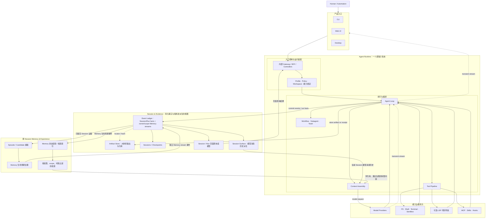
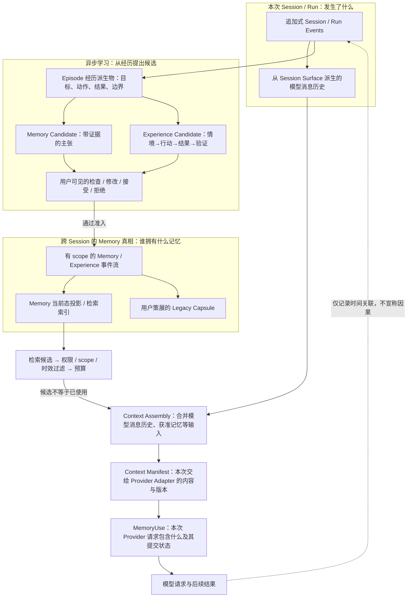

# Outlive Agent V2 设计总纲

> **愿景：让时间带走人的生命，却带不走人曾经留下的记忆与经验。**
>
> **产品命题：让一次工作不只留下答案，还留下可验证、可修正、可继承的记忆与经验。**

本文是 V2 的主入口。它描述的是**目标架构与迁移顺序**，不是对当前实现的完成度宣称。当前真实能力仍以 [README](../README.md)、既有[模块文档](modules/)及其指向的源码/测试为准；旧 TraceGraph 文档中仍有价值的能力、边界和验收规则已经收敛到 [TraceGraph → Outlive 迁移基线](outlive-agent-v2/10-tracegraph-to-outlive-migration/README.md)。模块目录、子模块位置图与决策文档从[设计文档索引](outlive-agent-v2/README.md)进入；具体一次改动怎样选 owner、验证和门禁，见[工程研发与维护 SOP](outlive-agent-v2/02-repository-governance/04-engineering-sop.md)。

## 1. 产品与技术内核命名

**Outlive Agent** 同时是面向用户的产品名称和底层 Agent Runtime/技术内核名称。产品与内核属于同一个系统，不再分别使用两个品牌名。

| 名称 | 角色 | 使用规则 |
|---|---|---|
| **Outlive Agent** | 产品与底层 Agent Runtime/技术内核 | 统一承载记忆、经验、证据、回放与行动能力；子系统按模块职责命名，产品与内核不再拆分命名 |
| **TraceGraph Agent** | 迁移前的项目/产品名称 | 仅用于描述当前仓库、既有实现和历史迁移来源 |
| `@outlive/*` | Outlive 的最终 package scope | 作为目标包命名；维护者确认商标、域名、包名及主要社交账号核查已完成 |
| `@tracegraph/*` | 当前/迁移期 package scope | 仅为迁移兼容暂留；实际改名仍须独立 Note 与兼容迁移方案 |

没有采用以下名称：

- **Time Agent**：容易被理解为时间管理、定时任务或时间旅行调试。
- **Time Memory Agent**：语义正确但不自然，难形成口碑记忆。
- **MEN / Man Agent**：缩写含义不自明，`Man` 还有性别和“人工”歧义。
- **Memory Agent**：过于通用，无法体现证据、继承与运行时边界。

V2 文档已确定以 **Outlive Agent** 作为产品和技术内核的统一名称。商标、域名、包名及主要社交账号核查已由维护者确认完成；最终 package scope 采用 `@outlive/*`。现有 `@tracegraph/*` 只在迁移期保留，代码改名仍须单独制定并批准兼容迁移方案。

## 2. 一句话定义

**Outlive Agent 是一个面向真实工作任务的通用 Agent 产品与 Runtime：它能理解目标、组织步骤、调用工具、执行并验证多类型任务；同时把会话、工具动作、外部回执、验证结果和人的修正沉淀为可追溯的经验，让这些经验在后续会话、模型和客户端之间安全延续。编码是重要场景之一，不是产品边界；可治理的长期记忆与经验是它的核心差异。**

它不是：

- 把所有聊天永久保存的监控系统；
- 用向量相似度把旧内容强塞回上下文的 RAG 壳；
- 模仿逝者人格或替人继续行使权限的“数字永生”；
- 为任意第三方 Coding Agent 提供统一接入与编排的万能控制平面；
- 只做漂亮轨迹图、却无法证明外部动作是否真的发生的观测 UI。

## 3. V2 的五个不可交换原则

1. **事实先于叙事**：系统只能从已提交事件、Receipt、Artifact 和可复核验证中派生结论。
2. **记忆必须有血缘**：每条长期记忆都必须携带来源、证据、作用域、置信状态和修订关系；检索命中不是事实证明。
3. **记忆可以跨越时间，权限不能超越当下意图**：恢复旧任务时重新求值 policy、credential、approval 与 workspace authority，不继承过期授权。
4. **原始证据与解释分离**：热路径只追加事实；Session/Run 页面读模型、模型消息历史、Episode、Memory 状态/检索索引、报告是不同的派生结果，分别从对应事件与操作重建，不能统称为同一个“投影”。
5. **遗忘也是能力**：用户可以查看、纠正、撤销、导出和删除记忆；“长久保存”不等于“不可控制地保存”。

## 4. 当前基础与 V2 目标

| 领域 | 当前可验证基础 | V2 目标 | 状态 |
|---|---|---|---|
| Evidence | append-only Ledger、Artifact、Session/Run 页面读模型、Replay、Action WAL | 独立 Evidence 家族、可移植 Evidence Bundle、统一 provenance | 基础已实现，需拆包与扩展 |
| Session | JSONL Session、恢复、Run 状态、会话列表/搜索 | 版本化 Session 家族、分支/迁移/查询边界清晰 | 基础已实现 |
| Memory | 本地 JSONL、BM25、来源引用、预算 recall | Candidate→Review→Commit→Use→Revise/Forget 全生命周期；Episode/Procedure/Preference 分型 | 部分实现 |
| Runtime | 单体 `runtime.ts`，工具、审批、Context、模型、子 Agent 已贯通 | 极小 Agent Loop + 可替换能力接缝 + no-progress guard | 需治理 |
| Client | Web UI + CLI + Host 内部协议客户端 | Web UI/Desktop 共用 DSH/Codex-like Agent 工作台 shell 与主要交互模块；Desktop、Web UI、CLI 共用同一 Runtime/Protocol | Desktop 未实现 |
| Governance | 模块文档、CI（当前含 `evals` job） | 根 `AGENTS.md`、Agent Notes、Skills、架构/文档门禁、生成目录 | 部分实现 |
| Quality | unit/E2E、当前离线 eval、perf/replay | 仓库内保留确定性测试/门禁、benchmarks 与 recorded-session snapshots；模型、检索、记忆和任务质量评估由外部 Langfuse 承担，不建本地 `evals/` 评测套件 | 需重组 |
| i18n | Web 文案已有中英文机制，公开 README 双语 | UI locale 包 + 文档配对清单与 YAML 一致性记录 | 需标准化 |

“部分实现”不能写成“V2 已具备”。每个详细文档都会用 **Current / Target / Deferred** 标识事实边界。

## 5. 总体架构



这张图有五个关键约束：

- 产品入口限定为 Desktop、Web UI、CLI；CLI 内的 TUI 只是呈现模式。独立 API、对外 SDK 和 ACP 暂不纳入当前产品范围；内部 Host 协议仍可服务这三种入口。
- **Agent Runtime 是一个整体**：入口控制/运行装配与 Agent Loop/执行编排是其内部职责，不是两个同级产品层，也不意味着分进程。
- 三种客户端只负责呈现和传输，不拥有 Session、Run、Approval 或 Memory 的业务事实；Session & Evidence 为 Runtime 提供持久化、回放和查询能力。
- Runtime 通过能力定义调用模型与工具；Profile/Policy 在运行装配时绑定允许的 Provider，能力实现不得反向依赖 UI 或 Agent Loop。
- Memory 从已提交证据中产生候选，再以带引用、经权限和 scope 过滤的有限内容回到 Context；不能从模型自述直接写成长期事实。

图中派生结果有不同消费者：`Session / Run 页面查询读模型 → 客户端展示`；`Session Surface → Runtime 模型消息历史 → Context Manifest`；`Session/Run 事实 → Episode 经历派生物 → 学习与审核`；`Memory 生命周期事件 → Memory 状态投影/检索索引 → 受治理检索 → Context Manifest`。模型流式增量可以直接送到客户端，但在对应结果提交前必须标注为 transient。它们互不替代，也不能因为都可重建就称作同一个 Projection。这里的模型消息历史是 Outlive V2 的目标设计；它参考 DSH 从 Session Surface 派生 `deriveMessages()` 的做法，不是从 UI 查询读模型取回消息再转发给模型。

**LSP** 在这里指 DSH 式的只读代码导航接入：共享 LSP seam、可配置的 stdio Provider，以及供 Agent 调用的 `lsp` 工具，初始操作限定为跳转定义、查找引用、查找实现和 hover。Outlive 不内置或安装语言服务器；部署配置负责提供服务端命令与扩展名映射。它是可选能力，不是产品入口或 Runtime 必需依赖。DSH 的这组能力不包含 diagnostics；TraceGraph 当前 G-12 中的诊断能力属于现状，不能自动视为 Outlive 目标。**CodeGraph 不属于 Outlive Agent 的内建 V2 能力**；当前仓库中的静态代码图实现仍是现状资产，但不进入目标 Runtime/包家族，也不安排迁移。

详细设计见 [系统架构](outlive-agent-v2/01-system-architecture/README.md)、[Agent Runtime 与 Session/Evidence 边界](outlive-agent-v2/01-system-architecture/01-agent-runtime-session-evidence.md)、[包家族](outlive-agent-v2/03-package-topology/README.md)和[记忆与经验](outlive-agent-v2/04-memory-and-experience/README.md)。

## 6. 目标仓库形态

```text
tracegraph-agent/
├── AGENTS.md                      # 项目级 Agent 约束与阅读顺序
├── .agents/
│   ├── notes/                     # 为什么做：proposed/implemented/rejected/archived
│   └── skills/                    # 怎么重复做：项目操作手册（薄指针）
├── apps/
│   ├── cli/                       # 命令 UX 与 profile 启动
│   ├── web/                       # 浏览器版 Agent 工作台
│   ├── desktop/                   # 复用工作台 UI 的 Electron/Tauri 壳（待 ADR 裁决）
│   └── desktop-host/              # 私有 framed-RPC bridge
├── packages/                      # 按能力家族分目录；先形成逻辑边界，再按门槛升为物理 workspace package
│   ├── core/                      # 极小 Agent/Loop/Scope 定义
│   ├── evidence/                  # Ledger/Artifact/Session-Run Read Model/Replay/WAL/Bundle
│   ├── session/                   # Format/Persistence/Surface & Model History/Query/Migration
│   ├── memory/                    # Lifecycle/Retrieval/Context/Export
│   ├── context/                   # Assembly/Provenance/Compaction/Spill/Budget
│   ├── tool/                      # Registry/Executor/Policy/Approval/Receipt
│   ├── llm/                       # Model seam、provider、retry、usage
│   ├── fs/                        # 文件系统能力：契约、本地/沙箱 Provider、文件工具
│   ├── subprocess/                # 子进程定义、本地 Provider、环境与资源限制
│   ├── shell/                     # Shell 命令能力与本地/沙箱执行 Provider
│   ├── terminal/                  # PTY、交互式终端会话与终端工具
│   ├── sandbox/                   # 隔离策略、沙箱 Provider 与能力探测
│   ├── lsp/                       # 可选、只读代码导航接缝；不内置语言服务器
│   ├── mcp/                       # MCP 客户端、资源发现与 Tool bridge
│   ├── skill/                     # Skill manifest、加载、文件访问与执行
│   ├── hooks/                     # Hook 协议、分发与适配器
│   ├── extensions/                # 扩展运行时、Host、隔离与兼容性
│   ├── workflow/                  # 显式工作流定义、运行器与工具适配
│   ├── goal/                      # 用户目标、进度评估与目标工具
│   ├── todo/                      # Todo 项、Todo 状态派生视图与 Todo 工具
│   ├── subagent/                  # 委派请求、子 Agent Provider 与工具
│   ├── team/                      # 多 Agent 成员、Mailbox、工作项与团队状态派生视图
│   ├── jobs/                      # 异步任务、队列、Worker 与任务工具
│   ├── api/                       # CLI/Web UI/Desktop 共用的内部 Controller
│   ├── sdk/                       # 内部协议、Client、Server；不承诺对外 SDK 产品
│   ├── host/                      # Runtime/Workspace 资源所有权与传输 Host
│   ├── boot/                      # Profile 解析、依赖装配与启动生命周期
│   ├── client/                    # 共享连接、Session/Run 页面查询 Store、命令、事件流与 UI 模块
│   ├── util/                      # 无业务归属的受控通用基础设施
│   ├── telemetry/                 # 隐私受控的遥测接口与实现
│   ├── test-support/              # Fake Provider、fixture 与测试构造器
│   └── runtime-diagnostics/       # Runtime 健康状态、诊断快照与排障信息
├── profiles/                      # base/cli/web/desktop；headless 仅供自动化测试
├── benchmarks/                    # 跨包用户路径性能门
├── snapshots/                     # 录制 Session 的无密钥回归库
├── docs/                          # 当前文档、V2 设计、ADR/事后分析
├── scripts/                       # 生成器与门禁，不承载产品能力
└── website/                       # V2 开发完成后（P8）建设；仅投影 docs
```

模型/Agent 质量评估计划使用外部 Langfuse 项目管理数据集与评估结果；它不是仓库内目录或 Runtime 依赖。安全、权限、状态机和协议等确定性不变量仍由本地测试与 CI 门禁验证，不能交给外部评分替代。

这是一张**目标目录地图，不是立即创建这些空目录或 workspace package 的命令**。图中的目录是独立的逻辑能力家族；迁移遵循“先在现有实现内形成可守卫边界，再把满足升包条件的能力抽出”的顺序。一个家族可以先作为现有 package 内部模块存在，不要求一开始就物理拆包。升包条件见[包家族设计](outlive-agent-v2/03-package-topology/README.md)。

## 7. 差异化核心：可回放的 Session，和可治理的跨会话经验



关键设计裁决是把 **Session 与跨 Session Memory 分开建模、放在同一套可审计事件基础设施上**：

- **Session / Run 是执行事实**：记录用户输入、工具动作、Receipt、Observation、验证，以及 Runtime 交给 Provider Adapter 的 Context Manifest；压缩只改变派生上下文，不抹去可恢复的执行历史。
- **Episode 是可重建的经历派生物**：把一段有目标和结果的经历组织起来，摘要不能创造事件中不存在的事实；它不等于页面查询读模型、模型消息历史或跨 Session Memory 状态投影。
- **Memory / Experience 是独立治理的长期知识**：各自有 owner、scope、来源、版本、时效、同意与撤销；不归属于恰好产生它的单个 Session。
- **新提取先产生 Candidate**：用户能看到来源并检查、修改、接受或拒绝。TraceGraph G-21 已有“配置 retriever 后每轮自动 recall”；V2 不把它冒充新能力，也不贸然删除，而是先迁移出可见性、请求状态和 policy/开关，再裁决默认行为；不新增绕过这些控制的静默路径。
- **区分检索、选中、请求提交**：`MemoryUse` 绑定 Runtime 交给 Provider Adapter 的请求内容，并记录提交/响应状态；它不证明远端模型接受、读取或依赖了某条记忆。“随后回答”只表示时间关联，不声称因果。
- **记忆可延续，权限不延续**：跨会话、跨模型或 Capsule 导入都重新验证当前用户、workspace、policy 与 consent；历史 approval、credential、身份代理权不随记忆继承。

这既复用 DSH 当前可观察到的 Session 事件日志、可派生上下文与注入可追溯性，也吸收 `dsh-memory-cain/dsh-memory-dev` 中的可见性、候选审核、冲突显式呈现等**用户提案**；Outlive 的增量是把它们落为跨 Session 的记忆所有权、生命周期治理和可审计的 MemoryUse 使用记录，而不是把 DSH 尚未实现的 MemoryEntry 当成现成功能。完整的数据契约、时序、删除边界和路线见[记忆与经验设计](outlive-agent-v2/04-memory-and-experience/README.md)。

## 8. 与社区诉求的关系

[设计依据](outlive-agent-v2/08-reference-lineage/README.md#7-社区问题证据)保存可复核的原始讨论链接。V2 不伪造“全 GitHub 热度排名”，只把反复出现的痛点转成可验收能力：

| 社区反复提出的痛点 | V2 回答 | 形成记忆点的演示 |
|---|---|---|
| 重启就丢任务/上下文 | durable Session + checkpoint + reconcile | 杀进程后恢复，同一 Run 继续且证据链不分叉 |
| 一直 working 但无进展 | progress fingerprint + bounded guard | 重复工具/重复 diff 被识别并解释性停机 |
| 点停止后工具仍在跑 | cancellation ownership + quiescence proof | 取消后无新工具启动，进程组最终退出 |
| 只能看 UI，无法自动监控 | 三种入口共用的内部 Query/Command/Event 协议 | CLI、Web UI、Desktop 看到同一状态 |
| 子 Agent 不可控 | durable delegation + capacity/budget/status | 根 Trace 可还原派发、结果、失败和关闭 |
| 不知道指令从哪里来 | Context provenance | 每个模型可见片段可追溯到 user/repo/skill/memory/tool |
| “记忆”会污染或泄露 | 可见候选审核 + scope/consent + MemoryUse + forget | 能区分搜到、选中、交给 Provider Adapter；可解释来源并纠正/删除 |

V2 的亮点不是“功能最多”，而是把这些可靠性承诺连成一个可以现场复核的闭环。

## 9. 文档地图

| 文档 | 回答的问题 |
|---|---|
| [00 产品宪章](outlive-agent-v2/00-product-charter/README.md) | 愿景如何落到产品边界，哪些诱人方向明确不做 |
| [01 系统架构](outlive-agent-v2/01-system-architecture/README.md) | 三种产品入口如何进入统一 Agent Runtime，以及 Runtime 如何使用 Session/Evidence、能力和 Memory |
| [02 仓库治理](outlive-agent-v2/02-repository-governance/README.md) | AGENTS、Notes、Skills、scripts、docs 怎么维护大工程 |
| [03 包家族与依赖](outlive-agent-v2/03-package-topology/README.md) | 每个 family/subpackage 做什么，何时值得升包 |
| [04 记忆与经验](outlive-agent-v2/04-memory-and-experience/README.md) | Session、Episode、Memory、Experience、Legacy 如何区分 |
| [05 Runtime 与能力](outlive-agent-v2/05-runtime-and-capabilities/README.md) | Agent Loop、Tool、Context、Workflow、Subagent、MCP 等如何组合 |
| [06 客户端与 Desktop](outlive-agent-v2/06-clients-protocols-desktop/README.md) | CLI/Web UI/Desktop 如何共享事实与内部协议 |
| [07 质量系统](outlive-agent-v2/07-quality-benchmarks-snapshots-i18n/README.md) | 工程测试/门禁、Benchmarks、Snapshots、外部 Langfuse 评估、docs/i18n、website 怎么分工 |
| [08 设计依据](outlive-agent-v2/08-reference-lineage/README.md) | 哪些外部项目启发了什么，以及明确拒绝复制什么 |
| [09 实施路线](outlive-agent-v2/09-implementation-roadmap/README.md) | 先做什么、依赖什么、每个任务如何验收 |
| [10 迁移基线](outlive-agent-v2/10-tracegraph-to-outlive-migration/README.md) | TraceGraph 的 G-01～G-23、现存边界和不可重做资产如何进入 V2 |
| [机器清单](outlive-agent-v2/manifest.yaml) | 文档集、状态、输入与输出的 YAML 索引 |
| [任务清单](outlive-agent-v2/roadmap.yaml) | 可交给 Agent 执行的任务 DAG |

## 10. 迁移纪律

1. **名称迁移与代码迁移分开**：V2 提案期不改 npm scope、事件名、持久格式或既有客户端契约；不因此承诺新增外部 API。
2. **搬家与行为改造分开**：一个 PR 只做一种；文件移动必须先由边界门禁保护。
3. **Current 与 Target 分开**：文档中没有证据的目标必须写 `proposed/deferred`，不能使用完成时。
4. **每个持久格式单调演进**：发布过的 generation 不覆盖、不原地改写；通过相邻迁移升级。
5. **每个副作用有业务 Receipt**：CLI exit 0、HTTP 200 或模型一句“完成了”都不是业务成功。
6. **每个重要承诺有反向测试**：不仅证明正确路径通过，还要临时破坏不变量并证明门禁 `exit 1`。

## 11. 本轮已评审的十五个决策

- [x] 接受 **Outlive Agent** 同时作为产品与底层 Agent Runtime/技术内核名称；TraceGraph Agent 仅指现有仓库及迁移前状态。
- [x] 接受“记忆可延续，权限不延续”为核心安全原则。
- [x] 接受 Session/Run 执行真相与跨 Session Memory 真相分离、共享事件基础设施的边界。
- [x] 接受 Evidence → Episode → Candidate → 人可见准入 → Memory/Experience → Context Manifest/MemoryUse → 新证据的闭环；G-21 既有自动 recall 先兼容迁移、补可见性与请求状态，再裁决默认策略，不扩张无审计路径。
- [x] 接受先内部成层、再按升包门槛物理拆包，不一次创建全部目标包。
- [x] 接受最终 package scope 为 `@outlive/*`；商标、域名、包名与主要社交账号核查已由维护者确认完成；`@tracegraph/*` 仅迁移期保留，改名仍需独立兼容迁移方案。
- [x] 接受 Outlive Agent 定位为用户直接使用的通用 Agent 产品与 Runtime；编码是重要场景而非产品边界，Claude Code、Codex、DSH 是产品形态参照，具体能力分阶段建设。
- [x] 产品入口限于 CLI、Web UI、Desktop；独立 API、对外 SDK、ACP 暂不纳入当前范围。
- [x] 接受 Web UI 与 Desktop UI 借鉴并模仿 DSH 的 Agent 工作台形态（按用户体验近似 Codex）；共享 Workspace/Session 导航、中心对话与运行活动、工具/审批/变更审阅等核心交互，Outlive 的 Evidence/Memory 体验按自身契约扩展，不照搬 DSH 内部实现。
- [x] LSP 采用 DSH 式可选只读代码导航接缝（definition/references/implementation/hover），不内置语言服务器；CodeGraph 不纳入 Outlive Agent 内建 V2 能力或迁移目标。
- [x] 接受 Desktop 主进程不拥有业务状态，使用私有 framed RPC 与 Host 通信。
- [x] 接受仓库内以确定性测试/门禁、`benchmarks/`、`snapshots/` 为质量基线；模型/Agent 质量评估交给外部 Langfuse，不建设本地 `evals/` 评测套件。
- [x] 接受 V2 开发完成后（P1–P7 实现阶段结束）再建设 website；仅作为 docs 投影，不成为第二份文档真源。
- [x] 接受“人格复刻/身后代理”不进入 V2 MVP，只先做工程记忆与用户主动策展的 Legacy Capsule。
- [x] 接受多人团队共享 Workspace/Memory 不进入 V2，留待后续版本；这与 V2 内部的多 Agent 协作能力不是同一范围。

以上十五个产品与架构决策均已通过评审。这里的“接受”确认的是 V2 目标设计方向，不代表对应功能已经实现；总纲和子文档的 `status: proposed` 仍表示目标方案尚待实施，状态须依据实际实现证据另行更新。后续尚待裁决的项目、推荐方案和裁决时机统一见[决策登记表](outlive-agent-v2/README.md#6-决策登记表现在要评审什么)，避免把已接受方向与阶段性开放问题混在一起。
