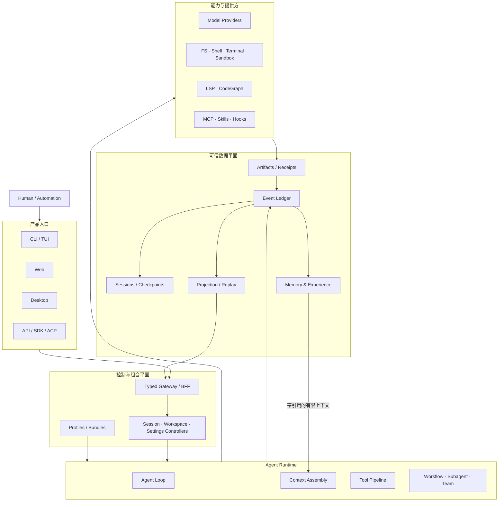
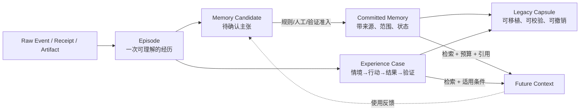

# Outlive Agent V2 设计总纲

> **愿景：让时间带走人的生命，却带不走人曾经留下的记忆与经验。**
>
> **产品命题：让一次工作不只留下答案，还留下可验证、可修正、可继承的记忆与经验。**

本文是 V2 的主入口。它描述的是**目标架构与迁移顺序**，不是对当前实现的完成度宣称。当前真实能力仍以 [README](../README.md)、既有[模块文档](modules/)及其指向的源码/测试为准；旧 TraceGraph 文档中仍有价值的能力、边界和验收规则已经收敛到 [TraceGraph → Outlive 迁移基线](outlive-agent-v2/10-tracegraph-to-outlive-migration/README.md)。模块目录、子模块位置图与决策文档从[设计文档索引](outlive-agent-v2/README.md)进入；具体一次改动怎样选 owner、验证和门禁，见[工程研发与维护 SOP](outlive-agent-v2/02-repository-governance/04-engineering-sop.md)。

## 1. 名称裁决

V2 的建议工作名是 **Outlive Agent**，底层技术内核继续叫 **TraceGraph Engine**。

| 名称 | 角色 | 为什么这样分 |
|---|---|---|
| **Outlive Agent** | 面向使用者的产品工作名 | `Outlive` 直接表达“记忆与经验超越一次会话和一个执行进程”，比 Time Agent 更不像日历/调度工具 |
| **TraceGraph Engine** | 事件、证据、关系、回放与派生图谱 | TraceGraph 已准确描述现有技术资产，不应因产品叙事升级而丢掉 |
| `@tracegraph/*` | 迁移期包作用域 | V2 尚在提案期；先稳住边界，再单独决定是否改包名，避免一次变更同时制造品牌和兼容性风险 |

没有采用以下名称：

- **Time Agent**：容易被理解为时间管理、定时任务或时间旅行调试。
- **Time Memory Agent**：语义正确但不自然，难形成口碑记忆。
- **MEN / Man Agent**：缩写含义不自明，`Man` 还有性别和“人工”歧义。
- **Memory Agent**：过于通用，无法体现证据、继承与运行时边界。

截至 2026-09-23 的定向检查没有发现精确同名的 GitHub 仓库或 npm 包，但这**不是商标清查**。在公开发布前仍需做域名、商标、包名和主要社交账号检查。因此本文将 `Outlive Agent` 标记为 working name，而不是不可逆决定。

## 2. 一句话定义

**Outlive Agent 是一个 evidence-backed memory runtime：它把会话、工具动作、外部回执、验证结果和人的修正沉淀为可追溯的经验，并让这些经验在后续会话、模型和客户端之间安全延续。**

它不是：

- 把所有聊天永久保存的监控系统；
- 用向量相似度把旧内容强塞回上下文的 RAG 壳；
- 模仿逝者人格或替人继续行使权限的“数字永生”；
- 同时适配所有 Coding Agent 的万能控制平面；
- 只做漂亮轨迹图、却无法证明外部动作是否真的发生的观测 UI。

## 3. V2 的五个不可交换原则

1. **事实先于叙事**：系统只能从已提交事件、Receipt、Artifact 和可复核验证中派生结论。
2. **记忆必须有血缘**：每条长期记忆都必须携带来源、证据、作用域、置信状态和修订关系；检索命中不是事实证明。
3. **记忆可以跨越时间，权限不能超越当下意图**：恢复旧任务时重新求值 policy、credential、approval 与 workspace authority，不继承过期授权。
4. **原始证据与解释分离**：热路径只追加事实；Episode、Memory、经验摘要、UI 状态和报告均由可重放投影生成。
5. **遗忘也是能力**：用户可以查看、纠正、撤销、导出和删除记忆；“长久保存”不等于“不可控制地保存”。

## 4. 当前基础与 V2 目标

| 领域 | 当前可验证基础 | V2 目标 | 状态 |
|---|---|---|---|
| Evidence | append-only Ledger、Artifact、Projection、Replay、Action WAL | 独立 Evidence 家族、可移植 Evidence Bundle、统一 provenance | 基础已实现，需拆包与扩展 |
| Session | JSONL Session、恢复、Run 状态、会话列表/搜索 | 版本化 Session 家族、分支/迁移/查询边界清晰 | 基础已实现 |
| Memory | 本地 JSONL、BM25、来源引用、预算 recall | Candidate→Review→Commit→Use→Revise/Forget 全生命周期；Episode/Procedure/Preference 分型 | 部分实现 |
| Runtime | 单体 `runtime.ts`，工具、审批、Context、模型、子 Agent 已贯通 | 极小 Agent Loop + 可替换能力接缝 + no-progress guard | 需治理 |
| Client | Web + CLI + Host/SDK | CLI、API、Web、Desktop 共用一个 Runtime/Protocol | Desktop 未实现 |
| Governance | 模块文档、CI/evals | 根 `AGENTS.md`、Agent Notes、Skills、架构门禁、生成目录 | 部分实现 |
| Quality | unit/E2E/evals/perf/replay | 独立 benchmarks 与 recorded-session snapshots；回归预算 | 需重组 |
| i18n | Web 文案已有中英文机制，公开 README 双语 | UI locale 包 + 文档配对清单与 YAML 一致性记录 | 需标准化 |

“部分实现”不能写成“V2 已具备”。每个详细文档都会用 **Current / Target / Deferred** 标识事实边界。

## 5. 总体架构



这张图有三个关键约束：

- 四种客户端只负责呈现和传输，不拥有 Session、Run、Approval 或 Memory 的业务事实。
- Runtime 依赖能力**定义**，组合层选择具体 Provider；能力实现不得反向依赖 UI 或 Agent Loop。
- Memory 从已提交证据中产生候选，再以带引用的有限内容回到 Context；不能从模型自述直接写成长期事实。

详细设计见 [系统架构](outlive-agent-v2/01-system-architecture/README.md)、[包家族](outlive-agent-v2/03-package-topology/README.md)和[记忆与经验](outlive-agent-v2/04-memory-and-experience/README.md)。

## 6. 目标仓库形态

```text
tracegraph-agent/
├── AGENTS.md                      # 项目级 Agent 约束与阅读顺序
├── .agents/
│   ├── notes/                     # 为什么做：proposed/implemented/rejected/archived
│   └── skills/                    # 怎么重复做：项目操作手册（薄指针）
├── apps/
│   ├── cli/                       # 命令 UX 与 profile 启动
│   ├── api/                       # 可选 headless API 应用
│   ├── web/                       # 浏览器客户端
│   ├── desktop/                   # Electron/Tauri 壳（待 ADR 裁决）
│   └── desktop-host/              # 私有 framed-RPC bridge
├── packages/
│   ├── core/                      # 极小 Agent/Loop/Scope 定义
│   ├── evidence/                  # Ledger/Artifact/Projection/Replay/WAL/Bundle
│   ├── session/                   # Format/Persistence/Projection/Query/Migration
│   ├── memory/                    # Lifecycle/Retrieval/Context/Export
│   ├── context/                   # Assembly/Provenance/Compaction/Spill/Budget
│   ├── tool/                      # Registry/Executor/Policy/Approval/Receipt
│   ├── llm/                       # Model seam、provider、retry、usage
│   ├── fs|shell|terminal|sandbox/ # Definition/Provider/Consumer 能力家族
│   ├── lsp|mcp|skill|workflow/    # 可替换能力家族
│   ├── subagent|team/             # 委派与协作
│   ├── api|sdk|host|client/       # 进程边界与客户端协议
│   └── util|test-support|runtime-diagnostics/
├── profiles/                      # base/web/desktop/headless/sdk/acp 显式组合
├── benchmarks/                    # 跨包用户路径性能门
├── snapshots/                     # 录制 Session 的无密钥回归库
├── evals/                         # 质量、行为和检索效果评测
├── docs/                          # 当前文档、V2 设计、ADR/事后分析
├── scripts/                       # 生成器与门禁，不承载产品能力
└── website/                       # 延后；仅做 docs 的公开投影
```

这是一张**目标地图，不是立即创建 60 个空包的命令**。迁移遵循“先在现有 `core` 内形成可守卫边界，再把满足升包条件的能力抽出”的顺序。升包条件见[包家族设计](outlive-agent-v2/03-package-topology/README.md)。

## 7. 差异化核心：从 Trace 到可继承经验



V2 不把“记住一句话”当成记忆系统的终点。真正需要保存的是：

- **发生过什么**：原始事件、外部回执、工件和验证；
- **当时为什么这样做**：Decision、约束、被否决方案和审批；
- **结果是否真的有效**：测试、业务 Observation、失败与未知状态；
- **以后在什么条件下可复用**：作用域、适用前提、冲突、过期和反例；
- **谁有权继续使用它**：所有者、敏感级别、同意、保留和撤销策略。

完整生命周期与数据契约见[记忆与经验设计](outlive-agent-v2/04-memory-and-experience/README.md)。

## 8. 与社区诉求的关系

[设计依据](outlive-agent-v2/08-reference-lineage/README.md#7-社区问题证据)保存可复核的原始讨论链接。V2 不伪造“全 GitHub 热度排名”，只把反复出现的痛点转成可验收能力：

| 社区反复提出的痛点 | V2 回答 | 形成记忆点的演示 |
|---|---|---|
| 重启就丢任务/上下文 | durable Session + checkpoint + reconcile | 杀进程后恢复，同一 Run 继续且证据链不分叉 |
| 一直 working 但无进展 | progress fingerprint + bounded guard | 重复工具/重复 diff 被识别并解释性停机 |
| 点停止后工具仍在跑 | cancellation ownership + quiescence proof | 取消后无新工具启动，进程组最终退出 |
| 只能看 UI，无法自动监控 | versioned Query/Command/Event API | CLI、Web、Desktop、SDK 看到同一状态 |
| 子 Agent 不可控 | durable delegation + capacity/budget/status | 根 Trace 可还原派发、结果、失败和关闭 |
| 不知道指令从哪里来 | Context provenance | 每个模型可见片段可追溯到 user/repo/skill/memory/tool |
| “记忆”会污染或泄露 | candidate gate + scope + consent + forget | 能解释为何记住、为何召回、如何纠正/删除 |

V2 的亮点不是“功能最多”，而是把这些可靠性承诺连成一个可以现场复核的闭环。

## 9. 文档地图

| 文档 | 回答的问题 |
|---|---|
| [00 产品宪章](outlive-agent-v2/00-product-charter/README.md) | 愿景如何落到产品边界，哪些诱人方向明确不做 |
| [01 系统架构](outlive-agent-v2/01-system-architecture/README.md) | 四入口、控制平面、Runtime、可信数据平面如何交互 |
| [02 仓库治理](outlive-agent-v2/02-repository-governance/README.md) | AGENTS、Notes、Skills、scripts、docs 怎么维护大工程 |
| [03 包家族与依赖](outlive-agent-v2/03-package-topology/README.md) | 每个 family/subpackage 做什么，何时值得升包 |
| [04 记忆与经验](outlive-agent-v2/04-memory-and-experience/README.md) | Session、Episode、Memory、Experience、Legacy 如何区分 |
| [05 Runtime 与能力](outlive-agent-v2/05-runtime-and-capabilities/README.md) | Agent Loop、Tool、Context、Workflow、Subagent、MCP 等如何组合 |
| [06 客户端与 Desktop](outlive-agent-v2/06-clients-protocols-desktop/README.md) | CLI/API/Web/Desktop 如何共享事实与协议 |
| [07 质量系统](outlive-agent-v2/07-quality-benchmarks-snapshots-i18n/README.md) | Benchmarks、Snapshots、Evals、docs/i18n、website 怎么分工 |
| [08 设计依据](outlive-agent-v2/08-reference-lineage/README.md) | 哪些外部项目启发了什么，以及明确拒绝复制什么 |
| [09 实施路线](outlive-agent-v2/09-implementation-roadmap/README.md) | 先做什么、依赖什么、每个任务如何验收 |
| [10 迁移基线](outlive-agent-v2/10-tracegraph-to-outlive-migration/README.md) | TraceGraph 的 G-01～G-23、现存边界和不可重做资产如何进入 V2 |
| [机器清单](outlive-agent-v2/manifest.yaml) | 文档集、状态、输入与输出的 YAML 索引 |
| [任务清单](outlive-agent-v2/roadmap.yaml) | 可交给 Agent 执行的任务 DAG |

## 10. 迁移纪律

1. **名称迁移与代码迁移分开**：V2 提案期不改 npm scope、事件名、持久格式或公开 API。
2. **搬家与行为改造分开**：一个 PR 只做一种；文件移动必须先由边界门禁保护。
3. **Current 与 Target 分开**：文档中没有证据的目标必须写 `proposed/deferred`，不能使用完成时。
4. **每个持久格式单调演进**：发布过的 generation 不覆盖、不原地改写；通过相邻迁移升级。
5. **每个副作用有业务 Receipt**：CLI exit 0、HTTP 200 或模型一句“完成了”都不是业务成功。
6. **每个重要承诺有反向测试**：不仅证明正确路径通过，还要临时破坏不变量并证明门禁 `exit 1`。

## 11. 本轮应评审的九个决策

- [ ] 接受 **Outlive Agent** 作为工作名，TraceGraph 作为技术内核名。
- [ ] 接受“记忆可延续，权限不延续”为核心安全原则。
- [ ] 接受 Evidence → Episode → Memory/Experience → Legacy 的四层模型。
- [ ] 接受先内部成层、再按升包门槛物理拆包，不一次创建全部目标包。
- [ ] 接受 CLI/API/Web/Desktop 共享一个 Runtime 与版本化协议。
- [ ] 接受 Desktop 主进程不拥有业务状态，使用私有 framed RPC 与 Host 通信。
- [ ] 接受 `benchmarks/`、`snapshots/`、`evals/` 三者分工，不混成一个测试目录。
- [ ] 接受 website 延后，仅作为 docs 投影，不成为第二份文档真源。
- [ ] 接受“人格复刻/身后代理”不进入 V2 MVP，只先做工程记忆与用户主动策展的 Legacy Capsule。

这些决策未通过评审前，本文及子文档均保持 `proposed`。
