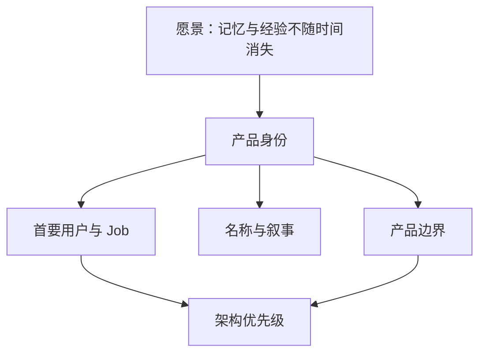

# 身份与定位设计

## 1. 在整体架构中的位置

本子模块不拥有运行时行为；它拥有“为什么存在、先服务谁、技术取舍优先保护什么”的产品级约束。Runtime、Memory、Desktop 等设计若与这里冲突，应先修改宪章，而不是悄悄改变产品身份。

## 2. 定位决定

**Target 定位**：Outlive Agent 是一个面向真实工作任务的通用 Agent 产品与 Runtime：它能理解目标、组织步骤、调用工具、执行操作并验证结果，覆盖编码与项目维护、文件和文档处理、信息研究及可复用工作流等场景；其差异化是把协作中有来源的事件与结果沉淀为可审查、可修正、可撤销、能跨会话延续的记忆与经验。编码是重要能力之一，不是产品边界。

产品形态以 Claude Code、Codex 与 DSH 所代表的完整 Agent 体验为参照；Outlive 面向用户直接提供完整 Agent，而不是只提供给其他 Agent 拼装的通用编排平台。它不是聊天记录搜索器或数字人格模拟器。具体能力按阶段建设，不意味着 V2 首发就覆盖所有任务类型，也不意味着复制这些产品的实现或功能清单。

首要用户按优先级划分：

| 层级 | 用户 | 高频 Job | V2 价值证明 |
|---|---|---|---|
| P0 | 希望用一个 Agent 持续处理多类数字工作任务的个人用户；开发者是重要首批用户之一 | 跨任务恢复上下文、执行工具操作、记住决策与经验 | 跨会话续接代码及其他工具型任务，减少重复探索且保留来源 |
| V2 之后 | 2～10 人团队 | 多人共享 Workspace/Memory、协作交接与评审 | 明确不纳入 V2；后续版本单独评审成员权限、scope、冲突仲裁与共享撤销 |
| 延后 | Agent/工具开发者 | 外部嵌入 Runtime、独立 SDK/ACP | 不属于当前产品入口范围；需基于用户需求另行评审 |
| 非首发 | 大型企业治理、人格延续消费者 | 企业策略或人生档案 | 只保留接口余地，不承诺 V2 完成 |

## 3. 名称架构

| 名称 | 职责 | 规则 |
|---|---|---|
| Outlive Agent | 产品名与底层 Agent Runtime/技术内核名 | 产品和内核使用统一名称；各技术子系统按职责命名 |
| TraceGraph Agent | 迁移前项目/产品名 | 仅在说明当前仓库、已有实现或历史来源时使用 |
| `@outlive/*` | Outlive 的最终 package scope | 作为目标包命名；维护者确认商标、域名、包名及主要社交账号核查已完成 |
| `@tracegraph/*` | 当前/迁移期包 scope | 仅为迁移兼容暂留；实际改名仍须独立 Note 与兼容迁移方案，不和行为/边界重构混做 |
| Legacy Capsule | 用户主动策展的可移植资产 | 不可用于未经授权的人格冒充 |

命名变更必须同时检查：包名、协议 ID、持久格式、CLI 命令、导出格式和外部链接；品牌名不应渗透到不可迁移的 schema discriminator。

## 4. 身份不变量

1. 每项“记得”都能回到 Evidence；无法验证的内容只能标为偏好、推测或候选。
2. 长期记忆增加连续性，不增加权限。
3. 用户能够查看、纠正、撤销、导出和删除长期资产。
4. 产品身份是通用任务型 Agent；编码是重要场景而非产品边界。多类型能力按价值和验证条件分阶段交付；长期记忆愿景通过开放格式和用户主权逐步实现。
5. 对外文案区分 `current`、`beta`、`target`，不把设计稿写成已交付能力。

## 5. 关键决策参数

| 参数 | 推荐 | 何时改变 |
|---|---|---|
| `primary_persona` | `long_horizon_agent_user` | 有另一类用户达到连续 3 个版本的同等留存证据 |
| `product_category` | `evidence-grounded general-purpose agent` | 多类真实任务不再是产品承诺，且有明确证据支持收窄定位时 |
| `brand_scope` | 产品与技术内核统一使用 Outlive Agent；最终 package scope 为 `@outlive/*`，迁移期暂留 `@tracegraph/*` | 进入实际包名迁移前，完成独立 Note、兼容方案和迁移窗口裁决 |
| `legacy_claim_level` | 可移植、可验证、可继承的经验 | 在隐私、授权、身份和长期托管均有独立治理前不得扩大 |

## 6. 决策门

任何新能力进入路线图前都回答：它是否提高长期连续性、证据可信度、用户控制或真实任务的完成质量与可交付性？若四项均否，只能作为插件/实验，不进入核心。

## 7. 验收标准

公开首页、产品宪章、Runtime/Memory 非目标和路线图使用同一定位；任一已规划核心能力能指出至少一项价值轴；品牌名变化不要求同步破坏 package/schema；Current 与 Target 声明可被机器或评审区分。

## 8. 后续阶段与待评审

- 多人团队共享明确不进入 V2，后续版本再评审；V2 的 Session/Memory 不提供跨用户共享 Workspace 或团队级纠错仲裁。
- 单用户多设备的同步与冲突语义仍按具体传输/存储方案评审，不自动等同于多人团队共享。
