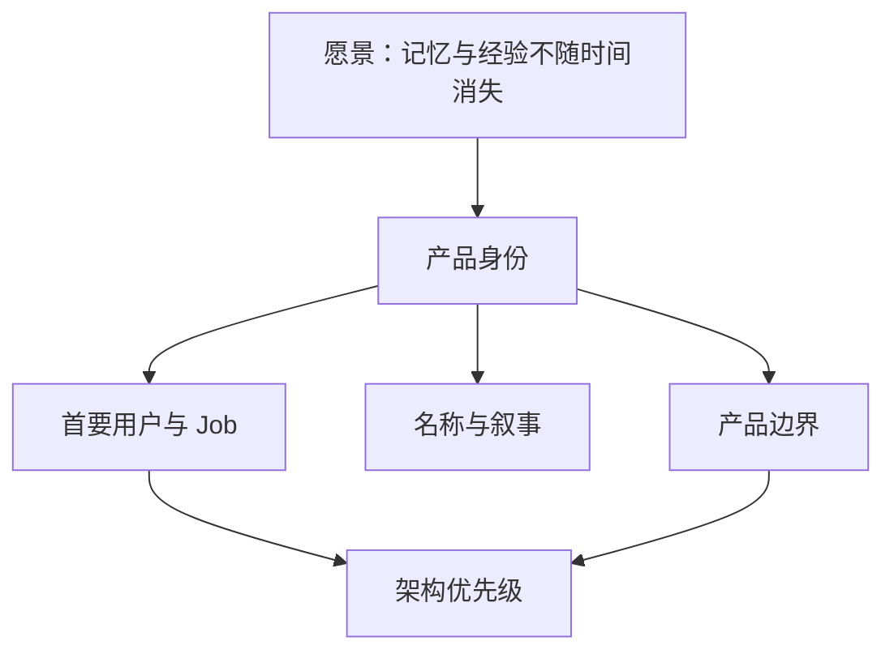

# 身份与定位设计

## 1. 在整体架构中的位置

本子模块不拥有运行时行为；它拥有“为什么存在、先服务谁、技术取舍优先保护什么”的产品级约束。Runtime、Memory、Desktop 等设计若与这里冲突，应先修改宪章，而不是悄悄改变产品身份。

## 2. 定位决定

**Target 定位**：Outlive Agent 是一个以证据为基础、能随长期协作积累可修正经验的 Coding Agent，而不是聊天记录搜索器、数字人格模拟器或通用多 Agent 平台。

首要用户按优先级划分：

| 层级 | 用户 | 高频 Job | V2 价值证明 |
|---|---|---|---|
| P0 | 长期维护多个代码库的个人开发者 | 恢复上下文、记住架构理由、复用排障经验 | 跨会话恢复后减少重复探索且保留来源 |
| P1 | 2～10 人小团队 | 交接、评审、共享已验证做法 | 经验可审查、可撤销、按 scope 共享 |
| 延后 | Agent/工具开发者 | 外部嵌入 Runtime、独立 SDK/ACP | 不属于当前产品入口范围；需基于用户需求另行评审 |
| 非首发 | 大型企业治理、人格延续消费者 | 企业策略或人生档案 | 只保留接口余地，不承诺 V2 完成 |

## 3. 名称架构

| 名称 | 职责 | 规则 |
|---|---|---|
| Outlive Agent | 产品名与底层 Agent Runtime/技术内核名 | 产品和内核使用统一名称；各技术子系统按职责命名 |
| TraceGraph Agent | 迁移前项目/产品名 | 仅在说明当前仓库、已有实现或历史来源时使用 |
| `@tracegraph/*` | 当前包 scope | 在独立迁移任务完成前作为兼容标识保留，不代表另一套产品品牌 |
| Legacy Capsule | 用户主动策展的可移植资产 | 不可用于未经授权的人格冒充 |

命名变更必须同时检查：包名、协议 ID、持久格式、CLI 命令、导出格式和外部链接；品牌名不应渗透到不可迁移的 schema discriminator。

## 4. 身份不变量

1. 每项“记得”都能回到 Evidence；无法验证的内容只能标为偏好、推测或候选。
2. 长期记忆增加连续性，不增加权限。
3. 用户能够查看、纠正、撤销、导出和删除长期资产。
4. 产品首先做好 Coding Agent；生命记忆愿景通过开放格式和用户主权逐步实现。
5. 对外文案区分 `current`、`beta`、`target`，不把设计稿写成已交付能力。

## 5. 关键决策参数

| 参数 | 推荐 | 何时改变 |
|---|---|---|
| `primary_persona` | `long_horizon_developer` | 有另一类用户达到连续 3 个版本的同等留存证据 |
| `product_category` | `evidence-grounded coding agent` | 核心工作流不再以代码仓库为主时 |
| `brand_scope` | 产品与技术内核统一使用 Outlive Agent；迁移期保留现有包 scope | 完成包/协议兼容方案且迁移收益大于破坏成本时 |
| `legacy_claim_level` | 可移植、可验证、可继承的经验 | 在隐私、授权、身份和长期托管均有独立治理前不得扩大 |

## 6. 决策门

任何新能力进入路线图前都回答：它是否提高长期连续性、证据可信度、用户控制或 Coding 交付质量？若四项均否，只能作为插件/实验，不进入核心。

## 7. 验收标准

公开首页、产品宪章、Runtime/Memory 非目标和路线图使用同一定位；任一已规划核心能力能指出至少一项价值轴；品牌名变化不要求同步破坏 package/schema；Current 与 Target 声明可被机器或评审区分。

## 8. 待评审

- 公开发布前的商标、域名、包名和主要社交账号核查；
- P1 团队共享是否进入 V2，还是仅保留单用户多设备的数据模型余量。
