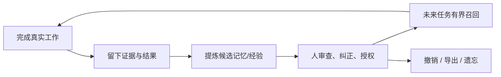
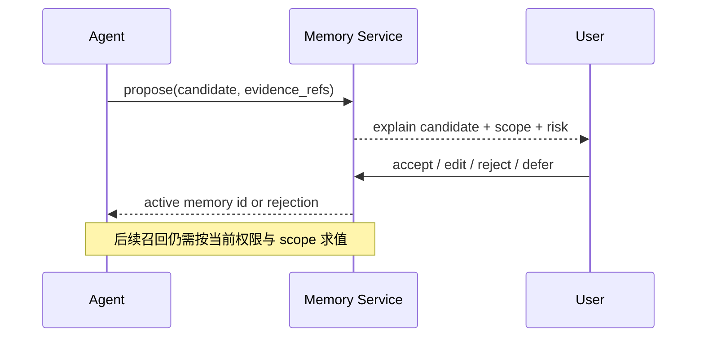

# 用户价值与边界设计

## 1. 价值循环

位置：本子模块位于产品宪章与 Memory/Runtime 之间。它定义用户可感知结果；具体对象生命周期由 `04-memory-and-experience` 实现，执行可信度由 `05-runtime-and-capabilities` 实现。

## 2. 三个核心 Job

| Job | 用户原话 | 必须出现的产品行为 | 不算完成 |
|---|---|---|---|
| 恢复 | “继续上周没做完的任务” | 恢复分支、未决事项、证据和当前 authority | 仅总结旧聊天 |
| 解释 | “为什么当时这么设计” | 展示决定、替代方案、证据、适用版本和后续修订 | 只返回向量相似段落 |
| 复用 | “这次故障以前解决过吗” | 匹配情境、给出步骤/反例，并要求当前环境重新验证 | 自动照搬旧命令 |

辅助 Job：跨客户端继续、导出个人经验、删除敏感历史、把可复用流程发布为 Skill、把关键决定固化为 Note。

## 3. 用户控制边界

高风险信息（凭据、健康、身份、私人通信、第三方个人信息）默认不得自动成为 active memory。删除请求必须作用于真源与派生索引，并保留不含内容的删除收据以便证明执行过。

## 4. 明确非目标

- 复刻逝者语气、冒充本人或代表其作决定；
- 用“记忆”绕过当前用户确认、沙箱或策略；
- 把所有聊天永久保存，或把无法追溯的摘要当事实；
- 自动把一个仓库的私有约定传播到其他 scope；
- 为追求“聪明”而隐藏错误检索、冲突记忆或模型不确定性。

## 5. 关键体验参数

| 参数 | 推荐起点 | 设计意图 |
|---|---|---|
| `memory_activation_mode` | 高风险手动；低风险可建议 | 把自动提取和自动信任分开 |
| `retrieval_visibility` | 默认展示来源与使用原因 | 用户能发现错误记忆 |
| `cross_project_scope` | 默认关闭 | 防止私有上下文串扰 |
| `forget_semantics` | 真源删除 + 派生重建/清除 + receipt | 不把“UI 隐藏”伪装为遗忘 |
| `export_format` | 开放、版本化、可校验 | 避免平台锁定 |

这些是产品建议，不是当前实现默认值；实现前须在对应子模块写成可测试配置。

## 6. 验收场景

1. 用户能从一条召回内容走到原始 Observation/Artifact。
2. 用户纠正一条记忆后，旧版本不再默认注入，但修订血缘仍可审计。
3. 换入口继续同一任务时，不出现两个不同权威状态。
4. 删除后重新构建索引，不会让被删内容复活。
5. 权限改变后，旧 Session 与 Memory 不自动恢复旧 approval。

## 7. V2 待评审与后续阶段

### 已评审决策

- [x] 多人团队共享 Workspace/Memory 不进入 V2，留待后续版本单独设计成员权限、共享 scope、冲突仲裁与撤销机制；这不影响 V2 内部的单用户 Session、Memory 和多 Agent 委派能力。

### V2 待评审事项

- 低风险记忆是否允许默认自动激活；
- 导出是否包含原始证据，还是提供可选脱敏层级。
