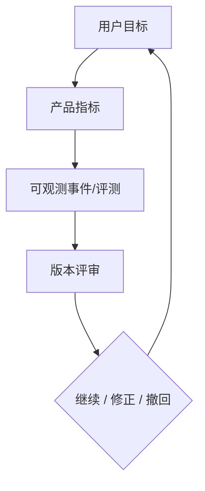
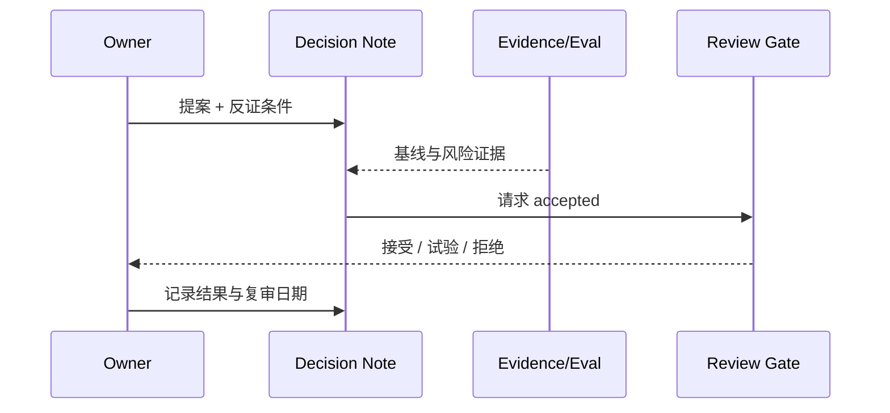

# 成功指标与产品决策机制

## 1. 指标在系统中的位置

产品指标不直接由 UI 埋点定义。每个指标必须先有语义、分母、事件来源和隐私级别，再由 Truth Plane 或离线 Eval 投影；不能为了指标增加不必要的长期收集。

## 2. 指标树

北极星问题：**Outlive 是否让用户在保持控制和可验证性的前提下，少重复探索并更可靠地完成长期工作？**

| 维度 | 建议指标 | 定义边界 |
|---|---|---|
| 连续性 | `resume_to_first_verified_action` | 从恢复开始到首个有 Receipt/Observation 的有效行动，不以模型首字延迟替代 |
| 复用价值 | `experience_reuse_success_rate` | 被召回经验在当前任务重新验证成功的比例 |
| 可信度 | `grounded_memory_rate` | active memory 中具有有效 EvidenceRef 且可解析的比例 |
| 可纠正性 | `correction_propagation_latency` | 修订提交到所有默认检索面不再返回旧版本的时间 |
| 用户控制 | `forget_verification_rate` | 删除流程通过真源与派生面复核的比例 |
| Coding 质量 | `verified_task_completion_rate` | 有业务级完成证据的任务比例，不以“Agent 说完成”为准 |

护栏指标：错误召回率、越 scope 召回数、未经确认的高风险写入数、恢复后旧权限复活数、每任务 token/时间/磁盘成本、回归 Snapshot 差异率。

## 3. 参数与目标设置

| 参数 | V2 文档建议 | 决定方式 |
|---|---|---|
| `metric_window` | 同时保留版本窗口与 28 天滚动窗口 | 版本评审决定，不硬编码于 Runtime |
| `minimum_sample_size` | 未达到样本量只展示趋势，不作发布裁决 | 在基线采集后确定 |
| `regression_budget` | 每条关键路径独立配置 | 由 Benchmark/Eval owner 提案并记录原因 |
| `privacy_mode` | 默认本地聚合，外发 opt-in | 产品宪章硬约束 |
| `success_target` | 先测当前基线，再定目标 | 禁止无基线写漂亮百分比 |

## 4. 决策记录

重大产品决定采用一页 Note，至少包含：问题、用户证据、可选项、决定、反证条件、影响指标、回滚方式和 owner。状态只允许 `proposed → accepted/implemented → superseded/archived`，被拒绝选项进入 `rejected` 而不是删除。

## 5. 阶段门

| 门 | 进入条件 | 退出条件 |
|---|---|---|
| Problem gate | 至少一个可复现用户 Job | 能写出当前替代方案与失败成本 |
| Design gate | owner、边界、不变量、风险明确 | 有可逆迁移与验证计划 |
| Beta gate | 主路径端到端可证明 | 零已知权限绕过；数据可导出/删除 |
| Stable gate | 版本兼容与恢复演练通过 | 指标至少跨两个发布窗口稳定 |

## 6. 验收标准

每个公开成功 claim 都能映射到一个已定义指标及其证据事件；指标有分母、窗口、隐私级别和 owner；没有基线的指标不设置伪精确目标；护栏退化时不能只凭北极星改善放行。

## 7. 待评审

- 是否允许匿名、明确 opt-in 的社区基准遥测；
- 哪三个指标作为公开 README 的可信证明；
- Beta 与 Stable 的最低样本量、回归预算和支持周期。
