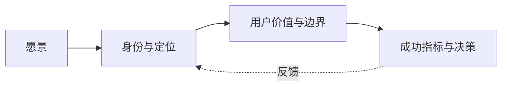

# 00 · 产品宪章

## 子模块导航



| 子模块 | 评审焦点 |
|---|---|
| [身份与定位](01-identity-positioning.md) | 产品为谁存在、以什么身份进入市场、名字承诺什么 |
| [用户价值与边界](02-user-value-boundaries.md) | 核心 Job、用户控制权、非目标与危险边界 |
| [成功指标与决策](03-success-metrics-decisions.md) | 北极星、护栏指标、阶段门和争议裁决方式 |

本页保留大模块的完整宪章；子文档只把需要单独评审的决定展开，不另立一套愿景。

## 1. 从愿景到工程承诺

> **让时间带走人的生命，却带不走人曾经留下的记忆与经验。**

这句话是愿景，不是一个可由测试证明的存储 SLA。V2 必须把它逐层翻译，避免两种失败：只剩情绪口号，或为了“可验证”把人的意义删掉。

| 层 | 表述 | 如何检验 |
|---|---|---|
| 愿景 | 人留下的记忆与经验不因时间流逝而消失 | 不直接验收，负责提供方向 |
| 产品 | 一次工作产生可追溯、可修正、可继承的经验，而非只剩最终回答 | 用户可查看来源、复用、纠正、导出、遗忘 |
| 系统公理 | 可被系统声称为事实的内容，必须先成为带来源的已提交事件或 Observation | 不满足来源要求的写入被拒绝 |
| 安全裁决 | 记忆可以跨越会话，权限不得跨越当前意图 | 恢复时重新求值 authority，旧 approval 不自动复活 |
| 数据裁决 | 原始证据不可由摘要替代；摘要可被重建、质疑和废止 | 删除投影后能从事件重建；修订保留血缘 |

“永恒”在工程上只能被诚实地表达为：**开放格式、版本迁移、内容校验、可导出、可恢复、可由用户持续托管**。任何单一磁盘、公司或模型都不能保证真正永恒。

## 2. 最初服务谁

V2 的首批用户不是“所有需要数字永生的人”，而是希望用一个 Agent 持续处理多类真实工作、并在不同会话间保留上下文的个人用户。开发者是重要首批用户，但不是唯一人群，也不是产品定位的边界。多人团队共享明确延后到 V2 之后；V2 先把单用户控制、跨会话连续性与证据治理做扎实。首批能力应分阶段交付；编码与项目维护是高价值、证据密集的场景之一，而不是 Outlive Agent 的全部定义。这类工作尤其容易留下可验证、结构化的经验资产：

- 为什么采用或拒绝某个架构；
- 某次故障是怎样定位和恢复的；
- 哪个命令、测试或约束真正证明了结果；
- 某个仓库的隐性约定和踩坑记录；
- 人与 Agent 之间逐渐形成的工作偏好；
- 哪些旧结论已经过期、被纠正或只在特定范围有效。

这是合理切口，因为工程经验天然拥有 Receipt、diff、test、commit、log 等证据。先把这类记忆做对，未来才有资格讨论更广泛的人生记忆。

### 2.1 第一阶段用户故事

1. 我重新打开三个月前的项目，Agent 能说明当时为什么这样设计，并给出原始讨论、代码和测试来源。
2. 我让 Agent 重做一个相似任务，它能找到过去成功和失败的 Experience Case，但会先检查适用条件是否仍成立。
3. 我发现一条记忆错了，可以修正或撤销；后续 Context 不再继续传播旧结论，但历史仍能解释发生过什么。
4. 进程在写文件或调用外部工具时崩溃，恢复后系统能区分“确认成功、确认失败、结果未知”，而不是盲目重试。
5. 我从 Web 切到 Desktop 或 CLI，看到的是同一个 Session、Run、证据和记忆状态。
6. 我能导出一个不含凭据、可校验的 Legacy Capsule，并用另一个兼容 Runtime 读取。

## 3. 核心对象不是“聊天记录”

| 对象 | 含义 | 是否真源 | 是否允许修改 |
|---|---|---:|---:|
| Event | 已提交的顺序事实 | 是 | 追加，不原地改写 |
| Artifact | 大体积原始材料或结果 | 是，需 hash/作用域校验 | 内容寻址后不可变；可按策略删除 |
| Receipt | 外部执行器返回的业务回执 | 是，但可能不足以确认最终状态 | 追加 |
| Observation | Runtime 对 Receipt、查询或验证的解释结果 | 是，必须写明证据和不确定性 | 追加新 Observation 修正 |
| Projection | 为 UI/API 派生的当前状态 | 否 | 可重建 |
| Episode | 将一段事件组织成可理解经历 | 否，属于派生物 | 可重新投影 |
| Memory | 经准入的长期可召回主张 | 不是原始事实；它引用真源 | 可 supersede/revoke/expire |
| Experience Case | 情境、行动、结果、验证和适用条件 | 不是原始事实；它引用真源 | 可修订并保留版本 |
| Legacy Capsule | 用户主动策展、可移植的记忆与经验证据包 | 导出物 | 通过新版本替代 |

因此，聊天文本只是一个 Projection。删除 UI 缓存不应删除事实；压缩 Context 不应改写历史；一条检索结果不应自动获得更高权限。

## 4. 产品人格

Outlive Agent 应该给人以下感受：

- **沉稳**：不急着声称完成，愿意说“结果未知，需要对账”。
- **有出处**：重要结论能展开到谁说的、何时发生、依据是什么。
- **可纠正**：允许用户推翻它，不用和旧记忆争夺 Prompt 优先级。
- **克制**：不默认保存所有私人内容，不把“可能有用”当永久保留理由。
- **持续**：换模型、换客户端、重启进程后仍能接着做。
- **可交付**：最终产物不只是对话，而是代码、证据包和可复用经验。

## 5. 核心差异化

### 5.1 Evidence-backed Memory

每条长期记忆必须回答：

- `claim`：它声称什么？
- `kind`：事实、偏好、步骤、教训还是身份声明？
- `origin`：用户、仓库、工具、外部系统、模型推断还是人工导入？
- `evidence_refs`：哪些事件、Receipt、Artifact 或验证支撑它？
- `scope`：只属于当前 Run、Session、Workspace、用户还是导出 Capsule？
- `trust/confidence`：来源可信度与推断置信度分别是多少？
- `validity`：何时生效，何时过期，哪些条件下不适用？
- `status`：candidate、active、disputed、superseded、revoked 或 expired？
- `consent`：为什么允许保存和再次使用？

没有这些字段的“记忆”只是缓存文本。

### 5.2 Unknown-first Runtime

外部动作只有三种结论：确认成功、确认失败、结果未知。未知不是一个要被日志吞掉的异常，而是一等状态：

```text
planned → dispatched → receipt_received
                    ↘ process_lost / timeout
                         → unknown
                         → reconcile
                         → confirmed | failed | still_unknown
```

这让系统能安全恢复，而不是因为“工具没有返回”就再次发送邮件、再次提交付款或再次写入远程状态。

### 5.3 Experience, not only facts

事实回答“是什么”；经验还回答“在什么情境下，做了什么，为什么有效或失败”。V2 将 Experience Case 设计为一等对象：

```text
Context + Constraints
  → Decision
  → Action / Tool attempts
  → Receipt / Observation
  → Verification
  → Outcome
  → Applicability + Counterexamples
```

失败案例同样进入经验库，但必须标明失败原因和不可复用部分。

## 6. 权限与记忆的分离

最危险的误区是：既然 Session 和 Memory 可以长期存在，过去的授权也应继续存在。V2 明确相反：

| 可以延续 | 必须重新确认或重新求值 |
|---|---|
| 历史 Event、Artifact 引用、用户批准保存的 Memory | 写文件、执行命令、访问网络、使用凭据、调用外部 API |
| 任务目标与进度 | 当前 workspace、policy、permission preset、credential availability |
| 过去采用某方案的理由 | 现在是否仍要采用该方案 |
| 旧 Receipt 与恢复状态 | 对未知副作用是否允许重试 |

一句话：**继承知识，不继承权力。**

## 7. V2 非目标

### 7.1 不做人格复刻

V2 不训练“像某个人一样说话”的替身，不代表逝者作决定，也不将推断出的性格包装成本人意愿。未来若探索个人 Legacy，必须满足：显式策展、来源可见、身份边界、撤销/继承规则和伦理评审。

### 7.2 不做无边界控制平面

V2 先证明自有 Runtime 的事实链。只有外部执行器提供结构化事件、稳定 operation id、明确 Receipt 和可对账接口时，才可能增加 Adapter；读屏、猜日志或解析自然语言不能成为可信适配。

### 7.3 不以工具数量代替通用任务能力

Outlive 需要成为能围绕用户目标组合工具、执行并验证多类任务的完整 Agent，而不是只做记忆层或 UI 壳；但也不盲目复制其他产品的全部功能清单。产品差异在于：通用任务执行有明确边界、结果有证据、经验能跨会话治理和复用，而不是单纯比工具数量。

### 7.4 不用不可删除来证明“永恒”

用户控制高于留存叙事。撤销、隐私范围、密钥销毁、合法删除和组织保留政策必须是正式状态，而不是后台脚本。

## 8. 成功指标

V2 早期不以“记住了多少条”衡量成功，而以以下指标衡量：

| 维度 | 指标示例 |
|---|---|
| 可靠性 | crash→resume 成功率、unknown action 对账率、取消到静默的时间 |
| 记忆质量 | 有有效来源的 active memory 比例、被用户纠正率、过期命中率、引用可打开率 |
| 经验复用 | Experience Case 被召回后提高一次性通过率；由本地可验证结果与后续 Langfuse 外部 paired evaluation 共同观察 |
| 可解释性 | 用户能否从答案跳回支持它的事件/工件/验证 |
| 可移植性 | Capsule 在全新环境校验并恢复的成功率 |
| 安全 | 越权记忆召回、跨 workspace 泄漏、旧 approval 复活必须为零 |
| 使用价值 | 用户主动保留/导出/复用的记忆数量，而不是自动写入数量 |

## 9. 对外表达建议

短版：

> **Outlive Agent — memory with evidence, work that survives the session.**

中文版：

> **让工作记忆有来源，让人的经验能被时间之后的自己继续使用。**

技术版：

> **A local-first agent runtime for durable sessions, evidence-backed memory, safe recovery, and portable experience.**

不要在尚未实现前使用“永久”“不会丢失”“完整复刻”“适配所有 Agent”等绝对词。
