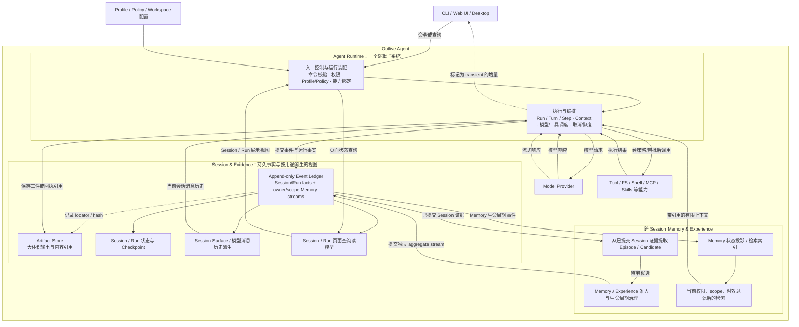
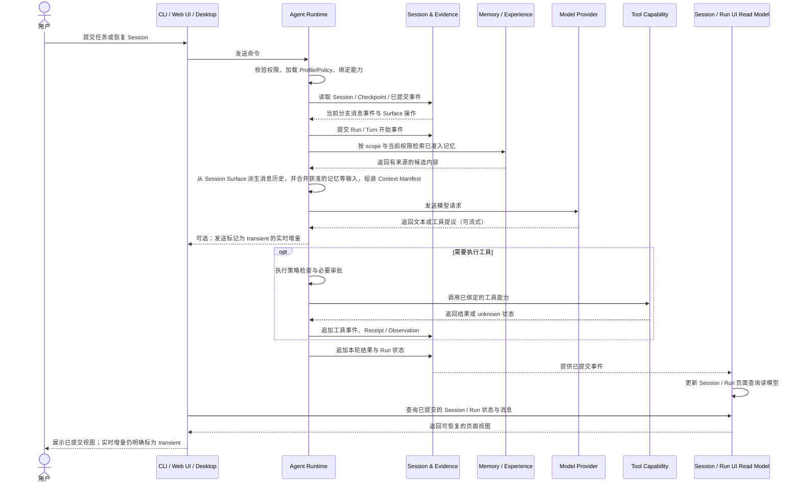

# Agent Runtime 与 Session/Evidence 协作边界

## 1. 先看它们在整体架构中的位置

这里不再把 Control、Runtime、Truth 画成三个同级“平面”。**入口控制与执行编排共同组成一个 Agent Runtime 子系统**；Session/Evidence 是 Runtime 使用的持久化与事实记录子系统；模型和工具则是 Runtime 调用的能力提供方。

图中边框表示**职责归属**，箭头表示**逻辑调用或数据流**，都不表示进程边界。尤其要注意：

- Control 不是 Runtime 外面的另一个产品层；它是 Agent Runtime 的入口控制与装配职责。
- Session/Evidence 不是第三个 Agent Runtime 平面，也不是某个 Tool；它保存执行记录与证据，供 Runtime、客户端和 Memory 使用。
- “Truth”描述的是事实记录的可信要求，不是必须独立部署的一层服务。
- Memory/Experience 从已提交证据中学习；经过治理的记忆可以进入后续 Context，但不能改写历史事件。

这里有四类名字相近、用途不同的派生结果，不能统称为一个 `Projection`：

| 派生结果 | 从什么派生 | 给谁使用 | 是否直接作为模型输入 |
|---|---|---|---|
| **Session / Run 页面查询读模型** | 已提交的 Session、Run、Tool、Receipt、Observation 等事件 | Controller 和客户端查询状态、列表、详情、时间线 | 否；它服务 UI 查询 |
| **Session Surface / 模型消息历史** | Session 中已提交的消息事件及分支、压缩等 Surface 操作 | Runtime 的 Context Assembly，构建本轮模型消息历史 | 是其一部分；还需与 system 指令、工具定义、获准记忆等一起组装为 Context Manifest |
| **Episode 经历派生物** | 已提交 Session/Run 事实和明确的经历边界 | 经验提取、审核与来源追溯 | 通常否；它是学习/评审材料，不自动当作提示词 |
| **Memory 状态投影 / 检索索引** | 独立 Memory/Experience aggregate stream 的准入、修订、撤销等生命周期事件 | Memory 查询、冲突/状态管理和受策略约束的检索 | 不直接；只有检索通过当前权限、scope、时效和预算后，内容才可能进入 Context Manifest |

因此，**页面读模型不是模型消息历史**；Episode 经历派生物不是长期 Memory；Memory 的状态投影也不是 Session 查询投影。DSH 的 `deriveMessages()` 可帮助理解第二类：它从 Session 的消息事件/Surface 操作派生模型侧消息历史，而不是生成 UI 查询结果，也不是实现跨 Session Memory 生命周期。若这里说的是本地 `dsh-memory-cain/dsh-memory-dev` 文档中的 Memory projection，那是你提出的长期记忆状态派生设计，不是 DSH 当前已实现的 `deriveMessages()`，二者处理的数据和目的不同。`Projection` 只是“从某类已提交事实重建某种只读派生结果”的实现模式，具体文档和模块必须标明是哪一种。

## 2. 各部分分别负责什么

| 部分 | 通俗理解 | 主要职责 | 不负责什么 |
|---|---|---|---|
| 产品入口 | 用户操作界面 | CLI、Web UI、Desktop 发送命令并展示结果 | 不持有权威 Run、Session、Approval 或 Memory 状态 |
| Agent Runtime：入口控制与装配 | 任务入口和调度准备 | 校验命令、当前身份与权限；加载 Profile/Policy；绑定本次允许运行的能力接口；创建或恢复 Run | 不执行具体模型/工具实现，不把持久化记录当作自身内存状态 |
| Agent Runtime：执行与编排 | 真正推进任务的执行器 | 驱动 Run/Turn/Step，组装 Context，调用模型，按策略分发工具，处理取消、重试和委派 | 不成为唯一历史来源；不直接绕过接口修改客户端状态或 Ledger |
| 能力提供方 | Runtime 可调用的“工具箱” | 提供 Model、文件系统、Shell、Terminal、MCP、Skills 等可替换实现 | 不决定整个 Run 的下一步，不拥有 Session 生命周期 |
| Session & Evidence | 可核验的运行记录和证据库 | 追加事件；保存 Receipt、Observation、Artifact 引用；提供 Session/Run 状态、Checkpoint、页面查询读模型与 Replay | 不替模型决定行动；派生视图不反向修补历史事实 |
| Memory & Experience | 跨会话整理出的可治理经验 | 从已提交证据形成候选，经检查/准入后保存；按 scope、权限、时效和预算向后续 Context 提供内容 | 不把相似文本自动当成事实；不继承历史权限或审批 |

Agent Runtime 内部仍可按代码职责拆成 Controller、Profile/Composition、Agent Loop、Context、Tool Pipeline 等模块；“归为一个 Runtime”是总图上的系统分组，不要求它们写在同一个文件或物理 package 中。

## 3. 一次请求实际怎样流动

下面展示的是用户发起任务后，Runtime 如何调用模型/工具并记录结果。它不是“控制平面调用运行平面再调用真源平面”的三段式架构。

同一轮里可能多次发生“组装 Context → 请求模型 → 执行工具 → 记录结果”。UI 页面查询读模型只负责恢复已提交的状态；流式增量可以先展示，但在提交前必须标记为 transient。Runtime 的模型历史由 Session 消息事件/Surface 派生，不从页面查询读模型反向读取。只有已提交到 Session/Evidence 的事实才能作为已记录结果对外呈现；如果副作用结果不确定，应保留 `unknown` 并进入 reconcile，而不是根据工具退出码猜测成功。

## 4. 几个容易混淆的词

| 术语 | 在这里的意思 | 不是这个意思 |
|---|---|---|
| 命令校验 / 准入 | 在启动或恢复 Run 前，检查请求、当前用户、workspace、权限和策略是否允许 | 不是把 Prompt 发给模型，也不是模型同意执行 |
| Profile / 能力绑定 | 根据当前配置选择允许使用的 Model/Tool Provider，并以接口交给 Runtime | 不是 Runtime 执行期间反向调用 Controller 临时绕过策略 |
| Context Manifest | 记录本次准备交给 Model Provider 的上下文内容、来源和版本 | 不代表远端模型一定读懂、采纳或依赖了这些内容 |
| append / commit | Runtime 请求保存事实；存储确认后，该事件才算已提交 | 发出写入请求不等于事实已持久化 |
| Session / Run 页面查询读模型 | 从已提交执行事件派生、供客户端查询和展示的可重建视图 | 不是模型消息历史，也不是 Memory 状态投影 |
| Session Surface / 模型消息历史 | 从当前 Session 的消息事件及 Surface 操作派生，供 Context Assembly 使用 | 不是 UI 页面读模型；也不是完整 Context Manifest |
| Episode 经历派生物 | 从有边界的 Session/Run 事实组织出学习/评审材料 | 不是页面状态，也不是长期 Memory |
| Memory 状态投影 / 检索索引 | 从 Memory 生命周期事件派生的当前状态、冲突视图和检索索引 | 不是 Session/Run 页面投影；检索命中也不会自动进入模型请求 |
| Session / Memory | Session 记录某次执行；Memory 是经治理、可能跨 Session 复用的经验 | Session 不是 Tool；Memory 也不是聊天记录的无条件永久拼接 |

## 5. 调用规则

1. **入口统一交给 Agent Runtime**：CLI、Web UI、Desktop 只通过稳定的命令/查询接口交互，不直接改 Run、Session 或 Memory。
2. **Runtime 内部先装配、再执行**：命令校验、权限与 Profile/Policy 求值、能力 Provider 绑定在执行前完成；执行循环只拿到本次授权的接口，不通过回调入口层临时扩大权限。
3. **模型与工具是能力调用，不是数据层**：Runtime 向 Model Provider 发请求，按策略调用 Tool Provider；请求/响应、工具动作及其结果由 Runtime 通过 Session/Evidence 接口记录。
4. **意图和已提交事实分开**：Runtime 发起 append 后，只有收到持久化确认，才能把事件标记为已记录；关键外部副作用还必须有 Receipt/Observation，未知结果进入 reconcile。
5. **派生视图只读、可重建且按用途隔离**：Session/Run 页面查询读模型、模型消息历史、Episode 和 Memory 状态/检索索引各自有明确的输入事实与消费者；均不得反向写 Ledger。页面读模型不进入模型请求，Memory 检索也必须经过权限、scope 和预算检查。
6. **Memory 有准入和使用边界**：长期记忆从证据产生候选，经治理后才提交；召回时重新检查用户、workspace、scope、时效和当前策略，并记录本次 Context/MemoryUse 边界。
7. **端口是代码契约，不是进程承诺**：模块间可用进程内接口；禁止共享可变领域对象。跨边界错误使用稳定错误码和 `trace_id`，内部异常文本不作为客户端协议。

## 6. 失败与恢复边界

- 命令校验或授权失败：不启动 Run，也不产生“Run 已开始”的事实。
- 模型或工具调用失败：Runtime 记录失败/中断状态；重试必须有界且可见。
- 外部副作用结果不确定：记录 `unknown`，保留 Receipt/Observation 线索并安排 reconcile，不把 HTTP 200 或进程退出码等同于业务成功。
- Evidence 写入失败：不得向用户声称对应事实已持久化；若外部副作用可能已经发生，必须走不确定结果的恢复路径。
- Session/Run 页面查询读模型落后或损坏：Ledger 仍是事实来源，可依据事件游标重建；查询需能表达其版本/游标。模型消息历史则从 Session 事件与 Surface 操作独立重建，不能依赖 UI 查询读模型。
- 客户端断连：不自动等同于取消 Run；是否继续由 Host 生命周期与明确策略决定。

## 7. 部署边界与 DSH 对照

本设计规定职责和依赖方向，不裁决进程拆分。V2 初期可以让入口控制、Agent Loop、Session/Evidence 存储运行在同一 Host；之后只有在隔离、安全、恢复或多消费者需求明确时，才通过 ADR 决定是否拆进程。

这也不是要求把所有代码放进一个 package。对照 DSH 源码时，`packages/core/agent-loop` 与 `packages/core/session` 分别承载执行循环和 Session 职责；在 Outlive 的**产品总图**里，前者属于 Agent Runtime，后者属于 Runtime 使用的 Session/Evidence 支撑系统。包目录的并列不代表它们是相同性质的系统层，也不要求 Outlive 采用完全相同的包边界。

**当前目标裁决**：入口控制与执行编排合称 Agent Runtime；Session/Evidence 负责持久事实与可重建读取；能力提供方由 Runtime 按策略调用；Memory 从已提交证据中受治理地产生并回到后续 Context。进程数、存储介质、查询一致性范围仍需后续 ADR 决定。

## 8. 关键参数

| 参数 | 设计含义 | 建议起点 / 裁决方式 |
|---|---|---|
| `runtime_process_count` | 入口控制、执行编排与 Session/Evidence 存储是否拆成独立进程 | 初期同 Host；仅在隔离、安全、恢复或多消费者需求明确时由 ADR 拆分，不预先承诺进程边界 |
| `composition_digest` | Run 开始时装配组合（Profile/Bundle/Provider 版本）的稳定摘要 | 写入 Run header；用于事后解释“当时到底运行了什么”，不保存完整敏感配置 |
| `ui_read_model_cursor` | Session/Run 页面查询读模型的版本 / 游标 | 由已提交事件派生；落后或损坏时可按游标从 Ledger 重建，查询需能表达其版本 |
| `transient_delta_policy` | 流式增量在提交前的可见性与标记 | 允许先展示，但必须明确标记 transient；不得与已提交事实混淆 |
| `memory_use_boundary` | 一次模型请求实际获准使用的记忆范围 | 记录本次 Context / MemoryUse 边界；检索命中不等于进入请求，须过权限、scope、时效与预算 |
| `side_effect_receipt_required` | 是否要求关键外部副作用携带 Receipt / Observation | 关键动作必须；结果不确定时保留 `unknown` 并进入 reconcile，不以退出码推断成功 |

## 9. 验收矩阵

| 场景 | 输入 / 触发 | 通过条件 | 必须失败的反例 |
|---|---|---|---|
| 三平面表述回归 | 文档或图表中重新出现并列的 Control / Runtime / Truth 三个同级平面 | 入口控制与执行编排归入同一 Agent Runtime；Session/Evidence 表述为持久事实子系统 | 把 Control 画成 Runtime 之外的独立系统层 |
| 页面读模型被当作模型历史 | 试图用 Session/Run 页面查询读模型组装模型请求 | Runtime 从 Session 消息事件与 Surface 操作派生模型历史，页面读模型不进入模型请求 | 页面读模型直接被读来构造 Prompt |
| 读模型落后 / 损坏 | 人为使查询读模型落后或写入损坏快照 | 以 Ledger 为事实来源按游标重建；查询返回可表达版本的结果 | 依据损坏读模型对外声称已提交状态 |
| Evidence 写入未确认即宣告成功 | 持久化确认前返回“已记录” | 只有收到持久化确认才标记为已记录；写入失败不声称事实已持久化 | append 请求发出即宣告成功 |
| 外部副作用结果不确定 | 工具已执行但 Receipt 缺失 | 保留 `unknown` 并安排 reconcile | 以 HTTP 200 或进程退出码判定业务成功 |
| 记忆越权进入 Context | 检索命中旧会话的高权限内容 | 按当前用户、workspace、scope、时效与预算重新过滤，并记录 MemoryUse 边界 | 命中即注入，继承历史权限 |
| 客户端断连被当作取消 | 客户端断连而 Run 仍在执行 | 由 Host 生命周期与明确策略决定是否继续，不自动取消 | 连接断开即提交 `cancelled` |
