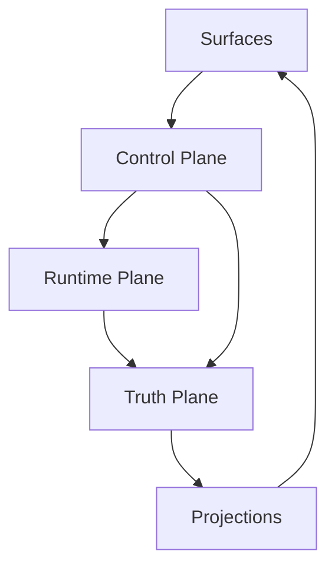
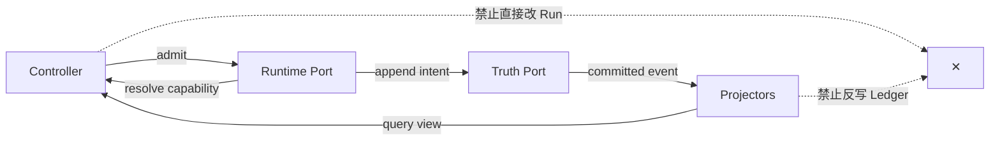

# 运行、控制与真源平面

## 1. 位置与目的

三平面解决的不是部署拓扑，而是**事实所有权和故障隔离**。V2 初期可同进程运行；即便如此，也不得用跨层对象引用绕过端口。

## 2. 平面职责

| 平面 | 拥有 | 接收 | 产出 | 明确不拥有 |
|---|---|---|---|---|
| Control | profile、workspace binding、controller、policy/credential resolution | 客户端命令、配置、身份上下文 | 已校验 command、组合后的 ports | Run 内部状态、事件真源 |
| Runtime | Run/Turn/Step、loop、cancel、retry、tool decision | admitted command、capability ports | domain intent、tool proposal、checkpoint request | UI 状态、持久化实现、具体 provider |
| Truth | Event、Receipt、Observation、Artifact metadata、Session/Projection | append request、transaction intent | committed cursor、replay stream、query view | 模型决策、客户端乐观状态 |

Memory/Experience 位于 Truth 之上的受治理数据平面：它只能引用或投影已提交事实，不能制造过去发生过的事件。

## 3. 调用规则

允许同步调用端口，禁止共享可变领域对象。所有跨平面失败必须被归一化为稳定错误码并携带 `trace_id`；内部异常文本不作为协议。

## 4. 故障边界

- Control 失败：命令尚未 admitted，不得产生 Run 开始事件；
- Runtime 失败：写入 terminal/interrupted 事实或留待 recovery，不得只靠进程退出表达；
- Truth append 失败：Runtime 不得向用户声称副作用已记账；
- Projection 失败：Ledger 仍是真源，可从 cursor 重建；
- Surface 断连：不得自动取消仍由 Host 拥有的 Run，除非命令策略明确指定。

## 5. 最小端口

| Port | 核心操作 | 幂等键 |
|---|---|---|
| `ControlPort` | `admitCommand`, `resolveProfile`, `authorize` | `command_id` |
| `RuntimePort` | `startRun`, `resumeRun`, `cancelRun`, `inspectRun` | `run_id + command_id` |
| `TruthPort` | `appendBatch`, `readStream`, `loadCheckpoint` | `stream_id + expected_version` |
| `QueryPort` | `getSession`, `listRuns`, `getMemoryView` | 只读 cursor |

## 6. 关键参数

| 参数 | 推荐 | 说明 |
|---|---|---|
| `append_mode` | optimistic concurrency | 用 expected version 检测双 owner |
| `projection_consistency` | read-your-own-write for command result；其余 eventual | 用户刚执行的命令不能立即“消失” |
| `runtime_ownership` | 单 Run 单 owner lease | 多进程前也先固定语义 |
| `surface_disconnect_policy` | keep-running | 由用户显式 cancel，后台任务不绑 UI socket |

## 7. 决策与验收

接受：三平面是逻辑边界，初期不强制三进程。待定：Truth 是否独立进程、lease 存储实现、强一致 Query 范围。

验收以失败注入证明：任一 Surface 重启不改变权威状态；Projection 可删除后重建；Runtime 无法导入具体 Web/Electron/provider；Truth 写冲突不会产生两个成功 owner。

