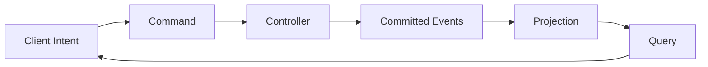
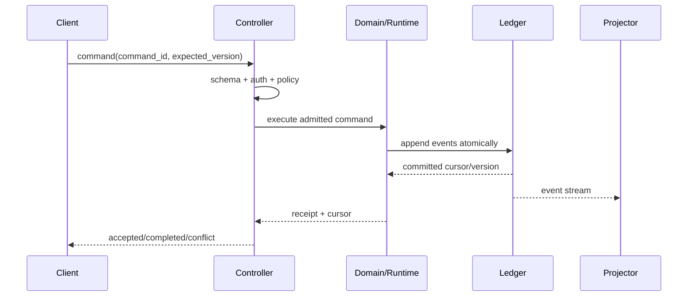

# 命令、查询与事件模型

## 1. 在父模块中的位置



Command 请求改变事实，Query 读取投影，Event 记录已提交事实。三者可以共享基础 ID/错误类型，但不能用同一个 DTO 混在一起。

## 2. Envelope

```ts
type CommandEnvelope<T> = {
  schemaVersion: number;
  commandId: CommandId;
  kind: string;
  actor: ActorRef;
  workspaceId?: WorkspaceId;
  expectedVersion?: number;
  issuedAt: string;
  payload: T;
};
```

Event 还必须包含 `event_id`、`stream_id`、`stream_version`、`occurred_at`、`causation_id`、`correlation_id`、`producer_version` 和领域 payload。时间用于排序展示，流版本用于并发正确性。

## 3. 处理时序



HTTP 200、RPC success 或 CLI exit 0 只说明传输/进程成功；业务成功由 domain receipt、Observation 与终态共同表达。

## 4. 一致性与幂等

| 场景 | 规则 |
|---|---|
| 重复 `command_id`，payload 相同 | 返回原结果/receipt，不重复副作用 |
| 重复 `command_id`，payload 不同 | `idempotency_conflict` |
| `expected_version` 过期 | `version_conflict`，不自动覆盖 |
| 事件已提交，响应丢失 | 客户端按 `command_id` 查询结果 |
| 外部副作用未知 | 进入 `reconciling`，不能盲目重试 |

## 5. 版本策略

- Envelope 版本与领域事件版本分开；
- 新 consumer 必须容忍未知可选字段，但不得吞掉未知 discriminator；
- breaking event 通过 upcaster 或新 kind 演进，不原地改变旧事实含义；
- Projection schema 可重建，迁移失败不能修改 Ledger；
- 协议返回稳定 `error.code`、可展示 message、retryability 与 evidence refs。

## 6. 关键参数

| 参数 | 推荐 | 待决定点 |
|---|---|---|
| `command_dedupe_retention` | 至少覆盖所有可重试窗口 | 长期命令是否永不清理 |
| `event_batch_atomicity` | 单 command 的领域事件原子提交 | 超大 Artifact 仅存引用 |
| `query_cursor` | opaque + monotonic within projection | 跨投影全局 cursor 是否需要 |
| `schema_compat_window` | 当前 + 前一稳定版本 | 发布策略确认后固定 |

## 7. 验收与开放问题

验收包括重复命令、响应丢失、并发版本冲突、旧事件重放、未知新字段和投影重建。待定：长任务采用 `accepted + event stream` 还是统一 operation resource；建议后者，以便 CLI/API/Desktop 共享状态。

