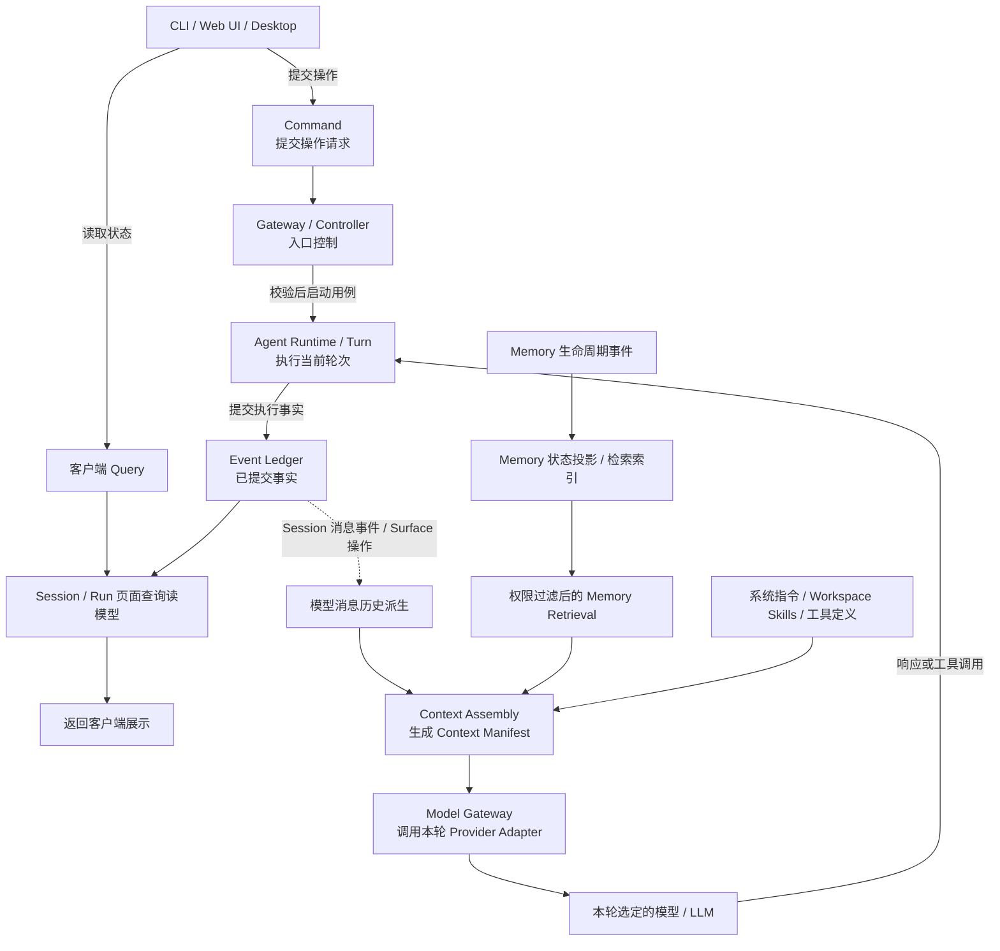
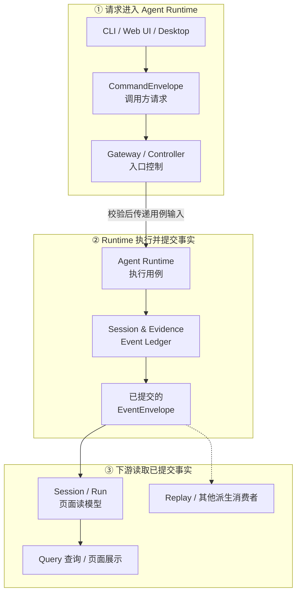
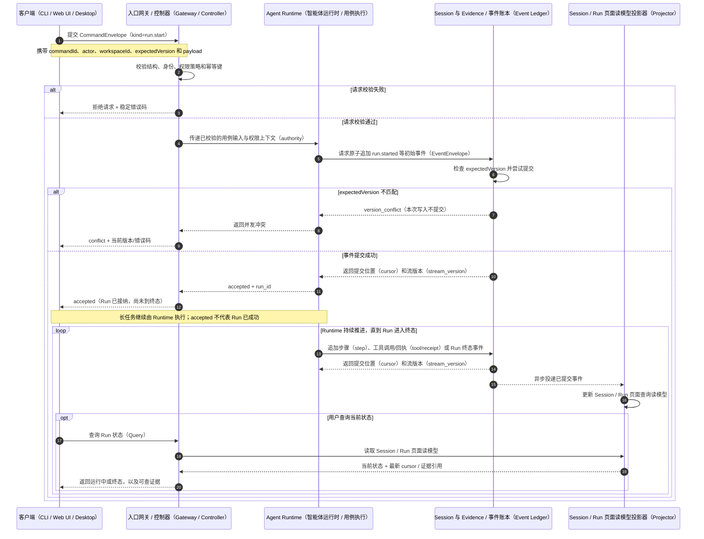

# 命令、查询与事件模型

## 1. 在父模块中的位置

这里的“父模块”具体指[系统架构总览](README.md)，不是 Agent Runtime 内的某个代码包。该总览列出四个并列的架构子模块；本文是其中负责内部 Command / Query / Event 契约的一个：

```text
docs/outlive-agent-v2.md                         V2 总入口
└── docs/outlive-agent-v2/01-system-architecture/README.md  父模块：系统架构总览
    ├── 01-agent-runtime-session-evidence.md      相邻子模块：Runtime 与 Session/Evidence 边界
    ├── 02-command-query-event-model.md           本文：命令、查询与事件契约
    ├── 03-identity-state-recovery.md             相邻子模块：身份、状态与恢复
    └── 04-profiles-composition.md                相邻子模块：Profile 与组合根
```

它在父模块里的职责位置是：**为 CLI、Web UI、Desktop 到 Agent Runtime 的操作定义统一协议，并约束 Runtime/领域命令如何提交事实、客户端如何查询具名读模型。** 它与相邻模块的分工是：Runtime/Session 文档讲执行和持久化边界；身份/恢复文档讲 authority 与恢复状态；Profile 文档讲依赖装配。本文不取代它们。

下图画的是**本文涉及的数据流，不是父子模块或目录层级**。其中 Session 消息历史和 Memory 检索两条支路是相邻数据路径，特意放在这里用于说明它们不是客户端 Query 读取的页面读模型。



Command 请求改变事实，Event 记录已提交事实，Query 读取某个明确的只读数据产品。图中的客户端 Query 读取 **Session / Run 页面查询读模型**；它不是 Runtime 组装模型消息历史的入口，也不是 Memory 检索。当前 Session 消息历史、系统指令、Workspace Skills、工具定义及获准的 Memory 一起进入 Context Assembly，生成 Context Manifest。Manifest 随后交给 Model Gateway，由它调用本轮 Provider Adapter 和选定的模型；模型响应或工具调用回到 Agent Runtime 继续执行。Memory 状态投影/索引则服务 Memory 管理和受策略约束的 Retrieval。

`Projection` 是一种派生实现方式，不是全系统唯一的一张投影表。每个读模型/索引必须声明自己的真相事件、用途、消费者、版本和重建方式。

## 2. 两种 Envelope 在架构中的位置

先看它们在一次操作里的位置，再看字段定义。两者处在不同边界：`CommandEnvelope` 是入口送进系统的请求；`EventEnvelope` 是执行路径产生、由 Event Ledger 提交保存的事实记录。



换成一次 `run.start` 操作来理解：客户端把命令请求交给 Controller；Controller 校验命令类型、身份、策略和版本后，将业务输入交给 Runtime 执行。Runtime/领域处理路径不会把这条命令原样当作事件保存，而是把执行中确认发生的事实提交给 Ledger；Ledger 接受并提交后，事实以 Event Envelope 形式供读模型、回放等消费者使用。一个命令可能产生多条事件，也可能在提交业务事实前被拒绝，因此 Command 和 Event 不是一一对应的镜像。

这里的 Envelope 是**逻辑数据契约**，不是独立服务、进程，也不指定必须采用某种序列化或网络传输。CLI、Web UI、Desktop 可以使用各自的内部调用/传输方式，但进入 Controller 的命令语义和 Ledger 中保存的事实语义应保持一致。下面的字段定义是 V2 目标协议示意，不代表当前仓库已经有完全对应的统一实现。

## 3. Command Envelope 是什么

`CommandEnvelope<T>` 定义的是**命令请求对象的统一结构**：CLI、Web UI、Desktop 要求系统执行一项操作时，把“这是什么命令、谁发起、在哪个 workspace、基于哪个版本、具体业务输入是什么”等信息放在同一个对象里。从调用方看，整个对象会作为请求输入；其中 `payload` 才是该命令专属的业务参数，其余字段是协议元数据。它不是发给 LLM 的 tool-call 参数。

下面是 V2 提案中的 TypeScript 类型示意，`<T>` 是泛型：不同 `kind` 可以对应不同的 `payload` 类型。例如启动 Run 的 payload 与取消 Run 的 payload 不同，但都复用同一个外层结构。**这段定义表达目标协议，不代表当前仓库已经有一个全局 `CommandEnvelope` 类型或完全相同的线上 wire format。**

```ts
type CommandEnvelope<T> = {
  schemaVersion: number;
  commandId: CommandId;
  kind: string;
  actor: ActorRef;
  workspaceId?: WorkspaceId;
  expectedVersion?: number;
  issuedAt: string;
  payload: T;
};
```

| 字段 | 含义 | 约束 / 示例 |
|---|---|---|
| `schemaVersion` | 这层命令信封结构的版本 | 用于识别外层字段结构如何解析；不等于某一种业务 payload 或 Event 的版本 |
| `commandId` | 本次逻辑命令的唯一 ID，也用作幂等键 | 因网络超时重试同一命令时沿用原 ID；同 ID、不同 payload 应报冲突，不能重复执行副作用 |
| `kind` | 命令类型/分派标识 | 决定由哪个 Controller/领域处理器处理，以及 `payload` 应符合什么 schema；例如 `run.start`、`run.cancel` |
| `actor` | 发起者的身份引用（`ActorRef`） | 表示“谁在请求”，不是密码、token 或权限证明；系统仍须按当前策略重新鉴权 |
| `workspaceId?` | 命令作用的 workspace | 仅对需要 workspace 范围的命令填写；缺省的含义由该命令契约定义，不能自动解释为更大权限 |
| `expectedVersion?` | 写入前预期的目标 aggregate/stream 版本 | 防止基于旧状态覆盖新状态；实际版本不匹配时返回 `version_conflict`。它不是整个 Event Ledger 的全局版本 |
| `issuedAt` | 客户端创建该命令的时间 | 建议 RFC 3339/ISO 8601 UTC 格式，仅作审计和诊断线索；不能代替服务端授权或 `stream_version` 并发排序 |
| `payload` | 该命令专属的业务输入 | 结构由 `kind` 决定；例如 `run.start` 可承载任务目标，具体 schema 由相应命令定义 |

可以把它理解为“统一信封 + 命令专属正文”：`kind` 告诉系统如何解释 `payload`，`commandId` 让重试可去重，`expectedVersion` 让并发写入可检测。

## 4. Event Envelope 字段

Event Envelope 位于上图的 **Event Ledger 提交边界**：命令执行路径提交已确认发生的事实，Ledger 持久化这些事实并提供给下游消费者。Event 不是“请求做什么”，而是“系统确认发生了什么”。事件至少应包含下列元数据和领域 `payload`；其中 `kind` 与 `event_schema_version` 用于识别事件类型及其数据结构：

| 字段 | 含义 | 与其他字段的区别 |
|---|---|---|
| `event_id` | 单个事件的唯一 ID | 用于引用、去重和追踪这一条事件 |
| `kind` | 事件类型，如 `run.started` 或 `tool.receipt_recorded` | 与命令的 `kind` 不同：命令表示请求，Event 表示已发生事实 |
| `event_schema_version` | 该事件类型及其 payload 的结构版本 | 与命令信封的 `schemaVersion`、产出事件的软件版本都不同 |
| `stream_id` | 事件所属的 aggregate/stream ID | 表明事实归属哪个 Session、Run 或独立的 Memory stream；不代表全局顺序 |
| `stream_version` | 此事件在所属 stream 内的单调递增版本 | 用于该 stream 的排序、并发检查和恢复；不同 stream 之间不保证可比较 |
| `occurred_at` | 事件所描述事实发生的时间 | 用于审计和展示；准确的提交顺序以 stream 版本/提交记录为准 |
| `causation_id` | 直接导致此事件的命令或前序事件 ID | 表达“它直接由什么触发” |
| `correlation_id` | 将同一次较大的操作/流程中的命令和事件关联起来的 ID | 表达“它属于哪一组流程”；范围通常比 `causation_id` 更大 |
| `producer_version` | 产生该事件的 Outlive 组件/软件版本 | 用于追溯生产者版本；不是事件 payload 的 schema 版本 |
| `payload` | 该事件类型特有的事实数据 | 由 `kind` + `event_schema_version` 决定结构；只记录事件所需内容，不应把凭据等秘密直接写入 |

简单区分：`commandId` 标识一次请求；`event_id` 标识一条事实；`stream_id + stream_version` 定位事实在某个状态流中的位置；`causation_id` 连接直接因果，`correlation_id` 把相关事实归入同一流程。

## 5. 一次命令的处理时序（以 `run.start` 为例）



图中各参与者的职责是：客户端发起命令并展示状态；入口网关 / 控制器（Gateway / Controller）校验请求并分派用例；智能体运行时（Agent Runtime）执行 Run；事件账本（Event Ledger）原子保存已发生事实；页面读模型投影器（Projector）只消费已提交事件并更新查询视图。

`accepted`（已接纳）只表示 Run 已开始推进，不表示最终成功；结果要看后续终态事件和对应证据。只有同步完成的短命令才可能在同一次调用中返回 `completed`（已完成）；版本前置条件不满足则返回 `conflict`（冲突），且不提交本次写入。长任务最终状态采用操作资源（Operation Resource）还是事件流（Event Stream）提供，仍待裁决。

HTTP 200、RPC 成功响应或 CLI 退出码为 0，只说明传输或进程层没有报错；业务结果要依据业务回执（receipt）、观察结果（Observation）和 Run 终态共同判断。

## 6. 一致性与幂等

| 场景 | 规则 |
|---|---|
| 重复 `command_id`，payload 相同 | 返回原结果/receipt，不重复副作用 |
| 重复 `command_id`，payload 不同 | `idempotency_conflict` |
| `expected_version` 过期 | `version_conflict`，不自动覆盖 |
| 事件已提交，响应丢失 | 客户端按 `command_id` 查询结果 |
| 外部副作用未知 | 进入 `reconciling`，不能盲目重试 |

## 7. 版本策略

- Envelope 版本与领域事件版本分开；
- 新 consumer 必须容忍未知可选字段，但不得吞掉未知 discriminator；
- breaking event 通过 upcaster 或新 kind 演进，不原地改变旧事实含义；
- Session/Run UI Read Model、模型消息历史与 Memory Index 的 schema 各自可重建；迁移失败不能修改 Ledger；
- 协议返回稳定 `error.code`、可展示 message、retryability 与 evidence refs。

## 8. 关键参数

| 参数 | 推荐 | 待决定点 |
|---|---|---|
| `command_dedupe_retention` | 至少覆盖所有可重试窗口 | 长期命令是否永不清理 |
| `event_batch_atomicity` | 单 command 的领域事件原子提交 | 超大 Artifact 仅存引用 |
| `query_cursor` | opaque + monotonic within named read model/index | 不同读模型之间是否需要全局 cursor |
| `schema_compat_window` | 当前 + 前一稳定版本 | 发布策略确认后固定 |

## 9. 验收与开放问题

验收包括重复命令、响应丢失、并发版本冲突、旧事件重放、未知新字段，以及分别重建 Session/Run UI Read Model、模型消息历史和 Memory Index。待定：长任务采用 `accepted + event stream` 还是统一 operation resource；建议后者，以便 CLI/Web UI/Desktop 共享状态。这里的协议是内部客户端契约，不代表提供独立公共 API。
