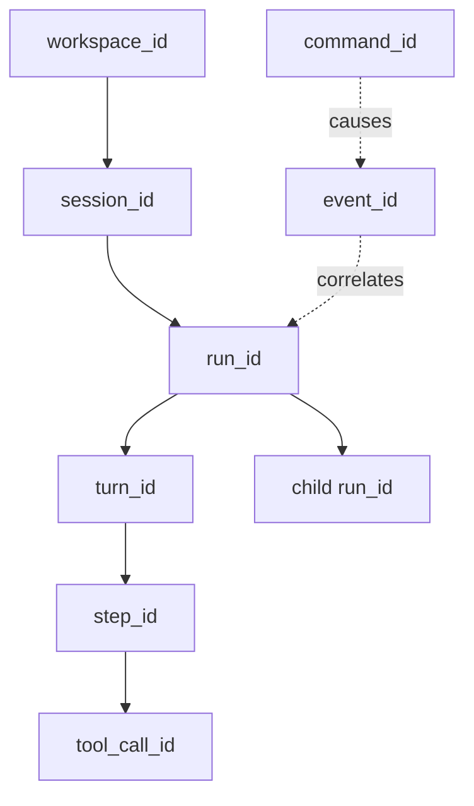
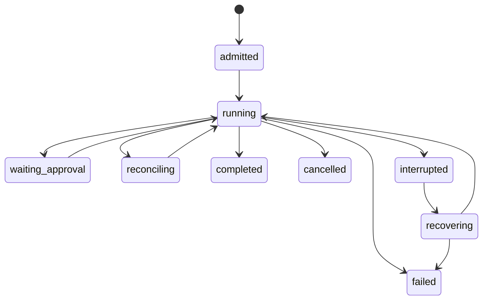
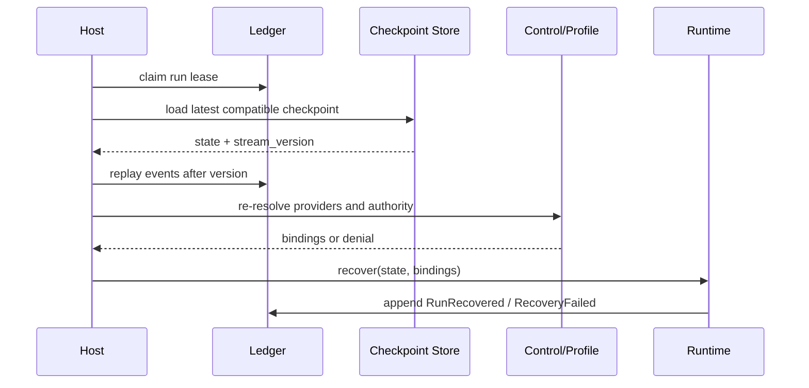

# 身份、状态与恢复设计

## 1. 身份层级

ID 表示稳定身份，cursor/version 表示观察位置，进程内对象地址不进入协议或持久格式。父子 Run 共享 `trace_id`，但各自拥有独立状态机和取消令牌。

## 2. 核心状态机

终态不可回到 running；恢复必须产生新的 attempt/lease，不篡改旧 attempt。`waiting_approval` 不等于暂停进程，而是一个可持久化领域状态。

## 3. Checkpoint 内容

Checkpoint 是恢复优化，不是真源替代。最小内容：

- 所属 stream version 与兼容格式版本；
- Run/Turn/Step 状态和未决 operation；
- 已提交 context manifest，而不是任意内存对象；
- tool call 的 intent、receipt 状态与 reconcile token；
- child ownership、cancel lineage 和 budget consumption；
- profile digest 与不可序列化 provider 的重建键。

凭据、打开的文件句柄、终端 PTY 和网络连接不得直接序列化；恢复时由 Control Plane 根据当前 authority 重新绑定。

## 4. 恢复时序

## 5. 恢复裁决

| 未决状态 | 恢复策略 |
|---|---|
| 模型请求未获响应 | 依据 provider idempotency 能力决定重试或重开 step |
| 工具未开始 | 可安全重新调度 |
| 工具有 receipt 且业务成功 | 不重跑，恢复 Observation 投影 |
| 工具外部状态未知 | reconcile，默认不重跑有副作用操作 |
| approval 已给但 authority 改变 | 旧 approval 失效，重新求值 |
| child 仍被另一 owner lease | 等待/接管规则处理，不双跑 |

## 6. 参数与不变量

| 参数 | 推荐起点 |
|---|---|
| `checkpoint_trigger` | terminal 前、外部副作用后、上下文压缩后及可配置 step 间隔 |
| `lease_ttl` | 大于两次 heartbeat 抖动窗口，具体由 benchmark 定 |
| `max_recovery_attempts` | 按错误类配置，不设全局盲重试 |
| `checkpoint_compatibility` | 当前格式 + 明确 migrator |

不变量：单 Run 同时一个 owner；终态 append 一次；checkpoint 不能领先 Ledger；任何恢复后注入模型的内容都能从 Session/Memory 重新生成。

## 7. 验收与待评审

验收需证明进程中断后事件不丢、单 Run 不出现双 owner、未知副作用不盲重跑、旧 authority 不复活，并能从 checkpoint + tail events 得到与连续执行一致的领域终态。

待评审：

- 长工具执行由 Runtime owner 还是独立 operation worker 持有 lease；
- checkpoint 使用单文件、SQLite 还是与 Ledger 同事务；
- 多设备接管是 V2 目标还是仅预留身份模型。
