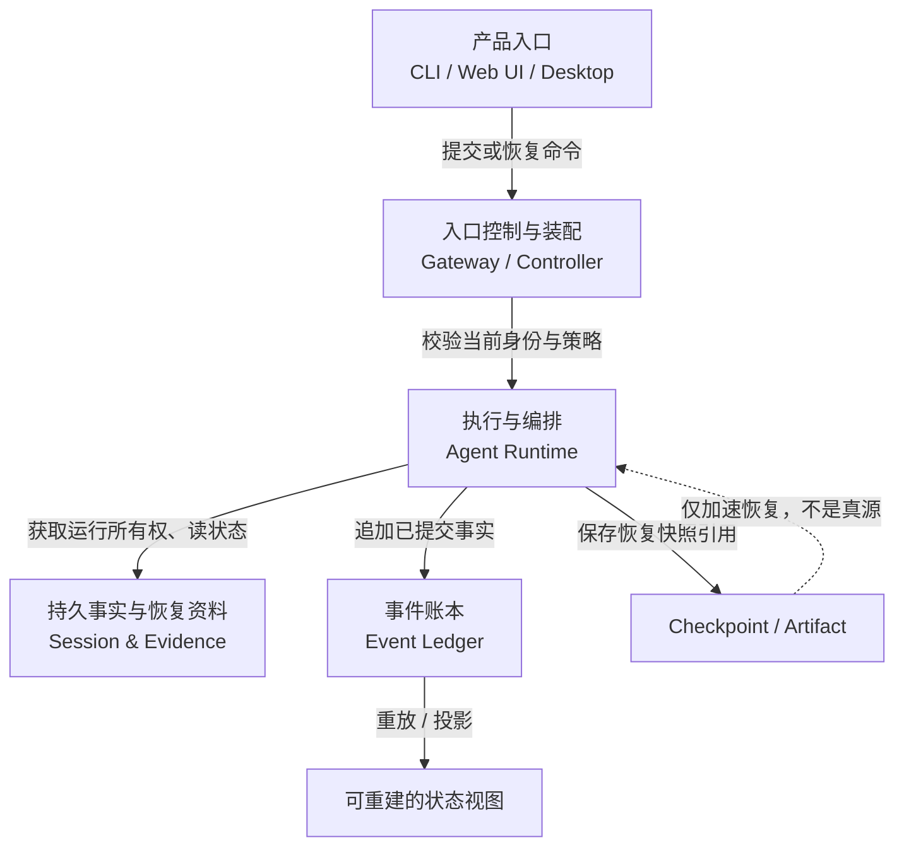
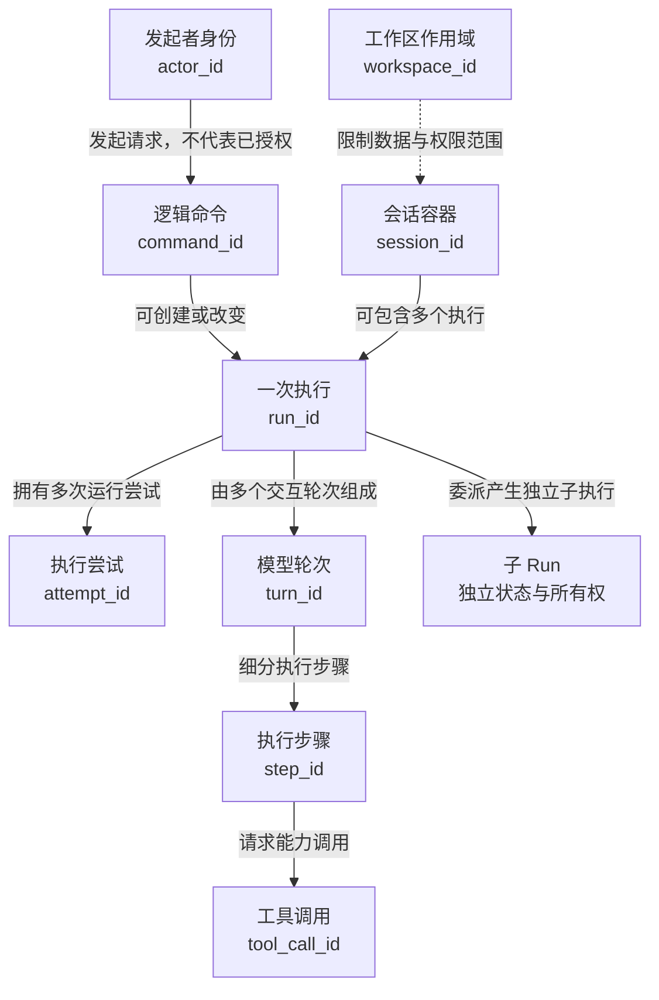
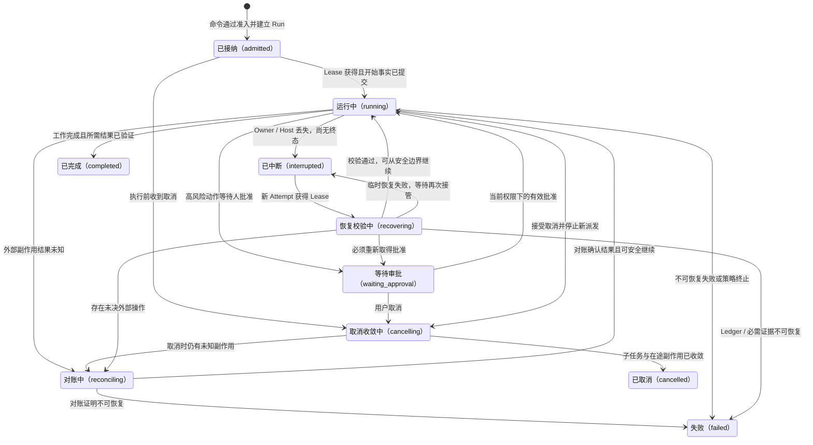
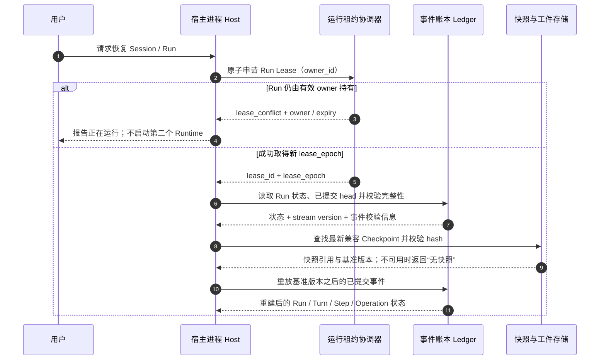
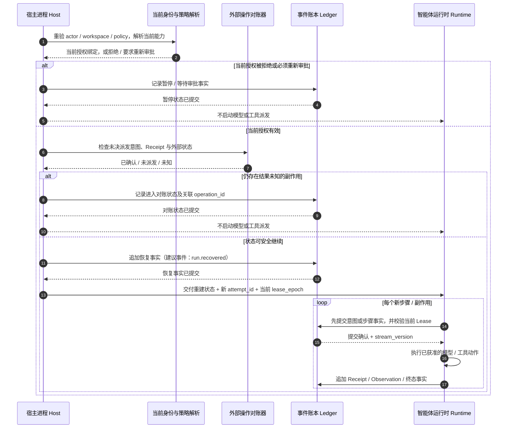

# 身份、状态与恢复设计

## 1. 位置、范围与设计目标

本模块是[系统架构总览](README.md)下的一个横切契约：它约定 Runtime 如何命名一次工作、如何判断工作处于什么状态、谁有权继续推进，以及进程退出后如何从持久事实中恢复。它由 Agent Runtime 与 [Session & Evidence](01-agent-runtime-session-evidence.md)共同使用，**不是一个新的服务、产品平面或独立的持久化真源**。



图中身份、Run 状态、Lease 和 Checkpoint 是 Runtime 与 Session/Evidence 之间共同遵守的协议。即使初期它们运行在同一个 Host 或使用同一数据库，也仍是不同职责；本设计不要求进程拆分，也不预设具体数据库。

本文是 **V2 目标设计（`proposed`）**。当前 TraceGraph 的实际行为以[现有 Agent Runtime 文档](../../modules/02-Agent-Runtime.md)为准；不要把本文提出的 Run Attempt、fencing lease 或通用 Checkpoint 契约当作已经实现的现状。

本模块要保证：

1. 任何 Run、命令、事件和外部操作都能被稳定关联，不依赖内存对象地址。
2. 一个 Run 在任一时刻至多有一个可写、可派发副作用的所有者；旧所有者失效后不能“复活”写入。
3. Ledger 是运行事实真源；Checkpoint 只能缩短恢复时间，不能覆盖或超越 Ledger。
4. 恢复必须区分“未执行”“已确认完成”和“结果未知”；未知副作用不能盲目重跑。
5. 恢复时重新检查当前 authority / policy；历史知识、approval 和凭据都不自动继承。

## 2. 身份模型：每个 ID 标识什么

身份是稳定引用，版本 / cursor 表示在某个事实流中的位置。下面的关系是逻辑归属与追踪关系，不代表 ID 必须编码父 ID，也不自动授予权限。



| 标识 | 标识的对象 | 生命周期与边界 | 容易混淆的地方 |
|---|---|---|---|
| `actor_id` | 发起命令或当前操作的主体 | 由入口认证层解析；命令只携带身份引用，运行和恢复时都要按当前身份重新鉴权 | ID 本身不是凭证，也不意味着拥有原先的权限 |
| `workspace_id` | 数据 / 权限作用域 | 限定一次命令、Session 或 Artifact 可作用的 Workspace；是否允许无 Workspace 由具体命令契约决定 | 是作用域，不是 Session 或用户身份；不能仅凭它授权 |
| `session_id` | 持续对话与工作脉络 | 可包含多个 Run；保存消息事件、Surface 操作及 Run 引用 | Session 不是单次模型请求，也不是 Memory |
| `run_id` | 一次可观察、可恢复的任务执行 | 从接纳到 `completed / failed / cancelled`；中断恢复沿用同一 `run_id` | 恢复不应伪装成一个全新的用户任务 |
| `attempt_id` | 一次 Runtime 获得所有权后的执行尝试 | 初次运行和每次接管使用新值；旧 Attempt 保留为历史，不原地覆盖 | 不等于新的 `run_id`；也不等于单个模型或工具 HTTP 重试号 |
| `turn_id` | Run 内一轮模型交互及其后续动作 | 一轮可能包含模型请求、工具调用、工具结果和再次请求 | Turn 不是 Run；恢复时是否延续原 Turn 由最后提交的事件决定 |
| `step_id` | Agent Loop 中一个可追踪的执行步骤 | 关联输入、决策、等待、工具和结束事实 | 不能只用进程内数组下标标识持久步骤 |
| `tool_call_id` | 一次逻辑工具调用意图 | 与工具 schema、参数摘要、policy、approval 和 Receipt 关联 | 网络重试若仍是同一外部操作，须另外保持稳定 `operation_id` / 幂等键 |
| `operation_id` | 一项可能产生外部副作用的逻辑操作 | 从首次写入派发意图开始保持稳定；查询、重试、对账和 Receipt 均沿用此 ID | 不等于某一次网络请求；网络请求可有多个 `request_attempt_id`，但仍属于同一 operation |
| `approval_id` | 对某个具体动作或计划的审批记录 | 绑定 actor、action digest、scope、策略版本和有效期；恢复时重新检查是否仍有效 | 不能作为可跨时间、跨身份复用的授权令牌 |
| 子 `run_id` | 委派给子 Agent / Workflow 的独立执行 | 有自己的 Run 状态和 Lease；父子通过 lineage / `trace_id` 关联 | 父 Run 不能把子 Run 当作自己内存中的普通函数调用，也不能重复启动仍存活的子 Run |
| `command_id` | 一次逻辑命令请求 | 同一请求的重试沿用 ID，用于幂等与结果查询 | 不等于 `run_id`：一次命令可能创建 Run，也可能只改变设置或发出取消 |
| `event_id` | 一条已经提交的事实 | 不可复用；Replay / Receipt 引用具体 Event | 不代表该事实在全局的排序位置 |
| `stream_id` + `stream_version` | 某个事实流及其流内提交位置 | 版本只在同一 Stream 内单调递增；用于并发校验和恢复 tail | 不是全局 Event 序号，也不是 `run_id` 的替代 |
| `trace_id` | 跨命令、Run、子 Run 的诊断关联 | 通常由根操作传播到子执行，便于跨模块查找 | 只用于关联 / 观测；不是身份认证、权限凭据或持久状态 |
| `lease_epoch` | 一次所有权代次 / fencing 序号 | 每次成功接管严格递增；每次写入都必须验证仍是当前代次 | TTL 到期本身不能阻止暂停后恢复的旧进程继续写 |
| `checkpoint_id` | 一份不可变恢复快照 | 指向 Run / Stream 的特定基准版本和内容哈希 | 不等于 Ledger 中的事件，也不能替代事件历史 |

**恢复 Attempt 与请求 Attempt 要分开**：进程重启或 owner 接管会产生新的 `attempt_id`；但若恢复的是同一已记录的外部操作，`operation_id` / 幂等键必须保持不变。只有明确创建了一项新的逻辑操作，才产生新的工具调用和 operation 身份。

**权限不沿身份层级继承**：父 Run 与子 Run 可以共享 trace lineage 和任务来源，但子 Run 必须按自身当前 actor、workspace、tool allowlist、预算与 policy 重新校验；恢复只继承可追溯事实，不继承旧凭据、approval 或权限。

## 3. Run 状态机：运行到哪里、恢复意味着什么

Run 状态是由已提交事件派生的领域状态，不是 Runtime 内存字段。`accepted` 是命令响应状态，不是 Run 状态；Run 被接纳后进入 `admitted`，长任务可在命令返回 `accepted` 后继续执行。



| 状态 | 通俗含义 | 进入条件 | 离开条件 / 重要限制 |
|---|---|---|---|
| `admitted` | 系统接受了这项 Run 请求，但执行尚未推进 | 命令格式、actor、scope、policy 等准入检查通过 | Lease 获得并提交开始事实后进入 `running`；拒绝的命令不应伪造一个已启动 Run |
| `running` | Runtime 可继续推进 Agent Loop | 当前 Attempt 持有有效 Lease，必要的 Profile / Capability 已绑定 | 可等待审批、对账、取消、完成、失败或被标记中断 |
| `waiting_approval` | 需要用户或策略指定的审批者作决定 | 高风险工具、计划或副作用需要审批 | approval 必须绑定具体 action digest，并按当前 authority 重验；旧批准不能自动复用 |
| `cancelling` | 已停止创建新的动作，正在收尾 | 收到有效取消请求 | 子 Run、工具进程和在途副作用收敛后才能 `cancelled`；未知外部结果先转 `reconciling` |
| `reconciling` | 一个副作用是否发生还不能确定 | 超时、断连或崩溃落在 dispatch 与 receipt 之间 | 只有 Receipt / 外部状态证据足以判定后才继续或失败；未决时不得盲目重试 |
| `interrupted` | 曾在运行的 Run 失去执行者，结果尚未终结 | Host / Runtime 意外退出、Lease 失效且没有终态事件 | 可恢复但不是“失败”，也不等于用户取消；接管必须创建新 Attempt |
| `recovering` | 新 owner 正在验证快照、重放事件和检查副作用 | 新 Lease 与 fencing epoch 已取得 | 此阶段禁止模型 / 工具副作用派发；通过后再恢复，其他情况进入审批、对账、中断或失败 |
| `completed` | 任务按要求完成且必要验证已结束 | 结果与完成条件均有持久证据 | 终态；不可重新进入 `running` |
| `failed` | 已确认任务无法按策略继续 | 不可恢复错误、必需事实损坏或明确终止 | 终态；重试应创建新 Run 或新的显式业务操作，不改写旧终态 |
| `cancelled` | 取消已经安全收敛 | 不再派发新动作；子执行与副作用均已停止或完成对账 | 终态；仅发出 cancel 命令不等于已取消 |

**状态与事件的约束**：状态跃迁必须由 Ledger 中可重放的事实支持。典型事实可包含 `run.started`、`approval.requested`、`action.dispatched`、`receipt.recorded`、`run.interrupted`、`run.recovered`、`run.completed` 等；这些是命名示意，最终事件名必须进入统一 Event Catalog。对同一 Run 的终态提交必须幂等，终态后拒绝追加会改变业务结论的事件。

### 3.1 Run 与 Attempt 的关系

`Run` 是用户能看到并查询的**逻辑任务**；`Attempt` 是某个 Runtime owner 实际推进该任务的一段执行任期。一次 Run 可因崩溃、接管或明确重试而有多个 Attempt，但任一时刻只能有一个 Attempt 持有当前 Run Lease。

| 对象 | 例子 | 失败 / 恢复后的处理 |
|---|---|---|
| Run | “分析这个仓库并修复测试” | 保留原 `run_id`、原始目标和已提交事实；终态不可被恢复改写 |
| Attempt | Host A 第一次执行；Host B 接管后第二次执行 | 每次取得新的执行所有权创建新 `attempt_id`；前一 Attempt 标记为中断/被取代并保留证据 |
| 外部操作 | 一次提交 PR、写文件或调用外部 API | 对同一逻辑操作保留 `operation_id`；具体网络尝试可增加 request attempt，但不得因此把 unknown 当成可安全重做 |

因此，用户界面主要展示 Run 的状态；Attempt、Lease epoch、请求重试属于诊断与恢复细节。恢复不是“新建任务”，而是“同一 Run 在新 Attempt 下继续”，除非用户显式选择重新开始。

## 4. Lease 与执行所有权

Lease 表示某个 Host / Runtime 暂时拥有推进 Run、写入运行状态的资格；它**不是用户权限**。每个 API、Ledger append 和副作用派发仍需检查 actor / policy。Lease 解决的是并发 owner 与进程接管，不负责证明工具业务成功。

| 字段 / 操作 | 目标语义 | 为什么需要 |
|---|---|---|
| `run_id` | Lease 保护的 Run | 防止两个 Host 同时推进同一 Run |
| `owner_id` | 当前 Host / Runtime 实例标识 | 诊断 Lease 属于哪个执行者；不是用户 `actor_id` |
| `lease_id` | 一次 Lease 生命周期标识 | 区分释放、续约、接管与审计记录 |
| `lease_epoch` | 每次成功接管递增的 fencing token | 旧 owner 即使暂停后恢复，也因 epoch 过期而不能 append / dispatch |
| `expires_at` / heartbeat | 发现失联 owner 的租约时间与续约信号 | TTL 负责判断可接管窗口；不能单独解决 stale writer |
| acquire | 原子比较当前 owner / expiry，并产生新 epoch | 两个竞争者只能有一个获得所有权 |
| renew | 只有当前 owner + epoch 可续约 | 旧 owner 不能复活旧 Lease |
| release | 运行正常结束或安全交接时释放 | 不能在副作用仍 unknown 时把 Run 伪装为已收敛 |

所有持久写入和新副作用派发都必须携带并校验当前 `lease_epoch`。如果 Epoch 不符，存储层拒绝写入；Runtime 收到 stale-owner 错误后必须停止派发、丢弃可重建的内存状态。仅在 Host 层检查 Lease 不够，因为旧进程可能在暂停后恢复。

需区分两种锁：

- **Run execution lease**：谁可以继续执行这个 `run_id`；这是本设计建议的所有权单位。
- **Session / Stream writer lock**：谁可以向某个文件或共享流串行追加；这是存储实现可能需要的锁。

二者的作用域未必相同，不能用一个未定义的“Session lease”同时代表执行 owner 和存储写锁。目标建议按 Run 做执行 fencing，并由 Ledger 自己保证 Stream append 的版本并发；是否还需要 Session 级 writer lock，留给存储 ADR 裁决。长时间外部工具究竟由 Runtime owner 持有还是交给独立 operation worker 持有，也需明确 Lease 转移与 receipt 归属后再决定。

父子 Run 各持有独立 Lease。父恢复时若 child 仍有有效 owner，只能查询 / 等待 / 发送受策略约束的取消，不能再 spawn 一个相同 child；child 失联后应按自己的 Run 状态独立恢复。

## 5. Checkpoint：格式、捕获边界与有效性

Checkpoint 是 Ledger 事实的加速快照，**Ledger 仍是唯一事实真源**。恢复等价关系是：`checkpoint(base_version) + replay(events > base_version) == 从 Ledger 完整重放的 Run 状态`。Checkpoint 可以落后，但绝不能领先、覆盖或反向修改 Ledger。

下面是**V2 契约草图，不是当前实现的固定 TypeScript API**；实际字节可放在 Artifact / Checkpoint Store，索引与原子性由后续 ADR 决定：

```ts
type RunCheckpointRef = {
  checkpointId: CheckpointId;
  sessionId: SessionId;
  runId: RunId;
  streamId: StreamId;
  baseStreamVersion: number;
  baseEventId: EventId;
  baseEventHash: string;
  schemaVersion: number;
  attemptId: AttemptId;
  leaseEpoch: number;
  stateArtifactRef: ArtifactRef;
  stateHash: string;
  createdAt: string;
};
```

这份引用的字段各自负责定位和校验，而不是保存一份可独立相信的运行状态：

| 字段 | 用途 |
|---|---|
| `checkpointId` | 这份不可变快照引用的唯一标识 |
| `sessionId` / `runId` / `streamId` | 确认快照属于哪个 Session、Run 与事实流，防止跨范围误用 |
| `baseStreamVersion` / `baseEventId` / `baseEventHash` | 说明快照对应的 Ledger 提交位置，并验证锚点 |
| `schemaVersion` | 选择读取器或迁移器；不兼容时退回较早快照或完整重放 |
| `attemptId` / `leaseEpoch` | 记录创建快照时的执行任期，供审计和诊断；旧 epoch 不使快照自动失效，也不授权新 owner |
| `stateArtifactRef` / `stateHash` | 定位快照字节并验证内容完整性；locator 仍须做 scope 检查 |
| `createdAt` | 展示与诊断时间，不代替 Ledger stream version 决定顺序 |

| 内容类别 | Checkpoint 保留什么 | 不保留 / 恢复时怎么做 |
|---|---|---|
| 重放锚点 | `stream_id`、`base_stream_version`、最后 Event ID/hash、Checkpoint schema 版本 | 不可只存“最近一次保存时间”；必须能定位确切提交位置 |
| 执行游标 | 当前 Run / Turn / Step 的可序列化进度、预算消耗、取消 lineage | 内存对象地址、Promise、AbortController 实例不持久化；恢复时按引用重建 |
| Context | Context Manifest 的不可变引用、版本和 hash；需要时从 Session/Artifact 重建具体内容 | 不把不透明的 Prompt 拼接内存对象当真相；凭证不进入 Manifest 或快照 |
| 工具 / 外部操作 | dispatch intent、稳定 `operation_id`、幂等键、Receipt / Observation 引用和当前 outcome 分类 | 不将“请求已发出”推断为“业务成功”；unknown 保持 unknown 并进入 reconcile |
| approval | 待批 action / plan 的 revision 与 digest、请求事实引用 | 不持久化可跨进程复用的 bearer token；恢复后按当前权限重新授权 |
| child Run | parent-child lineage、child `run_id`、最后观察到的状态 / cursor | 不复制 child 的内存状态、不恢复 child 的旧 owner |
| Profile / Provider | Profile digest、逻辑 provider 标识和兼容版本 | 不序列化 API key、Credential、socket、SDK 客户端；恢复时从当前安全配置重新装配 |
| 大对象 | Artifact locator、MIME、长度、hash 和 scope | 不把大工具输出内嵌重复到多个快照；恢复读取时重新校验 locator 和 scope |

Checkpoint 只能在一致的安全点捕获：相关事件已提交；所有外部操作都处于明确的 intent / receipt / unknown 状态；快照状态确实对应 `baseStreamVersion`。推荐顺序为“基于已提交版本 N 捕获 → 写不可变快照并验 hash → 再写入可发现的 Checkpoint 引用”。若中途崩溃，未被引用的快照是孤儿，可忽略并后续清理；Ledger 仍可完整重放。

选择规则：

1. 只考虑 `run_id / stream_id` 匹配、hash 有效、schema 当前可读或有 migrator 的快照。
2. `baseStreamVersion` 必须小于或等于 Ledger 当前已提交 head；大于 head 的快照视为不可信，不能截断事件历史。
3. 优先选择最新的兼容快照，再重放其后的所有已提交事件；不能因为快照“看起来更新”而跳过 Ledger tail。
4. 快照损坏时退回更早兼容快照；没有可用快照时从 Ledger 起点重放。
5. Ledger hash chain / 必需 Artifact 不可验证时 fail-closed：不调用模型、工具或外部副作用；输出恢复失败证据供诊断。

## 6. 恢复流程：接管、重建、对账、继续

恢复不是“把旧内存对象 deserialize 回来继续跑”，而是取得新 owner 后，以 Ledger 为锚重建最小运行状态，并先解决可能重复的外部副作用。



第一阶段只做**所有权接管和可信状态重建**。即使快照成功读取，也不能在此阶段调用模型或工具；有有效旧 owner 时直接返回冲突，不并行启动第二个执行者。



第二阶段才判断是否能**继续执行**。其中“对账器”是逻辑职责；`WAL` 若在实现中使用，只能是 Ledger 中可恢复的写前意图记录或其存储机制，不能形成第二套业务事实真源。若授权拒绝、需要重新审批或账本写入失败，流程必须停在可见状态，不得越过检查继续派发。

上图中的 Lease 协调器、Checkpoint Store 和 Profile Resolver 是逻辑职责，不要求成为独立进程。Runtime 必须等 `run.recovered` 事实提交成功后才能发出新的模型 / 工具请求；若这次写入失败，应停在恢复失败态，不能在 Ledger 不知情的情况下继续产生副作用。

恢复顺序的关键点：

1. **先取得 fencing Lease，再进行可写恢复**；若 Run 已有活 owner，仅可查询 / 等待，不得并跑。
2. **先检查 Ledger，再信任 Checkpoint**；先确定已提交 head 和 hash，再决定从哪个快照继续。
3. **Checkpoint + tail replay 重建状态**；页面读模型、Session 历史和 Memory 索引均不能取代 Ledger 重放。
4. **重新求值当前 authority**；重新读取当前凭据与 Provider 配置，验证 Workspace scope、Tool Policy、approval 和 Profile 兼容性。
5. **先对账再重派副作用**；有已提交 Receipt 不重做；没有 dispatch intent 的动作可按当前策略调度；dispatch 后结果未知的操作先对账。
6. **提交恢复事实后才继续**；旧 Attempt 封存，新 Attempt 以新 Lease epoch 写后续事件。

## 7. 未决操作恢复策略

| 崩溃窗口 / 观测到的状态 | 如何判断 | V2 目标策略 | 自动重试？ |
|---|---|---|---|
| 工具调用之前，没有 dispatch intent | Ledger / WAL 中不存在该 `operation_id` 的 intent | 按当前 policy 重新校验后，从安全边界派发 | 可以；仍受预算与重试上限约束 |
| intent 已提交，Receipt 未提交 | dispatch 可能已经到达外部系统 | 按稳定 `operation_id` 查询外部状态或调用 reconcile API | 默认不直接重复有副作用调用 |
| Receipt / Observation 证明业务成功 | 有可验证的业务回执与结果证据 | 不重跑；补建可重建状态并继续下一安全步骤 | 否 |
| Receipt 证明业务失败且明确可重试 | 失败类型、幂等能力与业务语义均允许 | 新建工具尝试，保留同一逻辑 operation 的幂等键 / 尝试 lineage | 有界重试 |
| 外部状态 unknown / diverged | 查询失败或证据互相矛盾 | 保持 `reconciling`；请求人工处置或等待下次对账 | 否，禁止盲重试 |
| 模型请求已提交但没有响应 | 请求 ID、Provider idempotency / response cache 可查询 | 能以相同 provider request key 恢复时查询；否则记录未知并依据成本/重复语义开启新模型 attempt | 不得声称 exactly-once |
| approval 曾通过但当前 actor / policy / action digest 改变 | 对比批准时绑定的 digest 与当前解析结果 | 旧 approval 失效；按当前策略重新申请批准 | 否 |
| 子 Run 仍由有效 owner 运行 | 读取 child Run 的 Lease 与状态 | 复用既有 child 引用，等待 / 查询；不创建重复 child | 否 |
| 取消已持久化但子任务 / 外部调用未收敛 | cancel event、child 状态、operation receipt 仍有未决项 | 停止新派发，取消 / 等待子执行，对未知动作先 reconcile | 否 |
| Profile / Provider 不可用或不兼容 | 对比冻结 digest、adapter version 与当前可装配能力 | 停止恢复并说明兼容性问题；只允许显式迁移或用户批准的新 Attempt | 否，不能静默换 Provider |

`unknown` 是一等状态，不是暂时等同于失败或成功。Receipt 可用于恢复业务事实，但只有按当前身份重新授权的 Runtime 才能继续执行新的动作。

## 8. 参数、默认原则与不变量

| 参数 | 设计含义 | 建议起点 / 如何裁决 |
|---|---|---|
| `lease_ttl` | owner 多久无 heartbeat 后可被视为失联 | 大于正常 heartbeat 抖动和调度停顿窗口；必须配合 epoch fencing，不能靠 TTL 单独防双写 |
| `lease_heartbeat_interval` | 活 owner 续租频率 | 可从 `lease_ttl / 3` 起测；以 Host 停顿、机器休眠和误接管负测调整 |
| `lease_epoch` | 成功接管时递增的 fencing 序号 | 强制单调递增；每个 mutation / dispatch 边界都校验 |
| `checkpoint_trigger` | 在什么安全点创建快照 | 事件数/时间间隔 + 高代价安全边界；外部操作必须先有明确 outcome，Context compaction 已提交后可触发 |
| `checkpoint_max_bytes` | 快照体积上限 | 由 Artifact 存储和恢复延迟基准裁决；超限外置大对象并保存引用 |
| `checkpoint_compatibility_window` | 可直接读取的快照格式范围 | 当前格式 + 有明确迁移器的历史格式；无法迁移时退回旧快照或从 Ledger 重放 |
| `max_recovery_attempts` | 自动接管 / 恢复上限 | 按错误类别设界；hash / policy / authority 错误不自动重试，短暂 I/O 故障可有限退避 |
| `reconcile_timeout` | unknown 外部动作自动对账多久 | 超时不推断结果；保持可见的 `reconciling`，转人工或后续重试查询 |
| `max_replay_events` / recovery SLO | 可接受的重放量与恢复时延 | 从完整 Ledger 回放基准和恢复延迟目标反推 checkpoint 频率，不先拍一个无证据的常量 |

必须维持的不变量：

- 同一 Run 只有当前 `lease_epoch` 可以写入或派发；旧 epoch 的 append / tool dispatch 一律拒绝。
- Checkpoint 必须指向已提交 Ledger 版本，写坏或写丢快照不会丢事实。
- 每个外部副作用先有可追踪 intent，再有 Receipt / Observation / unknown outcome；unknown 不自动重跑。
- Run 终态只能由明确的提交事实产生且幂等；取消请求本身不是 `cancelled`。
- 恢复创建新 Attempt，不修改旧 Attempt、命令、事件和已提交 receipt。
- Run 恢复永远按当前 authority / policy 决策；禁止恢复旧 Token、旧 approval 或旧权限。
- 子 Run 状态与 Lease 独立；父 Run 不可重复派生已有的活动子 Run。
- 页面读模型、Context Manifest 的索引和 Memory projection 都能从各自真源重建，不能反向修补 Ledger。
- 任何回到模型的 Session / Memory 内容必须保留来源、版本和当前权限过滤；不把 Checkpoint 快照直接当成可信 Prompt。

## 9. 验收矩阵

| 场景 | 故障注入 / 输入 | 通过条件 | 必须失败的反例 |
|---|---|---|---|
| Ledger tail 恢复 | 在 checkpoint version N 后追加事件，随后杀 Host | 新 Attempt 从 N+1 重放，最终 canonical projection 与完整回放一致 | 跳过 tail 或把旧快照覆盖新事件 |
| Checkpoint 超前 / 损坏 | base version 大于 Ledger head，或 hash 不匹配 | 丢弃该快照，尝试旧快照 / 全量 Ledger replay；无完整 Ledger 时 fail-closed | 信任损坏快照继续派发工具 |
| 双 Host 竞争 | 两个 Host 同时 claim 同一 Run | 只有一个拿到当前 epoch；另一个只返回 owner 冲突 | 两边都能 append 或调用 Tool |
| stale owner 复活 | 旧 Host 停顿，Lease 过期且新 Host 已接管，再恢复旧 Host | 旧 epoch 的 append 与 dispatch 均被拒绝 | 仅靠进程本地 `isOwner` 放行旧 Host |
| dispatch / receipt 崩溃窗 | Tool 已收到操作，Host 在写 Receipt 前被杀 | 恢复进入对账；成功不重做，未知不盲重试 | 因为没有 Receipt 就重复执行转账/写文件等副作用 |
| 当前权限收窄 | Run 中断后移除原有写权限或 Credential | 新 Run attempt 不能复用旧授权；明确等待、只读或失败 | 从快照恢复旧 Credential / approval 后继续写入 |
| Profile 漂移 | 原 Provider / Tool 版本不可用或 digest 改变 | 停止并显式给出迁移 / 重新授权路径 | 静默切到另一 Provider 并伪称确定性恢复 |
| child Run 接管 | 父 Run 恢复时 child 仍有 active lease | 复用既有 child，不产生第二个相同子任务 | parent 直接重新 spawn duplicate child |
| 取消收敛 | Run 在 Tool / child 执行中收到取消 | 不再发新动作；等待或对账完成后才提交 `cancelled` | cancel 按钮一按就返回已取消，但子进程仍写入 |
| 恢复内容脱敏 | 快照/Artifact 中包含凭据或后来登记为秘密的字符串 | 写入时最小化并脱敏；恢复读取时再次 scope/hash/secret 检查 | 通过 checkpoint 回放泄漏密钥 |

## 10. ADR 待裁决与明确延期

| 决策 | 当前建议 | 状态 |
|---|---|---|
| 执行 Lease 的保护单位 | Run 级 Lease + Ledger/Stream 自己的 append 并发控制；不把二者混为 Session lease | 需要存储与长工具执行方案共同裁决 |
| Lease 落点与原子 claim | 与 Ledger 同事务、SQLite compare-and-set 或专用 coordinator | 后续存储 ADR；先定义 fencing contract |
| Checkpoint 持久化 | 不可变 Artifact + Ledger 中可发现的引用；Checkpoint 落后允许，Ledger 永不依赖快照 | 后续 ADR 决定 SQLite / 文件 / Artifact 索引与清理策略 |
| 长工具执行 owner | Runtime 持有还是独立 operation worker 持有；必须先定义 Lease 交接、operation id 和 Receipt owner | 待纵向用例证明后裁决 |
| Provider / Profile 漂移 | authority 总是重验；provider digest 不匹配时默认暂停，不静默路由 | 明确兼容策略后裁决 |
| approval 被拒绝的终态 | 不允许继续执行；最终映射为 `failed` 还是 `cancelled` 需统一领域语义 | 待命令 / 事件契约一起裁决 |
| 长任务状态接口 | 操作资源（Operation Resource）还是事件流（Event Stream） | 由客户端协议模块裁决；不影响这里的 Ledger 真源原则 |
| 多人团队共享 Workspace / Memory 与跨成员 Lease | 不进入 V2，后续单独设计成员权限、共享 scope、冲突和撤销 | 已明确延期，不是本轮开放决策 |

本模块的验收目标不是“恢复成功率看起来高”，而是能用 Ledger、Checkpoint anchor、Lease epoch、Receipt / Observation 和最终状态证明：**没有双执行、没有丢事实、没有权限复活，也没有把未知副作用伪装成成功。**
