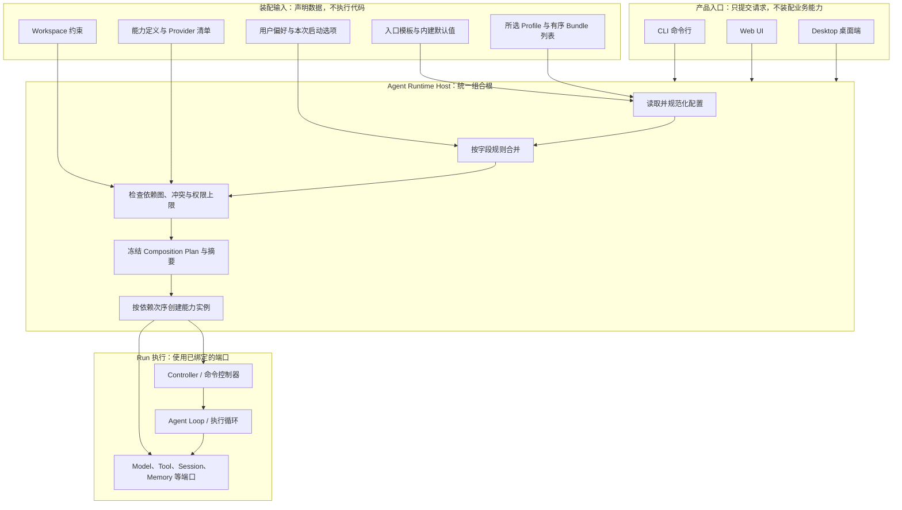
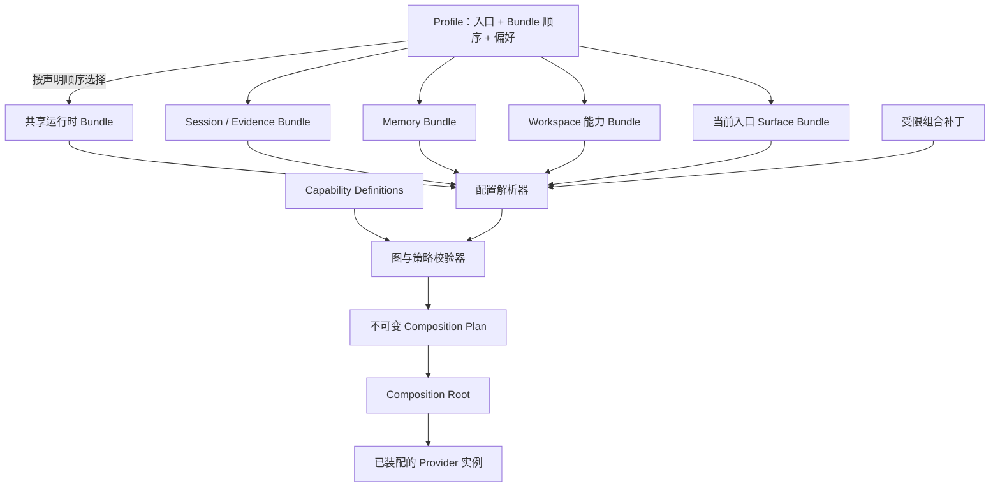
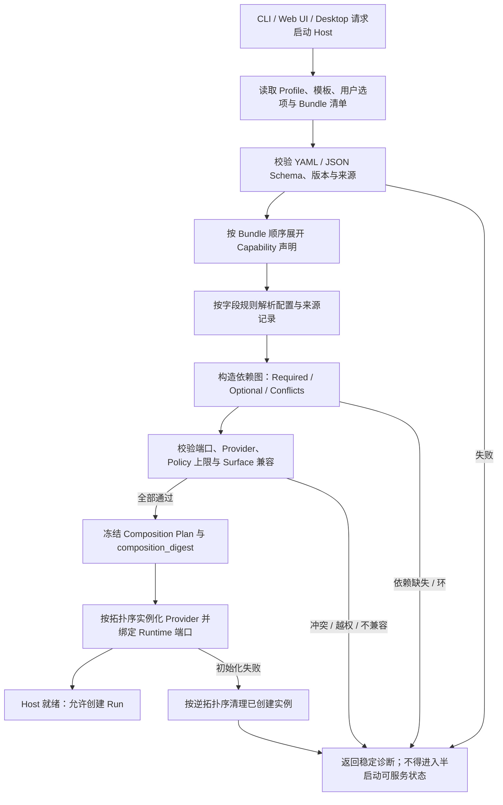

# Profile 与组合根设计

## 1. 位置与要解决的问题

本模块属于 **Agent Runtime 的启动装配职责**，位于产品入口和 Agent 执行循环之间。CLI、Web UI、Desktop 可以用不同的启动方式和传输适配器，但必须使用同一套 Profile 解析、能力图校验与组合规则；Surface 不得自行选择 Provider、拼装 Tool 或创建第二份业务状态。



这里的“组合根”是**负责把已声明的实现接线起来的代码位置**，不是一个独立服务或新的架构平面。它回答“本次 Host 加载哪些实现、怎样连起来”；Agent Runtime 回答“当前 Run 如何执行”；权限策略则回答“当前主体能否执行某个具体动作”。三者不能互相替代。

| 问题 | 由谁回答 | 不应被误解为 |
|---|---|---|
| 本次 Host 装配哪些能力和 Provider？ | Profile Resolver + Composition Root | Agent 在当前一步必然会调用它们 |
| Agent 下一步请求模型、查询记忆还是调用工具？ | Agent Runtime / Loop | Profile 的静态配置 |
| 本次具体动作是否允许、是否需要审批？ | 当前 Policy / Authority 检查 | “Provider 已被装配，所以用户已授权” |
| Run 的执行事实、回放与恢复从哪里来？ | Session & Evidence | Composition Plan 或 Profile 配置 |

本文是 V2 **目标设计**，状态仍为 `proposed`。当前 TraceGraph 的真实启动和 Provider 注入行为，以[现有 Agent Runtime 文档](../../modules/02-Agent-Runtime.md)及代码、测试为准；下文的 Profile、Bundle、Composition Plan 和组合校验不代表当前仓库已实现。

## 2. 术语与边界

“Profile / Bundle / Patch”经常被混成“配置文件”。这里把它们分开：Profile 选择一组组合内容；Bundle 是可复用的能力贡献集合；Patch 是对已选组合做受约束的配置修改。

| 名称 | 通俗解释 | 包含什么 | 不是什么 |
|---|---|---|---|
| **Profile（运行配置方案）** | 一份命名的装配清单 | 入口类型、按顺序选用的 Bundle、Provider 选择、非秘密配置与策略上限 | 不是用户身份、一次 Run、Agent 人格或权限授予 |
| **Bundle（能力组合包）** | 一组能一起工作的能力贡献 | 一个或多个 Capability Definition、Provider 候选、默认配置、依赖和兼容声明 | 不等于 npm package，也不要求一个 Bundle 对应一个 package |
| **Composition Patch（组合补丁）** | 对装配声明某些字段做的有类型修改 | 指向稳定目标的 `set / replace / disable` 等有限操作及其来源 | 不是 Git diff、文件修改工具、运行时 Tool Call 或可执行脚本 |
| **Composition Plan（装配计划）** | 校验后冻结的“本次到底怎样接线” | 有序贡献图、实际 Provider 绑定、非秘密配置、来源与版本摘要 | 不是 Agent 的思考计划、Run 事实账本或授权凭证 |
| **Capability Definition（能力定义）** | 某能力接口和依赖要求的描述 | 稳定 key、端口契约、配置 schema、基数、兼容版本 | 不包含具体 Provider 的运行状态或客户端 UI |
| **Provider（能力实现）** | 对某个能力接口的具体实现 | 工厂、实现版本、配置、生命周期与诊断能力 | 不因被加载就自动取得副作用权限 |
| **Composition Root（组合根）** | 装配流程最终执行接线的地方 | 创建依赖、实例化实现、绑定 Runtime 与 Controller | 不是 profile 文件本身，也不是 Runtime 决策循环 |

特别注意：这里的 **Bundle 是装配层概念**。它与 `packages/evidence/bundle` 一类的证据导入/导出格式无关；命名时要避免都只写作“bundle”而不注明所属领域。

## 3. 组合对象关系

Profile 的 Bundle 顺序是显式输入；Bundle 提供声明，Resolver 形成候选图，Validator 检查后生成不可变计划。只有计划验证通过，Composition Root 才创建 Provider 实例。



### 3.1 建议的 Profile 形状

下面仅是 **V2 提案示例**，ID、字段名和 Bundle 划分尚非线上契约。`bundles` 的顺序明确表达组合层顺序；实际初始化次序还须服从 Capability 的依赖图。

```yaml
schema_version: 1
id: outlive.desktop
revision: 1
surface: desktop

# 明确列出装配来源；不要靠目录扫描或 package 依赖顺序猜测。
bundles:
  - id: outlive/runtime-base
    version: 2.0.0
    digest: sha256:<bundle-digest>
  - id: outlive/session-evidence-local
    version: 2.0.0
    digest: sha256:<bundle-digest>
  - id: outlive/memory-local
    version: 2.0.0
    digest: sha256:<bundle-digest>
  - id: outlive/workspace-tools
    version: 2.0.0
    digest: sha256:<bundle-digest>
  - id: outlive/surface-desktop
    version: 2.0.0
    digest: sha256:<bundle-digest>

providers:
  model.primary: outlive/model-openai-compatible
  filesystem.workspace: outlive/filesystem-local
  execution.shell: outlive/shell-sandbox

preferences:
  model.primary.model: configured-by-user

policy_constraints:
  permission_ceiling: workspace-write
  external_write_requires_approval: true
```

`outlive/...` 是帮助理解的示意 ID，不是已经承诺的包名或 V2 MVP Bundle 清单。用户凭据只以安全的引用或 Credential Service 选择器提供，实际密钥不进入 Profile、Composition Plan、摘要或事件。

建议的 Bundle 声明至少能回答：

| 声明 | 为什么需要 |
|---|---|
| `id`、`version`、`digest` | 稳定定位贡献来源；发现版本漂移或内容被替换 |
| `provides` | 声明注册哪些稳定能力 key、实现哪些端口版本 |
| `requires` | 声明必需 / 可选能力及兼容范围；用于启动前检查依赖 |
| `config_schema` | 限定哪些配置字段可被 Profile / Patch 修改 |
| `default_config` | 提供可解释的安全默认值；不能默认扩大权限 |
| `conflicts` / `cardinality` | 声明单实现、多实现或互斥约束，避免同一职责重复注册 |
| `lifecycle` / `failure_mode` | 声明启动、就绪、关闭、超时与不可用时的预期行为 |
| `provenance` | 区分内建、受信任扩展或未验证来源；为信任门禁提供依据 |

这描述的是**逻辑契约**，不要求上述每个字段都进入一个物理 package；包拆分仍遵守[包家族与依赖门禁](../03-package-topology/README.md)。

### 3.2 建议的类型轮廓

下面用 TypeScript 表达两种对象的关键边界。它们是**接口草图，不是当前仓库中的既有类型或最终 wire schema**。配置文件可以用 YAML/JSON 编写，读取后必须先校验，再转换成受限的内部类型。

```ts
type ProductSurface = "cli" | "web" | "desktop" | "headless";

type BundleRef = {
  id: string;
  version: string;
  digest: string;
};

type ProfileManifest = {
  schemaVersion: number;
  id: string;
  revision: number;
  surface: ProductSurface;
  bundles: readonly BundleRef[]; // 顺序具有语义
  providerSelections: Readonly<Record<string, string>>;
  preferences: Readonly<Record<string, unknown>>;
  policyConstraints: Readonly<Record<string, unknown>>; // 仅能收紧，不授予权限
};

type CompositionNode = {
  contributionId: string;
  capabilityKey: string;
  providerId: string;
  providerVersion: string;
  configDigest: string; // 只含允许进入计划的非秘密配置
  startupOrder: number;
};

type CredentialRef = { kind: "credential-ref"; id: string };
type ResolvedConfigValue =
  | string | number | boolean | null | CredentialRef
  | readonly ResolvedConfigValue[]
  | { readonly [key: string]: ResolvedConfigValue };

type CompositionPlan = {
  planSchemaVersion: number;
  profileId: string;
  profileRevision: number;
  surface: ProductSurface;
  nodes: readonly CompositionNode[];
  edges: readonly { from: string; to: string; kind: "requires" | "orders" }[];
  resolvedConfig: Readonly<Record<string, ResolvedConfigValue>>; // schema-validated; secrets are references only
  provenance: readonly {
    target: string;
    source: string;
    operation: string;
  }[];
  compositionDigest: string;
};
```

`providerSelections` 选择实现，不等同于用户授权；`policyConstraints` 是声明的限制上限，真正授权仍由运行时对每个动作按当前 Actor / Workspace / Host Policy 计算。`CompositionPlan` 不持有工厂实例、凭据内容或可变配置对象，`configDigest` 用于定位/核验非秘密配置内容，运行期的客户端对象只存在内存中。

### 3.3 Profile 与 Bundle 如何分工

建议产品入口模板如下。`base` 是**不直接运行的内部 Profile 模板**；它的公共能力应由显式 `runtime-base` 等 Bundle 提供。创建 CLI/Web/Desktop Profile 时可从模板复制初始清单，但生成后不暗中继承模板变化。`headless` 只供内部自动化和无 UI 验证使用。

| Profile 模板 | 使用范围 | 它可以改变什么 | 它不应复制什么 |
|---|---|---|---|
| `base` | 创建入口 Profile 的内部模板，不是运行 Profile | 给 CLI/Web/Desktop 提供公共 Bundle 清单的起点 | 不作为第四种产品入口，也不与 `runtime-base` Bundle 混为一谈 |
| `cli` | CLI 产品入口 | 命令交互、终端呈现和 CLI Host 适配 | Agent Loop、Memory 规则与工具授权逻辑 |
| `web` | Web UI 产品入口 | Web 展示、浏览器传输与 Web 专属界面贡献 | 另一套 Runtime 或浏览器侧权威业务状态 |
| `desktop` | Desktop 产品入口 | Desktop 壳和私有 Host 通道适配 | 由 Electron 主进程复制 Session / Run 业务实现 |
| `headless` | 内部测试与自动化 | 无 UI 的确定性启动适配 | 不作为用户产品入口，也不提供独立授权捷径 |

一个 Profile 可以装配多个能力 Bundle，但 Bundle 本身只表示“有哪些实现可被组合”，不保证能力一定对当前 Run 开放。Run 调用时还须通过 Actor、Workspace 和 Policy 检查；Profile 不是权限清单的最终裁决者。

## 4. 来源层级、覆盖顺序与冲突规则

“后面的值覆盖前面的值”不能应用到所有配置。应把**用户偏好覆盖**和**安全限制求交集**分成两类计算，否则高优先级配置可能意外解除低层禁令。

### 4.1 配置解析建议

| 顺序 | 输入来源 | 允许提供 | 不允许做 |
|---:|---|---|---|
| 1 | Schema 与内建默认值 | 必需字段的安全默认、字段合并规则、兼容版本 | 按隐式默认启用高风险能力 |
| 2 | Profile 模板的有序 Bundle 清单 | 本次要纳入校验的能力贡献及 surface | 动态扫描已安装包并自动激活 |
| 3 | Bundle 默认配置 | 自己所提供服务的可覆盖默认值和依赖信息 | 覆盖其他 Bundle 的数据而不声明冲突 |
| 4 | Profile 自身配置 / Patch | Profile 管理者明确做出的 Provider 选择和字段调整 | 改写已提交 Run、Session 或 Memory 事实 |
| 5 | 用户偏好 / 本次启动选项 | 在可覆盖字段中选择 Provider、模型和交互偏好 | 持久化 CLI 临时参数；绕过字段 schema |
| 6 | Workspace 限制 | 缩小工具、文件、网络、模型或数据访问范围 | 放宽用户、组织或 Host 的限制 |
| 7 | 当前 Actor 与 Host Policy | 对本次请求及每个副作用做最终授权检查 | 由旧 Run 快照或 Profile digest 代替实时检查 |

第 7 层不是“最高优先级覆盖层”。它对可执行范围做最终授权，且必须对每次动作重新检查。可将结果概念化为：

```text
有效允许范围 = Profile 请求能力
             ∩ Workspace 限制
             ∩ 当前 Actor 权限
             ∩ Host / Policy 上限
```

若一个高层偏好选择了被下层禁止的 Provider 或动作，结果是校验失败 / 能力不可用，不是自动把禁止规则覆盖掉。

### 4.2 字段按类型合并，不做通用 Deep Merge

| 字段类型 | 建议语义 | 冲突处理 |
|---|---|---|
| Bundle 顺序列表 | 保留 Profile 明确顺序；同一 ID 重复出现默认报错 | 必须显式删除 / 替换，不以集合去重掩盖配置错误 |
| Provider 单选槽 | 一个有效实现；多实现需由该能力定义为 Router / Pool | 多个来源选出不同 Provider 且无授权覆盖规则时报冲突 |
| 单个标量配置 | 仅在 schema 标注 `overridable` 时由指定层替换 | 未声明覆盖能力时报错；不静默采用最后写入 |
| 对象配置 | 由 schema 声明字段级 `replace` 或 `merge` | 不递归地把任意未知嵌套对象合并 |
| 有序步骤 / 搜索路径 | 按字段声明 `append`、`replace` 或 `append_unique` | 顺序影响行为时必须保留来源顺序并进入摘要 |
| allowlist / scope | 取交集；显式 deny 优先 | 任何来源都不能通过追加扩大已有安全上限 |
| 数值限制 / 预算 | 取更严格值，例如 `min`；若非单调字段须单独定义 | 不允许偏好层提高 Workspace / Host 的硬上限 |
| 秘密与 Credential | 只保留安全引用，按需解析 | 不合并密钥字符串；值永不进入 Plan、摘要、日志和事件 |

任一可覆盖字段都需要记录：最终值来自哪层、覆盖了谁、为何合法。冲突诊断应指向字段和两个冲突来源，不能只返回“装配失败”。

### 4.3 Composition Patch 的范围

```yaml
schema_version: 1
profile_id: outlive.desktop
operations:
  - target: providers.model.primary
    operation: replace
    value: outlive/model-openai-compatible
    reason: user-selected-provider
```

此示例表达一个**声明式字段修改**。V2 Patch 应满足：

- `target` 必须是已注册 schema 中稳定、可配置的字段；不允许任意 JSONPath 或对象反射。
- 操作集合由字段类型决定；例如 `replace provider`、`disable optional contribution`。不提供可执行 JavaScript、任意 import、shell、动态函数或可写 Ledger 的操作。
- `replace` 只改变目标配置项；若 Provider 行为需要重配，按完整 schema 校验，而非只覆盖任意散落字段。
- Patch 带 profile revision、来源、目标字段和操作摘要；不直接作为 Run 事实或记忆内容。
- 同一目标被重复修改时，只有 schema 允许且较高信任来源显式声明替代关系才可生效，否则报 `composition_conflict`。
- Patch 不能加入未通过信任门禁的第三方代码包，也不能提高权限上限；安装 Bundle 与启用 Bundle 是两个显式步骤。

这与 DSH 的概念相同处是“Bundle 声明贡献、Profile 显式排顺序、Patch 有层级”；但 Outlive 不应照搬 DSH Cordis 的 `!!js` 求值或任意 Loader patch。Outlive 的 Profile/Patch 是数据协议，执行行为由经过验证的 Capability/Provider 代码提供。

## 5. 从输入到装配完成的流程



建议的执行顺序：

1. **读取但不执行**：解析配置、Profile、Bundle manifest 和静态 Capability Definition；此时不导入未受信任 Provider 代码，不解析秘密值。
2. **展开候选图**：按照 Profile 的有序 Bundle 列表收集贡献；只处理清单中显式选中的 Bundle，不从 transitive dependency 猜测是否激活。
3. **合并并记录来源**：依字段策略解析 Bundle 默认、Profile Patch 和用户偏好；Workspace / Host 限制单独求交集。
4. **完整校验**：发现缺少 required port、依赖环、重复 owner、Provider 不兼容、冲突 Patch、未知字段、权限扩大或 Surface 不兼容时，启动前失败。
5. **生成不可变计划**：冻结解析结果、稳定排序、来源说明与摘要；提供只读 `explain/dump` 结果，秘密字段只显示 redacted。
6. **再实例化**：工厂按依赖拓扑顺序创建 Provider；构造阶段不得自行开始 Run、调用模型、修改用户文件或产生外部业务副作用。
7. **绑定并发布就绪**：把经校验的 handles 注入 Controller / Runtime ports 后才接受 Run 命令。
8. **部分失败清理**：若第 N 个工厂失败，已创建实例按反向依赖顺序关闭；原始装配错误和清理错误分别保留。

Dependency graph 依赖优先；没有依赖边的节点用稳定 key 排序，以保证相同输入得到相同初始化顺序。**Patch 顺序**仍使用用户声明的顺序，因为它决定覆盖结果；不能拿排序后的 Provider 节点顺序替代 Patch 顺序。

## 6. Composition Plan 与可追溯摘要

Composition Plan 是“Host 实际准备怎样运行”的冻结记录。建议至少包含下列数据：

| Plan 内容 | 进入 Plan 吗？ | 用途与隐私限制 |
|---|---|---|
| Profile ID / revision / surface | 是 | 说明来自哪个装配入口 |
| Bundle ID、精确版本、内容摘要与声明顺序 | 是 | 可定位代码和组合来源；不只记录一个易变标签 |
| 实际绑定的 Capability / Provider ID 与版本 | 是 | 解释当时使用何种实现，不代表授权已经通过 |
| 经 schema 规范化的非秘密配置 | 是，必要字段 | 支持解释与兼容检查；路径/主机等敏感值须 scope 与脱敏 |
| 依赖图、required/optional 结果、字段 provenance | 是 | 让人能查看为何某 Provider 被选中、值来自哪里 |
| Policy 的配置上限 / 版本引用 | 可记录引用或版本 | 只作审计；不能代替每次动作的实时权限检查 |
| Credential 引用的可公开标识 | 视安全策略 | 只记录安全引用 ID 或脱敏信息，不能记录 Token/key/value |
| 实际密钥、令牌、可序列化客户端对象、连接句柄 | **绝不进入** | 秘密只在需要时解析，不能被 dump、哈希或持久化到事件 |
| 时间戳、随机临时路径、对象地址、环境快照中的秘密 | 不进入摘要 | 这些会造成无意义漂移或泄漏 |

建议使用统一名 `composition_digest`，因为它校验的是 Profile 解析后的组合，而非仅 Profile 文件本身。规范化规则应包含：

- 对象键排序；有语义的 Bundle / Patch 列表保持原始顺序；
- 纳入 Profile revision、Bundle 精确版本及内容 digest、Capability/Provider 版本、规范化后的非秘密配置和 schema 版本；
- 只对允许进入计划的路径做稳定规范化，不把绝对个人目录或 Credential 内容裸写进去；
- 对同一 Profile 输入与同一 registry 版本，摘要必须完全一致；输入中任一有效装配项变化时，摘要应改变；
- 摘要使用密码学 hash，但它只是完整性/身份指纹，不是签名、可信证明或授权票据。

Run 开始时建议持久化 `profile_id`、`profile_revision`、`composition_digest` 和一份不可变、脱敏的 Composition Manifest 引用（或足以重建它的受版本化数据）。**Composition Plan 不是 Ledger 真源**；RunStart 中引用它，让未来能解释运行时装配，而 Session & Evidence 继续保存执行事实。

## 7. Profile 变更、Run 固定与权限更新

Profile 有两个时间范围，必须区分：**装配实现版本**决定 Run 绑定什么 Provider；**当前 Policy/Authority**决定该主体此刻能不能继续执行动作。

| 变化 | 对新 Run | 对运行中的 Run | 安全边界 |
|---|---|---|---|
| 模型、Provider 或 Capability 配置变化 | 校验生成新的 Composition Generation 后，新 Run 使用新摘要 | 保留已绑定的旧 generation；不在一轮中间静默切换 | 旧 generation 有活动 Run / operation 时不能 teardown |
| 可重载的非代码偏好变化 | 新 generation 校验成功后供新 Run 使用 | 现有 Run 不变 | 若新 generation 启动失败，旧 generation 继续服务；不得半切换 |
| Bundle 代码版本 / digest 更新 | 需要完整兼容校验，建议由 Host 安全重启加载 | 不替换正在执行的代码；旧 Run 不得“热换类” | 新 Bundle 未校验 / 未受信任不能被执行 |
| Workspace、Actor 或 Host 权限收紧 | 新 Run 使用新限制 | 现有 Run 每个副作用仍按当前限制检查，必要时停下或等待审批 | 旧 `composition_digest`、旧 approval 不能恢复权限 |
| Credential 轮换 / 撤销 | 新动作解析当前有效 Credential | 已开始的请求按 operation 语义结算；之后的请求重新解析 | 不能从 checkpoint 或 Composition Manifest 复用旧密钥 |

V2 建议用**不可变 Composition Generation**承接新配置：新 Generation 先构建并验证，成功后原子切换“新 Run 使用的 generation”；旧 Generation 等已引用的 Run 与外部 Operation 全部释放后，再按逆序清理。若代码级 Bundle 更新无法安全并存或当前平台不支持并行 Generation，则报告“需要重启”，不假装热更新成功。

恢复既有 Run 时应使用 Run 记录的原 Composition Manifest / 精确版本继续做兼容校验，不直接套用当前 Profile 的新 Provider 选择。若原实现不可用，暂停并要求显式迁移或创建新 Run；与此同时，Actor、Workspace、Policy 和 Credential 仍按当前值重新验证。该规则与[身份、状态与恢复设计](03-identity-state-recovery.md)一致。

## 8. 失败规则与稳定诊断

配置错误必须在 Runtime 接收 Run 之前暴露。目标错误码名称还需进入统一 Error Catalog；下表用于界定错误类别和行为，不是已存在的 TypeScript 常量。

| 错误类别 / 建议码 | 例子 | 目标处理 |
|---|---|---|
| Profile 不可读 `profile_invalid` | 文件损坏、schema 版本未知、未知字段 | Host 不就绪；指出文件来源、字段位置和支持版本 |
| Bundle 不可解析 `bundle_unavailable` | 清单明确选中的 Bundle 不存在、digest 不符、版本不兼容 | 不静默跳过显式选择的 Bundle；拒绝本次新装配 |
| 依赖缺失 `capability_dependency_missing` | required port 没有任何有效 Provider | 启动前失败；给出消费方、所需端口和可选 Provider 列表 |
| 依赖环 `composition_cycle` | A 需要 B、B 又需要 A | 拒绝计划；返回最短或可读的环路径 |
| 重复 owner `capability_collision` | 两个 Provider 竞争单例 capability key | 除非 Definition 明确是 multi-provider/router 并给出选择，否则失败 |
| 覆盖冲突 `composition_conflict` | 不允许覆盖的目标被两个 Patch 修改 | 指出两个来源与字段，不用含混的 last-write-wins |
| 越权配置 `policy_widening_rejected` | Profile 请求网络/文件权限超过 Workspace 上限 | 保持限制并拒绝该装配/Run 请求；不能按配置顺序取较宽值 |
| Surface 不兼容 `surface_incompatible` | Web Profile 要求 Desktop-only transport | 失败并列出不兼容的 Bundle / ports |
| Provider 启动失败 `provider_start_failed` | 工厂失败、就绪超时 | 反向清理已创建实例；Host 不接收新 Run；当前旧 generation 不受影响 |
| 关闭超时 `provider_teardown_timeout` | Provider 未在期限内退出 | 有界等待、记录诊断并继续关闭；不能永久阻塞整个 Host |

Optional capability 缺失只有在 Bundle 明确标为 optional 且 Consumer 能处理 unavailable 时才可启动；必须向诊断和 UI 报明，不得以“装配成功”掩盖功能缺失。用户显式选择的 Provider / Bundle 解析失败时，默认不得偷偷换到其他实现。

## 9. 接口职责与参数建议

以下是**逻辑模块边界**，不预先要求每一项成为物理 package。候选目录应与[包家族拓扑](../03-package-topology/README.md)和[能力扩展模型](../05-runtime-and-capabilities/04-capability-extension-model.md)一起裁决。

| 逻辑模块 | 输入 | 输出 | 明确不负责 |
|---|---|---|---|
| Profile Loader | Profile / 模板 / Bundle 声明来源 | 经解析的声明 AST、来源 provenance | 实例化 Provider 或决定权限 |
| Config Resolver | Schema、声明顺序、用户偏好、Patch | 字段级规范化值、覆盖解释 | 通用深合并、读写 Ledger |
| Capability Registry | 内建能力定义与受信任 Provider 元数据 | 候选定义、Factory 描述、版本信息 | 根据 LLM 文本临时加载实现 |
| Composition Validator | 解析后的声明图、当前限制、Surface | 不可变计划或稳定诊断列表 | 构造运行中实例或吞掉冲突 |
| Composition Root | 验证通过的计划、受控依赖容器 | Provider handles、Controller 与 Runtime ports | 持有 Session/Run 的业务真相 |
| Generation Manager | 新旧 Plan 与活动引用数 | 原子发布、排空、逆序清理 | 修改正在运行的 Run 绑定 |

上述逻辑可先留在 `packages/boot` / app composition 的内部分层；仅在边界稳定、有多个消费者或硬隔离理由、并有契约测试后再升为独立 package。

| 参数 | 目标语义 | 初始策略 / 后续依据 |
|---|---|---|
| `unknown_config` | 解析遇到未声明字段 | `error`；拼错字段不能静默成为无效设置 |
| `bundle_order` | 多个 Bundle 的配置层顺序 | 仅由 Profile 明确声明；不按名称排序或依赖扫描推断 |
| `required_capability` | 必需端口没有绑定时怎么办 | 启动前失败；Optional 必须有明确 fallback 和 unavailable 呈现 |
| `provider_collision` | 单例能力出现多个 owner | 默认 `error`；Router / Pool 是 Capability Definition 的显式种类 |
| `secret_resolution` | 何时读取密钥 | 尽可能晚；使用引用，绝不写入摘要或事件 |
| `provider_start_timeout` | Factory 创建与 ready 检查时限 | 按 Provider 类别设上限；超时使本 generation 构建失败 |
| `provider_teardown_timeout` | Provider 关闭最长等待 | 总体有界、可取消、诊断失败；不得卡死 Host 退出 |
| `profile_reload` | 新配置怎样生效 | Generation 模型：新 Run 使用新 Plan，旧 Run 保持绑定；不支持时需重启 |
| `max_composition_nodes` | 避免 manifest 造成无界加载 | 设硬上限并加入负测；具体值由真实包图与启动基准裁决 |
| `plan_retention` | Run 还原装配依据保存多久 | 与 Session / Evidence 保留策略协调；删除前验证恢复和审计需求 |

## 10. 验收矩阵

| 场景 | 正向验收 | 必须失败的反例 |
|---|---|---|
| 同配置确定性 | 相同 Profile revision、Bundle digest、Provider registry 得到同一 Plan / digest | map 遍历顺序或当前时间改变 digest |
| 顺序可解释 | 变更显式 Bundle / Patch 顺序后，Plan 的来源解释反映实际顺序 | 自动扫描安装包导致不同机器的顺序不同 |
| 多入口复用 | CLI / Web UI / Desktop 通过同一个 resolver / validator，只有 Surface Bundle / transport 有差异 | 任一 UI 自己注册工具或跳过 Host 校验 |
| 依赖缺失 | missing required port 在初始化工厂前失败并给路径 | 部分 Provider 已产生外部连接，才发现依赖缺失 |
| 依赖环 | 报告环上的 capability keys 和 Bundle 来源 | 无限递归或栈溢出才暴露问题 |
| 显式 Provider 选择 | 所选 Provider 初始化失败时稳定报错 | 静默 fallback 到不同模型 / 文件系统 / Shell |
| Optional 能力 | 未选 optional capability 时 UI/诊断显示 unavailable，其他功能正常 | Consumer 仍暴露一个运行时才报错的假工具 |
| 安全单调 | Workspace deny 与用户偏好冲突时 deny 生效或请求被拒绝 | 高优先级 Patch 把 denied scope 重新放开 |
| Patch 边界 | 未知 target、未知操作、非法 schema 在执行前失败 | `!!js`、任意 import 或 shell 在组合阶段执行 |
| 秘密隔离 | dump、日志、digest 和 Run Manifest 没有 secret value | API key/凭据材料出现在错误、hash 输入或持久事件中 |
| 工厂失败清理 | 第 N 个 Provider 失败后，之前实例按反序 close 且 Host 不就绪 | 半装配 Host 继续接受 Run |
| Generation 更新 | 新 Generation 校验通过后原子供新 Run 使用；旧 Run 仍使用旧绑定 | 正在运行的 Run 中途换 Provider 或旧实例过早关闭 |
| 权限撤销 | 已运行 Run 的下一个副作用重新检查权限并被挡住 | 旧 Composition Manifest / approval 允许继续写入 |
| Run 恢复 | 用原 manifest/digest 兼容校验；当前 authority 重新求值 | 仅凭当前 Profile digest 重建旧 Run，静默换配置 |

测试层建议按边界铺设：Schema / 合并单元测试；Dependency Graph / Policy 合约测试；真实 `apps/cli`、Web Host、Desktop Host 的装配冒烟；之后加一个无密钥、可记录的跨入口场景验证一致性。每条 CI Gate 都需有“有效案例 + 明确失败案例”；V2 质量门禁整体规则见 `07-quality-benchmarks-snapshots-i18n`，这里不另造本地 Agent 质量评测套件。

## 11. 从 DSH 学什么，以及不直接复制什么

核对的 DSH 源码位置包括：

- `apps/cli/src/profile-boot.ts`：共享启动流程显式组合 Bundle 层、Profile Patch、Home Patch 与命令行 Patch，再进行装配；
- `packages/boot/app-boot/src/profile.ts`：Profile 持有有序 `dsh.profile.bundles`，Bundle manifest 声明自己的 Patch 文件；
- `packages/bundle/base/cordis.patch.yml` 与 `packages/bundle/web-app/cordis.patch.yml`：共享层和入口层按稳定 row ID 覆盖，并在覆盖整行配置时重述拥有的字段；
- `.agents/notes/implemented/architecture/2026-08-05-profile-plugin-bundles.md`：解释显式 Bundle 顺序、避免依赖扫描激活、以及为何不使用动态 Profile 继承。

Outlive 可迁移的工程原则：**共享 Resolver、Bundle 顺序显式、解析可 dump / 可追溯、验证先于实例化、启动失败 fail-loud、失败清理有界**。不迁移 DSH 的 Cordis 服务对象、Loader row、`!!js` YAML 函数、profile 包安装命令，也不推断 Outlive 必须使用 pnpm / npm 动态加载插件。

Outlive 的特殊边界是 Session/Evidence 的 Ledger 真源、Memory 权限再验证、Run 所有权和 Desktop 私有 Host。Profile 只能引用这些模块的可装配实现，不能重写其业务语义。Profile 配置也不取代 Agent Notes（为什么做）、Skills（怎么重复做）或 Evidence（实际发生了什么）。

## 12. 待裁决项与 V2 范围

| 决策 | 本文建议 | 状态 / 后续边界 |
|---|---|---|
| Profile 的 `extends` | MVP 不使用动态 Profile 继承；用完整、有序 Bundle 列表。`base` 模板创建 Profile 时只复制 Bundle 清单，生成后互不隐式继承 | **建议评审**；当前其它文档中的 `extends: base` 只是早期概念写法，后续应同步替换 |
| Bundle 与 package 的关系 | 逻辑 Bundle 可聚合多个 package，物理 package 仍按 package promotion gate 决定 | V2 架构原则；具体首批 Bundle 清单待 package topology 裁决 |
| Patch 格式 | 有版本的声明式字段操作，严格按 schema 验证；不支持任意可执行配置 | **建议评审**；详细 wire schema 进入协议 / 配置 ADR |
| 第三方 Bundle 动态安装 | 不作为默认启用能力；先定义来源验证、签名、权限、沙箱、撤销与版本迁移 | 暂缓专项信任模型裁决；不阻塞内建 Bundle |
| Generation 热更新 | 新 Run 使用新 generation；已有 Run 固定旧 generation；代码包更新必要时要求重启 | **建议评审**；需结合 Host 生命周期与资源引用实现 |
| `composition_digest` / manifest 存储 | Run 记录摘要及脱敏、不可变的装配依据引用 | **建议评审**；事件字段与保留策略由 Event Catalog / Session ADR 定义 |
| Profiles 文件位置与用户编辑体验 | 区分 shipped template、user profile、workspace constraint；不得重复真源 | 暂不确定具体路径和 Settings UI；客户端文档再裁决 |
| 产品 Surface | CLI、Web UI、Desktop；`headless` 仅内部验证 | 已由 V2 产品范围确定；无独立 API、SDK 或 ACP Profile |

本模块的完成标准不是“支持任意插件、任意覆盖”，而是：**相同声明得到可复现的装配计划；权限限制不能被层级覆盖；装配失败不会留下半启动 Host；每个 Run 都能说明它使用的实现版本和配置来源。**
