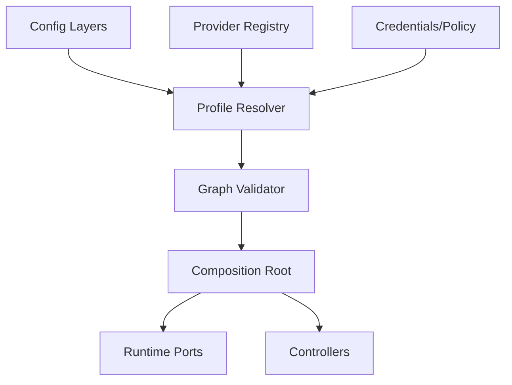
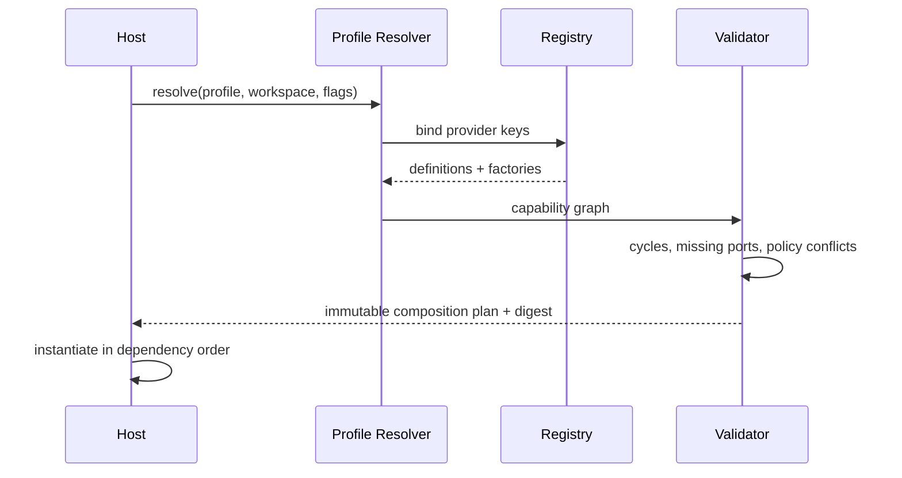

# Profile 与组合根设计

## 1. 位置



Profile 决定“本次 Host 装哪些能力及实现”，不决定 Agent 在某一步调用哪个工具。前者是组合，后者是 Runtime 决策与 Policy 裁决。

## 2. Profile 模型

```yaml
id: local-developer
extends: [base]
capabilities:
  shell: { provider: local-sandbox }
  filesystem: { provider: workspace-fs }
  memory: { provider: local-ledger-memory }
model:
  router: default
policies:
  tool: developer-safe
clients: [cli, web, desktop]
```

Manifest 只保存 provider key 和非秘密配置；凭据通过 credential ref 在启动/恢复时解析。最终装配结果生成 `profile_digest` 写入 RunStart，便于解释“当时运行了什么”。

## 3. 解析顺序

| 层 | 优先级 | 可覆盖范围 |
|---|---:|---|
| built-in defaults | 1 | 安全最小配置 |
| named profile | 2 | provider 与通用策略 |
| workspace config | 3 | 该仓库允许的能力与约束 |
| user config | 4 | 用户偏好，不可放宽 workspace 禁令 |
| invocation flags | 5 | 临时选择，只能在 policy 允许范围内 |

合并不是普通 deep merge。数组、provider、policy 分别使用显式策略；未知字段报错，禁止拼写错误静默失效。

## 4. 组合与校验



Provider factory 不得在校验前产生外部副作用。实例化失败按逆序 teardown，避免半初始化 Host。

## 5. 公开接缝

| 接缝 | 输入 | 输出 |
|---|---|---|
| `CapabilityDefinition` | key、required ports、config schema | 可校验元数据 |
| `ProviderFactory` | resolved config、dependency ports、lifecycle | provider instance |
| `CompositionPlan` | 不可变解析结果 | ordered nodes、digest、warnings |
| `ProfileValidator` | manifest + registry | typed errors，不返回半成品 |

## 6. 关键参数

| 参数 | 推荐 |
|---|---|
| `unknown_config` | error |
| `provider_collision` | 显式 override 才允许 |
| `profile_reload` | V2 仅新 Run 生效；运行中不热换核心 provider |
| `secret_materialization` | 尽可能晚，永不进入 digest/事件 |
| `teardown_timeout` | provider 可配置，Host 有总上限 |

## 7. 验收与待决策

同一 profile/config 必须产生稳定 digest；缺端口、依赖环、冲突 policy 在启动前失败；CLI/Web/Desktop 使用同一 resolver。待定：是否支持第三方动态加载、profile 签名和运行中非核心 capability 热插拔。
