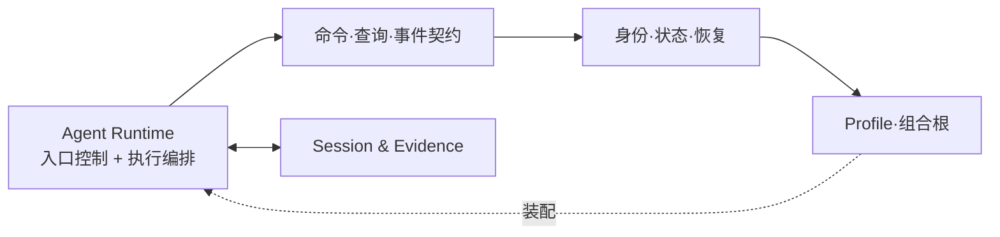
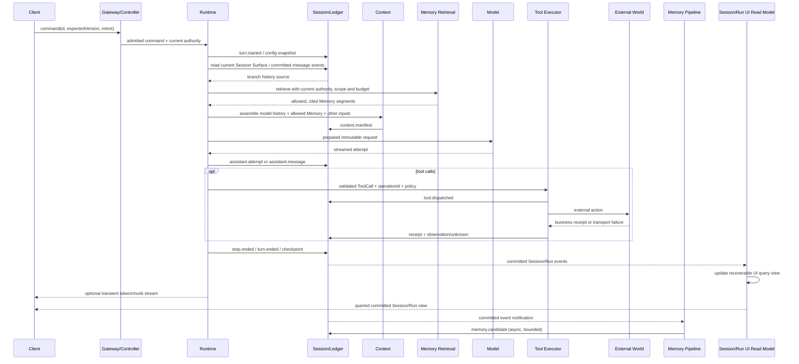

# 01 · 系统架构

## 子模块导航



| 子模块 | 评审焦点 |
|---|---|
| [Agent Runtime 与 Session/Evidence](01-agent-runtime-session-evidence.md) | Runtime 内部职责，以及它与 Session/Evidence、能力和 Memory 的协作 |
| [命令、查询与事件](02-command-query-event-model.md) | CLI/Web UI/Desktop 到 Agent Runtime 的内部协议；命令提交事实，Query 读取具名读模型 |
| [身份、状态与恢复](03-identity-state-recovery.md) | ID、状态机、checkpoint、重放与 reconcile |
| [Profile 与组合根](04-profiles-composition.md) | 能力如何装配、校验和按入口复用 |

## 1. 架构目标

V2 架构同时解决四个问题：

1. CLI、Web UI、Desktop 不能各自实现一套 Session/Run 语义；独立 API/SDK/ACP 不属于当前产品入口。
2. 当前 `packages/core/src/runtime.ts` 超过一万行，能力边界存在于概念和文档中，却未被物理依赖守住。
3. Memory 必须从已提交证据中受治理地产生，再按当前权限回到 Runtime 的 Context；它不是 Runtime 尾部的一个无条件检索 helper。
4. 仓库需要能持续增加能力，却不让 Agent Loop、Host 和 UI 互相反向依赖。

## 2. 逻辑职责与依赖次序

下表是逻辑职责和依赖次序，不是顶层产品系统的同级分层，也不代表进程边界。顶层总图把 L4 执行编排与 L6 入口控制/组合一起归为 **Agent Runtime**；Session/Evidence 是 Runtime 使用的持久事实与查询子系统。

| 层 | 名称 | 主要职责 | 不允许拥有 |
|---:|---|---|---|
| L0 | Foundation | branded ids、时间、hash、schema、基础 contracts | 业务状态、I/O 编排 |
| L1 | Session & Evidence | Event Ledger、Artifact、Receipt、Session format、Session/Run 页面读模型、Replay | UI 权威状态、模型策略 |
| L2 | Capability | FS/Shell/Terminal/Sandbox/LSP/MCP/Skill 等定义与 provider | Agent Loop 决策、客户端状态 |
| L3 | Model & Context | 模型路由、Prompt/Context 组装、token、compaction、provenance | 工具副作用 |
| L4 | Agent Runtime：执行与编排 | Agent、Turn、Step、Tool pipeline、cancel、retry、guard | HTTP/Electron/React、具体持久化实现 |
| L5 | Memory & Orchestration | Memory lifecycle、Experience、Workflow、Subagent、Team、Goal | 绕过 L1 直接写持久事实 |
| L6 | Agent Runtime：入口控制与组合 | profile、bundle、controller、gateway、settings、credential reference | 领域真源、Run 内部执行状态 |
| L7 | Surfaces | CLI、Web UI、Desktop | Session/Run 的权威副本 |

依赖并非简单 `L7 → L0` 的逐层链。关键是：

- L4 只依赖 L2 的定义，不依赖某个本地 provider；
- L5 通过 Event/Context/Agent 扩展点贡献能力，不给 Agent Loop 增加特例；
- L6 负责选择和装配实现，不把部署选择下沉到 L4；
- L7 只能通过版本化 Command/Query/Event 协议操作系统。

L4 与 L6 是 Agent Runtime 内部可分离的模块职责，不是两个必须独立部署的系统。L1 则回答“运行事实保存在哪里、如何重建和查询”，不负责决定 Agent 下一步做什么。

## 3. Agent Runtime 与支撑子系统

### 3.1 Agent Runtime：控制与执行是一体的

Agent Runtime 是从入口命令到 Run 执行的统一逻辑子系统，内部包括两类职责：

- **入口控制与组合**：校验命令及当前 authority，加载 Profile/Policy，绑定本次允许使用的 Model/Tool Provider，并把用户命令交给执行循环。
- **执行与编排**：推进 Agent Loop、Context、模型请求、工具调用、审批、取消、重试、Workflow 和 Subagent。

这两类职责可以分模块、分 package，但在顶层架构图里属于同一个 Agent Runtime；不应被画成 Runtime 之外的另一个同级控制系统。

### 3.2 Session & Evidence：保存发生过什么

Session & Evidence 为 Runtime 提供持久化与查询能力：Event Ledger 保存已提交运行事实，Artifact/Receipt/Observation 保存证据，Session/Run 页面查询读模型可由事实重建。Runtime 的模型消息历史从 Session 消息事件与 Surface 操作派生，由 Context Assembly 使用；Memory 状态/检索投影来自独立的 Memory 生命周期事件流。它们不是同一个 Projection，也不意味着必须单独部署。

“Truth”在本设计中描述的是这些事实的可信约束，不再作为与 Control、Runtime 并列的第三个系统平面。

### 3.3 能力提供方与 Memory：Runtime 的协作者

- **能力提供方**（Model、Tool、FS、Shell、MCP、Skills 等）通过稳定接口由 Runtime 调用；入口装配依据 Profile/Policy 绑定具体实现。
- **Memory/Experience**从已提交证据提取候选，经治理后再按当前权限、scope、时效和预算提供给 Context。它不是事实账本，也不继承旧会话的权限。
- UI 通过内部 Command/Query/Event 契约操作系统；不承诺独立的外部 API 产品面，也不持有 Session/Run 的权威状态。

## 4. 能力接缝的统一形态

每项可替换能力必须同时说明三个角色：

```text
Service Definition  ← Runtime/Consumer 只依赖这里
       ↑
Service Provider    ← local / remote / sandbox / vendor implementation
       ↑
Consumer            ← model tool、controller、workflow 或其他调用者
```

以文件系统为例：

| 角色 | 包 | 内容 |
|---|---|---|
| Definition | `packages/fs/fs` | `read/stat/list/write/applyPatch` 能力与错误语义 |
| Provider | `packages/fs/fs-local`、未来 `fs-sandbox` | 本机或隔离环境实现 |
| Consumer | `packages/fs/tool-fs` | 面向模型的 schema、输出裁剪和呈现 |

规则：

- Provider 不能依赖 Consumer。
- Definition 不包含 UI、Prompt 文案和某一 provider 配置。
- 注册必须返回 disposer，卸载后贡献消失。
- Consumer 的 policy 不能只靠 schema 隐藏；执行器仍需在副作用前强制。
- 一项能力只有一个当前 owner；多写入路径视为架构缺陷。

## 5. Profile 与组合

V2 不让每个 app 手写依赖树，而用显式 profile 组装同一组 package contributions。

```yaml
schema_version: 1
profile: desktop
surface: desktop
bundles:
  - outlive/runtime-base
  - outlive/session-evidence-local
  - outlive/memory-local
  - outlive/workspace-tools
  - outlive/surface-desktop
runtime:
  agent_loop: default
  session_persistence: jsonl
  memory_provider: local
providers:
  filesystem: local
  shell: sandboxed-local
  terminal: local
transports:
  control: framed-stdio
clients:
  - desktop-renderer
policy:
  ceiling: workspace-write
```

建议随发行版提供：

| Profile | 用途 | 主要差异 |
|---|---|---|
| `base` | 创建 CLI/Web/Desktop Profile 的内部模板，不单独运行 | 提供公共 Bundle 清单起点；具体能力由 `runtime-base` 等 Bundle 声明 |
| `cli` | 交互式/一次性命令 | 进程内 client，可启动 TUI |
| `web` | 本机浏览器工作台 | HTTP command/query + SSE/WebSocket events |
| `desktop` | 桌面产品 | 私有 stdio/pipe transport，不默认开 loopback 端口 |
| `headless` | 内部自动化测试 | 无 UI、确定性输入输出；不是面向用户的产品入口 |

上面的 Bundle ID 仅是说明“显式列出组合”的示例，不是最终命名裁决。独立 API、对外 SDK 和 ACP 暂不定义 Profile，也不进入当前产品范围。内部 SDK/client 代码若用于三种入口，只是实现细节。Profile 只声明组合，不保存用户数据。覆盖层必须有顺序和来源；Run header 应记录 `composition_digest` 和脱敏装配清单引用，保证以后能解释当时使用了什么。

## 6. 一次 Turn 的规范时序



### 6.1 提交与发布顺序

所有“已发生”通知必须在 durable commit 后发布。Live token/chunk 可以先到达 UI，但必须显式标记 transient；若进程在 settlement 前死亡，它不能被恢复读取器当成已完成消息。

### 6.2 Model-visible iff logged

任何进入模型请求的内容都必须能从 Session/Event + Artifact 重建：

- system instruction；
- user/steering message；
- recalled memory；
- repository instruction；
- tool schema；
- compaction replacement；
- image/attachment omission决定。

新增模型可见输入必须新增对应事件或带 hash 的 Context Manifest 项；“在调用前临时拼字符串”不允许。

## 7. Command、Query、Event 三分

| 面 | 语义 | 示例 | 规则 |
|---|---|---|---|
| Command | 请求改变状态 | `run/start`、`run/cancel`、`memory/revoke` | 带 command id；可幂等；返回接纳结果，不伪装最终事实 |
| Query | 读取已提交状态 | `session/read`、`memory/search`、`run/evidence` | 不产生业务副作用；分页与预算有界 |
| Event | 已发生的事实或瞬态提示 | `tool.receipt`、`run.ended`、`assistant.chunk` | durable/transient 明确分开 |

Web 路由、CLI 调用、Desktop bridge 和内部 client 都是这三种语义的 transport adapter，不能各自发明状态机；内部协议不等于承诺对外 SDK/API。

## 8. 身份与关联

所有异步工作必须能回到一个 root trace：

```text
traceId
└── sessionId
    ├── runId
    │   ├── turnId
    │   │   ├── stepId
    │   │   ├── modelAttemptId
    │   │   └── toolCallId → operationId → receiptId → observationId
    │   └── childRunId
    └── memoryId / experienceId → evidenceRefs[]
```

`operationId` 标识外部副作用，不能用 `toolCallId` 代替：同一个工具意图可能经历重试、对账或 provider 级幂等。

## 9. 恢复模型

启动恢复按以下顺序执行：

1. 验证并修复允许修复的 Session/Ledger 尾部；
2. 读取未终止 Run 和 Action WAL；
3. 对每个已派发但未确认的 operation 执行 reconciliation；
4. 写入 `confirmed / failed / unknown / diverged` Observation；
5. 将中断 Run 标记为可恢复或需人工处理；
6. 重新解析 workspace、policy、credential 和 profile；
7. 只有全部安全前提满足时才允许 resume。

恢复永远不自动复活一次性 approval token，也不因旧 Memory 说“用户允许”而获得当前权限。

## 10. 取消与静默证明

取消成功不等于 `AbortController.abort()` 被调用。对用户的可验证承诺是：

- 不再启动新的模型请求或工具调用；
- 活动 provider/tool 收到取消信号；
- 子进程组在 grace period 后被完整回收；
- 未知外部动作进入 reconciliation；
- 所有 owned background jobs 到达 settled/quiescent；
- `run.cancelled` 在上述状态可判定后提交。

应新增“取消后零新派发”和“超时后进程组消失”的快照/集成证据。

## 11. 当前代码到目标层的映射

| 当前 | 目标 owner | 迁移方式 |
|---|---|---|
| `packages/core/src/event-ledger.ts`、`projection.ts`、`replay.ts`、`artifact-store.ts`、`action-wal.ts` | Evidence family | 先移入 `core/domains/evidence`，稳定后升包 |
| `session-store.ts`、`session-controller.ts` | Session family | 与 event contracts 解耦后升包 |
| `memory.ts` + `packages/retrieval` | Memory family | 先统一 contract 与 lifecycle，再组合 retrieval provider |
| `context.ts`、`context-compaction.ts`、`token-meter.ts` | Context family | 拆 assembly、policy、provider |
| `tool-registry.ts`、`policy-engine.ts`、`approval-token-store.ts` | Tool family | Definition/Executor/Policy/Approval 分离 |
| `model-provider.ts` | LLM family | seam 与 concrete presets/providers 分离 |
| `mcp/`、`lsp/`、`sandbox/`、`skill.ts` | Capability families | 最适合优先提取的可替换接缝 |
| `runtime.ts` | `core/agent-loop` + feature drivers | 最后拆；只保留状态机和 orchestration |
| `packages/host`、`packages/sdk` | Host 与内部 client/protocol families | 在 Runtime 事实边界稳定后拆 controller/transport；不作为独立 API/SDK 产品发布 |

## 12. 架构级禁止项

- UI 直接读写 Ledger、Memory 文件或 Workspace。
- Runtime import React、Fastify、Electron 或 transport DTO。
- Capability Definition import local Provider。
- 模型输出未经 schema/policy 就成为 Tool execution。
- ToolResult 未经业务解释就自动等于 Observation success。
- Projection、Telemetry 或 Memory 索引成为第二真源。
- 为了恢复方便覆盖旧 Session generation。
- 用 sleep/超时掩盖所有权和状态同步问题。
- 为目录整齐而创建只有 re-export、无独立责任的包。
