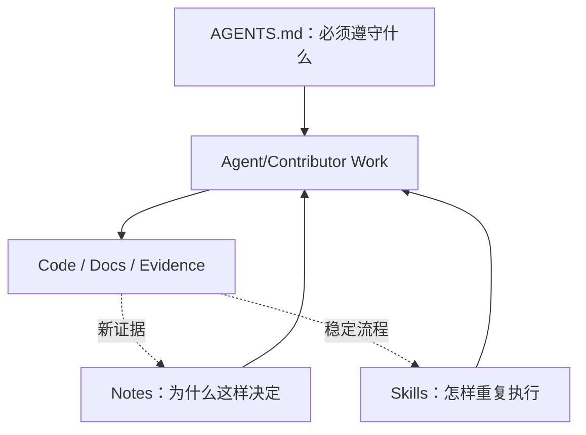
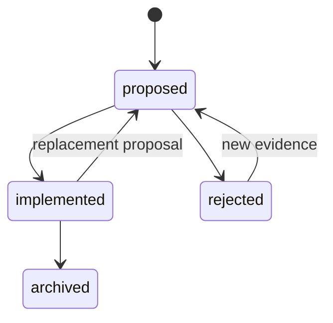
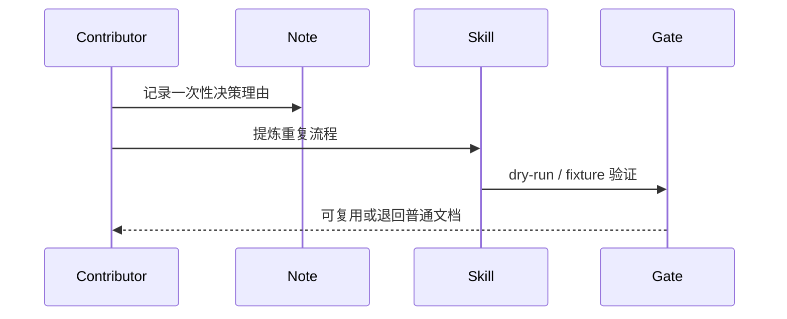

# AGENTS、Notes 与 Skills 治理

## 1. 三种资产的位置

三者不能互相复制全文。AGENTS 是约束，Note 是决策记忆，Skill 是可执行操作手册；代码与测试才是当前行为证据。

## 2. 所有权与层级

| 资产 | 放置 | 作用域 | 冲突规则 |
|---|---|---|---|
| 根 `AGENTS.md` | 仓库根 | 全仓 | 最上位工程规则 |
| 局部 `AGENTS.md` | package/app/目录 | 子树 | 可收紧，不得静默放宽根规则 |
| `.agents/notes/*` | 中央决策档案 | 跨模块/长期 | 一决定一主 Note，其他文档链接 |
| `.agents/skills/*` | 可复用流程 | 明确输入输出范围 | 不能隐含改变架构或安全策略 |

AGENTS 保持薄：阅读顺序、真源、硬边界、验证入口和禁令。超过约 150 行的解释应迁入 Note/模块文档并链接。

## 3. Note 生命周期

Note 必填：`id`、状态、日期、owner、问题、上下文、选项、决定、后果、反证条件、相关代码/测试。`implemented` 只表示决定已成为当前架构，必须链接验证证据；迁目录不改 ID。

## 4. Skill 准入

一个操作满足以下条件才成为 Skill：至少重复两次；步骤有稳定前后条件；能验证结果；错误执行的风险可描述；不是单纯包装一条命令。Skill 必须写明输入、权限、副作用、失败恢复、最窄验证和不得做的事。

## 5. 关键参数

| 参数 | 推荐 |
|---|---|
| `note_id` | 稳定、语义化或时间序号；文件重命名不改变 |
| `note_review` | 架构/协议/安全变更必须审查；普通实现记录可轻量审查 |
| `skill_side_effect` | 默认声明；破坏性步骤必须独立确认点 |
| `skill_test` | 至少有 dry-run、fixture 或可重复验收之一 |
| `archive_policy` | 不删除历史理由；敏感内容按数据策略脱敏/撤除 |

## 6. 验收与待定

验收：新 Agent 能从最近的 AGENTS 找到真源，从 Note 解释关键决定，从 Skill 安全重复发布/评审流程；三者间无大段复制。待定：Note ID 采用 ADR 编号还是领域前缀；Skill 是否发布为标准 Agent Skills 包。

