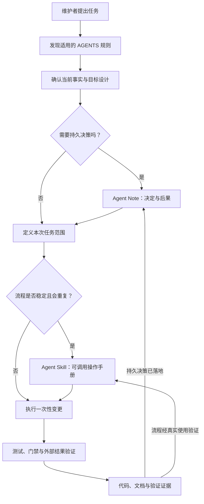
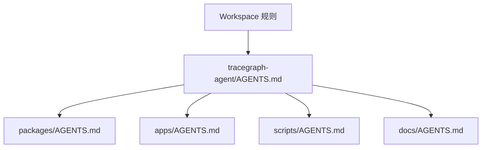
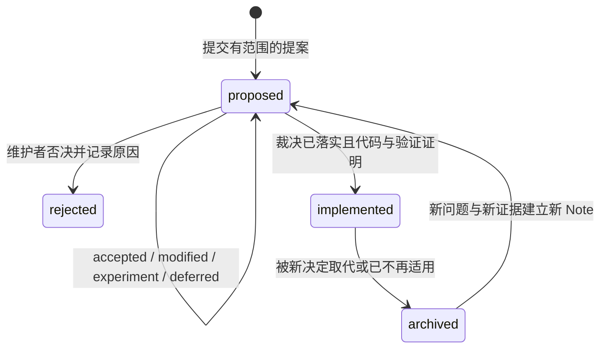
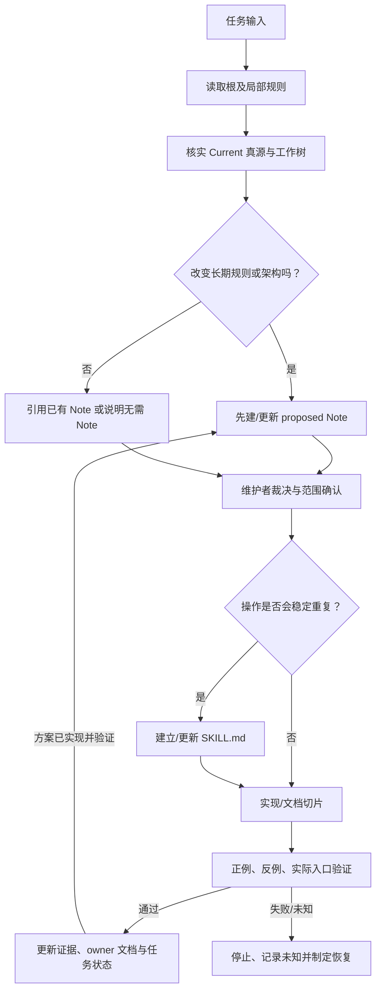

# AGENTS、Notes 与 Skills 治理

## 1. 在整体架构中的位置

本模块定义的是**仓库维护者和编码 Agent 如何安全协作**，不是 Outlive Agent 运行时加载的产品能力。它向每次代码、文档和测试变更提供规则、理由和可重复步骤；它不拥有产品 Session、Run、Memory 或其他运行时事实。

规则、决策、操作手册和验证证据是相互连接但不相互代替的资产。任何一条硬约束都应只有一个规范来源，其他文件用链接引用。

## 2. 三种治理资产及其所有权

| 资产 | 回答的问题 | 规范内容 | 不应承担 | 主要消费者 |
|---|---|---|---|---|
| `AGENTS.md` | 工作时必须遵守什么？ | 范围、规则优先级、真源、硬不变量、验证入口 | 设计历史、长教程、每个变更的检查清单 | 人类贡献者、编码 Agent、仓库自动化 |
| Agent Note | 为什么选择这个长期方向，放弃了什么？ | 问题、Current/Target/Deferred、选项、裁决、后果、证据、复审条件 | 当前运行逻辑、命令的完整执行步骤 | 维护者、架构评审者、后续迁移任务 |
| Agent Skill | 如何重复完成一个有明确边界的工作？ | 触发条件、输入、权限、副作用、步骤、失败恢复、验证和输出 | 新增架构权威、代替测试、自动授权外部写操作 | 用户明确调用它的 Agent / 维护者 |
| 源码与测试 | 当前可执行行为到底是什么？ | 实际代码路径、断言和验证结果 | 隐含未写出的政策或产品决策 | Runtime、CI、开发者 |

一个变更可以同时更新四者，但四者分别回答不同问题。例如：Note 说明为什么禁止盲目重试；Skill 说明如何验证这个规则；AGENTS 指向规则并要求验证；测试证明违规重试会失败。

## 3. AGENTS 规则发现与冲突处理

### 3.1 作用域树

规则在最近的适用目录被发现。父规则仍然适用；子目录可以补充更具体的要求或收紧父规则，不能静默放宽父规则。Workspace 级指令负责工作区通用流程，仓库根 `AGENTS.md` 负责仓库工程事实，局部规则负责本子树特有风险。Agent Note 记录理由，不覆盖任何适用的硬约束。

发生矛盾时按以下顺序处理：

1. 先区分**工作请求**、**仓库约束**、**设计提案**与**当前代码事实**，不要把一个类型误读成另一个类型。
2. Workspace 级用户/系统指令约束本次协作；仓库根规则约束仓库内操作；更近的目录规则可增加要求。
3. 当前源码、测试和运行验证决定“现在做了什么”；`proposed` 文档只能表达目标，不能推翻当前行为证据。
4. 已实现 Note 解释仍有效的长期决定；若实现、测试和 Note 冲突，停止扩大变更，先确认哪项事实过期并修复真源。
5. 无法按以上规则消解的冲突进入人工评审，不靠“最近编辑的文件”或模型推断选边。

### 3.2 根规则与局部规则的内容边界

根 `AGENTS.md` 只放每次工作都需要的短规则：阅读入口、当前/目标分离、禁止边界、常用验证命令及局部规则索引。模块职责、状态转换、失败恢复等详细解释放到 owning docs，再由 `AGENTS.md` 链接。

局部 `AGENTS.md` 只写该目录独有且每次编辑都需要遵守的约束，不复述根规则。适合进入局部规则的主题包括：package 公共导出、生成脚本的临时文件和进程所有权、Snapshot 脱敏与刷新、Benchmark 环境与输入隔离、Desktop IPC 安全。

每条可执行规则都应具备以下字段；若无法机械检查，必须写明人工检查人和检查时机：

| 字段 | 必答问题 | 例子 |
|---|---|---|
| `scope` | 哪些文件、命令或变更触发？ | 修改 `packages/*/src` 的跨包引用 |
| `requirement` | 必须做或禁止做什么？ | 只能依赖公共 exports |
| `owner` | 谁维护规则和豁免？ | Architecture owner |
| `source` | 规则真源在哪里？ | AGENTS / Agent Note / 模块契约 |
| `verification` | 怎么证明符合？ | 依赖图门禁及反向依赖 fixture |
| `failure_action` | 检查失败后停在哪里？ | 阻断合并并给出违反路径 |
| `exception` | 能否临时豁免，谁批准，何时到期？ | 仅通过带 owner 与 expiry 的 Note |

## 4. Agent Notes：决定的理由与生命周期

### 4.1 两种不同状态，不要混为一谈

Note 的 frontmatter `status` 表示**决策记录/方案是否已成为当前实现**；评审结果表示维护者是否接受该设计。两者不是同一个状态。例如：一个设计方向可以已接受，但功能尚未实现，因此它仍放在 `proposed/` 且 `status: proposed`。这正是 V2 评审登记表中“已接受的设计 ≠ 已交付能力”的含义。

| 维度 | 可能值 | 说明 |
|---|---|---|
| 评审结果 | undecided / accepted / modified / experiment / deferred / rejected | 本轮对提案作出的处置；需在 Note 正文留理由和范围 |
| Note 生命周期 | proposed / implemented / rejected / archived | 文件当前属于提案、已验证实现、已否决历史还是过期历史 |
| 代码实现状态 | not started / in progress / verified | 由路线任务、源码、测试与验证记录共同证明，不由 Note 自行宣布 |

上表是阅读与编写 V2 决策记录时的语义区分；它**不表示当前已有三套机器可读状态字段**。若以后要把评审结果加入 frontmatter，须由独立 Note 定义字段、迁移规则和 checker，不可直接批量改写现有状态。

### 4.2 生命周期与移动条件

`accepted` 不代表 `implemented`。`deferred` 也不代表默认批准：必须写明重新评审的触发条件或路线阶段。被否决的原因与选项保留在 `rejected/`；旧实现被新决策取代后归档，历史 Note 不继续作为当前指令。

文件移动不是状态迁移的全部。进入 `implemented/` 前要更新决定、后果、适用范围和日期，并附实现 commit/路径、测试命令与结果、兼容/迁移证据；新决定取代旧决定时使用 `supersedes`/`superseded_by` 关联，保留旧 ID 与可追踪历史。中英文配对文件必须同步移动并保持同一决策 ID。

### 4.3 Note 内容契约

每份 Note 至少回答：

1. 问题是什么、为什么现在必须决定；
2. Current 现状由哪些源码/测试证明；Target 提案将改变什么；Deferred 明确不做什么；
3. 真实考虑过哪些可行选项，分别带来什么代价；
4. 裁决是什么，适用范围和不变量是什么；
5. 如何证伪决定，哪些失败或新证据会触发重开；
6. 实施任务、验证、回滚和关联 owner 文档在哪里。

至少需要以下元数据，具体字段由模板维护：稳定 `id`、标题、状态、owner、创建/复审日期、影响模块、来源/替代 Note。日期可作文件名前缀，但文件路径不是稳定 ID；重命名不得切断链接。

### 4.4 何时必须写 Note

必须记录会跨 PR/版本持续有效的决定，尤其是协议、事件和持久格式；状态/数据写入 owner；包边界与依赖方向；Memory 的准入、召回、保留、导出或删除；权限、审批、credential、sandbox；新增进程、产品入口或 Profile；质量基线和接受的长期限制。拼写、局部 bug 修复和不改变行为的机械整理通常不需要独立 Note。

如果是一次性实现任务且已有接受的 Note，不要再写一个重复架构 Note；在任务记录里引用现有决定并记录具体的实现选择与验证结果。

## 5. Agent Skills：可复用、可调用的维护流程

### 5.1 与产品运行时 Skills 的区别

`.agents/skills/` 下的 Skill 是**开发这个仓库时**使用的维护操作手册，例如推送前检查、代码评审、文档同步和 Note 归档。产品 Runtime 可检索/执行的用户或 workspace Skill 属于能力层，位置、权限和执行协议由 Runtime 文档定义；两者不能共用“已安装”或“可调用”的状态描述。

### 5.2 Skill 调用契约

每个 `SKILL.md` 必须明确：

| 项 | 要写清的内容 |
|---|---|
| `trigger` | 什么用户请求或任务条件才调用；何时不调用 |
| `inputs` | 必需路径、参数、环境和读取范围；缺值如何处理 |
| `permissions` | 允许读/写/联网/运行进程的范围；哪些外部副作用必须再次获得用户明确授权 |
| `procedure` | 有序、可重入的步骤；每步的输入和预期输出 |
| `failure` | 命令非零、缺依赖、超时、部分写入时如何停止和恢复 |
| `verification` | 最窄验证命令、独立成功判据与反例 |
| `output` | 要交付的文件/报告、未验证项和是否产生改动 |
| `prohibitions` | 不可自行推断的权限、不可覆盖的数据、不能声称完成的条件 |

Skill 默认是只读说明；它本身不授权 `git push`、发布、删除数据或向第三方发送内容。若流程含有破坏性或外部副作用，必须在到达该步骤前停止并确认目标和授权。失败要 fail-closed，不能把跳过、mock 成功或空结果报告为通过。

### 5.3 创建、维护与双语配对

只有流程至少真实重复两次、前置与结束条件稳定、验证结果可观察、存在唯一脚本/文档真源时，才把普通流程提升成 Skill。一次性指令写入任务本身；不稳定探索保留为实验记录；单纯重复命令的薄包装也不值得独立成 Skill。

目前仓库已有中英文入口的维护 Skills，但 V2 的“两次真实使用”是**成熟度门槛**，不能因为 `SKILL.md` 文件存在就宣称流程已被充分验证。中文与英文文件表示同一个 workflow；一次任务只选用一种语言执行，语义变化时配对审查。若源文件 digest、配对清单或自动 stale gate 尚未实现，必须称为人工同步，不能声称机器已保证翻译一致。

## 6. 从变更到治理记录的决策流程

推荐顺序是“先确定决策，再设计可复用流程，再执行”。如果任务已经有明确被接受的决策，Note 不重复裁决；直接引用它并按路线任务实现。决策未定、授权不清或唯一写入 owner 未确定时停止，不通过快速实现来替用户拍板。

## 7. 常见失效方式与验收

| 失效方式 | 为什么危险 | 需要的防线 |
|---|---|---|
| 根规则复制整篇模块说明 | 多份文本会漂移，Agent 无法知道哪份优先 | 根 AGENTS 薄指针，模块规则链接 owning doc |
| Note 的 accepted 被误读成 shipped | 用户会被告知不存在的实现已经交付 | 分开记录裁决、Note 生命周期和路线/测试状态 |
| Skill 名称存在却没有 `SKILL.md` | 任务无法按稳定步骤执行 | 目录清单仅列实际可发现的入口；计划候选单独标注 |
| Skill 未经真实使用就被当成成熟标准 | 错误流程被自动重复 | 记录真实使用、失败和修订；成熟度门槛不等于文件存在 |
| 已归档 Note 继续被当作当前规则 | 过期方案会绕过新决定 | 归档页标明替代者并保留链接；AGENTS 只指向当前真源 |
| Skill 静默运行 push、发布、删除或上传 | 操作超出用户授权且难以恢复 | 声明 side effect；副作用前单独确认；保存可检查 receipt |

**完成标准**：新贡献者能从适用 `AGENTS.md` 找到规则真源；对一项设计决定能找到唯一 Note 并区分接受与实现；对重复流程能通过明确触发条件发现 `SKILL.md`，并依照其中权限、失败语义和验证结果安全完成；所有规则都不会将 `proposed` 或 `deferred` 写成当前能力。

实现前仍需结合[决策登记表](../README.md#6-决策登记表现在要评审什么)评审 Notes 的机器可读决策状态、Skill 成熟度证据以及是否需要增加目录级 `AGENTS.md`；在裁决前，上述机制是 V2 设计提案，不是现有自动化能力。
