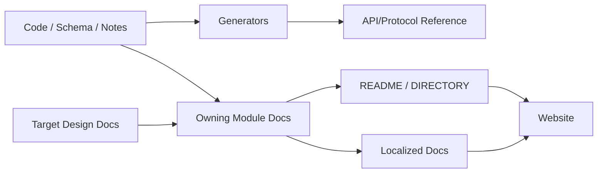
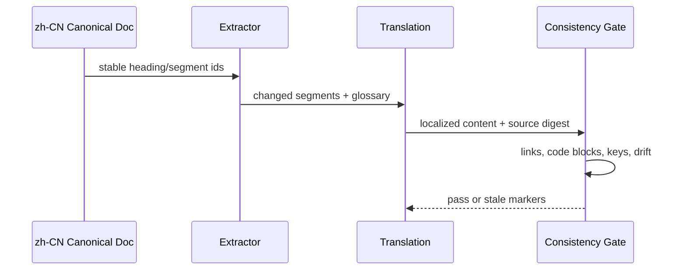

# 文档、生成物与国际化治理

## 1. 文档真源图

目标设计、当前模块说明、自动生成参考和用户教程是四种不同文档。Website 是发布面，不是新真源。

## 2. 文档类型与 owner

| 类型 | 真源 | 更新触发 | 验证 |
|---|---|---|---|
| 目标架构 | `docs/outlive-agent-v2/` | 决策状态、边界或路线变化 | 链接、manifest、评审 |
| 当前模块 | `docs/modules/` | 公开行为、事件、测试、边界变化 | implementation consistency eval |
| API/Schema | 源码 schema/comments | 生成器或 schema 变化 | clean-tree regeneration |
| 用户教程 | `docs/guides`（目标） | 用户路径变化 | 可执行 snippets/E2E |
| 决策理由 | `.agents/notes` | 决策产生或被替代 | 状态和证据链接 |

## 3. 生成规则

生成器必须确定性输出、在文件头标明 source 和 generator version、支持 `--check`、不把时间戳写入内容。生成物禁止手改；如需人工说明，在旁置 companion doc 或修改源 schema。

目录索引由 manifest 生成或检查：孤儿文档、重复 ID、丢失 parent、断链和未列出的模块在 CI 失败。

## 4. 国际化流程

技术 key、事件名、CLI flag、配置字段不翻译；中文文档解释含义。翻译文件记录 source digest，源文档变更后先标 `stale`，不得静默显示为最新。

## 5. 关键参数

| 参数 | 推荐 |
|---|---|
| `canonical_language` | 架构/设计先 `zh-CN`；公开用户文档按发布策略确定 |
| `generated_check` | CI clean diff |
| `broken_link_policy` | 内部链接 hard fail；外部链接定期检查并允许明确豁免 |
| `translation_freshness` | source digest + review date |
| `code_block_policy` | 不翻译标识符；可翻译注释但必须可运行 |

## 6. 目录与迁移

本次三级文档结构是 `总入口 → 模块 README → 子模块`。迁移旧路径时必须同步 manifest、全仓链接和 docs eval；可在发布前保留短期 redirect 文件，但仓库内链接应直接指向新路径。

## 7. 验收标准

clean checkout 生成后无 diff；内部链接、ID、parent 和 manifest 全部有效；任何子模块都能从总入口在两次下钻内到达；源文档改变会把未同步翻译标为 stale；Website 不含仓库中不存在的独立事实。

## 8. 待评审

- 是否以中文还是英文作为公开 API 指南的 canonical；
- Website 使用静态生成器还是仅发布 Markdown；
- 何时引入 segment-level translation tooling，而不是文件级人工同步。
