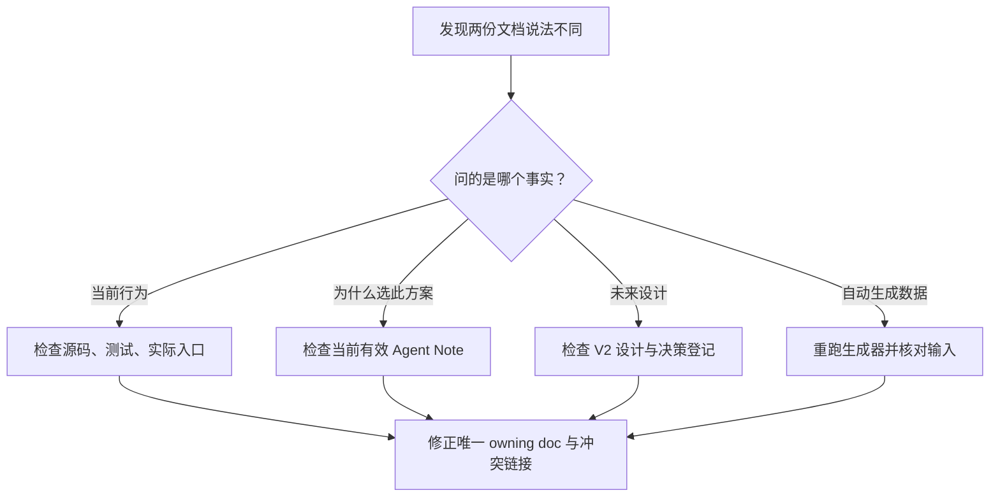
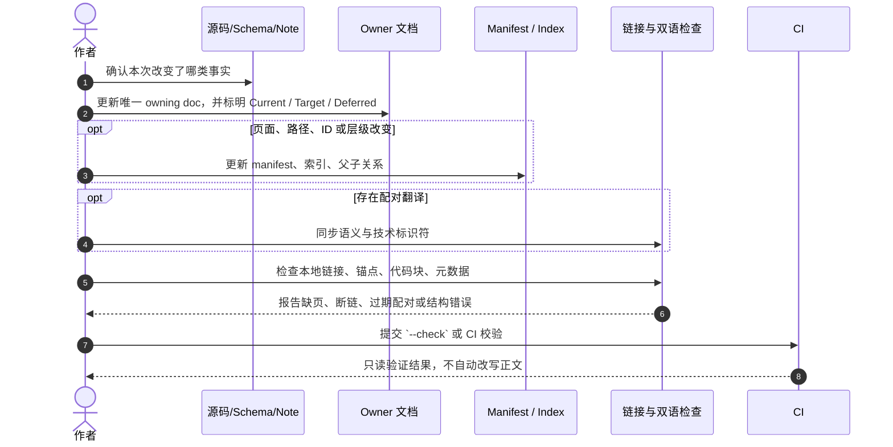

# 文档、生成物与国际化治理

## 1. 在整体架构中的位置

本模块规定仓库中的事实如何进入相应文档、索引、生成参考和翻译版本。它不定义产品运行时行为，也不授权任何文档站生成第二份权威正文。

```mermaid
flowchart TB
  SRC[源码、测试、Schema、配置] -->|证明当前行为| CUR[Current 模块说明]
  DEC[已裁决 Agent Note] -->|解释为什么| CUR
  DESIGN[V2 Target / Deferred 设计] -->|说明目标与边界| IDX[文档清单与目录]
  SRC -->|确定性提取| GEN[生成器]
  GEN --> REF[生成参考 / 图表 / Catalog]
  CUR --> IDX
  REF --> IDX
  IDX --> PAIR[双语配对与新鲜度检查]
  CUR --> PAIR
  PAIR --> SITE[Website：仅发布投影]
```



实线表示内容依赖；Website 只消费已审核文档及生成物，不向上游反向创造产品事实。当前是否有对应生成器或自动门禁，须查看 `package.json`、`scripts/` 和 CI；图中的完整流水线是 **Target**。

## 2. 文档真源和事实优先级

### 2.1 文档类别

| 文档类型 | 主要位置 | 规范回答的问题 | 更新触发 | 不能作为 |
|---|---|---|---|---|
| 当前行为参考 | 根 README、`docs/modules/`、package README | 今天实际支持什么、边界是什么、如何验证？ | 源码行为、接口、事件、用户路径或测试契约改变 | 未实现 V2 功能的承诺 |
| V2 目标设计 | `docs/outlive-agent-v2/` | 目标职责、接口选择、关键流程和未决决策是什么？ | 决策被接受、修改、延后或取代 | 当前能力清单 |
| Agent Note | `.agents/notes/` | 为什么作出该长期选择、放弃什么、何时重开？ | 产生新决策、实现状态变化、被新决定取代 | 代码或协议本身 |
| 生成参考 | `docs/generated/` 或有明确 Generated 标记的区域 | 从哪个源码版本自动提取出什么目录/Schema？ | 输入源码或生成器改变 | 手工补写的说明真源 |
| 用户教程 | 未来 `docs/guides/` 或用户文档目录 | 用户如何完成一条可复现的产品路径？ | 用户流程或支持的平台改变 | 架构决策档案 |
| 复盘 | `docs/postmortems/`（目标目录） | 事故实际如何发生、如何检测和补救？ | 真实事故结束且证据可复核 | 常态化教程或新的运行规范 |

### 2.2 同一事实冲突时怎么选



当前实现事实以可执行源码、测试和可复现入口为准；说明它们的 `docs/modules/` 是当前参考的归属文档。长期裁决理由以当前有效 Note 为准；V2 提案只说明未来方向。若测试、源码与 current 文档冲突，先确认真实行为，再更新模块文档；不得为了让文档“自洽”而更改代码或把目标状态写成已实现。

## 3. 文档所有权与详细度

每项公开事实有一个 owning doc。父级只解释位置、职责和阅读路径；字段定义、错误语义、迁移细节和可执行流程归给实际 owner。

| 主题 | 唯一详细归属 | 其他文件应做什么 | 需要核对的证据 |
|---|---|---|---|
| 产品定位与范围 | `00-product-charter/` | 链接到产品宪章，不复制愿景 | 被接受的决策 Note |
| Runtime / Session / Evidence 契约 | `01-system-architecture/` 与对应 `docs/modules/` | 设计文档说明 Target；current 文档说明 shipped | owning source、事件 fixture、测试 |
| Package API 与依赖方向 | package README、`03-package-topology/` | 引用公开 exports 和升包门槛 | package exports、import graph、contract tests |
| V2 实施顺序 | `roadmap.yaml` 和路线模块 | 文档说明阶段目标，不复制任务 DAG | task id、`depends_on`、验收项 |
| 生成物 | 生成脚本与生成区域标记 | 手写文档解释来源，不直接编辑生成结果 | 命令、输入 digest、`--check` |
| 双语版本 | 每个文件族明确一个源语言与配对关系 | 翻译文件标出源文件/版本并检查漂移 | pairing manifest / source digest（尚未实现时人工复核） |

如果同一段规则要出现在根 `AGENTS.md`、模块 README、Note 和 Skill 中，只保留详细版于最合适的一个位置；其他位置说明“何时适用”并链接。不要将同一片段复制后分别编辑。

## 4. 文档变更流程



| 步骤 | 必须留下什么 | 失败时如何停 |
|---|---|---|
| 1. 归类事实 | Current behavior / Target design / decision rationale / generated output / tutorial | 不确定属于哪类时先找 owner，不创建第二份概述文档 |
| 2. 检查源文件 | 源码、测试、Schema、Note 或路线任务链接 | 没有实现证据的能力保持 proposed/deferred |
| 3. 更新 owner 文档 | 文档状态、输入/输出、边界及必要的验证说明 | 只改索引而没有更新 owning doc 视为未完成 |
| 4. 更新关系 | manifest、parent、TOC、local links；仅在结构变化时 | 断链、孤儿页、重复 ID 必须修复或明确豁免 |
| 5. 检查配对 | 相同含义，术语与代码标识符保留，版本可追溯 | 来源摘要不一致时标记 stale，不伪装同步 |
| 6. 验证 | 对文档改动运行链接、YAML、生成新鲜度和适用的文档门禁 | validator 未执行或跳过要报告为未验证 |

纯拼写改动不要求变更 manifest；新增、删除、移动、改名或改变 parent 的文档必须同步清单与全仓引用。生成物更新必须说明源输入变化；不能在 CI `--check` 模式下静默写文件。

## 5. Manifest、索引和确定性生成

### 5.1 文档 Manifest 应描述什么

目标 Manifest 中每篇文档至少有稳定 `id`、路径、标题、生命周期状态、语言、父节点/配对源、owner 和 scope。引用文件必须存在；`id` 唯一；父子关系无环；配对文件必须属于同一语义文档；废弃路径应显式标注迁移目标。

Manifest 不应存储正文副本、架构事实、实施进度的自由文本或另一份任务列表。路线依赖只在 `roadmap.yaml` 管理，Note 状态只以 Note 目录/元数据为准，代码版本也不从 docs Manifest 推断。

### 5.2 生成器输入与输出

| 属性 | 设计约束 |
|---|---|
| 输入 | 指定源路径、Schema/AST 或受版本控制的数据；不得依赖未声明的用户目录或实时网络 |
| 输出 | 固定路径、稳定排序、固定换行和编码；清楚标注生成器版本/源版本 |
| `--write` | 只写目标生成物；先报告将影响的路径；错误退出时不留下半写文件 |
| `--check` | 生成到内存或临时目录并比较；不修改工作树；diff 可定位过期内容 |
| 错误处理 | 缺输入、重复 ID、未知状态、路径越界、引用环等情况非零退出并报告条目 |
| 回滚 | 生成物通过 Git 恢复；不可用当前生成结果覆盖其源文件 |

候选生成内容包括 package/module graph、event/tool catalog、Profile resolved composition、Protocol Schema 和 source-to-doc ownership map。只有稳定的源输入和确定性规则都存在后才实现各生成器；图表目前在手工文档中出现，并不证明这些图已由脚本生成。

## 6. 中英文文档与术语治理

### 6.1 按文档族指定源语言

中英文不是两份独立设计。每一类文档明确 source locale 和 paired locale；若当前只有单语版本，应写清楚而不是复制一份空壳。

当前仓库的 `.agents/notes/README.md` 明确英语为 Note 冲突处理的 canonical，中文文件是配对版本；Outlive V2 技术设计文档当前以 `zh-CN` 编写。它们是不同文档族，不能由这两个例子推导“全仓统一英语”或“全仓统一中文”。公开 API 教程的 canonical language 仍待相应阶段裁决。

### 6.2 翻译状态与同步步骤

```text
source draft → source reviewed → translation drafted → bilingual review → current
      │               │                   │                  │
      └ source change ┴───────────────────┴──→ stale → retranslate / re-review
```

1. 先稳定源文档的结构、代码标识符和术语；先定源再翻译，避免双边同时演进。
2. 修改正文后列出受影响章节、术语、路径和示例；翻译必须保留代码、配置字段、事件名、CLI flags 与 wire values。
3. 对每种语言做语义核对：限制、否定条件、错误状态、默认值、警告和链接都不得弱化或增加。
4. 标记配对版本及复核时间。source digest 与 pair manifest 未落地前，维护者需要人工比较，并明确写“人工检查”。
5. 代码示例需在源语言与译文上下文中都可定位到可执行验证；仅检查 Markdown 结构不证明命令有效。

机器翻译结果只能作为草稿，不能自动提升为 reviewed/current。发现无法等价翻译的规范词时，保留原始技术名并添加简短释义，之后维护到术语表。

## 7. Website 是发布适配器，不是真源

已接受方向是 Website 延后到 V2 P1–P7 实现阶段结束后，再进入 P8 建设；Website 只投影 `docs/` 中的规范内容。站点框架与部署方案尚未决定。

启动 Website 需要同时满足：文档规模与搜索/版本导航需求超过 README 能承载的范围；有可发布版本与安装路径；内部链接、文档 Manifest、生成检查和双语配对已有确定门禁；站点可从同一个 docs 输入构建且无手工正文副本。

如果源码文档不可用、链接失效或某个版本不存在，构建应失败并指出来源；不能通过站点独立补写缺失内容继续发布。Website 的构建成功只证明页面可发布，不证明产品功能已交付。

## 8. 检查范围和负例

| 校验项 | 成功判据 | 必须失败的反例 |
|---|---|---|
| 路径与链接 | 本地目标存在、锚点可解析、重命名引用同步 | 删除被链接文件或标题后检查仍返回成功 |
| Manifest | ID 唯一、parent 存在且无环、路径存在 | 重复 ID、缺 parent、孤儿文档、parent 环 |
| YAML/Frontmatter | 可解析且字段状态在 schema 中 | 未知 status、重复 key、非法语言值 |
| 生成物 | `--check` 与源的确定性输出相同且工作树不变 | 篡改生成文件后检查仍通过，或检查时偷偷写文件 |
| 双语配对 | 源文件、配对关系和状态一致 | 修改源文件后旧译文仍显示 current |
| 代码示例 | 按声称的命令/项目版本真实可运行 | 过期命令、错误路径或 target-only 命令被标成现有命令 |

文档门禁只验证它声明能判定的属性；它不能替代架构 review，也不能证明描述与 Runtime 行为一致。所有外链检查应与本地链接分开报告；网络不可用时标为 not checked，不将其当作本地失败或通过。

## 9. 关键参数

| 参数 | 设计含义 | 建议起点 / 裁决方式 |
|---|---|---|
| `doc_source_language` | 每个文档族的真源语言 | 按文档族显式声明；同一族内不混排两种源语言 |
| `translation_state` | 译文相对源文件的时效状态 | 用 `current` / `stale` / `missing` 显式表达；源文件变更即把旧译文标为 stale |
| `manifest_id_format` | 文档 Manifest 的 ID 命名约束 | ID 全局唯一、parent 存在且无环；路径必须存在于仓库 |
| `generator_check_mode` | 生成器是否只读校验 | `--check` 必须确定性且不改工作树；篡改生成物应导致检查失败 |
| `link_check_scope` | 链接检查覆盖范围 | 本地与外链分开报告；网络不可用时外链标为 not checked，不当作本地失败或通过 |
| `website_entry_phase` | Website 何时开始建设 | V2 P1–P7 结束后进入 P8；只投影 `docs/`，不产生第二份正文 |

## 10. 验收、责任与待决事项

**目标验收**：从总入口两次下钻能找到任何模块 owner 文档；新增/移动/改名会被 Manifest 检查发现；生成检查只读；源变更能标记翻译 stale；Website 没有第二份正文；所有当前实现说法能回到代码、测试或运行命令。

具体阶段与机器门禁以 [`DOC-002`](../roadmap.yaml) 及路线 DAG 为准。当前 `scripts/verify-v2-docs.mjs` 和完整双语 pair/digest 门禁仍是 **Target**，不得因本设计页写出校验矩阵就宣称已实现。

本模块中需由维护者按阶段裁决的语言、站点构建与翻译自动化问题统一记录在[决策登记表](../README.md#6-决策登记表现在要评审什么)；本页只拥有文档流程与生成物契约的细节，不另建并行评审清单。
