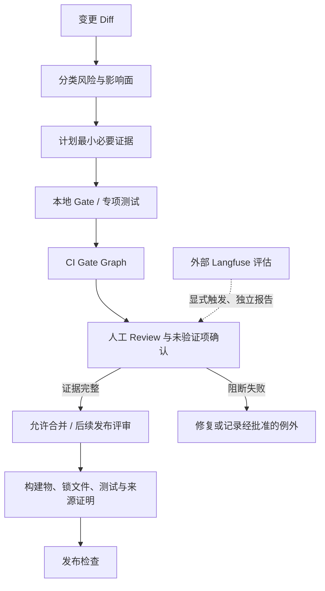
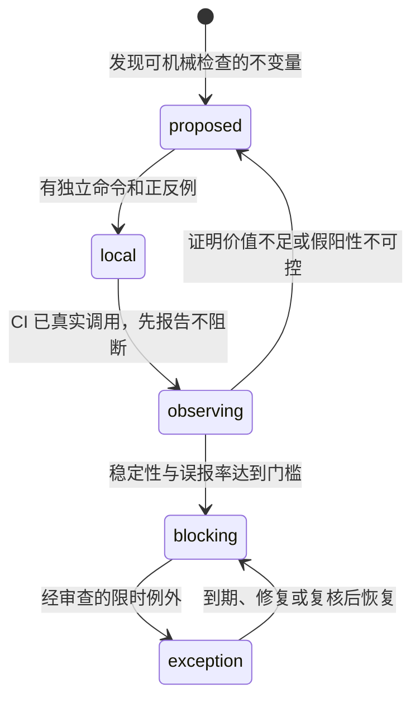

# 变更门禁与发布治理

## 1. 在工程系统中的位置

门禁把“本次变更声称改变了什么”映射到“哪些证据必须通过”。它不决定产品需求，不替代 Reviewer 判断，也不将一个 CI 绿色状态扩大解释成未测量的用户价值。

本地测试和 CI 主要负责确定性工程/安全不变量；Langfuse 是可选的外部模型与产品质量评估来源，不是本地确定性门禁。跳过、未运行、环境受限或数据不足都必须显示为 **not verified**，不能折算成 pass。

## 2. 当前 CI 与 V2 目标边界

| 项目 | 当前已核实状态 | V2 目标 |
|---|---|---|
| CI 工作流 | [`.github/workflows/ci.yml`](../../../.github/workflows/ci.yml) 有 `typecheck`、`test`、`evals` 三个 job | 按所有权拆分 deterministic engineering gates；Langfuse 不要求在普通 PR 在线执行 |
| `typecheck` job | lockfile check、冻结安装、根 typecheck、release shape check | 接入实现后的文档/边界门禁；每条门禁有负例 |
| `test` job | supply-chain check、unit/engineering test、CLI E2E、coverage 和 bounded artifact 上传 | 增量接入由任务 DAG 和风险分类指定的验证 |
| `evals` job | 当前运行仓库内的离线 Eval；不能据此推断 V2 会保留该产品质量评测架构 | 产品/模型/Memory 质量评估交由外部 Langfuse；本地保留确定性断言 |
| 文档/依赖/不变量门禁 | 根 package scripts 当前没有 `verify-v2-docs`、`verify-boundaries` 或 `verify-invariants` | 分别经 `DOC-002`、`ARCH-010`、`ARCH-012` 落地后才可称为已实现 |
| 分支保护 | 工作树中能查到 workflow 配置，但不能证明 GitHub branch protection 的在线 required check 设置 | 在线设置必须另外查验，不能从 YAML 推断 |

CI 的 job 名称、根命令和输入可能变更；说明中的“当前”要以源文件为准。V2 文档中写出的未来 gate 名称、Snapshot/Benchmark harness、package version 方案都不是现行 CI 能力。

## 3. Gate 的责任与执行契约

一个 gate 不只是一个 shell 命令。要成为可阻断检查，必须声明完整输入和失败语义：

| 字段 | 含义 | 验收问题 |
|---|---|---|
| `gate_id` / owner | 稳定标识与维护责任 | 规则变化时谁同步 checker 与反例？ |
| `trigger` | 哪些路径、schema、标签或任务会触发 | 改变触发路径时是否有 gate connectivity test？ |
| `inputs` | 固定文件、runner、fixture、环境变量与 secrets policy | 是否存在未声明的网络、用户目录或实时数据依赖？ |
| `command` | 可在本地/CI 重复执行的入口与参数 | 是否和当前 `package.json` 真实脚本一致？ |
| `timeout` / cancellation | 上限、子进程和 cleanup owner | 超时后 child process/port/tempdir 是否收敛？ |
| `outputs` | stdout/stderr、报告、Artifact 与退出码 | 是否能定位违反规则的文件、task 或 fixture？ |
| `failure_policy` | 阻断、观察、重跑、豁免的行为 | skipped、aborted、error 会不会被报告为 pass？ |
| `negative_fixture` | 最小非法输入 | 删除 CI 调用或构造违规输入时是否可靠失败？ |
| `baseline_version` | benchmark/snapshot/schema 使用的基准版本 | 谁批准更新，能否审查语义 diff？ |

状态至少区分 `passed`、`failed`、`skipped`、`not_run`、`aborted` 和 `unknown`。仅当命令真实执行、输入有效、退出码/断言符合契约且报告成功时才记为 pass。对目标 Gate 而言，没安装、未接线或 mock 掉真实入口不是 pass。

## 4. 按变更风险选择证据

| 变更类别 | 最低要证明什么 | 负例 / 独立 oracle | 不可只凭什么通过 |
|---|---|---|---|
| 文档纯文本/链接 | metadata 与本地引用有效，提案状态没有冒充 Current | 删目标页/改标题后链接门禁失败；检查器自身有坏 fixture | 编辑器预览或“我看过了” |
| 内部重构 | 公共行为、事件顺序、持久读写无变化 | focused + owner unit/contract + 当前纵向路径 | 编译通过或快照全量自动刷新 |
| Agent 可见行为 | 用户/模型可见状态正确且不越权 | keyless snapshot/focused scenario、拒绝/失败 fixture | 模型 final answer 自述 |
| 命令/事件/持久格式 | 老数据可读、版本升级可追踪、写入兼容 | 旧 generation fixture、损坏/未知版本负例、相邻迁移 | 只在新数据上运行的新版本测试 |
| 权限/Memory/副作用 | scope、同意、拒绝、删除/取消和未知态行为可靠 | 越权、跨 scope、Receipt 缺失、故障注入 | HTTP 200、exit 0、向量命中或 UI 隐藏 |
| Package / 依赖边界 | public exports 和依赖方向符合门槛 | deep import、反向 edge、cycle 负例 | 目录已拆分或 barrel export 存在 |
| 性能/资源 | 固定场景、runner class、原始样本与正确性基线 | 慢路径 fixture、重复采样、p50/p95/峰值内存 | 单次快照、不同 runner 间裸比较 |
| Release / supply chain | 来源、锁文件、构建物和版本声明可校验 | clean build、checksum/manifest 不匹配负例 | CI 绿灯或私有 bundle 可安装 |

验收证据必须匹配具体风险。高风险改动可加门禁，不得用“全仓测试绿了”取代缺失的真实外部 Oracle。

## 5. Gate 梯级与门禁晋级

晋级必须依次完成：

1. **写规则与 owner**：说明错误成本、触发范围和为何适合机械检查。
2. **先做独立命令**：本地运行，不依赖 CI 环境；使用合法与非法的最小 fixture。
3. **验证门禁本身**：暂时移除工作流调用或绕开规则，connectivity/negative test 必须失败。
4. **观察 CI**：记录误报、耗时、资源使用、受影响路径和 skip 情况；观察期内不得把未通过规则伪装为阻断已生效。
5. **升级 required check**：只在仓库设置核验后宣称 branch protection 已要求；写清例外 owner、到期条件和审计方式。
6. **定期复查**：规则失效、数据源变化、误报增加或成本超过收益时可降级，但需保留 Note 和历史结果。

新门禁不得在首次提交时就以宽泛路径、全目录扫描或在线模型判断阻断所有变更。先证明它读取正确输入并覆盖正反例，再扩大覆盖面。

## 6. Release Evidence：发布证明包

发布前应形成可被第三方复核的 evidence manifest，而不是只贴一张 CI 截图。

| 证据组 | 建议记录 | 失败或缺失时 |
|---|---|---|
| 源码身份 | Git commit/tag、工作树状态、构建器版本、平台 | dirty build 或版本身份不明则不得声称可复现 |
| 依赖供应链 | lockfile digest、依赖清单/SBOM、license/policy 报告 | 丢失或与构建输入不符时停止发布 |
| 测试 | 命令、实际退出码、test/gate 版本、报告链接 | 跳过和环境限制分别列出为 not verified |
| 性能/回归 | snapshot/benchmark ID、输入规模、runner、diff 与原始样本 | baseline 变化无解释时不更新基线 |
| 持久格式 | schema generation、迁移路径、旧数据兼容与回滚条件 | 无法读取已发布数据时阻断升级 |
| 发布产物 | artifact hash、签名/attestation 状态、安装 smoke 结果 | 私有产物验证不能冒充公开发行证明 |
| 外部评估 | Langfuse project/run 引用、数据/模型版本、授权与脱敏说明 | 不适用或未运行时标 `not evaluated`，不伪造本地通过 |

Evidence manifest 应引用报告而不内嵌 credential、原始私密 Prompt 或不必要的用户内容；保留期限与访问 owner 要明示。只承诺实际验证过的发布平台和安装方式。

## 7. 失败处理、重跑与 Break-glass

### 7.1 失败分类

| 观察结果 | 处理 |
|---|---|
| 稳定 assertion failure | 阻断；修实现或修改已接受的契约，并保留反例 |
| 基础设施错误/runner 中断 | 可作一次诊断性重跑；原始失败保留，重跑不覆盖首次记录 |
| flaky 但可复现的不稳定 | 先定位资源竞争/fixture 污染；不得无限重试直到绿 |
| 目标 gate 尚未实现或未接 CI | 明确标 `not implemented/not wired`，由 roadmap owner 排序 |
| 网络、密钥或服务不可用 | 对外部评估标 `not evaluated`；不能影响独立 deterministic gates |
| baseline/snapshot 变化 | 暂停自动接受；比对语义、原始样本、权限和成本，再由 owner 批准 |
| 状态未知 | 不归并为成功或失败；确认已发生副作用，提供 reconcile 或停止流程 |

重跑次数、timeout 和可选 gate 需按 CI 资源预算裁决。当前“最多一次诊断性重跑”是建议而非已实现统一策略。

### 7.2 紧急放行

Break-glass 仅用于清晰的恢复/安全性紧急修复，不是常规绕过测试的渠道。不可省略：安全与权限负例、持久格式向前/回滚路径、最小业务验证和恢复方案。每个例外需要批准人、范围、未跑门禁、用户影响、到期时间和补测任务；发布后尽快补齐并复核。若补测失败，触发回滚或限制发布，而非修改报告状态。

## 8. 待评审项与验收

Benchmark 的硬阻断 runner、monorepo 版本策略、nightly/PR/release 资源预算属于不同裁决，应在对应路线阶段分别记录，不由本篇的默认值代替用户决定；导航见[决策登记表](../README.md#6-决策登记表现在要评审什么)。

**目标验收**：任意 diff 可得到明确风险分类与门禁计划；每条阻断检查有真实调用、可重现正例/反例、owner、输入与 failure semantics；CI 在线 required check 状态单独验证；发布物能连接到源码、依赖、测试和 migration evidence；所有跳过、未知和外部评估缺席都如实报告。
