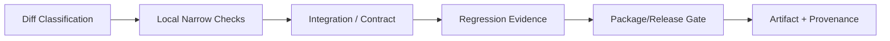
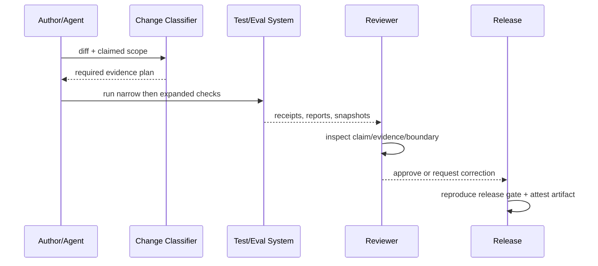

# 变更门禁与发布治理

## 1. 门禁位置

门禁按风险递增，不要求每次编辑运行全仓最重检查；但任何行为、协议、持久格式或安全边界变更都必须进入对应 owner 的证据层。

## 2. 变更分类

| 类别 | 例子 | 最低证据 |
|---|---|---|
| Docs-only | 解释、链接、设计状态 | link/manifest/docs eval |
| Internal refactor | 不改公开契约 | unit + type/lint + owning package tests |
| Behavior | 状态机、工具结果、记忆规则 | unit + integration + targeted snapshot/eval |
| Protocol/schema | event/RPC/session format | compatibility + old fixture replay + generated docs |
| Security/side effect | approval、sandbox、delete、credential | negative tests + threat review + failure injection |
| Performance | context、ledger、startup | scenario benchmark + correctness gate |

## 3. Gate 梯子

测试命令退出 0 是证据的一部分，不替代行为断言。失败的检查不能通过删除测试、扩大 snapshot 或改阈值解决，除非有独立 Note 解释语义变化。

### 3.1 从当前 CI 渐进接入

当前 [CI](../../../.github/workflows/ci.yml) 只有 `typecheck`、`test`、`evals` 三个 job；下表是**目标接线**，不是现有脚本或在线 required check 声明。新门禁先有独立命令、合法/非法 fixture、明确输入/产物，再接入相应 job。CI 结构测试还须能在删除关键步骤时失败；是否被 GitHub branch protection 要求，需单独在线核查。

| 目标守卫 | 前置与负例 | 建议位置 |
|---|---|---|
| V2 文档/DAG | manifest 缺文件、非法 status、重复 ID、循环 | `typecheck` |
| 依赖/事实不变量 | 反向或 deep import、环、第二 Ledger writer、Projection I/O、wire 泄漏 | `typecheck` / `test` |
| 录制 Session | keyless 入口、脱敏和人工 refresh；故意漂移事件/外部文件应失败 | `test`，在 `SNAP-070` 实现后 |
| 用户路径 Benchmark | 正确性先通过，固定输入/runner 与慢路径反例 | 独立资源 lane，校准后再阻断 |

无密钥真实模型 lane 可以观察，但跳过不得被报告为“已验证”。只有稳定复现违规、合法路径诊断明确、并行负载下可靠且成本可接受时，才从观察升级为阻断。现有性能 eval 属回归报警，不等于公开 SLA。具体执行次序见[工程 SOP](04-engineering-sop.md)。

## 4. 发布证据包

每次版本发布保存：commit/ref、锁文件 digest、构建环境、依赖清单/SBOM（阶段引入）、测试/eval/benchmark 摘要、schema compatibility、迁移说明、已知限制、artifact checksum 和签名/attestation 状态。

## 5. 关键参数

| 参数 | 推荐 |
|---|---|
| `required_gate_source` | 按路径/标签生成，允许 reviewer 加严 |
| `flaky_retry` | 最多一次诊断性重跑；仍失败即 fail |
| `benchmark_regression` | 场景级预算，不用一个全局百分比 |
| `snapshot_update` | 人工审查语义 diff，禁止自动接受 |
| `release_reproducibility` | 同 ref clean build 的关键 artifact hash 可解释一致 |
| `gate_promotion` | 本地命令与反例 → CI 观察 → 稳定阻断；不得靠 YAML 推断在线保护 |

## 6. Break-glass

紧急修复可减少非关键门禁，但不能跳过安全、持久格式兼容和最小回滚验证。发布后补充事件 Note、完整门禁和回归 fixture；break-glass 使用次数本身是治理指标。

## 7. 验收标准

任一 PR 能按变更分类得到确定门禁；故意制造 schema incompatibility、snapshot drift、性能回归或未固定供应链依赖时对应 gate 会失败；发布 artifact 能追到源码、锁文件和验证报告。

## 8. 待评审

- monorepo 采用 changeset、统一版本还是按 package 独立版本；
- benchmark 在本机基线还是固定 runner 上作为 hard gate；
- nightly、PR 与 release 三类流水线的资源预算。
