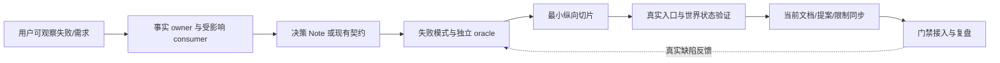

# 工程研发与维护 SOP

本文把 V2 目标架构落到一次可审查的工程改动上，是[仓库治理](README.md)的执行子文档，不是第二份路线图。任务 ID、依赖和验收仍以[`roadmap.yaml`](../roadmap.yaml)为准；[任务执行契约](../09-implementation-roadmap/02-task-execution-contract.md)负责单张任务卡。本 SOP 只定义如何找事实归属、选择验证证据、推进门禁和维护规则。当前行为以根 [README](../../../README.md)、[已实现模块](../../modules/)、源码与测试为准；本文所有新机制均为 **Target**，不可反向写成已交付能力。

## 1. 一项改动的责任链

一个功能不因为有目录、接口或 UI 就算完成。先写清它对用户造成的外部结果，再回答：谁拥有定义，谁拥有唯一写入，谁实现，谁消费，谁在重启后恢复。只有真实存在的 Definition/Provider/Consumer 才应分开；单消费者的薄转发层不是独立包的理由。[物理升包](../03-package-topology/05-profiles-dependency-gates.md)还有额外的当前硬门槛。

| 责任 | 评审必须回答 | 默认落点 |
|---|---|---|
| 事实 owner / writer | 事件、Memory、Artifact 或外部动作由谁唯一写入？ | owning contract / Ledger / Memory store |
| Definition | 哪个公开类型约束调用者？版本与失败语义是什么？ | contracts 或已接受的窄 port |
| Provider | 哪个实现拥有连接、进程、文件句柄和 teardown？ | core 内 seam 或已升格 provider |
| Consumer | CLI、Host/SDK、Web、未来 Desktop 谁真实使用？ | 对应当前应用或目标装配层 |
| Recovery | 重放能重建什么？未知外部状态由谁对账？ | Ledger/Projection 与 Action WAL 责任边界 |

以工具能力为例，目标纵向链是 `Tool schema → Policy/Approval → Executor → Receipt → Observation/Reconcile → canonical Event → Projection/客户端`。模型声称完成、工具退出码为 0，都不能替代外部文件或服务状态的独立检查。恢复旧会话须重新评估当前权限；Memory 检索命中也只是一条候选证据，不自动成为事实或授权。这些是设计约束；是否已在某条具体路径实现，须回查[当前模块文档](../../modules/)。

## 2. 当前资产与目标增量

| 领域 | Current：可复用资产 | Target：下一道守卫 |
|---|---|---|
| Runtime/事实 | contracts、Ledger/Projection、CLI 纵向 e2e、离线 replay eval | 单 writer/纯投影负例；拆分时事件顺序和外部工作区行为保持 |
| Memory | 本地 JSONL、BM25、来源引用与受预算约束的 recall | 来源、scope、治理状态、撤销/冲突/过期反例；不预设向量库 |
| 工具/副作用 | Tool、Policy/Approval、Action WAL | 受控本地动作的 `intent → Receipt → Observation → reconciled/unknown`；未知时禁止盲重试 |
| 质量 | 单测、CLI e2e、coverage、离线 eval 与四项性能报警 | 最小 keyless 场景、P7 通用 recorded-session、独立用户路径 benchmark |
| 交付 | [三条 CI job](../../../.github/workflows/ci.yml)、私有 bundle 检查 | 可失败架构门禁、真实产物 smoke；公开发布另行证明 |

不照搬其他项目的包数量、逐文件 100% 覆盖率、平台矩阵或聚合 job。缺口应由真实失败、明确 owner 与可运行反例触发，不由目录外观触发。

当前 `typecheck`、`test`、`test:e2e`、`evals` 根脚本都会先运行 `build`；包内 Vitest 仍可直接运行 `src` 测试，跨包消费者是否读取 `dist` 要按实际 import 核对。未来若分离 source checks 与 built-artifact smoke，须先用专门任务证明两条路径各自读的来源、没有陈旧 `dist` 误导，再改变 CI；本 SOP 不把这项分离写成现状。

## 3. 从需求到交付的执行顺序

| 顺序 | 产物 | 停止条件 |
|---:|---|---|
| 1. 固定问题 | 可复现输入、期望的外部状态、非目标与风险 | 只有“Agent 说做完了”，没有独立结果判据 |
| 2. 找真源 | current 源码/测试、目标子模块、任务 ID、上游依赖、脏工作树 | 当前事实与 V2 提案混写，或改动覆盖用户已有内容 |
| 3. 定边界 | owner/writer/consumer/恢复表，必要时写 proposed Note 与替代方案 | 协议、包边界、权限或持久格式变更没有可追溯决策 |
| 4. 列证据 | 每个失败模式配最便宜的正例、反例和独立 oracle | 测试只能证明内部自述，不能让错误路径失败 |
| 5. 做切片 | 单一主变更类型的最小实现；先保留兼容 reader，再切 writer | move/refactor 同时悄悄改行为，或两个写入真源并存 |
| 6. 走真实入口 | focused → owning integration → CLI/Host/SDK/Web 实际路径；必要时校验构建产物 | 只测 mock 组合，不知道真实入口是否贯通 |
| 7. 同步与评审 | owning 模块、Note 状态、限制、证据/回滚和实际命令结果 | 只更新 V2 愿景，或把未运行的检查写成通过 |

具体任务卡沿用[任务执行契约](../09-implementation-roadmap/02-task-execution-contract.md)的字段；任何任务必须写 `in_scope / out_of_scope / truth_sources / invariants / verification / rollback / done_when`。一人兼任多种评审角色也应分别检查产品、架构、质量、安全和迁移问题。

## 4. 按现有任务 DAG 的阶段动作

| 阶段 | 本阶段先证明什么 | 不得提前声称 |
|---|---|---|
| P0 | `GOV-001 → DOC-002 → BASE-003`：入口、DAG 检查、可重跑基线；包门槛和规则文件名在接受的 Note 中定稿 | 文件存在就等于治理任务完成 |
| P1 | `ARCH-010/012`：合法源树通过，反向 import、第二 writer、wire 泄漏、Projection I/O 反例失败；接入现有 CI 后测试连线 | CI YAML 已证明在线 branch protection |
| P2 | `CORE-020～028`：先在 core 内提取，保持事件顺序、审批时点、JSONL、CLI e2e 与外部文件结果 | P7 的通用 recorded-session 框架已存在 |
| P3 | 先稳定窄 seam、公开 exports、contract tests 和真实 consumer，再依包门槛升格 | 家族目录等同物理 package |
| P4/P5 | Memory 的来源/撤销/跨 scope 反例；本地受控动作的结果观察、未知态对账、取消后静默 | 语义检索或通用外部系统可靠性已实现 |
| P6～P8 | 协议边界稳定后接 Desktop；再建 recorded-session、benchmark、i18n 与公开发布证明 | 私有 bundle 等同公开 npm/签名 Desktop 发布 |

P2 在 `SNAP-070` 之前只依赖既有 CLI e2e、Ledger replay eval、focused fixtures 和外部工作区断言；若要新增最小 keyless 场景，应单独交付并在任务 DAG 中声明依赖。P7 才把它扩为通用录制/刷新/脱敏机制。见[实施路线](../09-implementation-roadmap/README.md)。

## 5. Oracle、质量和性能分开看

每条关键能力的评测卡应写：固定任务与 workspace、允许动作、期望/禁止 canonical 事件、模型可见输入来源、Receipt、外部世界状态、失败/`unknown`、资源预算、脱敏规则、基线版本。建议保存三个互不替代的结论：

| 维度 | 独立 oracle | 不能推断 |
|---|---|---|
| 正确性 | 事件/Projection、拒绝路径、重启 replay、外部文件字节或服务回读 | 模型说“成功”就成功 |
| 质量 | 同任务有/无 Memory 的来源、误召回、越权与任务完成对比 | 小型固定 BM25 fixture 等于开放域效果 |
| 性能 | 固定输入、同 runner class、原始样本、p50/p95/峰值内存及正确性先决条件 | 单机宽松报警阈值等于用户 SLA |

录制 Session 和模型评判不能替代拒绝/权限的确定性断言。性能基线变更要审原始采样、输入规模、环境和行为结果，不能靠删场景或放宽阈值隐藏退化。详细设计归[测试与 Eval](../07-quality-benchmarks-snapshots-i18n/01-test-eval-strategy.md)、[Benchmark](../07-quality-benchmarks-snapshots-i18n/02-benchmark-system.md)和[Snapshot](../07-quality-benchmarks-snapshots-i18n/03-recorded-session-snapshots.md)所有。

## 6. 门禁晋级与规则维护

当前 CI 只有 `typecheck`、`test`、`evals` 三个 job。目标检查先成为独立、可本地执行的命令，并有合法/非法 fixture；然后测试工作流是否真的调用了该命令；最后才考虑升级为 required check。`verify-v2-docs`、`verify-boundaries`、`verify-invariants`、通用 snapshot 与 benchmark 均是路线图任务，不是现有 `package.json` 命令。网络/真实模型缺席时必须写“未验证”，不能把跳过显示为成功。门禁分类、发布边界与 release evidence 归[变更门禁与发布](03-change-gates-release.md)所有。

维护任何规则时填写五项：**owner、触发情形、真源、最小违规反例、发现漂移的检查**。若反例无法稳定失败，先维持人工评审，不增加装饰性脚本。真实缺陷发生后保留最小输入和环境，修 owning source，在最低有效层加入永久回归；只有可机械判定的错误才升级为静态门禁。旧 Note 与 Skill 依据[AGENTS/Notes/Skills](01-agents-notes-skills.md)的生命周期更新，不复制第二份活规范。

## 7. 参数与验收

| 参数 | 约束或建议 |
|---|---|
| 任务粒度 | 一个可停止的纵向切片；move、行为、协议、基线更新分开 |
| 基线 `--check` | 只字节比较由源码确定性生成的结构；机器、时间和耗时是诊断元数据 |
| 门禁级别 | 本地最窄检查 → CI 观察 → 稳定阻断；在线 branch rule 另行核实 |
| 资源 ownership | 测试明确拥有临时目录、端口、进程、watcher 和 teardown |
| 证据报告 | 列出 changed、verified、not verified、deferred、risk 和可复核命令 |

**验收**：任取一个 roadmap 节点，另一位实现者可沿唯一真源找到 owner、前置、最窄命令、反例、独立外部 oracle 与回滚；current 文档不声称未交付 V2 能力；故意删除关键门禁连线或注入所防违规时，检查确实失败。
