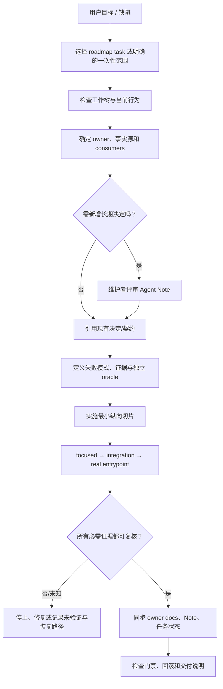

# 工程研发与维护 SOP

本文是 [`02-repository-governance`](README.md) 的工程执行指南，不是第二份路线图或产品运行时规范。路线任务 ID、依赖和阶段验收以 [`roadmap.yaml`](../roadmap.yaml) 为唯一任务真源；字段细则以[任务执行契约](../09-implementation-roadmap/02-task-execution-contract.md)为准。本文把“选中一个正确的任务”转成可审查的工作切片。

当前行为必须回到根 [README](../../../README.md)、对应[已实现模块](../../modules/)、源码、测试和真实运行入口核验。V2 文档及本文中的未实现门禁都标为 **Target**；文档详细程度不表示能力已经交付。

## 1. 工作系统中的责任链



实现者负责提出可验证的技术方案和差异；维护者负责接受有持久影响的产品/架构/安全决定；Reviewer 独立检查规则和证据；gate owner 维护自动检查。单人可以兼任多个角色，但评审清单仍分别完成。

## 2. 任务选择与开始前检查

### 2.1 选择一个可交付切片

1. 从用户明确请求开始；若是 V2 实施，找到 `roadmap.yaml` 中对应 task id 和前置任务。
2. 仅在所有 `depends_on` 已完成且证据存在时开始；“文件存在”或“文档写了通过”不算前置完成。
3. 若没有吻合任务，先提出最小的任务卡并说明与现有 DAG 的关系；不要从全套愿景自行挑选功能或跨越未裁决的 ADR。
4. 将任务切成一个主要变化类型：docs、tooling、refactor、behavior、protocol、storage 或 tests。需要多个类型时拆成可独立审查、按顺序依赖的任务。

### 2.2 工作区预检

开始任何改动前执行并记录：

| 检查 | 问题 | 停止条件 |
|---|---|---|
| 当前仓库和分支 | 确认工作目录、HEAD、目标分支与预期仓库 | 仓库/分支不是用户指定范围 |
| 脏工作树 | 哪些已有文件改动属于用户或之前任务？ | 目标重叠且无法安全并行时，先询问/拆分 |
| 工具版本 | Node/pnpm 与 `package.json` engines 匹配吗？ | 不支持版本时不信任该环境的构建结果 |
| 任务依赖 | 前置 task 是否通过当前工作树可复核？ | 依赖仅在提案里或仍失败时暂停 |
| 数据副作用 | 测试、Eval、snapshot 或生成脚本是否会写入用户数据？ | 未知输出路径/重置行为时先读脚本和配置 |

不得清理、checkout、reset、覆盖或刷新用户已有文件来“让基线变干净”。若某命令写入报告、数据库、Snapshot 或 `_tmp_evals/metrics` 等目录，先确定精确目标和恢复方式；不需要该命令时不要运行。

## 3. 找事实源与标记边界

对本任务涉及的每条重要陈述，标出它属于哪一类：

| 类别 | 真源 | 文档写法 |
|---|---|---|
| Current behavior | 源码、测试、实际入口与当前 `docs/modules/` | 现在时，并给路径/命令证据 |
| Accepted direction, not shipped | 有维护者裁决的 Agent Note / 评审登记 | 目标已接受，但仍标为未实现 |
| Proposed | `status: proposed` Note 或 V2 子模块 | 使用建议/目标语气，不当成指令或默认值 |
| Deferred | 决策记录中的范围和重开条件 | 写明本阶段不做、何时再讨论 |
| Unknown | 失败中断、外部副作用状态不明或缺少验证 | 原样报告 `unknown/not verified`，给下一步 reconcile |

如果设计提案与现有行为冲突，不能直接把实现改到符合提案；先确认用户是否要实施该设计、兼容影响和路线任务。若要改行为或架构，按 [Agent Note 规则](01-agents-notes-skills.md)决定是否需要 Note。

## 4. 任务卡：把边界变成验收

每项非机械改动至少有一份任务卡，字段来自路线[任务执行契约](../09-implementation-roadmap/02-task-execution-contract.md)：

| 字段 | 必须描述 | 评审时追问 |
|---|---|---|
| `task_id` / owner | 路线 ID 或明确的一次性 ID；责任模块/维护者 | 谁有权接受产品决定、谁维护验证规则？ |
| `scope` | 涉及文件、外部系统和用户路径 | 哪个真实 consumer 会感知改变？ |
| `out_of_scope` | 明确不做什么 | 会不会偷偷加功能/格式迁移/目录重排？ |
| `truth_sources` | Current 代码、测试、Note、设计页与路线前置 | 哪条结论目前只有提案支持？ |
| `invariants` | 不能破坏的权限、唯一写者、兼容、事件顺序、状态终态 | 哪个负例能证明约束仍有效？ |
| `failure_modes` | 崩溃点、拒绝、超时、unknown、重试、部分写入 | 故障发生后谁拥有恢复动作？ |
| `verification` | 最窄 focused 命令、integration、真实入口和独立 oracle | 命令有没有实际运行？是不是测试了同一个实现假设？ |
| `rollback` | 代码、Schema、数据、外部副作用分别如何恢复 | 是否可回滚；若不可，最小前向修复方案是什么？ |
| `done_when` | 可观察的用户结果和 evidence | 能否由另一位工程师独立复核？ |

### 4.1 失败模式矩阵

从功能最关键的失败开始，而不是先堆 happy-path 单测：

| 失败模式 | 所需行为 | 证据 |
|---|---|---|
| 输入非法/缺少字段 | 在副作用前稳定拒绝，指出字段与错误码 | schema negative fixture |
| 权限/scope 不符 | fail-closed，不产生事实或外部动作 | 不同 Actor/workspace 的拒绝测试 |
| Ledger/存储失败 | 不继续派发依赖该事实的副作用 | 注入 writer error，检查无调用记录 |
| 外部操作发生但 Receipt 不确定 | 标为 unknown，查询/对账，不盲重试 | dispatch intent + missing receipt fixture |
| cancellation / timeout | 停止新任务，等待/终结子执行，留下状态证据 | 真实进程/工具退出与无后续派发断言 |
| 历史数据/配置不兼容 | 明确迁移、保留或拒绝，不静默降级 | 最旧支持版本与损坏数据 fixture |
| 恢复/重放 | 同一证据恢复同一业务状态，不复制副作用 | restart + replay + external state oracle |

Oracle 尽量独立于被测逻辑：文件操作检查实际文件字节，发布检查 hash/签名，工具调用检查宿主观察到的副作用，权限测试检查真正没有调用 Provider。由被测函数自己返回“成功”不构成独立 Oracle。

## 5. 从实现到证据：执行步骤

| 阶段 | 操作 | 产物 / 继续条件 |
|---:|---|---|
| 1. 复现 | 保存最小输入、当前错误或用户路径；不含秘密数据 | 可重复的 failing test 或实际路径；否则记录为何无法复现 |
| 2. 归属 | 定义者、Provider、Consumer、唯一 writer、恢复 owner | 责任表和唯一事实源 |
| 3. 决策 | 查现有 Note；新持久/安全/协议/包决定先进入提案并等待用户裁决 | accepted 决定链接，或明确 stop/deferred |
| 4. 设计证据 | 为每个硬不变量设正例、负例和外部 oracle | 测试矩阵能让错误实现失败 |
| 5. 实施 | 完成最小可用纵向切片；保持兼容；独立变更不要捆绑 | diff 可按一个主要变化类型审查 |
| 6. Focused gate | 运行最近模块单测、静态检查和契约测试 | 最低层通过，错误报告完整 |
| 7. 集成与入口 | 运行 owning package/consumer 测试及 CLI/Web/Desktop 当前真实入口 | 证明真实装配链，而非仅 mock |
| 8. 恢复与反例 | 进行拒绝、取消、重启、旧数据和副作用 unknown 路径 | 反例门禁证明不变量受保护 |
| 9. 文档同步 | 更新 owning current doc 或 Target 设计、Note 状态、manifest/索引 | 仅在对应真源发生改变时更新 |
| 10. 汇报 | 写改了什么、实际命令/退出码、结果、没测什么、风险和恢复 | Reviewer 可复现结论 |

验证失败时回到与失败匹配的步骤。不得通过删测试、刷新所有 Snapshot、扩大阈值或隐藏 skipped 来让改动变绿；如果合法行为确实改变，先更新裁决和测试期望并在 diff 中说明原因。

## 6. 不同改动类型的执行配方

### 6.1 文档改动

确认文档属于 Current、Target、Note、Generated、Tutorial 哪一类；校验本地链接和锚点、YAML/frontmatter、Manifest/parent、Current/Target 语气、双语配对。若内容描述当前功能变化，必须先有源码/测试证据；若仅改提案，不改 Current 文档。禁止手改生成区域。

### 6.2 行为或 Runtime 改动

先保持现有事件/公开输入输出，除非 task 明确允许协议变化；从真实入口复现任务；覆盖审批拒绝、失败、unknown 和 cancellation；用文件、Ledger/重放或外部服务 read-back 验证结果。若改变 Context 或 Memory 注入，记录模型可见输入的 provenance 和不该发送的字段。

### 6.3 命令、事件或持久格式变化

先确定 writer 与 reader；新增前向读取/相邻迁移和旧数据 fixture，再切换写入；运行历史 Snapshot/Session 重放；验证失败版本明确拒绝；记录 schema version、数据升级和回滚策略。不可原地覆盖已经发布的持久 generation，也不可宣称向后兼容但没有老 fixture。

### 6.4 副作用、安全和权限变化

先写 threat/failure model；确认 actor、workspace、policy、approval 和当前 credential 在每个恢复/重试边界重新求值；在副作用前提交必要 intent；确保 Receipt 与外部状态核验可区分；注入超时、进程退出和服务不可达；外部结果不明时 fail-closed 并报告 unknown。

### 6.5 Package 拆分/依赖调整

先内部成层并确定窄端口，再证明稳定边界、至少两个真实消费者或硬隔离理由及契约测试。先只建立 architecture gate 的正反例，再移动代码；API 和行为改造不与大规模移动混在一个 PR。回滚要恢复 public export 与旧导入路径，且不可产生第二个 writer。

## 7. 按路线阶段的工作边界

| Phase | 本阶段允许/必须证明 | 不应提前做或声称 |
|---|---|---|
| P0 | `GOV-001 → DOC-002 → BASE-003`：治理入口、文档/任务 DAG 检查、可复现当前基线；未决决定分配到阶段 | Note/Skill 机制文档已写不等于 checker/gate 已交付 |
| P1 | `ARCH-010/011/012/013`：依赖、单 Ledger writer、Projection 纯度、wire 隔离有可运行正反例，并验证 CI 连线 | AGENTS 文本禁止了某 import 不等于 CI 已阻断 |
| P2 | `CORE-020～028`：保留事件顺序、当前 JSONL 与 CLI 用户路径；依赖当前 focused/E2E/replay 证据 | 通用 P7 Snapshot harness 当前已存在 |
| P3 | 有稳定 consumer 与契约测试的逻辑 family 才升为物理包 | 先建全部目标目录或空壳 package |
| P4/P5 | Memory 准入/撤销/跨 scope 与恢复/取消/unknown 有清晰当前 policy 和负例 | RAG 命中代表 Memory 事实；工具或模型调用 exactly-once |
| P6 | CLI/Web UI/Desktop 共用语义；Desktop Host/process/权限边界可实证 | 只凭 Web 可用宣称 Desktop 可用 |
| P7 | 通用 Snapshot、Benchmark、文档双语门禁各自有输入/owner/负例；Langfuse 外部评估可选且单独报告 | 自动接受 Snapshot 或在线评估失败当成本地 CI 失败 |
| P8 | clean-room 安装、公开演示、兼容与发布 evidence 可复现 | 私有测试 bundle 即公共发行物证明 |

阶段先后以 `roadmap.yaml` DAG 为准；本表解释门槛，不复制每个 task 的验收字段。P2 暂时使用已有 CLI 纵向 E2E、focused fixtures、Ledger replay 与外部工作区断言；通用录制框架要等 `SNAP-070` 路线任务实现。

## 8. 回滚与外部世界未知态

回滚按影响分开设计：

| 影响 | 回滚/补救思路 |
|---|---|
| 仅源码 | 恢复最小代码 diff，保留失败 fixture 以防复发 |
| 公开 API/协议 | 兼容 shim/相邻版本迁移；恢复旧消费者前先验证读写方向 |
| 持久数据 | 先确保旧 reader；若无法安全降级，明确只能前向修复并禁止覆盖旧数据 |
| 外部副作用 | 查询 receipt/state、按稳定 operation id reconcile；未确认前不得盲目重复 |
| 权限或秘密 | 停止派发、撤销凭据/approval、确认没有越权副本并记录安全事件 |
| Benchmark/Snapshot 基线 | 撤销未解释 baseline 更新；从版本控制恢复旧基线并审查行为差异 |
| 部分发布 | 停止后续渠道，固定 artifact/commit，按 release Note 执行前向修复或回退 |

如果无法确定外部操作是否发生，最终报告为 `unknown`，附 `operation_id`、最后一个已验证 Receipt、查询方式和禁止自动执行的动作。不能把“我没看到成功”改写为“确定没发生”。

## 9. 交付报告格式

任何实现者或 Agent 完成任务后，报告应包含：

```text
Task / scope: task id + changed responsibility
Current evidence: source, tests, starting behavior
Changes: what changed and what intentionally did not
Verification: exact commands, exit codes, relevant artifacts
Negative paths: rejected/failed/unknown/recovery evidence
Not verified: skipped tests, external systems, unsupported platforms
Risks / rollback: data, protocol, package, and outside effects
Documentation: owner docs / Note / manifest changed or not applicable
Done when: observed condition matching the task acceptance criteria
```

只汇报本轮实际运行的命令，不把 CI 预期、旧日志或文档建议说成本轮验证。对文档-only change 应明确它没有证明 Runtime 行为。

## 10. 关键参数

| 参数 | 设计含义 | 建议起点 / 裁决方式 |
|---|---|---|
| `slice_size` | 单个可交付切片的大小 | 小到能在一个评审周期内验证，大到能形成可观察行为；不把多个边界一次打包 |
| `task_card_fields` | 任务卡必须写清的字段 | 真源、边界、正反证据、真实入口、外部 oracle、回滚与完成判据缺一不可 |
| `evidence_layer` | 回归证据应落在哪一层 | 选择能捕获该缺陷的最低稳定层，不把偶然人工步骤当作门禁 |
| `rollback_class` | 回滚按影响面分类的粒度 | 至少区分仅源码 / 协议 / 持久数据 / 外部副作用 / 权限 / 基线 / 发布 |
| `unknown_outcome_handling` | 外部结果未知时的处理 | 报告 `unknown` 并附 `operation_id`、最后已验证 Receipt、查询方式；禁止自动重跑 |
| `report_command_scope` | 交付报告能声称的验证范围 | 只写本轮实际运行的命令与退出码，不把 CI 预期或旧日志当作本轮证据 |

## 11. 规则复盘与 SOP 验收

发现回归时保留最小输入与环境；修复 owning source；在能捕获缺陷的最低稳定层增加永久回归；若是重复人工失误，再考虑把步骤提升为 Skill；若跨变更继续有效，再考虑将不变量提升为 AGENTS 硬规则。若根因是架构取舍，新增/更新 Note，而不是把事故叙述塞入 `AGENTS.md`。

**目标验收**：随机选择一个已到期任务，执行者可以仅凭路线 DAG 和本 SOP 找到 current 真源、decision owner、正反证据、真实入口、外部 oracle、回滚与完成判据；若工具失败、依赖未实现、权限不足或外部结果未知，流程会停并如实报告，而不是继续扩大操作范围。
