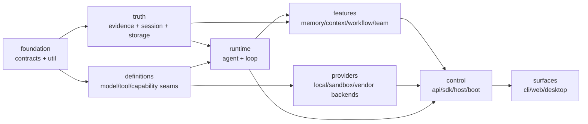

# 03 · 包家族与依赖设计

## 1. 先说结论：学习“家族包”，不复制“包数量”

当前仓库只有 8 个 package，却有一个超过五万行、`runtime.ts` 超过一万行的 `@tracegraph/core`。直接照着大型 Harness 一次拆成上百个 package，会把一个边界问题变成发布、构建和认知成本问题。

V2 采用两级目标：

1. **逻辑家族立即成立**：owner、依赖方向、公开接口和测试边界先明确；
2. **物理升包按证据发生**：只有满足升包门槛的逻辑模块才成为独立 workspace package。

因此，[迁移基线](10-tracegraph-to-outlive-migration.md)保留的“先在 core 内分层”仍是正确第一步；本文件同时明确：边界稳定并满足升包门槛后，可以物理拆包。

## 2. 升包门槛

一个模块满足以下任意两项，才建议升为 package；安全/协议边界可凭一项强制升包：

- 有两个及以上独立 Consumer；
- 有两个及以上 Provider，需要替换实现；
- 具有独立持久格式或版本兼容责任；
- 需要被 app、SDK 或外部工具单独消费；
- 有独立生命周期、资源 owner 或 teardown；
- 能用窄公开 API 隔离，且不会暴露大批内部类型；
- 有独立测试/benchmark/发布边界；
- 保留在原包会形成依赖环或越权依赖。

不满足门槛时，留在 family 内的一个模块目录。禁止为了“一文件一包”升包。

## 3. 全局依赖方向



组合层可以同时依赖 Definition、Provider 和 Feature；普通 feature 不得依赖具体 app。任何逆向箭头都需要 Agent Note 和架构评审。

## 4. 目标 family 总览

| Family | 目标职责 | 优先级 | 当前主要来源 |
|---|---|---:|---|
| `foundation/` | contracts、brand、hash、time、bounded values | P0 | `packages/contracts`、`core/crypto.ts` |
| `evidence/` | ledger、receipt、artifact、projection、replay、WAL、bundle | P0 | `packages/core` |
| `session/` | session model、format、persistence、query、migration | P0 | `core/session-*` |
| `core/` | Agent/Run/Turn/Step、scope、最小 loop | P0 | `core/runtime.ts` |
| `tool/` | registry、executor、policy、approval、output | P0 | `tool-registry.ts` 等 |
| `context/` | assembly、provenance、token、compaction、spill | P1 | `context*.ts` |
| `memory/` | lifecycle、retrieval、experience、context bridge、export | P1 差异化 | `memory.ts` + retrieval |
| `llm/` | model seam、provider adapters、retry、usage | P1 | `model-provider.ts` |
| execution families | fs、shell、terminal、sandbox、subprocess | P1 | 当前 tool/runtime/sandbox |
| intelligence families | codegraph、lsp | P1 | `codegraph`、`core/lsp` |
| integration families | mcp、skill、hooks、extensions | P1 | `core/mcp`、`skill.ts`、extension |
| orchestration families | workflow、goal、todo、subagent、team、jobs | P2 | runtime/team/todo/subagent |
| control families | api、sdk、host、boot、profiles | P2 | host/sdk/cli |
| client family | transport client、store、UI modules、locale | P2 | apps/web |
| support | telemetry、diagnostics、test-support、util | 持续 | 现有对应包 |

## 5. Foundation family

```text
packages/foundation/
├── contracts/          canonical domain contracts; existing package evolves here
├── brand/              opaque IDs, no runtime state
├── crypto/             hash/stable serialization/redaction primitives
├── time/               monotonic/deadline abstractions
└── bounded/            byte/item/token/time bound helpers
```

约束：

- 零业务 I/O；
- `contracts` 不实现行为；
- wire DTO 与 internal canonical types 分面导出，不能把私有 evidence 字段泄漏到 UI；
- opaque id 不使用裸 `string`；
- runtime validation 只在不可信边界执行，不在每个同进程 typed call 重复校验。

第一阶段不必物理创建 `brand/time/bounded` 包，可作为 `contracts`/`core/kernel` 内模块；出现两个以上消费者再升包。

## 6. Evidence family

```text
packages/evidence/
├── event/              Event envelope、type map、producer contract
├── ledger/             append/read/hash-chain/single-writer
├── receipt/            attempt/receipt/observation vocabulary
├── artifact/           content-addressed bytes + access control
├── projection/         pure reducers and snapshots
├── replay/             replay, diff, time-travel
├── action-wal/         side-effect before-image and reconciliation
├── bundle/             portable evidence export/import
└── invariant/          owned consistency checks
```

### 6.1 必须独立的边界

- `ledger` 只负责有序、原子、可校验持久化，不知道 React 或 tool name。
- `projection` 是纯函数；不能触盘、联网、读取当前时间或环境变量。
- `artifact` 拥有大对象与内容 hash，Ledger 只保存引用和 bounded metadata。
- `action-wal` 服务于外部副作用，不得与普通 Session 尾部修复混成一个状态机。
- `bundle` 导出前进行 scope、secret、missing-reference 和 checksum 检查。

### 6.2 当前迁移

第一步在 `packages/core/src/domains/evidence/` 聚合现有文件；第二步把不再 import Runtime 私有类型的模块升包；最后由 Runtime 依赖公开 Evidence API，而非 Evidence import Runtime。

## 7. Session family

```text
packages/session/
├── session/                    logical session/branch handles
├── session-format/             current schema + version catalog
├── session-persistence/        backend definition
├── session-persistence-jsonl/  local append implementation
├── session-projection/         typed incremental projection registry
├── session-query/              list/search/export/lineage
├── session-migration-vN-vN1/   exactly one adjacent migration per package/module
└── session-checkpoint/         checkpoint policy and resume metadata
```

规则：

- 已发布 generation 不覆盖、重命名或删除；
- reader 拒绝未来版本；
- migration 只做相邻版本，链由 catalog 组合；
- Session 是对话/执行历史，Memory 是跨 Session 的精选知识，两者不能共用一个 CRUD store；
- branch/fork 必须保留 lineage，复制资源引用时不复制外部资源本身。

## 8. Core Runtime family

```text
packages/core/
├── agent/              Agent handle、status、inbox、cancel
├── agent-loop/         唯一默认 Turn/Step 驱动器
├── scope/              trace/session/run/agent scope primitives
├── run/                Run state machine and budgets
└── guard/              no-progress、repeat、timeout guards
```

目标是让 `agent-loop` 只做：

1. 从 inbox 领取工作；
2. 触发 Context 组装；
3. 调用 Model seam；
4. 将 ToolCall 交给 Tool Executor；
5. 根据已提交结果决定继续/停止；
6. 处理 cancel、retry 和 settlement。

Memory、MCP、LSP、Team、Web、Desktop 均通过已记录扩展点接入，不在 loop 中新增 `if featureEnabled` 分支。

## 9. Tool family

```text
packages/tool/
├── tools/              registry + definition contract
├── tool-executor/      validate → authorize → dispatch → settle
├── tool-policy/        hard constraints + layered rules
├── tool-approval/      one-shot bounded approval tokens
├── tool-receipt/       receipt normalization + observation mapping
├── tool-output/        spill/truncate/presentation budgets
└── tool-present/       model/UI presentation, no execution
```

每个工具定义至少声明：input/output schema、read-only/destructive、side-effect scope、并发模式、timeout、cancel、最大输出、idempotency/reconcile 能力和权限需求。

`tool-executor` 是强制点；Prompt、schema omission、UI 隐藏和 hook 都不能替代它。

## 10. Context family

```text
packages/context/
├── context/                    assembly registry and manifest
├── context-provenance/         origin/trust/source refs
├── context-budget/             token/byte/item planning
├── context-compaction/         replaceable compaction seam
├── context-compaction-basic/   default provider
├── context-tool-pruner/        model-free output pruning
├── spill/                      large content externalization seam
└── spill-local/                artifact-backed provider
```

Context item 的稳定 identity、origin、source、priority、budget 和 action（keep/truncate/externalize/replace）必须进入 manifest。Compaction 生成新 surface 节点，不改写历史事件。

## 11. Memory family

```text
packages/memory/
├── memory/                records, lifecycle and policy definition
├── memory-candidate/      extraction/dedup/proposal
├── memory-review/         auto/human admission and correction
├── memory-persistence/    backend definition
├── memory-local/          local JSONL/SQLite provider
├── memory-retrieval/      query/ranking contract
├── memory-retrieval-bm25/ existing deterministic provider
├── memory-context/        bounded cited Context contribution
├── experience/            procedural cases and applicability
├── legacy-capsule/        export/import/checksum/redaction
└── memory-evals/          recall, conflict, provenance, forgetting
```

`memory-context` 只消费 active、scope-compatible、未过期且有证据的记录；它不能把 Memory 变成 system instruction。完整设计见 [04](04-memory-and-experience.md)。

## 12. LLM family

```text
packages/llm/
├── llm/                    stream vocabulary and adapter registry
├── llm-router/             provider/model selection and capabilities
├── llm-openai-compatible/  protocol provider
├── llm-anthropic/          protocol provider
├── llm-retry/              classified retry, no hidden infinite loop
├── token-meter/            estimate/calibration
└── llm-replay/             deterministic recorded provider for tests
```

Model provider 只负责协议与流式 settlement；业务 retry、Memory、Tool policy 不得写进 provider adapter。每次请求必须冻结实际 provider/model/capability/config digest。

## 13. 执行能力家族

每个 family 遵循 Definition / Provider / Consumer：

```text
packages/fs/        fs | fs-local | fs-sandbox | tool-fs | tool-search
packages/subprocess/subprocess | subprocess-local
packages/shell/     shell | bash-local | bash-sandbox | tool-bash
packages/terminal/  terminal | terminal-local | tool-terminal
packages/sandbox/   sandbox | sandbox-local | sandbox-policy
```

文件、shell、terminal 与 LSP 必须共享同一个 execution world。将它们分别指向本机和远端会产生“命令在 A、文件在 B”的不可解释状态，因此 Provider 由同一 profile 成组装配。

## 14. 代码智能与集成家族

```text
packages/codegraph/ codegraph | codegraph-ts
packages/lsp/       lsp | lsp-stdio | tool-lsp
packages/mcp/       mcp-client | mcp-resources | mcp-tool-bridge
packages/skill/     skill | skill-filesystem | tool-skill
packages/hooks/     hook-protocol | hook-adapters
packages/extensions/extension-runtime | extension-host
```

MCP 回答“怎么发现和连接外部工具/资源”；Tool Executor 回答“这个动作是否允许、如何执行、如何对账”。两者绝不能合并为“用了 MCP 就安全”。

## 15. Orchestration family

```text
packages/workflow/  workflow | workflow-runner | tool-workflow
packages/goal/      goal | tool-goal
packages/todo/      todo | tool-todo
packages/subagent/  subagent | providers/* | tool-subagent
packages/team/      team | tool-team | team-projection
packages/jobs/      jobs | jobs-local | tool-jobs
```

- Workflow 是显式步骤图；Agent Loop 是开放式推理循环。
- Subagent 是委派能力；Team 是持久协作领域，不是多个 Promise。
- A2A 负责 Agent↔Agent 任务与状态；MCP 负责 Agent↔Tool/Resource 连接。
- 子 Agent 继承 trace lineage，但拥有独立 Session/Run、预算、工具白名单和 settlement。

## 16. Control、Host、SDK 与 Client families

```text
packages/api/
  gateway | session-controller | workspace-controller | settings-controller
packages/sdk/
  protocol | client | server
packages/host/
  webserver | desktop-bridge | directory-picker | frontend-static
packages/boot/
  app-boot | profile-loader | config-resolver
packages/client/
  connection | store | locale | ui-* | web
```

- `sdk/protocol` 依赖最少，不含业务实现。
- Controller 接受 Command/Query 并调用 domain service，不直接解析 Ledger 文件。
- Client store 是投影缓存，不是业务真源。
- Desktop bridge 与 Web server 复用同一 controller/service，只有 transport 不同。
- API schema 由 contracts 生成并有兼容性门禁。

## 17. Bundle/Profile，不再用 CLI 手工装全部依赖

```text
profiles/
├── base.yaml
├── cli.yaml
├── web.yaml
├── desktop.yaml
├── headless.yaml
├── sdk.yaml
└── acp.yaml
```

Bundle 可以贡献一组能力，例如 `coding-base`、`memory-local`、`web-app`。Profile 负责有序组合与覆盖。最终 resolved config 必须可 dump、可 hash、可在 Run 中引用。

## 18. 当前包迁移表

| 当前 package/app | 第一落点 | 长期目标 |
|---|---|---|
| `@tracegraph/contracts` | 保持，分 canonical/wire/config 子入口 | foundation/contracts |
| `@tracegraph/core` | `kernel/domains/seams` 内部治理 | core + evidence/session/tool/context/memory 等 families |
| `@tracegraph/retrieval` | 保持独立 | memory/memory-retrieval-bm25 |
| `@tracegraph/codegraph` | 保持独立 | codegraph/codegraph-ts |
| `@tracegraph/telemetry` | 保持独立 | support/telemetry |
| `@tracegraph/host` | 先拆 controller 与 transport 目录 | api/* + host/* |
| `@tracegraph/sdk` | 先拆 protocol/client | sdk/* |
| `@tracegraph/test-support` | 保持 | test-support/* |
| `apps/cli` | 减少 Composition Root 巨石 | app + profiles/boot |
| `apps/web` | 保持客户端 | client/web + app shell |
| `apps/retrieval-service` | 标为 optional provider app | 合并为 profile 或保留独立服务需 ADR |
| 新 `apps/desktop*` | 不存在 | Phase 6 后添加 |

## 19. 架构门禁

目标 `architecture-policy.yaml` 至少表达：

```yaml
version: 1
global:
  forbid_cycles: true
  forbid_deep_imports: true
  max_file_lines: 500
  max_public_methods: 15
modules:
  - id: evidence-projection
    roots: [packages/evidence/projection/src]
    requires: [foundation-contracts]
    purity: true
  - id: core-agent-loop
    roots: [packages/core/agent-loop/src]
    requires: [foundation-contracts, evidence-event, tool-executor, llm]
    forbidden: [apps, packages/client, packages/host]
```

门禁分迁移状态：`legacy` 模块先只观测，`managed` 模块强制执行。每完成一个迁移切片，将对应模块从 legacy 改为 managed，避免一次要求旧代码全部合规。

## 20. 包拓扑验收

- dependency graph 无环且可生成；
- `agent-loop` 不 import 具体 model/fs/sandbox provider；
- UI、Host transport 不进入 Runtime；
- 每个 capability seam 的 Definition/Provider/Consumer 完整可定位；
- 每个 package README 有 purpose/API/state/model effect/verification/limitations；
- 没有空包、循环 re-export 或仅为目录整齐而存在的 package；
- 当前实现映射到目标 family 的每一步都能单独停下并通过原行为测试。
