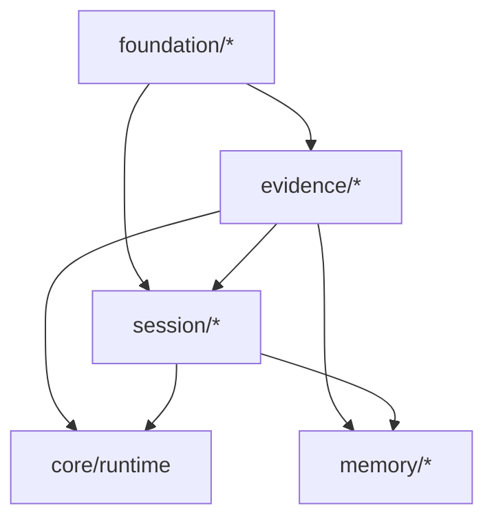
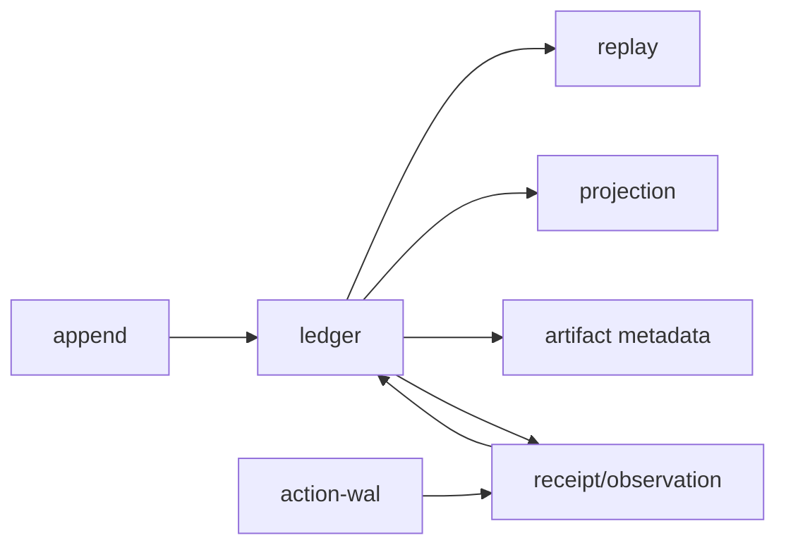

# Foundation、Evidence 与 Session 家族设计

## 1. 在包拓扑中的位置



这三族构成下层可信基础。它们不得依赖 Runtime、具体模型、工具 provider、Host 或客户端。

## 2. Foundation 子包

| 子包 | 拥有 | 公开面 | 禁止 |
|---|---|---|---|
| `contracts` | branded IDs、Result/Error、基础 envelope | 类型与 schema | 文件/网络 I/O |
| `schema` | runtime validation、version helpers | parse/validate/upcast | 领域编排 |
| `hash` | canonical bytes、digest | hash/verify | 自行决定业务 canonicalization |
| `time` | Clock、Duration、deadline | injectable clock | 直接散落 `Date.now()` |
| `bounded` | token/bytes/count 等受限值 | constructors + errors | 静默截断 |

Foundation 的目标是稳定、窄、无框架依赖；只有真正跨两个以上 family 的概念才能进入。

## 3. Evidence 子包



| 子包 | 责任 | 关键不变量 |
|---|---|---|
| `ledger` | append/read stream、并发版本 | append-only；event id 唯一 |
| `receipt` | 副作用请求、传输与业务结果 | exit/HTTP 不等于业务成功 |
| `observation` | 模型可见的结构化结果 | 必须引用来源与裁剪策略 |
| `artifact` | 内容寻址元数据与生命周期 | 大内容不内嵌事件 |
| `projection` | 可丢弃查询视图 | 可由 ledger 重建 |
| `replay` | deterministic consumption | 不重新执行副作用 |
| `action-wal` | 外部副作用意图与 reconcile | unknown 不盲重试 |
| `bundle` | 导出/导入证据包 | manifest + checksum + redaction |

## 4. Session 子包

| 子包 | 责任 | 消费 Evidence 的方式 |
|---|---|---|
| `session-model` | tree/branch/item 定义 | 保存 event/artifact refs |
| `session-store` | append、load、branch、cursor | 通过 Ledger port，不重复落真源 |
| `session-format` | versioned import/export | upcaster + integrity check |
| `session-context` | 当前分支的模型可见视图 | 产生有 provenance 的 context items |
| `session-redaction` | 导出和展示脱敏 | 不改变内部 event 身份 |

Session 保存可恢复交互历史，但不决定哪些内容成为长期 Memory。

## 5. 关键接口

```ts
interface EvidenceStore {
  append(batch: EventBatch, expected: StreamVersion): Promise<Commit>;
  read(stream: StreamId, after?: Cursor): AsyncIterable<DomainEvent>;
}
interface SessionRepository {
  open(id: SessionId): Promise<SessionView>;
  appendItem(input: SessionItemInput): Promise<SessionCursor>;
  fork(at: SessionCursor): Promise<SessionId>;
}
```

接口示例表达边界，不锁定 TypeScript 具体签名。SessionRepository 不能暴露底层 SQLite transaction 或 event row。

## 6. 关键参数与升包顺序

| 参数 | 推荐 |
|---|---|
| event payload | 小而版本化；大数据走 artifact |
| ledger transaction | 单 command/event batch 原子 |
| artifact digest | 算法标识 + digest，支持未来迁移 |
| session format support | 当前 + 可迁移历史版本 |
| projection rebuild | 可中断、可续跑、记录 source cursor |

迁移先在 `core/src/domains/{evidence,session}` 建逻辑边界，再抽 `foundation`，随后 Evidence，最后 Session；禁止 Session 先升包却继续 import Runtime 私有类型。

## 7. 验收

架构检查证明零反向依赖；旧 fixture 能 upcast；删除投影后重建一致；重复 command 不重复 Receipt；Session fork 不复制 Artifact 内容；导出篡改能被 checksum 检出。

