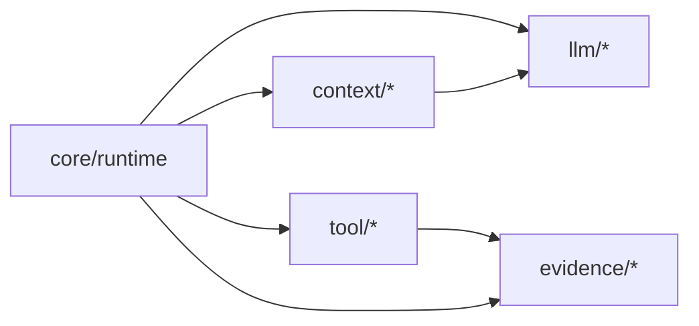
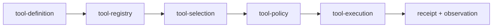

# Runtime、Tool、Context 与 LLM 家族设计

## 1. 父模块位置



Runtime 只编排端口。Tool、Context、LLM 分别拥有执行、输入构造和模型协议，不得反向调用 Agent Loop。

## 2. Runtime 内部模块

| 模块 | 责任 | 可依赖 |
|---|---|---|
| `agent-loop` | Turn/Step 推进、停止判断 | ports、状态机、contracts |
| `run-state` | Run aggregate 与合法转换 | foundation/evidence types |
| `scheduler` | step/child 调度与公平性 | clock、budget、ports |
| `cancellation` | token tree、deadline、settle | foundation |
| `recovery` | checkpoint/replay/reconcile 协调 | session/evidence ports |
| `runtime-api` | 稳定入口和事件 | 不暴露上述内部类 |

Runtime 最后升包；当前先拆目录、端口和依赖门禁，避免一次重写十万行行为。

## 3. Tool 家族



子包建议：`tool-contracts`、`tool-registry`、`tool-policy`、`tool-executor`、`tool-result`、`tool-test-support`。具体 FS/Shell/MCP 工具在各自 family，通过 `ToolProvider` 注册。

## 4. Context 家族

| 子包 | 责任 |
|---|---|
| `context-model` | segment、priority、provenance、visibility |
| `context-build` | 合并 system/session/memory/tool/user 输入 |
| `context-budget` | token/byte/segment 预算分配 |
| `context-compact` | 可重建摘要与保留锚点 |
| `context-policy` | prompt injection 边界、secret/redaction |
| `context-debug` | 可解释 manifest，不记录 secret 原文 |

Context 输出 immutable manifest；Runtime 只把 manifest 交给 LLM，不能在 provider 内悄悄追加隐藏历史。

## 5. LLM 家族

| 子包 | 责任 | 不拥有 |
|---|---|---|
| `llm-contracts` | message/content/tool call/usage | Agent 状态机 |
| `llm-router` | capability/成本/策略匹配 | 用户权限 |
| `llm-provider-*` | 厂商协议、流式适配 | 业务重试决定 |
| `llm-stream` | delta 归一化、完成语义 | UI 专属状态 |
| `llm-retry` | 仅可安全重试的传输错误 | 工具副作用重试 |
| `llm-fixtures` | deterministic fake/recorded responses | 线上 secret |

## 6. 接缝与参数

```ts
type RuntimePorts = {
  context: ContextBuilder;
  model: ModelGateway;
  tools: ToolGateway;
  evidence: EvidencePort;
  checkpoint: CheckpointPort;
};
```

| 参数 | owner | 推荐 |
|---|---|---|
| max steps/no-progress | Runtime policy | profile 设置，终态有明确 reason |
| context token budget | Context | 来自模型 capability，保留安全余量 |
| model retry | LLM | 仅幂等请求，指数退避有 deadline |
| tool parallelism | Tool/Runtime | 按资源与副作用类别限制 |
| stream buffering | LLM | bounded，慢 consumer 有背压/截断策略 |

## 7. 验收

Fake ports 可驱动完整 loop；更换模型 provider 不修改 Runtime；具体工具不进入 core import graph；每次模型调用有 context manifest/usage；cancel 能贯穿模型流和工具执行并最终 settle。

