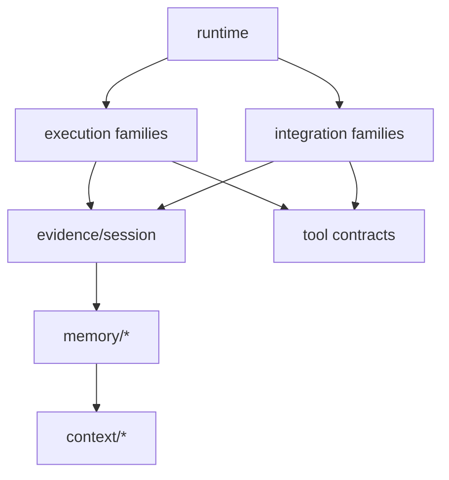
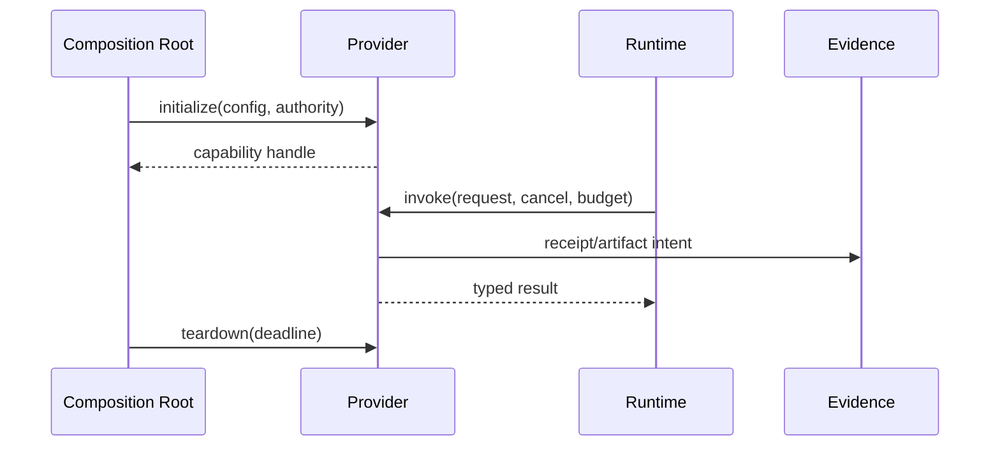

# Memory、Execution 与 Integration 家族设计

## 1. 家族位置



Memory 提供长期知识；Execution 控制本机副作用；Integration 连接外部协议。三者通过窄端口进入 Runtime，不能把自身协议对象泄漏到 Agent Loop。

## 2. Memory 子包

| 子包 | 责任 | 主要依赖 |
|---|---|---|
| `memory-model` | lifecycle、scope、claim、evidence refs | foundation |
| `memory-candidate` | Episode → candidate 提取 | session/evidence ports |
| `memory-admission` | policy、人审、冲突检测 | model + policy ports |
| `memory-store` | versioned record/query | evidence/storage ports |
| `memory-retrieval` | recall/rank/filter | index ports |
| `memory-context` | 有界 context segments | context contracts |
| `experience` | case、适用条件、结果/反例 | memory/evidence |
| `legacy` | capsule manifest、export/import | bundle/redaction |

详细生命周期由 `04-memory-and-experience` 定义；本页只规定物理依赖。

## 3. Execution families

```text
fs/          definition | local | sandbox | tool-fs | search
subprocess/  contracts | local | limits
shell/       definition | local | sandbox | tool-shell
terminal/    contracts | pty-local | session | tool-terminal
sandbox/     policy | local-provider | capability-probe
```

每个 family 采用 Definition → Provider → Tool Adapter 三层。Definition 无平台 I/O；Provider 拥有资源生命周期；Tool Adapter 负责 schema/Observation，不重写 provider。

## 4. Integration families

| family | 子模块 | 关键边界 |
|---|---|---|
| `lsp` | navigation contract、stdio Provider、per-workspace server lifecycle、只读 `tool-lsp` adapter | 仅连接部署方配置的语言服务器；server 生命周期不归 ToolCall 临时拥有 |
| `mcp` | client、discovery、resource/prompt、tool bridge | MCP 不等于 approval/policy |
| `skill` | manifest、loader、filesystem provider、runner | 指令内容是非可信输入 |
| `hooks` | protocol、dispatcher、adapters | hook 失败策略显式 |
| `extensions` | manifest、host、isolation、compat | 第三方扩展不能获得隐式全权限 |

CodeGraph 是当前仓库已有的静态代码图实现，但不属于 Outlive Agent V2 的内建 Integration family，也没有目标 package 或迁移任务。若未来要重新纳入，须单独论证用户价值与维护成本并通过 Note。

## 5. 资源生命周期



Terminal、LSP、MCP connection 等长寿命资源由 Host/Provider owner 管理，不由单次 ToolCall 创建后遗忘。

## 6. 参数与门禁

| 参数 | 推荐 |
|---|---|
| local process env | allowlist + explicit inherited keys |
| output capture | bounded + artifact spill |
| extension permissions | manifest 声明 + profile policy + 用户授权交集 |
| MCP/LSP reconnect | bounded backoff，状态对用户可见 |
| memory index | 可重建，不保存唯一内容 |

架构门禁：execution/integration 不得 import client；provider 不得 import Runtime internals；memory 不得直接执行工具；Tool Adapter 不得自行批准权限。

## 7. 验收

可用 fake provider 做 conformance；资源 teardown 经故障注入验证；未知外部状态进入 reconcile；禁用某 capability 后 profile 校验给出可操作错误；删除索引仍能从记忆真源重建。
