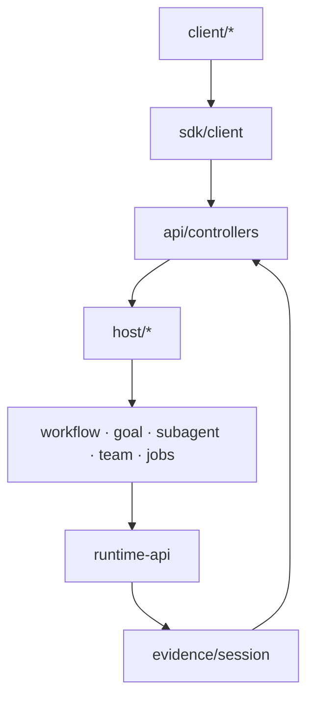
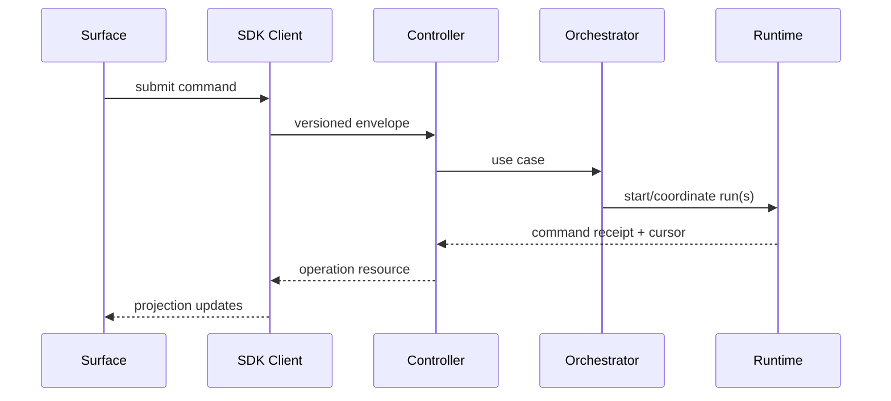

# Orchestration、Control 与 Client 家族设计

## 1. 位置



Orchestration 决定多个 Run/任务如何协作；Control 把外部意图翻译为领域命令；Client 只维护可丢弃投影和交互状态。

## 2. Orchestration families

| family | 子包 | Owner |
|---|---|---|
| `workflow` | definition、planner、runner、tool adapter | workflow instance 状态 |
| `goal` | goal model、progress evaluator、tool | 用户目标与终止条件 |
| `todo` | item model、projection、tool | 任务视图，不替代 workflow 真源 |
| `subagent` | request、provider、child runtime、tool | 父子 ownership/cancel lineage |
| `team` | membership、mailbox、claim、projection | 协作消息与工作项租约 |
| `jobs` | schedule、queue、worker、tool | 异步 operation 生命周期 |

同一抽象不得同时由 todo、workflow、team 各自建立真源。Todo 是用户视图，Workflow 是可执行图，Team 是多 owner 协调。

## 3. Control/Host/Boot

| 包 | 责任 |
|---|---|
| `api/controllers` | command/query controller、DTO mapping、error mapping |
| `sdk/protocol` | transport-neutral schemas/events |
| `sdk/client` | reconnect、pagination、command result tracking |
| `sdk/server` | dispatch、auth context、stream bridge |
| `host/runtime-host` | 资源 owner、Run registry、shutdown/recovery |
| `host/workspace` | workspace identity、root、capability boundary |
| `boot/composition` | profile resolve、dependency graph、lifecycle |

Host 可承载 Runtime，但不把 Host 单例传进所有 package。Controller 调用 use-case port，不直接访问数据库。

## 4. Client family

```text
client/
├── model/          view models and stable UI-facing types
├── store/          normalized projections, cursor, optimistic state
├── commands/       command builders and result reconciliation
├── stream/         snapshot + event subscription + reconnect
├── components/     shareable presentation primitives
└── test-support/   fake server, recorded event streams
```

Web 与 Desktop renderer 可共用 client family；CLI 可复用 protocol/client，但不必依赖 React store。

## 5. 关键流程



## 6. 参数与边界

| 参数 | 推荐 |
|---|---|
| orchestration fan-out | profile/budget 限制；默认小并发 |
| mailbox delivery | durable at-least-once + message dedupe |
| client optimistic update | 仅可本地逆转字段；最终由 command result reconcile |
| host shutdown | stop admission → cancel/drain → checkpoint → teardown |
| controller timeout | 不等于 operation timeout；长任务返回 operation id |

## 7. 验收

CLI/Web/Desktop 触发同一 command 得到同一领域结果；断连后按 cursor 恢复；同一 work item 不能并发 claim；父取消按策略传播且 child terminal 可审计；Client store 删除后可从 snapshot/event 重建。

