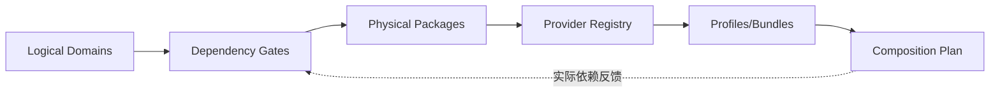
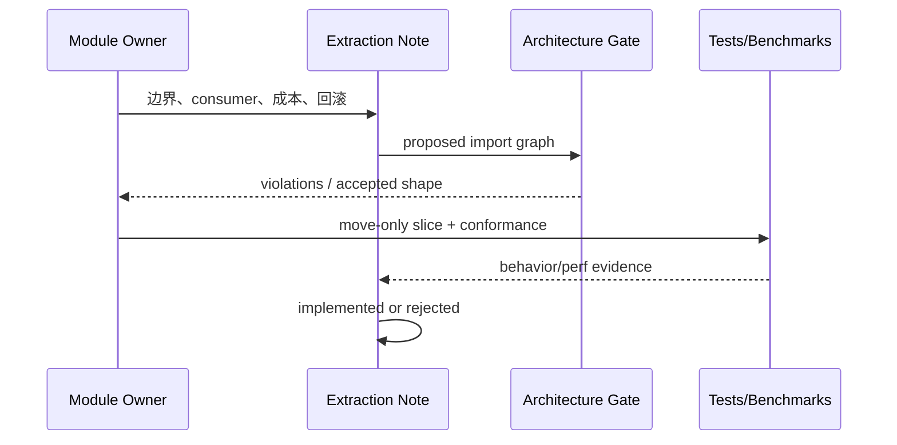

# Profiles、依赖门禁与升包决策

## 1. 关系图



逻辑边界先于物理包。Profile 只能装配通过依赖门禁的公开端口，不能把本应禁止的 import 变成运行时 service locator。

## 2. 允许依赖层级

```text
surfaces/client → sdk/api/control → orchestration/runtime
orchestration/runtime → context/llm/tool/capability ports
memory/context/capabilities → session/evidence → foundation
providers → their definition packages + platform libraries
boot/profile → all public composition ports（仅组合根例外）
```

禁止：Evidence → Runtime；Definition → Provider；Runtime → concrete provider；任何 domain → app/client；Projection → Ledger write API；Memory → tool executor。

## 3. 升包评分卡

当前硬门槛来自根 [`AGENTS.md`](../../../AGENTS.md)：边界稳定，且有至少两个真实 consumer 或硬隔离理由，并有 contract tests。下表只用于**提案排序**，不能因为得分达到阈值就越过硬门槛；变更准则须由[proposed Note](../../../.agents/notes/proposed/2026-09-23-outlive-agent-v2.md)裁决后同步所有 owner 文档。

| 信号 | 分值 |
|---|---:|
| 两个以上独立 consumer | 1 |
| 两个以上 provider | 1 |
| 独立持久格式/兼容责任 | 2 |
| 安全或进程边界 | 2 |
| 独立生命周期/teardown | 1 |
| 能形成少于约 12 个公开导出的窄 API | 1 |
| 独立测试/benchmark/发布需求 | 1 |
| 留在原包产生依赖环 | 2 |

推荐：总分 2 可发起讨论；安全、协议或依赖环可不等评分直接发起讨论，但仍须解释硬隔离理由并通过当前升包门槛。评分不是自动生成 package 的算法。

## 4. 升包流程



迁移分三步：先公开端口并在原包内适配；再 move-only 抽包；最后删除兼容 shim。不得在同一 PR 同时大改行为和跨数十文件抽包。

## 5. 门禁实现

目标文件名沿用 [roadmap.yaml](../roadmap.yaml) 的 `architecture-policy.yaml`，在 `ARCH-010` 前经 Note 确认；不另建 `architecture-rules.yaml` 形成双真源。它描述 roots、allowed/forbidden edges、exception owner 和 expiry。检查器解析 workspace/package imports 与相对路径；动态注册仍需 manifest 校验。每个例外必须有 Note、owner 和过期条件。

## 6. Profile 与 Bundle

Profile 是已命名配置；Bundle 是可复用 capability 集；Provider 是实现。示例：`developer-local` profile 组合 `coding-base` bundle、`local-execution` providers 和 `memory-local` provider。一个 bundle 不得携带 secret 或隐式放宽 policy。

## 7. 参数与验收

| 参数 | 推荐 |
|---|---|
| public exports | 显式 `exports`，禁止 deep import |
| package cycles | 零容忍 |
| exception expiry | 按里程碑或日期，CI 提醒/失败 |
| extraction PR | move-only 与 behavior change 分离 |
| profile validation | 启动前失败，输出缺失/冲突路径 |

验收：依赖图可生成；禁止边在 CI 失败；任何 package 可通过公开 API 测试；移除 provider 时 profile 给出确定错误；抽包前后通过当期**已存在**的 focused/纵向测试与性能报警；P7 `SNAP-070` 完成后，再把通用 recorded-session diff 纳入抽包门禁。
