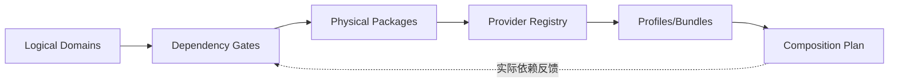
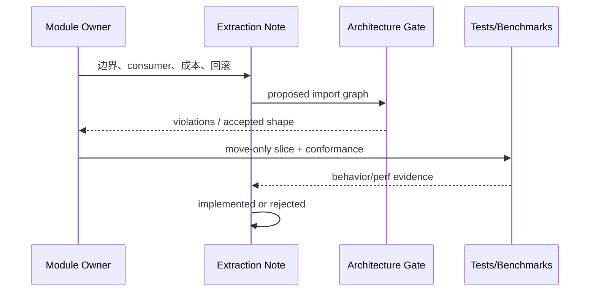

# Profiles、依赖门禁与升包决策

## 1. 关系图


```mermaid
flowchart LR
  D[Logical Domains] --> G[Dependency Gates]
  G --> P[Physical Packages]
  P --> R[Provider Registry]
  R --> PR[Profiles/Bundles]
  PR --> C[Composition Plan]
  C -.实际依赖反馈.-> G
```

逻辑边界先于物理包。Profile 只能装配通过依赖门禁的公开端口，不能把本应禁止的 import 变成运行时 service locator。

## 2. 允许依赖层级

```text
surfaces/client → sdk/api/control → orchestration/runtime
orchestration/runtime → context/llm/tool/capability ports
memory/context/capabilities → session/evidence → foundation
providers → their definition packages + platform libraries
boot/profile → all public composition ports（仅组合根例外）
```

禁止：Evidence → Runtime；Definition → Provider；Runtime → concrete provider；任何 domain → app/client；Projection → Ledger write API；Memory → tool executor。

## 3. 升包评分卡

**DEC-01 已接受**：物理升包硬门槛继续采用根 [`AGENTS.md`](../../../AGENTS.md) 的规则——边界稳定，且有至少两个真实 Consumer 或明确的硬隔离理由，并有契约测试。对照 DSH 的 package policy 与包设计指南，Outlive 保留这条适合本仓库的门槛；“至少两个 Consumer”是 Outlive 自己的明确规则，不声称是 DSH 的通用门槛。下表只用于**提案排序**，不能因为得分达到阈值就越过硬门槛。`ARCH-010` 已把当前 workspace package inventory、依赖方向和公开导出约束接入机器门禁；是否满足边界稳定、consumer/隔离理由和契约测试，仍须在升包评审中提供证据。本设计文档整体仍为 `proposed`。

| 信号 | 分值 |
|---|---:|
| 两个以上独立 consumer | 1 |
| 两个以上 provider | 1 |
| 独立持久格式/兼容责任 | 2 |
| 安全或进程边界 | 2 |
| 独立生命周期/teardown | 1 |
| 能形成少于约 12 个公开导出的窄 API | 1 |
| 独立测试/benchmark/发布需求 | 1 |
| 留在原包产生依赖环 | 2 |

推荐：总分 2 可发起讨论；安全、协议或依赖环可不等评分直接发起讨论，但仍须解释硬隔离理由并通过当前升包门槛。评分不是自动生成 package 的算法。

## 4. 升包流程


```mermaid
sequenceDiagram
  participant O as Module Owner
  participant N as Extraction Note
  participant G as Architecture Gate
  participant T as Tests/Benchmarks
  O->>N: 边界、consumer、成本、回滚
  N->>G: proposed import graph
  G-->>O: violations / accepted shape
  O->>T: move-only slice + conformance
  T-->>N: behavior/perf evidence
  N->>N: implemented or rejected
```

迁移分三步：先公开端口并在原包内适配；再 move-only 抽包；最后删除兼容 shim。不得在同一 PR 同时大改行为和跨数十文件抽包。

## 5. 门禁实现

**DEC-01 已接受 `architecture-policy.yaml` 作为唯一机器可读策略源**，与 [roadmap.yaml](../roadmap.yaml) 的任务输出保持一致；不另建 `architecture-rules.yaml` 形成双真源。`scripts/verify-boundaries.mjs` 实际读取该文件，核对 workspace 包清单、manifest 与源码依赖、公开 `exports`、跨包相对路径和依赖环。`managed` 包的违规阻断检查；`legacy` 包的违规以 warning 报告且必须登记 `migration_owner`。策略或清单错误仍阻断。例外必须提供唯一 ID、owner、Note 路径和有效期。根 CI 的 `typecheck` job 运行 `pnpm verify:boundaries`，工程测试验证 managed/legacy 失败语义。当前策略覆盖仓库现有 14 个 workspace packages；动态注册和更细粒度的逻辑模块治理不在此检查器范围内。升包仍须按 DEC-01 提供边界稳定、消费者/隔离理由和契约测试证据。策略文件与检查器已由 `ARCH-010/013` 交付；本设计文档其余目标仍为 `proposed`。

## 6. Profile 与 Bundle

Profile 是已命名配置；Bundle 是可复用 capability 集；Provider 是实现。示例：`developer-local` profile 组合 `coding-base` bundle、`local-execution` providers 和 `memory-local` provider。一个 bundle 不得携带 secret 或隐式放宽 policy。

## 7. 参数与验收

| 参数 | 推荐 |
|---|---|
| public exports | 显式 `exports`，禁止 deep import |
| package cycles | 零容忍 |
| exception expiry | 按里程碑或日期，CI 提醒/失败 |
| extraction PR | move-only 与 behavior change 分离 |
| profile validation | 启动前失败，输出缺失/冲突路径 |

验收：依赖图可生成；禁止边在 CI 失败；任何 package 可通过公开 API 测试；移除 provider 时 profile 给出确定错误；抽包前后通过当期**已存在**的 focused/纵向测试与性能报警；P7 `SNAP-070` 完成后，再把通用 recorded-session diff 纳入抽包门禁。
