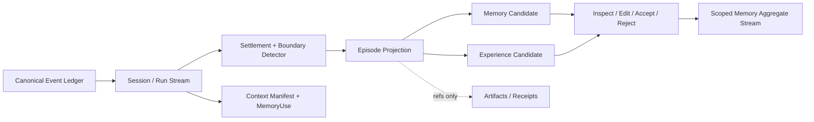
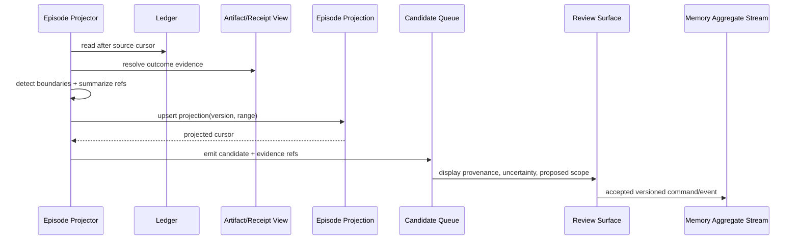

# Evidence 到 Episode 的经历派生管线

## 1. 位置



Episode 是从已提交历史得到的**可重建经历派生物**，用来给学习和评审建立边界。它不等于 Session/Run 页面查询读模型，也不等于供 LLM 使用的模型消息历史或跨 Session Memory 状态投影。它不修改原始 Session，也不能凭摘要新增事实。Episode 默认属于其源 Session/Run 的证据范围；跨 Session 经验通过显式 EvidenceRef 连接多个 Episode，不把来源执行流改造成长期 Memory 的所有者。候选必须到可查看/修改/接受/拒绝的控制面后，才可进入独立的 Memory aggregate stream。

## 2. Episode 数据模型

```ts
type Episode = {
  episodeId: EpisodeId;
  sessionId: SessionId;
  runId?: RunId;
  branchId: BranchId;
  sourceRange: { from: Cursor; to: Cursor };
  goalRefs: GoalId[];
  evidenceRefs: EvidenceRef[];
  outcome: "succeeded" | "failed" | "partial" | "abandoned" | "unknown";
  summary: DerivedText;
  boundaryReason: string[];
  projectorVersion: string;
};
```

`summary` 带模型/算法版本和 source refs；删除它可以重建。`outcome` 来自 Receipt、测试、用户裁决或明确终态，不能从乐观措辞猜测。Context manifest 和 MemoryUse 也是执行流中的事实：Manifest 说明 Runtime 交给 Provider Adapter 的确切上下文版本，MemoryUse 说明请求进入了哪个提交/响应状态，不证明远端接受，也不证明记忆改变了模型答案。

## 3. 边界信号

| 信号 | 强度 | 例子 |
|---|---:|---|
| 明确 Goal/Run terminal | 强 | task completed/failed/cancelled |
| 用户切换目标或创建分支 | 强 | “接下来处理另一个问题” |
| 验证结果与提交点 | 中 | 测试通过、PR/patch artifact |
| 长时间空档或上下文压缩 | 弱 | 仅作候选，不能单独决定语义边界 |
| 模型话题分类 | 弱 | 必须保留 confidence 和解释 |

边界可重叠引用，但一个事件在同一 Episode scheme/version 下只归属一个主 Episode；跨 Episode 的公共证据通过 ref 复用。

## 4. Episode 生成与重建流程



投影失败只推进到最后完整 Episode；恢复时从 source cursor 重跑。旧 projector 结果可保留用于对比，但 active view 只指向一个版本。

## 5. 关键参数

| 参数 | 推荐起点 | 风险 |
|---|---|---|
| `max_episode_events` | 由 benchmark 决定硬上限，超限按安全锚点切分 | 无界上下文/摘要成本 |
| `idle_gap` | 仅弱信号，不单独闭合 | 把长思考误判成新任务 |
| `boundary_confidence` | strong 自动；weak 需后续信号确认 | 过早切分 |
| `summary_budget` | 独立于 Runtime context budget | 摘要吞掉关键证据 |
| `projector_version` | 每次语义改变必须升级 | 结果不可解释 |

## 6. 不变量与隐私

- Episode 只能引用当前 actor 可见的 Evidence；
- secret/redacted segment 不进入派生文本；
- Session 分支改变不会重写已发布的 Episode，只创建新投影版本；
- 用户可调整边界，调整本身成为带 actor 的治理事件；用户对候选的接受/拒绝/编辑也必须记录为治理事实；
- 删除源内容后 Episode 必须变为 degraded/revoked 或重建，不能保留泄漏摘要。

## 7. 验收与待决策

用固定 Session fixture 验证边界稳定、失败恢复、版本重建、Context 可回放和人工调整；Outcome 必须能点回业务证据。另测候选拒绝后不得进入 active index、重放不重复创建候选、删除源 Artifact 后派生摘要不泄漏。待定：是否允许单个 Episode 跨 Session、弱信号阈值、用户 UI 采用时间线还是任务卡片。
