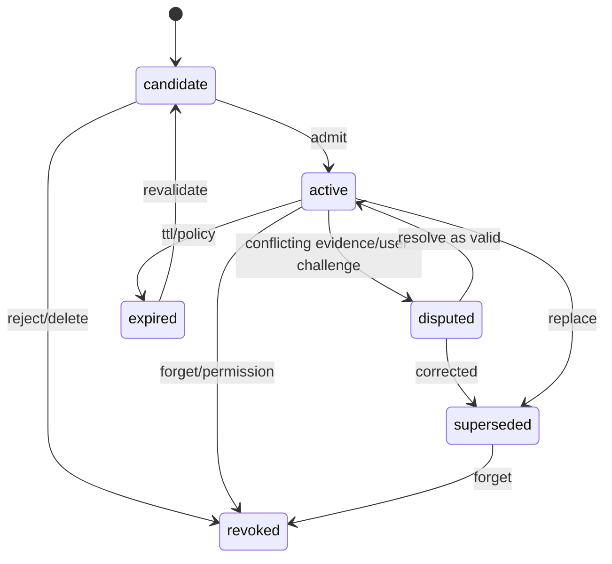
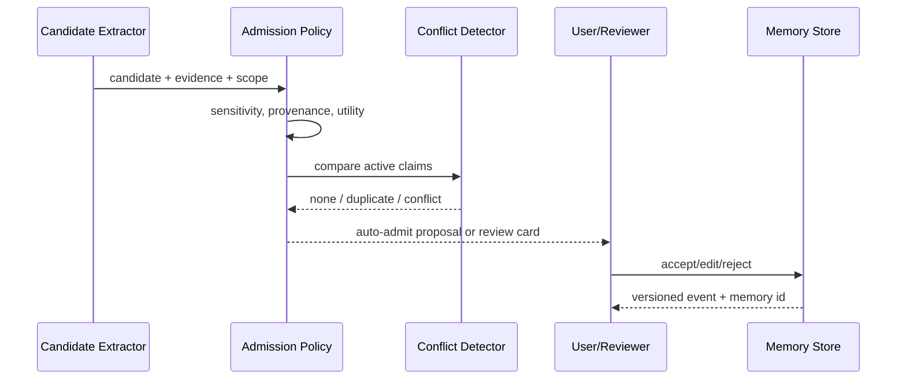

# Memory 生命周期设计

## 1. 位置与状态机



Memory 是带 scope、证据和生命周期的主张，不是聊天片段。只有 `active` 且当前请求通过 scope/policy 的记录可以默认参加检索。

## 2. MemoryRecord

```ts
type MemoryRecord = {
  memoryId: MemoryId;
  version: number;
  kind: "fact" | "preference" | "decision" | "constraint" | "relationship";
  claim: StructuredClaim;
  scope: MemoryScope;
  evidenceRefs: EvidenceRef[];
  confidence: number;
  status: MemoryStatus;
  sensitivity: Sensitivity;
  validFrom?: string;
  validUntil?: string;
  supersedes?: MemoryId;
  createdBy: ActorRef;
  policyVersion: string;
};
```

`confidence` 不是 truth；它只表达提取/支持强度。用户明确陈述的偏好可以高置信，但仍可能过期；外部事实即使模型确信，也需 Evidence。

## 3. 准入管线



低风险、重复出现、证据充分且 scope 狭窄的候选可配置自动准入；身份、凭据、私人信息、跨项目规则和冲突项必须人工确认。

## 4. 冲突与修订

| 情况 | 行为 |
|---|---|
| 完全重复 | 合并支持 evidence，不新建并列 active claim |
| 时间更新 | 新版本 supersede 旧版本，保留 valid interval |
| scope 不同 | 可并存，但检索必须先 filter scope |
| 证据矛盾 | 两者进入/保持 disputed，展示冲突，不用分数静默决定 |
| 用户纠正 | 用户决定优先作为治理事件，但事实类仍保留证据差异 |

## 5. 遗忘语义

删除流程：标记删除 intent → 停止检索 → 删除/加密销毁真源内容 → 清除索引/缓存/导出临时件 → 重建受影响投影 → 写不含原文的 deletion receipt。若备份无法立即物理删除，必须公开保留窗口和恢复时 tombstone 重放规则。

## 6. 关键参数

| 参数 | 推荐起点 |
|---|---|
| `auto_admit` | 仅 low sensitivity + narrow scope + strong evidence |
| `default_ttl` | 按 kind；decision/constraint 要求版本或复审点，不用统一永久 |
| `confidence_floor` | 只用于候选排序，不越过 policy |
| `max_active_conflicts` | 不自动淘汰；达到阈值要求人工整理 |
| `forget_mode` | hard delete where possible + tombstone receipt |

## 7. 不变量与验收

无 EvidenceRef 的事实不得 active；旧 approval 不随 Memory 恢复；被 supersede/revoked 内容不默认注入；删除后从备份/投影恢复也不能复活。验收覆盖并发修订、scope 串扰、过期、冲突、删除和导入去重。

## 8. 待评审

- 各 kind 的默认 TTL 与复审提示；
- 团队共享 Memory 的 owner 和纠错仲裁；
- 自动准入是否在首个公开版本完全关闭。

