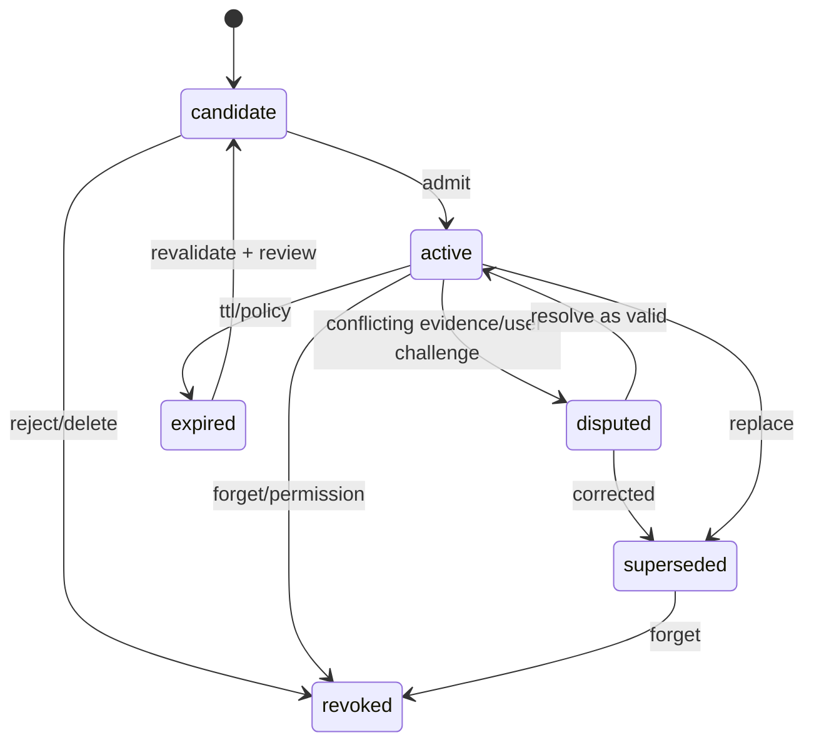

# Memory 生命周期设计

## 1. 位置与状态机



Memory 是带 scope、证据和生命周期的主张，不是聊天片段。只有 `active` 且当前请求通过 scope/policy 的记录可以参加候选检索；检索命中不等于获准注入，更不等于实际使用。每个 Memory ID/version 归属于有 owner 的 Memory aggregate stream，持久化事件进入 Outlive 的规范 Event Ledger；它不依附于恰好产生它的某个 Session stream。

### 1.1 真相事件与投影边界

以下事件名是 V2 设计词汇，不是当前代码中的既有事件名；最终 schema 由 `MEM-040` 定义。原则上，记忆生命周期事件写入 Memory aggregate stream，单次执行中的上下文与调用状态写入对应 Run stream：

| 事件族（提案） | 真相域 | 用途 |
|---|---|---|
| `memory.candidate.proposed` | Memory stream | 持久化待审候选 ID、scope、来源 refs、加密正文引用和提取器版本 |
| `memory.candidate.reviewed` | Memory stream | 记录用户接受/编辑/拒绝及 actor、理由和审阅时的版本 |
| `memory.version.admitted` / `memory.version.superseded` | Memory stream | 建立可版本化的 active claim 与修订 lineage |
| `memory.conflict.opened` / `memory.conflict.resolved` | Memory stream | 显式保存冲突状态及解决依据，不做 last-write-wins |
| `memory.version.revoked` / `memory.content.deleted` | Memory stream | 撤销检索资格；必要时删除正文/密钥并留下无原文 tombstone |
| `context.manifest.created` / `memory.use.dispatch_intent` | Run stream | 固定 Runtime 请求中的 memory ID/version、rendered digest、token estimate，并先记录调用意图 |
| `memory.use.adapter_invoked` / `memory.use.response_received` / `memory.use.outcome_unknown` | Run stream | 记录 Adapter 调用与可观察响应状态，不推断远端内部消费或回答因果 |

Memory 当前态、review queue、冲突集和检索索引是 Memory 生命周期事件的 **Memory 状态投影**；MemoryUse 等使用统计则从 Run stream 事件派生，属于另一种读模型。客户端只能发领域命令，不能直接改状态投影/索引。跨流关系用稳定 ID/refs 连接，不复制敏感正文。

## 2. MemoryRecord

```ts
type MemoryRecord = {
  memoryId: MemoryId;
  version: number;
  kind: "fact" | "preference" | "decision" | "constraint" | "relationship";
  claim: StructuredClaim;
  scope: MemoryScope;
  origin: "user" | "repository" | "tool" | "external" | "system" | "model_inference";
  evidenceRefs: EvidenceRef[];
  sourceTrust: "authoritative" | "trusted" | "untrusted" | "unknown";
  inferenceConfidence?: number;
  verification: "verified" | "corroborated" | "asserted" | "inferred";
  status: MemoryStatus;
  sensitivity: Sensitivity;
  contentArtifactRef?: ArtifactRef;
  contentDigest?: string;
  validFrom?: string;
  validUntil?: string;
  supersedes?: MemoryId;
  createdBy: ActorRef;
  policyVersion: string;
};
```

`sourceTrust` 和 `inferenceConfidence` 必须分开。后者不是 truth，也不能提高前者；用户明确陈述的偏好可以来源可信但仍可能过期，外部事实即使模型确信也需要 Evidence。

正文与事件元数据采取可删除性边界：事件保存稳定 ID/version、scope、来源引用、状态转换、内容 digest 或加密 Artifact 引用；避免在不可变事件中重复写敏感正文。若撤销/删除要求擦除内容，删除 Artifact 或密钥并清理索引/缓存，追加不含原文的 tombstone/deletion receipt。具体加密与备份恢复规则需要 ADR，不能假称 append-only 事件本身就实现了物理删除。

## 3. 准入管线

```mermaid
sequenceDiagram
  participant X as Candidate Extractor
  participant P as Admission Policy
  participant C as Conflict Detector
  participant U as Inspect / Review Surface
  participant S as Memory Aggregate Stream
  participant Pj as Memory State Projection / Search Index
  X->>P: candidate + evidence + scope
  P->>P: sensitivity, provenance, utility
  P->>C: compare active claims
  C-->>P: none / duplicate / conflict
  P-->>U: visible review item + uncertainty + diff
  U->>S: accept/edit/reject command
  S-->>Pj: append event; update projection
  Pj-->>U: versioned result + memory id
```

V2 首阶段采用显式准入：抽取结果进入可检查队列，不能静默变成 active。未来若开放低风险自动准入，必须限定 narrow scope、strong evidence、低 sensitivity，并先具备可检查历史、撤销/纠正、MemoryUse 审计和反例门禁；身份、凭据、私人信息、跨项目规则和冲突项始终要求显式确认。

## 4. 冲突与修订

| 情况 | 行为 |
|---|---|
| 完全重复 | 合并支持 evidence，不新建并列 active claim |
| 时间更新 | 新版本 supersede 旧版本，保留 valid interval |
| scope 不同 | 可并存，但检索必须先 filter scope |
| 证据矛盾 | 两者进入/保持 disputed，展示冲突，不用分数静默决定 |
| 用户纠正 | 用户决定优先作为治理事件，但事实类仍保留证据差异；创建新版本而不是覆写历史 |

## 5. 遗忘语义

删除流程：记录授权的删除命令 → 立即停止检索/注入 → 删除或加密销毁真源内容 → 清除检索索引/缓存/本地导出临时件 → 重建受影响的 Memory 状态视图与检索索引 → 写不含原文的 deletion receipt。Run 中既有 MemoryUse 仅可保留必要的 ID/digest 与“内容已删除”状态；不得保留明文副本。若备份无法立即物理删除，必须公开保留窗口，并在恢复时先重放 tombstone 再开放检索。

## 6. 关键参数

| 参数 | 推荐起点 |
|---|---|
| `auto_admit` | 仅 low sensitivity + narrow scope + strong evidence |
| `default_ttl` | 按 kind；decision/constraint 要求版本或复审点，不用统一永久 |
| `confidence_floor` | 只用于候选排序，不越过 policy |
| `max_active_conflicts` | 不自动淘汰；达到阈值要求人工整理 |
| `forget_mode` | hard delete where possible + tombstone receipt |

## 7. 不变量与验收

模型推断无 EvidenceRef 不得 active；source trust 与推断置信不可混为一值；旧 approval/credential 不随 Memory 恢复；被 supersede/revoked 内容不默认注入；仅搜索命中不得记作使用；删除后从备份/投影恢复也不能复活。验收覆盖并发修订、scope 串扰、过期、冲突、删除、拒绝候选和导入去重。

## 8. V2 待评审与明确延期

- Memory aggregate stream 的 ID/partition 与跨进程 writer/concurrency 语义；
- G-21 JSONL → Ledger aggregate 的无损迁移、暂停写入/切换/回滚及旧版本读取；
- 加密正文/Artifact、密钥、备份和历史 Run `MemoryUse` 摘要的删除边界；
- 各 kind 的默认 TTL 与复审提示；
- 既有 G-21 每轮自动 recall 的兼容开关、默认状态和可见性就绪标准；
- 自动准入是否在首个公开版本完全关闭。

多人团队共享 Memory 明确不进入 V2。团队级 Memory owner、成员权限、共享/撤销和纠错仲裁留待后续版本评审；V2 先落实单用户 owner 与 scope 边界。
