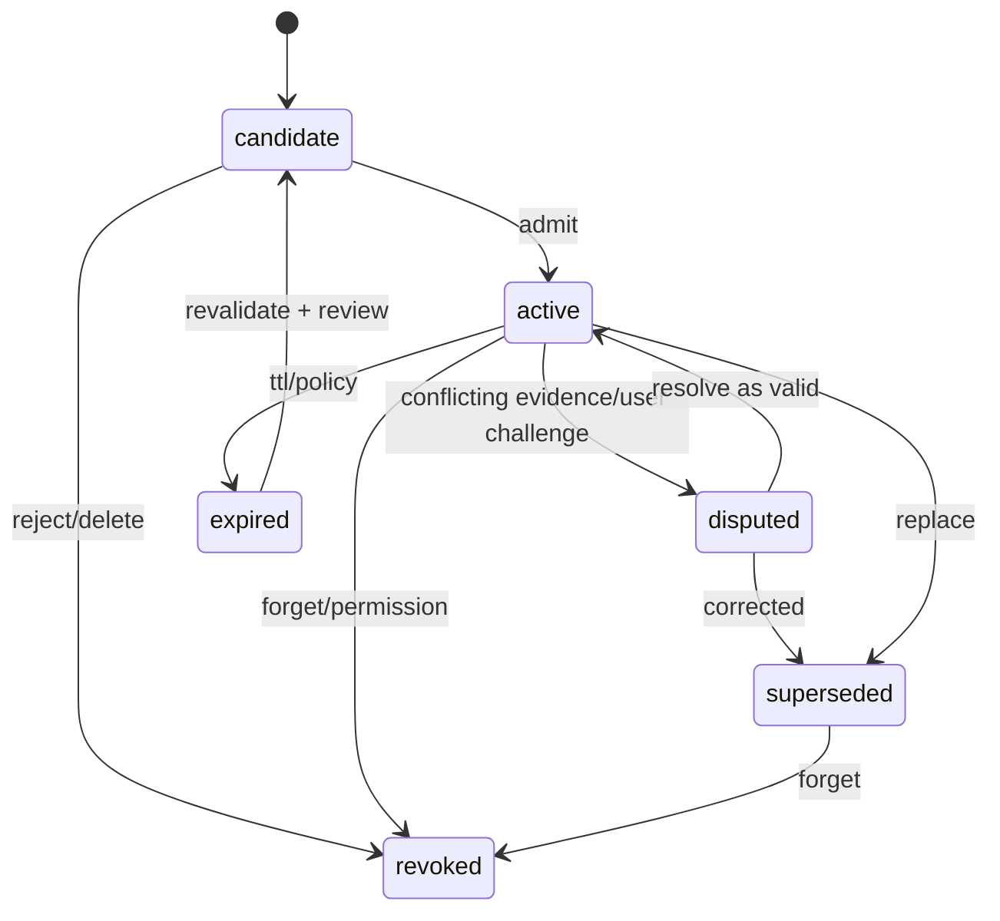

# Memory 生命周期设计

## 1. 位置与状态机


```mermaid
stateDiagram-v2
  [*] --> candidate
  candidate --> active: admit
  candidate --> revoked: reject/delete
  active --> disputed: conflicting evidence/user challenge
  disputed --> active: resolve as valid
  disputed --> superseded: corrected
  active --> superseded: replace
  active --> expired: ttl/policy
  active --> revoked: forget/permission
  superseded --> revoked: forget
  expired --> candidate: revalidate + review
```

Memory 是带 scope、证据和生命周期的主张，不是聊天片段。只有 `active` 且当前请求通过 scope/policy 的记录可以参加候选检索；检索命中不等于获准注入，更不等于实际使用。每个 Memory ID/version 归属于有 owner 的 Memory aggregate stream，持久化事件进入 Outlive 的规范 Event Ledger；它不依附于恰好产生它的某个 Session stream。

### 1.1 真相事件与投影边界

以下事件名有的是完整 V2 目标词汇，有的是当前真实实现；MEM-041 已实现 `memory.lifecycle.transitioned`；MEM-042 已实现 Run-scoped MemoryUse 状态；MEM-045 已实现独立的 `memory.feedback` owner+memory+version stream；MEM-046 已实现 `memory.control.commanded` 创建/纠正/删除事实，以及统一 inspect/review/correct/revoke/delete 控制服务。后台候选提取、显式 conflict lifecycle event 与密钥/备份删除治理仍属后续任务。原则上，记忆生命周期事件写入 Memory aggregate stream，单次执行中的上下文与调用状态写入对应 Run stream：

| 事件族（提案） | 真相域 | 用途 |
|---|---|---|
| `memory.candidate.proposed` | Memory stream | 持久化待审候选 ID、scope、来源 refs、加密正文引用和提取器版本 |
| `memory.candidate.reviewed` | Memory stream | 记录用户接受/编辑/拒绝及 actor、理由和审阅时的版本 |
| `memory.version.admitted` / `memory.version.superseded` | Memory stream | 建立可版本化的 active claim 与修订 lineage |
| `memory.conflict.opened` / `memory.conflict.resolved` | Memory stream（目标） | 显式保存冲突状态及解决依据，不做 last-write-wins；MEM-045 当前只派生无正文 conflict group，不追加这类状态事件 |
| `memory.version.revoked` / `memory.content.deleted` | Memory stream | 撤销检索资格；必要时删除正文/密钥并留下无原文 tombstone |
| `memory.control.commanded`（MEM-046） | Memory control stream | 当前真实事件：create/correct/delete 写无 claim 正文的控制事实；删除 tombstone 包含被删除的 lineage IDs 与 scope IDs；review/revoke 状态仍由 lifecycle event 表达 |
| `context.manifest.created` / `memory.use.dispatch_intent` | Run stream | 固定 Runtime 请求中的 memory ID/version、rendered digest、token estimate，并先记录调用意图（MEM-042） |
| `memory.use.adapter_invoked` / `memory.use.response_received` / `memory.use.outcome_unknown` | Run stream | 记录 Adapter 调用与可观察响应状态，不推断远端内部消费或回答因果（MEM-042） |
| `memory.feedback` | Memory feedback stream | 按 owner + memory version 记录 response-backed helpful/irrelevant/incorrect/stale 与 review dismissal；不复制 claim 正文（MEM-045） |

MEM-041/046 的已交付 lifecycle/control stream 位于 canonical Evidence Event Ledger 的独立 owner+memory 命名空间中，不混入 Run `SessionEvent` 顺序或 Projection。V2 正文保存在本地 immutable candidate seed store；Core 通过 seed record + lifecycle transition events 重建状态。Host/SDK、CLI、Web 与 Desktop 共用 `MemoryControlService`；CLIENT-068 通过共享 `MemoryExperienceController` 为 Web REST 和 Desktop framed RPC 提供同一授权与命令入口。详细当前行为见[模块 08](../../modules/08-Memory-记忆子系统.md)、[MEM-041 Note](../../../.agents/notes/implemented/2026-09-30-mem-041-memory-lifecycle.md)、[MEM-046 Note](../../../.agents/notes/implemented/2026-09-30-mem-046-memory-control-plane.md)与[CLIENT-068 Note](../../../.agents/notes/implemented/2026-10-02-client-068-memory-experience-control.zh.md)。

Memory 当前态和检索索引是 lifecycle 事件的 **Memory 状态投影**；MEM-045 冲突集从显式 V2 record 快照派生，反馈 review/count 从独立 feedback stream replay；MemoryUse 等请求统计从 Run stream 派生，属于不同读模型。客户端只能发领域命令，不能直接改状态投影/索引。跨流关系用稳定 ID/refs 连接，不复制敏感正文。

## 2. MemoryRecord

```ts
type MemoryRecord = {
  memoryId: MemoryId;
  version: number;
  kind: "fact" | "preference" | "decision" | "constraint" | "relationship";
  claim: StructuredClaim;
  scope: MemoryScope;
  origin: "user" | "repository" | "tool" | "external" | "system" | "model_inference";
  evidenceRefs: EvidenceRef[];
  sourceTrust: "authoritative" | "trusted" | "untrusted" | "unknown";
  inferenceConfidence?: number;
  verification: "verified" | "corroborated" | "asserted" | "inferred";
  status: MemoryStatus;
  sensitivity: Sensitivity;
  contentArtifactRef?: ArtifactRef;
  contentDigest?: string;
  validFrom?: string;
  validUntil?: string;
  supersedes?: MemoryId;
  createdBy: ActorRef;
  policyVersion: string;
};
```

`sourceTrust` 和 `inferenceConfidence` 必须分开。后者不是 truth，也不能提高前者；用户明确陈述的偏好可以来源可信但仍可能过期，外部事实即使模型确信也需要 Evidence。

正文与事件元数据采取可删除性边界：事件保存稳定 ID/version、scope、来源引用、状态转换、内容 digest 或加密 Artifact 引用；避免在不可变事件中重复写敏感正文。若撤销/删除要求擦除内容，删除 Artifact 或密钥并清理索引/缓存，追加不含原文的 tombstone/deletion receipt。具体加密与备份恢复规则需要 ADR，不能假称 append-only 事件本身就实现了物理删除。

## 3. 准入管线

```mermaid
sequenceDiagram
  participant X as Candidate Extractor
  participant P as Admission Policy
  participant C as Conflict Detector
  participant U as Inspect / Review Surface
  participant S as Memory Aggregate Stream
  participant Pj as Memory State Projection / Search Index
  X->>P: candidate + evidence + scope
  P->>P: sensitivity, provenance, utility
  P->>C: compare active claims
  C-->>P: none / duplicate / conflict
  P-->>U: visible review item + uncertainty + diff
  U->>S: accept/edit/reject command
  S-->>Pj: append event; update projection
  Pj-->>U: versioned result + memory id
```

DEC-02 已接受：V2 MVP 的所有抽取结果都进入可检查队列，须经用户显式检查/确认才能成为 active；低风险项也不自动准入。若 V2 之后要重新考虑低风险自动准入，必须单独评审，并先具备 narrow scope、strong evidence、低 sensitivity、可检查历史、撤销/纠正、MemoryUse 审计和反例门禁；身份、凭据、私人信息、跨项目规则和冲突项始终要求显式确认。

## 4. 冲突与修订

MEM-045 当前派生冲突组：只有同 owner、显式 `normalizedKey` 相同（NFKC、trim、大小写与空白规范化）、有效时间重叠、scope 重叠且 claim digest 不同的 active/disputed 记录才冲突。算法不做语义推断，不产生 lifecycle transition，不自动选择权威一方；召回资格门会阻断该组全部参与者。`validUntil <= now` 的记录即时被排除，因此无需等待单独写入 `expire` transition 才失去 V2 召回资格。V1 Recall 逻辑保持不变。

| 情况 | 行为 |
|---|---|
| 完全重复 | 合并支持 evidence，不新建并列 active claim |
| 时间更新 | 新版本 supersede 旧版本，保留 valid interval |
| scope 不同 | 可并存，但检索必须先 filter scope |
| 证据矛盾 | 两者进入/保持 disputed，展示冲突，不用分数静默决定 |
| 用户纠正 | 用户决定优先作为治理事件，但事实类仍保留证据差异；创建新版本而不是覆写历史 |

MEM-045 的 `incorrect` / `stale` feedback 会让对应确切版本待复核并暂时退出 V2 资格门。Feedback 必须绑定 response-backed V2 MemoryUse 的 schema/version/content digest、Run、use ID 和 Manifest；同一用户对同一 use/version 只计一次，相同内容重试幂等。对误报追加 review dismissal 仅关闭该 feedback gate；它不会改写 claim 或等同于纠正。实际纠正仍须通过新版本/lifecycle 命令，由 MEM-046 控制面承接。

## 5. 遗忘语义

**当前 MEM-046 实现范围：**在删除 lineage 的全部 content-free tombstone durable commit 后，重写并 fsync V2 owner 的 `records.jsonl`，清除本地 V2 canonical candidate 正文；读取和重复创建会 fail closed，控制重试返回同一删除家族。该实现不擦除 G-21 V1 store、Run/feedback/lifecycle/control 审计事件、备份/快照、外部 Artifact、SSD/文件系统取证残留，也不提供加密密钥销毁。以下流程仍是完整目标要求，未被当前本地文件删除所替代。

删除流程：记录授权的删除命令 → 立即停止检索/注入 → 删除或加密销毁真源内容 → 清除检索索引/缓存/本地导出临时件 → 重建受影响的 Memory 状态视图与检索索引 → 写不含原文的 deletion receipt。Run 中既有 MemoryUse 仅可保留必要的 ID/digest 与“内容已删除”状态；不得保留明文副本。若备份无法立即物理删除，必须公开保留窗口，并在恢复时先重放 tombstone 再开放检索。

## 6. 关键参数

| 参数 | 推荐起点 |
|---|---|
| `auto_admit` | V2 MVP 固定关闭；所有 Candidate 显式审核后才能 active，不设低风险自动准入例外 |
| `default_ttl` | 按 kind；decision/constraint 要求版本或复审点，不用统一永久 |
| `confidence_floor` | 只用于候选排序，不越过 policy |
| `max_active_conflicts` | 不自动淘汰；达到阈值要求人工整理 |
| `forget_mode` | hard delete where possible + tombstone receipt |

## 7. 不变量与验收

模型推断无 EvidenceRef 不得 active；source trust 与推断置信不可混为一值；旧 approval/credential 不随 Memory 恢复；被 supersede/revoked 内容不默认注入；仅搜索命中不得记作使用；删除后从备份/投影恢复也不能复活。验收覆盖并发修订、scope 串扰、过期、冲突、删除、拒绝候选和导入去重。

## 8. 已接受约束与实现期 ADR

- **DEC-02 已接受**：Candidate 不能静默成为 active；自动 Recall 与自动准入分离。G-21 的旧 Recall 路径须先有可见状态、来源、请求状态和用户控制；V2 MVP 默认关闭自动 Recall，用户显式开启后只召回当前 scope/policy 允许的 active Memory。
- **DEC-03 已接受**：导出只包含用户选择的项目；默认导出来源引用/摘要而非原始证据，原始证据按项 opt-in；第三方内容默认排除，包中不承载 credential/approval/权限。
- **P4 实现期 ADR**：Memory aggregate 的物理分区、并发 writer、加密 Artifact/密钥/备份和删除重建边界，须在实现时确定具体存储与事务机制；这些选择不得改变上面的准入、导出和撤销原则。
- **P4 实现参数**：G-21 相邻迁移与回滚、各 kind 的 TTL/复审提示、索引清理与备份保留窗口，在获得真实数据与恢复测试后定值；不能据此重新打开已经接受的“默认不自动准入”原则。

多人团队共享 Memory 明确不进入 V2。团队级 Memory owner、成员权限、共享/撤销和纠错仲裁留待后续版本评审；V2 先落实单用户 owner 与 scope 边界。
