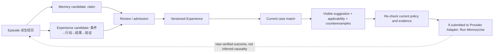
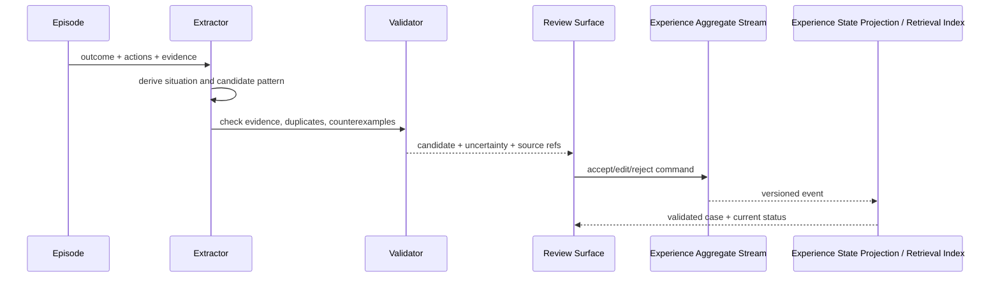

# Experience 学习与复用设计

## 1. Experience 与 Memory 的区别



Memory 回答“知道什么”；Experience 回答“在什么条件下，曾如何做、结果怎样、有什么反例”。Experience 不能直接成为强制 Workflow。抽取只形成候选；Review/准入记录 owner、来源、适用 scope 和不确定性。建议被检索或展示不代表被采用，采用也不代表成功；最终 outcome 需当前任务的 Receipt/Observation/verification 支持。

## 2. ExperienceCase

```ts
type ExperienceCase = {
  caseId: ExperienceCaseId;
  version: number;
  situation: ConditionSet;
  objective: string;
  actions: ActionPattern[];
  outcome: OutcomeRef;
  verification: VerificationRef[];
  counterexamples: Counterexample[];
  applicability: ScopeRule[];
  evidenceRefs: EvidenceRef[];
  status: "candidate" | "validated" | "disputed" | "retired";
};
```

ActionPattern 描述意图、前置条件和验证，不默认保存可直接执行的危险命令。若保存命令模板，变量必须显式、当前权限重新求值。

## 3. 学习管线



成功和失败都能产生候选；失败经验至少记录失败条件、观察到的信号和安全退出方式，不能提炼成“永远不要这样做”的无 scope 规则。

## 4. 复用时序

1. 当前任务先提取结构化 situation，不检索全部历史；
2. hard filter workspace/tech/version/sensitivity；
3. 用 condition match、证据质量、时效和历史复用结果排序；
4. 返回“建议 + 适用条件 + 反例 + 来源”，不直接执行；
5. Runtime 按当前 policy/approval 执行；
6. 若 Runtime 把记忆内容提交给 Provider Adapter，写入 Run-scoped MemoryUse 与请求状态；检索/展示但未提交不算请求包含。
7. 新验证结果作为独立 Observation 更新复用统计或触发 disputed/retired；只能记录“被包含后结果如何”，不能据此声称它导致结果。

## 5. 参数

| 参数 | 推荐 |
|---|---|
| `minimum_verification` | 至少一个业务级 OutcomeRef；纯模型自评不够 |
| `reuse_mode` | suggest-first；危险动作永不 auto-run |
| `case_merge` | 条件与结果兼容才合并，保留各 Episode refs |
| `negative_evidence_weight` | 不低于单次成功的影响，避免幸存者偏差 |
| `version_compatibility` | situation 中显式建模，不靠全文相似度 |

## 6. 质量信号

- precision@k：返回的 case 是否真的适用；
- verified reuse rate：采用后经当前证据验证的比例；
- harmful suggestion rate：导致策略拒绝、回滚或错误方向的比例；
- stale case detection latency：环境变化到 case 被 disputed/retired 的时间；
- explanation completeness：建议是否带条件、反例和来源。

## 7. 验收与后续决策

验收使用成对场景：表面相似但关键版本不同、一次成功但有多次失败、危险命令被建议但需当前审批。团队签名发布不进入 V2，留待后续团队共享设计；何时从 Experience 提升为 Skill、复用统计是否默认本地私有仍需评审。
