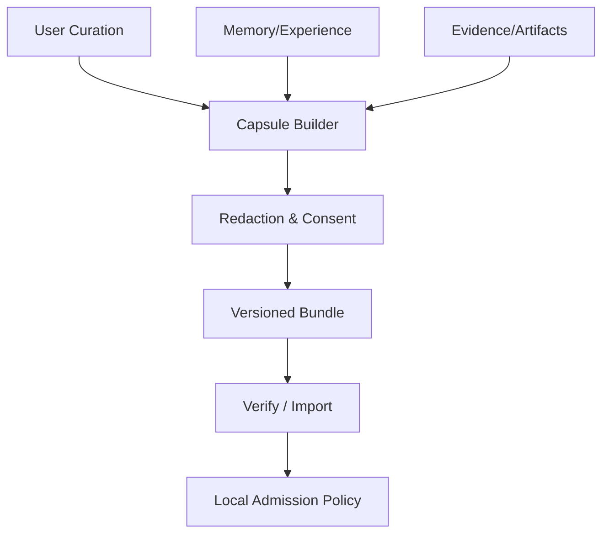
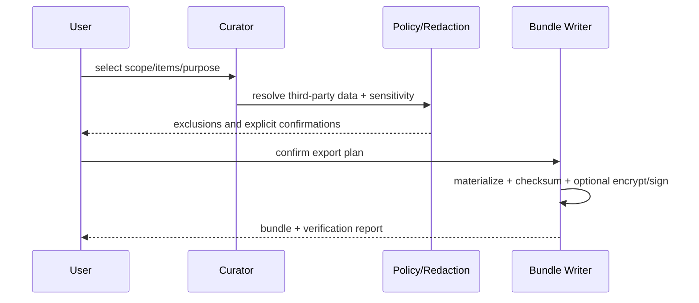

# Legacy Capsule 与长期治理设计

## 1. 产品与架构位置



Legacy Capsule 是用户主动策展的可移植集合，不是后台自动打包全部人生数据，也不是代表某人的可执行人格。

## 2. Capsule 结构

```text
capsule/
├── manifest.json        schema、creator、scope、时间、digests
├── memories.jsonl       版本化 claims 和 evidence refs
├── experiences.jsonl    case、条件、结果、反例
├── evidence/            可选、按引用打包的脱敏证据
├── artifacts/           可选内容寻址对象
├── policies.json        使用/共享/到期声明
├── glossary.json        领域词汇与身份说明
└── checksums.txt        完整性；签名单独可选
```

Manifest 区分内容创建者、导出操作者、被描述主体和授权主体；这四者不能用一个 `user_id` 混淆。

## 3. 导出流程



导入先校验 schema、checksum、签名（若有）和 provenance，再作为 `candidate` 进入本地 admission；外部 Capsule 不因签名而自动可信或获得权限。

## 4. 治理边界

| 风险 | 设计裁决 |
|---|---|
| 人格冒充 | 禁止声称“就是本人”；输出必须标识 Agent 与资料来源 |
| 第三方隐私 | 默认排除；只有明确合法授权和目的才可包含 |
| 权限继承 | Capsule 永不携带可执行 credential/approval |
| 过时结论 | 保存时间、版本、supersession；导入后重新校验 |
| 平台锁定 | 开放 schema、离线校验、内容寻址和迁移工具 |
| “永久”承诺 | 只承诺可导出、可校验、可迁移；不承诺绝对永存 |

## 5. 关键参数

| 参数 | 推荐 |
|---|---|
| `include_evidence` | 默认仅 refs/摘要；原始内容按项 opt-in |
| `encryption` | 含 private 内容时必须；密钥不打包在一起 |
| `signature` | 可选来源证明，不表示内容为真 |
| `third_party_data` | default deny |
| `import_activation` | always candidate |
| `format_support` | schema + migrator + standalone verifier |

## 6. 删除与继承

若 Capsule 已离开本系统，无法承诺远端删除；导出前必须提示这一边界。系统内撤销可生成 revocation manifest，未来导入时提示，但不能伪称能控制所有副本。用户去世/失能后的访问属于独立法律和身份治理议题，V2 仅预留 policy metadata，不实现自动继承。

## 7. 验收与推迟项

验收：离线 verify、篡改检测、选择性导出、secret 扫描、不同版本导入、外部内容保持 candidate、无凭据/approval。V2 推迟：数字人格生成、自动遗嘱执行、云端永久托管和跨司法辖区身份认证。
