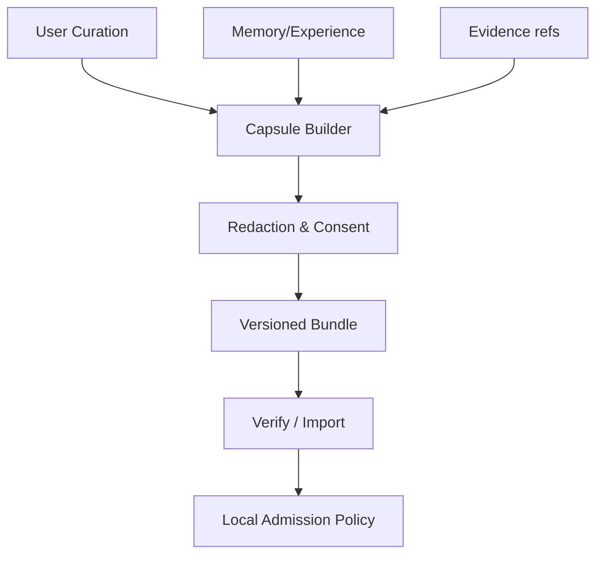
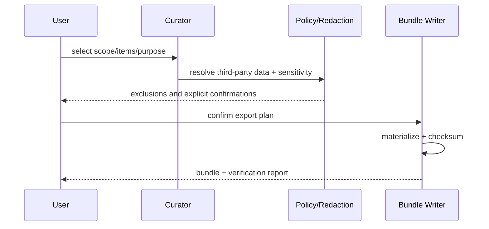

# Legacy Capsule 与长期治理设计

## 1. 产品与架构位置


```mermaid
flowchart TB
  U[User Curation] --> C[Capsule Builder]
  M[Memory/Experience] --> C
  E[Evidence refs] --> C
  C --> R[Redaction & Consent]
  R --> B[Versioned Bundle]
  B --> V[Verify / Import]
  V --> A[Local Admission Policy]
```

Legacy Capsule 是用户主动策展的可移植集合，不是后台自动打包全部人生数据，也不是代表某人的可执行人格。

## 2. Capsule 结构

MEM-047 已选定并实现唯一 v1 目录格式。此前的 JSON manifest 草案不再是 v1 格式：

```text
capsule/
├── manifest.yaml
├── memories.jsonl
├── experiences.jsonl
├── policies/
│   └── usage-consent.yaml
├── README.md
└── SHA256SUMS
```

Manifest 区分内容创建者、导出操作者、被描述主体和授权主体；这四者不能用一个 `user_id` 混淆。v1 固定只允许以上 6 个路径；Memory/Experience 可携带来源引用，但不携带原始 Evidence、Run Event 或 Artifact bytes。`manifest.yaml` 与 `SHA256SUMS` 及全部 payload 均互相校验；SHA-256 只验证包内字节一致性，不验证作者身份、来源真实性或内容正确性。

## 3. 导出流程

DEC-03 已接受：默认仅导出用户选择的 Memory/Experience、来源引用与校验信息；原始证据逐项 opt-in，且先完成脱敏、密钥扫描和第三方资料排除检查。MEM-047 v1 将范围收紧为只导出 Memory/Experience 与来源引用，原始证据 opt-in 仍未实现。导出包不包含任何可继承的 credential、approval 或权限。


```mermaid
sequenceDiagram
  participant U as User
  participant C as Curator
  participant P as Policy/Redaction
  participant B as Bundle Writer
  U->>C: select scope/items/purpose
  C->>P: resolve third-party data + sensitivity
  P-->>U: exclusions and explicit confirmations
  U->>B: confirm export plan
  B->>B: materialize + checksum
  B-->>U: bundle + verification report
```

导入先校验固定文件集合、路径/大小、schema、checksum 和 provenance，再生成无副作用的 quarantine diff；用户显式选择并确认当前 diff 后，Memory 才作为 `candidate` 进入本地 admission。v1 没有签名或加密；外部 Capsule 永不继承本地信任或权限。Experience Case 目前只作为 `externalEvidence` candidate 结果返回，尚无持久化/审核 aggregate。

## 4. 治理边界

| 风险 | 设计裁决 |
|---|---|
| 人格冒充 | 禁止声称“就是本人”；输出必须标识 Agent 与资料来源 |
| 第三方隐私 | 默认排除；只有明确合法授权和目的才可包含 |
| 权限继承 | Capsule 永不携带可执行 credential/approval |
| 过时结论 | 保存时间、版本、supersession；导入后重新校验 |
| 平台锁定 | 开放 schema、离线校验、内容寻址和迁移工具 |
| “永久”承诺 | 只承诺可导出、可校验、可迁移；不承诺绝对永存 |

## 5. 关键参数

| 参数 | 推荐 |
|---|---|
| `include_evidence` | v1 只包含 refs；原始内容按项 opt-in 尚未实现 |
| `encryption` | v1 不支持；private 内容仍经 redaction/consent 和本地导出资格限制 |
| `signature` | v1 不支持；checksum 不表示来源证明或内容为真 |
| `third_party_data` | default deny |
| `import_activation` | always candidate |
| `format_support` | v1 strict schema + Core 离线 verifier；格式迁移工具后续定义 |

## 6. 删除与继承

若 Capsule 已离开本系统，无法承诺远端删除；导出前必须提示这一边界。系统内撤销可生成 revocation manifest，未来导入时提示，但不能伪称能控制所有副本。用户去世/失能后的访问属于独立法律和身份治理议题，V2 仅预留 policy metadata，不实现自动继承。

## 7. 长期治理验收与推迟项

长期治理目标：离线 verify、篡改检测、选择性导出、secret 扫描、版本迁移、外部内容保持 candidate、无凭据/approval。版本迁移和签名等仍需后续版本定义，不属于只接受 v1 的 MEM-047。V2 推迟：数字人格生成、自动遗嘱执行、云端永久托管和跨司法辖区身份认证。

### 7.1 MEM-047 当前交付与边界

- **已交付：**固定目录 file-map 构建/校验、deterministic JSONL 与 SHA256SUMS、manifest/payload digest 校验、secret redaction、导出 eligibility gate、quarantine review diff、stale review 拒绝、显式选择以及 MemoryControl 的外部 candidate 写入和幂等重试。
- **Experience 限制：**只导出 validated Case；导入 accept 返回 `externalEvidence: true` 的 candidate Case，不持久化、不进入复用或 Recall。
- **未交付：**真实文件系统/ZIP reader-writer、UI/CLI、加密/签名、raw evidence/artifact opt-in、远端撤销传播和 Experience 持久化审核。
- **安全语义：**路径/大小/版本/digest/schema 校验通过后仍不代表来源可信；Memory 外部内容必须经本地审核才能改变生命周期状态，且导入时模型使用、再导出和 consent 全部关闭。
