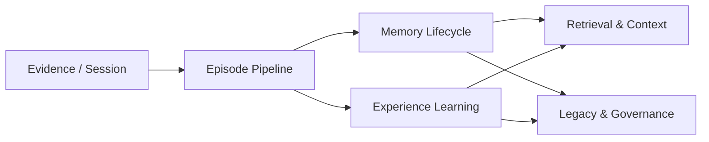
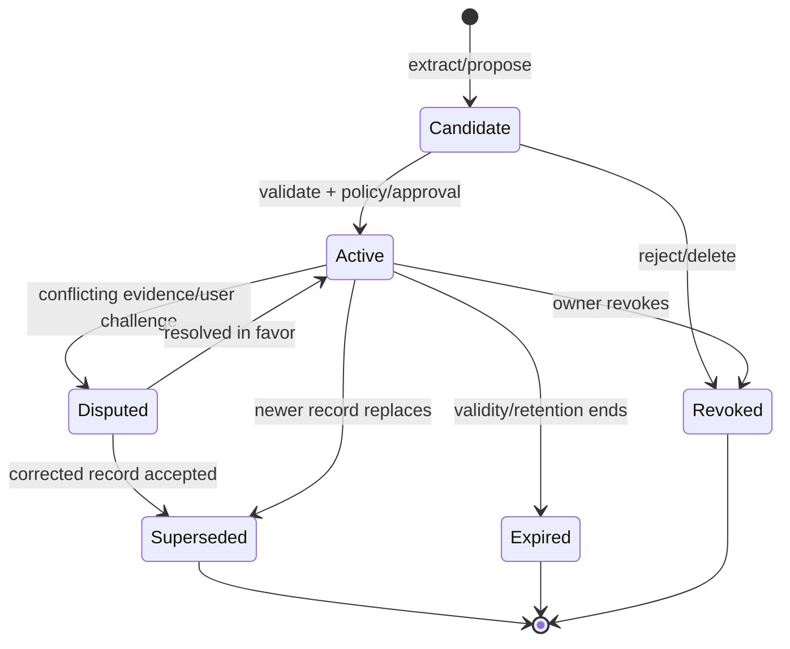

# 04 · 记忆与经验系统

## 子模块导航



| 子模块 | 评审焦点 |
|---|---|
| [证据到 Episode](01-evidence-episode-pipeline.md) | 如何切分经历而不篡改原始事实 |
| [Memory 生命周期](02-memory-lifecycle.md) | 候选、准入、修订、过期、撤销和遗忘 |
| [Experience 学习](03-experience-learning.md) | 从一次成功/失败中形成可条件复用的经验 |
| [检索与上下文注入](04-retrieval-context.md) | 检索、排序、预算、引用和注入安全 |
| [Legacy 与治理](05-legacy-governance.md) | 用户策展、导出、继承、隐私和反人格冒充 |

## 1. 设计命题

Memory 是 V2 最重要的差异化，但也是最容易做成“高级缓存”的部分。目标不是让 Agent 什么都记，而是让它做到：

> **知道什么值得留下，知道它从哪里来，知道什么时候不能再相信，并允许人纠正和带走。**

## 2. 五个不同对象

```text
Session  = 一棵可恢复的会话/执行历史
Episode  = 从历史中投影出的一段有边界经历
Memory   = 经准入、可跨 Session 召回的主张
Experience Case = 可复用的“情境→行动→结果→验证”知识
Legacy Capsule  = 用户主动策展和导出的可移植集合
```

| 对象 | 时间跨度 | 是否自动产生 | 进入模型方式 | 主要风险 |
|---|---|---:|---|---|
| Session | 一次或一组关联工作 | 是 | 当前分支历史/压缩面 | 无限增长、格式兼容 |
| Episode | 一个目标、故障或决策片段 | 可自动投影 | 通常不直接注入 | 错误切分、叙事偏差 |
| Memory | 跨会话 | 候选可自动，active 需准入 | 检索后有界、带引用注入 | 污染、隐私、过期 |
| Experience | 跨项目/跨会话 | 候选可自动，复用需条件匹配 | 以步骤、约束、反例注入 | 机械套用旧方案 |
| Legacy Capsule | 长期/跨系统 | 只能由用户主动创建 | 导入后仍经本地 policy | 敏感信息、身份误用 |

Session 不是 Memory；完整聊天记录也不是经验。

## 3. 原始证据层

Memory 不保存“另一个真相副本”。它引用以下原始材料：

- committed Events；
- Tool attempt、business Receipt、Observation；
- diff、test report、graph delta、review、approval；
- 用户明确声明或修正；
- repository 文件的内容 hash + line locator；
- 外部资源的稳定 id、时间和获取方式；
- Memory 自身之前版本的 lineage。

若引用材料已按保留策略删除，Memory 进入 `evidence_missing` 健康状态，不能继续以“已验证”姿态召回。

## 4. Memory Contract V2

下面是目标语义，不要求第一阶段一次实现所有字段：

```ts
type MemoryKind =
  | "declared_identity" // 仅用户明确提供，不从行为推断
  | "preference"
  | "fact"
  | "decision"
  | "procedure"
  | "lesson"
  | "relationship";

type MemoryStatus =
  | "candidate"
  | "active"
  | "disputed"
  | "superseded"
  | "revoked"
  | "expired";

interface MemoryRecordV2 {
  schemaVersion: 2;
  memoryId: MemoryId;
  kind: MemoryKind;
  claim: string;
  normalizedKey?: string;
  status: MemoryStatus;

  scope: {
    ownerId: OwnerId;
    workspaceId?: WorkspaceId;
    projectId?: ProjectId;
    sessionId?: SessionId;
    visibility: "private" | "workspace" | "exportable";
  };

  provenance: {
    origin: "user" | "repository" | "tool" | "external" | "system" | "model_inference";
    evidenceRefs: EvidenceRef[];
    createdBy: ActorRef;
    createdFromEpisode?: EpisodeId;
  };

  assessment: {
    sourceTrust: "authoritative" | "trusted" | "untrusted" | "unknown";
    inferenceConfidence?: number;
    verification: "verified" | "corroborated" | "asserted" | "inferred";
  };

  validity: {
    validFrom: string;
    validUntil?: string;
    applicability?: string[];
    invalidators?: string[];
  };

  governance: {
    sensitivity: "public" | "internal" | "personal" | "secret";
    consent: "explicit" | "policy" | "none";
    retentionPolicy: string;
    allowModelUse: boolean;
    allowExport: boolean;
  };

  lineage: {
    supersedes?: MemoryId[];
    contradictedBy?: MemoryId[];
    derivedFrom?: MemoryId[];
  };

  createdAt: string;
  updatedAt: string;
}
```

### 4.1 两个置信概念必须分开

- `sourceTrust`：这个来源本身多可信，例如用户对自己偏好的声明通常是 authoritative。
- `inferenceConfidence`：模型从证据推导该 claim 有多确定。

高模型置信不能把不可信来源变成权威来源；多个相似文本也不等于事实被验证。

## 5. Experience Case Contract

```ts
interface ExperienceCaseV1 {
  experienceId: ExperienceId;
  title: string;
  problem: string;
  context: EvidenceRef[];
  constraints: string[];
  decision: string;
  alternatives: Array<{ option: string; rejectedBecause: string }>;
  actions: Array<{
    description: string;
    toolCallRefs: ToolCallId[];
    receiptRefs: ReceiptId[];
  }>;
  outcome: "succeeded" | "failed" | "partial" | "unknown";
  verificationRefs: EvidenceRef[];
  lessons: string[];
  applicability: string[];
  counterexamples: string[];
  status: "candidate" | "active" | "superseded" | "revoked";
}
```

Experience 的价值来自 `applicability` 和 `counterexamples`。没有适用条件的“最佳实践”极易污染未来任务。

## 6. 记忆生命周期



状态变化本身写入事件；Memory store 是这些事件的投影或受控持久化，不允许 UI 直接改 JSONL。

### 6.1 Candidate 产生

候选来源：

- 用户显式 `remember`；
- 完成 Run 后的 bounded extraction；
- 用户修正或 review；
- 导入 Capsule；
- Experience extraction；
- 使用反馈暴露出旧 Memory 的冲突。

模型输出只能创建 candidate，不能直接创建 authoritative active memory。

### 6.2 准入规则

| 类型 | 默认准入 |
|---|---|
| 用户明确偏好/身份声明 | 可自动 active，但保留撤销入口 |
| 仓库中可 hash 定位的事实 | 证据可读且 scope 匹配时 active |
| 工具/测试验证的工程结论 | Receipt + Observation + verification 完整时 active |
| 模型推断 | candidate，默认需规则或人工 review |
| personal/secret | 必须 explicit consent；默认不 export |
| 与 active 记录冲突 | 进入 disputed，不覆盖旧记录 |

### 6.3 更新不是覆盖

修正创建新 record 并设置 `supersedes`。旧 record 改为 `superseded`，使历史回答仍能解释当时为什么得出旧结论。

## 7. 两阶段学习流水线

为了不让 Memory extraction 阻塞主 Run，V2 将学习拆为两阶段：

### Phase A · Episode extraction

- 仅处理已 settlement 的 Session/Run；
- bounded scan、lease、retry backoff；
- 从原始事件提取 Episode、candidate 和 Experience draft；
- 做 secret redaction 和引用完整性校验；
- 写入候选，不改 active memory。

### Phase B · Consolidation

- 一个 owner 串行处理同一 memory scope；
- 去重、冲突检测、过期和 lineage；
- 依据 policy 自动接纳低风险记录，其他进入 review queue；
- 更新检索索引和健康报告；
- 生成 reviewable diff，而不是静默重写整个记忆库。

若没有任何变化，Consolidation 不调用模型。

## 8. 检索与召回

### 8.1 检索不是授权

检索分两步：

1. `search` 找到候选；
2. `admitToContext` 再检查 scope、status、sensitivity、validity、source health、预算和当前任务相关性。

任何 backend（BM25、embedding、hybrid、graph）只能影响排序，不能绕过第二步。

### 8.2 建议评分

```text
score = relevance
      × scopeCompatibility
      × freshness
      × sourceHealth
      × taskApplicability
      × userFeedback
      - contradictionPenalty
      - stalenessPenalty
```

不把 `trust` 简单乘成单一浮点数后丢失解释；最终结果保留各分量。

### 8.3 Context 注入格式

模型看到的每条 Memory 至少包含：

```text
[memory:mem_123 | kind=decision | status=active | scope=project]
Claim: Use adjacent session migrations; never overwrite a released generation.
Why available: matched current task; verified by note + migration test.
Sources: evt_81, artifact_sha256:..., docs/...#...
Validity: project TraceGraph; reviewed 2026-09-23.
```

系统提示明确：Memory 是有来源的工作材料，不得与用户当前指令冲突；遇到过期、冲突或缺证据应询问或重新验证。

## 9. 冲突、反馈与遗忘

### 9.1 冲突

- 同一 normalized key 出现不同 active claim 时，不做 last-write-wins；
- 生成 `memory.conflict.detected`；
- 两条记录进入 disputed 或按权威来源规则决定；
- Context 默认不注入 unresolved conflict，或成对注入并明确不确定性。

### 9.2 使用反馈

每次 Memory 被使用，记录：

- 被哪个 Run/Context 选中；
- 模型是否引用；
- 用户是否接受/纠正；
- 任务验证是否支持它；
- 是否导致失败或无关噪声。

反馈可以调整 ranking，但不能改写原始 provenance。

### 9.3 遗忘

提供四种语义：

| 操作 | 结果 |
|---|---|
| Hide | 不再召回，但保留记录用于审计 |
| Revoke | 标记无效并传播到索引/Context |
| Delete content | 删除敏感正文和 Artifact，保留最小 tombstone/hash（若政策允许） |
| Crypto erase | 销毁独立加密域密钥，使内容不可恢复 |

用户界面必须说明哪种操作可恢复、哪些副本或导出不受当前实例控制。

## 10. Legacy Capsule

Capsule 是用户主动策展的导出，不是后台自动备份：

```text
legacy-capsule/
├── manifest.yaml
├── memories.jsonl
├── experiences.jsonl
├── evidence/
│   ├── events.jsonl
│   └── artifacts/
├── policies/
│   └── usage-consent.yaml
├── README.md
└── SHA256SUMS
```

`manifest.yaml` 至少包含 schema/version、owner、created_at、included scopes、redaction report、source instance、required migrations、license/consent 和 checksum algorithm。

导入流程：verify checksum → inspect manifest → map owner/scope → quarantine → show diff → explicit accept → create imported candidates。导入不能直接获得 active 或 authoritative 状态。

## 11. 人的记忆边界

如果未来从工程记忆扩展到个人记忆，必须新增而不是默默复用以下能力：

- 多媒体来源和说话人同意；
- 生者/逝者身份与代理边界；
- 家庭成员间冲突与访问控制；
- 地域性数据保护、继承和删除规则；
- “本人原话”“系统摘要”“模型推断”的视觉区分；
- 禁止以记忆材料冒充本人当前意愿。

V2 MVP 只做用户本人主动提供的工程/工作记忆，不对“人格延续”作产品承诺。

## 12. 当前能力与迁移顺序

| 切片 | 当前基础 | 下一步 |
|---|---|---|
| M0 | `MemoryRecord.origin/trust/source_refs`、BM25、预算 recall | 冻结 V1 行为并补 current contract |
| M1 | 现有 Context manifest | 加 source/provenance；区分 retrieved 形态与来源 |
| M2 | `remember/recall` | 引入 candidate/status/lineage，不改变默认召回 |
| M3 | Session/Run events | 实现异步 Episode extraction |
| M4 | retrieval package | 拆 retrieval definition 与 BM25 provider |
| M5 | UI/Host/内部协议客户端 | memory inspect/review/revoke/query 命令 |
| M6 | Artifact/Event export | Legacy Capsule v1 |
| M7 | 外部 Langfuse 质量评估（可选后续集成） | conflict/stale 对检索质量的影响、citation、Experience paired comparison；安全不变量仍由本地测试阻断 |

## 13. 本地安全测试与外部质量评估问题

下表中的权限、scope、准入、撤销和删除等确定性要求必须由本地测试覆盖并可进入 CI 门禁；相关性、经验复用收益等非确定性质量问题可在后续 Langfuse 外部评估中测量。外部平台不能作为数据安全证明。

| 场景 | 必须证明 |
|---|---|
| 明确用户偏好 | 准确保存、可撤销、不跨用户泄漏 |
| 仓库事实改变 | 旧记录过期/冲突，不继续无提示召回 |
| 模型错误推断 | 只成 candidate，不自动 active |
| 重复候选 | 幂等去重，保留来源合并 |
| 相似但不同项目 | scope 阻止串用 |
| 失败经验 | 不包装成成功步骤，保留反例 |
| 删除敏感数据 | 索引、Context、导出均不可再读取 |
| Evidence missing | 降级或拒绝，不假装 verified |
| Capsule 导入 | 校验、隔离、review 后才激活 |

最终目标不是 recall@K 单项最高，而是**相关、可信、作用域正确、可解释、可撤销**同时成立。
