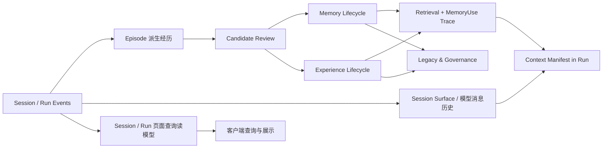
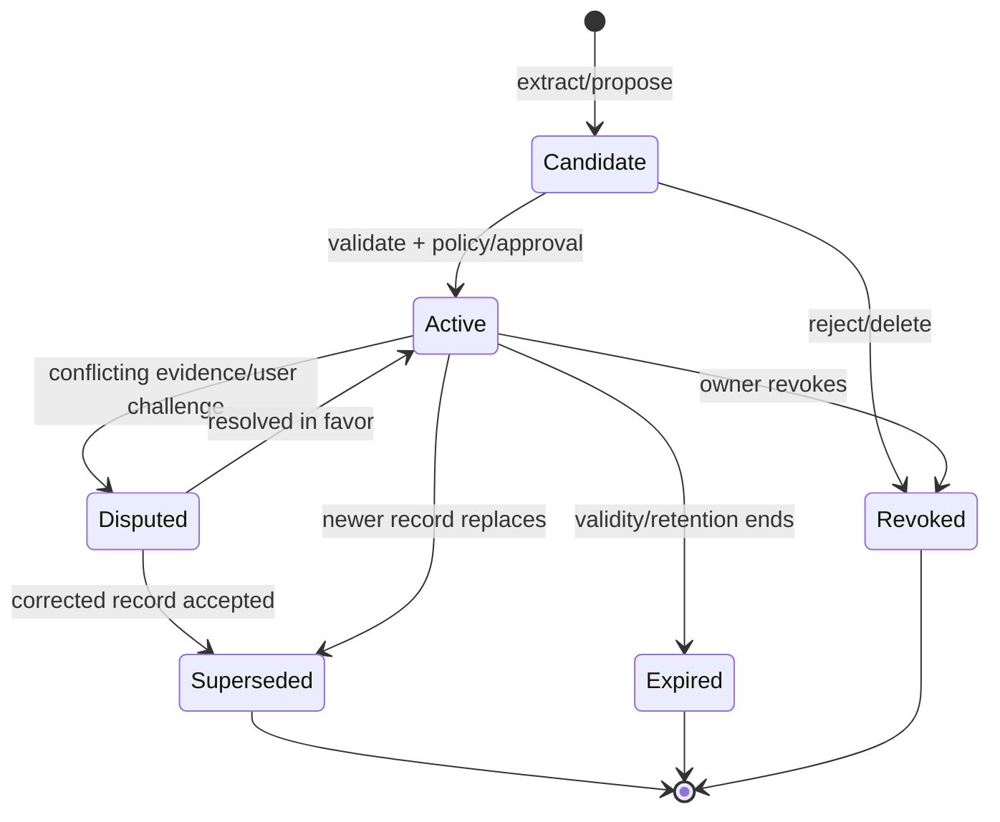

# 04 · 记忆与经验系统

## 子模块导航



| 子模块 | 评审焦点 |
|---|---|
| [证据到 Episode](01-evidence-episode-pipeline.md) | 如何切分经历而不篡改原始事实 |
| [Memory 生命周期](02-memory-lifecycle.md) | 候选、准入、修订、过期、撤销和可删除内容 |
| [Experience 学习](03-experience-learning.md) | 从一次成功/失败中形成有条件、不可直接执行的经验 |
| [检索与上下文注入](04-retrieval-context.md) | 候选、实际注入、预算、引用和 UI 可见性 |
| [Legacy 与治理](05-legacy-governance.md) | 用户策展、导出、继承、隐私和反人格冒充 |

## 1. 设计命题

Memory 是 V2 最重要的差异化，但也是最容易做成“高级缓存”的部分。目标不是让 Agent 什么都记，而是让它做到：

> **知道什么值得留下，知道它从哪里来，知道什么时候不能再相信，并允许人纠正和带走。**

## 2. 五个不同对象

```text
Session  = 一棵可恢复的会话/执行历史
Episode  = 从历史中派生出的一段有边界经历
Memory   = 经准入、可跨 Session 召回的主张
Experience Case = 可复用的“情境→行动→结果→验证”知识
Legacy Capsule  = 用户主动策展和导出的可移植集合
```

| 对象 | 时间跨度 | 是否自动产生 | 进入模型方式 | 主要风险 |
|---|---|---:|---|---|
| Session | 一次或一组关联工作 | 是 | 当前分支历史/压缩面 | 无限增长、格式兼容 |
| Episode | 一个目标、故障或决策片段 | 可自动派生，之后可审核 | 通常不直接注入 | 错误切分、叙事偏差 |
| Memory | 跨会话 | 候选可自动，active 需准入 | 检索后有界、带引用注入 | 污染、隐私、过期 |
| Experience | 跨项目/跨会话 | 候选可自动，复用需条件匹配 | 以步骤、约束、反例注入 | 机械套用旧方案 |
| Legacy Capsule | 长期/跨系统 | 只能由用户主动创建 | 导入后仍经本地 policy | 敏感信息、身份误用 |

Session 不是 Memory；完整聊天记录也不是经验。图中 **Episode 派生经历** 用于学习/审核，**页面查询读模型** 用于恢复与展示 UI 状态，**模型消息历史** 用于 Context Assembly；三者都不能互相替代。Memory 状态投影/检索索引则从 Memory 生命周期事件派生。

## 3. 原始证据层

Memory 不保存“另一个真相副本”。它引用以下原始材料：

- committed Events；
- Tool attempt、business Receipt、Observation；
- diff、test report、graph delta、review、approval；
- 用户明确声明或修正；
- repository 文件的内容 hash + line locator；
- 外部资源的稳定 id、时间和获取方式；
- Memory 自身之前版本的 lineage。

若引用材料已按保留策略删除，Memory 进入 `evidence_missing` 健康状态，不能继续以“已验证”姿态召回。

### 3.1 V2 目标：Session 真相与长期 Memory 真相

DSH 当前源码给 Outlive 的可靠参照是 **Session 事件日志是一次执行历史的真相，模型上下文是它的派生面；压缩可以改派生面，不等于删除历史；外部资料实际注入时应留下可追溯的 Session 事件**。Outlive 采用这条“模型可见内容可重建”的约束，但不把跨 Session 的长期记忆塞进产生它的那个 Session：否则换会话、换工作区或删除原 Session 时，记忆所有权和保留语义会混在一起。

这张分层图是 Outlive 的 **V2 Proposed target**，不是 TraceGraph 当前 G-21 的实现描述：

| 真相域 | 保存什么 | 所属边界 | 可重建派生物 |
|---|---|---|---|
| Session / Run stream | 输入、决策、工具调用、Receipt、Observation、验证、Context Manifest、MemoryUse 请求状态 | 一次执行及其分支 | Session/Run 页面查询读模型、模型消息历史/Surface、Episode、回放 |
| Memory / Experience stream | 跨执行的记忆版本、来源、scope、准入/修订/撤销/删除状态 | owner + session/workspace/project/global scope | Memory 当前状态、冲突视图、全文/向量检索索引 |

页面查询读模型、模型消息历史、Episode 虽然都以 Session/Run 事实为输入，但用途不同；MemoryUse 等使用统计属于 Run stream，可从 Run 事件另行派生，不能混入 Memory 状态投影而模糊其来源。

### 3.2 Current TraceGraph G-21 → V2 Proposed

| 方面 | Current：仓库中已实现 | V2 Proposed：本设计目标 |
|---|---|---|
| Memory 真相源 | `<dataDir>/memory/records.jsonl` 保存 admitted `MemoryRecord`；Run/Session Ledger 另记 `memory.candidate_evaluated`、`memory.written`、`memory.recalled`、`retrieval.index_updated` | Memory 生命周期成为规范 Event Ledger 中按 owner/scope 隔离的独立 aggregate stream；迁移必须无损读取既有 JSONL 与事件，索引仍是可重建投影 |
| 准入与学习 | `remember()` 做 strict schema、scope、trust/source、expiry、重复和幂等准入；未实现后台 Episode/自动提取和用户 review 管理页 | 提取先生成可查看/编辑/接受/拒绝的 Candidate；审核决策与版本 lineage 可审计；自动提取排在控制面之后 |
| 检索与注入 | 配置 retriever 后，每轮在 Context build 前按 Run task 自动 recall；默认 8 hits / 4,096 tokens，检查 canonical record 与 provenance 后注入 `untrusted` Memory Context | 把 retrieved → selected → Provider Adapter invoked 分开留证；现有自动 recall 作为兼容路径逐步加上可见性、开关/策略和请求状态，裁决默认行为前不扩张无审计的新路径 |
| 检索后端 | 本地 JSONL + BM25 是默认路径，可配置远端 retrieval service；当前无 embedding/vector/reranker | backend 可替换，但排序不能绕过 scope/authority/status；向量/RAG 是独立 ADR，不是记忆可信性的来源 |
| 使用与 UI | `memory.recalled` 和 Context Manifest 已有有界 provenance，但还没有独立 Memory 管理 API/UI，也不能把检索命中简单等同于模型请求状态 | Run-scoped `MemoryUse` 绑定具体 Memory 版本与 Runtime adapter-input；UI 展示请求包含及 response/unknown 状态，不声称模型因果使用 |
| 忘记/删除 | 当前 JSONL append-only；过期/superseded 在召回时过滤，没有“遗忘即物理擦除”能力 | 可撤销与可删正文分开定义；Artifact/密钥、索引、缓存、备份与 tombstone 需统一治理，具体加密/恢复方案先过 ADR |

Current 证据详见[模块 08：Memory 记忆子系统](../../modules/08-Memory-记忆子系统.md)、`packages/core/src/memory.ts`、`packages/contracts/src/memory.ts` 与 `packages/core/src/runtime.ts`。新表中所有右栏都是提案，不是当前完成功能。

在 V2 目标中，Session/Run 与 Memory 使用同一套规范 Event Ledger / event envelope、迁移和审计规则，但属于不同的 aggregate/stream；**不是**第二套互相独立的 Memory Journal，也不是把每条全局记忆复制到全部 Session。索引、列表和当前状态均为可重建投影；memory scope 必须在每次读写时重新授权。

这是一个核心架构提案，不能直接按文字开工：实施前需 ADR 定义 Memory aggregate 的 stream identity/单写者与并发边界、G-21 `records.jsonl` 的无损相邻迁移与切换/回滚、历史 Session event 的保留策略，以及加密正文、密钥、备份和 tombstone 的删除语义。禁止先做双真源、双写或“新索引覆盖旧记录”。

记忆正文可采用加密、内容寻址的 Artifact 引用，事件保留稳定 ID、版本、摘要/hash 和治理动作，不在不可变事件里反复复制敏感正文。物理删除或 crypto-erase 后，事件与回放只能显示 `redacted/unavailable`，不得悄悄换成新版本。加密域、密钥生命周期、备份清理和可恢复性仍需 ADR 裁决；“事件追加式”不能被误解成禁止用户依法/依策略删除内容。

### 3.3 DSH 现状与本地记忆提案的边界

- **DSH 当前能力（源码观察）**：Session event log、从 Session Surface 派生供 LLM 使用的消息历史（如 `deriveMessages()`）、compaction 和 Session query，以及通过扩展点注入额外上下文；这里的模型消息历史不是给 UI 查询用的 Session/Run 页面读模型。Session reference 会把附加上下文作为带来源的 message 交给 Agent Loop，Agent Loop 再 append 为 `user/message`。这证明可回放的请求输入边界，不证明 Provider 最终接收或模型实际使用。没有在所检查的 DSH HEAD 中发现第一方 MemoryEntry 产品、长期记忆浏览器或自动提取/准入闭环。
- **`dsh-memory-cain/dsh-memory-dev/`（用户自己的设计提案）**：提供 MemoryEntry、候选、来源元数据、显式冲突、记忆可见性分层、列表管理，以及“先做可解释与人工/显式召回，再考虑自动召回”的产品构想。该提案里的 Memory projection 是从长期记忆生命周期事件重建当前记忆状态/索引；它不是 DSH 官方 roadmap 或已实现能力，也不是 DSH `deriveMessages()` 的 Session 模型消息历史派生。
- **Outlive 的采用与新增**：采用 Session 可回放、压缩不等于遗忘、上下文注入可追溯和界面克制可见；新增跨 Session 的 Memory owner/scope、版本化准入/删除治理、独立的 MemoryUse 使用记录，以及“记忆可继承、权限不继承”。

可核对的源码快照、路径、commit 与证据等级见[参考源码观察](../08-reference-lineage/01-source-observations.md)。

## 4. Memory Contract V2

下面是目标语义，不要求第一阶段一次实现所有字段：

```ts
type MemoryKind =
  | "declared_identity" // 仅用户明确提供，不从行为推断
  | "preference"
  | "fact"
  | "decision"
  | "procedure"
  | "lesson"
  | "relationship";

type MemoryStatus =
  | "candidate"
  | "active"
  | "disputed"
  | "superseded"
  | "revoked"
  | "expired";

interface MemoryRecordV2 {
  schemaVersion: 2;
  memoryId: MemoryId;
  version: number;
  kind: MemoryKind;
  claim: string; // decoded domain/API view; do not duplicate sensitive plaintext in immutable lifecycle events
  contentArtifactRef?: ArtifactRef;
  contentDigest?: string;
  normalizedKey?: string;
  status: MemoryStatus;

  scope: {
    ownerId: OwnerId;
    workspaceId?: WorkspaceId;
    projectId?: ProjectId;
    sessionId?: SessionId;
    visibility: "private" | "workspace" | "exportable";
  };

  provenance: {
    origin: "user" | "repository" | "tool" | "external" | "system" | "model_inference";
    evidenceRefs: EvidenceRef[];
    createdBy: ActorRef;
    createdFromEpisode?: EpisodeId;
  };

  assessment: {
    sourceTrust: "authoritative" | "trusted" | "untrusted" | "unknown";
    inferenceConfidence?: number;
    verification: "verified" | "corroborated" | "asserted" | "inferred";
  };

  validity: {
    validFrom: string;
    validUntil?: string;
    applicability?: string[];
    invalidators?: string[];
  };

  governance: {
    sensitivity: "public" | "internal" | "personal" | "secret";
    consent: "explicit" | "policy" | "none";
    retentionPolicy: string;
    allowModelUse: boolean;
    allowExport: boolean;
  };

  lineage: {
    supersedes?: MemoryId[];
    contradictedBy?: MemoryId[];
    derivedFrom?: MemoryId[];
  };

  createdAt: string;
  updatedAt: string;
}
```

### 4.1 两个置信概念必须分开

- `sourceTrust`：这个来源本身多可信，例如用户对自己偏好的声明通常是 authoritative。
- `inferenceConfidence`：模型从证据推导该 claim 有多确定。

高模型置信不能把不可信来源变成权威来源；多个相似文本也不等于事实被验证。

## 5. Experience Case Contract

```ts
interface ExperienceCaseV1 {
  experienceId: ExperienceId;
  title: string;
  problem: string;
  context: EvidenceRef[];
  constraints: string[];
  decision: string;
  alternatives: Array<{ option: string; rejectedBecause: string }>;
  actions: Array<{
    description: string;
    toolCallRefs: ToolCallId[];
    receiptRefs: ReceiptId[];
  }>;
  outcome: "succeeded" | "failed" | "partial" | "unknown";
  verificationRefs: EvidenceRef[];
  lessons: string[];
  applicability: string[];
  counterexamples: string[];
  status: "candidate" | "active" | "superseded" | "revoked";
}
```

Experience 的价值来自 `applicability` 和 `counterexamples`。没有适用条件的“最佳实践”极易污染未来任务。

## 6. 记忆生命周期



状态变化本身写入事件；Memory store 是这些事件的投影或受控持久化，不允许 UI 直接改 JSONL。

每个 Memory aggregate 有自己的版本序列和 scope owner；写入要经过领域命令与 policy，事件记录 actor、原因、来源版本和 policy version。Session/Run 事件只记录本次执行中候选、审阅操作或实际使用的关联，不成为跨会话 Memory 的唯一所有者。

### 6.1 Candidate 产生

候选来源：

- 用户显式 `remember`；
- 完成 Run 后的 bounded extraction；
- 用户修正或 review；
- 导入 Capsule；
- Experience extraction；
- 使用反馈暴露出旧 Memory 的冲突。

模型输出只能创建 candidate，不能直接创建 authoritative active memory。V2 第一阶段对抽取出的长期主张采用 `candidate → inspect/edit/accept/reject`；用户明确的 `remember` 命令也必须显示最终保存的 claim、scope、来源和状态。自动提取可以后台运行，但不得绕过候选列表而静默改变 active Memory。

### 6.2 准入规则

| 类型 | 默认准入 |
|---|---|
| 用户明确偏好/身份声明 | 可由显式 `remember` 命令创建；展示确认与撤销入口，不能从行为推断身份 |
| 仓库中可 hash 定位的事实 | 先成为候选；来源可读、scope 匹配且用户接受后 active |
| 工具/测试验证的工程结论 | Receipt + Observation + verification 可提高准入证据；仍生成可检查的候选变更 |
| 模型推断 | candidate；不得直接 active |
| personal/secret | 必须 explicit consent；默认不 export |
| 与 active 记录冲突 | 进入 disputed，不覆盖旧记录 |

低风险自动准入可作为后续策略，但必须在候选/历史可检查、MemoryUse 可审计、纠错/撤销可用和反例门禁建立后单独开启；不能把“证据强”当成跳过用户控制的理由。

### 6.3 更新不是覆盖

修正创建新 record 并设置 `supersedes`。旧 record 改为 `superseded`，使历史回答仍能解释当时为什么得出旧结论。

## 7. 两阶段学习流水线

为了不让 Memory extraction 阻塞主 Run，V2 将学习拆为两阶段：

### Phase A · Episode extraction

- 仅处理已 settlement 的 Session/Run；
- bounded scan、lease、retry backoff；
- 从原始事件提取 Episode、candidate 和 Experience draft；
- 做 secret redaction 和引用完整性校验；
- 写入 candidate 与来源 refs，不改 active memory；候选在 Desktop/Web UI/CLI 共用的记忆检查面可查看。

### Phase B · Consolidation

- 一个 owner 串行处理同一 memory scope；
- 去重、冲突检测、过期和 lineage；
- 生成可审阅的 consolidation diff；首个可用阶段不静默改 active memory，低风险自动准入需独立裁决与门禁；
- 更新检索索引和健康报告；
- 不静默重写整个记忆库。

若没有任何变化，Consolidation 不调用模型。

## 8. 检索与召回

### 8.1 必须区分三个阶段

```text
Retrieved candidate  →  Selected for context  →  Provider Adapter invoked
      搜到，不代表能用       通过准入与预算             写入 Run 的 MemoryUse 状态
```

列表命中数不能称作“已使用记忆”；排入待发送 Context 也不能证明 Provider 最终收到。Runtime 在 Provider Adapter 调用边界记录 `MemoryUse` 状态，并将其与本轮 `ContextManifest`、memory ID/version、evidence refs、token estimate、过滤/预算理由和时间关联。该记录证明的是“Runtime 构建并提交了包含该片段的请求尝试”，不是远端模型内部实际读取/使用；若调用未发生或结果未知，记录相应状态，不伪装为确定成功。

### 8.2 检索不是授权

检索分两步：

1. `search` 找到候选；
2. `admitToContext` 再检查 scope、status、sensitivity、validity、source health、预算和当前任务相关性。

任何 backend（BM25、embedding、hybrid、graph）只能影响排序，不能绕过第二步。

### 8.3 建议评分

```text
score = relevance
      × scopeCompatibility
      × freshness
      × sourceHealth
      × taskApplicability
      × userFeedback
      - contradictionPenalty
      - stalenessPenalty
```

不把 `trust` 简单乘成单一浮点数后丢失解释；最终结果保留各分量。

### 8.4 Context 注入格式

模型看到的每条 Memory 至少包含：

```text
[memory:mem_123 | kind=decision | status=active | scope=project]
Claim: Use adjacent session migrations; never overwrite a released generation.
Why available: matched current task; verified by note + migration test.
Sources: evt_81, artifact_sha256:..., docs/...#...
Validity: project TraceGraph; reviewed 2026-09-23.
```

系统提示明确：Memory 是有来源的工作材料，不得与用户当前指令冲突；遇到过期、冲突或缺证据应询问或重新验证。

## 9. 冲突、反馈与遗忘

### 9.1 冲突

- 同一 normalized key 出现不同 active claim 时，不做 last-write-wins；
- 生成 `memory.conflict.detected`；
- 两条记录进入 disputed 或按权威来源规则决定；
- Context 默认不注入 unresolved conflict，或成对注入并明确不确定性。

### 9.2 使用反馈与因果边界

对候选召回、上下文选择、Adapter 调用、后续反馈分开记录。`MemoryUse` 至少记录：

- `runId`、`contextManifestId`、memory ID/version、evidence refs；
- Runtime 交给 Adapter 的 segment digest、token estimate、预算与过滤理由；
- Adapter 调用、响应、失败或 unknown 状态和时间；
- 后续用户接受/纠正、任务验证支持/反驳/未知等独立 Observation。

UI 默认可用一行克制提示（例如“本次请求包含 2 条记忆”）展开到具体 claim、来源、scope、状态和管理入口；区分 Adapter 是否已调用、是否收到响应、结果是否未知。完整记忆浏览器以列表为主，图谱仅作高级视图。不得将搜索命中显示成请求内容；也不能宣称“模型使用/依据了这条记忆”或“这条记忆导致答案”，不能单凭时间先后给它增加 truth/confidence。

反馈可以影响后续排序或触发 candidate/disputed/review，但不能改写原始 provenance 或自动把一次接受解释为长期正确。

### 9.3 遗忘

提供四种语义：

| 操作 | 结果 |
|---|---|
| Hide | 不再召回，但保留记录用于审计 |
| Revoke | 标记无效并传播到索引/Context |
| Delete content | 删除敏感正文和 Artifact，保留最小 tombstone/hash（若政策允许） |
| Crypto erase | 销毁独立加密域密钥，使内容不可恢复 |

用户界面必须说明哪种操作可恢复、哪些副本或导出不受当前实例控制。

## 10. Legacy Capsule

Capsule 是用户主动策展的导出，不是后台自动备份：

```text
legacy-capsule/
├── manifest.yaml
├── memories.jsonl
├── experiences.jsonl
├── evidence/
│   ├── events.jsonl
│   └── artifacts/
├── policies/
│   └── usage-consent.yaml
├── README.md
└── SHA256SUMS
```

`manifest.yaml` 至少包含 schema/version、owner、created_at、included scopes、redaction report、source instance、required migrations、license/consent 和 checksum algorithm。

导入流程：verify checksum → inspect manifest → map owner/scope → quarantine → show diff → explicit accept → create imported candidates。导入不能直接获得 active 或 authoritative 状态。

## 11. 人的记忆边界

如果未来从工程记忆扩展到个人记忆，必须新增而不是默默复用以下能力：

- 多媒体来源和说话人同意；
- 生者/逝者身份与代理边界；
- 家庭成员间冲突与访问控制；
- 地域性数据保护、继承和删除规则；
- “本人原话”“系统摘要”“模型推断”的视觉区分；
- 禁止以记忆材料冒充本人当前意愿。

V2 MVP 只做用户本人主动提供的工程/工作记忆，不对“人格延续”作产品承诺。

## 12. 当前能力与迁移顺序

| 切片 | 当前基础 | 下一步 |
|---|---|---|
| M0 · 契约与所有权 | Current `records.jsonl` + Memory/Session events | 定义分离的 Memory aggregate stream；迁移既有 records/events 无损；版本、scope、provenance、治理事件；不复制为第二套 journal |
| M1 · 请求可追溯 | Current 每轮 auto recall（仅 retriever 已装配时）、BM25、budget、Context Manifest | 区分 retrieved/selected/adapter_invoked；为 Runtime Adapter input 记录 MemoryUse 与状态；以 feature/policy 兼容现有行为，不把 recall event 直接当成 provider 成功 |
| M2 · 人的控制面 | 当前缺 Memory 管理 API/UI | Desktop/Web UI/CLI 共享 inspect/review/correct/revoke/delete；来源、状态、请求包含记录可见；先满足治理和纠错路径 |
| M3 · 有界学习 | 当前无后台 Episode/自动提取 | settlement 后异步抽取候选；保留失败/unknown，幂等重跑，不静默激活 |
| M4 · 策略裁决 | G-21 现有自动 recall + 新 visibility/MemoryUse + 负向测试 | 再决定默认 recall、用户开关与低风险准入；先兼容、可观测、可关闭，不无审计扩张 |
| M5 · 经验与迁移 | Experience/Artifact/Event export | Experience 条件化复用、Legacy Capsule v1 |
| M6 · 外部质量评估 | 外部 Langfuse（可选后续集成） | conflict/stale 对检索质量的影响、citation、Experience paired comparison；安全不变量仍由本地测试阻断 |

## 13. 本地安全测试与外部质量评估问题

下表中的权限、scope、准入、撤销和删除等确定性要求必须由本地测试覆盖并可进入 CI 门禁；相关性、经验复用收益等非确定性质量问题可在后续 Langfuse 外部评估中测量。外部平台不能作为数据安全证明。

| 场景 | 必须证明 |
|---|---|
| 明确用户偏好 | 准确保存、可撤销、不跨用户泄漏 |
| 仓库事实改变 | 旧记录过期/冲突，不继续无提示召回 |
| 模型错误推断 | 只成 candidate，不自动 active |
| 重复候选 | 幂等去重，保留来源合并 |
| 相似但不同项目 | scope 阻止串用 |
| 失败经验 | 不包装成成功步骤，保留反例 |
| 删除敏感数据 | 索引、Context、导出均不可再读取 |
| Evidence missing | 降级或拒绝，不假装 verified |
| 搜到但未 dispatch | UI/API 不报告为“本次请求包含”；不生成 `adapter_invoked` / `response_received` 状态 |
| Context 内容与日志不一致 | 从 Context Manifest 无法重建请求时，本地门禁失败 |
| 回放时记忆已删除 | 明确显示 redacted/unavailable，不替换为新版本 |
| Capsule 导入 | 校验、隔离、review 后才激活 |

最终目标不是 recall@K 单项最高，而是**相关、可信、作用域正确、可解释、可撤销**同时成立。
