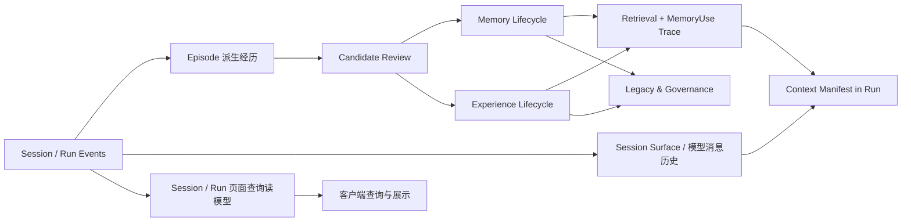
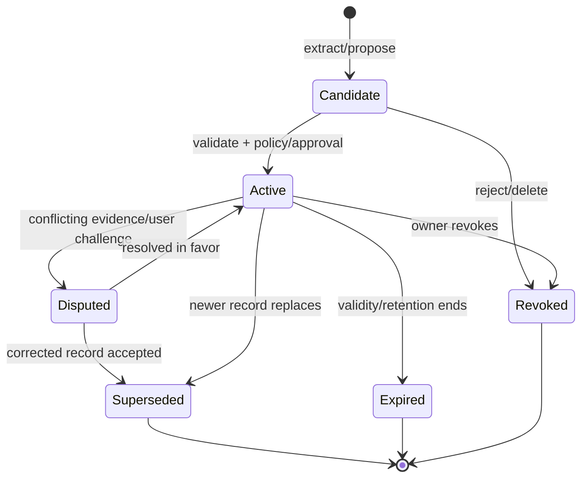

# 04 · 记忆与经验系统

## 子模块导航


```mermaid
flowchart LR
  SE[Session / Run Events] --> EP[Episode 派生经历]
  SE --> MH[Session Surface / 模型消息历史]
  SE --> QV[Session / Run 页面查询读模型]
  EP --> MC[Candidate Review]
  MC --> ML[Memory Lifecycle]
  MC --> EX[Experience Lifecycle]
  ML --> RC[Retrieval + MemoryUse Trace]
  EX --> RC
  RC --> CM[Context Manifest in Run]
  MH --> CM
  QV --> UI[客户端查询与展示]
  ML --> LG[Legacy & Governance]
  EX --> LG
```

| 子模块 | 评审焦点 |
|---|---|
| [证据到 Episode](01-evidence-episode-pipeline.md) | 如何切分经历而不篡改原始事实 |
| [Memory 生命周期](02-memory-lifecycle.md) | 候选、准入、修订、过期、撤销和可删除内容 |
| [Experience 学习](03-experience-learning.md) | 从一次成功/失败中形成有条件、不可直接执行的经验 |
| [检索与上下文注入](04-retrieval-context.md) | 候选、实际注入、预算、引用和 UI 可见性 |
| [Legacy 与治理](05-legacy-governance.md) | 用户策展、导出、继承、隐私和反人格冒充 |

## 1. 设计命题

Memory 是 V2 最重要的差异化，但也是最容易做成“高级缓存”的部分。目标不是让 Agent 什么都记，而是让它做到：

> **知道什么值得留下，知道它从哪里来，知道什么时候不能再相信，并允许人纠正和带走。**

## 2. 五个不同对象

```text
Session  = 一棵可恢复的会话/执行历史
Episode  = 从历史中派生出的一段有边界经历
Memory   = 经准入、可跨 Session 召回的主张
Experience Case = 可复用的“情境→行动→结果→验证”知识
Legacy Capsule  = 用户主动策展和导出的可移植集合
```

| 对象 | 时间跨度 | 是否自动产生 | 进入模型方式 | 主要风险 |
|---|---|---:|---|---|
| Session | 一次或一组关联工作 | 是 | 当前分支历史/压缩面 | 无限增长、格式兼容 |
| Episode | 一个目标、故障或决策片段 | 可自动派生，之后可审核 | 通常不直接注入 | 错误切分、叙事偏差 |
| Memory | 跨会话 | 候选可自动，active 需准入 | 检索后有界、带引用注入 | 污染、隐私、过期 |
| Experience | 跨项目/跨会话 | 候选可自动，复用需条件匹配 | 以步骤、约束、反例注入 | 机械套用旧方案 |
| Legacy Capsule | 长期/跨系统 | 只能由用户主动创建 | 导入后仍经本地 policy | 敏感信息、身份误用 |

Session 不是 Memory；完整聊天记录也不是经验。图中 **Episode 派生经历** 用于学习/审核，**页面查询读模型** 用于恢复与展示 UI 状态，**模型消息历史** 用于 Context Assembly；三者都不能互相替代。Memory 状态投影/检索索引则从 Memory 生命周期事件派生。

## 3. 原始证据层

Memory 不保存“另一个真相副本”。它引用以下原始材料：

- committed Events；
- Tool attempt、business Receipt、Observation；
- diff、test report、graph delta、review、approval；
- 用户明确声明或修正；
- repository 文件的内容 hash + line locator；
- 外部资源的稳定 id、时间和获取方式；
- Memory 自身之前版本的 lineage。

若引用材料已按保留策略删除，Memory 进入 `evidence_missing` 健康状态，不能继续以“已验证”姿态召回。

### 3.1 V2 目标：Session 真相与长期 Memory 真相

DSH 当前源码给 Outlive 的可靠参照是 **Session 事件日志是一次执行历史的真相，模型上下文是它的派生面；压缩可以改派生面，不等于删除历史；外部资料实际注入时应留下可追溯的 Session 事件**。Outlive 采用这条“模型可见内容可重建”的约束，但不把跨 Session 的长期记忆塞进产生它的那个 Session：否则换会话、换工作区或删除原 Session 时，记忆所有权和保留语义会混在一起。

这张分层图是 Outlive 的 **V2 Proposed target**，不是 TraceGraph 当前 G-21 的实现描述：

| 真相域 | 保存什么 | 所属边界 | 可重建派生物 |
|---|---|---|---|
| Session / Run stream | 输入、决策、工具调用、Receipt、Observation、验证、Context Manifest、MemoryUse 请求状态 | 一次执行及其分支 | Session/Run 页面查询读模型、模型消息历史/Surface、Episode、回放 |
| Memory / Experience stream | 跨执行的记忆版本、来源、scope、准入/修订/撤销/删除状态 | owner + session/workspace/project/global scope | Memory 当前状态、冲突视图、全文/向量检索索引 |

页面查询读模型、模型消息历史、Episode 虽然都以 Session/Run 事实为输入，但用途不同；MemoryUse 等使用统计属于 Run stream，可从 Run 事件另行派生，不能混入 Memory 状态投影而模糊其来源。

### 3.2 Current TraceGraph G-21 → V2 Proposed

| 方面 | Current：仓库中已实现 | V2 Proposed：本设计目标 |
|---|---|---|
| Memory 真相源 | `<dataDir>/memory/records.jsonl` 仍保存 G-21 V1 `MemoryRecord`；MEM-046 新增 `<dataDir>/memory-v2/<owner-hash>/records.jsonl` 保存 V2 immutable candidate seeds，lifecycle 与控制事件进入既有 Evidence Ledger。V1 Runtime 不切换到 V2 | Memory lifecycle、版本和来源成为规范 Event Ledger 中按 owner/scope 隔离的独立 aggregate stream；迁移必须无损读取既有 JSONL 与事件，索引仍是可重建投影 |
| 准入与学习 | V1 `remember()` 仍做 strict schema、scope、trust/source、expiry、重复和幂等准入；MEM-046 控制面允许用户创建 V2 candidate 并显式审核、纠正、撤销；MEM-043 增加 terminal Run 的确定性 Episode 投影、settlement 后后台提取和派生 V2 candidate。提取器只接收有界脱敏字段；所有候选仍需显式审核。focused/runtime 行为验证已通过 | Episode 可查看/编辑/接受/拒绝；审核决策与版本 lineage 可审计；自动 Recall 独立受 DEC-02 控制 |
| 检索与注入 | 配置 retriever 后，每轮在 Context build 前按 Run task 自动 recall；canonical V1 Memory 命中绑定确切 record version/evidence refs；Manifest 保存最终渲染 Context digest/token estimate；Run Ledger 的 `memory.use_status` 区分 dispatch intent、adapter invoked 与 response/failed/unknown。MEM-049/MEM-050 已提供独立、默认关闭的 Runtime V2 Memory/Experience consumer；显式 opt-in 后消费 MEM-045 资格门，不切换 G-21 V1 store | V2 自动 Recall 按 DEC-02 默认关闭；用户显式开启后只召回当前 scope/policy 允许的 active Memory；保留 retrieved → selected → Adapter hand-off 的独立事实，不推断远端接受或模型内部使用 |
| 检索后端 | 本地 JSONL + BM25 是默认路径，可配置远端 retrieval service；当前无 embedding/vector/reranker | backend 可替换，但排序不能绕过 scope/authority/status；向量/RAG 是独立 ADR，不是记忆可信性的来源 |
| 使用与 UI | `memory.recalled` 表示 retrieved；MEM-042 记录 Run-scoped `MemoryUse`；MEM-045 记录版本绑定反馈；MEM-046 提供共享 Core 控制服务、Host/SDK、CLI 与 Web 控制面，展示来源、冲突、反馈和请求阶段；CLIENT-068 将 Memory/Experience 控制接入 Web/Desktop 共用 Workbench | 当前界面只证明请求到达 Adapter 的状态和可观察响应阶段；不声称模型因果使用或远端 Provider 接受 |
| 忘记/删除 | MEM-046 撤销会经 lifecycle event 阻断该 V2 版本；删除会先写内容无关的家族 tombstone，再原子重写 V2 本地记录文件，清除该 V2 家族的 canonical payload。它不删除 G-21 V1 记录、Run/feedback/lifecycle 审计元数据、备份或文件系统快照 | 加密 Artifact/密钥、索引、缓存、备份与 tombstone 需统一治理；crypto-erase、备份清理与恢复顺序仍需 ADR |

Current 证据详见[模块 08：Memory 记忆子系统](../../modules/08-Memory-记忆子系统.md)、`packages/core/src/domains/memory/`、`packages/contracts/src/memory*.ts` 与 `packages/core/src/domains/runtime/runtime.ts`。表中右栏是目标提案；MEM-040/041/042/045 对应的已交付增量以下文和各任务 Note 为准。

在 V2 目标中，Session/Run 与 Memory 使用同一套规范 Event Ledger / event envelope、迁移和审计规则，但属于不同的 aggregate/stream；**不是**第二套互相独立的 Memory Journal，也不是把每条全局记忆复制到全部 Session。索引、列表和当前状态均为可重建投影；memory scope 必须在每次读写时重新授权。

MEM-040 已落地 V1/V2 record contracts、owner/source scope 边界，以及保留旧 JSONL 的相邻迁移工具。MEM-041 已在既有 canonical Evidence Ledger 中实现按 owner+memory 隔离的 lifecycle aggregate stream。MEM-042 已将 canonical V1 record version/evidence refs 绑定到 Context retrieval provenance，并把 MemoryUse 状态追加到当前 Run stream。MEM-045 增加 V2 确定性冲突检测、有效期/治理/scope 召回门，以及仅关联已 response MemoryUse 的 owner+memory+version 反馈流和重放投影。MEM-046 增加本地 V2 candidate seed store、统一 Core 控制服务、Host/SDK 命令查询 seam、CLI 命令与 Web 面板；创建、纠正和删除的控制事实进入既有 Evidence Ledger，review/correct/revoke 通过 lifecycle stream 回放，删除家族先提交内容无关 tombstone 再清除 V2 canonical payload。MEM-043 增加完整 hash-chain 校验的单 Run Episode projector，以及 settlement 后可恢复的 owner 串行后台队列；提取输入为 allowlist + redaction 后的有界事件摘要/receipt，候选证据必须来自模型实际收到的事件，输出经 MemoryControlService 写成不可静默激活的 V2 candidate。队列状态只保存来源摘要、尝试次数、白名单错误码和无正文的结果引用；模型未配置时保持 waiting，配置后可恢复。MEM-043 已补齐同 owner/project 跨 Run 确定性去重/候选差异及 Web/Desktop 独立任务 UI；历史记录需有效且来源可验证，结果始终 review-gated。当前仍以“一次 terminal Run → 一个 Episode”为边界；语义模型跨 Run 综合和独立 canonical Episode store 尚未实现。MEM-044 已提供有界 Experience Case contract、可显式调用的可选 ModelAdapter extractor 和只生成 candidate 的 Core validator；未接入 Runtime 自动调度。Host 从当前可见项目派生 scope allowlist，不能接受客户端指定 owner/actor。MEM-046 未切换 G-21 V1 Runtime、未建立 Desktop client，也不清理备份/快照、Run 审计历史或 V1 正文；不能把文件重写等同于 crypto-erase。MemoryUse 事件证明 Runtime Adapter hand-off 边界，反馈证明用户针对一次 response-backed MemoryUse 提交了评价，二者都不是 Provider 接收/模型因果使用证据。历史 Session event 保留策略、加密正文/密钥/备份的删除语义仍需 ADR；禁止双真源、双写或“新索引覆盖旧记录”。

记忆正文可采用加密、内容寻址的 Artifact 引用，事件保留稳定 ID、版本、摘要/hash 和治理动作，不在不可变事件里反复复制敏感正文。物理删除或 crypto-erase 后，事件与回放只能显示 `redacted/unavailable`，不得悄悄换成新版本。加密域、密钥生命周期、备份清理和可恢复性仍需 ADR 裁决；“事件追加式”不能被误解成禁止用户依法/依策略删除内容。

### 3.3 DSH 现状与本地记忆提案的边界

- **DSH 当前能力（源码观察）**：Session event log、从 Session Surface 派生供 LLM 使用的消息历史（如 `deriveMessages()`）、compaction 和 Session query，以及通过扩展点注入额外上下文；这里的模型消息历史不是给 UI 查询用的 Session/Run 页面读模型。Session reference 会把附加上下文作为带来源的 message 交给 Agent Loop，Agent Loop 再 append 为 `user/message`。这证明可回放的请求输入边界，不证明 Provider 最终接收或模型实际使用。没有在所检查的 DSH HEAD 中发现第一方 MemoryEntry 产品、长期记忆浏览器或自动提取/准入闭环。
- **`dsh-memory-cain/dsh-memory-dev/`（用户自己的设计提案）**：提供 MemoryEntry、候选、来源元数据、显式冲突、记忆可见性分层、列表管理，以及“先做可解释与人工/显式召回，再考虑自动召回”的产品构想。该提案里的 Memory projection 是从长期记忆生命周期事件重建当前记忆状态/索引；它不是 DSH 官方 roadmap 或已实现能力，也不是 DSH `deriveMessages()` 的 Session 模型消息历史派生。
- **Outlive 的采用与新增**：采用 Session 可回放、压缩不等于遗忘、上下文注入可追溯和界面克制可见；新增跨 Session 的 Memory owner/scope、版本化准入/删除治理、独立的 MemoryUse 使用记录，以及“记忆可继承、权限不继承”。

可核对的源码快照、路径、commit 与证据等级见[参考源码观察](../08-reference-lineage/01-source-observations.md)。

## 4. Memory Contract V2

下面是版本化 V2 contract 及其生命周期目标。MEM-040 已为记录字段提供可执行 schema，MEM-041 已实现 review 驱动的状态转移与 Memory lifecycle stream，MEM-042 已实现 Context provenance 与 Run-scoped MemoryUse 记录，MEM-045 已实现确定性冲突/召回资格 API 与使用反馈 stream/replay。MEM-046 已实现本地 V2 candidate seed store、统一 Core/Host/SDK seam、CLI 与 Web 控制面；CLIENT-068 增加 Desktop Memory 控制和 Experience 生命周期审核；MEM-043 的单 Run Episode、跨 Run 确定性 candidate/diff 和持久任务状态 UI 已完成 focused/runtime 行为验收；MEM-044 已增加有界 Experience Case 契约、显式 extractor adapter seam 和只生成 candidate 的 Core validator。MEM-049/MEM-050 的独立 Runtime consumer 已实现默认关闭、显式 opt-in 和 scope/policy gate；完整加密/备份删除治理仍未实现：

```ts
type MemoryKind =
  | "declared_identity" // 仅用户明确提供，不从行为推断
  | "preference"
  | "fact"
  | "decision"
  | "procedure"
  | "lesson"
  | "relationship"
  | "legacy_unclassified"; // migration-only; unusable while candidate; may be revoked

type MemoryStatus =
  | "candidate"
  | "active"
  | "disputed"
  | "superseded"
  | "revoked"
  | "expired";

interface MemoryRecordV2 {
  schemaVersion: 2;
  memoryId: MemoryId;
  version: number;
  kind: MemoryKind;
  claim: string; // decoded domain/API view; do not duplicate sensitive plaintext in immutable lifecycle events
  contentArtifactRef?: ArtifactRef;
  contentDigest?: string;
  normalizedKey?: string;
  status: MemoryStatus;

  scope: {
    ownerId: OwnerId;
    workspaceId?: WorkspaceId;
    projectId?: ProjectId;
    sessionId?: SessionId;
    runId?: RunId; // preserves a narrow legacy Run scope during migration
    visibility: "private" | "workspace" | "exportable";
  };

  provenance: {
    origin: "user" | "repository" | "tool" | "external" | "system" | "model_inference" | "fixture";
    evidenceRefs: EvidenceRef[];
    createdBy: ActorRef;
    createdFromEpisode?: EpisodeId;
  };

  assessment: {
    sourceTrust: "authoritative" | "trusted" | "untrusted" | "unknown";
    inferenceConfidence?: number;
    verification: "verified" | "corroborated" | "asserted" | "inferred" | "unclassified";
  };

  validity: {
    validFrom: string;
    validUntil?: string;
    applicability?: string[];
    invalidators?: string[];
  };

  governance: {
    sensitivity: "public" | "internal" | "personal" | "secret" | "unknown";
    consent: "explicit" | "policy" | "none";
    retentionPolicy: string;
    allowModelUse: boolean;
    allowExport: boolean;
  };

  lineage: {
    supersedes: MemoryId[];
    contradictedBy: MemoryId[];
    derivedFrom: MemoryId[];
  };

  createdAt: string;
  updatedAt: string;
}
```

`MemoryRecordV1Schema` / `MemoryRecordSchema` 仍代表现有 G-21 JSONL。`migrateMemoryJsonlAdjacent()` 显式生成 `records.v2.jsonl`，每行包含 V2 candidate 与完整 V1 source envelope；迁移要求明确 `ownerId`，将 legacy kind/consent/sensitivity 标成未知，并禁止模型使用与导出。V2 `runId` 用于保留旧 Run scope。sidecar 通过同目录独占 hard link 发布；不支持 hard link 的文件系统会安全失败，不回退到覆盖式写入。sidecar 不自动接入 Runtime；现有 canonical 文件、召回行为和 Run Ledger 事件保持不变。实现与验收见 [模块 08](../../modules/08-Memory-记忆子系统.md) 和 [MEM-040 Note](../../../.agents/notes/implemented/2026-09-30-mem-040-memory-contract-v2-migration.md)。

### 4.1 两个置信概念必须分开

- `sourceTrust`：这个来源本身多可信，例如用户对自己偏好的声明通常是 authoritative。
- `inferenceConfidence`：模型从证据推导该 claim 有多确定。

高模型置信不能把不可信来源变成权威来源；多个相似文本也不等于事实被验证。

## 5. Experience Case Contract

```ts
interface ExperienceCase {
  schemaVersion: "tracegraph.experience-case.v1";
  caseId: Identifier;
  title: string;
  version: number;
  projectId: Identifier;
  episodeId: Identifier;
  sourceDigest: Sha256;
  extractorId: Identifier;
  situation: { conditions: ExperienceCondition[] };
  objective: string;
  actions: ExperienceActionPattern[];
  outcome: { kind: "success" | "failure" | "partial" | "unknown"; summary: string; evidenceRefs: EvidenceRef[] };
  verification: ExperienceVerificationRef[];
  counterexamples: ExperienceCounterexample[];
  applicability: ExperienceScopeRule[];
  evidenceRefs: EvidenceRef[];
  confidence?: number;
  status: "candidate" | "validated" | "disputed" | "retired";
}
```

Extractor wire draft 使用 `evidenceSequences` 引用最多 256 条 bounded/redacted Episode 事件，最多生成 4 个 Case；Core 将其解析为 Run-scoped `EvidenceRef`，并对照 canonical Ledger。条件、行动、结果、验证、适用规则和反例都必须引用实际输入中的序号，单个字段内不允许重复。已知 outcome 必须含至少一项 evidence-backed verification；Extractor 无法设置身份、版本或生命周期状态。模型置信度不构成验证。

MEM-044 当前只提供显式调用的可选 ModelAdapter 能力和 Core candidate projection。它不会由 Runtime 自动调度，不会持久化/审核候选，也不提供检索或上下文注入；所有投影保持 `candidate`。Experience 的价值来自 `applicability` 和 `counterexamples`。没有适用条件的“最佳实践”极易污染未来任务。

## 6. 记忆生命周期


```mermaid
stateDiagram-v2
  [*] --> Candidate: extract/propose
  Candidate --> Active: validate + policy/approval
  Candidate --> Revoked: reject/delete
  Active --> Disputed: conflicting evidence/user challenge
  Disputed --> Active: resolved in favor
  Disputed --> Superseded: corrected record accepted
  Active --> Superseded: newer record replaces
  Active --> Expired: validity/retention ends
  Active --> Revoked: owner revokes
  Superseded --> [*]
  Expired --> [*]
  Revoked --> [*]
```

状态变化本身写入事件；Memory store 是这些事件的投影或受控持久化，不允许 UI 直接改 JSONL。

每个 Memory aggregate 有自己的版本序列和 scope owner；写入要经过领域命令与 policy，事件记录 actor、原因、来源版本和 policy version。Session/Run 事件只记录本次执行中候选、审阅操作或实际使用的关联，不成为跨会话 Memory 的唯一所有者。

### 6.1 Candidate 产生

候选来源：

- 用户显式 `remember`；
- 完成 Run 后的 bounded extraction；
- 用户修正或 review；
- 导入 Capsule；
- Experience extraction；
- 使用反馈暴露出旧 Memory 的冲突。

模型输出只能创建 candidate，不能直接创建 authoritative active memory。V2 第一阶段对抽取出的长期主张采用 `candidate → inspect/edit/accept/reject`；用户明确的 `remember` 命令也必须显示最终保存的 claim、scope、来源和状态。自动提取可以后台运行，但不得绕过候选列表而静默改变 active Memory。

### 6.2 准入规则

| 类型 | 默认准入 |
|---|---|
| 用户明确偏好/身份声明 | 可由显式 `remember` 命令创建；展示确认与撤销入口，不能从行为推断身份 |
| 仓库中可 hash 定位的事实 | 先成为候选；来源可读、scope 匹配且用户接受后 active |
| 工具/测试验证的工程结论 | Receipt + Observation + verification 可提高准入证据；仍生成可检查的候选变更 |
| 模型推断 | candidate；不得直接 active |
| personal/secret | 必须 explicit consent；默认不 export |
| 与 active 记录冲突 | 进入 disputed，不覆盖旧记录 |

V2 不开放低风险自动准入。若后续版本要重新评估，必须在候选/历史可检查、MemoryUse 可审计、纠错/撤销可用和反例门禁建立后单独评审；不能把“证据强”当成跳过用户控制的理由。

### 6.3 更新不是覆盖

修正创建新 record 并设置 `supersedes`。旧 record 改为 `superseded`，使历史回答仍能解释当时为什么得出旧结论。

## 7. 两阶段学习流水线

为了不让 Memory extraction 阻塞主 Run，V2 将学习拆为两阶段：

### Phase A · Episode extraction

- **MEM-043 当前实现：**仅处理已 settlement 的单 Run；完整校验 Run hash chain 后确定性投影一个 Episode；启动恢复以 32 个 Run ID 为一批流式扫描，owner 级 lease 串行化；提取最多重试 5 次并使用指数退避；主 Run settlement 不等待提取。
- **MEM-043 当前实现：**可选 ModelAdapter 只收到脱敏、allowlist 后且不超过 48,000 字符的事件 JSON；Candidate 引用必须来自实际发送给模型的证据行，并在写入前再次与 canonical Run Ledger 对照。
- **MEM-043 当前实现：**仅派生待审核 V2 Candidate；同 owner/project 内精确 kind/key/claim 重复为 unchanged，显式同 key 的不同 claim 保留 lineage 供 MEM-045 展示；不写 active Memory。没有可用提取器时任务等待，Host 配置模型后可恢复；共享 Memory 面板独立展示持久后台任务、重试和候选差异。V2 Recall 由 MEM-049 的显式 opt-in 独立控制。
- **MEM-044 当前实现：**提供 bounded/redacted Episode 输入上的可选 Experience extractor seam；Core 将输出校验为有精确来源引用的 candidate projection。Runtime 自动调度、Experience 持久化/审核、检索及上下文注入仍留待后续任务。
- **留待后续任务：**跨 Run Episode 边界、语义模型综合、独立 canonical Episode store 和人工任务调度控制。

### Phase B · Consolidation

- **MEM-043 当前实现：**一个 owner 的任务由同一 lease 串行化；验证历史提交状态、有效期及 canonical source，过滤 revoked/expired/uncommitted/untrusted/越界记录。跨 Run 精确 kind/key/claim 相同输出 unchanged；同 key 异文生成带 `derivedFrom` 的候选。每 slot 的 request digest、Memory IDs 和 source Run IDs 持久化；重试改变已提交 slot 则失败。用户纠正的模型 Memory 沿最多 64 层已提交 correction/lifecycle 链回查原始 Run，坏链或删除来源不能参与。`memory.list.backgroundJobs` 只读每项目最近 100 条的可回放内存投影，合并可见项目后最多返回 100 个；请求不读 Ledger，空 scope 零读取。后台恢复/重启和当前 worker 成功持久化写入更新投影；来源删除在下次后台恢复同步。`backgroundJobsLoading` 标记冷启动历史尚未完整，UI 此时不能把空列表视为无任务。独立 UI 显示候选前后对照与真实 retry/exhausted 状态；旧 job 缺明细明确标注。
- **仍属后续设计：**语义综合的完整多 Episode diff、主动过期治理、检索索引/健康报告更新。V2 不静默改 active Memory；所有 Candidate 都须用户显式准入；任何低风险自动准入调整都需单独裁决与门禁。

若没有任何变化，Consolidation 不调用模型。

## 8. 检索与召回

### 8.1 必须区分三个阶段

```text
Retrieved candidate  →  Selected for context  →  Provider Adapter invoked
      搜到，不代表能用       通过准入与预算             写入 Run 的 MemoryUse 状态
```

列表命中数不能称作“已使用记忆”；排入待发送 Context 也不能证明 Provider 最终收到。Runtime 在 Provider Adapter 调用边界记录 `MemoryUse` 状态，并将其与本轮 `ContextManifest`、memory ID/version、evidence refs、token estimate、过滤/预算理由和时间关联。该记录证明的是“Runtime 构建并提交了包含该片段的请求尝试”，不是远端模型内部实际读取/使用；若调用未发生或结果未知，记录相应状态，不伪装为确定成功。

### 8.2 检索不是授权

检索分两步：

1. `search` 找到候选；
2. `admitToContext` 再检查 scope、status、sensitivity、validity、source health、预算和当前任务相关性。

任何 backend（BM25、embedding、hybrid、graph）只能影响排序，不能绕过第二步。

### 8.3 建议评分

```text
score = relevance
      × scopeCompatibility
      × freshness
      × sourceHealth
      × taskApplicability
      × userFeedback
      - contradictionPenalty
      - stalenessPenalty
```

不把 `trust` 简单乘成单一浮点数后丢失解释；最终结果保留各分量。

### 8.4 Context 注入格式

模型看到的每条 Memory 至少包含：

```text
[memory:mem_123 | kind=decision | status=active | scope=project]
Claim: Use adjacent session migrations; never overwrite a released generation.
Why available: matched current task; verified by note + migration test.
Sources: evt_81, artifact_sha256:..., docs/...#...
Validity: project TraceGraph; reviewed 2026-09-23.
```

系统提示明确：Memory 是有来源的工作材料，不得与用户当前指令冲突；遇到过期、冲突或缺证据应询问或重新验证。

## 9. 冲突、反馈与遗忘

本节先前描述的是目标行为；其中冲突识别、资格阻断和版本绑定的 MemoryUse 反馈已由 MEM-045 提供纯 Core API 与 Ledger 持久化，仍未接入 G-21 自动 recall 或 UI。已实现规则如下：

### 9.1 冲突

- `detectMemoryConflicts()` 只比较显式 `normalizedKey`，经 NFKC/trim/case/whitespace 规范化后，再按同 owner、scope 重叠和 claim digest 不同分组；它不做模型或语义推断。
- 冲突组是根据当前 V2 record 快照派生的无正文视图，不会追加 `memory.conflict.detected` 或自动把 lifecycle 状态改为 `disputed`。冲突 ID/key digest/participants 具确定性；不适用的过期记录不参加检测。
- `evaluateMemoryRecallEligibility()` 会阻断冲突组的全部参与者，不选分数最高的一边，也不注入冲突正文。scope 不重叠或没有 normalized key 时不推断冲突。
- `validFrom` 在未来、`validUntil <= now`、非 active、scope 不符或 governance 不允许的记录也会被阻断。该 gate 只服务显式调用它的 V2 caller；G-21 V1 `recall()` 仍使用原有过滤器。

### 9.2 使用反馈与因果边界

MEM-042 已将 MemoryUse 固定在 Run stream。MEM-045 的后续使用反馈则单独追加到 canonical Evidence Ledger 的 owner + Memory ID + immutable version stream，不把 Run 统计混入长期 Memory lifecycle 状态。反馈必须关联 response 状态的 V2 MemoryUse，并匹配确切 record schema、version/content digest、Run、use ID 与 ContextManifest；同一用户对同一 MemoryUse/version 只可反馈一次，相同内容重试幂等。事件仅记录反馈类别与 bounded references，不保存 Memory claim、Context 正文或 Adapter response。Actor schema 不提供身份认证/owner 授权，控制面调用方必须先授权。

反馈分为 `helpful`、`irrelevant`、`incorrect`、`stale`：前两类只产生计数，不改变 truth/confidence 或排序；后两类生成待复核项并让 V2 recall gate 暂停该版本。审阅者可追加 `review_dismissed` 关闭误报；dismissal 不等于纠正 claim。真正纠正、撤销或删除由后续 Memory control plane 执行。CAS、idempotency、hash-chain 与 replay 检查用于处理重试及篡改；审计事件仍保持追加式。

完整 MemoryUse 仍记录：

- `runId`、`contextManifestId`、memory ID/version、evidence refs；
- Runtime 交给 Adapter 的 segment digest、token estimate、预算与过滤理由；
- Adapter 调用、响应、失败或 unknown 状态和时间；
- 后续用户接受/纠正、任务验证支持/反驳/未知等独立 Observation。

UI 默认可用一行克制提示（例如“本次请求包含 2 条记忆”）展开到具体 claim、来源、scope、状态和管理入口；区分 Adapter 是否已调用、是否收到响应、结果是否未知。完整记忆浏览器以列表为主，图谱仅作高级视图。不得将搜索命中显示成请求内容；也不能宣称“模型使用/依据了这条记忆”或“这条记忆导致答案”，不能单凭时间先后给它增加 truth/confidence。

后续排序是否利用反馈需要单独版本化策略和质量评估；MEM-045 不做该排序更改，也不能改写原始 provenance 或把一次接受解释为长期正确。

### 9.3 遗忘

提供四种语义：

| 操作 | 结果 |
|---|---|
| Hide | 不再召回，但保留记录用于审计 |
| Revoke | 标记无效并传播到索引/Context |
| Delete content | 删除敏感正文和 Artifact，保留最小 tombstone/hash（若政策允许） |
| Crypto erase | 销毁独立加密域密钥，使内容不可恢复 |

用户界面必须说明哪种操作可恢复、哪些副本或导出不受当前实例控制。

## 10. Legacy Capsule

Capsule 是用户主动策展的导出，不是后台自动备份：

```text
legacy-capsule/
├── manifest.yaml
├── memories.jsonl
├── experiences.jsonl
├── policies/
│   └── usage-consent.yaml
├── README.md
└── SHA256SUMS
```

MEM-047 已实现这个固定的 Legacy Capsule v1 文件集合。`manifest.yaml` 严格记录版本、四类 principals、scope/count、redaction report、source instance、required migrations、license/consent、各 payload digest 与 SHA-256 算法；`SHA256SUMS` 校验 manifest 和全部 payload。V1 不接受额外文件，也不包含 `evidence/`、原始 Run events 或 Artifact 内容。Memory/Experience 行仅携带 provenance 引用。

导出必须逐条显式选择：Memory 还需 active、可信来源、明确同意且本地允许 export；Experience 只接受 validated Case。Known secrets 会被脱敏，脱敏后仍被识别为敏感的对象拒绝导出。每个 Capsule 最多 6 个文件、单文件 4 MiB、合计 8 MiB，每种条目最多 500 条。

导入流程：验证固定相对路径集合、大小、schema、manifest payload digest 与 `SHA256SUMS` → 生成无写入的 quarantine 和确定性 review diff → 用户选择条目并确认精确 bundle/diff digest → Memory 写为本地 owner/scope 下的 `candidate`。diff 把 Memory 分为 new/duplicate/conflict；stale diff 会拒绝。导入不继承外部 owner、状态、trust、consent 或权限，也不激活候选。Experience 当前仅返回带 `externalEvidence: true` 的 candidate 结果；没有 Experience 持久化/审核存储，因此不会写入 canonical store。

SHA-256 只能校验 Capsule 内部字节一致性，不能证明作者身份、来源真实性或内容正确性。v1 没有签名/加密，也没有 ZIP、CLI/Web/桌面导入导出界面；这些能力不属于 MEM-047。复制离开本实例的文件仍不受本地删除控制。

## 11. 人的记忆边界

如果未来从工程记忆扩展到个人记忆，必须新增而不是默默复用以下能力：

- 多媒体来源和说话人同意；
- 生者/逝者身份与代理边界；
- 家庭成员间冲突与访问控制；
- 地域性数据保护、继承和删除规则；
- “本人原话”“系统摘要”“模型推断”的视觉区分；
- 禁止以记忆材料冒充本人当前意愿。

V2 MVP 只做用户本人主动提供的工程/工作记忆，不对“人格延续”作产品承诺。

## 12. 当前能力与迁移顺序

| 切片 | 当前基础 | 下一步 |
|---|---|---|
| M0 · 契约与所有权 | Current `records.jsonl` + Memory/Session events | 定义分离的 Memory aggregate stream；迁移既有 records/events 无损；版本、scope、provenance、治理事件；不复制为第二套 journal |
| M1 · 请求可追溯 | Current 每轮 auto recall（仅 retriever 已装配时）、BM25、budget、Context Manifest；MEM-042 Run MemoryUse 与 MEM-045 反馈链已实现 | MEM-049 已将资格 gate 接入独立 V2 Runtime consumer，并按 DEC-02 默认关闭；不把 recall event 直接当成 Provider 成功 |
| M2 · 人的控制面 | MEM-046 已提供 Host/SDK、CLI、Web 与 Desktop 的共享 inspect/review/correct/revoke/delete；CLIENT-068 另将 Experience 生命周期审核接入共同 UI | 来源、状态、冲突、反馈和请求阶段必须可见；客户端不得新增独立状态机 |
| M3 · 有界学习 | MEM-043 已有后台 Episode、确定性跨 Run candidate/diff 和独立任务 UI | settlement 后异步抽取候选；保留失败/unknown，幂等重跑，不静默激活 |
| M4 · 策略实现与验证 | G-21 现有自动 Recall + MEM-045 V2 scope/status/validity/conflict/feedback gate + MEM-046 控制面；MEM-049 V2 Runtime consumer 已接入资格 gate | 已落实默认关闭、用户显式开启和 scope/policy 过滤；所有 Candidate 显式审核，V2 不启用低风险自动准入；如未来版本要更改须另行评审 |
| M5 · 经验与迁移 | MEM-047 Capsule v1 仅导出显式选择的 Memory/validated Experience 与来源引用；导入只写 untrusted Memory candidate，Experience 仅返回 candidate 结果，不含原始 Event/Artifact | Experience 条件化复用、原始 Artifact/Event 迁移、Experience 持久化审核 |
| M6 · 外部质量评估 | 外部 Langfuse（可选后续集成） | conflict/stale 对检索质量的影响、citation、Experience paired comparison；安全不变量仍由本地测试阻断；配对设计见[评估方案](../07-quality-benchmarks-snapshots-i18n/05-memory-experience-paired-evaluation.md) |

## 13. 本地安全测试与外部质量评估问题

下表中的权限、scope、准入、撤销和删除等确定性要求必须由本地测试覆盖并可进入 CI 门禁；相关性、经验复用收益等非确定性质量问题可在后续 Langfuse 外部评估中测量。外部平台不能作为数据安全证明。

| 场景 | 必须证明 |
|---|---|
| 明确用户偏好 | 准确保存、可撤销、不跨用户泄漏 |
| 仓库事实改变 | 旧记录过期/冲突，不继续无提示召回 |
| 模型错误推断 | 只成 candidate，不自动 active |
| 重复候选 | 幂等去重，保留来源合并 |
| 相似但不同项目 | scope 阻止串用 |
| 失败经验 | 不包装成成功步骤，保留反例 |
| 删除敏感数据 | 索引、Context、导出均不可再读取 |
| Evidence missing | 降级或拒绝，不假装 verified |
| 搜到但未 dispatch | UI/API 不报告为“本次请求包含”；不生成 `adapter_invoked` / `response_received` 状态 |
| Context 内容与日志不一致 | 从 Context Manifest 无法重建请求时，本地门禁失败 |
| 回放时记忆已删除 | 明确显示 redacted/unavailable，不替换为新版本 |
| Capsule 导入 | 校验、隔离、review 后才激活 |

最终目标不是 recall@K 单项最高，而是**相关、可信、作用域正确、可解释、可撤销**同时成立。
