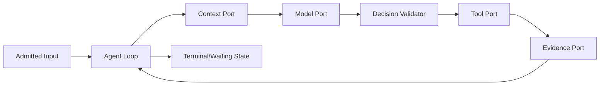
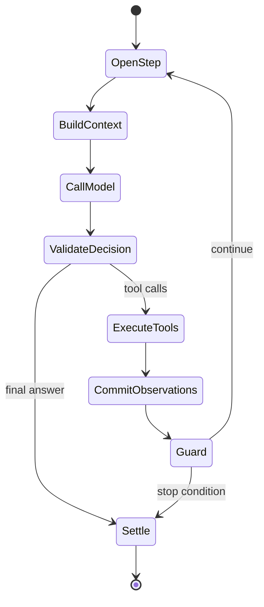

# Agent Loop 状态机设计

## 1. 位置

Loop 是 Runtime 的控制算法，不拥有 Context、模型、工具实现或持久化。它只接受 typed ports 和不可变策略快照。

## 2. 对象与状态

| 对象 | 状态重点 | 终态 |
|---|---|---|
| Run | admitted/running/waiting/interrupted/recovering | completed/failed/cancelled |
| Turn | opened/modeling/acting/settling | completed/failed/cancelled |
| Step | context/model/decision/tool/commit | completed/failed/cancelled/skipped |
| Operation | proposed/authorized/executing/reconciling | succeeded/failed/cancelled |

一个 Turn 可包含多个模型与工具 Step，直到无未决工具、模型给出最终答复或 guard 终止。Turn 完成不等于 Run 的业务目标已验证。

## 3. 主循环

每个转换先验证当前 state/version，后写入相应事件。流式 token 不是领域状态；只有完成或明确终止的模型 response 才形成 Session item。

## 4. Guard 顺序

1. cancellation/deadline；
2. authority/policy 变化；
3. budget（token、cost、steps、wall time）；
4. no-progress/重复 tool signature；
5. terminal business condition；
6. model final intent。

Guard 返回稳定 reason code 与可展示建议；达到上限不是普通“成功回答”。

## 5. 参数

| 参数 | owner | 推荐方式 |
|---|---|---|
| `max_steps` | profile/runtime policy | 按任务 profile；无全局魔法值 |
| `max_wall_time` | command/profile | deadline 贯穿 child/tool/model |
| `no_progress_window` | loop guard | 基于重复决策+无新 Evidence，不只比较文本 |
| `model_retry_budget` | model gateway | 与 step budget 分开 |
| `tool_parallelism` | scheduler/policy | 只并行无冲突、已授权调用 |

## 6. 错误与结算

可恢复错误回到当前 Step 的明确子状态；不可恢复错误先 commit failure evidence，再 settle。结算顺序：停止新工作 → 等待/取消子操作 → 持久化 Observation/usage → checkpoint → append terminal event → 发布客户端更新。

## 7. 验收

用 deterministic fake model/tools 覆盖纯回答、多工具、并行冲突、approval wait、model stream 中断、tool unknown、no-progress、deadline、cancel 和 recovery。事件序列与终态必须可 Snapshot，不能依赖日志文本判断。

