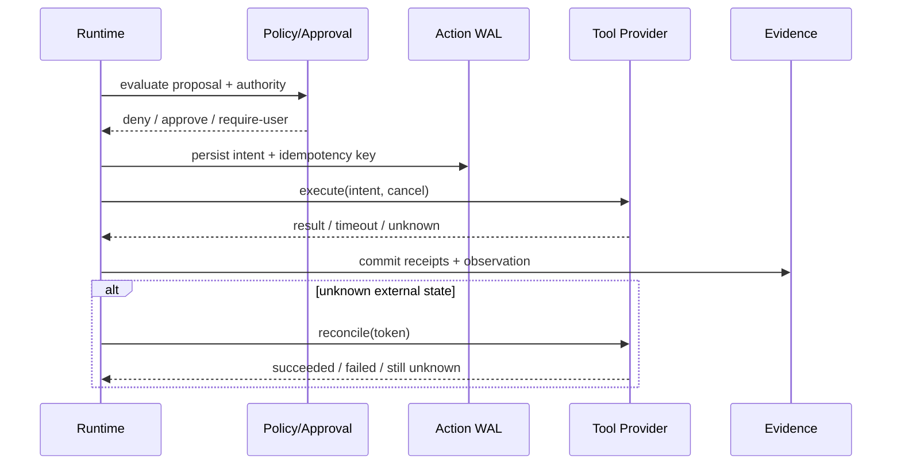

# Tool、Policy、Receipt 与 Observation 设计

## 1. 可信工具管线

```mermaid
flowchart LR
  TC[Model ToolCall] --> V[Schema/Capability Validate]
  V --> P[Policy Evaluate]
  P --> A[Approval if needed]
  A --> I[Intent + Action WAL]
  I --> X[Provider Execute]
  X --> R[Transport Receipt]
  R --> B[Business Verify/Reconcile]
  B --> O[Observation]
  O --> L[Ledger + Context]
```

MCP/tool schema 只说明如何调用；Policy、Approval、幂等、Receipt、业务验证和审计属于 Runtime/Truth 管线。

## 2. 核心对象

| 对象 | 回答的问题 |
|---|---|
| ToolDefinition | 可以传什么参数，返回什么形状 |
| ToolProposal | 模型建议调用什么、理由与预期 |
| PolicyDecision | 当前 actor/scope 是否允许，是否需确认 |
| ActionIntent | 即将产生什么副作用，幂等/回滚/reconcile 信息 |
| TransportReceipt | 调用是否送达、进程/HTTP 层结果 |
| BusinessReceipt | 目标系统是否产生预期业务状态 |
| Observation | 哪些结果可进入下一轮模型及其来源 |

## 3. 时序与未知状态

有副作用的 unknown 不自动重试；先 reconcile。无 reconcile 能力时进入人工确认并展示已知边界。

## 4. Policy 输入

Policy 使用 tool risk、参数规范化结果、workspace root、actor、current authority、profile、资源/sensitivity、网络目标、历史 approval scope。模型文本、旧 Memory 或 Tool 自报风险不能提高权限。

Approval 绑定：normalized intent digest、actor、workspace、tool version、scope、有效期和允许次数。任何关键参数变化都需重新确认。

## 5. 结果裁剪

Observation 保留结构化字段、exit/HTTP、业务验证、artifact refs、truncation 和 redaction 元数据。大输出进入 Artifact；模型只看到有预算的摘要和可按需读取的引用。stderr/HTTP body 不因“像错误”就覆盖业务 verifier。

## 6. 参数

| 参数 | 推荐 |
|---|---|
| `default_risk` | 未知 tool/provider 视为高风险 |
| `approval_cache` | 仅绑定明确 scope/intent；默认不跨 Session |
| `tool_timeout` | 每工具配置并受 Run deadline 上限 |
| `output_limit` | bytes/lines/tokens 三层界限 + artifact spill |
| `retry` | 仅声明幂等且错误可重试，次数受 deadline |
| `business_verifier` | side-effect 工具尽可能必需 |

## 7. 验收

覆盖参数注入、路径逃逸、命令变更后复用 approval、响应丢失、外部状态 unknown、transport success/business failure、输出截断和 cancel race。审计能从 ToolCall 追到 PolicyDecision、Intent、Receipt、Observation 和最终状态。

