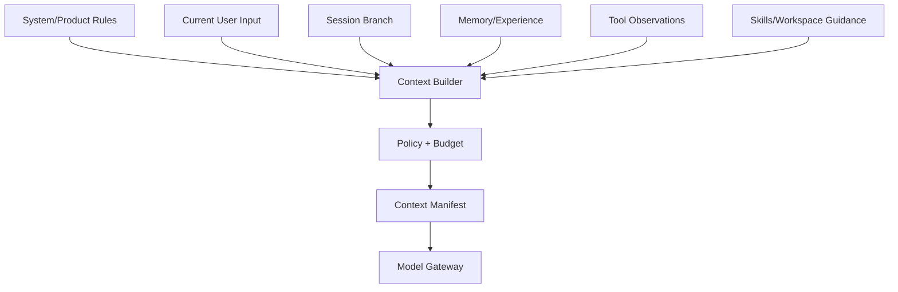
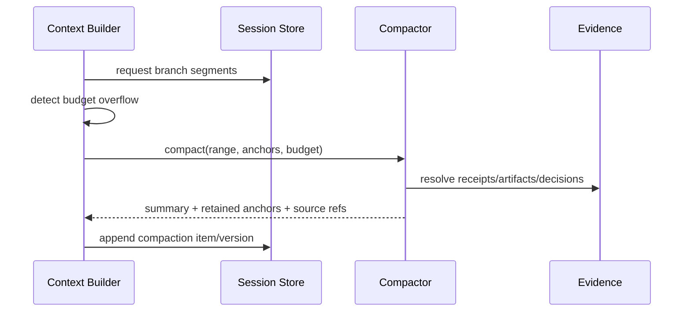

# Context 组装与压缩设计

## 1. 位置与输入



Context Builder 是唯一允许形成模型输入的边界。Provider 不得在背后追加历史、Memory 或厂商特有 system prompt 而不进入 manifest。

## 2. Segment 模型

每个 segment 带 `kind`、内容/ref、source、priority、trust、visibility、token estimate、freshness、redaction、可压缩策略和 stable ID。排序先按 authority/trust layer，再按任务相关性；相似度不能让 Memory 覆盖用户当前指令。

## 3. 预算分配

```text
reserved output + protocol overhead
system/safety floor
current user + active task floor
recent verified observations
session history
retrieved memory/experience
optional repository context
```

先保留硬下限，再分配软预算。超预算时按“去重 → 外置大结果 → 丢低价值 → 局部摘要 → Session compaction”处理，不从中间任意截断 JSON/代码或删除 provenance。

## 4. 压缩模型



Compaction 是 Session 中的派生 item，不删除原事件；摘要必须保留当前目标、未决事项、约束、已做决定、验证结果、失败、Artifact refs 和权限边界。

## 5. Prompt injection 与信任标记

工具输出、仓库文件、网页、Memory 和 Skill 内容均是数据，不自动升级为系统指令。Renderer 用明确分隔和 trust metadata；高风险指令样式内容可标注/降权，但不依赖字符串黑名单保证安全。

## 6. 参数

| 参数 | 推荐 |
|---|---|
| `output_reserve` | 按模型/任务配置，不能耗尽为零 |
| `safety_margin` | 对 tokenizer 误差和 provider overhead 留余量 |
| `compaction_trigger` | 预算预测超限前触发，不等 API 报错 |
| `max_summary_depth` | 限制摘要套摘要；优先回原 Evidence 重建 |
| `tool_output_inline` | 小结果内联，大结果 artifact + focused excerpt |
| `context_manifest_retention` | 与 Run evidence 一致，可脱敏但保留 refs |

## 7. 验收

同一 fixture 在同配置下得到稳定 manifest；压缩前后关键未决事项和证据引用不丢；恶意工具/Memory 指令不改变 authority；预算测算不过限；用户能检查本次为何注入某条 Memory。

