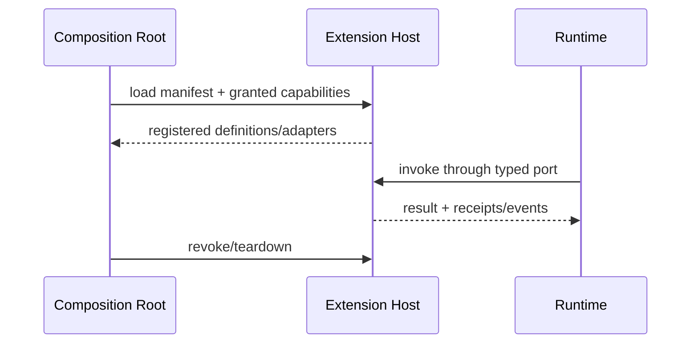

# 能力扩展模型设计

## 1. 统一扩展形态

Skill、MCP、LSP、Terminal、Sandbox、Hook 和第三方 Extension 的协议不同，但都遵守 Definition → Provider → Adapter → Runtime Port；Runtime 不为每种能力增加专用分支。

## 2. 扩展种类

| 类型 | 长生命周期 owner | 接入面 | 特有风险 |
|---|---|---|---|
| Skill | Skill loader/runner | context + optional tools | 非可信指令、版本漂移 |
| MCP | MCP client/connection pool | tools/resources/prompts | 远程能力变化、权限误解 |
| LSP | 可选、只读的代码导航 seam；通过配置的 stdio Provider 连接外部语言服务器 | definition、references、implementation、hover；不含 diagnostics 或代码变更操作 | 进程泄漏、workspace 串扰、执行世界错配 |
| Terminal | terminal manager | tool + event stream | PTY 控制、敏感输出 |
| Sandbox | execution provider | tool providers | 逃逸、能力探测偏差 |
| Hook | hook dispatcher | lifecycle events | 阻塞/递归/隐式副作用 |
| Extension | isolated extension host | 注册上述能力 | 供应链与兼容性 |

## 3. Manifest

Manifest 至少声明：稳定 ID/版本、兼容 API、提供/需要的 ports、配置 schema、权限、网络/文件范围、生命周期、事件订阅、失败策略、签名/来源信息。未声明能力默认拒绝。

## 4. Hook 语义

Hook 分 `observe` 与 `intercept`。Observe 不能改变结果，失败只记录；Intercept 只能用于显式列出的 gate（如 pre-tool policy），按顺序执行并有 deadline。禁止任意 Hook 修改 Ledger 事件或递归触发自身。

## 5. 隔离与兼容

第一方 provider 可同进程；第三方 extension 默认独立进程或受限 worker（具体技术待选）。跨隔离边界只传版本化 schema，不传 callback/复杂对象。Extension 崩溃不得破坏 Session/Evidence 中已提交的事实；被撤权后现有 handles 失效。

## 6. 参数

| 参数 | 推荐 |
|---|---|
| `extension_default` | disabled until explicit enable/grant |
| `api_compat` | 当前 major + 声明 capability negotiation |
| `hook_timeout` | 短、分类配置；intercept 超时默认安全失败 |
| `resource_limit` | process/memory/output/network quotas |
| `hot_reload` | 开发模式可选；生产只对新 Run 生效 |
| `provenance` | source/version/digest 写入 composition plan |

## 7. 验收

Conformance suite 验证注册、schema、取消、超时、teardown、撤权和崩溃隔离；恶意 manifest、未知权限、重复 ID、版本不兼容在启动前失败。待定：扩展签名信任模型和跨平台沙箱实现。
