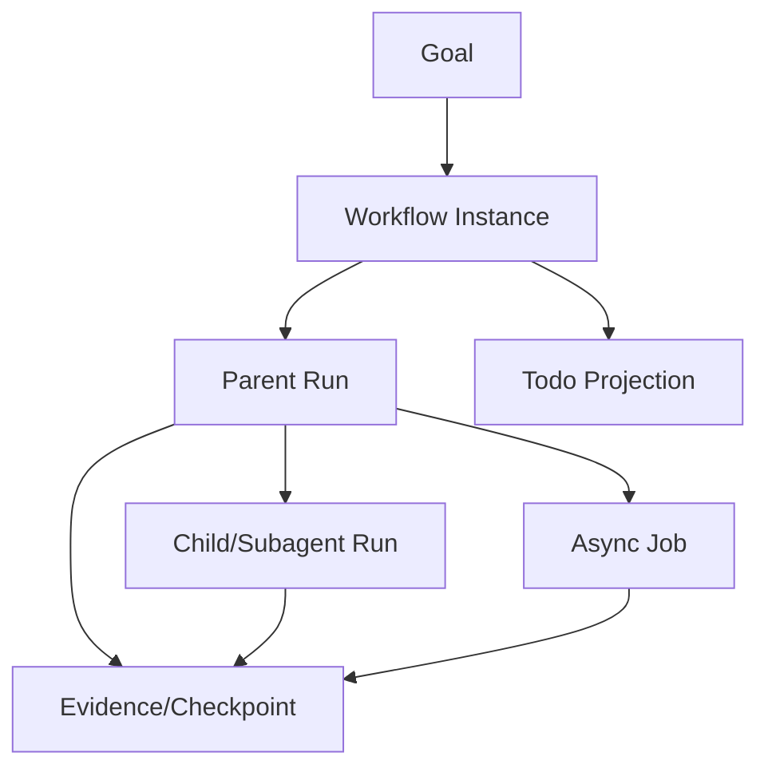
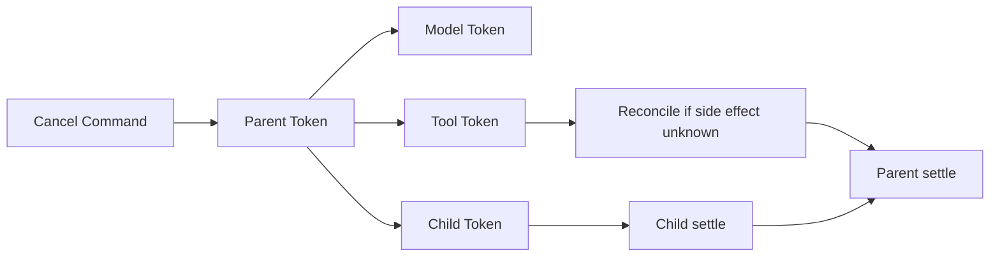
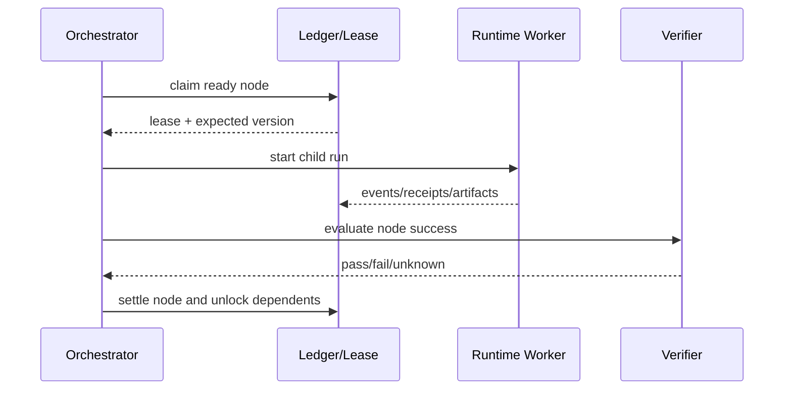

# 编排、取消与恢复设计

## 1. 位置与对象关系

Workflow 是可执行依赖图，Subagent 是 child Run，Team 是多 actor 协调，Job 是异步 operation，Todo 是用户视图。它们共享 IDs/事件，但不共享同一个含糊的 `task` 表。

## 2. Ownership

每个 work item 同时一个 owner lease；父 Run 拥有 child relationship，但 child 有独立状态与证据。父完成前必须明确 child 策略：`join`、`detach`（显式转交 Host）或 `cancel`。默认 `join/cancel`，禁止静默遗留孤儿进程。

## 3. 取消树

取消是请求，不是假设立即完成。每个 provider 返回 `cancelled`、`completed-before-cancel` 或 `unknown/reconciling`；Runtime 等待受限 settle，再写终态。

## 4. Workflow 语义

节点声明 dependencies、input refs、capability/profile、retry policy、timeout、compensation/reconcile、expected artifacts 和 success verifier。只有依赖的业务结果满足才调度；模型文字不能直接标节点成功。

## 5. 恢复与重试

| 状态 | 恢复 |
|---|---|
| 未 claim | 重新入队 |
| lease 过期、无副作用 | 新 owner claim |
| child running 且 owner 可达 | 重新订阅，不启动第二个 child |
| receipt 成功、投影缺失 | 从 Evidence 重建 |
| side effect unknown | reconcile，禁止普通 retry |
| verifier failed | 按节点 policy 修正/重试/终止，不覆盖失败证据 |

## 6. 参数

| 参数 | 推荐 |
|---|---|
| `max_fanout` | profile 和总 budget 双重限制 |
| `lease_ttl/heartbeat` | benchmark 定；至少容忍瞬时卡顿 |
| `cancel_grace` | capability 分类配置，之后标 interrupted/unknown |
| `retry_budget` | 节点级 + workflow 总预算 |
| `detached_child` | 必须有 Host owner 和用户可见 operation |

## 7. 验收

并发 claim 单 owner；父取消覆盖模型、工具和 child；晚到完成不会把 cancelled 父改回成功；Host 重启后不重复执行已成功副作用；空/部分 sweep 有 durable receipt；终态携带完成证据和未解决 operation。
