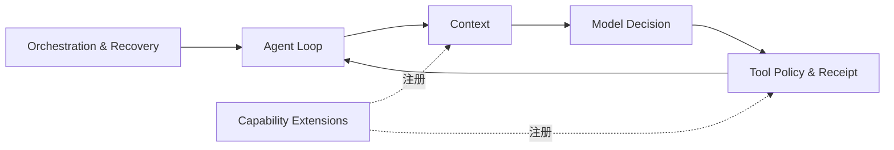
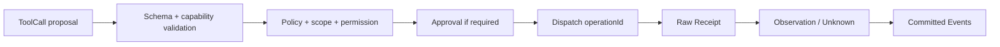

# 05 · Runtime 与能力编排

## 子模块导航



| 子模块 | 评审焦点 |
|---|---|
| [Agent Loop 状态机](01-agent-loop-state-machine.md) | Run/Turn/Step 如何推进和终止 |
| [Tool、Policy 与 Receipt](02-tool-policy-receipt.md) | 调用从提议到业务结果的可信链 |
| [Context 与压缩](03-context-compaction.md) | 上下文如何组装、预算、压缩和证明来源 |
| [能力扩展模型](04-capability-extension-model.md) | Skill/MCP/LSP/Terminal/Hook 等如何接入而不侵入内核 |
| [编排、取消与恢复](05-orchestration-cancellation-recovery.md) | Workflow/Subagent/Team 的所有权和故障语义 |

## 1. Runtime 的最小职责

Agent Runtime 不是“所有能力都放在一起”的包。它只负责让一次任务按可观察、可取消、可恢复的状态机推进：

```text
admit input
→ open turn/step
→ assemble context
→ call model
→ validate decision
→ execute approved tools
→ commit receipts/observations
→ decide continue/stop
→ checkpoint/settle
```

FS、MCP、Memory、LSP、Team、Web 等能力从接缝注册；Runtime 不知道具体 provider 的文件路径、协议或 UI。

## 2. Runtime 对象模型

| 对象 | 生命周期 | Owner | 说明 |
|---|---|---|---|
| Trace | 根任务树 | Trace/Evidence | 跨父子 Agent 的关联根 |
| Session | 可长期恢复 | Session service | 对话与分支容器 |
| Run | 一次执行尝试 | Runtime | 从 start 到 terminal/interrupted |
| Turn | 一批输入到无欠账 | Agent Loop | 可含多个 Step |
| Step | 一次模型请求 + 其工具结果 | Agent Loop | retry 在同一 Step 内有 attempt |
| ToolCall | 模型提出的候选动作 | Tool Executor | 尚不是执行事实 |
| Operation | 外部副作用身份 | Action/WAL | 可跨 retry/reconcile |
| Job | 可后台推进的有界工作 | Jobs service | 与 Run 关联但独立 settlement |

## 3. Agent Loop 阶段

### 3.1 Admission

- 领取一条主输入与允许的 steering/follow-up；
- 固化 active profile、model capability、permission ceiling、workspace 和预算 digest；
- 拒绝无 owner、无 scope 或 Session 正在冲突写入的命令；
- command idempotency 防止客户端重试生成双 Run。

### 3.2 Context assembly

Context Registry 按稳定顺序组装：

1. code-owned base instruction；
2. user/repository instructions；
3. current task/goal/plan；
4. current Session surface；
5. tool schemas；
6. approved Memory/Experience；
7. workspace/code intelligence；
8. transient injections。

每项带 origin、owner、priority、size、hash、retention 和 model visibility。预算不足时按 policy 处理，不能让后注册插件暗中覆盖高优先内容。

### 3.3 Model call

- `prepareCall()` 先解析真实 provider/model/capability；
- 请求对象冻结后才发送；
- provider stream 产生 transient chunks，settlement 后提交 message/attempt；
- retry 必须分类：rate limit、transport、context overflow、invalid response 不共用一个策略；
- 每次 attempt 记录 usage、latency、config digest 与 parent attempt。

### 3.4 Tool execution

详见 §4。工具可能并发执行，但结果写入模型历史必须保持定义好的 source order；barrier tool 或 destructive tool 可以强制整批串行。

### 3.5 Stop decision

结束条件是显式组合：

- 模型自然结束且没有欠账；
- 用户取消；
- budget exhausted；
- no-progress guard；
- policy/approval 终止；
- unreconciled unknown side effect；
- fatal provider/runtime error；
- completed goal/workflow。

每个终止原因有稳定 code 和可读解释。

## 4. Tool Pipeline



### 4.1 ToolCall 不是事实

模型说“调用 write_file”只是一项提案。至少在 `tool.dispatched` 提交后，才能说系统尝试执行；只有 Receipt + Observation 支持时，才能说外部状态改变成功。

### 4.2 Policy 顺序

```text
hard constraint
→ host/profile ceiling
→ user/session preset
→ project policy (only narrow)
→ tool declaration
→ action-specific scope
→ approval token
```

后层不能给前层提权。Approval token 一次性、TTL 有界，并精确绑定 run/action/policy digest/scope；任何失配先消费再拒绝，避免试探复用。

### 4.3 Receipt 与 Observation

| 情形 | Receipt | Observation |
|---|---|---|
| 文件原子写入并 hash 回读一致 | write result | confirmed success |
| shell exit 0 但目标业务状态未检查 | process receipt | attempted/unverified |
| HTTP 200 但 body 表示失败 | HTTP receipt | failed |
| timeout 后外部系统可能已处理 | transport error | unknown + reconcile required |
| policy 拒绝 | 无外部 Receipt | denied before dispatch |

## 5. No-progress Guard

当前 turn budget 只能防无限执行，不能识别“有限轮次里一直重复”。V2 增加多信号守卫：

```ts
interface ProgressFingerprint {
  normalizedToolCalls: string[];
  workspaceDeltaHash?: string;
  diagnosticsHash?: string;
  goalStateHash?: string;
  newEvidenceCount: number;
  unresolvedErrorCodes: string[];
}
```

触发不是简单“同一工具调用两次”，而是连续窗口内：动作高度重复、workspace/diagnostics/goal 无变化、无新证据、同类错误不收敛。守卫可：提醒模型 → 强制复盘 → 降低并发 → 停止并请求用户。阈值属于可配置 policy，硬上限仍不可关闭。

## 6. Context 与 Compaction

### 6.1 原则

- 历史 append-only；compaction 创建 replacement surface，不重写原消息。
- 原文外置到 Artifact，Context 只保留 locator 和 bounded summary。
- Summary 是派生解释，携带 source range 和 provider/model/version。
- Tool output 优先结构化裁剪，再 spill，再考虑模型摘要。
- 每个 injected item 有硬 byte/token/item cap。

### 6.2 KV/cache 稳定

Context Registry 保持稳定段落顺序；变化频繁内容放后，长期 instruction 放前。Memory 只注入任务相关记录，不每轮重排全部候选，减少 cache 前缀抖动。

## 7. Skills、Workflow、MCP、Hooks 的边界

| 能力 | 是什么 | 不是什么 |
|---|---|---|
| Skill | Agent 可按需读取的操作手册与资源 | 任意代码自动执行权限 |
| Workflow | 显式步骤、条件和恢复点组成的执行图 | 开放式 Agent Loop 的别名 |
| MCP | 外部 Tool/Resource/Prompt 的发现与调用协议 | policy、approval、idempotency 或审计 |
| Hook | 已知生命周期点的通知/拦截 | 可以绕过 executor 的后门 |
| Extension | 可逆注册的功能贡献 | 在 Runtime 内任意 monkey patch |

所有模型可见 Skill/Prompt/MCP schema 必须进入 Context Manifest；所有 Hook/Extension 副作用仍经过统一 Tool/Policy 边界。

## 8. Subagent、Team 与 A2A

### 8.1 Subagent

Subagent provider 接受一个冻结 delegation spec：

- task 和 expected output；
- model/provider 或 selection policy；
- tool allowlist；
- workspace/permission scope；
- step/token/time budget；
- parent trace/session/run lineage；
- result contract 和 cancellation ownership。

Provider 可以在进程内 fork 或通过 A2A 协作；ACP 及其他独立编辑器/自动化入口不纳入当前产品范围。父 Runtime 只依赖统一 contract。

### 8.2 Team

Team 在 root Ledger 上持久化 roster、mailbox、task board、lease/heartbeat 和成员状态。派发前可查询 capacity；失联任务回到 open 或 needs-review，不自动盲目重派 destructive task。

### 8.3 A2A 与 MCP

- A2A：Agent↔Agent 的任务、状态、消息和结果。
- MCP：Agent↔Tool/Resource 的能力连接。

两者可以同时存在，但不能用 MCP tool call 假装完整的 Agent lifecycle，也不能让 A2A 结果绕过 evidence/receipt 处理。

## 9. Sandbox 与 execution world

Runtime 使用 `ExecutionWorld` 绑定一组一致 provider：

```ts
interface ExecutionWorld {
  fs: FileSystem;
  subprocess: Subprocess;
  shell: Shell;
  terminal?: Terminal;
  lsp?: LanguageServer;
  sandboxReport: SandboxReport;
}
```

Sandbox 能力必须报告 `enforced / unavailable / disabled / unmet_constraints`，不能将“配置了”显示成“已生效”。Linux、macOS、Windows 的能力差异由 provider 明确，不在 UI 文案里猜测。

## 10. Extensions 与热重载

每次注册是可逆 effect：

- register 返回 disposer；
- reload 先在隔离 staging context 构建；
- 新配置完整验证后原子切换；
- 失败保留旧版本；
- active Run 持有 extension snapshot lease，不在中途换实现；
- dispose 有 timeout、LIFO 顺序和错误隔离；
- extension contribution 有数量/大小上限。

未经信任的第三方代码默认不在 Host 进程内执行。早期扩展系统应继续采用声明/配置贡献，而非开放任意 npm 插件执行。

## 11. Runtime diagnostics

不变量由拥有关系的 package 注册：

- model-visible context 均可从日志重建；
- active Run 只有一个 writer；
- tool dispatch 之前 policy decision 已存在；
- terminal event 后无后续业务 event；
- memory active 记录均有 evidence refs；
- provider registry 卸载后无悬挂贡献；
- background jobs 在 shutdown 后 quiescent。

Diagnostics 报告是查询结果，不修复状态；自动修复需要独立命令和事件。

## 12. 当前 `runtime.ts` 的拆分顺序

1. **先加 boundary gate**，冻结当前 import DAG。
2. **提取纯函数**：id、排序、budget、fingerprint、error classification。
3. **提取 service façade**：Context、Evidence writer、Tool executor，不改变行为。
4. **提取 Run/Turn state machine**，Runtime class 只做协调。
5. **将 feature driver 插件化**：memory recall、team、todo、plan、attachments。
6. **最后缩小 agent-loop**，不能从最复杂主循环第一刀开切。

每一步必须保持 canonical event 顺序、公开 API 和 snapshot 不变；行为改进另开任务。

## 13. Runtime 验收

- Agent Loop 文件控制在可审查规模，且不再是跨域工具箱；
- Tool Pipeline 有一条唯一执行路径；
- no-progress、cancel、retry、unknown/reconcile 有互不混淆的终态；
- Memory、MCP、LSP、Team 可卸载而不改 loop；
- 所有入口共用同一 Runtime service；
- 录制 Session 能在无模型 key 条件下确定性回放；
- 当前 961+ 测试基线（实际数量以执行时为准）不因搬家而降低。
