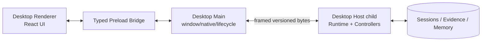

# 06 · 客户端、协议与 Desktop

## 1. 一套业务语义，四种入口

| 入口 | 适合 | Transport | 是否拥有 Runtime 状态 |
|---|---|---|---:|
| CLI/TUI | 终端交互、脚本、一次性任务 | 进程内或 framed stdio | 否 |
| API/SDK | 嵌入、自动化、测试 | versioned RPC/HTTP | 否 |
| Web | 本机浏览器工作台 | HTTP Command/Query + SSE/WebSocket | 否 |
| Desktop | 日常多项目、原生目录与窗口 | private framed pipe + renderer bridge | 否 |

入口只做输入、呈现、连接和平台适配。Session、Run、Memory、Approval、Tool、Workspace 的 owner 都在 Host/Runtime。

## 2. 共享协议核心

目标包：

```text
packages/sdk/protocol     request/response/event schema, minimal deps
packages/sdk/client       reconnect, pagination, command idempotency
packages/sdk/server       protocol dispatch to controllers
packages/api/*            domain controllers
packages/client/store     client-side projections and optimistic UI
```

协议使用资源/动作命名：

```text
session/create
session/read
session/fork
run/start
run/cancel
run/evidence/export
memory/search
memory/review
memory/revoke
workspace/register
settings/read
settings/update
```

Command 请求包含 `commandId`；并发敏感更新包含 `expectedVersion`；分页使用 opaque cursor；错误使用稳定 code + safe message，不回显 secret 或原始不可信输入。

## 3. Durable event 与 live hint

客户端必须区分：

| 流 | 例子 | 能否恢复 | 客户端策略 |
|---|---|---:|---|
| Durable Event | `tool.receipt`、`run.ended`、`memory.activated` | 能 | 以 sequence/cursor 去重并投影 |
| Projection Snapshot | 当前 Run/Session/Team 状态 | 能重建 | 替换本地 durable view |
| Live Hint | token chunk、typing、临时进度 | 不能保证 | 只做体验增强，断线后丢弃 |

Live Hint 不能改变“完成/成功”状态。断线重连时：停止旧 generation → 读取 durable cursor 之后的事件或 snapshot → 再订阅 live stream。

## 4. BFF 与 Controller

Gateway/BFF 负责：

- transport decode/encode；
- authentication/connection scope；
- protocol version negotiation；
- Command/Query route；
- event filtering、pagination 和 backpressure；
- safe error mapping。

Controller 负责：

- 把请求映射到 domain service；
- 检查 resource ownership；
- 维护命令 idempotency；
- 返回 committed identity 或 accepted status。

BFF 不直接打开 JSONL 或 Memory index；UI 也不能用“本地应用”身份绕过 Controller。

## 5. Web 入口

现有 `apps/web` 和 Host/SSE 是可保留基础。V2 收敛点：

- Web 只依赖 `sdk/client` 与 client UI modules，不复制 route DTO；
- 三条现有事件流逐步归一为 durable events、projection snapshot、live hints 三种语义；
- 浏览器不提交任意本机路径，目录选择由 Host provider 完成；
- credential 输入 write-only，client 不持久化 secret；
- replay view 与 live head 有独立 cursor，禁止浏览历史时误发当前命令；
- optimistic state 只覆盖“命令已发送”，收到 committed projection 后替换。

## 6. CLI/TUI 入口

CLI 分成两层：

```text
apps/cli              argv、命令 UX、profile 选择、进程退出码
packages/client/tui   可选终端呈现
packages/sdk/client   与其他客户端同一命令/事件语义
```

支持三种模式：

- interactive TUI；
- one-shot human-readable；
- machine JSON/JSONL。

Machine mode 的 stdout 只输出协议结果；日志走 stderr。命令成功退出码只表示 CLI 命令完成，不自动等价为外部业务副作用成功，结果中仍需 Observation status。

## 7. API 应用

`apps/api` 是可选 headless composition，而不是第二套 Host：

- 复用 `packages/api` controller 和 `sdk/server`；
- profile 明确开放哪些 routes/capabilities；
- 默认 bind loopback；非本机监听必须显式 auth、TLS/反向代理说明和风险提示；
- 不默认暴露本地目录选择、credential 管理或 full-write；
- health 只报告进程/依赖状态，不声称某个业务任务成功。

早期可继续由 `apps/cli serve` 承担启动；当 headless 生命周期和 CLI UX 独立演进时再物理创建 `apps/api`。

## 8. Desktop 设计

### 8.1 技术选择倾向

基于当前 React/Vite/TypeScript 资产，第一选择是 **Electron**：可以复用 Web renderer、Node Host 和跨平台打包经验。Tauri 可在包体/安全需求明确后通过 Agent Note 比较，不应在 V2 文档中假定已决定。

### 8.2 进程模型



职责：

- **Renderer**：和 Web 共用 UI modules，不获得 Node API。
- **Preload**：暴露窄 typed bridge；无任意 channel。
- **Main**：窗口、菜单、更新、原生目录选择、child process 生命周期；不保存 task/session 状态。
- **Desktop Host**：加载 exact-version Runtime、profile 和 client graph；拥有业务状态。

### 8.3 为什么不默认开本机 HTTP 端口

Desktop 使用私有 framed stdio/pipe，减少端口冲突、跨站请求、token 泄漏和版本错配。Node IPC 可负责启动/停止，但业务 RPC 使用有版本 framing，便于与 SDK/测试复用。

### 8.4 Renderer 安全

- `contextIsolation: true`；
- `nodeIntegration: false`；
- CSP 严格，不加载任意远程脚本；
- `shell.openExternal` 使用 URL allowlist；
- 文件路径和 dialog 由 Main/Host 生成 opaque handles；
- Renderer 不读取环境变量和 credential store；
- 版本不匹配时 fail closed，并给出可诊断错误。

### 8.5 数据目录与升级

- Desktop 与 CLI 可共享用户数据，但 runtime executable/plugin state 分开；
- 启动时先验证 Session format 和迁移计划；
- 升级前生成 migration backup/manifest；
- 新 binary 不删除旧 generation；
- plugin/extension 与核心版本不兼容时停用并报告，不自动运行未知代码。

## 9. Client state ownership

| 可留在 Client | 必须留在 Host/Runtime |
|---|---|
| 当前 tab、滚动位置、草稿、折叠、临时筛选 | Session、Run、tool status、approval、todo、team、memory |
| 尚未提交的输入 | 已接纳 inbox/queue |
| optimistic command pending | command result 和事实状态 |
| theme/locale 的本地显示偏好 | 安全 policy、credential、workspace authority |

刷新浏览器或重开窗口后，业务状态必须可从 Host 重新水合。

## 10. 协议兼容性

变更以下任一面都视为 breaking-risk：

- RPC method/field；
- event type/payload；
- cursor/sequence 语义；
- CLI 参数和 JSON 输出；
- config/profile schema；
- Session resume/fork；
- Desktop framing；
- SDK method/error。

流程：先更新 canonical contract → 生成 schema/fixtures → 更新所有消费者 → compatibility test → 文档。不能只改 TypeScript interface 而不验证 wire payload。

## 11. 客户端里程碑

1. 统一 Web/SDK 的 Command/Query/Event vocabulary；
2. 拆 Controller 与 Fastify transport；
3. CLI 改用同一 client/controller；
4. 增加 framed RPC server/client 与协议 conformance；
5. 建 `apps/desktop-host`，先无 GUI smoke；
6. 建 Desktop shell，复用 Web UI；
7. 做 crash/restart、version mismatch、secret、directory picker E2E；
8. 再评估独立 `apps/api` 和 ACP surface。

## 12. 验收标准

- 同一命令从 CLI/Web/Desktop/SDK 产生相同 canonical events；
- Desktop Main/Renderer 中没有 Session/Memory 真源；
- 重连不重复命令、不丢 durable event；
- protocol schema 与实现由 CI 检查新鲜度；
- Desktop 默认不开网络端口，Renderer 无 Node 权限；
- API 非 loopback 监听必须显式鉴权配置；
- 每个客户端都能展示 Memory 来源、unknown 状态和恢复报告，而非只显示聊天文本。

